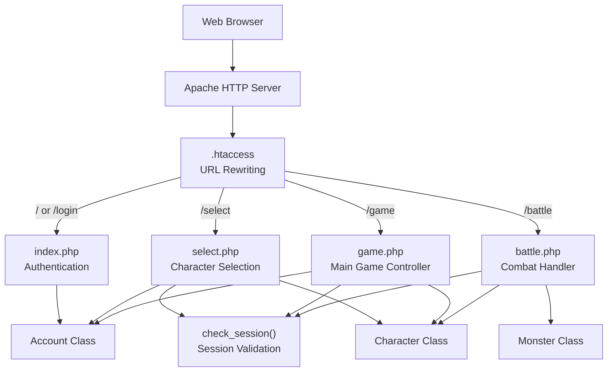
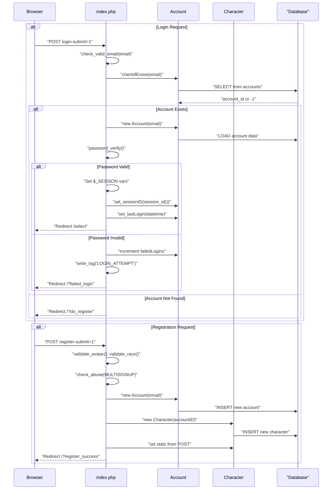
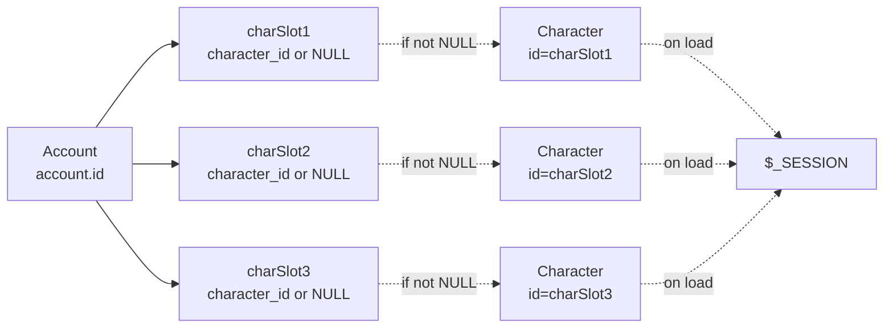
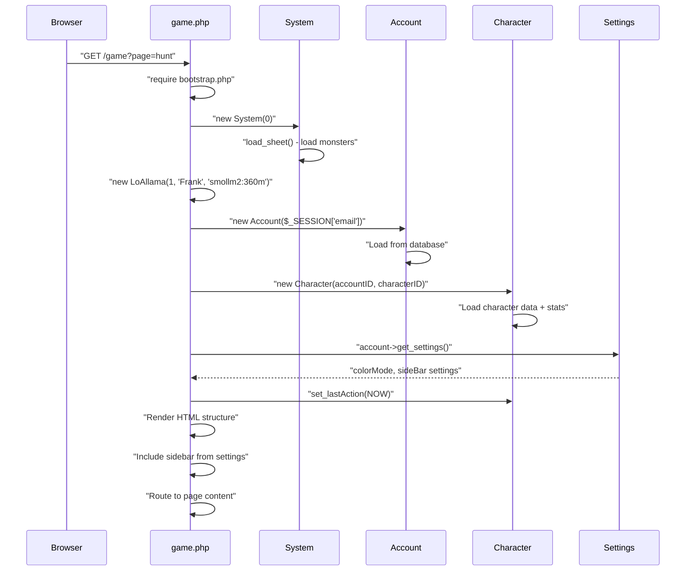
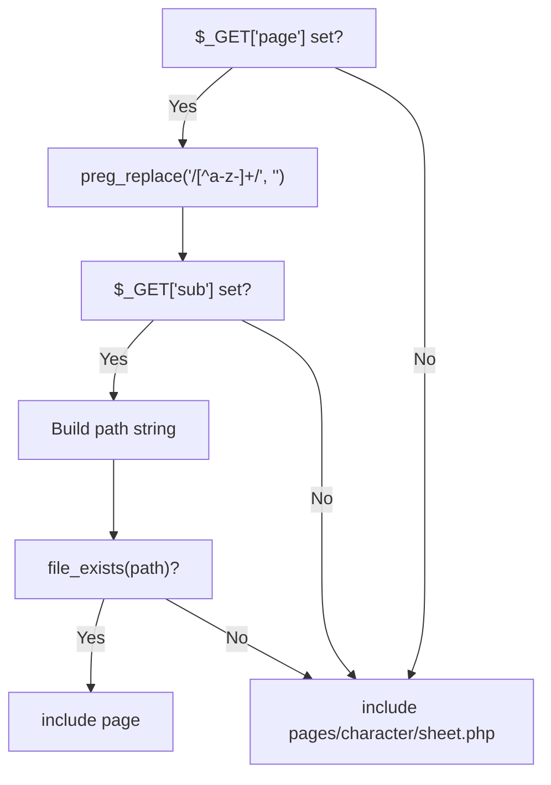
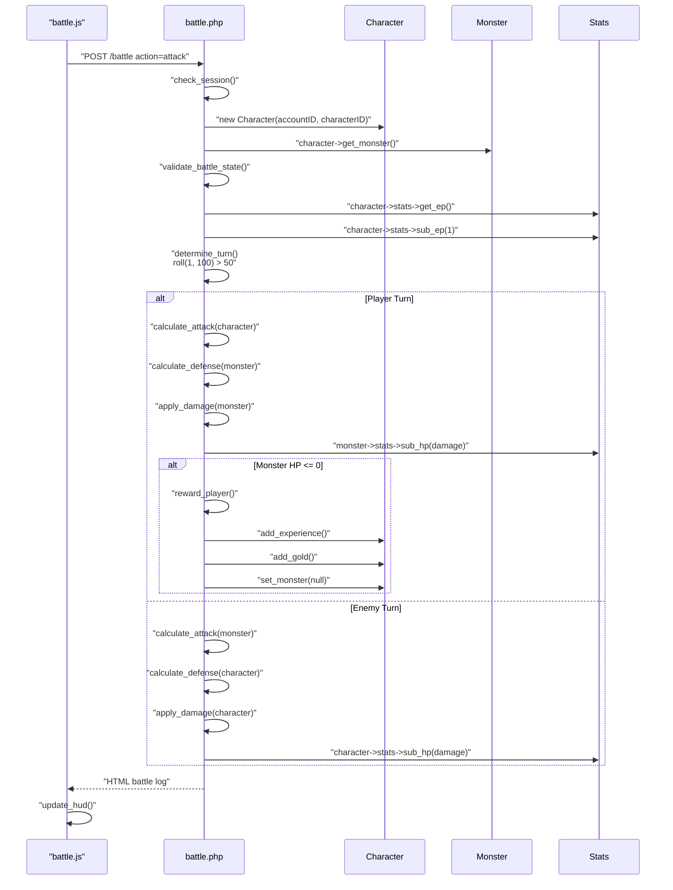
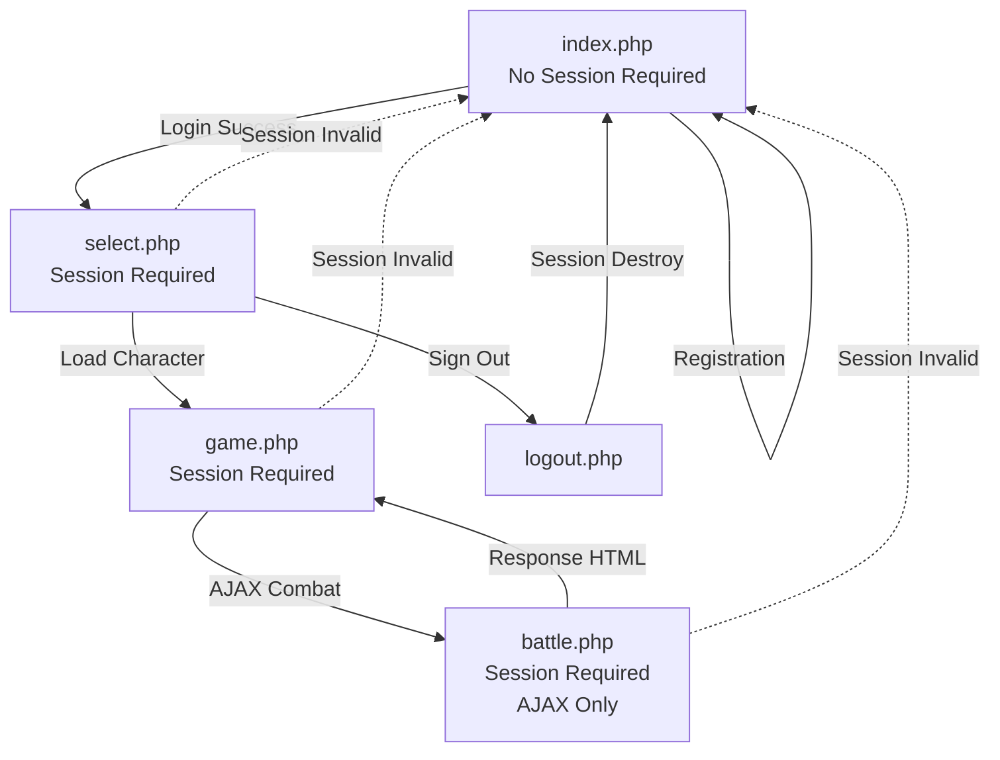

# Entry Points

<details>
<summary>Relevant source files</summary>

The following files were used as context for generating this wiki page:

- [battle.php](battle.php)
- [functions.php](functions.php)
- [game.php](game.php)
- [html/footers.html](html/footers.html)
- [index.php](index.php)
- [js/battle.js](js/battle.js)
- [js/menus.js](js/menus.js)
- [select.php](select.php)
- [src/Monster/Monster.php](src/Monster/Monster.php)

</details>


## Purpose and Scope

This document describes the four primary PHP entry points that handle all user requests in Legend of Aetheria. These controllers serve as the initial handlers for different application states: authentication (`index.php`), character management (`select.php`), gameplay (`game.php`), and combat (`battle.php`). Each entry point validates sessions, processes requests, and routes to appropriate subsystems.

For information about URL routing and `.htaccess` rewriting rules, see [URL Routing](#3.3). For session validation mechanisms, see [Session Management](#3.2).

---

## Entry Point Architecture

The application uses four distinct entry points, each handling a specific phase of the user journey:



**Entry Point Responsibilities**

| Entry Point | Route | Purpose | Session Required | Main Classes |
|------------|-------|---------|-----------------|--------------|
| `index.php` | `/`, `/login` | User authentication and registration | No | `Account`, `Character` |
| `select.php` | `/select` | Character slot management | Yes | `Account`, `Character` |
| `game.php` | `/game` | Main gameplay interface | Yes | `Account`, `Character`, `System`, `LoAllama` |
| `battle.php` | `/battle` | Turn-based combat processing | Yes | `Character`, `Monster` |

**Sources:** [game.php:1-102](), [index.php:1-206](), [select.php:1-181](), [battle.php:1-282]()

---

## index.php - Authentication Entry Point

`index.php` serves as the application's authentication gateway, handling both login and registration requests. This is the only entry point that does not require an active session.

### Request Processing Flow



### Login Processing

The login flow implements rate limiting, abuse detection, and account lockout mechanisms:

**Rate Limiting:** [index.php:17-32]()
- Tracks login attempts by IP address in `logs` table
- Maximum 5 attempts per 15-minute window
- Returns `rate_limited` redirect on threshold breach

**Authentication:** [index.php:40-62]()
```
1. Check if account exists via Account::checkIfExists(email)
2. Load Account object
3. Verify password using password_verify() against bcrypt hash
4. Reset failed login counter on success
5. Set session variables: logged-in, email, account-id, ip, last_activity
6. Update account sessionID and lastLogin timestamp
7. Redirect to /select
```

**Failed Login Handling:** [index.php:64-76]()
- Increment `failedLogins` counter
- Log attempt to `logs` table with type `LOGIN_ATTEMPT`
- Auto-ban account after 10 failed attempts
- Redirect to `/?failed_login`

### Registration Processing

**Validation Chain:** [index.php:82-175]()

| Step | Function | Purpose |
|------|----------|---------|
| 1 | `check_valid_email()` | Sanitize and validate email format |
| 2 | `Account::checkIfExists()` | Prevent duplicate accounts |
| 3 | `validate_avatar()` | Ensure avatar file exists in `img/avatars/` |
| 4 | `validate_race()` | Validate against `Races` enum |
| 5 | Attribute point validation | Ensure `str + def + int === 40` |
| 6 | `check_abuse(MULTISIGNUP)` | Detect multiple signups from same IP |
| 7 | Tampering detection | Check for impossible stat values |

**Account Creation:** [index.php:118-145]()
```
- Generate verification code from session_id hash
- Hash password using PASSWORD_BCRYPT
- Set privileges (ADMINISTRATOR for id=1, else UNVERIFIED)
- Store IP address and registration timestamp
```

**Character Creation:** [index.php:146-165]()
```
- Create first character in slot 1
- Apply attribute points from registration form
- Initialize HP/MP to 100/100
- Apply race-specific stat adjustments via race->set_stat_adjust()
- Set status to Status::HEALTHY
```

**Sources:** [index.php:1-206](), [functions.php:251-259](), [functions.php:431-444](), [functions.php:454-473]()

---

## select.php - Character Selection Entry Point

`select.php` manages the character slot system, allowing users to create, load, and delete up to three characters per account.

### Character Slot Architecture



### Action Processing

`select.php` uses regex-based action detection on POST keys: [select.php:24-38]()

```
Pattern: /^select-(load|delete|new)-(\d+)/
Captures:
  - $matches[1] = action (load/delete/new)
  - $matches[2] = slot (1-3)
```

**Action: Load Character** [select.php:41-52]()
```php
1. Query char_slot{N} from accounts table
2. Create Character object with character_id
3. Set session variables:
   - $_SESSION['focused-slot'] = slot number
   - $_SESSION['character-id'] = character id
   - $_SESSION['name'] = character name
4. Redirect to /game?page=sheet&sub=character
```

**Action: Create New Character** [select.php:53-90]()
```php
1. Extract POST data: character name, race, avatar, stats
2. Validate stats (str + def + int === 40)
3. Tampering detection: check if any stat < 10
4. Get next available character ID via getNextTableID()
5. Update accounts.char_slot{N} = new_character_id
6. Create new Character(accountID)
7. Call character->new(slot)
8. Set name, race, avatar, and stats
9. Redirect to /select (refresh)
```

**Action: Delete Character** [select.php:91-114]()
```php
1. Query char_slot{N} to get character_id
2. Set accounts.char_slot{N} = NULL
3. DELETE FROM characters WHERE id = character_id
4. Log deletion event with account/character IDs
5. Redirect to /select (refresh)
```

### Character Card Rendering

The selection interface renders character cards using `CharacterSelectCard`: [select.php:137-142]()

```php
for ($i = 1; $i < 4; $i++) {
    $char_slot = "get_charSlot$i";
    $char_id = $account->$char_slot();  // Returns NULL if empty
    $card = new CharacterSelectCard($char_id, $i);
    echo $card->render();
}
```

**Sources:** [select.php:1-181](), [functions.php:365-379]()

---

## game.php - Main Game Controller

`game.php` is the primary gameplay interface, dynamically loading page-specific content based on URL parameters while maintaining persistent UI elements (sidebar, chat, HUD).

### Initialization Sequence



### Core Initialization

**Bootstrap and Dependencies:** [game.php:1-16]()
```php
require_once "vendor/autoload.php";
require_once "system/constants.php";
require_once SYSTEM_DIRECTORY . "/bootstrap.php";

use Game\Account\Account;
use Game\Character\Character;
use Game\System\System;
use Game\AI\LoAllama;
```

**Object Construction:** [game.php:18-28]()
```
- System(0): Loads monster definitions via load_sheet()
- LoAllama: AI wrapper for tutorial NPC 'Frank'
- Account: Loaded from $_SESSION['email']
- Character: Loaded from account ID + $_SESSION['character-id']
- Settings: Retrieved via account->get_settings()
```

### Page Routing System

**Privilege Gate:** [game.php:54-59]()
```php
if ($privileges == Privileges::UNVERIFIED->value) {
    include 'html/verify.html';
    exit();
}
```
Blocks unverified accounts from accessing game content.

**Dynamic Page Loading:** [game.php:61-83]()



**Path Construction Logic:**
```
With sub: pages/{sub}/{page}.php
Without sub: pages/character/sheet.php (default)
Example: /game?page=hunt&sub=location → pages/location/hunt.php
```

**Security:** Regex sanitization `[^a-z-]+` allows only lowercase letters and hyphens, preventing path traversal attacks.

### UI Structure

**Main Layout Components:** [game.php:41-102]()

| Component | Element | Purpose |
|-----------|---------|---------|
| Sidebar | Dynamic include from `$sidebar_rel_link` | Navigation menu (type from Settings) |
| Main Section | `#main-section` | Dynamic page content area |
| Chat Widget | `chat/chat.html` | Real-time chat interface |
| Footer | `html/footers.html` | JavaScript includes |
| Toast Container | `#toast-container` | Notification display |

**JavaScript Initialization:** [game.php:45]()
```javascript
loa.u_name = '<?php echo $_SESSION['name']; ?>';
```
Sets global `loa` object with username for client-side scripts.

**Sources:** [game.php:1-102](), [html/footers.html:1-27]()

---

## battle.php - Combat Entry Point

`battle.php` handles turn-based combat as an AJAX endpoint, processing combat actions and returning formatted battle logs.

### Combat Request Flow



### Action Validation

**Battle State Validation:** [battle.php:55-88]()

| Validation | Check | HTTP Code | Message |
|-----------|-------|-----------|---------|
| EP Available | `character->stats->get_ep() > 0` | 401 | "No EP Left" |
| HP Available | `character->stats->get_hp() > 0` | 401 | "No HP Left" |
| Monster Exists | `character->get_monster() != null` | 401 | "No Monster" |
| Monster Alive | `monster->stats->get_hp() > 0` | 401 | "Monster is Dead" |

**EP Cost:** Every combat action consumes 1 EP: [battle.php:86]()

### Turn Determination

**Turn System:** [battle.php:90-98]()
```php
function determine_turn() {
    return roll(1, 100) > 50 ? Turn::PLAYER : Turn::ENEMY;
}
```
50/50 chance determined by random roll.

**Turn Execution:** [battle.php:100-114]()
```php
function do_turn(Turn $current): void {
    [$attacker, $attackee] = $current == Turn::ENEMY ? 
        [$monster, $character] : 
        [$character, $monster];
    
    $roll = roll(1, 100);
    process_combat($attacker, $attackee, $roll, $current);
    
    if ($current == Turn::PLAYER) {
        $character->set_monster($monster);  // Persist state
    }
}
```

### Combat Calculations

**Attack Formula:** [battle.php:158-167]()
```
base_attack = roll(1, attacker->stats->get_str())
if roll === 100:  // Critical hit
    attack = base_attack * 2
else:
    attack = base_attack
```

**Defense Formula:** [battle.php:169-178]()
```
defense = roll(0, defender->stats->get_def() * 0.8)
```
Defense is capped at 80% of DEF stat.

**Damage Calculation:** [battle.php:126-128]()
```
damage = max(0, attack - defense)
```

### Combat Outcomes

**Critical Hit:** [battle.php:136-139]() - Roll = 100
```
damage *= random_float(1.5, 2.0, 2)  // 1.5x-2.0x multiplier
```

**Miss:** [battle.php:140-142]() - Roll = 0
- Attack deals no damage
- 30% chance for counter-attack (50% of attacker's STR)

**Block:** [battle.php:143-148]() - Damage ≤ 0
- 30% chance for parry (25% of defender's STR damage to attacker)
- Otherwise, 1 damage dealt to defender

**Regular Hit:** [battle.php:149-155]()
- Damage applied to target HP
- Check if target HP ≤ 0

### Victory Rewards

**Player Victory:** [battle.php:267-278]()
```php
function reward_player() {
    $exp_gained = $monster->get_expAwarded();
    $gold_gained = $monster->get_goldAwarded();
    
    $character->add_experience($exp_gained);
    $character->add_gold($gold_gained);
    $character->set_monster(null);
    
    $out_msg .= "Victory! You gained $exp_gained experience and $gold_gained gold!";
}
```

**HUD Update:** [js/battle.js:107-144]()

The client polls `/hud` endpoint after each combat action to refresh character and monster stats in the UI.

**Sources:** [battle.php:1-282](), [js/battle.js:1-144]()

---

## Request Flow Patterns

### Common Session Validation Pattern

All entry points except `index.php` use the `check_session()` function: [functions.php:503-526]()

```
1. Verify $_SESSION['logged-in'] == 1
2. Query session_id from accounts table
3. Compare database session_id with session_id()
4. Return false on mismatch
```

**Usage Pattern:**
```php
// select.php
if (check_session()) {
    // Process request
} else {
    header('Location: /?no_login');
    exit();
}

// battle.php (AJAX endpoint)
if (!check_session()) {
    http_response_code(401);
    exit("Not logged in");
}
```

### CSRF Token Validation

Game actions require CSRF token validation: [functions.php:550-559]()
```php
function check_csrf($req_csrf): bool {
    if ($req_csrf != $_SESSION['csrf-token']) {
        $_SESSION = [];
        session_destroy();
        header('Location: /?csrf_fail');
        exit();
    }
    return true;
}
```

Used in AJAX requests: [js/battle.js:79]()
```javascript
body: `action=${which}&type=${atk_type}&csrf-token=${csrf_token}`
```

### Redirect Pattern

All entry points use consistent redirect patterns with query parameters for user feedback:

| Pattern | Example | Meaning |
|---------|---------|---------|
| Success | `/?register_success` | Show success toast |
| Error | `/?failed_login` | Show error toast |
| State | `/?do_register&email=user@example.com` | Pre-fill form |
| Security | `/?csrf_fail` | CSRF validation failed |

Toast generation is handled client-side by `toasts.js` based on URL parameters.

**Sources:** [functions.php:503-559](), [js/battle.js:52-87]()

---

## Entry Point Interaction Matrix



**Transition Summary:**

| From | To | Trigger | Method |
|------|----|---------| -------|
| `index.php` | `select.php` | Successful login | `header('Location: /select')` |
| `index.php` | `index.php` | Registration complete | `header('Location: /?register_success')` |
| `select.php` | `game.php` | Character loaded | `header('Location: /game?page=sheet&sub=character')` |
| `game.php` | `battle.php` | Combat action | `fetch('/battle', { method: 'POST' })` |
| `battle.php` | `game.php` | Combat result | AJAX response (HTML fragment) |
| Any | `index.php` | Session invalid | `header('Location: /?no_login')` |
| `select.php` | `/logout` | Sign out button | User click → session destroy |

**Sources:** [index.php:60-80](), [select.php:51-114](), [game.php:54-83](), [battle.php:23-45](), [js/battle.js:73-86]()