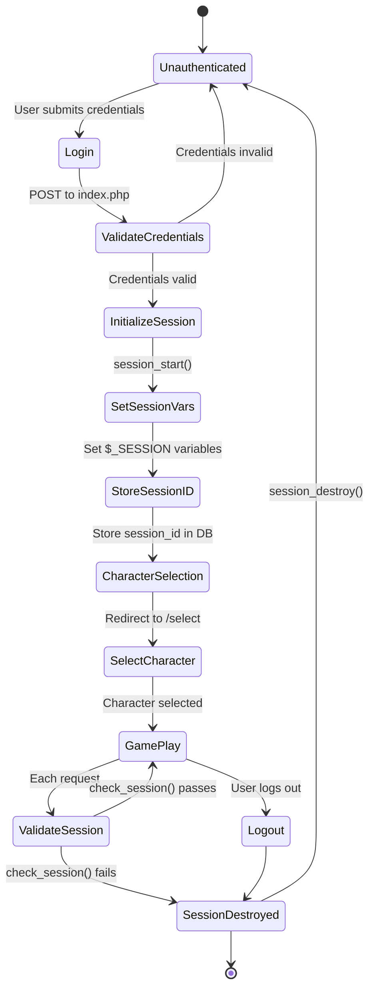
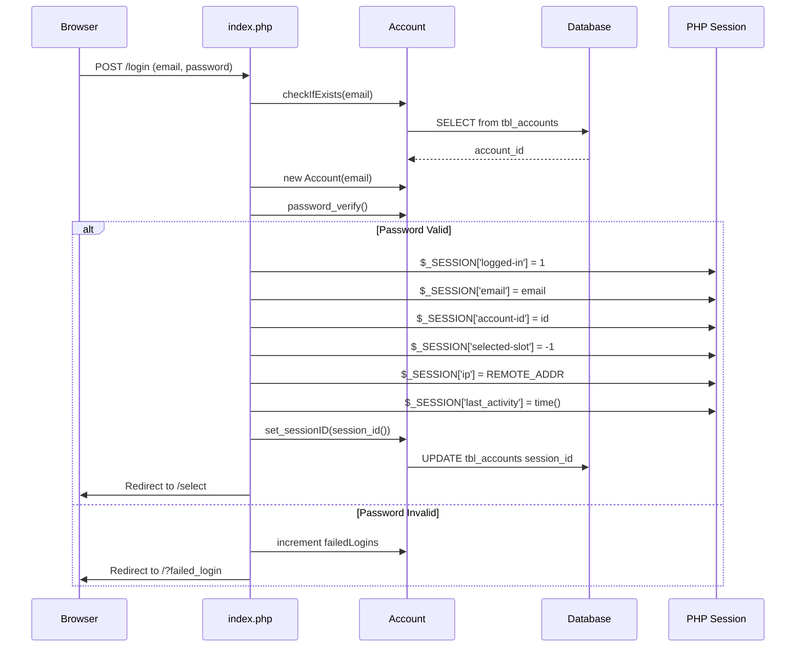
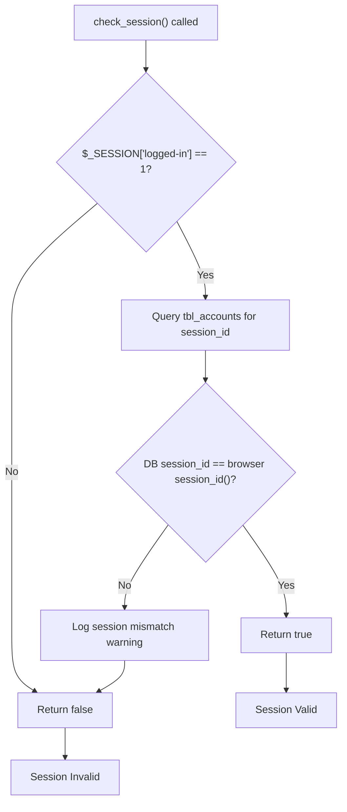
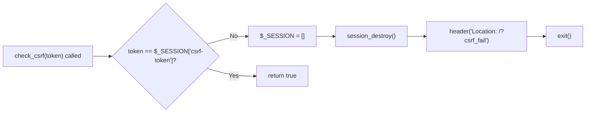
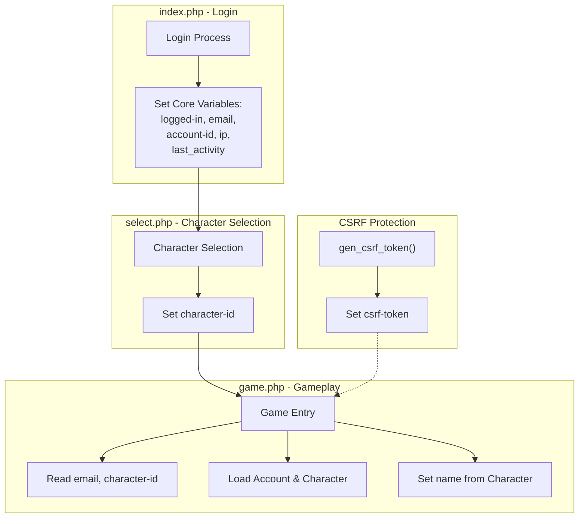
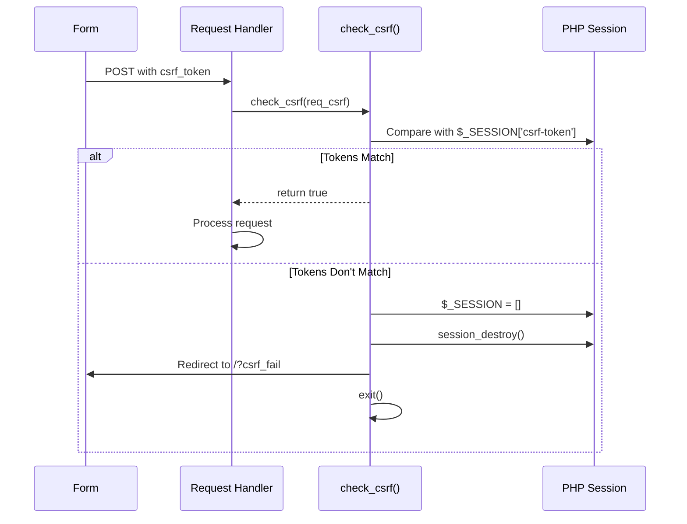
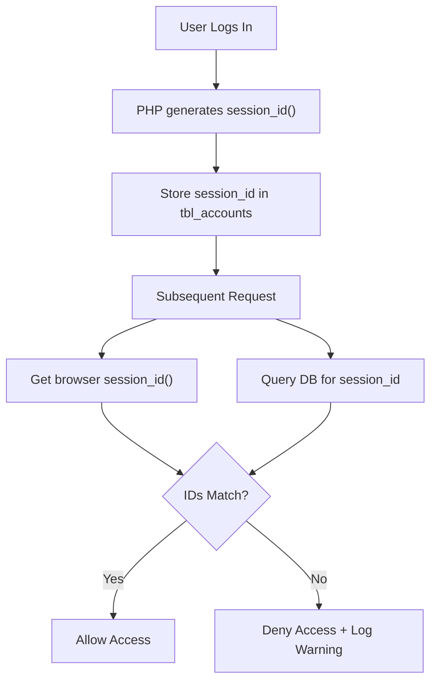
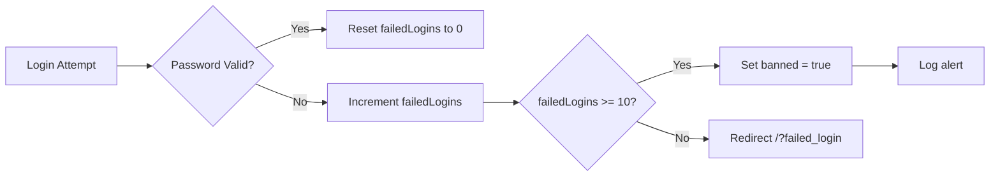
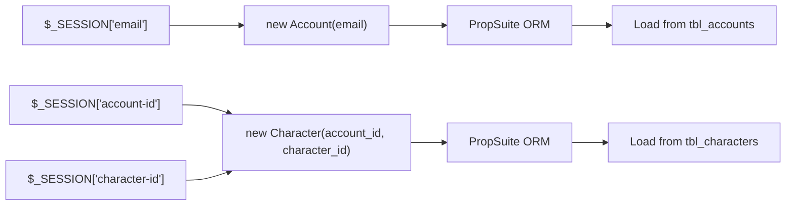

# Session Management

<details>
<summary>Relevant source files</summary>

The following files were used as context for generating this wiki page:

- [admini/strator/system/functions.php](admini/strator/system/functions.php)
- [functions.php](functions.php)
- [game.php](game.php)
- [index.php](index.php)
- [js/functions.js](js/functions.js)
- [navs/nav-login.php](navs/nav-login.php)
- [navs/sidemenus/nav-quicknav.php](navs/sidemenus/nav-quicknav.php)

</details>


## Purpose and Scope

This document describes the PHP session handling system in Legend of Aetheria, including session initialization, validation, security mechanisms, and data persistence. Session management is responsible for maintaining authenticated user state across HTTP requests and enforcing security policies.

For information about user authentication and login, see [Login System](#4.2). For privilege-based access control, see [Privilege System](#4.3).

---

## Session Lifecycle

### Session Flow Diagram



**Sources:** [index.php:12-81](), [game.php:18-39](), [functions.php:503-526]()

### Session Initialization

Session initialization occurs during successful login in `index.php`. The process follows these steps:

1. **Credential Verification**: User email and password are validated using `password_verify()` against the hashed password stored in the database
2. **Session Variable Assignment**: Core session variables are populated
3. **Database Persistence**: The PHP `session_id()` is stored in the `accounts` table
4. **Redirection**: User is redirected to character selection



**Sources:** [index.php:46-61]()

### Session Validation

Every protected page validates the session using the `check_session()` function before rendering content. This function performs two critical checks:

| Check | Description | Failure Action |
|-------|-------------|----------------|
| Session Variable | Verifies `$_SESSION['logged-in'] == 1` | Return `false` |
| Session ID Match | Compares browser `session_id()` with database `session_id` | Return `false`, Log warning |



**Sources:** [functions.php:503-526](), [admini/strator/system/functions.php:241-264]()

### Session Destruction

Sessions are explicitly destroyed in two scenarios:

1. **CSRF Validation Failure**: When CSRF token mismatch is detected
2. **User Logout**: When user explicitly logs out (implied in system)

The `check_csrf()` function demonstrates session destruction on security violation:



**Sources:** [functions.php:550-559]()

---

## Session Data Structure

The following session variables are maintained throughout the user's session:

### Core Session Variables

| Variable | Type | Set During | Purpose |
|----------|------|------------|---------|
| `$_SESSION['logged-in']` | int | Login | Authentication flag (1 = authenticated) |
| `$_SESSION['email']` | string | Login | User's email address |
| `$_SESSION['account-id']` | int | Login | Account primary key |
| `$_SESSION['selected-slot']` | int | Login | Character slot selection (-1 = none) |
| `$_SESSION['ip']` | string | Login | User's IP address |
| `$_SESSION['last_activity']` | int | Login | Unix timestamp of login |
| `$_SESSION['character-id']` | int | Character Selection | Selected character ID |
| `$_SESSION['name']` | string | Game Entry | Character name (for display) |
| `$_SESSION['csrf-token']` | string | CSRF Generation | CSRF protection token |

**Sources:** [index.php:50-55](), [game.php:22-34](), [functions.php:535-539]()

### Session Variable Usage



**Sources:** [index.php:50-55](), [game.php:22-34]()

---

## Session Security

### CSRF Protection

Cross-Site Request Forgery (CSRF) protection is implemented through token generation and validation:

#### CSRF Token Generation

The `gen_csrf_token()` function creates a unique token composed of random bytes and a signature:

```
Token Structure: [28 random hex chars] + "L04D" + [28 random hex chars]
Total Length: 60 characters
```

The token is stored in `$_SESSION['csrf-token']` and logged for debugging.

**Sources:** [functions.php:535-540]()

#### CSRF Token Validation

The `check_csrf()` function validates submitted tokens:



**Sources:** [functions.php:550-559]()

### Session Fixation Prevention

The system prevents session fixation attacks by:

1. **Database Session ID Storage**: Storing `session_id()` in the `accounts` table upon login
2. **Continuous Validation**: Comparing browser session ID with database session ID on every request
3. **Mismatch Logging**: Logging warnings when session IDs don't match



**Sources:** [index.php:57](), [functions.php:510-523]()

### Rate Limiting

Login attempts are rate-limited by IP address to prevent brute force attacks:

| Parameter | Value |
|-----------|-------|
| Window | 15 minutes |
| Max Attempts | 5 |
| Log Type | `LOGIN_ATTEMPT` |
| Failure Action | Redirect to `/?rate_limited` |

**Sources:** [index.php:17-32]()

### Failed Login Tracking

The system tracks failed login attempts per account:

- **Counter**: `failedLogins` field in `accounts` table
- **Increment**: On each failed password verification
- **Reset**: On successful login
- **Lockout Threshold**: 10 failed attempts triggers account ban



**Sources:** [index.php:46-76]()

---

## Implementation Details

### check_session() Function

The `check_session()` function is defined in `functions.php` and used as a guard on all protected pages:

**Function Signature:**
```php
function check_session(): bool
```

**Implementation Logic:**

1. Check if `$_SESSION['logged-in']` is set and equals `1`
2. If not, return `false` immediately
3. Query `tbl_accounts` for `session_id` WHERE `id` = `$_SESSION['account-id']`
4. If query returns no result, log warning and return `false`
5. Compare database `session_id` with `session_id()`
6. If mismatch, log warning with both IDs and return `false`
7. If match, return `true`

**Sources:** [functions.php:503-526]()

### Database Session Persistence

The `accounts` table includes a `session_id` column that stores the PHP session identifier:

| Field | Type | Purpose |
|-------|------|---------|
| `session_id` | varchar | Stores PHP `session_id()` for validation |

**Update Query:**
```sql
UPDATE tbl_accounts SET session_id = ? WHERE id = ?
```

This is executed via the PropSuite ORM using `$account->set_sessionID(session_id())`.

**Sources:** [index.php:57](), [functions.php:510]()

### Entry Point Session Checks

Different entry points handle session validation differently:

#### game.php
- **Implicit Check**: Assumes session is valid (relies on prior validation)
- **Reads**: `$_SESSION['email']`, `$_SESSION['character-id']`
- **Sets**: `$_SESSION['name']` from loaded Character object

**Sources:** [game.php:22-34]()

#### index.php
- **No Check**: This is the login/registration page
- **Creates Session**: On successful login

**Sources:** [index.php:1-206]()

#### Protected Pages Pattern
Protected pages should call `check_session()` before rendering content. If it returns `false`, the page should redirect to the login page.

**Sources:** [functions.php:503-526]()

---

## Session Integration with Game Systems

### Account and Character Loading

Session variables directly feed into entity instantiation:



**Sources:** [game.php:22-23]()

### Session Variables in UI

The session name variable is exposed to client-side JavaScript for dynamic UI updates:

```javascript
loa.u_name = '<?php echo $_SESSION['name']; ?>';
```

This allows the frontend to display the character name without additional AJAX requests.

**Sources:** [game.php:45]()

### Admin Panel Session

The admin panel (`admini/strator`) maintains a separate implementation of `check_session()` that follows the same pattern but may have different redirect behavior.

**Sources:** [admini/strator/system/functions.php:241-264]()

---

## Security Considerations

### Session Configuration

While not visible in the provided files, the system likely configures PHP session settings in the bootstrap or configuration files. Recommended settings include:

- `session.use_strict_mode = 1`: Reject uninitialized session IDs
- `session.cookie_httponly = 1`: Prevent JavaScript access to session cookie
- `session.cookie_secure = 1`: Require HTTPS for session cookie (production)
- `session.cookie_samesite = Strict`: CSRF protection

**Sources:** Referenced in high-level architecture diagrams

### IP Lock Feature

The session stores the user's IP address (`$_SESSION['ip']`) for optional IP locking, which can prevent session hijacking when enabled on the account.

**Sources:** [index.php:54]()

### Last Activity Tracking

The `$_SESSION['last_activity']` timestamp enables session timeout implementation, though the timeout logic is not visible in the provided files.

**Sources:** [index.php:55]()