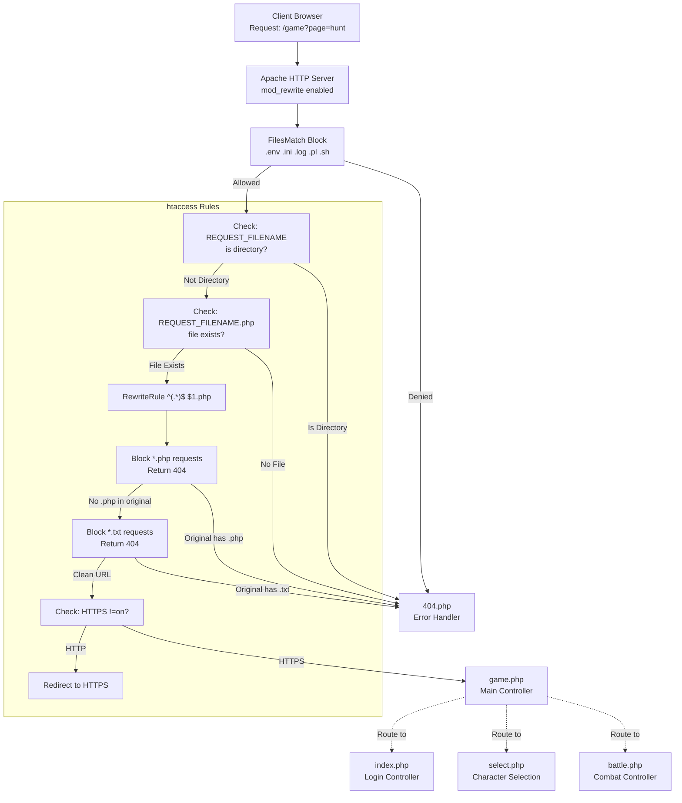
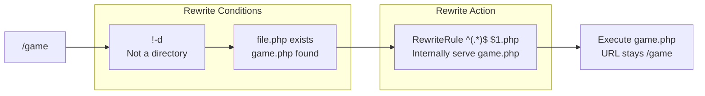
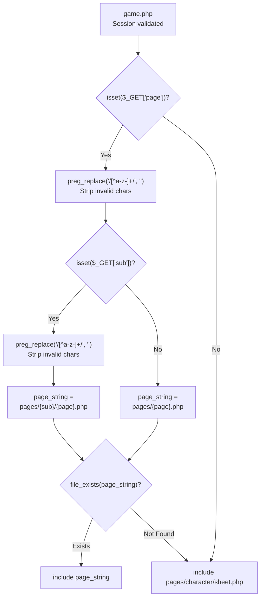
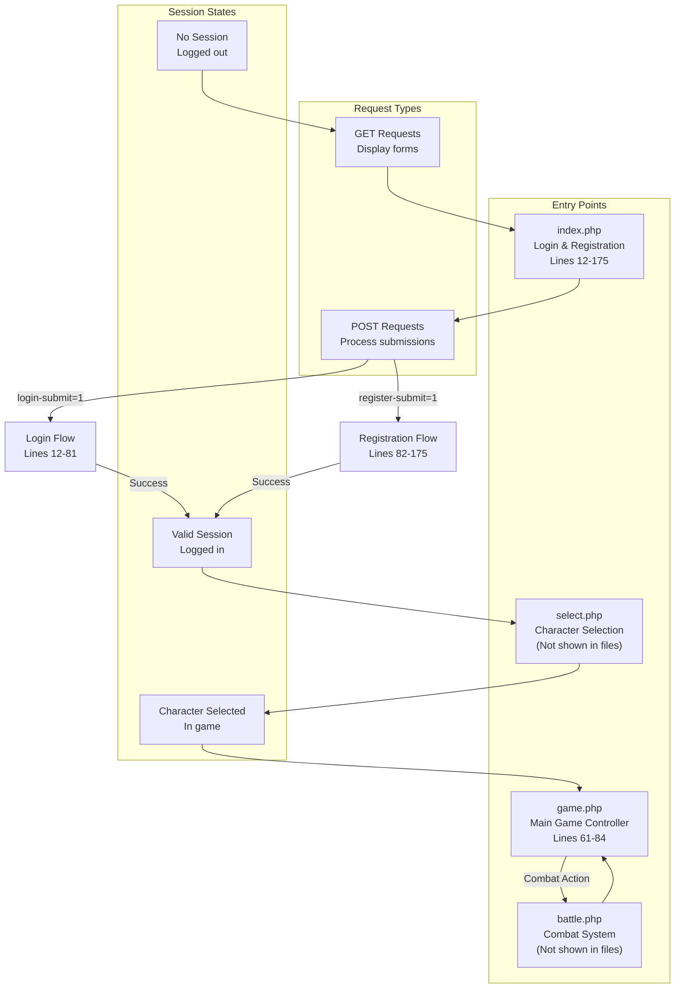
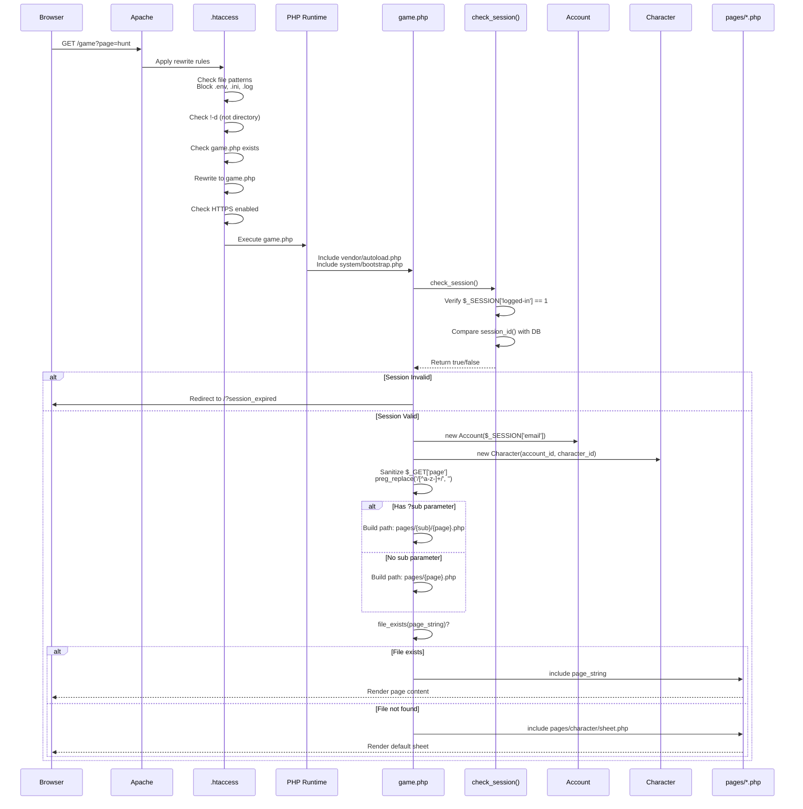

# URL Routing

<details>
<summary>Relevant source files</summary>

The following files were used as context for generating this wiki page:

- [.htaccess](.htaccess)
- [functions.php](functions.php)
- [game.php](game.php)
- [index.php](index.php)

</details>


**Purpose & Scope**: This document explains the URL routing system in Legend of Aetheria, covering Apache mod_rewrite rules, PHP extension hiding, page parameter-based routing, and request flow from client to PHP controllers. For session validation and security mechanisms applied during routing, see [Session Management](#3.2). For the main application controllers that handle routed requests, see [Entry Points](#3.1).

---

## Overview

Legend of Aetheria implements a multi-layered URL routing architecture that transforms user-friendly URLs into PHP controller invocations. The system operates in four distinct layers:

1. **Apache Layer**: `.htaccess` mod_rewrite rules hide `.php` extensions and enforce HTTPS
2. **Security Layer**: File access restrictions block sensitive files (`.env`, `.ini`, `.log`, `.pl`)
3. **Controller Layer**: Entry point PHP files (`index.php`, `select.php`, `game.php`, `battle.php`)
4. **Dynamic Routing Layer**: Page parameter system in `game.php` includes content based on URL parameters

This architecture enables clean URLs like `/game?page=hunt` instead of `/game.php?page=hunt.php`, improving both security and user experience.

**Sources**: [.htaccess:1-22](), [game.php:61-84]()

---

## URL Rewriting Architecture



**Diagram: Apache mod_rewrite URL Routing Flow**

The `.htaccess` file implements a cascading filter system that processes every request through multiple security and routing checks before reaching PHP controllers.

**Sources**: [.htaccess:1-22]()

---

## File Access Protection

The routing system enforces strict file access controls at the Apache level to prevent exposure of sensitive configuration and source files.

| File Pattern | Description | Access Rule |
|-------------|-------------|-------------|
| `*.env` | Environment variables | `Require all denied` |
| `*.ready` | Installation state markers | `Require all denied` |
| `*.template` | Configuration templates | `Require all denied` |
| `*.pl` | Perl installer scripts | `Require all denied` |
| `*.ini` | PHP/application config | `Require all denied` |
| `*.log` | Application logs | `Require all denied` |
| `*.sh` | Shell scripts | `Require all denied` |

These restrictions are enforced via `FilesMatch` directive before any rewrite rules execute, ensuring attackers cannot access sensitive files even through path traversal attempts.

**Sources**: [.htaccess:2-4]()

---

## PHP Extension Hiding

The routing system hides `.php` extensions from URLs through a two-phase approach:

### Phase 1: Extension Removal (Lines 6-10)



**Diagram: Extension-Free URL Resolution**

The `RewriteCond %{REQUEST_FILENAME} !-d` condition ensures the requested path is not a directory, while `RewriteCond %{REQUEST_FILENAME}.php -f` verifies that appending `.php` produces a valid file path. If both conditions pass, Apache internally appends `.php` and serves the file without changing the browser's URL.

### Phase 2: Extension Blocking (Lines 12-14)

```
RewriteCond %{THE_REQUEST} "^[^ ]* .*?\.php[? ].*$"
RewriteRule .* - [L,R=404]
```

After the extension-removal rule, a second rule checks if the **original HTTP request** contained `.php`. If detected, the server returns a 404 response. This prevents direct access to PHP files via URLs like `/game.php`, forcing users to use clean URLs like `/game`.

**Sources**: [.htaccess:6-14]()

---

## HTTPS Enforcement

All HTTP requests are redirected to HTTPS through a simple rewrite rule:

```
RewriteCond %{HTTPS} !=on [NC]
RewriteRule ^.*$ https://%{SERVER_NAME}%{REQUEST_URI} [R,L]
```

This rule checks if `HTTPS` is not enabled and performs an external redirect (`[R,L]`) to the HTTPS version of the requested URL, preserving the full request URI including query parameters.

**Sources**: [.htaccess:20-21]()

---

## Page Parameter Routing System

Once a request reaches `game.php`, the application implements a secondary routing system using URL parameters to dynamically include content pages.



**Diagram: game.php Page Parameter Routing Logic**

### Sanitization and Security

The page parameter system applies strict input sanitization through regex patterns:

- **Page Parameter**: `preg_replace('/[^a-z-]+/', '', $_GET['page'])` - Only lowercase letters and hyphens
- **Sub Parameter**: `preg_replace('/[^a-z-]+/', '', $_GET['sub'])` - Same restriction

This regex-based approach prevents path traversal attacks (e.g., `../../etc/passwd`) by removing all characters except lowercase letters and hyphens.

### Routing Examples

| URL | Sanitized Page | Sanitized Sub | Resolved Path | Fallback |
|-----|----------------|---------------|---------------|----------|
| `/game?page=hunt` | `hunt` | `null` | `pages/pages/character/sheet.php` | Yes (file doesn't exist) |
| `/game?page=sheet` | `sheet` | `null` | `pages/pages/character/sheet.php` | Default path |
| `/game?page=profile&sub=admin` | `profile` | `admin` | `pages/admin/profile.php` | If exists |
| `/game?page=../../../etc/passwd` | `etcpasswd` | `null` | `pages/etcpasswd.php` | Yes (sanitized) |
| `/game` | N/A | N/A | `pages/character/sheet.php` | Default |

### Default Routing Behavior

When no `page` parameter is provided or the requested file doesn't exist, the system defaults to the character sheet:

```php
include 'pages/character/sheet.php';
```

This ensures users always see valid content even when navigation parameters are invalid or missing.

**Sources**: [game.php:61-84]()

---

## Entry Point Controllers

The routing system directs requests to four primary PHP entry points, each handling distinct application concerns:



**Diagram: Entry Point Routing by Session State**

### index.php - Authentication Controller

Handles two distinct POST flows:

1. **Login Flow** [index.php:12-81]()
   - Validates email format via `check_valid_email()`
   - Rate limits to 5 attempts per IP per 15 minutes
   - Verifies password using `password_verify()`
   - Sets session variables: `logged-in`, `email`, `account-id`, `selected-slot`
   - Redirects to `/select` on success

2. **Registration Flow** [index.php:82-175]()
   - Validates character name, avatar, race selection
   - Checks attribute point allocation (must equal `STARTING_ASSIGNABLE_AP`)
   - Detects multi-signup abuse via `check_abuse(AbuseType::MULTISIGNUP, ...)`
   - Creates `Account` and `Character` objects
   - Hashes password with `password_hash($password, PASSWORD_BCRYPT)`
   - Redirects to `/?register_success` with toast notification

### game.php - Main Game Controller

Acts as the central routing hub for all in-game content:

- **Privilege Check** [game.php:54-59](): Blocks `UNVERIFIED` users with verification notice
- **Session Loading** [game.php:22-23](): Instantiates `Account` and `Character` from session
- **Page Routing** [game.php:61-84](): Dynamically includes content based on `?page=` and `?sub=` parameters
- **Sidebar Integration** [game.php:27-28](): Loads navigation based on user settings

### Redirect Patterns

Controllers use header redirects with query parameters for user feedback:

```php
header('Location: /?csrf_fail');
header('Location: /?rate_limited');
header('Location: /?invalid_email');
header('Location: /?register_success');
header('Location: /select');
header('Location: /game?page=sheet');
```

These query parameters trigger toast notifications via JavaScript (see [Toast Notifications](#7.4)).

**Sources**: [index.php:12-175](), [game.php:22-84]()

---

## Complete Request Flow



**Diagram: Complete Request Routing Sequence**

This sequence illustrates the complete journey of a request from browser to rendered content, showing all validation, sanitization, and routing decisions along the way.

**Sources**: [.htaccess:1-22](), [game.php:1-84](), [functions.php:503-526]()

---

## Routing Security Measures

The URL routing system implements multiple security layers to prevent common web vulnerabilities:

### 1. Path Traversal Prevention

**Regex Sanitization**: [game.php:66,70]()
```php
$requested_page = preg_replace('/[^a-z-]+/', '', $_GET['page']);
$requested_sub = preg_replace('/[^a-z-]+/', '', $_GET['sub']);
```

Removes all characters except lowercase letters and hyphens, neutralizing attempts like `?page=../../etc/passwd`.

### 2. File Existence Validation

**Explicit Check**: [game.php:77-81]()
```php
if (file_exists($page_string)) {
    include "$page_string";
} else {
    include 'pages/character/sheet.php';
}
```

Prevents arbitrary file inclusion by verifying the constructed path exists before including.

### 3. Direct PHP Access Blocking

**.htaccess Rule**: [.htaccess:12-14]()
```
RewriteCond %{THE_REQUEST} "^[^ ]* .*?\.php[? ].*$"
RewriteRule .* - [L,R=404]
```

Returns 404 for any request containing `.php` in the original HTTP request line, preventing direct access to source files.

### 4. Session Validation

**Session Check**: [functions.php:503-526]()

Every protected page calls `check_session()` which:
- Verifies `$_SESSION['logged-in'] == 1`
- Compares browser `session_id()` with database `session_id`
- Prevents session fixation and hijacking attacks

### 5. Privilege-Based Access Control

**Privilege Gating**: [game.php:54-59]()
```php
if ($privileges == Privileges::UNVERIFIED->value) {
    include 'html/verify.html';
    exit();
}
```

Blocks unverified users from accessing game content, enforcing email verification requirement.

**Sources**: [game.php:54-84](), [.htaccess:12-14](), [functions.php:503-526]()

---

## Error Handling

The routing system provides user-friendly error handling through multiple mechanisms:

### 404 Error Document

**Configuration**: [.htaccess:1]()
```
ErrorDocument 404 /404.php
```

All routing failures (missing files, blocked extensions, invalid paths) display a custom 404 page instead of Apache's default error.

### Query Parameter Feedback

Controllers redirect to URLs with error codes that trigger toast notifications:

| Query Parameter | Meaning | Source |
|----------------|---------|--------|
| `csrf_fail` | CSRF token mismatch | [functions.php:554]() |
| `rate_limited` | Too many login attempts | [index.php:30]() |
| `invalid_email` | Email format validation failed | [index.php:36]() |
| `failed_login` | Password verification failed | [index.php:75]() |
| `register_success` | Account created successfully | [index.php:167]() |
| `account_exists` | Email already registered | [index.php:172]() |

These parameters are processed by client-side JavaScript to display contextual feedback to users.

### Default Fallback Routing

When page routing fails, the system gracefully falls back to the character sheet:

```php
include 'pages/character/sheet.php';
```

This ensures users never see blank pages or PHP errors due to routing issues.

**Sources**: [.htaccess:1](), [index.php:30-172](), [functions.php:554](), [game.php:80]()