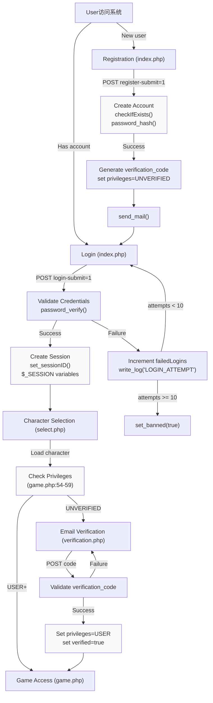
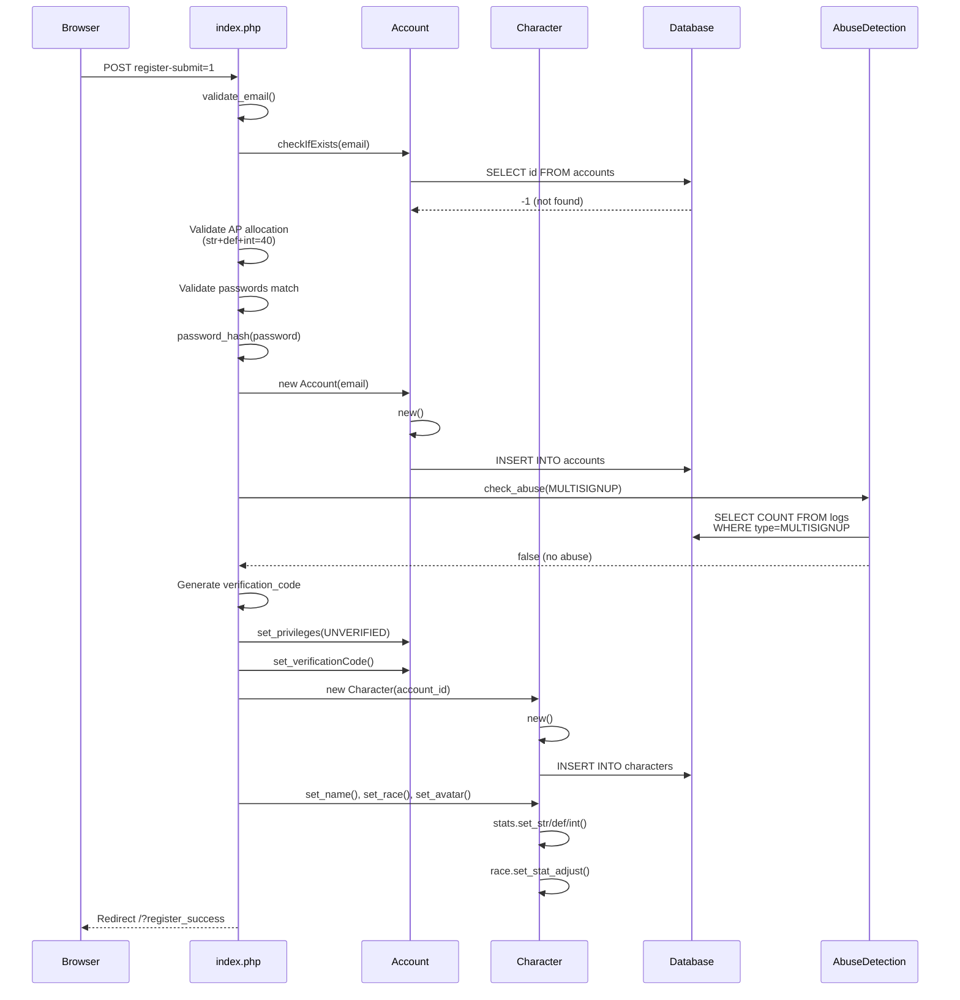
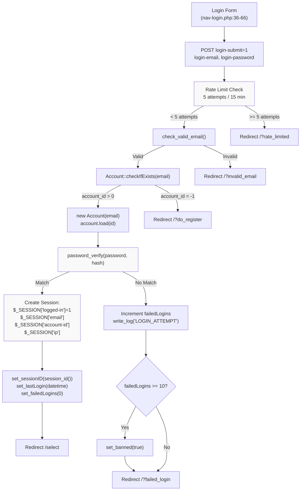
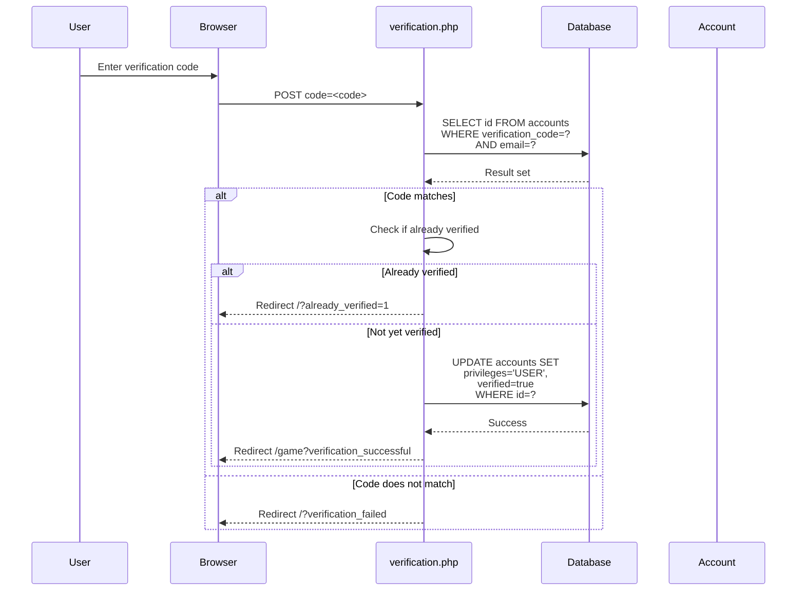
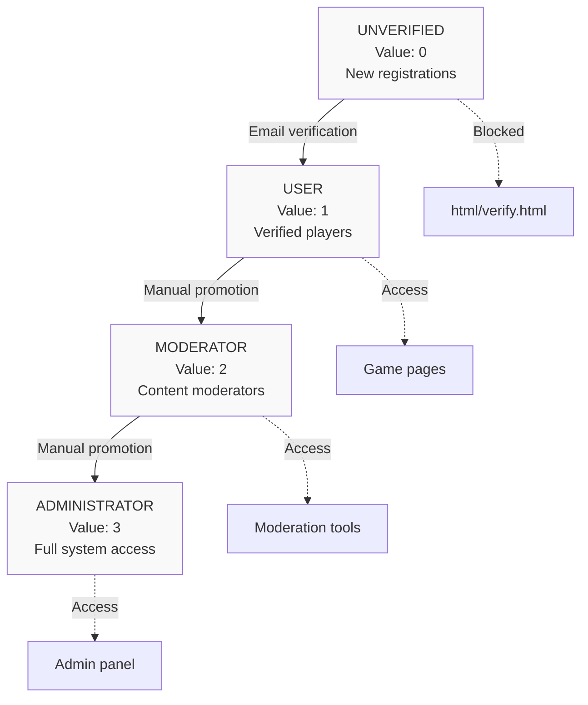
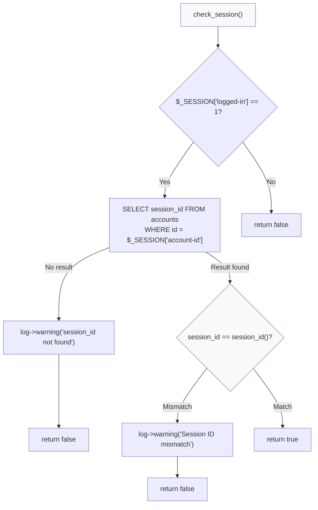
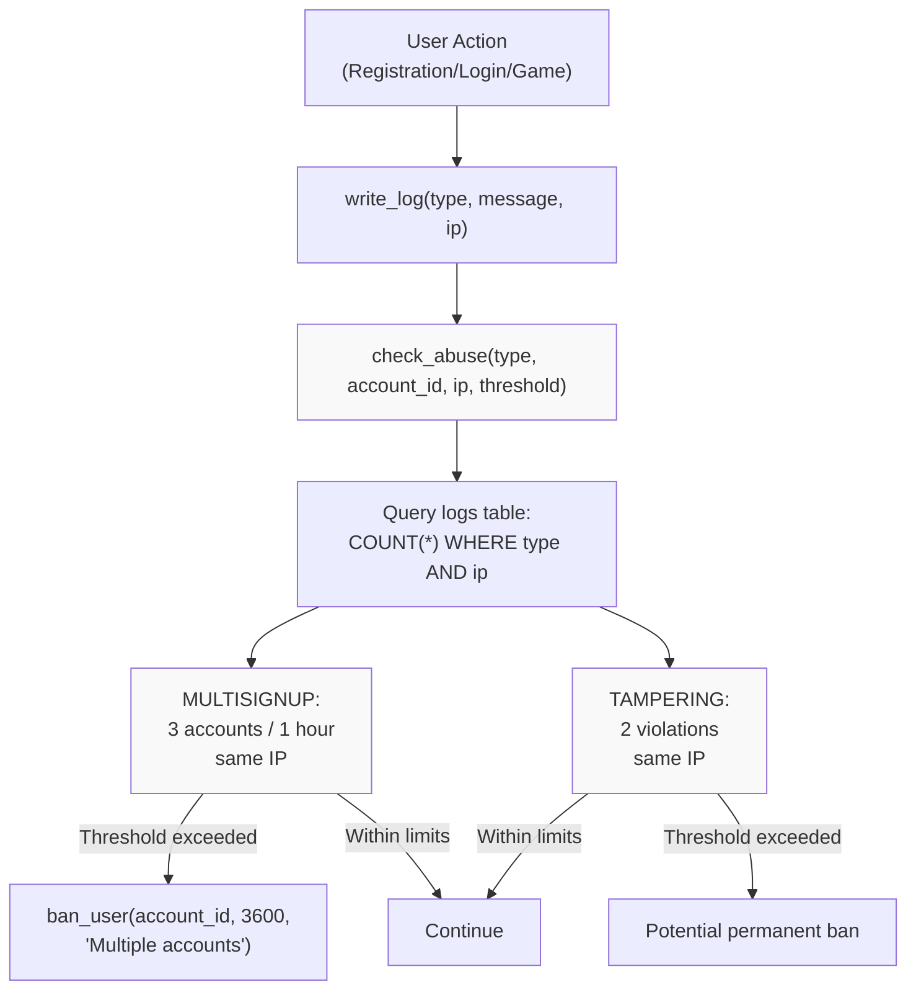
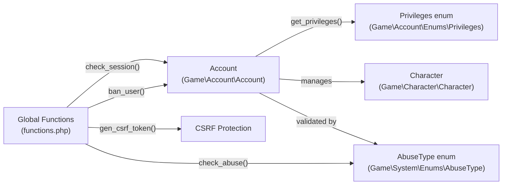

# Authentication & Authorization

<details>
<summary>Relevant source files</summary>

The following files were used as context for generating this wiki page:

- [functions.php](functions.php)
- [game.php](game.php)
- [index.php](index.php)
- [js/functions.js](js/functions.js)
- [navs/nav-login.php](navs/nav-login.php)
- [navs/nav-status.php](navs/nav-status.php)
- [save.php](save.php)
- [verification.php](verification.php)

</details>


This document covers the authentication and authorization systems in Legend of Aetheria, including user registration, login, email verification, privilege levels, session management, and security measures. These systems control how users prove their identity and what resources they can access within the application.

For information about character selection and slot management after successful authentication, see [Character Management](#5.1). For details about the session-based routing and page access control, see [Session Management](#3.2).

---

## Overview

The authentication and authorization layer implements a defense-in-depth security model with multiple layers of protection:

- **Account-based authentication** using email/password credentials with bcrypt hashing
- **Tiered privilege system** controlling access to game features and administrative functions  
- **Email verification** requiring confirmation before granting user privileges
- **Session management** with database-backed validation and CSRF protection
- **Abuse detection** preventing multi-account creation and parameter tampering
- **Rate limiting** on login attempts to prevent brute force attacks
- **IP locking** for optional account-level IP address restrictions
- **Ban system** supporting temporary and permanent account suspensions

Sources: [index.php:1-206](), [game.php:1-102](), [functions.php:503-559](), [verification.php:1-56]()

---

## Authentication Flow Overview



**Authentication Flow Diagram**: This diagram shows the complete authentication lifecycle from initial access through login/registration, email verification, and privilege-based access control.

Sources: [index.php:12-175](), [game.php:54-59](), [verification.php:23-54]()

---

## User Registration

The registration process creates both an `Account` entity and an initial `Character` entity in a single transaction. Registration validation occurs at multiple levels: client-side, server-side, and database-level.

### Registration Process



**Registration Sequence Diagram**: Shows the multi-step registration process including validation, account creation, abuse detection, and initial character creation.

Sources: [index.php:82-175](), [navs/nav-login.php:69-276]()

### Registration Form Fields

| Field | Input Name | Validation | Purpose |
|-------|-----------|------------|---------|
| Email | `register-email` | `check_valid_email()` | Account identifier |
| Password | `register-password` | bcrypt hash | Authentication credential |
| Password Confirm | `register-password-confirm` | Must match password | Prevent typos |
| Character Name | `register-character-name` | Regex `/[^a-zA-Z0-9_-]+/` | Initial character name |
| Race | `race-select` | `validate_race()` | Character race enum |
| Avatar | `avatar-select` | `validate_avatar()` | Character portrait |
| Strength | `str-ap` | 10-30, total=40 | Base STR stat |
| Defense | `def-ap` | 10-30, total=40 | Base DEF stat |
| Intelligence | `int-ap` | 10-30, total=40 | Base INT stat |

Sources: [navs/nav-login.php:84-240](), [index.php:96-103]()

### Attribute Point Allocation

Users receive 10 attribute points (AP) to distribute across three stats during registration. Each stat starts at 10, and users must allocate all 10 additional points before submitting the form. The constant `STARTING_ASSIGNABLE_AP` defines this value.

**Client-side validation** ([navs/nav-login.php:243-273]()):
- Prevents submission if AP remaining > 0
- Prevents submission if race not selected
- Prevents submission if avatar not selected
- Validates password confirmation match

**Server-side validation** ([index.php:113-132]()):
- Checks `$str + $def + $int === STARTING_ASSIGNABLE_AP`
- Detects tampering if any stat < 10 or > 30
- Logs `AbuseType::TAMPERING` for invalid stat distributions
- Triggers abuse detection after threshold violations

The `stat_adjust()` JavaScript function ([js/functions.js:14-43]()) manages AP allocation in the UI.

Sources: [navs/nav-login.php:191-240](), [index.php:101-132](), [js/functions.js:14-43]()

### Race and Avatar Validation

Both race and avatar selections undergo server-side validation to prevent POST manipulation:

```php
// Race validation against Races enum
$race = validate_race($_POST['race-select']);

// Avatar validation against filesystem
$avatar = validate_avatar('avatar-' . $_POST['avatar-select'] . '.webp');
```

**Race validation** ([functions.php:431-444]()):
- Iterates through `Races::cases()` enum values
- Returns matching enum on valid input
- Logs critical error on mismatch
- Returns `Races::random_enum()` as fallback

**Avatar validation** ([functions.php:454-473]()):
- Scans `img/avatars` directory for available files
- Defaults to `avatar-unknown.webp` if invalid
- Logs critical error with submitted value

Sources: [functions.php:431-473](), [index.php:98-99]()

### Email Verification Code Generation

The verification code is generated using a multi-step hashing and shuffling process ([index.php:89-93]()):

```php
$verification_code  = strrev(hash('sha256', session_id()));
$verification_code .= substr(hash('sha256', strval(random_int(0,100))), 0, VERIFICATION_CODE_LENGTH);
$tmp_arr = str_split($verification_code);
shuffle_array($tmp_arr, 1000);
$verification_code = join('', $tmp_arr);
```

1. Reverse SHA256 hash of session ID
2. Append truncated SHA256 hash of random integer
3. Split into character array
4. Shuffle 1000 times using `shuffle_array()` ([functions.php:605-613]())
5. Rejoin into final code string

The code is stored in `accounts.verification_code` and sent via email (function call commented out at [index.php:166]()).

Sources: [index.php:89-93](), [functions.php:605-613]()

### Abuse Detection During Registration

The system checks for multi-account abuse immediately after account creation ([index.php:122-125]()):

```php
if (check_abuse(AbuseType::MULTISIGNUP, $account->get_id(), $ip_address, 3)) {
    ban_user($account->get_id(), 3600, "Multiple accounts within allotted time frame");
    exit();
}
```

The `check_abuse()` function ([functions.php:272-298]()) queries the logs table:

```sql
SELECT COUNT(*) as count FROM logs 
WHERE `type` = 'MULTISIGNUP' 
AND `ip` = ? 
AND `date` BETWEEN (NOW() - INTERVAL 1 HOUR) AND NOW()
```

If more than 3 accounts created from the same IP within 1 hour, the user receives a 1-hour ban via `ban_user()` ([functions.php:408-421]()).

Stat tampering detection ([index.php:128-132]()) logs violations:

```php
if ($str < 10 || $def < 10 || $int < 10 || ($str + $int + $def) > 40) {
    write_log(AbuseType::TAMPERING->name, "Sign-up attributes modified", $ip);
    check_abuse(AbuseType::TAMPERING, $account->get_id(), $ip, 2);
}
```

Sources: [index.php:122-132](), [functions.php:272-298](), [functions.php:408-421]()

---

## Login System

### Login Authentication Flow



**Login Flow Diagram**: Complete login authentication process with rate limiting, credential validation, and session creation.

Sources: [index.php:12-81](), [navs/nav-login.php:36-66]()

### Rate Limiting

The login system implements rate limiting to prevent brute force attacks ([index.php:17-32]()):

```sql
SELECT COUNT(*) as attempt_count 
FROM logs 
WHERE `ip` = ? 
AND `type` = 'LOGIN_ATTEMPT'
AND `date` > DATE_SUB(NOW(), INTERVAL 15 MINUTE)
```

**Rate limit parameters:**
- **Window**: 15 minutes
- **Threshold**: 5 attempts
- **Action**: Redirect to `/?rate_limited`
- **Logging**: `write_log('LOGIN_ATTEMPT', 'Failed login attempt', $ip)`

Failed login attempts are logged regardless of rate limit status ([index.php:67]()).

Sources: [index.php:17-32](), [functions.php:391-396]()

### Password Verification

Password verification uses PHP's `password_verify()` function with bcrypt hashes ([index.php:46]()):

```php
if (password_verify($password, $account->get_password())) {
    // Successful authentication
    $account->set_failedLogins(0);
    // ... create session
}
```

**Password hashing** during registration ([index.php:116]()):
```php
$password = password_hash($password, PASSWORD_BCRYPT);
```

The `Account` class stores the password hash in the `accounts.password` column via the PropSuite trait.

Sources: [index.php:46-62](), [index.php:116]()

### Failed Login Tracking

Each account tracks failed login attempts in `accounts.failed_logins` ([index.php:64-73]()):

```php
$failed_attempts = $account->get_failedLogins() + 1;
$account->set_failedLogins($failed_attempts);

write_log('LOGIN_ATTEMPT', 'Failed login attempt', $ip);

if ($failed_attempts >= 10) {
    $account->set_banned(true);
    $log->alert('Account locked due to excessive failed attempts',
        ['email' => $email, 'ip' => $ip]);
}
```

**Automatic ban after 10 failed attempts:**
- Sets `accounts.banned = true`
- Logs alert-level message
- Does not set expiration (permanent until manually unbanned)

Successful login resets the counter to 0 ([index.php:48]()).

Sources: [index.php:64-73](), [index.php:48]()

### Session Creation

Successful authentication creates a PHP session with multiple security-related variables ([index.php:50-58]()):

```php
$_SESSION['logged-in'] = 1;
$_SESSION['email'] = $account->get_email();
$_SESSION['account-id'] = $account->get_id();
$_SESSION['selected-slot'] = -1;
$_SESSION['ip'] = $ip;
$_SESSION['last_activity'] = time();
```

The session ID is stored in the database for validation ([index.php:57]()):
```php
$account->set_sessionID(session_id());
$account->set_lastLogin(date('Y-m-d H:i:s'));
```

After session creation, users are redirected to `/select` for character selection.

Sources: [index.php:50-60]()

---

## Email Verification

Users with `Privileges::UNVERIFIED` must verify their email before accessing game content. The verification gate is enforced in `game.php` ([game.php:56-59]()):

```php
if ($privileges == Privileges::UNVERIFIED->value) {
    include 'html/verify.html';
    exit();
}
```

### Verification Code Validation



**Verification Sequence Diagram**: Shows the email verification code validation process and privilege upgrade.

Sources: [verification.php:23-54]()

### Verification Logic

The verification process ([verification.php:23-54]()):

1. **Validate code against database**:
   ```php
   $sql_query = "SELECT `id` FROM {$t['accounts']} 
                 WHERE `verification_code` = ? AND `email` = ?";
   $results = $db->execute_query($sql_query, [$verification_code, $account->get_email()]);
   ```

2. **Check if already verified**:
   ```php
   if ($account->get_verified() === true || $current_privs >= Privileges::USER) {
       header("Location: /game?already_verified=1");
       exit();
   }
   ```

3. **Upgrade privileges**:
   ```php
   $sql_query = "UPDATE {$t['accounts']} 
                 SET `privileges` = '" . Privileges::USER->value . "', 
                     `verified` = true 
                 WHERE `id` = {$account->get_id()}";
   ```

The verification system also supports resending verification emails via `/?resend=1` ([verification.php:17-21]()).

Sources: [verification.php:23-54](), [verification.php:17-21]()

---

## Authorization System

### Privilege Levels

The system implements a four-tier privilege hierarchy via the `Privileges` enum:



**Privilege Hierarchy Diagram**: Shows the four privilege levels and their access boundaries.

| Privilege | Numeric Value | Default Route | Access Control |
|-----------|---------------|---------------|----------------|
| `UNVERIFIED` | 0 | `html/verify.html` | Must verify email to proceed |
| `USER` | 1 | Full game access | Standard player permissions |
| `MODERATOR` | 2 | Game + mod tools | Unrestricted (not implemented) |
| `ADMINISTRATOR` | 3 | Full system | Unrestricted (not implemented) |

Sources: [game.php:54-59](), [index.php:134-138]()

### First User Administrator

The first registered account (ID=1) automatically receives `ADMINISTRATOR` privileges ([index.php:134-138]()):

```php
if ($account->get_id() === 1) {
    $account->set_privileges(Privileges::ADMINISTRATOR);
} else {
    $account->set_privileges(Privileges::UNVERIFIED);
}
```

This ensures the system has at least one administrator without requiring database manipulation.

Sources: [index.php:134-138]()

### Access Control Enforcement

Access control is enforced at the application entry point ([game.php:54-59]()):

```php
$privileges = $account->get_privileges()->value;

if ($privileges == Privileges::UNVERIFIED->value) {
    include 'html/verify.html';
    exit();
}
```

This gate prevents unverified users from accessing any game content, forcing verification before character selection or gameplay.

Sources: [game.php:54-59]()

---

## Session Management

### Session Validation

The `check_session()` function ([functions.php:503-526]()) provides multi-layered session validation:



**Session Validation Flow**: Three-step validation process comparing session variables and database state.

**Validation steps:**

1. **Check session flag** ([functions.php:506-508]()):
   ```php
   if (!isset($_SESSION['logged-in']) || $_SESSION['logged-in'] != 1) {
       return false;
   }
   ```

2. **Retrieve database session ID** ([functions.php:510-516]()):
   ```php
   $sql_query = "SELECT `session_id` FROM {$t['accounts']} WHERE `id` = ?";
   $result = $db->execute_query($sql_query, [$_SESSION['account-id']])->fetch_assoc();
   ```

3. **Compare session IDs** ([functions.php:520-523]()):
   ```php
   if ($session != session_id()) {
       $log->warning("Session ID mismatch", [...]);
       return false;
   }
   ```

Sources: [functions.php:503-526]()

### Session Variables

Core session variables set during authentication:

| Variable | Type | Set Location | Purpose |
|----------|------|--------------|---------|
| `$_SESSION['logged-in']` | int (1) | [index.php:50]() | Authentication flag |
| `$_SESSION['email']` | string | [index.php:51]() | Account identifier |
| `$_SESSION['account-id']` | int | [index.php:52]() | Account primary key |
| `$_SESSION['character-id']` | int | select.php | Active character ID |
| `$_SESSION['name']` | string | [game.php:34]() | Character display name |
| `$_SESSION['ip']` | string | [index.php:54]() | Login IP address |
| `$_SESSION['last_activity']` | int | [index.php:55]() | Timestamp for timeout |
| `$_SESSION['csrf-token']` | string | Via `gen_csrf_token()` | CSRF protection token |

The character-related variables are set during character selection in `select.php`, not during initial login.

Sources: [index.php:50-55](), [game.php:34]()

---

## Security Measures

### CSRF Protection

The system implements CSRF token validation through two functions:

**Token generation** ([functions.php:535-540]()):
```php
function gen_csrf_token(): string {
    global $log;
    $csrf = bin2hex(random_bytes(14)) . 'L04D' . bin2hex(random_bytes(14));
    $log->warning("csrf: $csrf");
    return $csrf;
}
```

**Token format**: `[28 hex chars]L04D[28 hex chars]` = 60 total characters

**Token validation** ([functions.php:550-559]()):
```php
function check_csrf($req_csrf): bool {
    if ($req_csrf != $_SESSION['csrf-token']) {
        $_SESSION = [];
        session_destroy();
        header('Location: /?csrf_fail');
        exit();
    }
    return true;
}
```

CSRF validation destroys the entire session on failure and redirects to the login page.

Sources: [functions.php:535-559]()

### IP Locking

Accounts can enable IP locking to restrict access to a specific IP address. The feature is managed through `save.php` ([save.php:36-60]()):

```php
if (isset($_POST['save']) && $_POST['save'] == 'ip_lock') {
    if (isset($_POST['status']) && $_POST['status'] == 'on') {
        $ip = $_POST['ip'];
        
        // Validate IP format and length
        if (strlen($ip) >= 7 && strlen($ip) <= 15) {
            if (preg_match('/^(?:[0-9]{1,3}\.){3}[0-9]{1,3}$/', $ip)) {
                $account->set_ipLock(true);
                $account->set_ipLockAddr($ip);
            }
        }
    } else {
        $account->set_ipLock(false);
        $account->set_ipLockAddr('off');
    }
}
```

**IP validation:**
- Length: 7-15 characters (e.g., "1.1.1.1" to "255.255.255.255")
- Format: IPv4 regex pattern `^(?:[0-9]{1,3}\.){3}[0-9]{1,3}$`

The enforcement mechanism for IP locks is not visible in the provided files but would typically occur during session validation.

Sources: [save.php:36-60]()

### Abuse Detection System



**Abuse Detection Flow**: Shows how actions are logged and checked against threshold rules.

#### AbuseType Enum Values

| Abuse Type | Query Window | Threshold | Action |
|------------|--------------|-----------|--------|
| `MULTISIGNUP` | 1 hour | 3 accounts | 1-hour ban |
| `TAMPERING` | All time | 2 violations | Logged only |

**MULTISIGNUP detection** ([functions.php:276-285]()):
```sql
SELECT COUNT(*) as count FROM logs 
WHERE `type` = 'MULTISIGNUP' 
AND `ip` = ? 
AND `date` BETWEEN (NOW() - INTERVAL 1 HOUR) AND NOW()
```

**TAMPERING detection** ([functions.php:287-294]()):
```sql
SELECT COUNT(*) as count FROM logs 
WHERE `type` = 'TAMPERING' 
AND `ip` = ?
```

Tampering is detected during registration when stat values fall outside valid ranges ([index.php:128-132]()).

Sources: [functions.php:272-298](), [index.php:122-132]()

### Ban System

The `ban_user()` function ([functions.php:408-421]()) implements account suspension:

```php
function ban_user($account_id, $length_secs, $reason): void {
    global $db, $t;
    $expires = get_mysql_datetime("+$length_secs seconds");
    
    // Set banned flag
    $sql_query = "UPDATE {$t['accounts']} SET `banned` = true WHERE `id` = ?";
    $db->execute_query($sql_query, [$account_id]);
    
    // Insert ban record
    $sql_query = "INSERT INTO {$t['banned']} 
                  (`account_id`, `expires`, `reason`)
                  VALUES (?, ?, ?)";
    $db->execute_query($sql_query, [$account_id, $expires, $reason]);
}
```

**Ban implementation:**
1. Sets `accounts.banned = true` (immediate effect)
2. Inserts record into `banned` table with:
   - `account_id`: Target account
   - `expires`: MySQL datetime for ban expiration
   - `reason`: Human-readable ban reason

**Ban triggers:**
- 10+ failed login attempts ([index.php:69-73]())
- 3+ account registrations from same IP within 1 hour ([index.php:122-125]())

Ban enforcement (checking `accounts.banned` before login) is not visible in provided files but would occur during authentication.

Sources: [functions.php:408-421](), [index.php:69-73](), [index.php:122-125]()

---

## Security Summary

### Authentication Security Matrix

| Layer | Mechanism | Implementation | Location |
|-------|-----------|----------------|----------|
| **Transport** | HTTPS | `.htaccess` redirect | Apache config |
| **Input** | Email validation | `check_valid_email()` | [functions.php:251-259]() |
| **Input** | Path sanitization | `preg_replace('/[^a-z-]+/')` | [game.php:66-70]() |
| **Credential** | Password hashing | `password_hash(PASSWORD_BCRYPT)` | [index.php:116]() |
| **Credential** | Password verification | `password_verify()` | [index.php:46]() |
| **Session** | Session ID storage | `accounts.session_id` | [index.php:57]() |
| **Session** | Session validation | `check_session()` | [functions.php:503-526]() |
| **Session** | CSRF tokens | `gen_csrf_token()` / `check_csrf()` | [functions.php:535-559]() |
| **Rate Limit** | Login throttling | 5 attempts / 15 min | [index.php:17-32]() |
| **Rate Limit** | Failed login tracking | `accounts.failed_logins` | [index.php:64-73]() |
| **Abuse** | Multi-signup detection | 3 accounts / hour / IP | [functions.php:276-285]() |
| **Abuse** | Tampering detection | Stat validation | [index.php:128-132]() |
| **Access** | Privilege gates | `Privileges` enum checks | [game.php:56-59]() |
| **Access** | Email verification | `accounts.verified` flag | [verification.php:23-54]() |
| **Access** | IP locking | `accounts.ip_lock` / `ip_lock_addr` | [save.php:36-60]() |
| **Enforcement** | Ban system | `accounts.banned` flag | [functions.php:408-421]() |

Sources: [index.php:1-206](), [game.php:54-70](), [functions.php:251-559](), [verification.php:1-56](), [save.php:36-60]()

---

## Code Entity Reference

### Key Classes and Namespaces



**Core Entity Relationships**: Shows how authentication and authorization entities relate to each other.

### Function Reference

| Function | File | Lines | Purpose |
|----------|------|-------|---------|
| `check_session()` | functions.php | [503-526]() | Validate active session |
| `check_valid_email()` | functions.php | [251-259]() | Email format validation |
| `check_abuse()` | functions.php | [272-298]() | Detect abusive patterns |
| `gen_csrf_token()` | functions.php | [535-540]() | Generate CSRF token |
| `check_csrf()` | functions.php | [550-559]() | Validate CSRF token |
| `ban_user()` | functions.php | [408-421]() | Suspend account |
| `write_log()` | functions.php | [391-396]() | Write to logs table |
| `validate_race()` | functions.php | [431-444]() | Validate race enum |
| `validate_avatar()` | functions.php | [454-473]() | Validate avatar file |
| `Account::checkIfExists()` | Account class | - | Check if email exists |

Sources: [functions.php:1-615](), [index.php:1-206](), [game.php:1-102](), [verification.php:1-56]()