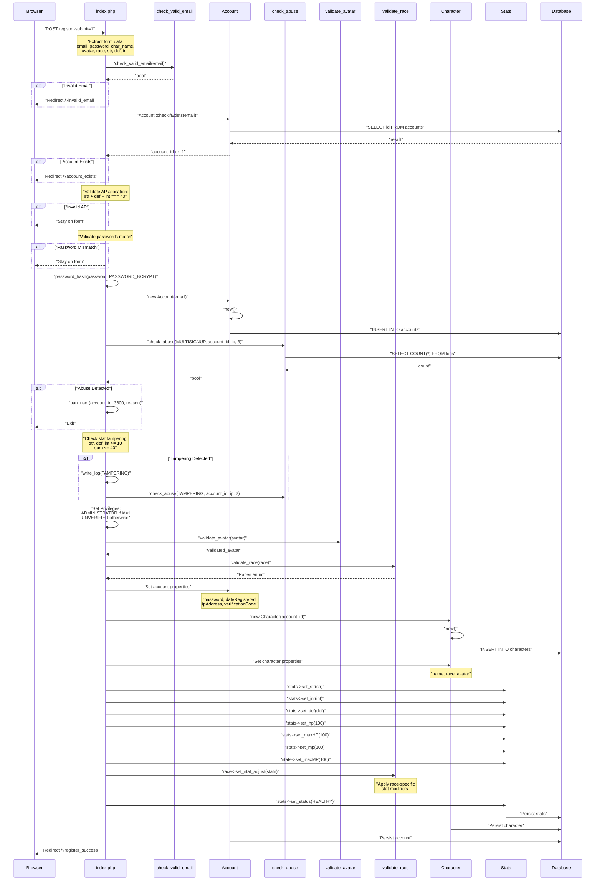
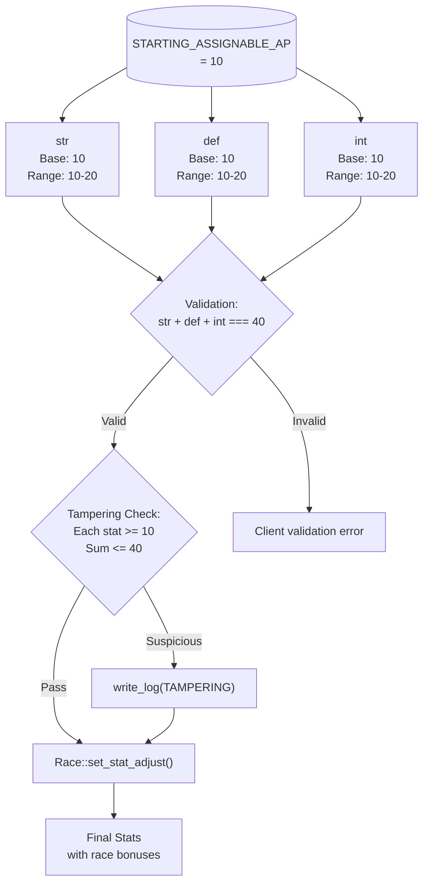
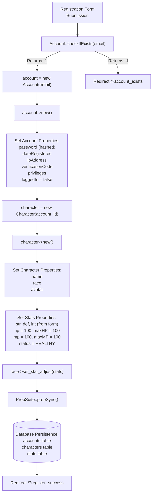
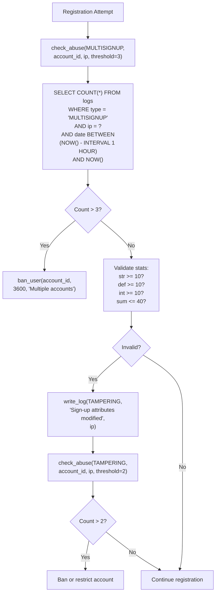

# User Registration

<details>
<summary>Relevant source files</summary>

The following files were used as context for generating this wiki page:

- [functions.php](functions.php)
- [game.php](game.php)
- [index.php](index.php)
- [js/functions.js](js/functions.js)
- [navs/nav-login.php](navs/nav-login.php)

</details>


## Purpose and Scope

This document describes the user registration system in Legend of Aetheria, covering the account creation flow, character creation, attribute point allocation, and security measures implemented during sign-up. The registration process creates both an `Account` entity and an initial `Character` entity simultaneously.

For information about the login process after registration, see [Login System](#4.2). For details about character management and character slots, see [Character Management](#5.1). For the privilege system and access control, see [Privilege System](#4.3).

---

## Registration Flow

The registration process follows a multi-step workflow that validates user input, creates database records, and applies security measures before granting access.

**Registration Process Flow Diagram**



**Sources:** [index.php:82-175](), [functions.php:251-259](), [functions.php:431-444](), [functions.php:454-473]()

---

## Form Structure

The registration form is divided into three primary sections, each collecting specific data for account and character creation.

### Account Section

The account section collects authentication credentials and generates a verification code.

| Field | Input Type | Validation | Purpose |
|-------|-----------|------------|---------|
| `register-email` | email | `check_valid_email()` | Account identifier |
| `register-password` | password | bcrypt hashing | Authentication credential |
| `register-password-confirm` | password | Must match password | Password verification |

**Key Implementation Details:**

- Email validation uses `filter_var()` with `FILTER_SANITIZE_EMAIL` and `FILTER_VALIDATE_EMAIL` [functions.php:251-259]()
- Passwords are hashed using `password_hash()` with `PASSWORD_BCRYPT` algorithm [index.php:116]()
- Verification code is generated using SHA-256 hashing, shuffled 1000 times [index.php:89-93]()
- Generated code length is controlled by `VERIFICATION_CODE_LENGTH` constant

**Sources:** [navs/nav-login.php:83-111](), [index.php:84-94](), [functions.php:251-259]()

### Character Section

Character creation occurs simultaneously with account registration, establishing the first character in slot 1.

| Field | Input Type | Options | Validation |
|-------|-----------|---------|------------|
| `register-character-name` | text | Alphanumeric + `_` `-` | Regex sanitization |
| `race-select` | select | Dynamically loaded from `Races` enum | `validate_race()` |
| `avatar-select` | select | Scanned from `img/avatars/` directory | `validate_avatar()` |

**Race Selection:**

The race selector is populated dynamically from the `Game\Character\Enums\Races` enum, excluding the `Default` race [navs/nav-login.php:136-150](). If an invalid race is submitted (indicating possible POST tampering), a random valid race is assigned and the attempt is logged [functions.php:431-444]().

**Avatar Selection:**

Avatars are loaded by scanning the `img/avatars/` directory, excluding any files matching the pattern `unknown` [navs/nav-login.php:160-173](). Invalid avatars default to `avatar-unknown.webp` with critical logging [functions.php:454-473]().

**Character Name Sanitization:**

Character names undergo regex sanitization to allow only alphanumeric characters, underscores, and hyphens: `preg_replace('/[^a-zA-Z0-9_-]+/', '', $name)` [index.php:96]()

**Sources:** [navs/nav-login.php:114-189](), [index.php:96-100](), [functions.php:431-473]()

### Stats Section

Players allocate 10 attribute points (AP) across three core stats during registration, with a minimum of 10 points required in each stat.

**Stat Allocation Diagram**



**Stat Allocation Constants:**

- `STARTING_ASSIGNABLE_AP = 10` - Additional points to distribute
- Base value per stat: `10`
- Total points at registration: `str + def + int = 40`

**Client-Side Validation:**

The `stat_adjust()` function in `functions.js` manages the stat allocation UI [js/functions.js:14-43]():

```javascript
function stat_adjust(which, slider) {
    let [stat, direction] = which.split('-');
    let stat_cur_ap = document.querySelector("#stats-" + stat + "-cur");
    let obj_ap = document.querySelector('#stats-remaining-ap');
    
    if (direction == 'plus') {
        if (parseInt(obj_ap.innerHTML) == 0) {
            obj_ap.classList.add('text-danger');
        } else {
            // Increment stat, decrement remaining AP
        }
    } else {
        if (parseInt(stat_cur_ap.innerHTML) <= 10) {
            stat_cur_ap.classList.add('text-danger');
            return;
        }
        // Decrement stat, increment remaining AP
    }
}
```

**Server-Side Validation:**

Two validation layers protect against stat manipulation [index.php:113-132]():

1. **Legitimate validation**: Ensures `str + def + int === STARTING_ASSIGNABLE_AP` (40 total)
2. **Tampering detection**: Checks if `str < 10 || def < 10 || int < 10 || (str + int + def) > 40`

If tampering is detected, it logs to the database as `AbuseType::TAMPERING` and increments the abuse counter [index.php:128-132]().

**Sources:** [navs/nav-login.php:191-230](), [js/functions.js:14-43](), [index.php:101-132]()

---

## Entity Creation Process

Registration creates two primary entities: an `Account` and an initial `Character` with associated `Stats`.

**Entity Instantiation Diagram**



### Account Creation

**Step 1: Check for Existing Account**

The system first validates that the email address is not already registered using `Account::checkIfExists()` [index.php:111]().

**Step 2: Instantiate Account Object**

```php
$account = new Account($email);
$account->new();
```

The `new()` method creates a new database record with the next available ID [index.php:118-119]().

**Step 3: Privilege Assignment**

The first registered account (ID = 1) receives `Privileges::ADMINISTRATOR`, while all subsequent accounts receive `Privileges::UNVERIFIED` [index.php:134-138]():

```php
if ($account->get_id() === 1) {
    $account->set_privileges(Privileges::ADMINISTRATOR);
} else {
    $account->set_privileges(Privileges::UNVERIFIED);
}
```

**Step 4: Set Account Properties**

Account properties are set using the PropSuite trait's magic methods [index.php:140-144]():

- `set_password()` - bcrypt-hashed password
- `set_dateRegistered()` - Current MySQL datetime
- `set_ipAddress()` - `$_SERVER['REMOTE_ADDR']`
- `set_loggedIn(false)` - Initial state
- `set_verificationCode()` - SHA-256 derived code

**Sources:** [index.php:111-144]()

### Character Creation

Character creation is tightly coupled with account creation, establishing the first of three possible character slots.

**Step 1: Instantiate Character Object**

```php
$character = new Character($account->get_id());
$character->new();
```

The `Character` constructor accepts the account ID, and `new()` creates the database record [index.php:146-147]().

**Step 2: Set Character Properties**

Basic character properties are assigned [index.php:149-151]():

- `set_avatar()` - Validated avatar filename
- `set_name()` - Sanitized character name
- `set_race()` - Validated `Races` enum

**Step 3: Configure Stats**

The `Character` object contains a `stats` property (instance of `Stats` class) that is configured with initial values [index.php:153-164]():

```php
$character->stats->set_str((int) $str);
$character->stats->set_int((int) $int);
$character->stats->set_def((int) $def);

$character->stats->set_hp(100);
$character->stats->set_maxHP(100);
$character->stats->set_mp(100);
$character->stats->set_maxMP(100);
```

**Step 4: Apply Race Modifiers**

The selected race applies stat adjustments through the race enum's method [index.php:162]():

```php
$race->set_stat_adjust($character->stats);
```

**Step 5: Set Status**

The character's initial status is set to `Status::HEALTHY` [index.php:164]():

```php
$character->stats->set_status(Status::HEALTHY);
```

**Sources:** [index.php:146-164]()

---

## Security Measures

The registration system implements multiple security layers to prevent abuse, fraud, and unauthorized access.

### Email Validation

**Function: `check_valid_email()`**

Email validation occurs in two phases [functions.php:251-259]():

1. **Sanitization**: `filter_var($email, FILTER_SANITIZE_EMAIL)` removes illegal characters
2. **Format Validation**: `filter_var($email, FILTER_VALIDATE_EMAIL)` checks RFC 5322 compliance
3. **Identity Check**: Sanitized email must match original input (prevents injection)

If validation fails, the request is redirected to `/?invalid_email` [index.php:105-108]().

**Sources:** [functions.php:251-259](), [index.php:105-108]()

### Abuse Detection

The system monitors for two types of registration abuse using the `check_abuse()` function.

**Abuse Detection Mechanism Diagram**



#### Multi-Signup Detection

Prevents users from creating multiple accounts from the same IP address within a short time window [index.php:122-125]():

```php
if (check_abuse(AbuseType::MULTISIGNUP, $account->get_id(), $ip_address, 3)) {
    ban_user($account->get_id(), 3600, "Multiple accounts within allotted time frame");
    exit();
}
```

**Detection Logic** [functions.php:276-285]():
- Queries `logs` table for entries with `type = 'MULTISIGNUP'` and matching IP
- Time window: Last 1 hour (`NOW() - INTERVAL 1 HOUR`)
- Threshold: 3 attempts
- Action: 1-hour ban (3600 seconds)

#### Stat Tampering Detection

Detects POST data manipulation of attribute point allocation [index.php:128-132]():

```php
if ($str < 10 || $def < 10 || $int < 10 || ($str + $int + $def) > 40) {
    $ip = $_SERVER['REMOTE_ADDR'];
    write_log(AbuseType::TAMPERING->name, "Sign-up attributes modified", $ip);
    check_abuse(AbuseType::TAMPERING, $account->get_id(), $ip, 2);
}
```

**Detection Conditions:**
- Any stat below minimum value (10)
- Total stats exceed maximum (40)

**Detection Logic** [functions.php:287-294]():
- Queries all-time logs for `type = 'TAMPERING'` from IP
- Threshold: 2 attempts
- Logged but registration continues (allows for accidental triggers)

**Sources:** [functions.php:272-298](), [index.php:122-132]()

### Input Sanitization

All user inputs undergo sanitization before database insertion.

| Input | Sanitization Method | Location |
|-------|-------------------|----------|
| Email | `filter_var(FILTER_SANITIZE_EMAIL)` | [functions.php:252]() |
| Character Name | `preg_replace('/[^a-zA-Z0-9_-]+/', '', $name)` | [index.php:96]() |
| Avatar | File existence check + whitelist | [functions.php:454-473]() |
| Race | Enum validation + random fallback | [functions.php:431-444]() |
| Stats | Type casting to `(int)` | [index.php:101-103]() |

**Sources:** [index.php:96-103](), [functions.php:251-259](), [functions.php:431-473]()

### Verification System

New accounts are created with `Privileges::UNVERIFIED` status [index.php:137](), restricting access until email verification is completed.

**Verification Code Generation** [index.php:89-93]():

```php
$verification_code  = strrev(hash('sha256', session_id()));
$verification_code .= substr(hash('sha256', strval(random_int(0,100))), 0, VERIFICATION_CODE_LENGTH);
$tmp_arr = str_split($verification_code);
shuffle_array($tmp_arr, 1000);
$verification_code = join('', $tmp_arr);
```

**Properties:**
- Base: Reversed SHA-256 hash of session ID
- Randomness: Appended SHA-256 hash of random integer
- Obfuscation: Array shuffled 1000 times
- Length: Controlled by `VERIFICATION_CODE_LENGTH` constant

When users attempt to access the game with `UNVERIFIED` privileges, they are shown a verification notice [game.php:56-59]():

```php
if ($privileges == Privileges::UNVERIFIED->value) {
    include 'html/verify.html';
    exit();
}
```

**Sources:** [index.php:89-93](), [index.php:137](), [game.php:56-59]()

---

## Client-Side Validation

The registration form implements JavaScript validation to provide immediate user feedback before server-side processing.

### Password Matching

Password confirmation is validated on form submission [navs/nav-login.php:247-254]():

```javascript
$("#register-submit").on("click", function(e) {
    let password_field = document.getElementById('register-password').value;
    let password_confirm = document.getElementById('register-password-confirm').value;
    
    if (password_field !== password_confirm) {
        e.preventDefault();
        e.stopPropagation();
        gen_toast('error-pw-mismatch', 'warning', 'bi-key', 
                  'Password Mis-match', 'Ensure passwords match');
    }
});
```

### Attribute Point Validation

Ensures all 10 assignable AP are distributed before submission [navs/nav-login.php:256-260]():

```javascript
if (parseInt(document.querySelector("#stats-remaining-ap").innerHTML) > 0) {
    e.preventDefault();
    e.stopPropagation();
    gen_toast('error-ap-toast', 'warning', 'bi-dice-5-fill', 
              'Unassigned Attribute Points', 
              'Ensure all remaining attribute points are applied');
}
```

### Race and Avatar Selection

Validates that user has made selections from dropdown menus [navs/nav-login.php:262-272]():

```javascript
if (document.querySelector("#race-select").selectedIndex == 0) {
    e.preventDefault();
    e.stopPropagation();
    gen_toast('error-race-toast', 'warning', 'bi-droplet', 
              'Select Race', 'You must choose a race first');
}

if (document.querySelector("#avatar-select").selectedIndex == 0) {
    e.preventDefault();
    e.stopPropagation();
    gen_toast('error-avatar-toast', 'warning', 'bi-person-bounding-box', 
              'Select Avatar', 'You must choose an avatar first');
}
```

### Hidden Field Population

Stat values are transferred from display elements to hidden form fields on submission [navs/nav-login.php:243-246]():

```javascript
document.querySelector("#str-ap").value = document.querySelector("#stats-str-cur").innerHTML;
document.querySelector("#def-ap").value = document.querySelector("#stats-def-cur").innerHTML;
document.querySelector("#int-ap").value = document.querySelector("#stats-int-cur").innerHTML;
```

This ensures the server receives the current stat allocation values as POST parameters.

**Sources:** [navs/nav-login.php:243-273](), [navs/nav-login.php:232-234]()

---

## Database Tables

Registration writes to two primary tables in the database schema.

### accounts Table

**Key Fields Written During Registration:**

| Column | Value Source | Type |
|--------|-------------|------|
| `id` | Auto-increment | INT |
| `email` | Form input (sanitized) | VARCHAR |
| `password` | `password_hash(..., PASSWORD_BCRYPT)` | VARCHAR |
| `privileges` | `ADMINISTRATOR` or `UNVERIFIED` | ENUM |
| `date_registered` | `get_mysql_datetime()` | DATETIME |
| `ip_address` | `$_SERVER['REMOTE_ADDR']` | VARCHAR |
| `verification_code` | Generated hash | VARCHAR |
| `logged_in` | `false` | BOOLEAN |

### characters Table

**Key Fields Written During Registration:**

| Column | Value Source | Type |
|--------|-------------|------|
| `id` | Auto-increment | INT |
| `account_id` | `account->get_id()` | INT (FK) |
| `name` | Form input (sanitized) | VARCHAR |
| `race` | `Races` enum value | VARCHAR |
| `avatar` | Validated filename | VARCHAR |

### stats Table

**Key Fields Written During Registration:**

| Column | Value Source | Type |
|--------|-------------|------|
| `character_id` | `character->get_id()` | INT (FK) |
| `str` | Form input + race modifier | INT |
| `def` | Form input + race modifier | INT |
| `int` | Form input + race modifier | INT |
| `hp` | 100 | INT |
| `maxHP` | 100 | INT |
| `mp` | 100 | INT |
| `maxMP` | 100 | INT |
| `status` | `HEALTHY` | VARCHAR |

**Sources:** [index.php:118-164]()

---

## Post-Registration Flow

After successful registration, users are redirected with a success parameter.

**Registration Success Redirect:**

```php
header('Location: /?register_success');
```

This triggers a toast notification on the login page informing the user of successful registration. Users must then log in using the credentials they just created, as the registration process does not automatically authenticate them.

The account remains in `UNVERIFIED` state until email verification is completed, preventing access to game features [game.php:56-59]().

**Sources:** [index.php:167](), [game.php:56-59]()