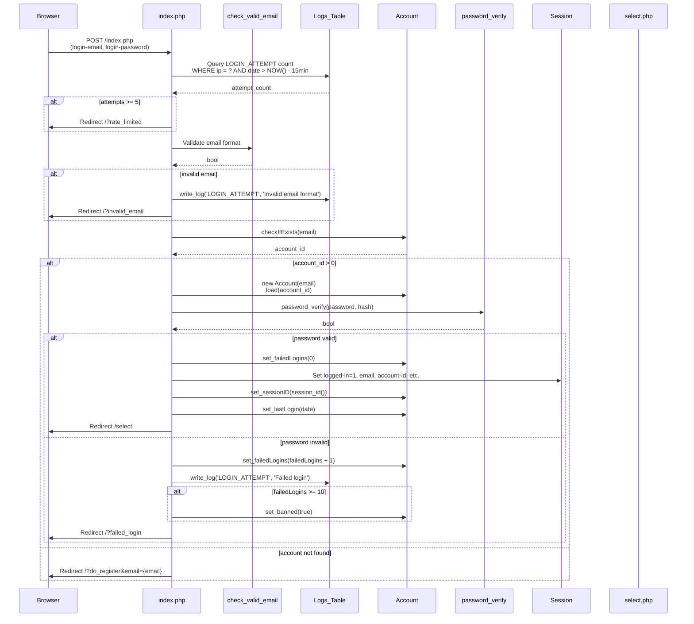
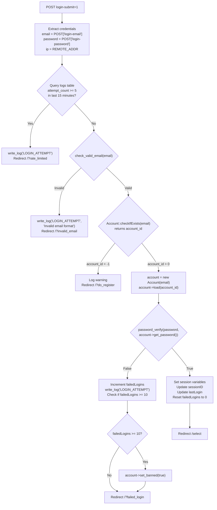
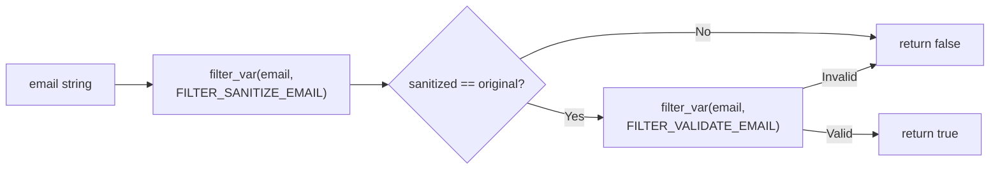
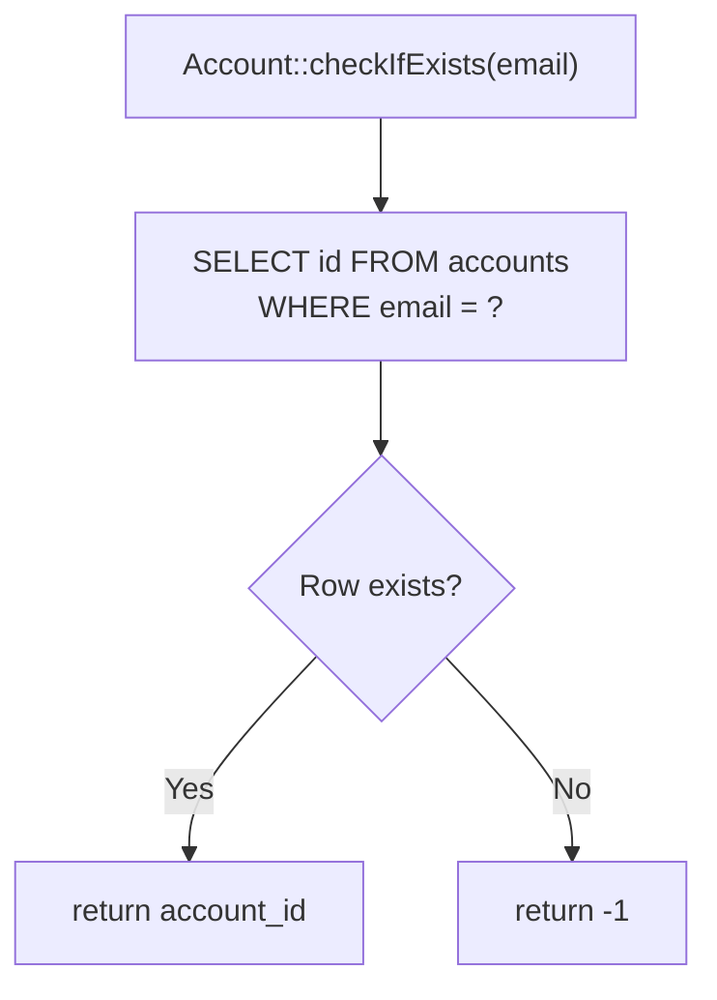
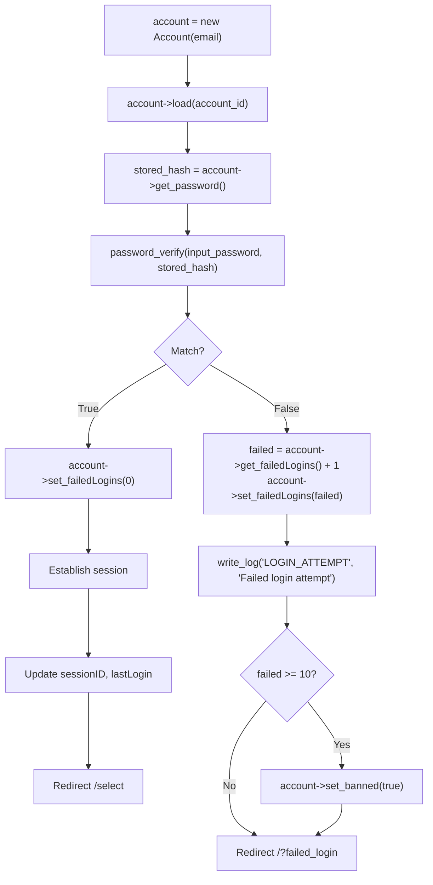
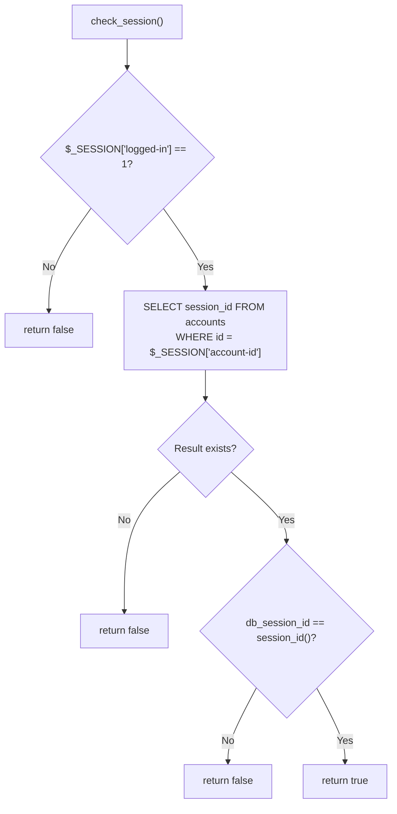
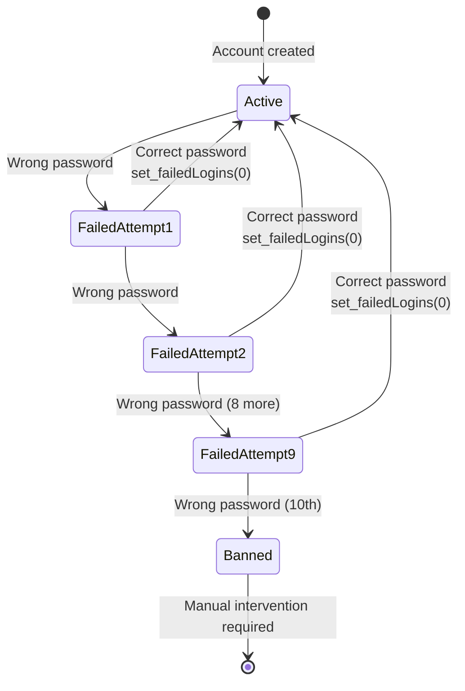

# Login System

<details>
<summary>Relevant source files</summary>

The following files were used as context for generating this wiki page:

- [functions.php](functions.php)
- [game.php](game.php)
- [html/headers.html](html/headers.html)
- [index.php](index.php)
- [js/functions.js](js/functions.js)
- [navs/nav-login.php](navs/nav-login.php)

</details>


## Purpose and Scope

This document describes the login authentication system that validates user credentials and establishes authenticated sessions. The login system handles email/password authentication, rate limiting, failed login tracking, and session initialization.

For information about user registration and character creation, see [User Registration](#4.1). For privilege levels and access control, see [Privilege System](#4.3). For broader security measures including CSRF protection and IP locking, see [Security Measures](#4.4).

## Login Flow Overview

The login system follows a multi-stage validation pipeline with rate limiting and abuse detection before establishing an authenticated session.



**Sources:** [index.php:12-81](), [functions.php:251-259](), [functions.php:391-396]()

## Form Structure

The login form is rendered as a Bootstrap tab within the authentication interface. The form collects email and password credentials with client-side password visibility toggling.

| Field | Input Type | Validation | Purpose |
|-------|-----------|------------|---------|
| `login-email` | `email` | HTML5 email, required | User's registered email address |
| `login-password` | `password` | required | User's password (plain text, hashed server-side) |
| `login-submit` | `hidden` | value="1" | Indicates login form submission |

The form includes a password visibility toggle that switches the input type between `password` and `text`, allowing users to verify their entered credentials.

**Sources:** [navs/nav-login.php:36-66](), [navs/nav-login.php:413-426]()

## Request Processing Pipeline

When the login form is submitted, `index.php` processes the request through a validation pipeline:



**Sources:** [index.php:12-81]()

## Rate Limiting Mechanism

The system implements IP-based rate limiting to prevent brute-force attacks. Rate limiting is enforced before any account lookup or password verification occurs.

### Rate Limit Query

```sql
SELECT COUNT(*) as attempt_count 
FROM {logs_table} 
WHERE `ip` = ? 
AND `type` = 'LOGIN_ATTEMPT'
AND `date` > DATE_SUB(NOW(), INTERVAL 15 MINUTE)
```

| Parameter | Value | Purpose |
|-----------|-------|---------|
| Threshold | 5 attempts | Maximum login attempts allowed |
| Time Window | 15 minutes | Rolling window for attempt counting |
| Action | Redirect `/?rate_limited` | Response when limit exceeded |

The rate limiter counts all `LOGIN_ATTEMPT` log entries from the current IP address within the last 15 minutes. If the count reaches 5 or more, the request is immediately rejected.

**Sources:** [index.php:17-32]()

## Email Validation

Before attempting account lookup, the system validates email format using `check_valid_email()`:



The function performs two-stage validation:
1. **Sanitization Check**: Ensures the email wasn't modified by sanitization (detects malicious input)
2. **Format Validation**: Validates RFC-compliant email format

Invalid emails trigger a `LOGIN_ATTEMPT` log entry and redirect to `/?invalid_email`.

**Sources:** [functions.php:251-259](), [index.php:34-38]()

## Account Lookup and Password Verification

### Account Existence Check

The system uses `Account::checkIfExists($email)` to determine if an account exists:



| Return Value | Meaning | Action |
|--------------|---------|--------|
| `account_id > 0` | Account exists | Proceed to password verification |
| `-1` | Account not found | Redirect to `/?do_register&email={email}` |

When an account doesn't exist, the system suggests registration by pre-populating the email field.

**Sources:** [index.php:40-44]()

### Password Verification Process

For existing accounts, the system loads the full `Account` object and verifies the password using PHP's `password_verify()`:



The `password_verify()` function uses bcrypt's timing-safe comparison to validate passwords against their stored hashes. Passwords are hashed during registration using `PASSWORD_BCRYPT`.

**Sources:** [index.php:42-76]()

## Session Initialization

Upon successful authentication, the system establishes a PHP session with multiple tracking variables:

| Session Variable | Source | Purpose |
|-----------------|--------|---------|
| `$_SESSION['logged-in']` | `1` | Boolean flag indicating authenticated state |
| `$_SESSION['email']` | `$account->get_email()` | User's email address |
| `$_SESSION['account-id']` | `$account->get_id()` | Primary key for accounts table |
| `$_SESSION['selected-slot']` | `-1` | Character slot selection state (initialized) |
| `$_SESSION['ip']` | `$_SERVER['REMOTE_ADDR']` | IP address of authenticated session |
| `$_SESSION['last_activity']` | `time()` | Unix timestamp for session timeout tracking |

The system also updates the account record with session metadata:

```php
$account->set_sessionID(session_id());
$account->set_lastLogin(date('Y-m-d H:i:s'));
```

This allows server-side session validation by comparing the browser's session ID against the database-stored session ID.

**Sources:** [index.php:47-58]()

## Session Validation

After login, subsequent page requests validate the session using `check_session()`:



The validation ensures:
1. The session variable `logged-in` is set to `1`
2. The account record exists in the database
3. The browser's session ID matches the database-stored session ID

This prevents session hijacking and ensures sessions can be invalidated from the server side.

**Sources:** [functions.php:503-526](), [game.php:22-23]()

## Failed Login Tracking and Account Locking

The system tracks failed login attempts at the account level and implements automatic account locking:

### Failed Login Counter

| Property | Type | Purpose |
|----------|------|---------|
| `Account->failedLogins` | `int` | Counter for consecutive failed attempts |
| Reset Condition | Successful login | Counter set to `0` |
| Increment Condition | Invalid password | Counter incremented by `1` |

### Account Lock Mechanism



When `failedLogins >= 10`, the system:
1. Calls `account->set_banned(true)` to update the database
2. Logs an alert with email and IP address
3. The ban persists until manually removed by an administrator

**Sources:** [index.php:64-73]()

## Redirect Flow and URL Parameters

The login system uses URL parameters to communicate authentication states to the frontend:

| Parameter | Trigger Condition | User-Facing Message |
|-----------|------------------|---------------------|
| `?rate_limited` | 5+ login attempts in 15 minutes | Rate limit exceeded |
| `?invalid_email` | Email fails validation | Invalid email format |
| `?failed_login` | Password doesn't match | Login failed |
| `?do_register&email={email}` | Account not found | Suggested registration with pre-filled email |
| `/select` | Successful login | Redirect to character selection screen |

These parameters can be consumed by JavaScript toast notification system (see [Toast Notifications](#7.4)) or rendered as inline messages.

**Sources:** [index.php:30](), [index.php:36](), [index.php:75](), [index.php:79]()

## CSRF Token Generation

During the headers rendering phase, if a user is logged in but lacks a CSRF token, the system generates one:

```php
<?php if (isset($_SESSION['logged-in']) && $_SESSION['logged-in'] == 1): ?>
<?php if (!isset($_SESSION['csrf-token'])): ?>
    $_SESSION['csrf-token'] = gen_csrf_token();
<?php endif; ?>
```

The `gen_csrf_token()` function creates a unique token:

```php
function gen_csrf_token(): string {
    $csrf = bin2hex(random_bytes(14)) . 'L04D' . bin2hex(random_bytes(14));
    return $csrf;
}
```

This token is embedded in the page as a meta tag and included in the JavaScript `loa` object for AJAX requests. CSRF validation is handled separately (see [Security Measures](#4.4)).

**Sources:** [html/headers.html:41-58](), [functions.php:535-540]()

## Post-Login Session Data Availability

After successful login and session establishment, subsequent pages have access to session data via the global `loa` JavaScript object:

```javascript
var loa = {
    u_email: "<?php echo $_SESSION['email']; ?>",
    u_aid: "<?php echo $_SESSION['account-id']; ?>",
    u_csrf: "<?php echo $_SESSION['csrf-token']; ?>",
    u_sid: "<?php echo session_id(); ?>",
    chat_pos: 0,
    chat_history: [],
};
```

The character-specific data is added after character selection:

```javascript
loa.u_cid = "<?php echo $_SESSION['character-id']; ?>";
loa.u_name = "<?php echo $_SESSION['name']; ?>";
```

**Sources:** [html/headers.html:48-65]()

## Code Entity Reference

### Core Login Components

| Entity | Type | Location | Purpose |
|--------|------|----------|---------|
| `index.php` | Entry Point | [index.php:12-81]() | Main login request handler |
| `Account::checkIfExists()` | Static Method | Referenced in [index.php:40]() | Account existence verification |
| `Account` | Class | Instantiated in [index.php:43]() | Account entity with authentication properties |
| `password_verify()` | PHP Function | [index.php:46]() | Bcrypt password verification |
| `check_valid_email()` | Function | [functions.php:251-259]() | Email format validation |
| `write_log()` | Function | [functions.php:391-396]() | Audit trail logging |
| `check_session()` | Function | [functions.php:503-526]() | Session validity verification |
| `gen_csrf_token()` | Function | [functions.php:535-540]() | CSRF token generation |

### Database Tables

| Table | Access Pattern | Purpose |
|-------|---------------|---------|
| `accounts` | `SELECT id WHERE email = ?` | Account lookup |
| `accounts` | `SELECT session_id WHERE id = ?` | Session validation |
| `accounts` | `UPDATE failedLogins, banned` | Failed login tracking |
| `logs` | `INSERT` for LOGIN_ATTEMPT | Audit trail and rate limiting |
| `logs` | `SELECT COUNT(*) WHERE type=LOGIN_ATTEMPT` | Rate limit enforcement |

### Session Variables

| Variable | Set Location | Read Location | Purpose |
|----------|-------------|---------------|---------|
| `$_SESSION['logged-in']` | [index.php:50]() | [functions.php:506](), [game.php]() | Authentication flag |
| `$_SESSION['email']` | [index.php:51]() | [game.php:22]() | Account identifier |
| `$_SESSION['account-id']` | [index.php:52]() | [functions.php:511]() | Primary key reference |
| `$_SESSION['ip']` | [index.php:54]() | N/A | IP tracking |
| `$_SESSION['csrf-token']` | [html/headers.html:43]() | [html/headers.html:52]() | CSRF protection |

**Sources:** [index.php:12-81](), [functions.php:251-259](), [functions.php:391-396](), [functions.php:503-526](), [functions.php:535-540](), [html/headers.html:41-65]()