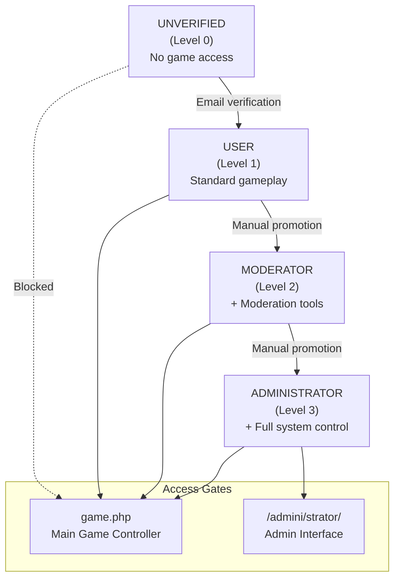
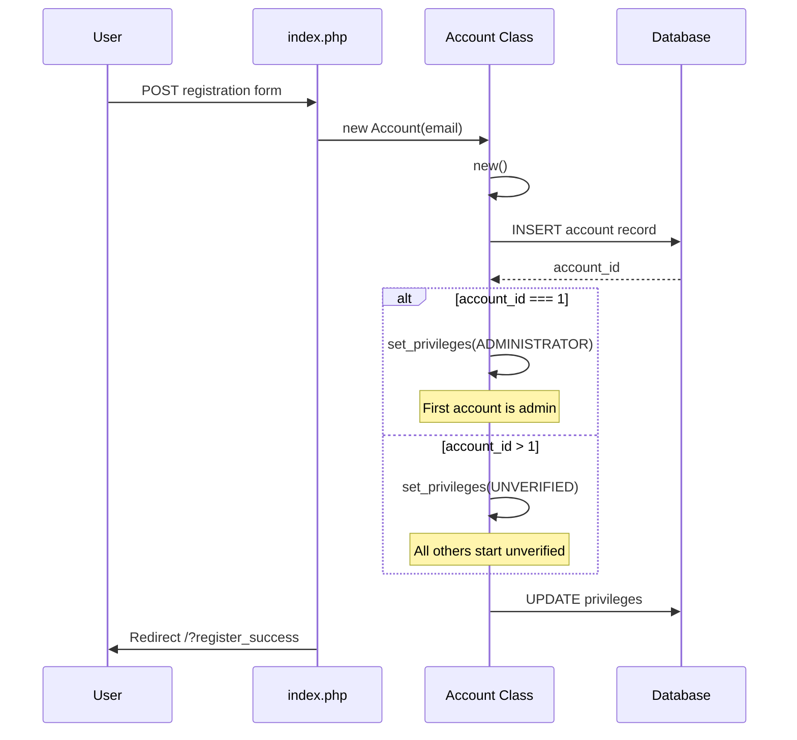
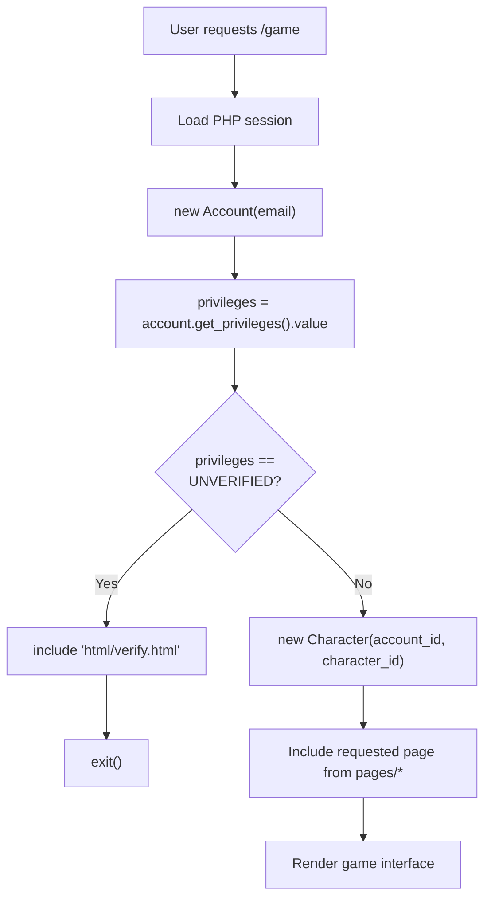
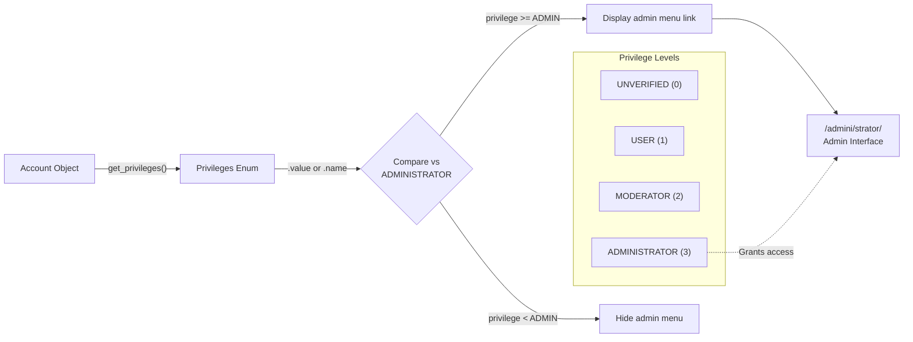
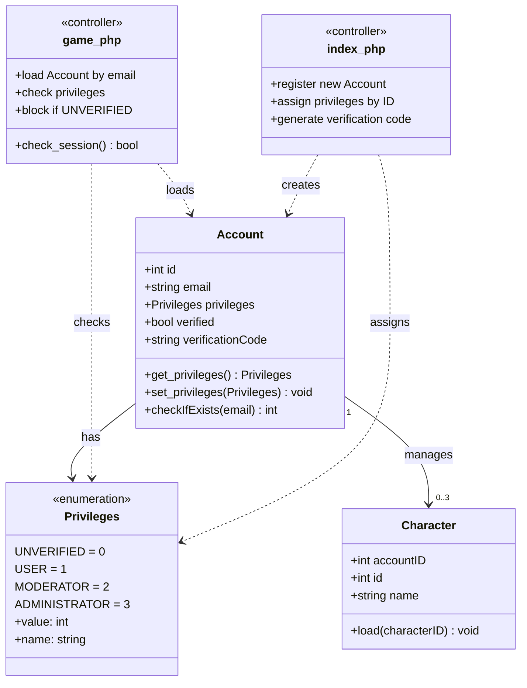
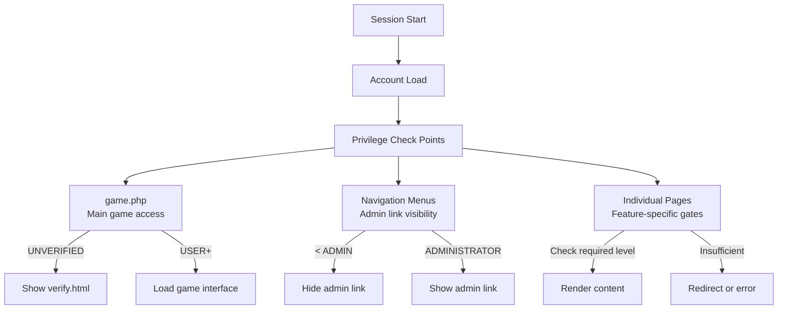
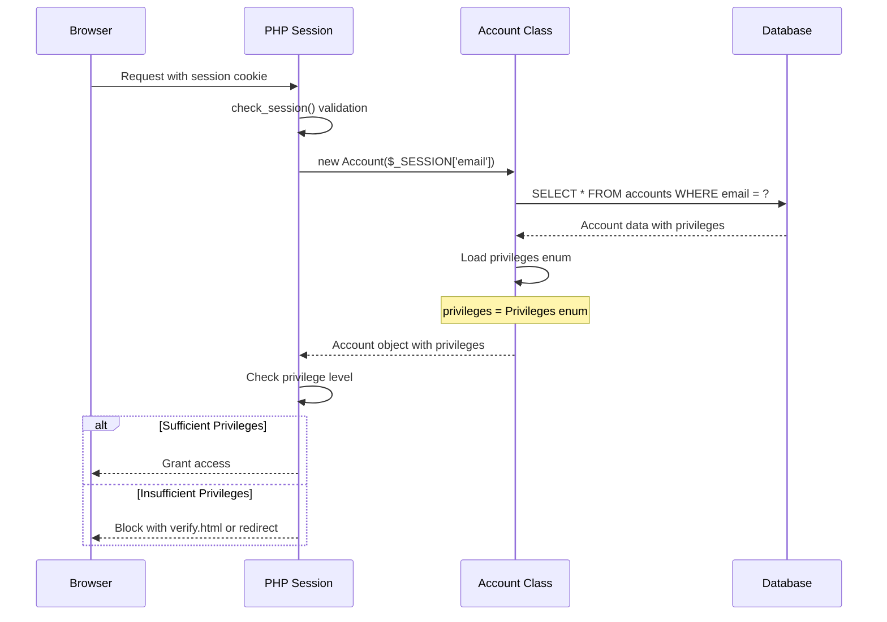

# Privilege System

<details>
<summary>Relevant source files</summary>

The following files were used as context for generating this wiki page:

- [css/gfonts.css](css/gfonts.css)
- [functions.php](functions.php)
- [game.php](game.php)
- [index.php](index.php)
- [navs/sidemenus/nav-side-default.php](navs/sidemenus/nav-side-default.php)
- [src/Account/Settings.php](src/Account/Settings.php)

</details>


## Purpose and Scope

The Privilege System implements tiered access control for Legend of Aetheria, managing user permissions through four distinct privilege levels. This system controls access to game features, administrative functions, and content based on account verification status and assigned roles. This page documents the privilege levels, enforcement mechanisms, and code implementation.

For authentication mechanisms (login/registration), see [Login System](#4.2). For email verification and security enforcement, see [Security Measures](#4.4). For account data structures, see [Entity Classes](#6.3).

---

## Privilege Levels

The system defines four privilege levels in ascending order of access rights:

| Privilege Level | Value | Description | Access Rights |
|----------------|-------|-------------|---------------|
| `UNVERIFIED` | 0 | Newly registered accounts awaiting email verification | Blocked from game access; shown verification prompt |
| `USER` | 1 | Standard verified player accounts | Full gameplay access; no administrative functions |
| `MODERATOR` | 2 | Community moderators | User privileges + moderation tools (planned) |
| `ADMINISTRATOR` | 3 | System administrators | Complete system access including admin panel |

The privilege levels are implemented as a PHP enum `Game\Account\Enums\Privileges`, with each level represented by an integer value that allows for hierarchical comparisons.

**Sources:** [game.php:9](), [game.php:54-59](), [index.php:134-138](), [navs/sidemenus/nav-side-default.php:576-585]()

---

## Privilege Level Hierarchy



**Sources:** [game.php:54-59](), [index.php:134-138](), [navs/sidemenus/nav-side-default.php:576-585]()

---

## Privilege Assignment Flow

### Initial Registration

During account registration, the system automatically assigns privilege levels based on account ID:



The first account registered in the system (ID 1) is automatically granted `ADMINISTRATOR` privileges. All subsequent accounts start with `UNVERIFIED` status and must complete email verification to gain `USER` privileges.

**Sources:** [index.php:82-175](), [index.php:134-138]()

### Verification Upgrade

The privilege upgrade from `UNVERIFIED` to `USER` occurs through email verification:

1. Registration generates a verification code stored in `accounts.verification_code`
2. User receives verification email with embedded code
3. Clicking verification link validates code and updates `privileges` to `USER`
4. User can now access the main game interface

**Sources:** [index.php:89-94](), [index.php:144]()

---

## Access Control Enforcement

### Game Access Gate

The primary access control enforcement occurs in `game.php`, which serves as the main game controller:



The verification check at [game.php:56-59]() prevents unverified users from accessing any game content. Unverified users are shown `html/verify.html` and execution terminates.

**Sources:** [game.php:22-23](), [game.php:54-59]()

### Code Implementation

The access gate implementation:

```php
// game.php:54-59
$privileges = $account->get_privileges()->value;

if ($privileges == Privileges::UNVERIFIED->value) {
    include 'html/verify.html';
    exit();
}
```

This code:
1. Retrieves the account's `Privileges` enum via `get_privileges()`
2. Accesses the integer value with `->value`
3. Compares against `Privileges::UNVERIFIED->value`
4. Blocks access if unverified

**Sources:** [game.php:54-59]()

---

## Administrative Access Control

### Admin Panel Access

Administrative features are gated through privilege level comparison in the navigation menu:

```php
// navs/sidemenus/nav-side-default.php:576-585
$privileges = $account->get_privileges()->name;
        
if ($privileges > Privileges::ADMINISTRATOR->value) {
    $href = "/admini/strator/";
    echo "<li>\n\t\t\t\t\t\t\t\t\t";

    echo "<a class=\"dropdown-item\" href=\"$href\">Administrator</a>";
    echo "\n\t\t\t\t\t\t\t\t</li>\n";
}
```

Users with `ADMINISTRATOR` privilege level see an "Administrator" menu item linking to `/admini/strator/`. The admin panel path uses an obfuscated URL pattern for security through obscurity.

**Sources:** [navs/sidemenus/nav-side-default.php:576-585]()

### Admin Feature Gate Diagram



**Sources:** [navs/sidemenus/nav-side-default.php:576-585]()

---

## Privilege System Code Entities

### Account-Privilege Integration



**Sources:** [game.php:8-10](), [game.php:22-23](), [game.php:54-59](), [index.php:6-7](), [index.php:118-119](), [index.php:134-138]()

---

## Privilege Checking Patterns

### Standard Privilege Check

The standard pattern for checking privileges throughout the codebase:

| Step | Code Pattern | Purpose |
|------|-------------|---------|
| 1. Load Account | `$account = new Account($_SESSION['email'])` | Instantiate account from session |
| 2. Get Privileges | `$privileges = $account->get_privileges()` | Retrieve Privileges enum |
| 3. Access Value | `$privValue = $privileges->value` | Get integer value for comparison |
| 4. Compare | `if ($privValue >= Privileges::USER->value)` | Check minimum required level |
| 5. Gate Access | Block or grant access based on result | Enforce access control |

**Sources:** [game.php:22](), [game.php:54](), [navs/sidemenus/nav-side-default.php:577]()

### Privilege Check Locations



**Sources:** [game.php:54-59](), [navs/sidemenus/nav-side-default.php:576-585]()

---

## Database Storage

The `privileges` field in the `accounts` table stores the privilege level as an integer:

| Column | Type | Description |
|--------|------|-------------|
| `id` | INT | Primary key, auto-increment |
| `email` | VARCHAR | Account email address |
| `privileges` | INT | Privilege level (0-3) |
| `verified` | BOOLEAN | Email verification status |
| `verification_code` | VARCHAR | Email verification token |

The `privileges` column stores the integer value of the `Privileges` enum (0-3). The `verified` boolean provides a secondary verification indicator, though the privilege level itself (`UNVERIFIED` vs `USER`) is the primary access control mechanism.

**Sources:** [index.php:134-145]()

---

## Session Integration

Privilege checking relies on PHP session data:



The session stores `$_SESSION['email']` which is used to load the account and retrieve privileges. The `check_session()` function validates session integrity before any privilege checks occur.

**Sources:** [game.php:22](), [functions.php:503-526]()

---

## Privilege Modification

### Manual Privilege Changes

Privilege levels can be modified through:

1. **Email Verification**: Automatic upgrade from `UNVERIFIED` to `USER` upon successful email verification
2. **Administrative Promotion**: Manual database updates or admin interface to promote users to `MODERATOR` or `ADMINISTRATOR`
3. **Account Banning**: Privilege revocation as part of ban enforcement (see [Security Measures](#4.4))

### PropSuite Integration

The `Account` class uses the `PropSuite` trait for property management, including privileges:

```php
// Privilege modification via PropSuite
$account->set_privileges(Privileges::USER);
$account->set_privileges(Privileges::ADMINISTRATOR);
```

The `PropSuite` trait automatically handles database synchronization when privileges are updated through setter methods.

**Sources:** [index.php:135-138]()

---

## Security Considerations

### Privilege Escalation Prevention

The system prevents unauthorized privilege escalation through:

1. **No User-Initiated Promotion**: Users cannot request privilege upgrades through the UI
2. **Database-Backed State**: Privileges stored in database, not controllable via cookies or session manipulation
3. **Session Validation**: `check_session()` validates session integrity before privilege checks
4. **Automatic Verification**: Only email verification can upgrade from `UNVERIFIED` to `USER`

### First Account Protection

The automatic assignment of `ADMINISTRATOR` to account ID 1 requires proper installation security:

- Installation must be completed by a trusted administrator
- Account #1 credentials must be securely stored
- Subsequent admins should be promoted from account #1

**Sources:** [index.php:134-138](), [functions.php:503-526]()

---

## Future Enhancements

The privilege system is designed for extensibility:

- **Moderator Tools**: `MODERATOR` privilege level reserved for future moderation features
- **Granular Permissions**: Potential expansion to role-based access control (RBAC) with specific permissions
- **Temporary Privileges**: Time-limited privilege grants for event moderators
- **Privilege Logs**: Audit trail for privilege changes and administrative actions

**Sources:** Based on privilege level structure in [game.php:9](), [index.php:7]()