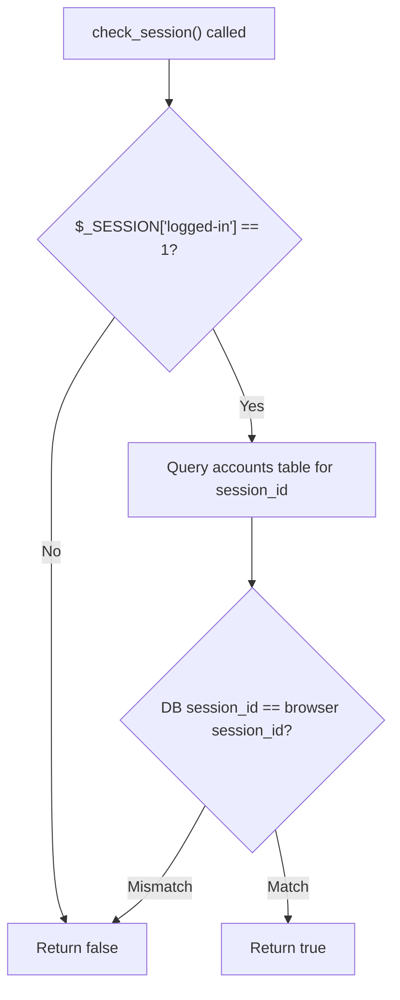
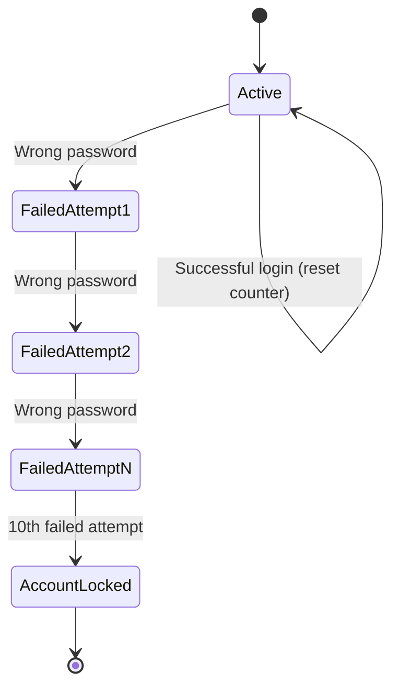
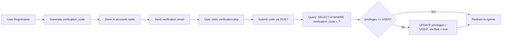
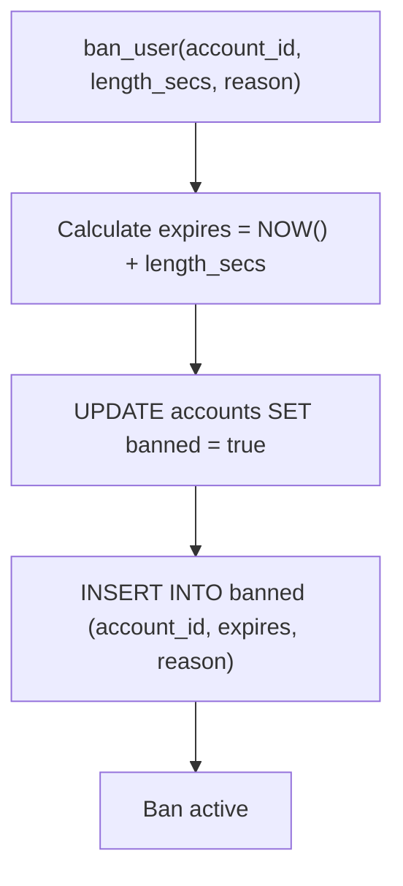
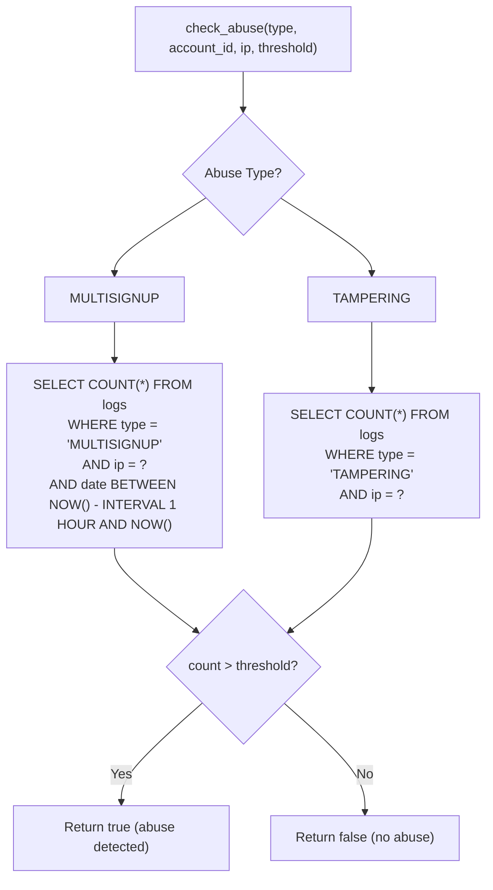
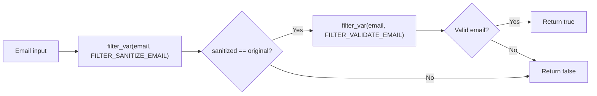
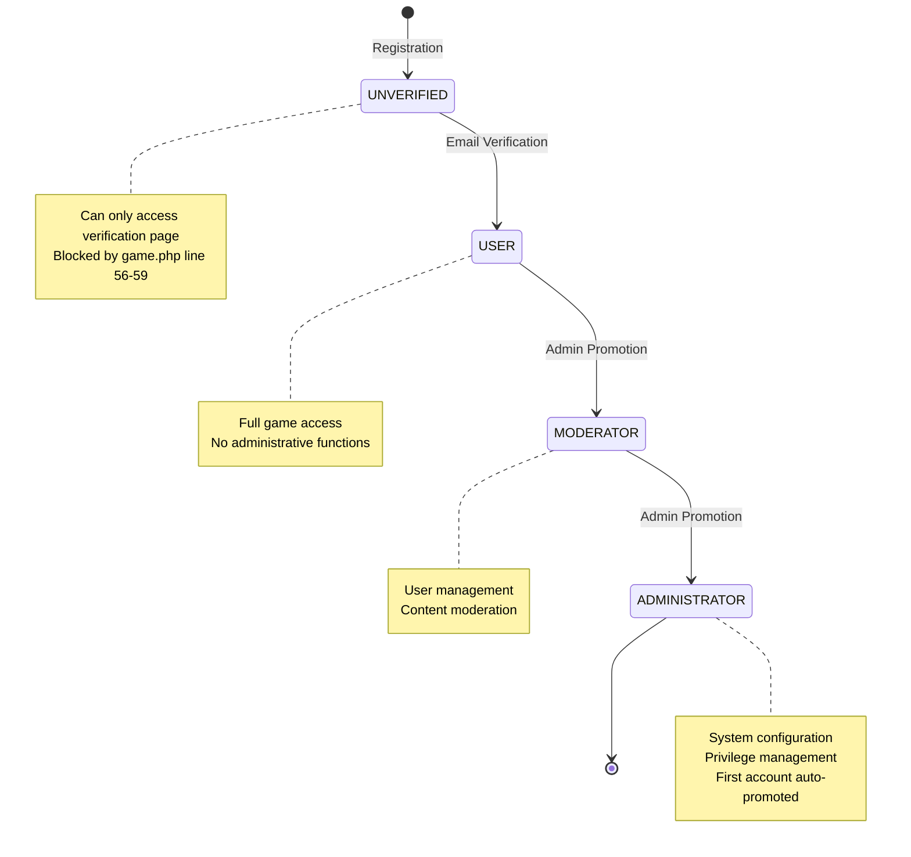

# Security Measures

<details>
<summary>Relevant source files</summary>

The following files were used as context for generating this wiki page:

- [.htaccess](.htaccess)
- [functions.php](functions.php)
- [game.php](game.php)
- [index.php](index.php)
- [navs/nav-status.php](navs/nav-status.php)
- [save.php](save.php)
- [verification.php](verification.php)

</details>


## Purpose and Scope

This document details the security mechanisms implemented in Legend of Aetheria to protect against common web application vulnerabilities and unauthorized access. Security measures span multiple layers including transport security, authentication, session management, input validation, abuse detection, and access control.

For information about user authentication flow and login mechanics, see [Login System](#4.2). For details about the privilege hierarchy and role-based permissions, see [Privilege System](#4.3). For account registration and character creation security, see [User Registration](#4.1).

---

## CSRF Protection

Legend of Aetheria implements Cross-Site Request Forgery (CSRF) protection through token-based validation. Each session receives a unique CSRF token that must be submitted with state-changing requests.

### CSRF Token Generation

The `gen_csrf_token()` function creates a cryptographically random token by combining 28 bytes of random data with a static identifier:

```
[random_14_bytes] + 'L04D' + [random_14_bytes]
```

The token is stored in `$_SESSION['csrf-token']` and must be included in forms and AJAX requests.

**Sources:** [functions.php:535-540]()

### CSRF Token Validation

The `check_csrf()` function validates submitted tokens against the session token. On mismatch, the function immediately destroys the session and redirects the user to the login page with a `csrf_fail` parameter.

| Validation Step | Action |
|----------------|--------|
| Token Match | Request proceeds normally |
| Token Mismatch | Session destroyed, redirect to `/?csrf_fail` |
| Missing Token | Session destroyed, redirect to `/?csrf_fail` |

**Sources:** [functions.php:550-559]()

---

## Session Management

### Session Validation Flow



**Diagram: Session Validation Process**

The `check_session()` function performs multi-level validation:

1. **Session Variable Check**: Verifies `$_SESSION['logged-in']` is set to `1`
2. **Database Synchronization**: Queries the `accounts` table to retrieve the stored `session_id`
3. **Session ID Comparison**: Compares the database `session_id` with `session_id()` from the browser

This dual-verification prevents session hijacking by ensuring the browser's session ID matches the server-stored value.

**Sources:** [functions.php:503-526]()

### Session Initialization

Upon successful login, the following session variables are set:

| Session Variable | Purpose |
|-----------------|---------|
| `$_SESSION['logged-in']` | Binary flag indicating authentication status |
| `$_SESSION['email']` | User's email address |
| `$_SESSION['account-id']` | Database primary key for Account |
| `$_SESSION['character-id']` | Active character's ID |
| `$_SESSION['ip']` | Remote IP address |
| `$_SESSION['last_activity']` | Unix timestamp of last activity |

The `session_id` is also persisted to the `accounts` table via `Account::set_sessionID()`.

**Sources:** [index.php:50-58]()

### Session Requirements in Game Flow

The main game controller enforces session validation before rendering any game content:

```mermaid
sequenceDiagram
    participant Browser
    participant game.php
    participant check_session()
    participant Database
    participant Account
    participant Character
    
    Browser->>game.php: GET /game
    game.php->>check_session(): Validate session
    check_session()->>Database: SELECT session_id WHERE id = ?
    Database-->>check_session(): session_id value
    check_session()-->>game.php: true/false
    
    alt Session Valid
        game.php->>Account: new Account($_SESSION['email'])
        game.php->>Character: new Character(account_id, character_id)
        game.php->>Browser: Render game interface
    else Session Invalid
        game.php->>Browser: Redirect to /?session_expired
    end
```

**Diagram: Session Validation in Game Controller**

**Sources:** [game.php:1-39](), [functions.php:503-526]()

---

## Authentication Security

### Rate Limiting

Login attempts are rate-limited to prevent brute-force attacks. The system tracks login attempts by IP address in the `logs` table.

**Rate Limit Configuration:**

| Parameter | Value |
|-----------|-------|
| Max Attempts | 5 attempts |
| Time Window | 15 minutes |
| Tracking Table | `logs` table with `type = 'LOGIN_ATTEMPT'` |
| Response | HTTP redirect to `/?rate_limited` |

The rate limiting query checks attempt counts within a rolling 15-minute window:

```sql
SELECT COUNT(*) as attempt_count 
FROM logs 
WHERE ip = ? 
AND type = 'LOGIN_ATTEMPT'
AND date > DATE_SUB(NOW(), INTERVAL 15 MINUTE)
```

**Sources:** [index.php:17-32]()

### Failed Login Tracking

Each failed login increments the `failed_logins` counter in the `accounts` table. After 10 failed attempts, the account is automatically banned:



**Diagram: Failed Login State Machine**

The counter is reset to zero upon successful authentication:

**Sources:** [index.php:46-76]()

### Password Security

Passwords are hashed using `PASSWORD_BCRYPT` algorithm with automatic salt generation. The registration flow demonstrates this:

1. **Registration**: `password_hash($password, PASSWORD_BCRYPT)` generates the hash
2. **Login**: `password_verify($password, $account->get_password())` validates credentials

Bcrypt automatically handles salting and uses an adaptive cost factor, making it resistant to rainbow table and brute-force attacks.

**Sources:** [index.php:116](), [index.php:46]()

---

## Email Verification



**Diagram: Email Verification Flow**

### Verification Code Generation

The verification code is generated through a multi-step randomization process:

1. **Base Hash**: SHA-256 hash of reversed `session_id`
2. **Random Component**: SHA-256 hash of random integer (0-100), truncated
3. **Shuffle**: Array of characters shuffled 1000 times using `shuffle_array()`

This produces a high-entropy verification code stored in the `accounts.verification_code` column.

**Sources:** [index.php:89-93]()

### Verification Enforcement

The main game controller blocks access for unverified users by checking the `Privileges` enum:

```php
if ($privileges == Privileges::UNVERIFIED->value) {
    include 'html/verify.html';
    exit();
}
```

Users with `UNVERIFIED` privilege see only the verification interface and cannot access game features.

**Sources:** [game.php:54-59](), [verification.php:23-54]()

---

## IP Locking

IP locking provides an optional security mechanism that restricts account access to a specific IP address.

### IP Lock Configuration

Users can enable IP locking through the settings interface. The feature is managed via AJAX POST to `save.php`:

| Parameter | Value | Validation |
|-----------|-------|------------|
| `save` | `'ip_lock'` | Exact string match |
| `status` | `'on'` or `'off'` | Binary state |
| `ip` | IPv4 address | Regex: `^(?:[0-9]{1,3}\.){3}[0-9]{1,3}$` |

**IP Address Validation Rules:**

- Length: 7-15 characters
- Format: Four octets separated by periods
- Pattern match: `/^(?:[0-9]{1,3}\.){3}[0-9]{1,3}$/`

Upon validation, the system calls:
- `Account::set_ipLock(true)` 
- `Account::set_ipLockAddr($ip)`

**Sources:** [save.php:36-60]()

### IP Lock Storage

The IP lock state is persisted in the `accounts` table:

| Column | Type | Purpose |
|--------|------|---------|
| `ip_lock` | BOOLEAN | Enable/disable flag |
| `ip_lock_addr` | VARCHAR | Locked IP address or 'off' |

---

## Ban System

### Ban Implementation

The `ban_user()` function implements temporary and permanent bans with reason tracking:



**Diagram: Ban System Flow**

### Ban Triggers

Automatic bans are triggered by:

| Trigger | Duration | Reason |
|---------|----------|--------|
| Multi-signup abuse (4+ accounts in 1 hour) | 3600 seconds (1 hour) | "Multiple accounts within allotted time frame" |
| Excessive failed logins (10+ attempts) | Permanent | Account locked via `Account::set_banned(true)` |
| Stat tampering detection | Variable | "Sign-up attributes modified" |

**Sources:** [functions.php:408-421](), [index.php:69-73](), [index.php:122-125]()

### Ban Data Model

Bans are tracked in two locations:

1. **accounts.banned**: Boolean flag for quick access checks
2. **banned table**: Detailed ban records with expiration and reason

The `banned` table stores:
- `account_id`: Foreign key to accounts
- `expires`: MySQL datetime when ban expires
- `reason`: Text description of ban cause

**Sources:** [functions.php:414-420]()

---

## Abuse Detection

### Abuse Types and Detection Logic

The `check_abuse()` function monitors two primary abuse patterns:



**Diagram: Abuse Detection Logic**

### Multi-Signup Detection

Tracks registration attempts from the same IP within a 1-hour window:

| Parameter | Value |
|-----------|-------|
| Detection Window | 1 hour |
| Threshold | 3 registrations |
| Action | 1-hour ban |
| Log Type | `MULTISIGNUP` |

**Sources:** [functions.php:276-285](), [index.php:122-125]()

### Attribute Tampering Detection

Detects POST data manipulation during registration by validating attribute point allocation:

**Valid Allocation Rules:**
- Each stat (STR, DEF, INT) must be ≥ 10
- Total allocated points must equal `STARTING_ASSIGNABLE_AP` (40)

Violations trigger:
1. Log entry: `write_log(AbuseType::TAMPERING->name, "Sign-up attributes modified", $ip)`
2. Abuse check: `check_abuse(AbuseType::TAMPERING, $account_id, $ip, 2)`
3. Potential ban after threshold exceeded

**Sources:** [functions.php:287-295](), [index.php:128-132]()

---

## Input Validation and Sanitization

### Email Validation

The `check_valid_email()` function implements two-stage validation:



**Diagram: Email Validation Process**

This prevents email injection attacks by ensuring the sanitized version matches the original input.

**Sources:** [functions.php:251-259]()

### Race Validation

The `validate_race()` function prevents POST manipulation of character race selection:

1. **Validation**: Compares submitted race against `Races` enum cases
2. **Fallback**: On invalid race, selects `Races::random_enum()` and logs critical warning
3. **Logging**: Records potential abuse with account ID for investigation

**Sources:** [functions.php:431-444]()

### Avatar Validation

The `validate_avatar()` function ensures avatar file existence:

1. **Scan**: Reads `img/avatars` directory for valid avatar files
2. **Search**: Uses `array_search()` to find submitted avatar
3. **Fallback**: Assigns `avatar-unknown.webp` if not found
4. **Logging**: Logs critical warning with original and fallback avatar names

**Sources:** [functions.php:454-473]()

### Page Parameter Sanitization

The main game controller sanitizes URL parameters to prevent path traversal attacks:

```php
$requested_page = preg_replace('/[^a-z-]+/', '', $_GET['page']);
$requested_sub = preg_replace('/[^a-z-]+/', '', $_GET['sub']);
```

Only lowercase letters and hyphens are permitted, preventing attempts like:
- `../../../etc/passwd`
- `../../.env`
- `<script>alert(1)</script>`

**Sources:** [game.php:66-71]()

---

## File Access Control

### Protected File Extensions

The `.htaccess` configuration blocks direct access to sensitive file types:

| File Pattern | Purpose | Security Risk |
|--------------|---------|---------------|
| `\.env$` | Environment variables | API keys, database credentials |
| `.*\.ready` | Installation markers | System state information |
| `.*\.template$` | Configuration templates | Default credentials |
| `.*\.pl$` | Perl scripts | AutoInstaller source code |
| `.*\.ini$` | Configuration files | Database connection strings |
| `.*\.log$` | Log files | User activity, system errors |
| `.*\.sh$` | Shell scripts | Installation commands |

All matching files return `Require all denied` (HTTP 403).

**Sources:** [.htaccess:2-4]()

### PHP Extension Hiding

The rewrite rules prevent direct access to `.php` files while allowing clean URLs:

```
RewriteCond %{REQUEST_FILENAME}.php -f
RewriteRule ^(.*)$ $1.php
```

Requests to `*.php` files explicitly return HTTP 404:

```
RewriteCond %{THE_REQUEST} "^[^ ]* .*?\.php[? ].*$"
RewriteRule .* - [L,R=404]
```

This prevents enumeration of PHP files and potential information disclosure.

**Sources:** [.htaccess:8-14]()

---

## Transport Security

### HTTPS Enforcement

All HTTP requests are redirected to HTTPS via `.htaccess`:

```apache
RewriteCond %{HTTPS} !=on [NC]
RewriteRule ^.*$ https://%{SERVER_NAME}%{REQUEST_URI} [R,L]
```

This ensures:
- Encrypted transmission of credentials
- Protection against man-in-the-middle attacks
- Session cookie confidentiality

**Sources:** [.htaccess:20-21]()

---

## Privilege-Based Access Control

### Access Control Flow



**Diagram: Privilege Hierarchy and Transitions**

### Privilege Enforcement

The main game controller checks privileges before rendering any content:

```php
$privileges = $account->get_privileges()->value;

if ($privileges == Privileges::UNVERIFIED->value) {
    include 'html/verify.html';
    exit();
}
```

Users with `UNVERIFIED` status cannot access:
- Character sheet
- Combat system
- Inventory management
- Social features

**First Account Privilege Escalation:**

The first registered account (ID = 1) automatically receives `ADMINISTRATOR` privileges:

```php
if ($account->get_id() === 1) {
    $account->set_privileges(Privileges::ADMINISTRATOR);
} else {
    $account->set_privileges(Privileges::UNVERIFIED);
}
```

**Sources:** [game.php:54-59](), [index.php:134-138]()

---

## Security Architecture Summary

The following table summarizes the defense-in-depth layers implemented in Legend of Aetheria:

| Layer | Mechanism | Implementation | Files |
|-------|-----------|----------------|-------|
| **Transport** | HTTPS enforcement | Apache mod_rewrite | `.htaccess` |
| **Session** | Dual-validation | `check_session()` + DB sync | `functions.php` |
| **CSRF** | Token-based protection | `gen_csrf_token()` / `check_csrf()` | `functions.php` |
| **Authentication** | Rate limiting, bcrypt | Login attempt tracking | `index.php` |
| **Authorization** | Privilege hierarchy | `Privileges` enum | `game.php` |
| **Input** | Validation & sanitization | Multiple validation functions | `functions.php` |
| **Abuse** | Pattern detection | `check_abuse()` | `functions.php`, `index.php` |
| **Access Control** | File protection | `.htaccess` directives | `.htaccess` |
| **Account** | IP locking, bans | `ban_user()`, IP lock settings | `save.php`, `functions.php` |
| **Verification** | Email verification | Verification code system | `verification.php` |

**Sources:** [.htaccess:1-22](), [functions.php:503-559](), [index.php:12-175](), [game.php:54-59](), [verification.php:1-56](), [save.php:36-60]()