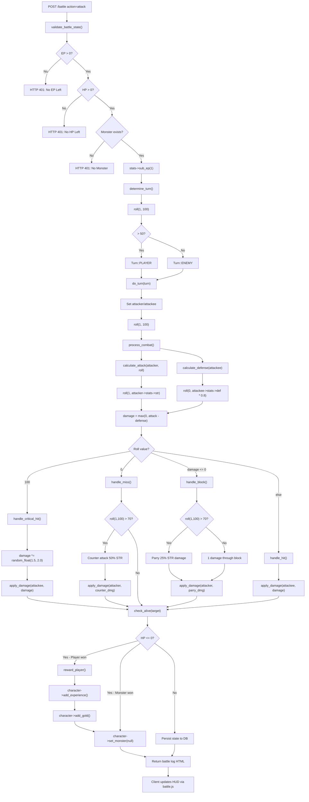

# Game Systems

<details>
<summary>Relevant source files</summary>

The following files were used as context for generating this wiki page:

- [battle.php](battle.php)
- [js/battle.js](js/battle.js)
- [navs/nav-status.php](navs/nav-status.php)
- [save.php](save.php)
- [src/Account/Account.php](src/Account/Account.php)
- [src/Character/Character.php](src/Character/Character.php)
- [src/Character/Stats.php](src/Character/Stats.php)
- [src/Familiar/Familiar.php](src/Familiar/Familiar.php)
- [src/Monster/Monster.php](src/Monster/Monster.php)
- [src/Monster/Stats.php](src/Monster/Stats.php)
- [verification.php](verification.php)

</details>


This page provides a comprehensive overview of the game mechanics and features available to players in Legend of Aetheria. It documents how core game systems interact, the entities that represent game state, and the flow of gameplay from login to combat encounters.

For detailed implementation of specific subsystems, see:
- Character mechanics and progression: [Character Management](#5.1)
- Battle mechanics and calculations: [Combat System](#5.2)
- Enemy encounters and scaling: [Monster System](#5.3)
- Pet companions: [Familiar System](#5.4)
- Social features: [Friends System](#5.5)
- Messaging: [Mail System](#5.6)
- Items and currency: [Inventory & Economy](#5.7)

For authentication and user management, see [Authentication & Authorization](#4).

---

## System Architecture Overview

Legend of Aetheria implements a session-based, turn-based RPG with multiple interconnected game systems. The architecture follows a domain-driven design pattern where each game concept (Character, Monster, Familiar, etc.) is represented as a PHP class that uses the `PropSuite` trait for database persistence.

### Core Game Entities

| Entity | File | Purpose | Key Properties |
|--------|------|---------|----------------|
| `Account` | [src/Account/Account.php:74-220]() | User account management | `email`, `privileges`, `charSlot1-3`, `credits`, `banned` |
| `Character` | [src/Character/Character.php:80-228]() | Player character state | `name`, `level`, `exp`, `gold`, `location`, `race`, `stats`, `inventory` |
| `Stats` | [src/Character/Stats.php:82-128]() | Character combat attributes | `hp`, `maxHP`, `mp`, `ep`, `str`, `def`, `int`, `luck` |
| `Monster` | [src/Monster/Monster.php:37-181]() | Enemy encounter | `level`, `name`, `scope`, `stats`, `expAwarded`, `goldAwarded` |
| `Familiar` | [src/Familiar/Familiar.php:39-311]() | Pet companion | `level`, `experience`, `rarity`, `hatched`, `stats` |

**Sources:** [src/Account/Account.php:1-220](), [src/Character/Character.php:1-228](), [src/Character/Stats.php:1-128](), [src/Monster/Monster.php:1-181](), [src/Familiar/Familiar.php:1-311]()

---

## Entity Relationship Model

**Diagram: Game Entity Relationships**

```mermaid
erDiagram
    Account ||--o{ Character : "manages (slots 1-3)"
    Account {
        int id PK
        string email
        Privileges privileges
        int charSlot1 FK
        int charSlot2 FK
        int charSlot3 FK
        int focusedSlot
        int credits
        bool banned
    }
    
    Character ||--|| Stats : "has"
    Character ||--o| Monster : "encounters"
    Character ||--o| Familiar : "owns"
    Character ||--|| Inventory : "owns"
    Character ||--|| BankManager : "accesses"
    
    Character {
        int id PK
        int accountID FK
        string name
        Races race
        int level
        int exp
        float gold
        int spindels
        string location
        int x
        int y
        Status status
    }
    
    Stats {
        int id PK
        int hp
        int maxHP
        int mp
        int maxMP
        int ep
        int maxEP
        int str
        int def
        int int
        int luck
    }
    
    Monster ||--|| MonsterStats : "has"
    Monster {
        int id PK
        int level
        string name
        MonsterScope scope
        int accountID FK
        int characterID FK
    }
    
    MonsterStats {
        int id PK
        int hp
        int maxHP
        int str
        int def
        float expAwarded
        float goldAwarded
    }
    
    Familiar ||--|| FamiliarStats : "has"
    Familiar {
        int id PK
        int characterID FK
        string name
        int level
        int experience
        ObjectRarity rarity
        bool hatched
    }
    
    Inventory {
        int characterID PK_FK
        int maxSlots
    }
    
    BankManager {
        int accountID FK
        int characterID FK
        double goldAmount
        double interestRate
    }
```

**Sources:** [src/Account/Account.php:74-153](), [src/Character/Character.php:80-147](), [src/Monster/Monster.php:37-70](), [src/Familiar/Familiar.php:39-64]()

---

## Game Loop and System Interaction

**Diagram: Core Game Loop**

```mermaid
sequenceDiagram
    participant Player
    participant Session
    participant game_php as "game.php"
    participant Character
    participant Monster
    participant battle_php as "battle.php"
    participant Stats
    participant Database
    
    Player->>game_php: "GET /game?page=hunt"
    game_php->>Session: "check_session()"
    Session-->>game_php: "Session valid"
    game_php->>Character: "new Character(accountID, characterID)"
    Character->>Database: "Load character data"
    Database-->>Character: "Character properties + Stats"
    Character->>Character: "stats = new Stats(characterID)"
    
    game_php->>game_php: "Include pages/game-hunt.php"
    game_php-->>Player: "Render hunt interface"
    
    Player->>Player: "Click 'New Monster'"
    Player->>game_php: "POST create monster"
    game_php->>Monster: "random_monster(player_level)"
    Monster->>Monster: "scale_monster(this, player_level)"
    Monster->>Database: "Persist monster"
    game_php->>Character: "set_monster(monster)"
    game_php-->>Player: "Monster spawned"
    
    Player->>battle_php: "POST /battle action=attack"
    battle_php->>battle_php: "validate_battle_state()"
    battle_php->>battle_php: "determine_turn()"
    Note over battle_php: "Roll 1-100 for turn order"
    battle_php->>battle_php: "do_turn(turn)"
    battle_php->>battle_php: "process_combat(attacker, attackee, roll)"
    
    alt "Roll == 100 (Critical Hit)"
        battle_php->>Stats: "sub_hp(damage * 2)"
    else "Roll == 0 (Miss)"
        battle_php->>battle_php: "handle_miss() - 30% counter chance"
    else "Damage <= 0 (Blocked)"
        battle_php->>battle_php: "handle_block() - 30% parry chance"
    else "Regular Hit"
        battle_php->>Stats: "sub_hp(damage)"
    end
    
    battle_php->>battle_php: "check_alive(target)"
    
    alt "Monster defeated"
        battle_php->>Character: "add_experience(expAwarded)"
        battle_php->>Character: "add_gold(goldAwarded)"
        battle_php->>Character: "set_monster(null)"
        battle_php-->>Player: "Victory! Rewards granted"
    else "Character defeated"
        battle_php->>Character: "set_monster(null)"
        battle_php-->>Player: "Defeat!"
    else "Battle continues"
        battle_php-->>Player: "Battle log HTML"
    end
    
    Player->>Player: "battle.js: update_hud()"
    Player->>game_php: "GET /hud?action=get"
    game_php-->>Player: "JSON: {player, monster} stats"
```



**Sources:** [battle.php:1-282](), [src/Character/Character.php:149-167](), [src/Monster/Monster.php:113-180](), [js/battle.js:107-144]()

---

## Combat System Flow

The combat system implements turn-based battles with randomized outcomes and multiple damage types.

**Diagram: Combat Calculation Pipeline**



**Sources:** [battle.php:36-282](), [battle.php:90-92](), [battle.php:100-157](), [battle.php:158-252]()

---

## Character Progression System

Characters advance through experience gain, level progression, and stat allocation. Each character is tied to an account via character slots.

### Character Slots

An `Account` can manage up to three characters via `charSlot1`, `charSlot2`, and `charSlot3` properties. The `focusedSlot` property tracks which character is currently active in the session.

**Sources:** [src/Account/Account.php:143-153]()

### Experience and Leveling

Experience is gained by defeating monsters. The amount awarded depends on the monster's level and scaling:

```
experience_awarded = base_exp * (1 + (player_level - 1) * 0.7) + variance
```

The `Character::add_experience()` method handles XP accumulation, while level-up logic would trigger stat increases and new abilities.

**Sources:** [battle.php:267-278](), [src/Monster/Monster.php:121-153]()

### Stat System

Both characters and monsters use a `Stats` object that tracks combat attributes:

| Stat | Abbreviation | Purpose |
|------|--------------|---------|
| Health Points | `hp` / `maxHP` | Survivability; 0 HP = defeat |
| Mana Points | `mp` / `maxMP` | Spell casting resource |
| Energy Points | `ep` / `maxEP` | Action resource (1 EP per combat turn) |
| Strength | `str` | Physical attack damage |
| Defense | `def` | Physical damage reduction |
| Intelligence | `int` | Magical power |
| Luck | `luck` | Critical chance, drops |
| Charisma | `chsm` | NPC interactions |
| Dexterity | `dext` | Crafting, precision |

The `PropSuite` trait provides dynamic getters/setters and mathematical operations:

```php
$character->stats->sub_hp(25);  // Reduce HP by 25
$character->stats->add_str(5);  // Increase STR by 5
```

**Sources:** [src/Character/Stats.php:82-128](), [src/Monster/Stats.php:49-67](), [battle.php:239-251]()

---

## Monster Encounter System

**Diagram: Monster Lifecycle**

```mermaid
stateDiagram-v2
    [*] --> Unspawned
    Unspawned --> Generating: "random_monster(player_level)"
    
    state Generating {
        [*] --> SelectTemplate: "Pick from system->monsters[]"
        SelectTemplate --> ParseStats: "Parse CSV stats"
        ParseStats --> CreateStatsObj: "new Stats()"
        CreateStatsObj --> AssignBase: "Set base HP/MP/STR/DEF/INT"
    }
    
    Generating --> Scaling: "scale_monster(monster, player_level)"
    
    state Scaling {
        [*] --> CalculateScaling: "For each stat"
        CalculateScaling --> ApplyFormula: "base * (1 + (level-1) * multiplier) + variance"
        ApplyFormula --> UpdateStat: "stats->set_X(scaled_value)"
        UpdateStat --> NextStat: "Next stat"
        NextStat --> CalculateScaling
        NextStat --> [*]: "All stats scaled"
    }
    
    Scaling --> Active: "set_monster(monster)"
    
    state Active {
        [*] --> InCombat
        InCombat --> TakeDamage: "Player attacks"
        TakeDamage --> DealDamage: "Monster turn"
        DealDamage --> InCombat: "HP > 0"
    }
    
    Active --> Defeated: "HP <= 0"
    
    state Defeated {
        [*] --> DropRewards: "expAwarded, goldAwarded"
        DropRewards --> UpdateCharacter: "add_experience(), add_gold()"
        UpdateCharacter --> ClearRef: "set_monster(null)"
    }
    
    Defeated --> [*]
```



### Monster Scopes

Monsters have three spawn scopes defined by `MonsterScope` enum:

| Scope | Description | Properties |
|-------|-------------|------------|
| `PERSONAL` | Spawned for specific character | `accountID`, `characterID` set |
| `ZONE` | Shared within a location/area | `summondBy` indicates creator |
| `GLOBAL` | World boss visible to all players | `summondBy` indicates creator |

**Sources:** [src/Monster/Monster.php:1-181](), [src/Monster/Monster.php:121-153](), [src/Monster/Monster.php:155-180]()

---

## Familiar System

Familiars are pet companions acquired as eggs with rarity-based stats. The system includes hatching mechanics, leveling, and combat assistance.

### Egg Rarity System

Eggs are generated with one of eleven rarity tiers, determined by a dice roll. Each rarity has an associated color code for UI display:

| Rarity | Color Code | Roll Range |
|--------|------------|------------|
| WORTHLESS | #FACEF0 | Lowest |
| TARNISHED | #779988 | |
| COMMON | #ADD8D7 | |
| ENCHANTED | #A6D9F8 | |
| MAGICAL | #08E71C | |
| LEGENDARY | #F8C81C | |
| EPIC | #CAB51F | |
| MYSTIC | #01CBF6 | |
| HEROIC | #1C4F2C | |
| INFAMOUS | #CB20EE | |
| GODLY | #FF2501 | Highest |

The `generateEgg()` method creates a new familiar egg with:
- Random rarity based on dice roll
- Hatch time set to +8 hours from acquisition
- Initial level 1 stats
- Rarity color for UI rendering

**Sources:** [src/Familiar/Familiar.php:210-253](), [src/Familiar/Familiar.php:256-282]()

### Familiar Lifecycle

1. **Egg Acquisition**: `generateEgg()` creates egg with rarity and hatch timer
2. **Hatching**: After 8 hours (`hatchTime`), egg becomes a familiar
3. **Leveling**: Familiars gain experience and level up like characters
4. **Combat**: Familiars can assist in battles (implementation varies)

**Sources:** [src/Familiar/Familiar.php:1-311]()

---

## Session and State Management

Game state is maintained through PHP sessions and database persistence. Each action that modifies state triggers a database write via the `PropSuite` trait.

### Session Variables

| Variable | Type | Purpose |
|----------|------|---------|
| `email` | string | Logged-in account identifier |
| `account-id` | int | Account primary key |
| `character-id` | int | Active character primary key |
| `logged-in` | bool | Session authentication status |
| `character-name` | string | Display name for UI |

**Sources:** [battle.php:14-18](), [save.php:7-8]()

### PropSuite Database Synchronization

The `PropSuite` trait provides automatic database persistence for entity properties. When `set_X()` methods are called, the trait:

1. Converts property names from camelCase to snake_case
2. Constructs UPDATE SQL query
3. Executes query with parameterized values
4. Updates in-memory property value

This ensures entity state always reflects database state without manual SQL for each property.

**Sources:** [src/Account/Account.php:184-201](), [src/Character/Character.php:179-195](), [src/Monster/Monster.php:95-111]()

---

## Client-Side Integration

**Diagram: Battle UI Update Flow**

```mermaid
flowchart LR
    User["User clicks attack button"]
    BattleJS["battle.js: event listener"]
    Animate["animateAttack(type)"]
    Fetch["fetch('/battle', POST)"]
    BattlePHP["battle.php processes combat"]
    Response["Returns battle log HTML"]
    UpdateLog["Insert HTML into battle-log div"]
    UpdateHUD["update_hud() function"]
    FetchHUD["fetch('/hud?action=get')"]
    HudPHP["Returns JSON stats"]
    UpdateDOM["Update HP/MP/EP in DOM"]
    AnimateStats["animateStatChange() if changed"]
    CheckDeath{"Monster HP == 0?"}
    Reload["window.location.reload()"]
    
    User --> BattleJS
    BattleJS --> Animate
    Animate --> Fetch
    Fetch --> BattlePHP
    BattlePHP --> Response
    Response --> UpdateLog
    UpdateLog --> UpdateHUD
    UpdateHUD --> FetchHUD
    FetchHUD --> HudPHP
    HudPHP --> UpdateDOM
    UpdateDOM --> AnimateStats
    AnimateStats --> CheckDeath
    CheckDeath -->|"Yes"| Reload
    CheckDeath -->|"No"| End["Battle continues"]
```



The JavaScript module [js/battle.js:1-144]() handles:
- Attack button event listeners
- Battle animations (shake, damage, spellcast effects)
- AJAX communication with `battle.php` and `hud` endpoint
- Real-time HUD updates showing HP/MP/EP changes
- Visual feedback for stat changes (color flash animations)
- Page reload when monster is defeated

**Sources:** [js/battle.js:52-87](), [js/battle.js:107-144](), [js/battle.js:15-50]()

---

## Data Persistence Pattern

All game entities follow a consistent pattern for database operations:

1. **Load**: Constructor or `load()` method fetches data from database
2. **Modify**: Properties changed via `set_X()` or `add_X()`/`sub_X()` methods
3. **Persist**: `PropSuite::propSync()` automatically writes changes to database
4. **Validation**: Session checks ensure only authorized users can modify data

This pattern ensures data consistency and prevents desynchronization between application state and database state.

**Sources:** [src/Character/Character.php:149-167](), [battle.php:23-26](), [save.php:18-34]()