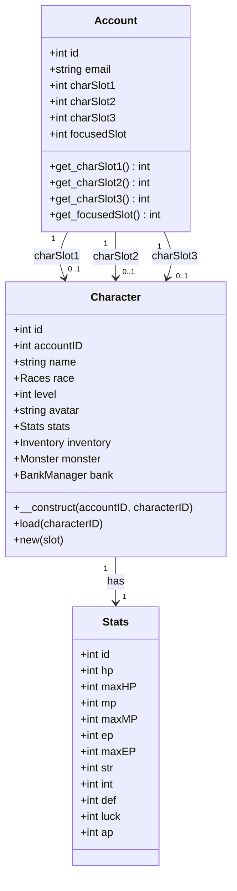
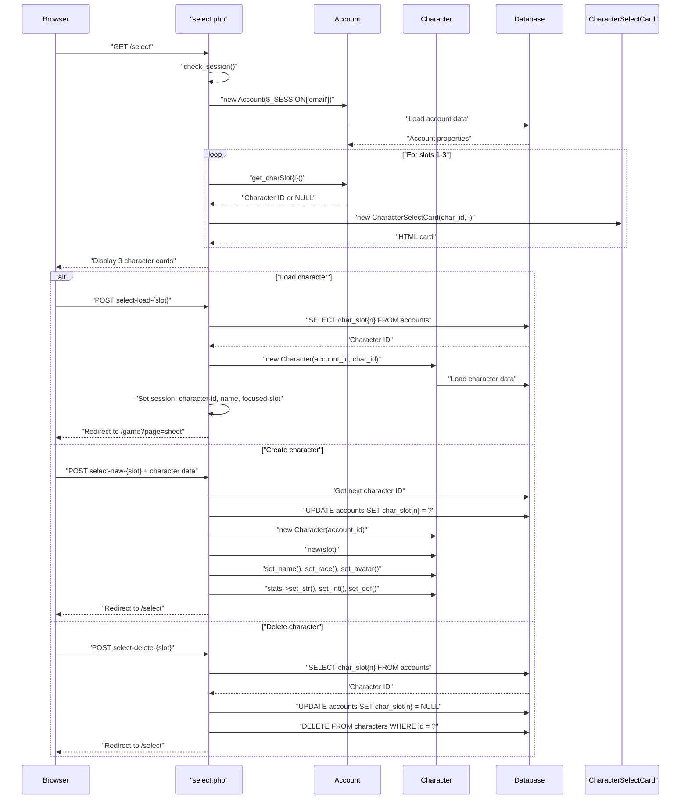
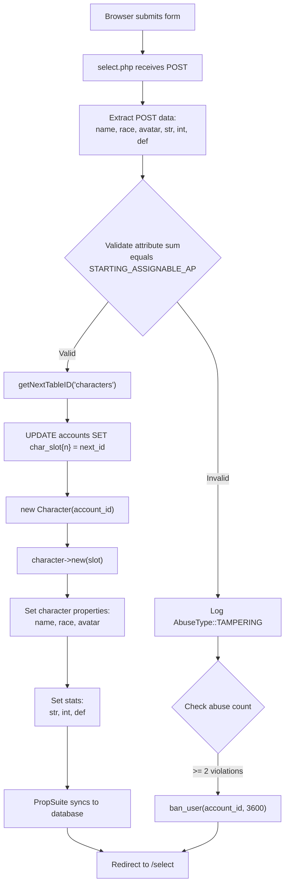
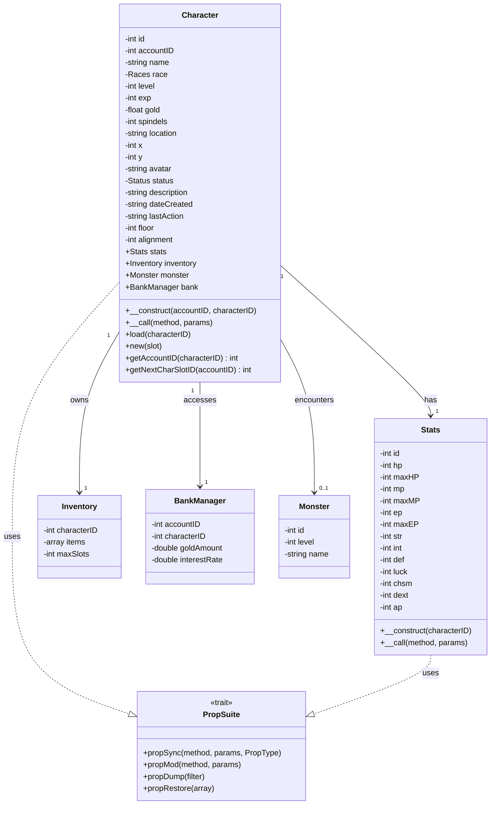
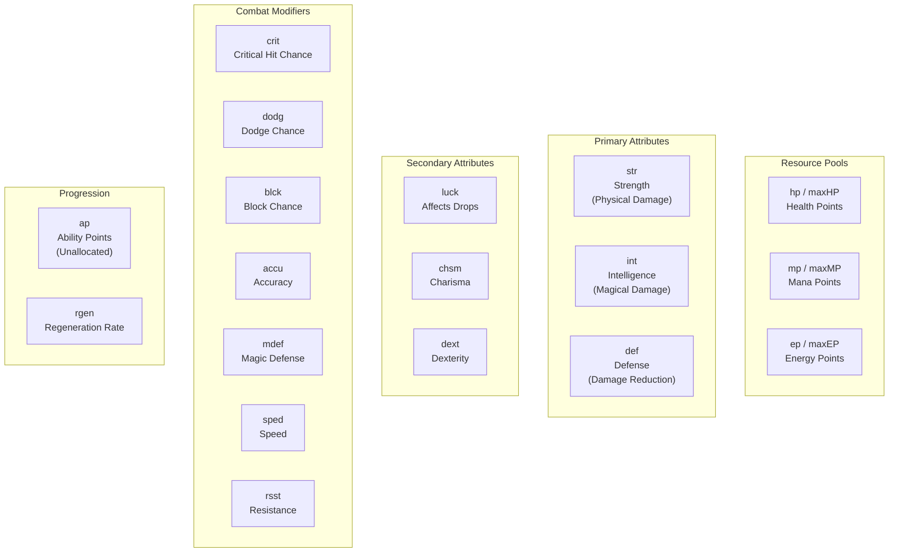
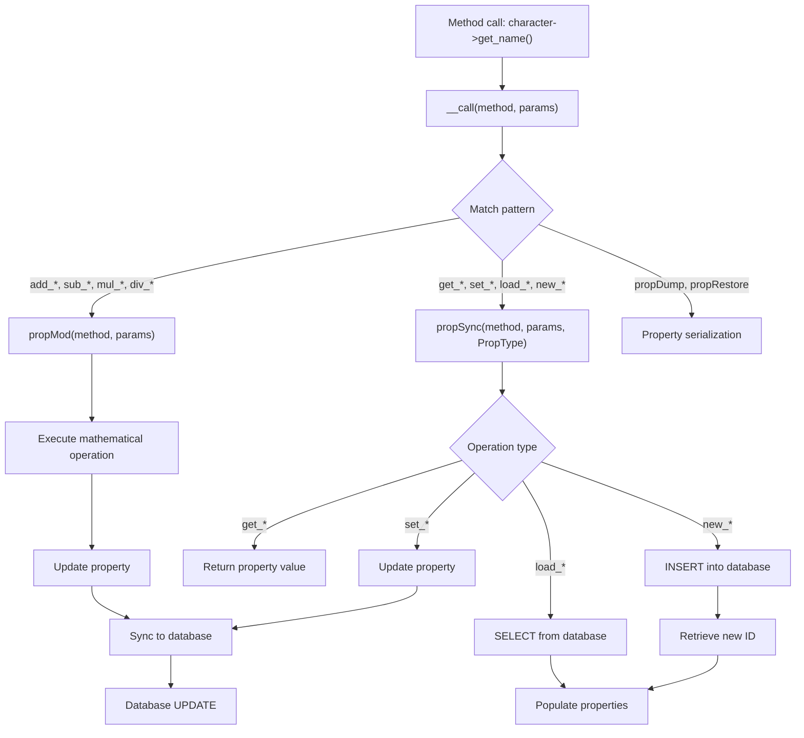
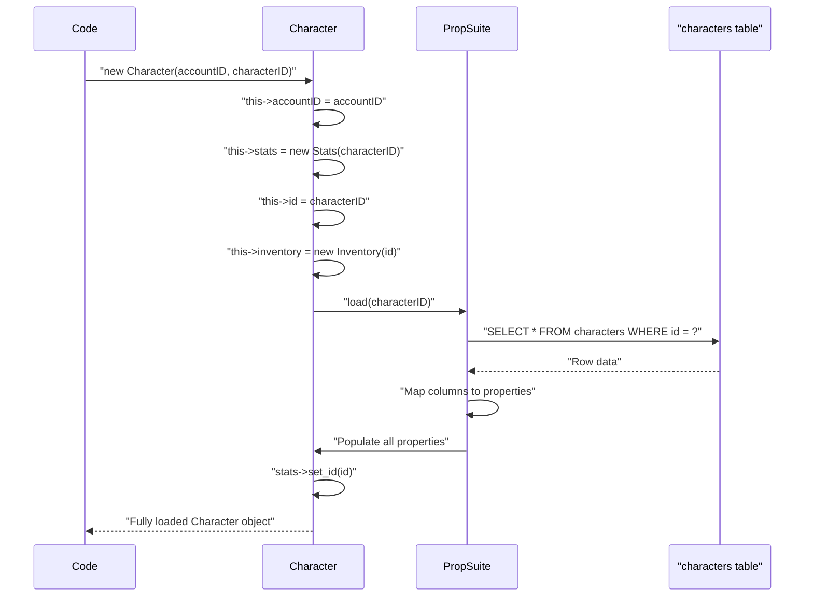

# Character Management

<details>
<summary>Relevant source files</summary>

The following files were used as context for generating this wiki page:

- [html/footers.html](html/footers.html)
- [js/menus.js](js/menus.js)
- [select.php](select.php)
- [src/Account/Account.php](src/Account/Account.php)
- [src/Character/Character.php](src/Character/Character.php)
- [src/Character/Stats.php](src/Character/Stats.php)
- [src/Familiar/Familiar.php](src/Familiar/Familiar.php)
- [src/Monster/Stats.php](src/Monster/Stats.php)

</details>


## Purpose and Scope

This document describes the Character Management system in Legend of Aetheria, which handles character creation, selection, storage, and lifecycle management. The system allows each account to manage up to three character slots, each containing a separate player character with unique attributes, inventory, and progression data.

For information about the Account system that owns character slots, see [Authentication & Authorization](#4). For combat mechanics using character stats, see [Combat System](#5.2). For character inventory and economy, see [Inventory & Economy](#5.7).

---

## Character Slot System

Each `Account` can manage up to three characters through designated slots. The slot system uses nullable integer fields in the accounts table that store character IDs.

**Diagram: Account-Character Slot Relationship**



**Sources:** [src/Account/Account.php:143-153](), [src/Character/Character.php:80-147]()

### Slot Storage

Character slot data is stored directly in the `accounts` table:

| Column | Type | Description |
|--------|------|-------------|
| `char_slot1` | `int NULL` | Character ID in slot 1 |
| `char_slot2` | `int NULL` | Character ID in slot 2 |
| `char_slot3` | `int NULL` | Character ID in slot 3 |
| `focused_slot` | `int NULL` | Currently active character slot (1-3) |

**Sources:** [src/Account/Account.php:143-153]()

### Slot Availability Check

The `getNextCharSlotID()` method determines which slots are available:

```sql
SELECT IF (`char_slot1` IS NULL, 1, 
       IF (`char_slot2` IS NULL, 2, 
       IF (`char_slot3` IS NULL, 3, -1))) AS `free_slot`
FROM accounts WHERE `id` = ?
```

Returns `1`, `2`, `3` for the first available slot, or `-1` if all slots are full.

**Sources:** [src/Character/Character.php:205-209]()

---

## Character Selection Flow

The `select.php` controller manages character slot interactions including loading, creating, and deleting characters.

**Diagram: Character Selection Request Flow**



**Sources:** [select.php:13-121]()

### Action Detection via POST Parameters

The controller uses regex pattern matching to extract action and slot from POST keys:

```php
preg_match('/^select-(load|delete|new)-(\d+)/', $key, $matches)
// $matches[1] = action: 'load', 'delete', or 'new'
// $matches[2] = slot: 1, 2, or 3
```

**Sources:** [select.php:29-36]()

### Session Variables Set on Character Load

When a character is loaded, the following session variables are set:

| Session Key | Value | Purpose |
|-------------|-------|---------|
| `$_SESSION['focused-slot']` | `1-3` | Currently active character slot |
| `$_SESSION['character-id']` | `int` | Loaded character's ID |
| `$_SESSION['name']` | `string` | Character's display name |

**Sources:** [select.php:48-50]()

---

## Character Creation

New characters are created through a multi-step process involving attribute allocation, race selection, and avatar selection.

**Diagram: Character Creation Data Flow**



**Sources:** [select.php:54-90]()

### Attribute Point Allocation

Characters start with a fixed pool of assignable attribute points defined by `STARTING_ASSIGNABLE_AP`. During creation, the player distributes these points across three primary attributes:

| Attribute | Minimum | Property |
|-----------|---------|----------|
| Strength (`str`) | 10 | Physical damage |
| Intelligence (`int`) | 10 | Magical damage |
| Defense (`def`) | 10 | Damage reduction |

The system validates that:
1. The sum of allocated points equals `STARTING_ASSIGNABLE_AP`
2. Each attribute has at least 10 points

**Sources:** [select.php:58-73]()

### Abuse Detection

If attribute validation fails, the system logs a tampering attempt and implements progressive penalties:

```php
if ($str + $def + $int === STARTING_ASSIGNABLE_AP) {
    if (($str < 10 || $def < 10 || $int < 10)) {
        write_log(AbuseType::TAMPERING->name, "New character attributes modified", $ip);
        
        if (check_abuse(AbuseType::TAMPERING, $account->get_id(), $ip, 2)) {
            ban_user($account->get_id(), 3600, "Post modifications");
        }
    }
}
```

**Sources:** [select.php:63-72]()

### Race and Avatar Selection

Character creation includes:

- **Race Selection**: Validated through `validate_race($_POST['race-select'])` against the `Races` enum
- **Avatar Selection**: Validated through `validate_avatar('avatar-' . $_POST['avatar-select'] . '.webp')` to ensure the avatar file exists

**Sources:** [select.php:54-56]()

---

## Character Class Architecture

The `Character` class is the primary entity representing a player character, utilizing the `PropSuite` trait for ORM functionality.

**Diagram: Character Class Structure and Dependencies**



**Sources:** [src/Character/Character.php:80-228](), [src/Character/Stats.php:82-128]()

### Core Properties

The `Character` class maintains the following properties:

**Identity & Appearance**
- `id`: Unique character identifier
- `accountID`: Associated account ID
- `name`: Character display name
- `race`: Character race (enum `Races`)
- `avatar`: Avatar image filename

**Progression**
- `level`: Current level (default: 1)
- `exp`: Experience points
- `dateCreated`: Character creation timestamp

**Location & State**
- `location`: Current location name (default: "The Shrine")
- `x`, `y`: Map coordinates
- `floor`: Current dungeon floor
- `status`: Health status (enum `Status`, default: HEALTHY)
- `lastAction`: Last action timestamp

**Economy**
- `gold`: Gold currency (default: 1000.0)
- `spindels`: Premium currency
- `alignment`: Moral alignment value

**Metadata**
- `description`: Character biography (default: "None Provided")

**Sources:** [src/Character/Character.php:84-132]()

### Constructor Pattern

The `Character` constructor supports two initialization modes:

```php
public function __construct($accountID, $characterID = null) {
    $this->accountID = $accountID;
    $this->stats = new Stats($characterID ?? 0);

    if ($characterID) {
        $this->id = $characterID;
        $this->inventory = new Inventory($this->id);
        $this->load($this->id);
        $this->stats->set_id($this->id);
    }
}
```

**Mode 1: New Character** - `new Character($accountID)` creates an uninitialized character
**Mode 2: Existing Character** - `new Character($accountID, $characterID)` loads existing data from database

**Sources:** [src/Character/Character.php:157-167]()

---

## Character Stats System

The `Stats` class extends `BaseStats` and manages character combat attributes and resource pools.

**Diagram: Stats Property Categories**



**Sources:** [src/Character/Stats.php:82-103]()

### Resource Pool Mechanics

Resource pools have current and maximum values with automatic capping:

```php
// Adding HP caps at maxHP
$character->stats->add_hp(50); // Won't exceed maxHP

// Subtracting HP can drop below 0
$character->stats->sub_hp(1000); // Can result in negative HP (death)
```

**Default Values:**
- HP: 100 / 100
- MP: 100 / 100  
- EP: 100 / 100

**Sources:** [src/Character/Stats.php:83-90](), [src/Abstract/BaseStats.php]()

### Attribute Point System

Characters earn unallocated Ability Points (`ap`) through leveling, which can be distributed to primary or secondary attributes. The initial `ap` value is 0 after character creation since starting points are pre-allocated.

**Sources:** [src/Character/Stats.php:90]()

### Default Attribute Values

All secondary attributes initialize to 3:

| Attribute | Default | Purpose |
|-----------|---------|---------|
| `luck` | 3 | Drop rates and random events |
| `chsm` | 3 | NPC interactions |
| `dext` | 3 | Crafting and precision |
| `rgen` | 0 | HP/MP regeneration per turn |

**Sources:** [src/Character/Stats.php:92-102]()

---

## PropSuite Integration

Both `Character` and `Stats` classes use the `PropSuite` trait to provide dynamic property access and automatic database synchronization.

**Diagram: PropSuite Method Dispatch**



**Sources:** [src/Character/Character.php:179-195](), [src/Character/Stats.php:124-127]()

### Magic Method Implementation

The `__call()` method intercepts undefined method calls and routes them based on pattern matching:

```php
public function __call($method, $params) {
    global $db, $log;

    if (!count($params)) {
        $params = null;
    }

    $matches = [];
    if (preg_match('/^(add|sub|exp|mod|mul|div)_/', $method)) {
        return $this->propMod($method, $params);
    } elseif (preg_match('/^(propDump|propRestore)$/', $method, $matches)) {
        $func = $matches[1];
        return $this->$func($params[0] ?? null);
    } else {
        return $this->propSync($method, $params, PropType::CHARACTER);
    }
}
```

**Sources:** [src/Character/Character.php:179-195]()

### PropType Enumeration

Different entity types use specific `PropType` values to determine database table mapping:

| PropType | Class | Database Table |
|----------|-------|----------------|
| `PropType::CHARACTER` | `Character` | `characters` |
| `PropType::CSTATS` | `Character\Stats` | `character_stats` |
| `PropType::ACCOUNT` | `Account` | `accounts` |
| `PropType::MSTATS` | `Monster\Stats` | `monster_stats` |

**Sources:** [src/Character/Character.php:193](), [src/Character/Stats.php:125-127]()

### Example Usage Patterns

**Getting Properties:**
```php
$name = $character->get_name();
$hp = $character->stats->get_hp();
```

**Setting Properties:**
```php
$character->set_location("Dark Forest");
$character->stats->set_hp(150);
```

**Mathematical Operations:**
```php
$character->add_exp(500);
$character->add_gold(123.45);
$character->stats->sub_hp(25); // Take damage
$character->stats->add_str(5);  // Level up strength
```

**Sources:** [src/Character/Character.php:21-79](), [src/Character/Stats.php:14-80]()

---

## Character Data Operations

Character data is persisted and retrieved through a combination of direct SQL queries and PropSuite ORM operations.

**Diagram: Character Load Operation Flow**



**Sources:** [src/Character/Character.php:157-167]()

### Load Operation

The `load()` method is invoked through PropSuite's `propSync()` when a method matching `load_*` is called. It executes a SELECT query and populates all object properties from the database row.

**Sources:** [src/Traits/PropSuite/PropSuite.php]()

### New Operation

Creating a new character involves calling `new()` which inserts a row into the database:

```php
$character = new Character($accountID);
$character->new($slot);
```

This:
1. Inserts a minimal row into the `characters` table
2. Retrieves the auto-generated ID
3. Sets the character's `id` property
4. Associates the character with the account's slot

**Sources:** [select.php:78-79]()

### Update Operations

Any `set_*` or mathematical operation (`add_*`, `sub_*`) automatically triggers a database UPDATE through PropSuite:

```php
$character->set_name("Thorin");
// Executes: UPDATE characters SET name = 'Thorin' WHERE id = ?

$character->add_gold(500);
// Executes: UPDATE characters SET gold = gold + 500 WHERE id = ?
```

**Sources:** [src/Traits/PropSuite/PropSuite.php]()

---

## Character Deletion

Character deletion is a two-step process that removes both the slot reference and the character record.

**Diagram: Character Deletion Process**

```mermaid
flowchart LR
    A["User clicks delete button"] --> B["Confirmation required<br/>(button becomes red)"]
    B --> C["User clicks again"]
    C --> D["POST select-delete-{slot}"]
    D --> E["SELECT char_slot{n}<br/>FROM accounts"]
    E --> F["Get character ID"]
    F --> G["UPDATE accounts<br/>SET char_slot{n} = NULL"]
    G --> H["DELETE FROM characters<br/>WHERE id = ?"]
    H --> I["Log character deletion"]
    I --> J["Redirect to /select"]
```



**Sources:** [select.php:91-114]()

### Deletion SQL Sequence

```sql
-- Step 1: Get character ID from slot
SELECT `char_slot{n}` FROM accounts WHERE `id` = ?

-- Step 2: Clear the slot reference
UPDATE accounts SET `char_slot{n}` = NULL WHERE `id` = ?

-- Step 3: Delete the character record
DELETE FROM characters WHERE `id` = ?
```

**Sources:** [select.php:93-102]()

### Deletion Logging

Character deletions are logged with context:

```php
$log->info(
    "Character Deleted",
    [
        'AccountID'   => $_SESSION['account-id'],
        'CharacterID' => $char_id,
        'Slot'        => $slot
    ]
);
```

**Sources:** [select.php:104-111]()

### UI Confirmation Pattern

The delete button requires two clicks to prevent accidental deletion:

```javascript
document.querySelectorAll("button[id^='select-delete-']").forEach((ahref_btn) => {
    ahref_btn.addEventListener("click", (e) => {
        if (e.target.classList.contains("btn-outline-danger")) {
            e.preventDefault();
            e.stopPropagation();
            e.target.classList.replace("btn-outline-danger", "btn-danger");
        }
    });
});
```

First click changes the button from outlined to solid danger color. Second click submits the form.

**Sources:** [select.php:164-172]()

---

## Integration Points

The Character system integrates with multiple other game systems:

| System | Integration Point | Description |
|--------|------------------|-------------|
| **Account** | `charSlot1-3`, `focusedSlot` | Account owns up to 3 character slots |
| **Stats** | `character->stats` | Character has one Stats object for combat |
| **Inventory** | `character->inventory` | Character manages item collection |
| **Monster** | `character->monster` | Character can have active monster encounter |
| **BankManager** | `character->bank` | Character accesses shared account bank |
| **Familiar** | `characterID` foreign key | Character can own familiar companions |
| **Mail** | `senderID`, `recipientID` | Characters send/receive messages |
| **Friends** | Character IDs | Characters connect via friend relationships |

**Sources:** [src/Character/Character.php:138-147](), [src/Account/Account.php:143-153]()

### Session State

When a character is loaded, the following session state is maintained:

```php
$_SESSION['focused-slot']  = (int)$slot;        // 1, 2, or 3
$_SESSION['character-id']  = (int)$char_id;     // Character's ID
$_SESSION['name']          = $character->get_name(); // Character's name
```

This session data is used by `game.php` to load the active character for gameplay.

**Sources:** [select.php:48-50]()

### Static Helper Methods

**`getAccountID(characterID)`**: Retrieves the account ID that owns a character

```php
public static function getAccountID($characterID): int {
    global $db, $t;
    $sql_query = "SELECT `account_id` FROM {$t['characters']} WHERE `id` = ?";
    $result = $db->execute_query($sql_query, [ $characterID ])->fetch_column();
    
    if (!$result) {
        return -1;
    }
    
    return $result;
}
```

**Sources:** [src/Character/Character.php:217-227]()

---

## Summary Table: Key Files and Classes

| File Path | Primary Class/Purpose | Key Responsibilities |
|-----------|----------------------|---------------------|
| `select.php` | Character slot controller | Handle load/create/delete actions, render selection UI |
| `src/Character/Character.php` | `Character` class | Core character entity with properties and PropSuite integration |
| `src/Character/Stats.php` | `Stats` class | Character combat attributes and resource pools |
| `src/Account/Account.php` | `Account` class | Owns character slots, manages slot references |
| `src/Inventory/Inventory.php` | `Inventory` class | Character item storage |
| `src/Bank/BankManager.php` | `BankManager` class | Character financial management |

**Sources:** [select.php:1-181](), [src/Character/Character.php:1-228](), [src/Character/Stats.php:1-129](), [src/Account/Account.php:1-220]()