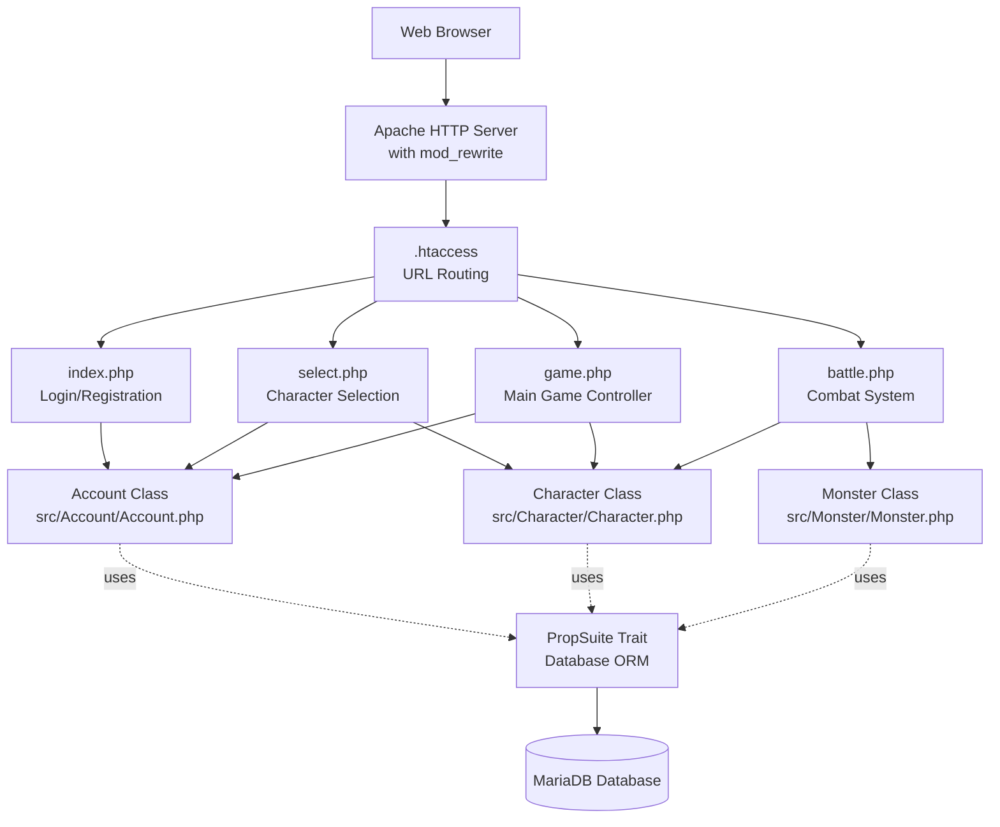
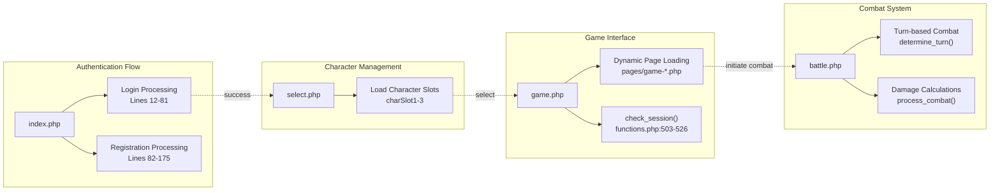
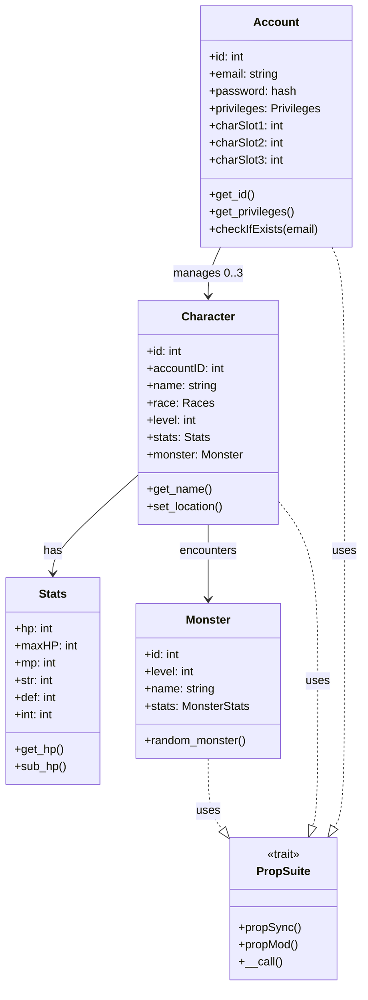
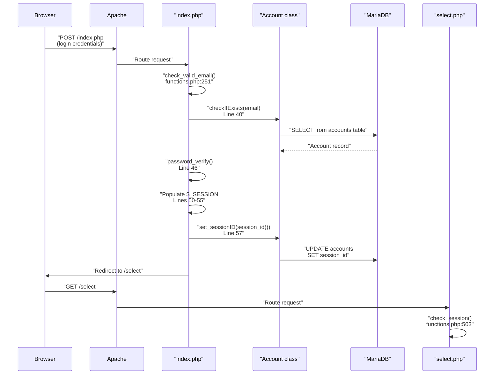

# Overview

<details>
<summary>Relevant source files</summary>

The following files were used as context for generating this wiki page:

- [CONTRIBUTING.md](CONTRIBUTING.md)
- [README.md](README.md)
- [functions.php](functions.php)
- [game.php](game.php)
- [html/headers.html](html/headers.html)
- [index.php](index.php)

</details>


## Purpose and Scope

This page provides a high-level introduction to **Legend of Aetheria**, a browser-based fantasy role-playing game built with PHP and MariaDB. It describes the system's architecture, technology stack, and core components. For detailed information about specific subsystems, see:

- Installation procedures: [Installation & Setup](#2)
- Application entry points and routing: [Core Application](#3)
- User authentication mechanisms: [Authentication & Authorization](#4)
- Game mechanics: [Game Systems](#5)
- Database design: [Database & Data Layer](#6)
- User interface components: [Frontend & User Interface](#7)

## What is Legend of Aetheria

Legend of Aetheria is a web-based RPG that runs entirely in a browser. Players create accounts, manage up to three characters per account, engage in turn-based combat with monsters, collect familiars (pets), interact with other players through a friend system and in-game mail, and progress through character advancement mechanics. The application is designed for deployment on Linux servers with Apache, PHP 8.4, and MariaDB/MySQL databases.

**Sources:** [README.md:1-5](), [game.php:1-39]()

## System Architecture

The application follows a traditional three-tier architecture with presentation, application logic, and data persistence layers. The web server (Apache) receives HTTP requests, which are routed through `.htaccess` URL rewriting rules to PHP controllers. These controllers instantiate domain objects that use the `PropSuite` trait for database persistence.

### Architecture Diagram

**Figure 1: Core Application Flow**



**Sources:** [game.php:1-39](), [index.php:1-82](), [README.md:1-5]()

### Request Flow

All HTTP requests enter through Apache, which applies URL rewriting rules defined in `.htaccess`. Clean URLs are mapped to specific PHP entry points:

| URL Pattern | PHP Controller | Purpose |
|------------|---------------|---------|
| `/` | `index.php` | Login and registration forms |
| `/select` | `select.php` | Character slot selection interface |
| `/game?page=*` | `game.php` | Main game interface with dynamic page loading |
| `/battle` | `battle.php` | Combat encounter processing |

The `game.php` controller dynamically includes page-specific content based on the `page` parameter, loading files from the `pages/` directory hierarchy [game.php:61-84]().

**Sources:** [game.php:61-84](), [index.php:1-11]()

## Technology Stack

### Server-Side Technologies

| Component | Version/Type | Purpose |
|-----------|-------------|---------|
| **PHP** | 8.4 | Primary application language with FPM |
| **MariaDB/MySQL** | Latest | Relational database for game data |
| **Apache** | 2.4+ | HTTP server with `mod_rewrite`, `mod_ssl` |
| **Composer** | Latest | PHP dependency management |

### Frontend Technologies

| Component | Version | Purpose |
|-----------|---------|---------|
| **Bootstrap** | 5.3 | CSS framework and responsive grid |
| **jQuery** | 3.7.1 | DOM manipulation and AJAX |
| **RPGUI** | Custom | Game-themed UI components |
| **AdminLTE** | 4.x | Administrative panel theming |
| **OverlayScrollbars** | Latest | Custom scrollbar styling |

### External Integrations

| Service | Purpose |
|---------|---------|
| **OpenAI API** | AI-generated character descriptions |
| **Google OAuth 2.0** | Social login authentication |

**Sources:** [README.md:3](), [html/headers.html:21-36](), [game.php:3-4]()

## Core Components

### Entry Point Controllers

**Figure 2: PHP Entry Points and Their Responsibilities**



**Sources:** [index.php:12-175](), [game.php:18-84]()

### Domain Model Classes

The application's business logic is implemented in domain classes that reside in the `src/` directory hierarchy. All major domain entities use the `PropSuite` trait for database operations.

**Figure 3: Domain Entity Classes**



**Sources:** [game.php:8-23](), [index.php:6-10]()

### Session Management

User authentication and authorization are managed through PHP sessions. The `check_session()` function validates session integrity by comparing the session ID stored in the database with the browser's session ID [functions.php:503-526]().

**Session Lifecycle:**

1. User submits login credentials to `index.php`
2. Password verification using `password_verify()` against bcrypt hash [index.php:46]()
3. Session variables populated: `$_SESSION['logged-in']`, `$_SESSION['email']`, `$_SESSION['account-id']` [index.php:50-52]()
4. Session ID stored in database: `Account::set_sessionID()` [index.php:57]()
5. All authenticated pages call `check_session()` to validate [functions.php:503-526]()
6. Character selection populates `$_SESSION['character-id']` and `$_SESSION['name']`

**Sources:** [index.php:46-61](), [functions.php:503-526]()

### Security Layers

The application implements multiple security mechanisms:

| Security Layer | Implementation | Location |
|---------------|---------------|----------|
| **Password Hashing** | bcrypt via `password_hash()` | [index.php:116]() |
| **CSRF Protection** | Token generation in `gen_csrf_token()` | [functions.php:535-540]() |
| **Rate Limiting** | Login attempt tracking in logs table | [index.php:17-32]() |
| **Input Validation** | `check_valid_email()`, race/avatar validation | [functions.php:251-259]() |
| **Session Validation** | `check_session()` database verification | [functions.php:503-526]() |
| **Abuse Detection** | `check_abuse()` for multi-signup, tampering | [functions.php:272-298]() |
| **SQL Injection Prevention** | Prepared statements via `PropSuite` | Throughout |

**Sources:** [functions.php:251-298](), [functions.php:503-559](), [index.php:16-38]()

## Installation System

Legend of Aetheria includes an automated installation system called `AutoInstaller.pl`, a Perl-based script that handles complete system setup. The installer is bootstrapped by platform-specific scripts:

- **Linux:** `install/scripts/bootstrap.sh` - Installs PHP 8.4 via Sury repository, Perl dependencies, build tools
- **Windows:** `install/scripts/bootstrap.ps1` - PowerShell-based installation

The AutoInstaller executes 11 sequential steps: SOFTWARE, PHP, SERVICES, SQL, OPENAI, TEMPLATES, APACHE, PERMS, COMPOSER, CLEANUP. Each step is resumable if interrupted.

**Sources:** [README.md:24-86]()

## Utility Functions

The `functions.php` file contains global utility functions used throughout the application:

| Function | Purpose | Lines |
|----------|---------|-------|
| `check_session()` | Validates PHP session against database | [functions.php:503-526]() |
| `gen_csrf_token()` | Generates CSRF tokens | [functions.php:535-540]() |
| `check_csrf()` | Validates CSRF tokens | [functions.php:550-559]() |
| `check_valid_email()` | Email format validation | [functions.php:251-259]() |
| `check_abuse()` | Abuse pattern detection | [functions.php:272-298]() |
| `get_globals()` | Retrieve global configuration | [functions.php:51-59]() |
| `friend_status()` | Determine friendship relationship | [functions.php:122-139]() |
| `check_mail()` | Count unread messages | [functions.php:99-112]() |

**Sources:** [functions.php:1-615]()

## Configuration Management

Configuration is managed through a template system. The `config.ini` file stores database credentials, API keys, and system settings. Templates in `install/templates/` are processed by the AutoInstaller to generate production configuration files.

**Key Configuration Files:**

- `config.ini` - Database connection, API keys, system settings
- `.htaccess` - URL rewriting, security headers, file access control
- `php.ini` - PHP runtime configuration (session settings, disabled functions)
- Virtual host configurations for Apache

**Sources:** [README.md:79-87](), [README.md:237-258]()

## Data Flow Example: User Login

**Figure 4: Login Request Flow with Code References**



**Sources:** [index.php:12-61](), [functions.php:503-526](), [functions.php:251-259]()

## Frontend Architecture

The frontend is constructed using a modular approach with shared HTML templates:

- `html/headers.html` - Meta tags, CSS imports, CSP headers, CSRF tokens [html/headers.html:1-65]()
- `html/footers.html` - JavaScript imports, initialization scripts
- `chat/chat.html` - Chat widget overlay
- `navs/nav-*.php` - Navigation menu components

JavaScript functionality is divided into specialized modules:
- `battle.js` - Combat interface interactions
- `chat.js` - Real-time chat functionality
- `functions.js` - General utility functions
- `menus.js` - Navigation menu behavior
- `toasts.js` - Notification system

Custom CSS is in `css/loa.css`, layered on top of Bootstrap 5.3, AdminLTE, and RPGUI themes.

**Sources:** [html/headers.html:1-65](), [game.php:87-93]()

## Directory Structure

```
LegendOfAetheria/
├── game.php                 # Main game controller
├── index.php                # Login/registration entry point
├── select.php               # Character selection
├── battle.php               # Combat system
├── functions.php            # Global utility functions
├── system/
│   ├── bootstrap.php        # Application bootstrap
│   └── constants.php        # System constants
├── src/                     # Domain model classes
│   ├── Account/
│   ├── Character/
│   ├── Monster/
│   └── System/
├── pages/                   # Dynamic page content
│   ├── character/
│   ├── game/
│   └── admin/
├── html/                    # HTML templates
├── css/                     # Stylesheets
├── js/                      # JavaScript modules
├── install/                 # Installation system
│   ├── AutoInstaller.pl
│   └── templates/
└── vendor/                  # Composer dependencies
```

**Sources:** [game.php:3-5](), [README.md:13-22]()