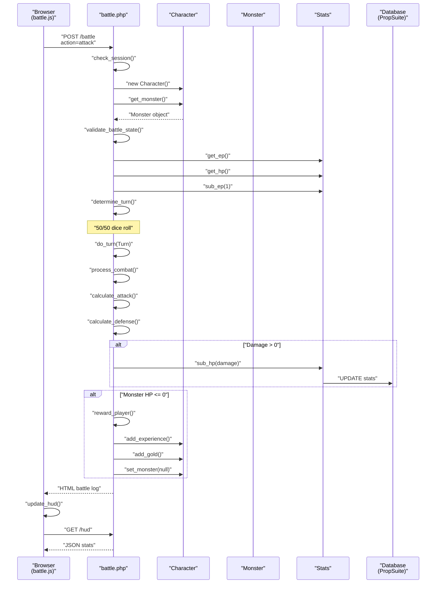
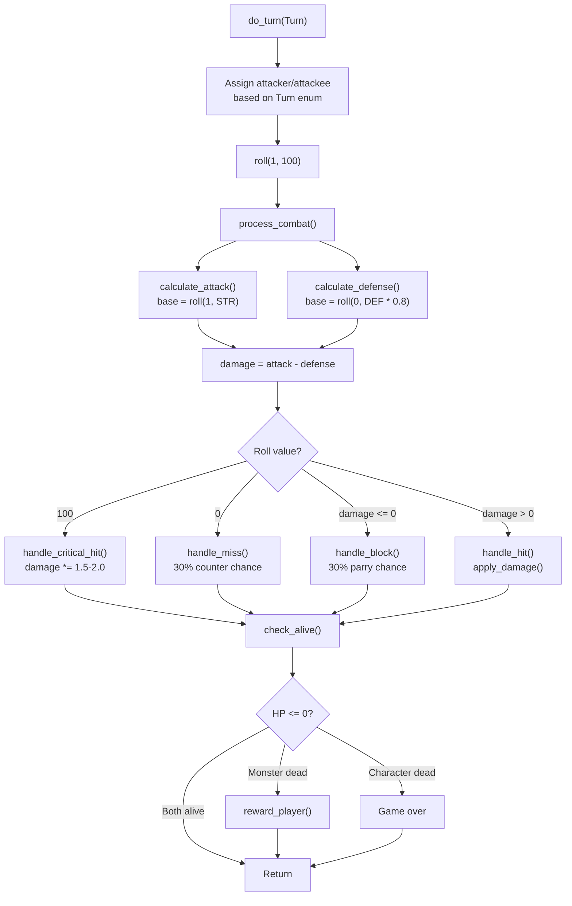
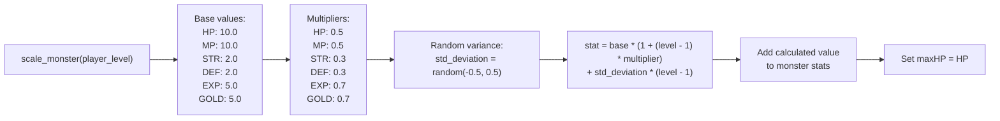
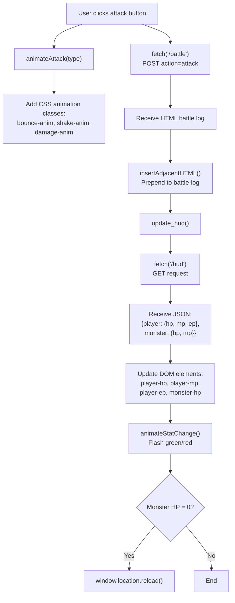
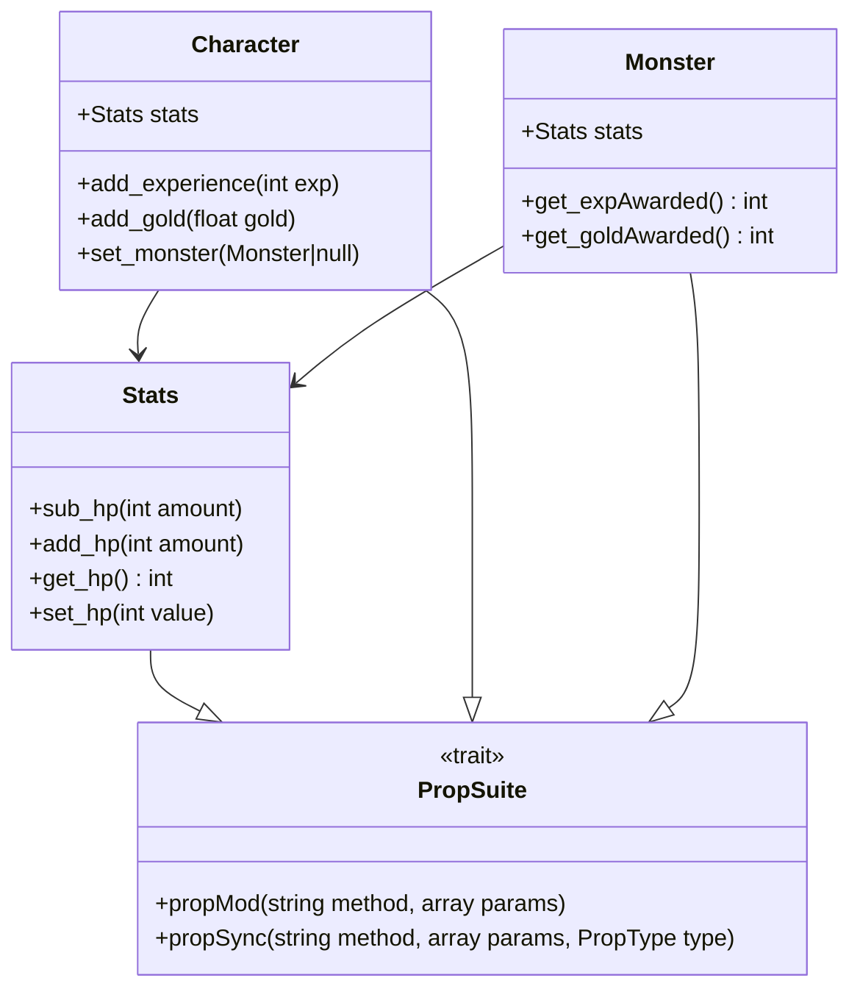
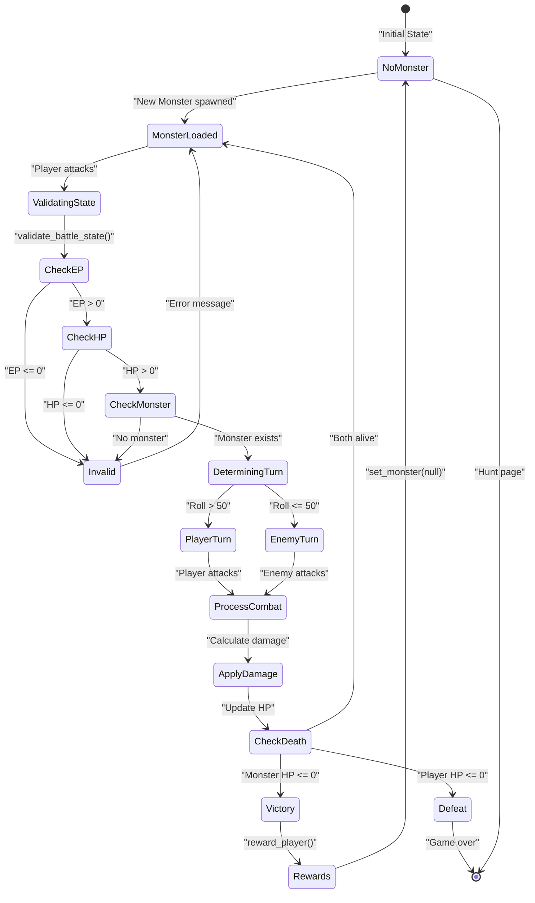

# Combat System

<details>
<summary>Relevant source files</summary>

The following files were used as context for generating this wiki page:

- [battle.php](battle.php)
- [js/battle.js](js/battle.js)
- [src/Account/Account.php](src/Account/Account.php)
- [src/Character/Character.php](src/Character/Character.php)
- [src/Character/Stats.php](src/Character/Stats.php)
- [src/Familiar/Familiar.php](src/Familiar/Familiar.php)
- [src/Monster/Monster.php](src/Monster/Monster.php)
- [src/Monster/Stats.php](src/Monster/Stats.php)

</details>


## Purpose and Scope

The Combat System implements turn-based battles between player characters and monsters. This document covers combat mechanics, damage calculations, turn resolution, and reward distribution. For monster generation and scaling mechanics, see [Monster System](#5.3). For character stats and progression, see [Character Management](#5.1).

The combat system is implemented primarily in `battle.php` as a POST endpoint that processes combat actions and returns battle log HTML fragments consumed by client-side JavaScript.

**Sources:** [battle.php:1-282]()

---

## Combat Architecture

### Request Flow Diagram



**Sources:** [battle.php:14-45](), [js/battle.js:52-87](), [js/battle.js:107-144]()

---

## Battle State Validation

Before any combat action executes, `validate_battle_state()` verifies preconditions:

| Validation Check | Response Code | Error Message | Location |
|-----------------|---------------|---------------|----------|
| EP ≤ 0 | 401 | "No EP Left" | [battle.php:58-63]() |
| HP ≤ 0 | 401 | "No HP Left" | [battle.php:65-70]() |
| Monster null | 401 | "No Monster" | [battle.php:72-77]() |
| Monster HP ≤ 0 | 401 | "Monster is Dead" | [battle.php:79-84]() |

If all checks pass, the function deducts 1 EP from the character via `$character->stats->sub_ep(1)` at [battle.php:86]().

**Energy Point (EP) Consumption:** Each combat action costs 1 EP, limiting consecutive attacks and encouraging strategic resource management.

**Sources:** [battle.php:55-88]()

---

## Turn Resolution

### Turn Determination

The combat system uses a 50/50 random roll to determine initiative:

```php
function determine_turn() {
    return roll(1, 100) > 50 ? Turn::PLAYER : Turn::ENEMY;
}
```

**Sources:** [battle.php:90-92]()

### Turn Processing Flow



**Sources:** [battle.php:100-114](), [battle.php:116-156]()

---

## Combat Calculations

### Attack Calculation

Attack damage is determined by rolling a random value between 1 and the attacker's STR stat:

```php
function calculate_attack($attacker, $roll) {
    $base_attack = roll(1, intval($attacker->stats->get_str()));
    return $roll === 100 ? $base_attack * 2 : $base_attack;
}
```

Critical hits (roll = 100) automatically double the base attack before defense calculations.

**Sources:** [battle.php:158-167]()

### Defense Calculation

Defense reduces incoming damage by rolling between 0 and 80% of the defender's DEF stat:

```php
function calculate_defense($defender) {
    $defense = roll(0, intval($defender->stats->get_def() * 0.8));
    return $defense;
}
```

This 0.8 multiplier ensures defense doesn't completely nullify attacks, maintaining combat engagement.

**Sources:** [battle.php:169-178]()

### Damage Formula

```
final_damage = max(0, attack - defense)
```

Negative damage results in blocks/parries (see Special Combat Events).

**Sources:** [battle.php:128]()

---

## Special Combat Events

### Critical Hits

**Trigger Condition:** Dice roll = 100 (1% chance)

Critical hits apply an additional damage multiplier of 1.5-2.0× after the initial 2× attack bonus:

```php
function handle_critical_hit(&$damage) {
    $damage *= intval(random_float(1.5, 2.0, 2));
}
```

**Effective Total Multiplier:** 3.0-4.0× base damage

**Sources:** [battle.php:180-189]()

### Missed Attacks

**Trigger Condition:** Dice roll = 0 (1% chance)

When an attack misses, there's a 30% chance the defender counters for 50% of their STR:

```php
function handle_miss($attacker, $attackee, Turn $turn) {
    // Attack misses...
    if (roll(1, 100) > 70) {
        $counter_damage = roll(1, intval($attackee->stats->get_str() * 0.5));
        apply_damage($attacker, $counter_damage);
        check_alive($attacker, $turn);
    }
}
```

**Sources:** [battle.php:191-213]()

### Blocked Attacks

**Trigger Condition:** `damage <= 0` after defense calculation

Blocked attacks trigger a 30% parry chance, dealing 25% of defender's STR back to attacker:

```php
function handle_block($attacker, $attackee, Turn $turn) {
    $parry_chance = roll(1, 100);
    if ($parry_chance > 70) { // 30% parry
        $parry_dmg = roll(1, intval($attackee->stats->get_str() * 0.25));
        apply_damage($attacker, $parry_dmg);
    } else {
        apply_damage($attackee, 1); // Chip damage
    }
}
```

If parry fails, defender still takes 1 chip damage.

**Sources:** [battle.php:215-229]()

### Combat Event Probability Table

| Event | Trigger | Probability | Effect |
|-------|---------|-------------|--------|
| Critical Hit | Roll = 100 | 1% | 3.0-4.0× damage |
| Miss | Roll = 0 | 1% | No damage, 30% counter |
| Block/Parry | damage ≤ 0 | Variable* | 30% parry (0.25× STR反击) |
| Regular Hit | damage > 0 | ~98% | Normal damage |

*Block probability depends on relative STR/DEF stats.

**Sources:** [battle.php:136-155]()

---

## Damage Application and Death

### Damage Application

The `apply_damage()` function uses the Stats object's `sub_hp()` method, which is part of the PropSuite ORM:

```php
function apply_damage($target, $damage) {
    $target->stats->sub_hp($damage);
}
```

The `sub_hp()` method automatically persists changes to the database via PropSuite's `propMod()` system.

**Sources:** [battle.php:239-251](), [src/Character/Stats.php:60]()

### Death Check

After damage application, `check_alive()` verifies if HP ≤ 0:

```php
function check_alive($target, Turn $turn): void {
    if ($target->stats->get_hp() <= 0) {
        // Display defeat message
        if ($turn == Turn::PLAYER) {    
            reward_player();
        }
        $character->set_monster(null);
    }
}
```

**Sources:** [battle.php:253-265]()

---

## Victory and Rewards

### Reward Distribution

When a monster is defeated, `reward_player()` grants experience and gold:

```php
function reward_player() {
    global $character, $monster, $out_msg;

    $exp_gained = $monster->get_expAwarded();
    $gold_gained = $monster->get_goldAwarded();

    $character->add_experience($exp_gained);
    $character->add_gold($gold_gained);
    $character->set_monster(null);

    $out_msg .= "<span class=\"text-success\">Victory! You gained $exp_gained experience and $gold_gained gold!</span><br>";
}
```

**Reward Scaling:** Monster rewards are determined during monster generation/scaling. See `Monster::scale_monster()` at [src/Monster/Monster.php:121-153]() which calculates:

```
expAwarded = 5.0 * (1 + (player_level - 1) * 0.7) + std_deviation
goldAwarded = 5.0 * (1 + (player_level - 1) * 0.7) + std_deviation
```

**Sources:** [battle.php:267-278](), [src/Monster/Monster.php:124-127]()

---

## Monster Scaling System

Monsters scale their stats relative to player level to maintain challenge parity:

### Scaling Algorithm



### Example Scaling Values

| Player Level | Base HP | HP Multiplier | Avg HP Result |
|--------------|---------|---------------|---------------|
| 1 | 10 | 0.5 | 10 |
| 5 | 10 | 0.5 | 20 |
| 10 | 10 | 0.5 | 32.5 |
| 20 | 10 | 0.5 | 57.5 |

**Sources:** [src/Monster/Monster.php:121-153]()

---

## Client-Side Integration

### Battle UI Updates

The `battle.js` file manages combat UI interactions and HUD updates:



### HUD Update Endpoint

The `/hud` endpoint (not shown in provided files) returns JSON with current stats:

```javascript
{
    player: {
        hp: 150,
        maxHP: 200,
        mp: 80,
        maxMP: 100,
        ep: 45,
        maxEP: 100
    },
    monster: {
        hp: 25,
        maxHP: 80,
        mp: 10,
        maxMP: 20
    }
}
```

**Sources:** [js/battle.js:107-144](), [js/battle.js:52-87]()

### Animation System

The client applies CSS animation classes based on combat type:

| Attack Type | Player Animation | Monster Animation |
|-------------|------------------|-------------------|
| Physical Attack | `bounce-anim` | `shake-anim`, `damage-anim` |
| Burn Spell | `spellcast-anim` | `spell-burn`, `damage-anim` |
| Frost Spell | `spellcast-anim` | `spell-frost`, `damage-anim` |
| Heal Spell | `spellcast-anim`, `spell-heal` | None |

**Sources:** [js/battle.js:15-40]()

---

## Combat Action Verbs

The battle system randomizes combat flavor text using predefined verb/adverb arrays:

```php
$verbs = ["attacks", "pummels", "strikes", "assaults", "blugeons", 
          "ambushes", "beats", "besieges", "blasts", "bombards", 
          "charges", "harms", "hits", "hurts", "infiltrates", 
          "invades", "raids", "stabs", "storms", "strikes"];

$adverbs = ["clumsily", "lazily", "spastically", "carefully", "precisely"];
```

Combat messages are constructed as:

```
"{attacker} {adverb} {verb} {defender} for {damage} damage!"
```

Example: "Dragon carefully strikes Warrior for 25 damage!"

**Sources:** [battle.php:11-12]()

---

## Database Persistence

### PropSuite Integration

All stat modifications automatically persist to the database via the PropSuite trait:



**PropType Enums:**
- `PropType::CSTATS` - Character stats table
- `PropType::MSTATS` - Monster stats table
- `PropType::CHARACTER` - Characters table
- `PropType::MONSTER` - Monsters table

When `$character->stats->sub_hp(25)` is called:
1. PropSuite intercepts via `__call()` magic method
2. Matches pattern `/^(add|sub|exp|mod|mul|div)_/`
3. Calls `propMod()` which updates database
4. Returns updated value

**Sources:** [src/Character/Stats.php:113-128](), [src/Monster/Stats.php:65-67](), [battle.php:239-251]()

---

## Battle State Flow Summary



**Sources:** [battle.php:36-45](), [battle.php:55-88](), [battle.php:100-156](), [battle.php:253-278]()