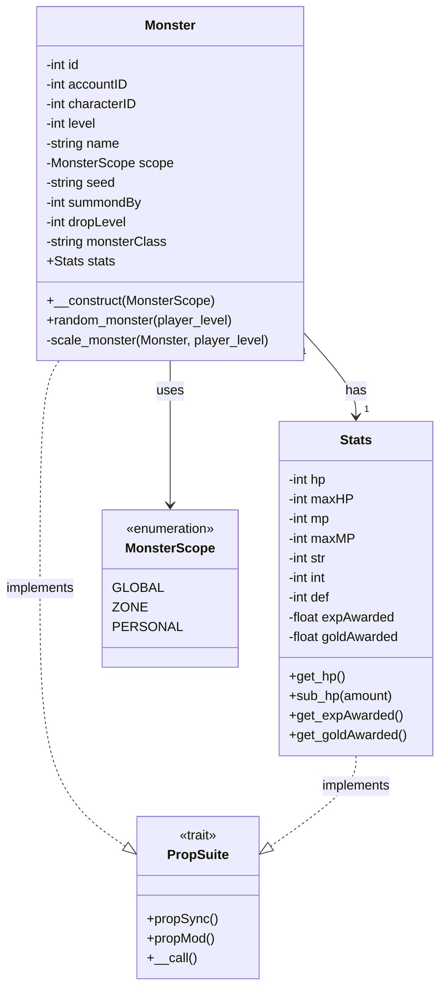
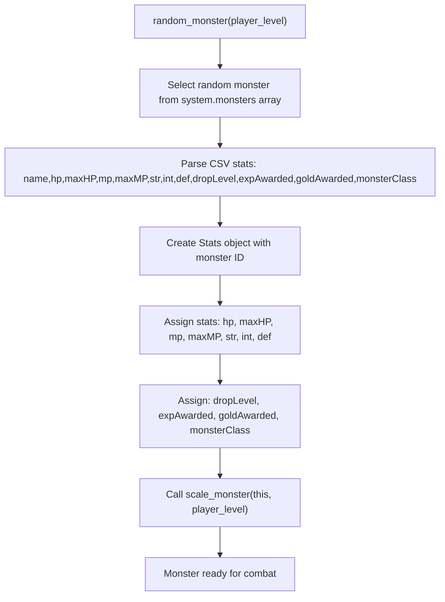
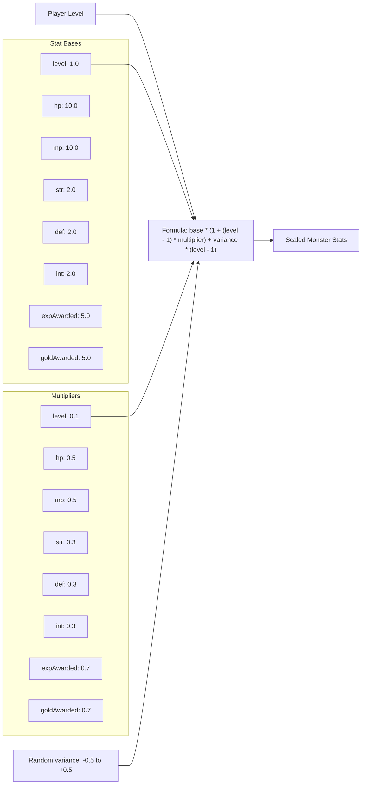
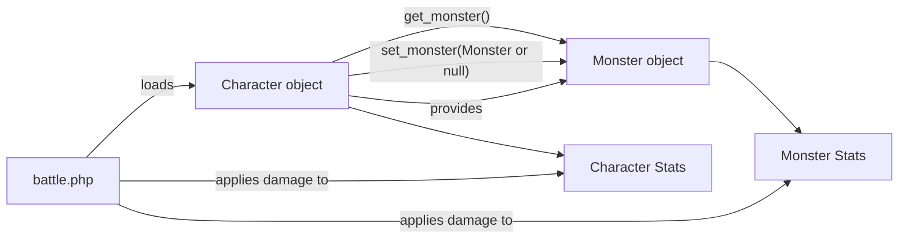
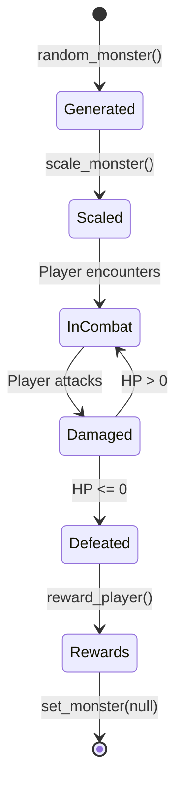
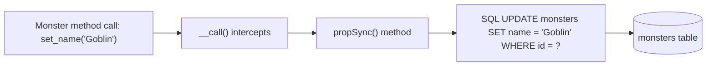

# Monster System

<details>
<summary>Relevant source files</summary>

The following files were used as context for generating this wiki page:

- [battle.php](battle.php)
- [js/battle.js](js/battle.js)
- [src/Account/Account.php](src/Account/Account.php)
- [src/Character/Character.php](src/Character/Character.php)
- [src/Character/Stats.php](src/Character/Stats.php)
- [src/Familiar/Familiar.php](src/Familiar/Familiar.php)
- [src/Monster/Monster.php](src/Monster/Monster.php)
- [src/Monster/Stats.php](src/Monster/Stats.php)

</details>


The Monster System handles enemy creatures that players encounter during combat. Monsters are dynamically generated with scaled stats based on player level, support multiple spawn scopes (GLOBAL, ZONE, PERSONAL), and provide experience and gold rewards upon defeat. This page documents the `Monster` and `Monster\Stats` classes, monster generation algorithms, and integration with the combat system.

For information about combat mechanics and battle flow, see [Combat System](#5.2). For character stats and progression, see [Character Management](#5.1).

---

## Monster Class Architecture

The `Monster` class represents an enemy encounter with stats, level scaling, and loot drops. It uses the `PropSuite` trait for database synchronization with `PropType::MONSTER`.



**Sources:** [src/Monster/Monster.php:1-182](), [src/Monster/Stats.php:1-68]()

---

## Monster Properties

### Core Properties

| Property | Type | Description |
|----------|------|-------------|
| `id` | `int\|null` | Unique database identifier |
| `accountID` | `int\|null` | Account ID for personal monsters |
| `characterID` | `int\|null` | Character ID for personal monsters |
| `level` | `int` | Monster level (scaled to player) |
| `name` | `string\|null` | Display name (e.g., "Goblin Warrior") |
| `scope` | `MonsterScope` | Spawn type: GLOBAL/ZONE/PERSONAL |
| `seed` | `string` | Random seed for stat generation |
| `summondBy` | `int\|null` | Summoner ID for global/zone monsters |
| `dropLevel` | `int` | Loot tier/quality level |
| `monsterClass` | `string\|null` | Monster type/class identifier |
| `stats` | `Stats` | Combat statistics object |

**Sources:** [src/Monster/Monster.php:39-70]()

### Monster Scope Types

The `MonsterScope` enum defines three spawn types:

- **GLOBAL**: World bosses visible to all players
- **ZONE**: Area-specific monsters visible to players in that zone
- **PERSONAL**: Solo encounters unique to a single character

**Sources:** [src/Monster/Monster.php:3-11](), [src/Monster/Monster.php:54-55]()

---

## Monster Generation and Scaling

### Random Monster Generation

The `random_monster()` method generates a monster from the system's monster pool and scales it to player level:



**Sources:** [src/Monster/Monster.php:155-180]()

### Monster Scaling Algorithm

The `scale_monster()` method adjusts monster stats based on player level using a base + multiplier formula with random variance:



**Scaling Implementation:**

| Stat | Base | Multiplier | Effect at Level 10 (approx) |
|------|------|------------|------------------------------|
| HP | 10.0 | 0.5 | 55 HP |
| MP | 10.0 | 0.5 | 55 MP |
| STR | 2.0 | 0.3 | 7.4 STR |
| DEF | 2.0 | 0.3 | 7.4 DEF |
| INT | 2.0 | 0.3 | 7.4 INT |
| Experience | 5.0 | 0.7 | 36.5 EXP |
| Gold | 5.0 | 0.7 | 36.5 Gold |

The standard deviation ranges from -0.5 to +0.5, creating variance across encounters. After scaling, `maxHP` is synchronized with the new `hp` value.

**Sources:** [src/Monster/Monster.php:121-153]()

---

## Monster Stats

The `Monster\Stats` class extends `BaseStats` and includes reward properties for combat victory:

### Stats Properties

| Property | Type | Description |
|----------|------|-------------|
| `hp` | `int` | Current health points |
| `maxHP` | `int` | Maximum health points |
| `mp` | `int` | Current mana points |
| `maxMP` | `int` | Maximum mana points |
| `str` | `int` | Strength (attack damage) |
| `int` | `int` | Intelligence (magic damage) |
| `def` | `int` | Defense (damage mitigation) |
| `expAwarded` | `float` | Experience points on defeat |
| `goldAwarded` | `float` | Gold currency on defeat |

**PropType:** Uses `PropType::MSTATS` for database table resolution.

**Sources:** [src/Monster/Stats.php:1-68]()

### Dynamic Property Methods

Both `Monster` and `Monster\Stats` support dynamic property access via the `PropSuite` trait:

- **Getters**: `get_hp()`, `get_name()`, `get_expAwarded()`
- **Setters**: `set_hp($value)`, `set_name($value)`, `set_expAwarded($value)`
- **Modifiers**: `add_hp($amount)`, `sub_hp($amount)` (automatically capped at `maxHP`)

**Sources:** [src/Monster/Monster.php:95-111](), [src/Monster/Stats.php:65-67]()

---

## Integration with Combat System

### Character-Monster Relationship

Characters maintain a reference to their current monster encounter:



**Sources:** [src/Character/Character.php:137-138](), [battle.php:14-18]()

### Combat Flow Integration

In `battle.php`, monsters are accessed through the character object:

1. **Load Monster**: `$monster = $character->get_monster();` [battle.php:16]()
2. **Validate State**: Check monster exists and has HP > 0 [battle.php:72-84]()
3. **Apply Damage**: `$monster->stats->sub_hp($damage);` [battle.php:242]()
4. **Check Death**: If monster HP ≤ 0, trigger `reward_player()` [battle.php:256-264]()
5. **Grant Rewards**: Award `expAwarded` and `goldAwarded` [battle.php:267-277]()
6. **Clear Encounter**: `$character->set_monster(null);` [battle.php:275]()

**Sources:** [battle.php:1-282]()

---

## Monster Lifecycle



### 1. Generation Phase

```php
$monster = new Monster(MonsterScope::PERSONAL);
$monster->random_monster($player_level);
```

- Creates `Monster` with specified scope [src/Monster/Monster.php:78-81]()
- Generates random seed for stat variance [src/Monster/Monster.php:80]()
- Selects monster from system pool [src/Monster/Monster.php:157]()

### 2. Scaling Phase

- Calculates stats based on player level [src/Monster/Monster.php:129-146]()
- Applies random variance [src/Monster/Monster.php:127-131]()
- Syncs `maxHP` with scaled `hp` [src/Monster/Monster.php:150]()

### 3. Combat Phase

- Character stores monster reference [src/Character/Character.php:137-138]()
- Battle system validates monster state [battle.php:55-88]()
- Damage applied via `stats->sub_hp()` [battle.php:242]()

### 4. Defeat Phase

- Check if `hp <= 0` in `check_alive()` [battle.php:253-265]()
- Call `reward_player()` if defeated [battle.php:260]()
- Award `expAwarded` and `goldAwarded` [battle.php:270-274]()
- Clear encounter with `set_monster(null)` [battle.php:263]()

**Sources:** [src/Monster/Monster.php:78-180](), [battle.php:253-278]()

---

## Database Persistence

### PropSuite Integration

Monsters use the `PropSuite` trait with `PropType::MONSTER` for automatic database synchronization:



**Dynamic Method Resolution:**

1. Setter/Getter patterns: `set_*()`, `get_*()` → routed to `propSync()` [src/Monster/Monster.php:109]()
2. Math operations: `add_*()`, `sub_*()`, `mul_*()`, `div_*()`, `exp_*()`, `mod_*()` → routed to `propMod()` [src/Monster/Monster.php:103-104]()
3. Dump/Restore: `propDump()`, `propRestore()` → direct execution [src/Monster/Monster.php:105-107]()

**Sources:** [src/Monster/Monster.php:95-111]()

### Monster Stats Persistence

Monster stats use `PropType::MSTATS` to target the monster stats table:

- Stats automatically persist on setter calls
- Damage application via `sub_hp()` immediately updates database
- Reward properties (`expAwarded`, `goldAwarded`) stored with stats

**Sources:** [src/Monster/Stats.php:65-67]()

---

## Monster Data Structure

### System Monster Pool

Monsters are stored in the `$system->monsters` array as CSV strings:

```
Format: name,hp,maxHP,mp,maxMP,str,int,def,dropLevel,expAwarded,goldAwarded,monsterClass
Example: "Goblin Warrior,20,20,10,10,5,3,4,1,10,8,goblin"
```

The `random_monster()` method parses these values:

1. Select random index from array [src/Monster/Monster.php:157]()
2. Split CSV by comma [src/Monster/Monster.php:158]()
3. Assign to Stats object [src/Monster/Monster.php:164-170]()
4. Set reward properties [src/Monster/Monster.php:172-174]()
5. Apply scaling [src/Monster/Monster.php:179]()

**Sources:** [src/Monster/Monster.php:155-180]()

---

## Example Usage

### Creating and Encountering a Monster

```php
use Game\Monster\Monster;
use Game\Monster\Enums\MonsterScope;

// Generate personal encounter
$monster = new Monster(MonsterScope::PERSONAL);
$monster->random_monster($character->get_level());

// Assign to character
$character->set_monster($monster);

// Access monster data
$name = $monster->get_name();
$hp = $monster->stats->get_hp();
$exp_reward = $monster->stats->get_expAwarded();
```

### Combat Integration

```php
// In battle.php
$monster = $character->get_monster();

// Apply damage
$damage = 15;
$monster->stats->sub_hp($damage);

// Check defeat
if ($monster->stats->get_hp() <= 0) {
    $character->add_experience($monster->stats->get_expAwarded());
    $character->add_gold($monster->stats->get_goldAwarded());
    $character->set_monster(null);
}
```

**Sources:** [battle.php:14-278]()

---

## Database Schema

### monsters Table

| Column | Type | Description |
|--------|------|-------------|
| `id` | INT PRIMARY KEY | Unique identifier |
| `account_id` | INT NULL | Account for personal monsters |
| `character_id` | INT NULL | Character for personal monsters |
| `level` | INT | Monster level |
| `name` | VARCHAR | Display name |
| `scope` | ENUM | GLOBAL/ZONE/PERSONAL |
| `seed` | VARCHAR(16) | Random generation seed |
| `summond_by` | INT NULL | Summoner ID |
| `drop_level` | INT | Loot tier |
| `monster_class` | VARCHAR | Type/class identifier |

### monster_stats Table

| Column | Type | Description |
|--------|------|-------------|
| `id` | INT PRIMARY KEY | References monster.id |
| `hp` | INT | Current health |
| `max_hp` | INT | Maximum health |
| `mp` | INT | Current mana |
| `max_mp` | INT | Maximum mana |
| `str` | INT | Strength stat |
| `int` | INT | Intelligence stat |
| `def` | INT | Defense stat |
| `exp_awarded` | FLOAT | Experience reward |
| `gold_awarded` | FLOAT | Gold reward |

**Sources:** Inferred from [src/Monster/Monster.php:39-70]() and [src/Monster/Stats.php:49-54]()

---

## Key Constants and Enumerations

### MonsterScope Enum

```php
namespace Game\Monster\Enums;

enum MonsterScope {
    case GLOBAL;    // World bosses
    case ZONE;      // Area-specific
    case PERSONAL;  // Solo encounters
}
```

**Sources:** [src/Monster/Monster.php:3]()

---

## Related Systems

- **[Combat System](#5.2)**: Handles turn-based battles with monsters
- **[Character Management](#5.1)**: Characters store current monster encounters
- **[PropSuite ORM](#6.2)**: Provides database synchronization for Monster entities

**Sources:** [battle.php:1-282](), [src/Character/Character.php:137-138]()