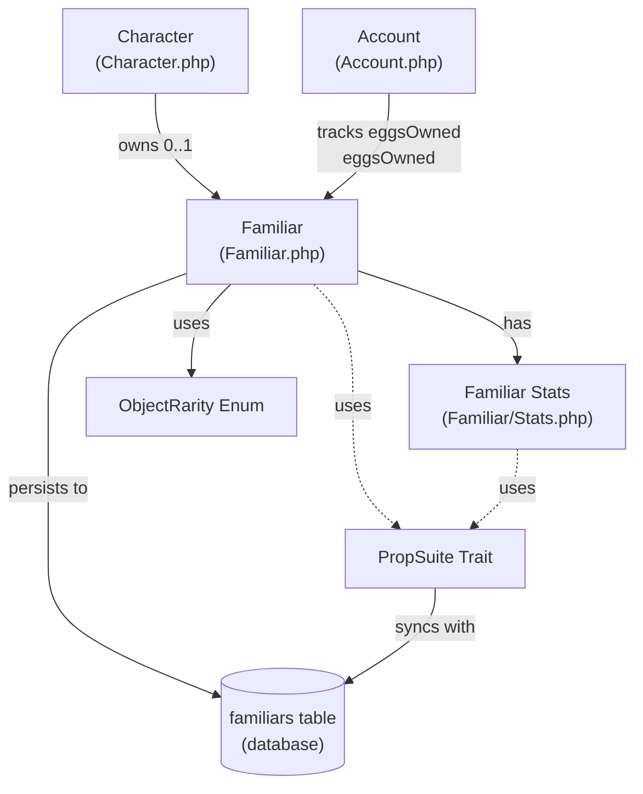
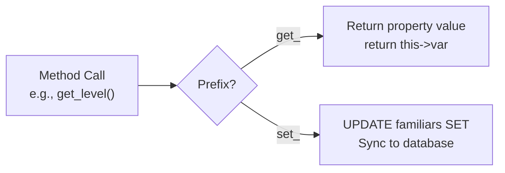
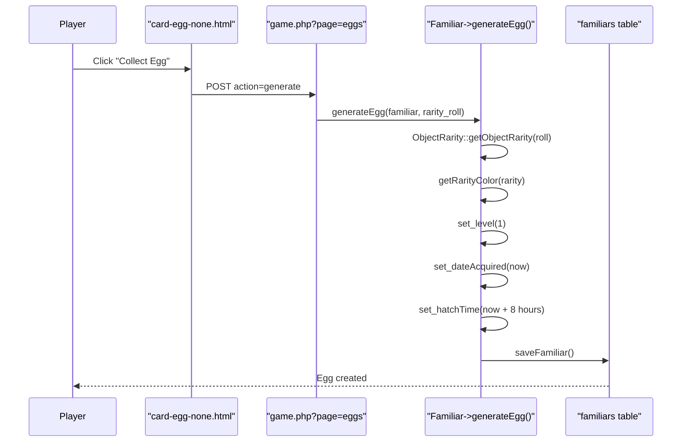
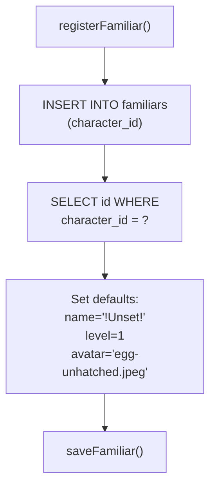
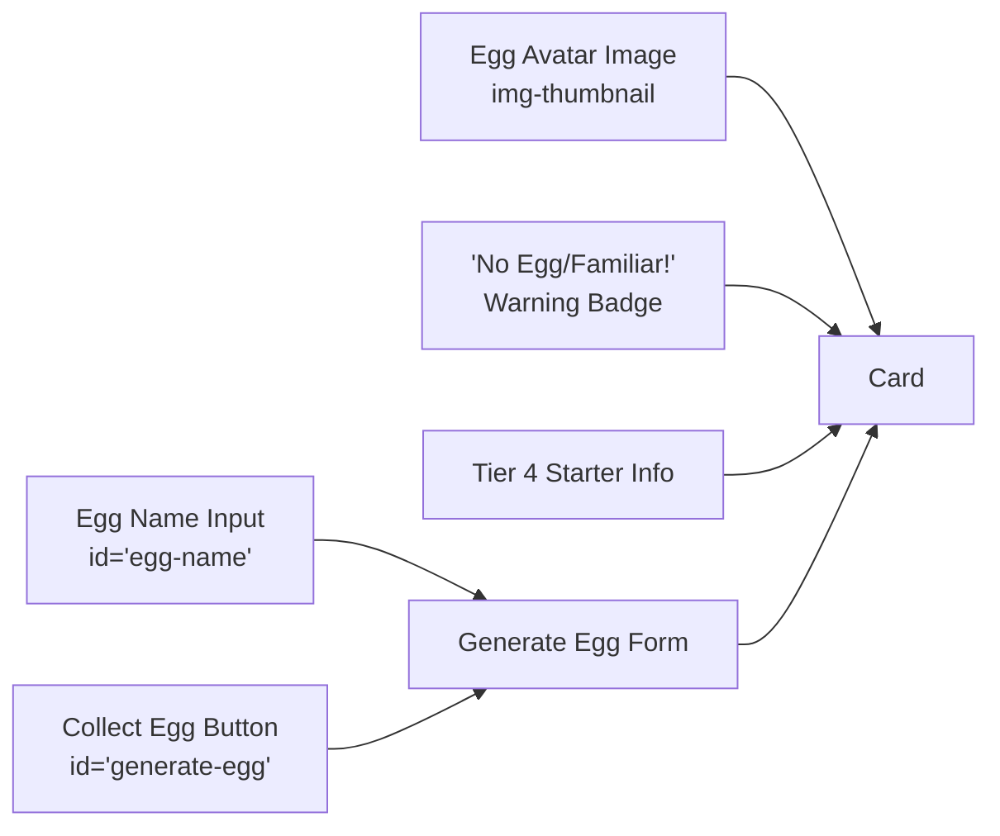
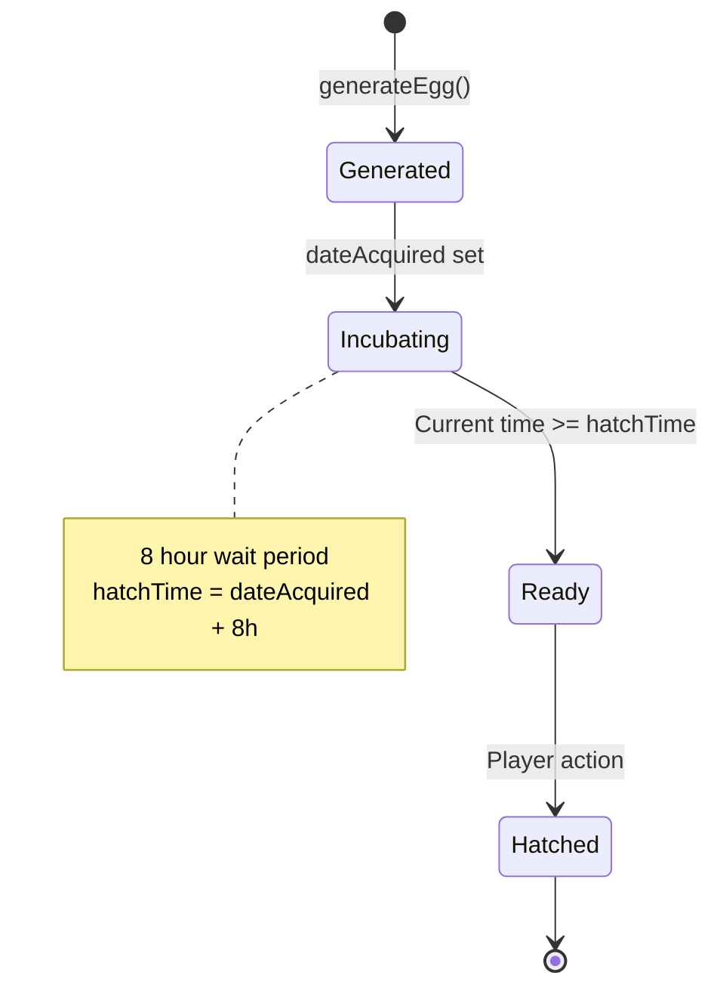
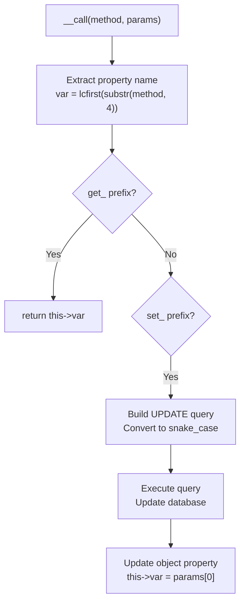

# Familiar System

<details>
<summary>Relevant source files</summary>

The following files were used as context for generating this wiki page:

- [html/card-egg-none.html](html/card-egg-none.html)
- [src/Account/Account.php](src/Account/Account.php)
- [src/Character/Character.php](src/Character/Character.php)
- [src/Character/Stats.php](src/Character/Stats.php)
- [src/Familiar/Familiar.php](src/Familiar/Familiar.php)
- [src/Monster/Stats.php](src/Monster/Stats.php)

</details>


The Familiar System provides companion creatures that assist characters in combat and progression. This document covers familiar acquisition through eggs, hatching mechanics, rarity tiers, stat management, and database persistence. For character-level progression mechanics, see [Character Management](#5.1). For combat mechanics involving familiars, see [Combat System](#5.2).

## Overview

Familiars are companion pets that characters acquire as eggs, which hatch after a time period. Each familiar has its own stats, level progression, and rarity tier. The system is implemented through the `Familiar` class ([src/Familiar/Familiar.php]()) and integrates with the Character and Account systems.

**Sources:** [src/Familiar/Familiar.php:1-311](), [src/Character/Character.php:137-147](), [src/Account/Account.php:131-135]()

## System Architecture



**Sources:** [src/Familiar/Familiar.php:1-40](), [src/Character/Character.php:137-147](), [src/Account/Account.php:131-135]()

## Familiar Class Structure

The `Familiar` class ([src/Familiar/Familiar.php:39-311]()) manages all aspects of familiar entities. It uses the `PropSuite` trait for database synchronization and provides dynamic get/set methods through `__call()`.

### Core Properties

| Property | Type | Default | Description |
|----------|------|---------|-------------|
| `id` | `?int` | `null` | Unique familiar identifier |
| `characterID` | `?int` | `null` | Owner character ID |
| `level` | `int` | `1` | Current familiar level |
| `experience` | `int` | `0` | Current experience points |
| `nextLevel` | `int` | `100` | XP required for next level |
| `name` | `?string` | `null` | Display name of familiar |
| `avatar` | `mixed` | `null` | Avatar image file path |
| `stats` | `?Stats` | `null` | Combat statistics object |

**Sources:** [src/Familiar/Familiar.php:42-64]()

### Dynamic Property Access

The `Familiar` class implements a custom `__call()` method ([src/Familiar/Familiar.php:284-310]()) that provides dynamic get/set accessors:



**Example methods:**
- `get_level()` - Returns familiar level
- `set_name(string $name)` - Sets familiar name and updates database
- `get_characterID()` - Returns owning character ID

**Sources:** [src/Familiar/Familiar.php:284-310]()

## Egg Generation System

### Rarity Tiers

Familiar eggs are generated with rarity levels determined by dice rolls. The `ObjectRarity` enum defines 11 rarity tiers:

| Rarity | Color Code | Description |
|--------|------------|-------------|
| WORTHLESS | `#FACEF0` | Lowest tier |
| TARNISHED | `#779988` | Poor quality |
| COMMON | `#ADD8D7` | Standard drop |
| ENCHANTED | `#A6D9F8` | Above average |
| MAGICAL | `#08E71C` | Rare |
| LEGENDARY | `#F8C81C` | Very rare |
| EPIC | `#CAB51F` | Exceptional |
| MYSTIC | `#01CBF6` | Mystical quality |
| HEROIC | `#1C4F2C` | Heroic tier |
| INFAMOUS | `#CB20EE` | Dark/infamous |
| GODLY | `#FF2501` | Highest tier |

**Sources:** [src/Familiar/Familiar.php:210-253]()

### Generation Process



The `generateEgg()` method ([src/Familiar/Familiar.php:263-282]()) performs the following operations:

1. Determines rarity from dice roll using `ObjectRarity::getObjectRarity()`
2. Maps rarity to color code via `getRarityColor()`
3. Sets initial level to 1
4. Records acquisition timestamp
5. Sets hatch time to 8 hours in the future
6. Initializes egg counters
7. Persists to database via `saveFamiliar()`

**Sources:** [src/Familiar/Familiar.php:263-282](), [html/card-egg-none.html:30-48]()

## Database Persistence

### Familiar Registration

When a character first accesses the familiar system, a familiar entry is registered via `registerFamiliar()` ([src/Familiar/Familiar.php:82-100]()):



**Sources:** [src/Familiar/Familiar.php:82-100]()

### Data Synchronization

The `saveFamiliar()` method ([src/Familiar/Familiar.php:108-137]()) persists all familiar properties to the database:

1. Iterates through all object properties
2. Converts camelCase property names to snake_case columns via `clsprop_to_tblcol()`
3. Builds UPDATE query with property values
4. Executes parameterized query with familiar ID

The `loadFamiliar()` method ([src/Familiar/Familiar.php:177-201]()) performs the reverse operation:

1. Queries `familiars` table by `character_id`
2. If no record exists, calls `registerFamiliar()`
3. Maps snake_case columns to camelCase properties
4. Populates object state

**Sources:** [src/Familiar/Familiar.php:108-137](), [src/Familiar/Familiar.php:177-201]()

## Familiar Stats System

Familiars have their own stats system separate from character stats. While the implementation details are partially commented out in the codebase ([src/Familiar/Familiar.php:313-371]()), the architecture shows that familiars use a `Stats` object ([src/Familiar/Familiar.php:63-64]()).

### Expected Stats Structure

Based on commented code and system architecture:

| Stat Category | Attributes |
|---------------|------------|
| **Resources** | health, maxHealth, mana, maxMana, energy, maxEnergy |
| **Combat** | intelligence, strength, defense |
| **Progression** | level, experience, nextLevel |
| **Tracking** | eggsOwned, eggsSeen |

**Sources:** [src/Familiar/Familiar.php:313-371](), [src/Familiar/Familiar.php:63-64]()

## Integration with Account System

The `Account` class tracks familiar-related metrics:

| Property | Type | Purpose |
|----------|------|---------|
| `eggsOwned` | `int` | Total eggs acquired by account |
| `eggsSeen` | `int` | Unique egg types encountered |

These properties support account-wide familiar collection tracking across all character slots.

**Sources:** [src/Account/Account.php:131-135]()

## UI Components

### No Egg/Familiar Card

The `card-egg-none.html` template ([html/card-egg-none.html:1-60]()) displays when a character has no familiar:



Key form elements:
- **Action:** `?page=eggs`
- **Method:** `POST`
- **Hidden Field:** `action=generate`
- **Name Input:** Optional egg naming field (`id="egg-name"`)
- **Submit Button:** `id="generate-egg"`, `value="1"`

**Sources:** [html/card-egg-none.html:1-60]()

### Current Egg/Familiar Card

The `getCard()` method ([src/Familiar/Familiar.php:146-167]()) generates HTML for displaying familiars. The implementation includes:

- **Empty card** (`$which === 'empty'`): Loads `card-egg-none.html`
- **Current card** (`$which === 'current'`): Intended to show egg timer and status (currently commented out)

**Sources:** [src/Familiar/Familiar.php:146-167]()

## Hatching Mechanics

### Time-Based Hatching

Eggs are configured to hatch 8 hours after acquisition ([src/Familiar/Familiar.php:276]()):

```php
$familiar->set_hatchTime(get_mysql_datetime('+8 hours'));
```

The system records:
- `dateAcquired`: Timestamp when egg was obtained
- `hatchTime`: Future timestamp when egg becomes available

### Expected Hatch Flow



**Sources:** [src/Familiar/Familiar.php:263-282]()

## PropSuite Integration

The `Familiar` class uses the `PropSuite` trait ([src/Familiar/Familiar.php:40]()) for database operations. This provides:

- Automatic property-to-column mapping via `clsprop_to_tblcol()`
- Dynamic get/set methods through `__call()`
- Database synchronization on property changes

The custom `__call()` implementation ([src/Familiar/Familiar.php:284-310]()) extends PropSuite with familiar-specific logic:



**Sources:** [src/Familiar/Familiar.php:284-310](), [src/Traits/PropSuite/PropSuite.php]()

## Database Schema Reference

The `familiars` table stores familiar state. Based on the code, expected columns include:

| Column | Type | Description |
|--------|------|-------------|
| `id` | INT | Primary key |
| `character_id` | INT | Foreign key to characters |
| `level` | INT | Current level |
| `experience` | INT | Current XP |
| `next_level` | INT | XP threshold |
| `name` | VARCHAR | Familiar name |
| `avatar` | VARCHAR | Avatar path |
| `rarity` | ENUM | ObjectRarity value |
| `rarity_color` | VARCHAR | Hex color code |
| `last_roll` | FLOAT | Rarity dice roll |
| `date_acquired` | DATETIME | Acquisition timestamp |
| `hatch_time` | DATETIME | Hatch timestamp |
| `hatched` | BOOLEAN | Hatch status |
| `eggs_owned` | INT | Counter |
| `eggs_seen` | INT | Counter |

**Sources:** [src/Familiar/Familiar.php:42-64](), [src/Familiar/Familiar.php:263-282]()

## Key Methods Reference

### Constructor

**Signature:** `__construct(int $characterID, string $table)`

Initializes familiar instance with character ID. The `$table` parameter appears to be legacy.

**Sources:** [src/Familiar/Familiar.php:72-74]()

### registerFamiliar()

**Signature:** `registerFamiliar(): void`

Creates new familiar database entry with default values:
- Name: `'!Unset!'`
- Level: `1`
- Avatar: `'img/generated/eggs/egg-unhatched.jpeg'`

**Sources:** [src/Familiar/Familiar.php:82-100]()

### generateEgg()

**Signature:** `generateEgg(Familiar $familiar, float $rarity_roll): void`

Configures a familiar as a new egg with rarity-based properties and 8-hour hatch timer.

**Sources:** [src/Familiar/Familiar.php:263-282]()

### getRarityColor()

**Signature:** `getRarityColor(ObjectRarity $rarity): string`

Maps ObjectRarity enum values to hex color codes for UI display.

**Returns:** Hex color string (e.g., `"#FF2501"` for GODLY)

**Sources:** [src/Familiar/Familiar.php:210-253]()

### saveFamiliar()

**Signature:** `saveFamiliar(): void`

Persists all familiar properties to database via UPDATE query. Converts camelCase properties to snake_case columns.

**Sources:** [src/Familiar/Familiar.php:108-137]()

### loadFamiliar()

**Signature:** `loadFamiliar(int $characterID): void`

Loads familiar from database by character ID. Auto-registers if no familiar exists.

**Sources:** [src/Familiar/Familiar.php:177-201]()