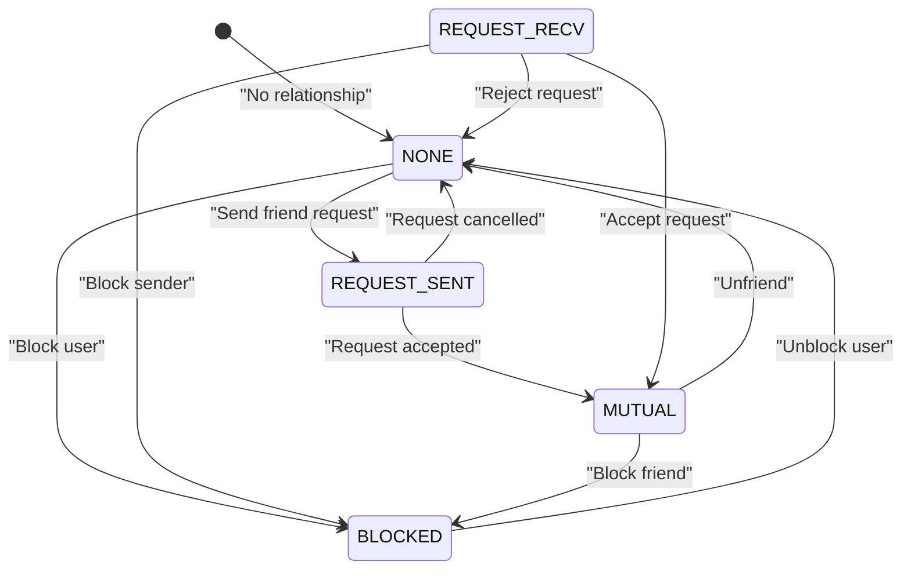
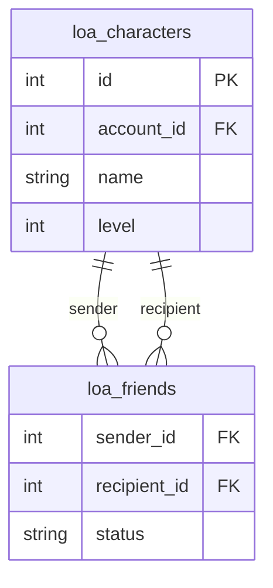
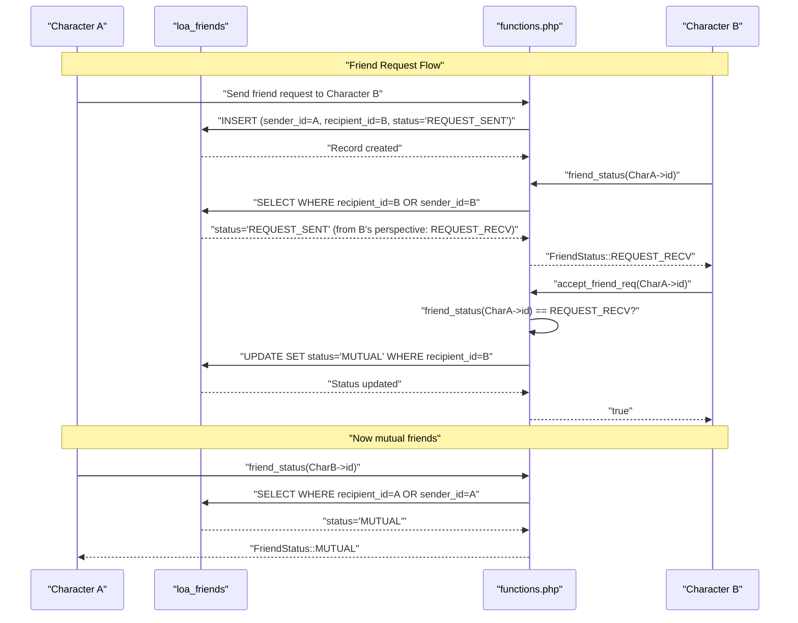
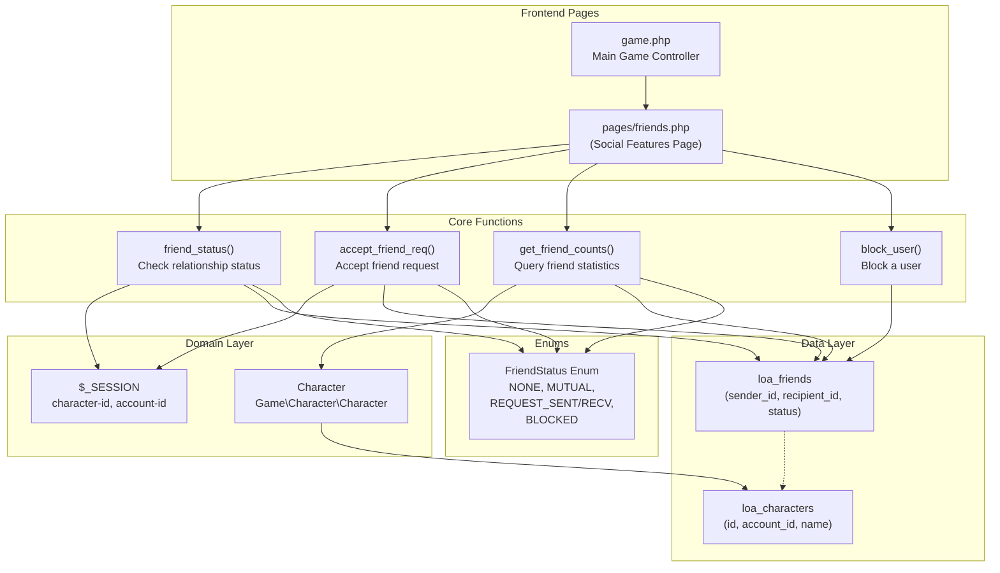

# Friends System

<details>
<summary>Relevant source files</summary>

The following files were used as context for generating this wiki page:

- [.github/workflows/codeql.yml](.github/workflows/codeql.yml)
- [functions.php](functions.php)
- [game.php](game.php)
- [index.php](index.php)
- [navs/nav-status.php](navs/nav-status.php)
- [save.php](save.php)
- [verification.php](verification.php)

</details>


The Friends System enables social connections between players in Legend of Aetheria. It manages friend relationships, friend requests, and user blocking through a status-based system. This document covers the friendship lifecycle, database structure, and core functions that facilitate social interactions between characters.

For in-game messaging between friends, see [Mail System](#5.6). For character management details, see [Character Management](#5.1).

## Overview

The Friends System operates at the character level (not account level), allowing each character to maintain independent friend lists and relationships. The system tracks bidirectional relationships between characters using a state machine model with five distinct statuses: `NONE`, `MUTUAL`, `REQUEST_SENT`, `REQUEST_RECV`, and `BLOCKED`.

**Sources:** [functions.php:1-615]()

## Friend Status States

The `FriendStatus` enum defines the possible relationship states between two characters:

| Status | Description | Database Value |
|--------|-------------|----------------|
| `NONE` | No friendship relationship exists | (no record) |
| `MUTUAL` | Both characters are mutual friends | `'MUTUAL'` |
| `REQUEST_SENT` | Current character sent a friend request | `'REQUEST_SENT'` |
| `REQUEST_RECV` | Current character received a friend request | `'REQUEST_RECV'` |
| `BLOCKED` | Current character blocked the other user | `'BLOCKED'` |

The enum is defined in `Game\Character\Enums\FriendStatus` and provides a `name_to_enum()` method to convert string status values from the database into enum instances.



**Sources:** [functions.php:4](), [functions.php:122-139]()

## Database Schema

The friends table stores friendship relationships in the `loa_friends` table (referenced as `{$t['friends']}` in code):

| Column | Type | Description |
|--------|------|-------------|
| `sender_id` | INT | Character ID who initiated the relationship |
| `recipient_id` | INT | Character ID who received the relationship action |
| `status` | VARCHAR | Current friendship status (`'MUTUAL'`, `'REQUEST_SENT'`, `'REQUEST_RECV'`, `'BLOCKED'`) |

The schema uses a directed relationship model where `sender_id` represents the initiator of the current status. For example:
- Friend request: `sender_id` sent request to `recipient_id`
- Mutual friendship: Both characters are friends (status set to `MUTUAL`)
- Block: `sender_id` blocked `recipient_id`



**Sources:** [functions.php:126-127](), [functions.php:175-177](), [functions.php:197-199]()

## Core Functions

### friend_status()

Determines the current friendship status between the logged-in character and another character.

```php
function friend_status(int $character_id): FriendStatus
```

**Location:** [functions.php:122-139]()

**Parameters:**
- `$character_id` - The ID of the character to check relationship with

**Returns:** `FriendStatus` enum representing the current relationship state

**Implementation:**
1. Queries `loa_friends` table for records where the given character is either sender or recipient
2. Converts the database status string to a `FriendStatus` enum using `name_to_enum()`
3. Returns `FriendStatus::NONE` if no relationship exists or status is null

```sql
SELECT * FROM loa_friends 
WHERE recipient_id = ? OR sender_id = ?
```

### accept_friend_req()

Accepts a pending friend request by updating the status to `MUTUAL`.

```php
function accept_friend_req($sender): bool
```

**Location:** [functions.php:149-160]()

**Parameters:**
- `$sender` - Character ID of the user who sent the friend request

**Returns:** `true` if request was successfully accepted, `false` otherwise

**Implementation:**
1. Verifies the current status is `REQUEST_RECV` via `friend_status()`
2. Updates the database record to set status to `MUTUAL`
3. Logs the acceptance event with sender and recipient IDs

```sql
UPDATE loa_friends 
SET status = 'MUTUAL' 
WHERE recipient_id = ?
```

**Sources:** [functions.php:149-160]()

### get_friend_counts()

Retrieves statistics about friendship relationships and optionally returns a list of character IDs.

```php
function get_friend_counts(?FriendStatus $status, bool $return_list = false): array
```

**Location:** [functions.php:171-215]()

**Parameters:**
- `$status` - Optional filter for a specific friendship status
- `$return_list` - Whether to return character ID list (default: `false`)

**Returns:** 
- If `$return_list` is `false`: Array with status counts: `['MUTUAL' => int, 'REQUEST_RECV' => int, 'REQUEST_SENT' => int, 'BLOCKED' => int]`
- If `$return_list` is `true`: Array with both counts and IDs: `['statuses' => array, 'ids' => array]`

**Implementation:**
1. Queries all friendship records for the current character grouped by status
2. Populates a statuses array with counts (defaults to 0 for missing statuses)
3. If list requested, queries character IDs using conditional logic to get the "other" character in each relationship
4. Uses `IF(recipient_id = ?, sender_id, recipient_id)` to select the opposite party's ID

```sql
-- Count query
SELECT friend_status, COUNT(*) AS count 
FROM loa_friends 
WHERE recipient_id = ? OR sender_id = ? 
GROUP BY friend_status

-- List query
SELECT DISTINCT IF(recipient_id = ?, sender_id, recipient_id) AS character_id 
FROM loa_friends 
WHERE recipient_id = ? OR sender_id = ? [AND friend_status = ?]
```

**Sources:** [functions.php:171-215]()

### block_user()

Blocks a user by inserting or updating their friendship record to `BLOCKED` status.

```php
function block_user($email_1, $email_2): int
```

**Location:** [functions.php:227-241]()

**Parameters:**
- `$email_1` - Email of the current user (blocker)
- `$email_2` - Email of the user to block

**Returns:** Always returns `0`

**Implementation:**
Uses an `INSERT ... ON DUPLICATE KEY UPDATE` pattern to either create a new blocked relationship or update an existing one to blocked status.

```sql
INSERT INTO loa_friends (sender_id, recipient_id, status)
VALUES (?, ?, 'BLOCKED')
UPDATE ON DUPLICATE KEY status = 'BLOCKED'
```

**Note:** The function signature suggests it uses email parameters, but the implementation should use character IDs based on the database schema.

**Sources:** [functions.php:227-241]()

## Friend Request Workflow

The following sequence diagram illustrates the complete friend request lifecycle from initiation to acceptance:



**Sources:** [functions.php:122-160]()

## Querying Friends

### Counting Friends by Status

To get statistics about all friendship relationships:

```php
global $character;
$counts = get_friend_counts(null, false);
// Returns: ['MUTUAL' => 5, 'REQUEST_RECV' => 2, 'REQUEST_SENT' => 3, 'BLOCKED' => 1]
```

### Retrieving Friend Lists

To get a list of mutual friends with their character IDs:

```php
$result = get_friend_counts(FriendStatus::MUTUAL, true);
$friend_count = $result['statuses']['MUTUAL'];
$friend_ids = $result['ids']; // Array of ['character_id' => int]
```

The `ids` array contains associative arrays with a `character_id` key for each friend.

**Sources:** [functions.php:171-215]()

## Integration with Game Systems

### Mail System Integration

The friends system integrates with the mail system to enable private messaging between friends. The mail system can query friend status to determine message permissions or display special indicators for messages from friends.

**Sources:** [functions.php:99-112]()

### Session Context

Friend operations use the current character's ID from the session:

```php
$_SESSION['character-id']  // Current logged-in character
```

The global `$character` object is also available in contexts where `game.php` has been loaded, providing access to the current character's data.

**Sources:** [game.php:23](), [functions.php:179]()

## System Architecture



**Sources:** [game.php:1-102](), [functions.php:122-241]()

## Security Considerations

### Character-Level Isolation

Friend relationships are tied to character IDs, not account IDs. This means:
- Each character on an account maintains separate friend lists
- Multi-character accounts cannot share friend relationships
- Blocking applies to specific characters, not entire accounts

### Session Validation

All friend operations implicitly rely on session validation via `check_session()` to ensure:
- User is authenticated
- Session hasn't been hijacked
- Character ID matches the logged-in session

**Sources:** [functions.php:503-526]()

### Database Query Safety

All friend-related queries use parameterized statements via `$db->execute_query()` to prevent SQL injection:

```php
$db->execute_query($sql_query, [$character_id, $character_id]);
```

**Sources:** [functions.php:127](), [functions.php:154](), [functions.php:179]()

## Unimplemented Features

Several friend system features are referenced in the code but not fully implemented:

1. **Friend Request Cancellation** - No function exists to cancel outgoing friend requests
2. **Unfriend Functionality** - No function to remove mutual friendships
3. **Unblock Functionality** - No function to unblock previously blocked users
4. **Friend Notifications** - No notification system for incoming friend requests

These features would require additional functions and potentially UI components to complete the friend management lifecycle.

**Sources:** [functions.php:122-241]()