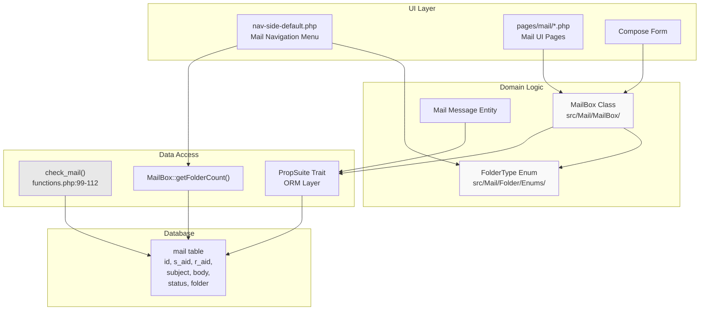
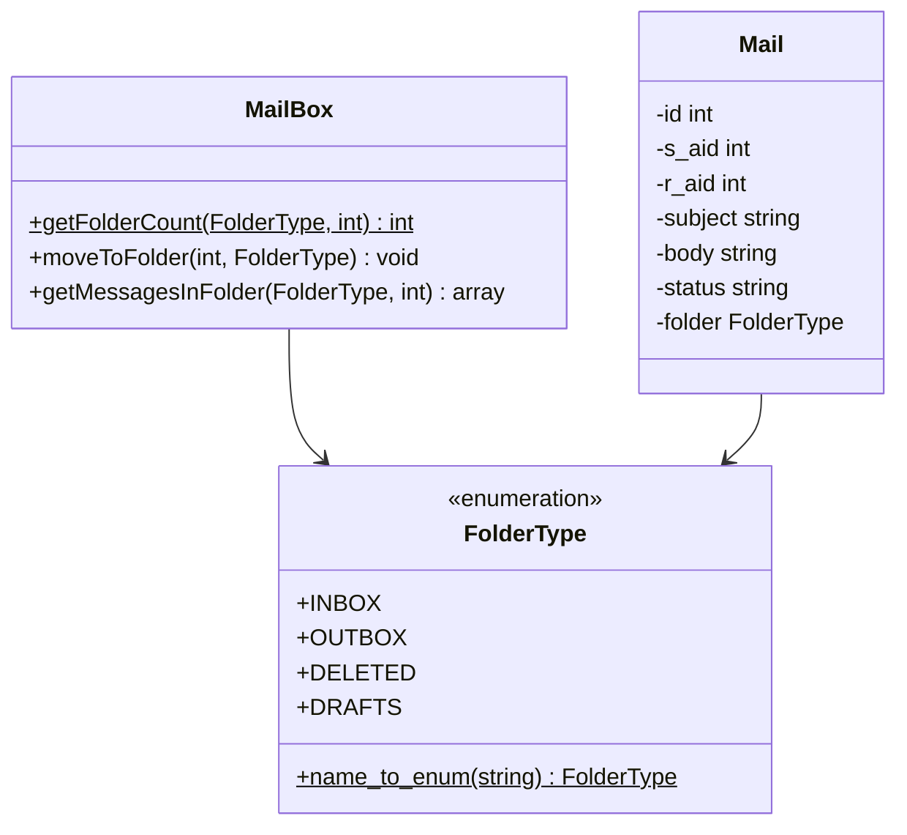
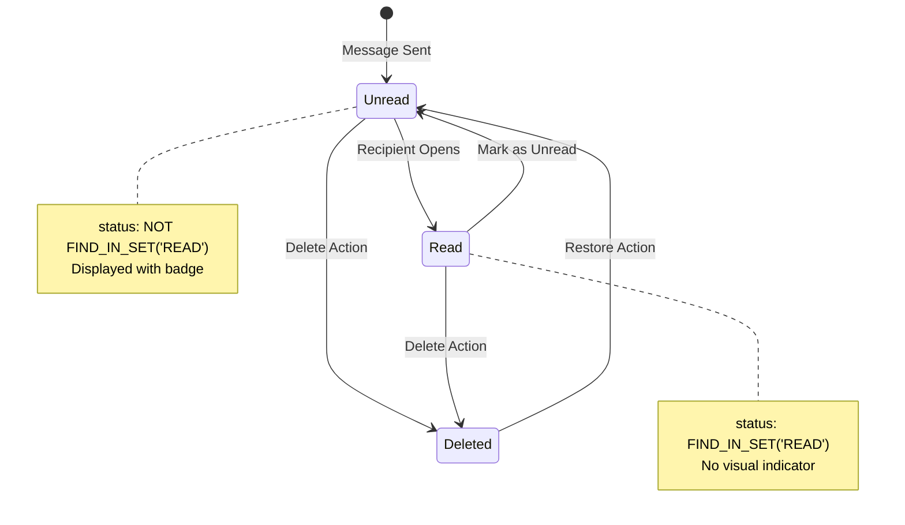
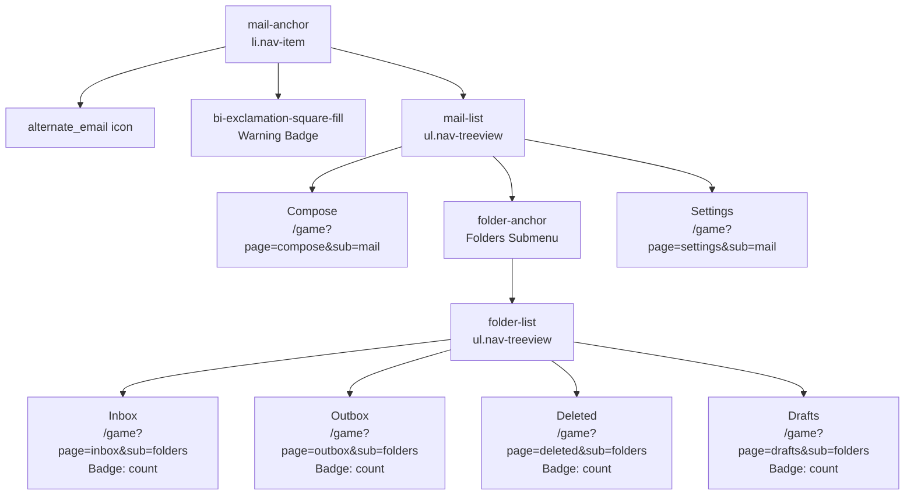
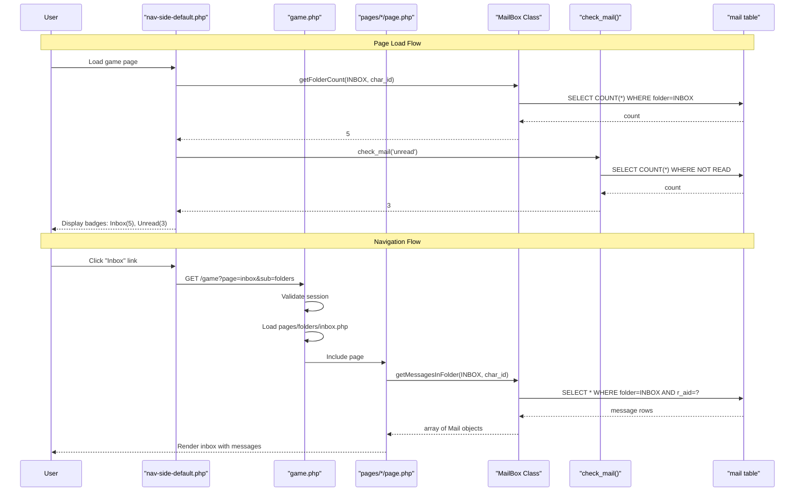
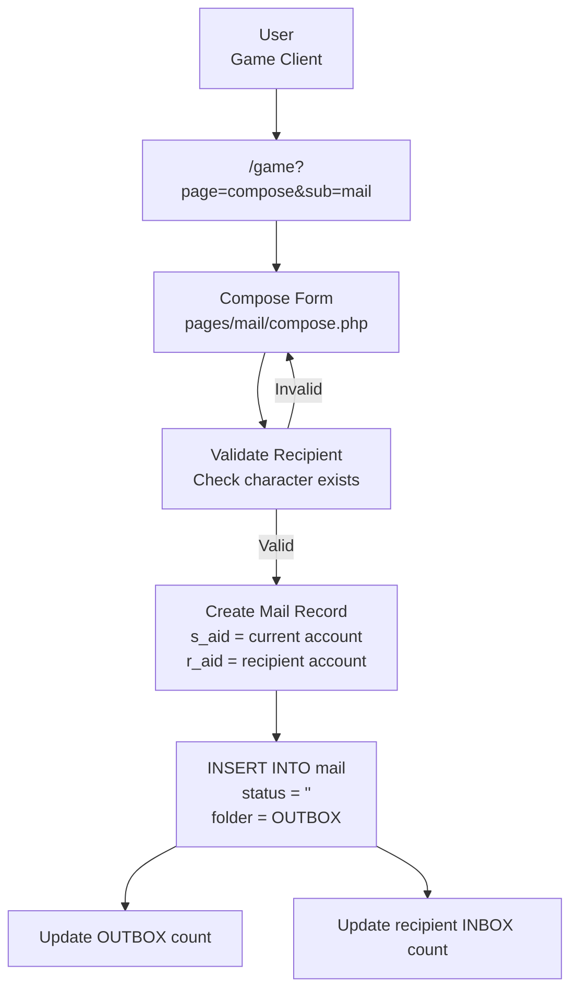
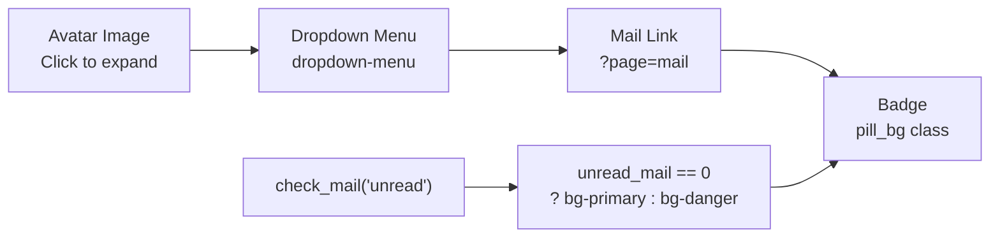

# Mail System

<details>
<summary>Relevant source files</summary>

The following files were used as context for generating this wiki page:

- [css/gfonts.css](css/gfonts.css)
- [functions.php](functions.php)
- [game.php](game.php)
- [index.php](index.php)
- [navs/sidemenus/nav-side-default.php](navs/sidemenus/nav-side-default.php)
- [src/Account/Settings.php](src/Account/Settings.php)

</details>


## Purpose and Scope

The Mail System provides asynchronous messaging between characters in Legend of Aetheria. Players can compose, send, receive, and organize mail messages using a folder-based structure similar to traditional email clients. This system enables communication without requiring both parties to be online simultaneously.

For information about real-time chat functionality, see [Chat System](#7.3). For friend relationships that may be used in conjunction with mail, see [Friends System](#5.5).

---

## System Architecture

The mail system consists of three primary layers: a folder-based organization system, a message management layer, and UI navigation components that integrate with the game's sidebar.

### Component Overview



**Sources:** [navs/sidemenus/nav-side-default.php:5-6](), [navs/sidemenus/nav-side-default.php:358-439](), [functions.php:92-112]()

---

## Database Schema

The mail system persists data in the `mail` table, which stores all message information including sender, recipient, content, and organizational metadata.

### Mail Table Structure

| Column | Type | Description |
|--------|------|-------------|
| `id` | INT | Primary key, unique message identifier |
| `s_aid` | INT | Sender account ID |
| `r_aid` | INT | Recipient account ID |
| `subject` | VARCHAR | Message subject line |
| `body` | TEXT | Message content |
| `status` | SET | Flags: 'READ', etc. (comma-separated) |
| `folder` | ENUM/VARCHAR | Current folder location |
| `date` | DATETIME | Timestamp of message creation |

The `status` field uses MySQL's `FIND_IN_SET()` function for flag checking, allowing multiple status flags per message (e.g., a message can be both READ and STARRED).

**Sources:** [functions.php:103]()

---

## Folder Organization

Mail messages are organized into four primary folders, represented by the `FolderType` enum. Each folder serves a specific purpose in the message lifecycle.

### Folder Type Enumeration



**Folder Definitions:**

- **INBOX**: Messages received from other players
- **OUTBOX**: Messages sent by the current player
- **DELETED**: Messages marked for deletion (soft delete)
- **DRAFTS**: Incomplete messages saved for later completion

**Sources:** [navs/sidemenus/nav-side-default.php:5](), [navs/sidemenus/nav-side-default.php:16-23]()

---

## Message Status System

Mail messages use a status flag system to track message state. The primary status tracked is the `READ` flag, which indicates whether the recipient has opened the message.

### Status Flow Diagram



### Unread Count Implementation

The `check_mail()` function queries unread messages for display in the UI:

```
SELECT COUNT(*) as count 
FROM mail 
WHERE NOT FIND_IN_SET('READ', status) 
  AND r_aid = ?
```

This count is displayed as a badge in the navigation sidebar and dropdown menu, alerting users to new messages.

**Sources:** [functions.php:99-112](), [navs/sidemenus/nav-side-default.php:560-568]()

---

## Navigation Integration

The mail system integrates into the game's sidebar navigation with a collapsible menu structure that displays folder counts and provides quick access to mail functions.

### Sidebar Menu Structure



**Folder Count Badges:**

Each folder displays a badge indicating the number of messages it contains. The badge color scheme is:
- **Red (`text-bg-danger`)**: Folder contains messages
- **Gray (`text-bg-secondary`)**: Folder is empty (shows "0")

**Sources:** [navs/sidemenus/nav-side-default.php:358-439](), [navs/sidemenus/nav-side-default.php:14-23]()

---

## URL Routing and Page Parameters

Mail functionality is accessed through the game's URL routing system using `page` and `sub` parameters.

### Route Mapping Table

| Function | URL Pattern | File Location |
|----------|-------------|---------------|
| Compose Mail | `/game?page=compose&sub=mail` | `pages/mail/compose.php` |
| View Inbox | `/game?page=inbox&sub=folders` | `pages/folders/inbox.php` |
| View Outbox | `/game?page=outbox&sub=folders` | `pages/folders/outbox.php` |
| View Deleted | `/game?page=deleted&sub=folders` | `pages/folders/deleted.php` |
| View Drafts | `/game?page=drafts&sub=folders` | `pages/folders/drafts.php` |
| Mail Settings | `/game?page=settings&sub=mail` | `pages/mail/settings.php` |

The routing logic in `game.php` processes these parameters:

```php
$requested_page = preg_replace('/[^a-z-]+/', '', $_GET['page']);
$requested_sub = preg_replace('/[^a-z-]+/', '', $_GET['sub']);
$page_string = "pages/$requested_sub/$requested_page.php";
```

**Sources:** [game.php:61-83](), [navs/sidemenus/nav-side-default.php:368-428]()

---

## Core Functions and Classes

### check_mail() Function

The `check_mail()` function provides unread message counts for the current account. It is used throughout the UI to display notification badges.

**Function Signature:**
```php
function check_mail(string $what): int
```

**Parameters:**
- `$what`: Directive string, currently only supports `'unread'`

**Return Value:**
- `int`: Count of unread messages for the current account

**Implementation:**
When called with `'unread'`, the function executes:

```sql
SELECT COUNT(*) as count 
FROM {$t['mail']} 
WHERE NOT FIND_IN_SET('READ', `status`) 
  AND `r_aid` = ?
```

The function queries messages where:
1. The `status` field does NOT contain the 'READ' flag
2. The recipient account ID (`r_aid`) matches the current session account

**Sources:** [functions.php:92-112]()

---

### MailBox Class

The `MailBox` class (namespace `Game\Mail\MailBox\MailBox`) provides the primary interface for mail operations.

**Static Method: getFolderCount()**

```php
public static function getFolderCount(
    FolderType $folder, 
    int $character_id
): int
```

This method retrieves the count of messages in a specific folder for a given character. It is used to populate the badge counts in the navigation sidebar.

**Usage Example from Navigation:**
```php
$folders = [];
foreach (["OUTBOX", "INBOX", "DELETED", "DRAFTS"] as $type) {
    $folder = FolderType::name_to_enum($type);
    $folders[$type] = MailBox::getFolderCount(
        $folder,
        $character->get_id()
    );
}
```

**Sources:** [navs/sidemenus/nav-side-default.php:14-23]()

---

### FolderType Enum

The `FolderType` enum (namespace `Game\Mail\Folder\Enums\FolderType`) defines the available mail folders.

**Enum Cases:**
- `INBOX`
- `OUTBOX`
- `DELETED`
- `DRAFTS`

**Static Method: name_to_enum()**

```php
public static function name_to_enum(string $name): FolderType
```

Converts a string folder name to its corresponding enum value. This method is used when processing folder names from configuration or user input.

**Sources:** [navs/sidemenus/nav-side-default.php:5](), [navs/sidemenus/nav-side-default.php:17]()

---

## Data Flow Diagram

This diagram illustrates the complete flow from user interaction to database and back through the UI.



**Sources:** [game.php:61-83](), [navs/sidemenus/nav-side-default.php:14-23](), [functions.php:99-112]()

---

## Message Composition Flow

When composing a new mail message, users interact with a form that validates input and creates a new database record.



**Key Fields:**
- `s_aid`: Set to `$_SESSION['account-id']` (sender)
- `r_aid`: Set to recipient's account ID (recipient)
- `subject`: User-provided subject line
- `body`: User-provided message content
- `status`: Initially empty (unread)
- `folder`: Set to both OUTBOX (sender) and INBOX (recipient)

**Sources:** [navs/sidemenus/nav-side-default.php:368-372]()

---

## Integration with Session System

The mail system relies on the session management system to identify the current user and filter messages appropriately.

### Session Variables Used

| Variable | Purpose |
|----------|---------|
| `$_SESSION['account-id']` | Identifies current account for filtering mail (`r_aid` queries) |
| `$_SESSION['character-id']` | Used by `MailBox::getFolderCount()` for character-specific mail |
| `$_SESSION['email']` | Used to instantiate `Account` object for mail operations |

### Account and Character Context

```php
$account   = new Account($_SESSION['email']); 
$character = new Character($account->get_id(), $_SESSION['character-id']);
```

Mail operations use the character ID rather than account ID in some contexts, allowing for character-specific messaging when multiple characters exist per account.

**Sources:** [navs/sidemenus/nav-side-default.php:12-13](), [functions.php:104](), [game.php:22-23]()

---

## Active State Highlighting

The navigation system highlights the currently active mail page using CSS classes and URL parameter matching.

### Active State Logic

```php
$currentPage = $_GET['page'] ?? '';
$currentSub = $_GET['sub'] ?? '';

// Applied to nav links
class="nav-link d-flex align-items-center ps-4 
<?php echo ($currentPage === 'inbox' && $currentSub === 'folders') ? 'active' : ''; ?>"
```

When a link is active:
1. The `active` class is applied
2. CSS styling makes it bold and changes color: `font-weight: bold; color: rgba(200, 255, 200, .7)`
3. Parent menu items automatically open via `menu-open` class

**Sources:** [navs/sidemenus/nav-side-default.php:28-29](), [navs/sidemenus/nav-side-default.php:383](), [navs/sidemenus/nav-side-default.php:643-646]()

---

## Badge Display System

The folder badges provide real-time visual feedback about message counts using conditional rendering.

### Badge Rendering Logic

```php
<?php if ($folders['INBOX']): ?>
    <span class="nav-badge badge text-bg-danger ms-auto me-3">
        <?php echo $folders['INBOX']; ?>
    </span>
<?php else: ?>
    <span class="nav-badge badge text-bg-secondary ms-auto me-3">0</span>
<?php endif; ?>
```

**Badge Color States:**
- **Red badge (`text-bg-danger`)**: Non-zero message count, requires attention
- **Gray badge (`text-bg-secondary`)**: Zero messages, no action needed

This pattern repeats for all four folders (INBOX, OUTBOX, DELETED, DRAFTS).

**Sources:** [navs/sidemenus/nav-side-default.php:386-391](), [navs/sidemenus/nav-side-default.php:398-403]()

---

## Dropdown Menu Integration

The mail system also appears in the account dropdown menu at the bottom of the sidebar, displaying unread message counts.



**Badge Logic:**
```php
$unread_mail = check_mail('unread');
$pill_bg = 'bg-danger';

if ($unread_mail == 0) {
    $pill_bg = 'bg-primary';
}
```

The badge displays blue when there are no unread messages, and red when unread messages exist.

**Sources:** [navs/sidemenus/nav-side-default.php:558-568]()

---

## PropSuite ORM Integration

Like other game entities, mail messages likely use the `PropSuite` trait for database operations, providing automatic property synchronization and magic method access.

### Expected PropSuite Methods for Mail Entity

```php
// Getter methods
$mail->get_id()
$mail->get_subject()
$mail->get_body()
$mail->get_status()
$mail->get_folder()

// Setter methods
$mail->set_subject($subject)
$mail->set_body($body)
$mail->set_status($status)
$mail->set_folder($folder)

// Database operations
$mail->load_($id)
$mail->new_()
```

The PropSuite trait provides these methods dynamically through the `__call()` magic method and synchronizes changes to the database automatically.

**Sources:** [src/Account/Settings.php:5-6](), [src/Account/Settings.php:60-75]() (example of PropSuite usage)

---

## Summary

The Mail System in Legend of Aetheria provides asynchronous character-to-character messaging through:

1. **Folder Organization**: Four-folder structure (INBOX, OUTBOX, DELETED, DRAFTS) managed by `FolderType` enum
2. **Status Tracking**: Message status flags (READ) stored in comma-separated SET field
3. **UI Integration**: Collapsible sidebar navigation with real-time badge counts
4. **Database Layer**: Single `mail` table with sender/recipient account IDs
5. **Core Functions**: `check_mail()` for unread counts, `MailBox::getFolderCount()` for folder statistics
6. **Session Context**: Uses `$_SESSION['account-id']` and `$_SESSION['character-id']` for message filtering
7. **URL Routing**: Page-based navigation through `/game?page=X&sub=Y` parameter system

The system integrates seamlessly with the game's existing authentication, session management, and ORM infrastructure to provide reliable asynchronous communication between players.