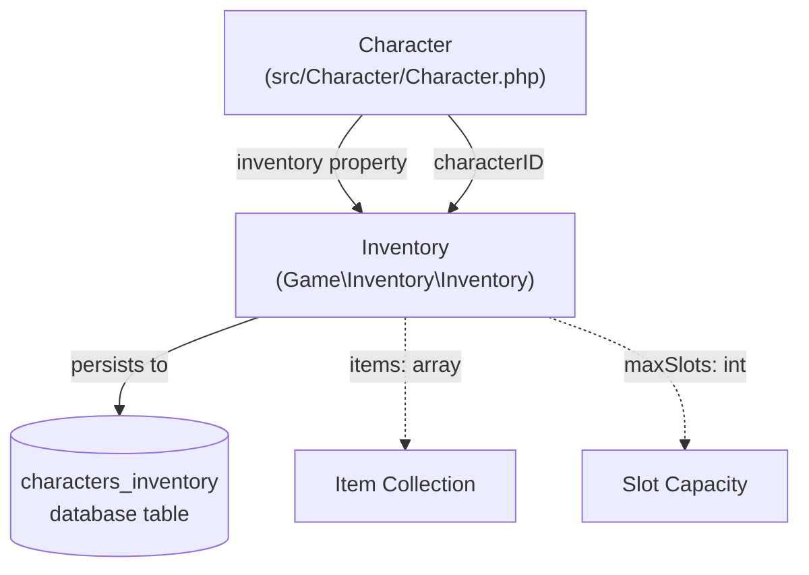
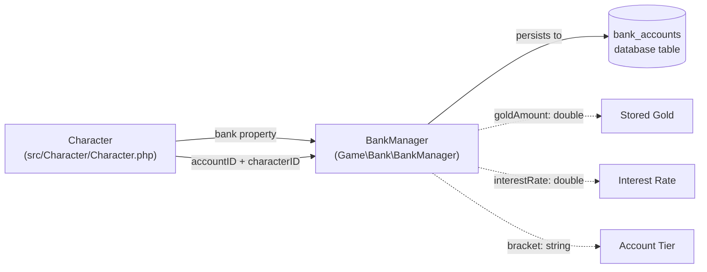
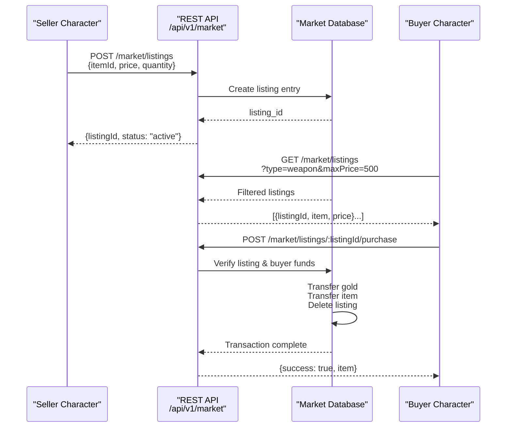
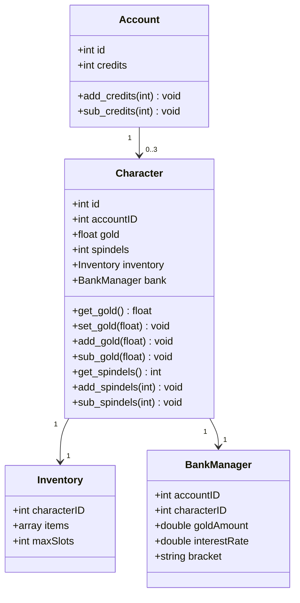
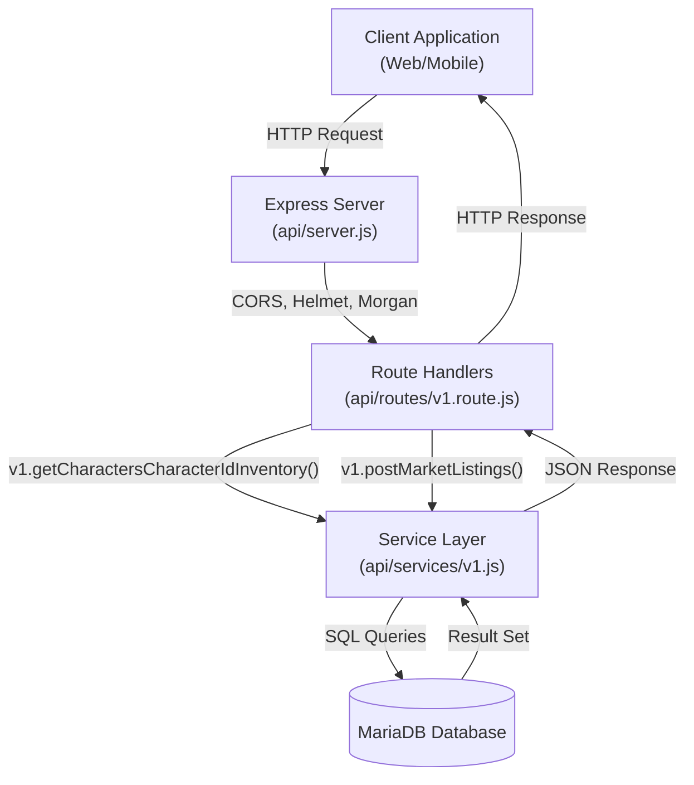

# Inventory & Economy

<details>
<summary>Relevant source files</summary>

The following files were used as context for generating this wiki page:

- [api/package-lock.json](api/package-lock.json)
- [api/package.json](api/package.json)
- [api/routes/auth.route.js](api/routes/auth.route.js)
- [api/routes/v1.route.js](api/routes/v1.route.js)
- [api/server.js](api/server.js)
- [src/Account/Account.php](src/Account/Account.php)
- [src/Character/Character.php](src/Character/Character.php)
- [src/Character/Stats.php](src/Character/Stats.php)
- [src/Familiar/Familiar.php](src/Familiar/Familiar.php)
- [src/Monster/Stats.php](src/Monster/Stats.php)

</details>


## Purpose and Scope

This document covers the economic and inventory systems in Legend of Aetheria, including the three currency types (gold, spindels, and credits), the inventory management system, the banking system with interest mechanics, and the marketplace for trading items between players. For character-related features like stats and progression, see [Character Management](#5.1). For item rewards from combat, see [Combat System](#5.2) and [Monster System](#5.3).

**Sources:** [src/Character/Character.php:1-228](), [src/Account/Account.php:1-220](), [api/routes/v1.route.js:1-389]()

---

## Currency System

Legend of Aetheria implements a three-tier currency system with distinct purposes and scopes.

### Currency Types

| Currency | Type | Storage Location | Starting Amount | Purpose |
|----------|------|------------------|-----------------|---------|
| **Gold** | `float` | `Character` | 1000.0 | Primary currency for purchases, trades, marketplace |
| **Spindels** | `int` | `Character` | 0 | Secondary currency, possibly premium/special items |
| **Credits** | `int` | `Account` | 0 | Premium currency, account-wide, cash shop |

**Gold** is stored per-character and starts at 1000.0 gold pieces. It is the primary currency for most in-game transactions and can be stored in the bank to earn interest. Gold is earned from defeating monsters and can be spent in the marketplace.

**Spindels** are a secondary integer-based currency stored per-character. The exact purpose is distinct from gold, potentially for special vendors or crafting materials.

**Credits** are a premium currency stored at the account level, making them accessible across all character slots. They persist even when characters are deleted and are intended for premium features or cash shop purchases.

**Sources:** [src/Character/Character.php:102-114](), [src/Account/Account.php:111-111]()

### Currency Operations

The `Character` class provides mathematical operations for gold and spindels through the PropSuite trait's dynamic method system:

```php
// Gold operations
$character->add_gold(150.5);   // Award gold from combat
$character->sub_gold(50.0);    // Deduct gold for purchases
$character->get_gold();        // Retrieve current gold amount

// Spindel operations
$character->add_spindels(10);
$character->sub_spindels(5);
$character->get_spindels();
```

The `Account` class provides similar operations for credits:

```php
// Credit operations (account-wide)
$account->add_credits(100);    // Add credits from purchase
$account->sub_credits(50);     // Spend credits in shop
$account->get_credits();       // Check credit balance
```

**Sources:** [src/Character/Character.php:52-79](), [src/Account/Account.php:68-72]()

---

## Inventory System

The inventory system is managed by the `Game\Inventory\Inventory` class, which is instantiated as a property of each `Character` object.

### Inventory Structure



**Sources:** [src/Character/Character.php:8-8](), [src/Character/Character.php:44-44](), [src/Character/Character.php:144-144](), [src/Character/Character.php:163-163]()

### Inventory Initialization

The inventory is instantiated when a character is loaded:

```php
// From Character::__construct()
if ($characterID) {
    $this->id = $characterID;
    $this->inventory = new Inventory($this->id);
    $this->load($this->id);
    $this->stats->set_id($this->id);
}
```

The `Inventory` class is constructed with the character ID as its primary identifier, linking the inventory to a specific character.

**Sources:** [src/Character/Character.php:161-166]()

### API Access

The REST API provides an endpoint to retrieve inventory data:

**GET** `/api/v1/characters/:characterId/inventory`

```javascript
// Route handler in v1.route.js
router.get('/characters/:characterId/inventory', async (req, res, next) => {
  let options = { 
    "characterId": req.params.characterId,
  };

  try {
    const result = await v1.getCharactersCharacterIdInventory(options);
    res.status(result.status || 200).send(result.data);
  }
  catch (err) {
    return res.status(500).send({
      error: 'Something went wrong'
    });
  }
});
```

**Sources:** [api/routes/v1.route.js:195-210]()

---

## Bank System

The banking system is implemented through the `Game\Bank\BankManager` class, providing secure storage for gold with interest accrual mechanics.

### Bank Architecture



**Sources:** [src/Character/Character.php:9-9](), [src/Character/Character.php:45-45](), [src/Character/Character.php:147-147]()

### Bank Properties

Based on the `Character` class documentation, the `BankManager` maintains:

- **`goldAmount`** (`double`): The amount of gold stored in the bank
- **`interestRate`** (`double`): The percentage rate at which stored gold accrues interest
- **`bracket`** (`string`): The account tier, likely determining interest rate or storage limits
- **`accountID`** (`int`): Links to the account for cross-character access
- **`characterID`** (`int`): The character currently accessing the bank

This design suggests that bank accounts may be shared across characters on the same account, allowing gold transfers between a player's characters.

**Sources:** [src/Character/Character.php:45-45]()

### REST API for Banking

The API provides two endpoints for bank operations:

**GET** `/api/v1/characters/:characterId/bank` - Retrieve bank account details

**POST** `/api/v1/characters/:characterId/bank` - Perform bank transactions (deposit/withdraw)

```javascript
// Bank GET route
router.get('/characters/:characterId/bank', async (req, res, next) => {
  let options = { 
    "characterId": req.params.characterId,
  };

  try {
    const result = await v1.getCharactersCharacterIdBank(options);
    res.status(result.status || 200).send(result.data);
  }
  catch (err) {
    return res.status(500).send({
      error: 'Something went wrong'
    });
  }
});

// Bank POST route for transactions
router.post('/characters/:characterId/bank', async (req, res, next) => {
  let options = { 
    "characterId": req.params.characterId,
  };

  options.postCharactersCharacterIdBankInlineReqJson = req.body;

  try {
    const result = await v1.postCharactersCharacterIdBank(options);
    res.status(result.status || 200).send(result.data);
  }
  catch (err) {
    return res.status(500).send({
      error: 'Something went wrong'
    });
  }
});
```

**Sources:** [api/routes/v1.route.js:89-122]()

---

## Marketplace System

The marketplace enables player-to-player trading through a listing-based system accessible via REST API endpoints.

### Marketplace Flow



**Sources:** [api/routes/v1.route.js:335-387]()

### Marketplace Endpoints

#### GET `/api/v1/market/listings`

Retrieves marketplace listings with optional filters:

**Query Parameters:**
- `type` - Filter by item type (weapon, armor, consumable, etc.)
- `rarity` - Filter by rarity level
- `minLevel` - Minimum required level
- `maxPrice` - Maximum price in gold

```javascript
router.get('/market/listings', async (req, res, next) => {
  let options = { 
    "maxPrice": req.query.maxPrice,
    "minLevel": req.query.minLevel,
    "rarity": req.query.rarity,
    "type": req.query.type,
  };

  try {
    const result = await v1.getMarketListings(options);
    res.status(result.status || 200).send(result.data);
  }
  catch (err) {
    return res.status(500).send({
      error: 'Something went wrong'
    });
  }
});
```

**Sources:** [api/routes/v1.route.js:335-353]()

#### POST `/api/v1/market/listings`

Creates a new marketplace listing:

```javascript
router.post('/market/listings', async (req, res, next) => {
  let options = { };

  options.postMarketListingsInlineReqJson = req.body;

  try {
    const result = await v1.postMarketListings(options);
    res.status(result.status || 200).send(result.data);
  }
  catch (err) {
    return res.status(500).send({
      error: 'Something went wrong'
    });
  }
});
```

**Expected request body format:**
```json
{
  "itemId": 12345,
  "price": 250.5,
  "quantity": 1,
  "description": "Legendary sword with fire damage"
}
```

**Sources:** [api/routes/v1.route.js:355-370]()

#### POST `/api/v1/market/listings/:listingId/purchase`

Purchases an item from the marketplace:

```javascript
router.post('/market/listings/:listingId/purchase', async (req, res, next) => {
  let options = { 
    "listingId": req.params.listingId,
  };

  try {
    const result = await v1.postMarketListingsListingIdPurchase(options);
    res.status(result.status || 200).send(result.data);
  }
  catch (err) {
    return res.status(500).send({
      error: 'Something went wrong'
    });
  }
});
```

The purchase transaction:
1. Validates the buyer has sufficient gold
2. Deducts gold from buyer's character
3. Adds gold to seller's character or bank
4. Transfers item from seller's inventory to buyer's inventory
5. Removes the listing from the marketplace

**Sources:** [api/routes/v1.route.js:372-387]()

---

## Integration with Character System

The economy and inventory systems are deeply integrated with the `Character` class through property aggregation and the PropSuite trait.

### Character Economic Properties



**Sources:** [src/Character/Character.php:80-147](), [src/Account/Account.php:74-153]()

### PropSuite-Based Operations

Both `Character` and `Account` leverage the PropSuite trait to provide dynamic getter/setter methods and mathematical operations on economic properties:

```php
// Character::__call delegates to PropSuite
public function __call($method, $params) {
    global $db, $log;

    if (!count($params)) {
        $params = null;
    }

    $matches = [];
    if (preg_match('/^(add|sub|exp|mod|mul|div)_/', $method)) {
        return $this->propMod($method, $params);
    } elseif (preg_match('/^(propDump|propRestore)$/', $method, $matches)) {
        $func = $matches[1];
        return $this->$func($params[0] ?? null);
    } else {
        return $this->propSync($method, $params, PropType::CHARACTER);
    }
}
```

This pattern enables concise, database-synchronized operations like `$character->add_gold(50)` that automatically persist changes.

**Sources:** [src/Character/Character.php:179-195](), [src/Account/Account.php:184-201]()

---

## Complete REST API Reference

### Inventory & Economy Endpoints

| Method | Endpoint | Purpose | Query/Body Parameters |
|--------|----------|---------|----------------------|
| `GET` | `/api/v1/characters/:characterId/inventory` | Retrieve character inventory | - |
| `GET` | `/api/v1/characters/:characterId/bank` | Get bank account details | - |
| `POST` | `/api/v1/characters/:characterId/bank` | Deposit/withdraw from bank | `{action, amount}` |
| `GET` | `/api/v1/market/listings` | Browse marketplace | `?type&rarity&minLevel&maxPrice` |
| `POST` | `/api/v1/market/listings` | Create listing | `{itemId, price, quantity}` |
| `POST` | `/api/v1/market/listings/:listingId/purchase` | Purchase item | - |

### API Request Flow



**Sources:** [api/server.js:1-64](), [api/routes/v1.route.js:1-389]()

### Server Configuration

The Express server includes security and middleware layers:

```javascript
const express = require('express'),
    cookieParser = require('cookie-parser'),
    log = require('morgan'),
    cors = require('cors'),
    helmet = require('helmet'),
    csrf = require('csrf');

app.use(cors());
app.use(log('tiny'));
app.use(helmet());
app.use(express.json());
app.use(express.urlencoded({ extended: true }));
app.use(csrf({ cookie: true }));
```

These middleware components provide:
- **CORS**: Cross-origin request handling for web clients
- **Morgan**: HTTP request logging
- **Helmet**: Security headers (CSP, XSS protection, etc.)
- **CSRF**: Token-based CSRF protection
- **Body Parsers**: JSON and URL-encoded form data parsing

**Sources:** [api/server.js:1-40]()

---

## Database Schema Implications

While the complete schema isn't provided in the source files, the class structure implies the following tables:

### Implied Table Structure

| Table | Key Columns | Relationships |
|-------|-------------|---------------|
| `characters` | `id`, `account_id`, `gold`, `spindels` | FK to `accounts` |
| `characters_inventory` | `id`, `character_id`, `items`, `max_slots` | FK to `characters` |
| `bank_accounts` | `id`, `account_id`, `character_id`, `gold_amount`, `interest_rate`, `bracket` | FK to `accounts`, `characters` |
| `market_listings` | `id`, `seller_id`, `item_id`, `price`, `quantity`, `status` | FK to `characters` |
| `accounts` | `id`, `credits` | Primary account table |

**Sources:** [src/Character/Character.php:1-228](), [src/Account/Account.php:1-220]()