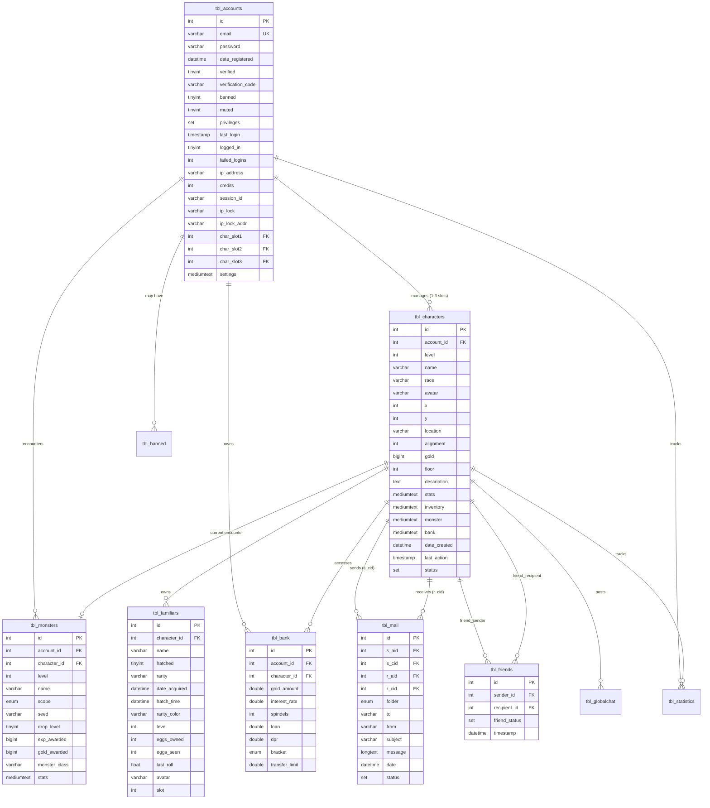
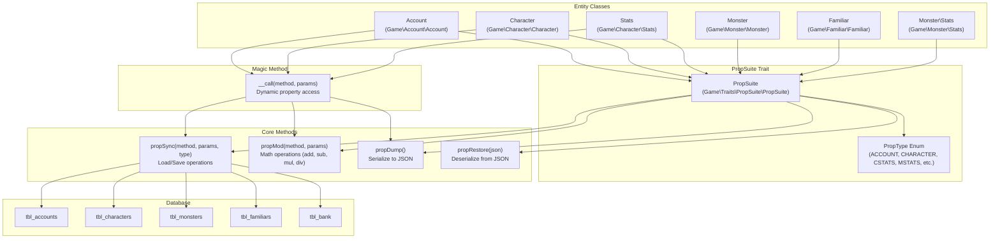
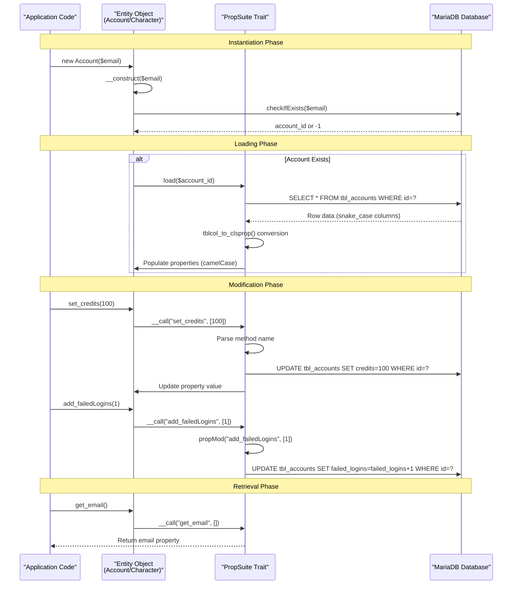
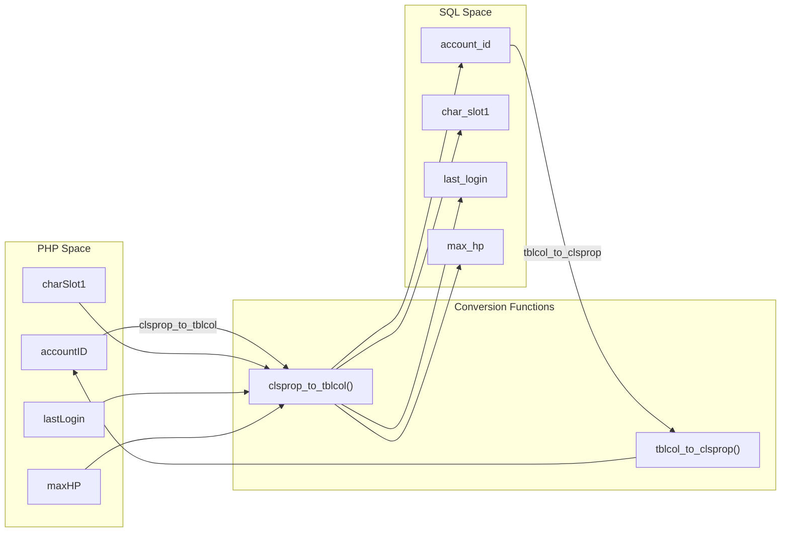
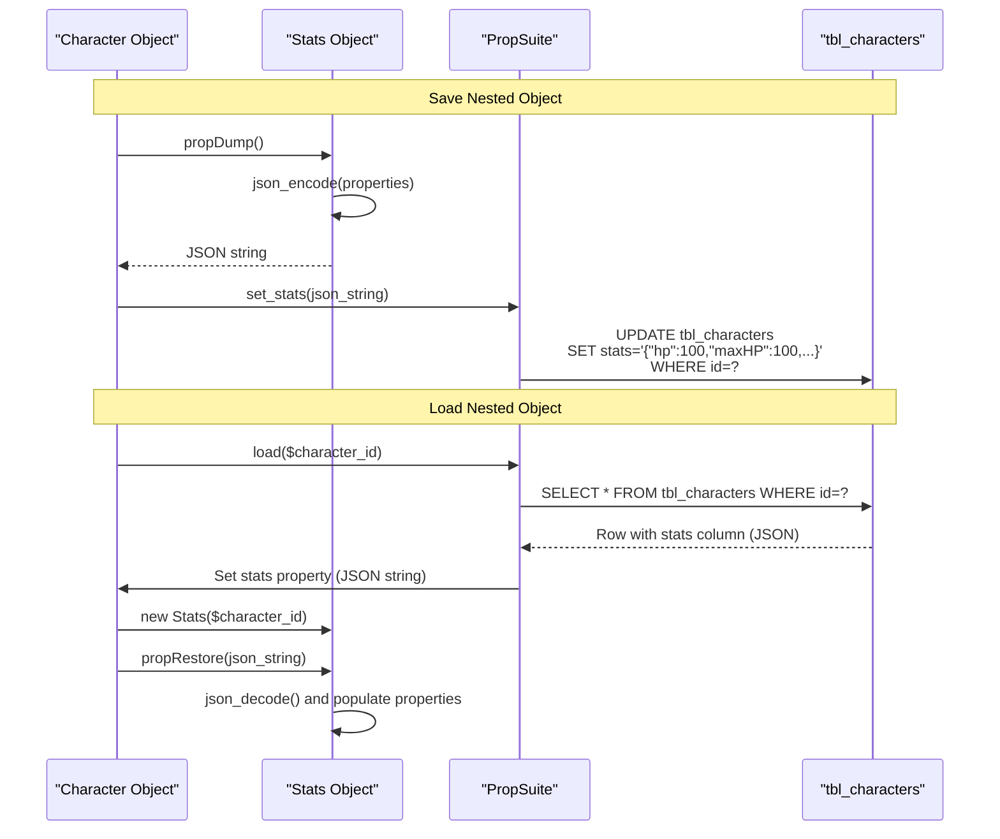
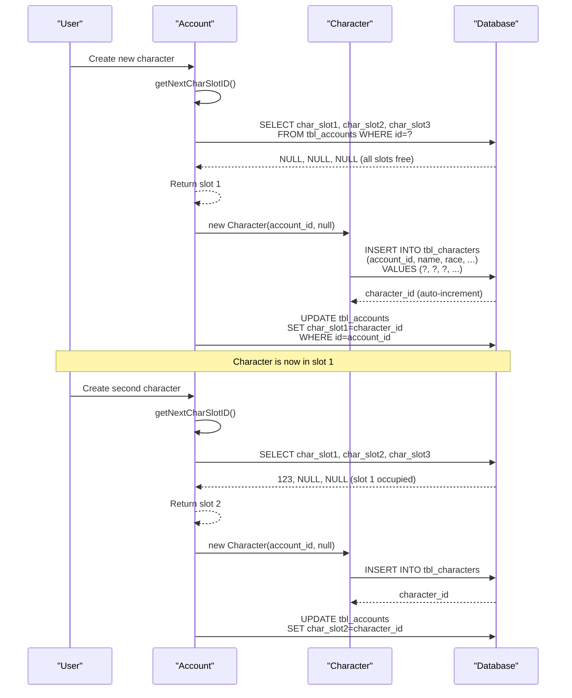

# Database & Data Layer

<details>
<summary>Relevant source files</summary>

The following files were used as context for generating this wiki page:

- [admini/strator/system/functions.php](admini/strator/system/functions.php)
- [composer.json](composer.json)
- [composer.lock](composer.lock)
- [install/AutoInstaller.pl](install/AutoInstaller.pl)
- [install/templates/sql.template](install/templates/sql.template)
- [navs/sidemenus/nav-quicknav.php](navs/sidemenus/nav-quicknav.php)
- [src/Account/Account.php](src/Account/Account.php)
- [src/Character/Character.php](src/Character/Character.php)
- [src/Character/Stats.php](src/Character/Stats.php)
- [src/Familiar/Familiar.php](src/Familiar/Familiar.php)
- [src/Monster/Stats.php](src/Monster/Stats.php)

</details>


## Purpose and Scope

This document provides comprehensive documentation of the data persistence layer in Legend of Aetheria, including the database schema, the custom ORM implementation (PropSuite trait), and entity classes that manage game data. For specifics on individual database tables and relationships, see [Database Schema](#6.1). For detailed PropSuite trait mechanics, see [PropSuite ORM](#6.2). For entity class implementation details, see [Entity Classes](#6.3).

**Sources:** [install/templates/sql.template:1-312](), [src/Account/Account.php:1-220](), [src/Character/Character.php:1-228]()

---

## Database Architecture

Legend of Aetheria uses **MariaDB 11.8.3+** (MySQL-compatible) as its primary data store. The database is initialized during installation via the AutoInstaller which executes a SQL template containing table definitions, user creation, and privilege grants.

### Installation and Configuration

The database setup occurs in the `SQL` step of AutoInstaller:

- Database name: `db_loa` (configurable via `###REPL_SQL_DB###`)
- Database user: `user_loa` (configurable via `###REPL_SQL_USER###`)
- Privileges: `SELECT`, `INSERT`, `UPDATE`, `DELETE` on all tables
- Default bind address: `127.0.0.1:3306`

The installation process:
1. Drops existing database if present
2. Creates new database
3. Creates all tables with proper indexes and constraints
4. Creates dedicated database user with restricted privileges
5. Grants appropriate permissions

**Sources:** [install/AutoInstaller.pl:509-534](), [install/templates/sql.template:1-312]()

### Connection Management

Database connections are managed globally through the `$db` variable, which provides a mysqli connection object. All queries use prepared statements via `execute_query()` to prevent SQL injection.

```php
// Typical query pattern
$sqlQuery = "SELECT * FROM {$t['accounts']} WHERE `email` = ?";
$result = $db->execute_query($sqlQuery, [$email])->fetch_assoc();
```

**Sources:** [src/Account/Account.php:209-219]()

---

## Database Schema Overview

The database consists of 13 core tables managing accounts, characters, combat, social features, and metadata. All tables use `InnoDB` storage engine for transaction support and `utf8mb4_general_ci` collation for full Unicode support.

### Core Tables

| Table | Purpose | Primary Key | Key Foreign Keys |
|-------|---------|-------------|------------------|
| `tbl_accounts` | User accounts and authentication | `id` | None |
| `tbl_characters` | Player characters | `id` | `account_id` → accounts |
| `tbl_monsters` | Monster encounters | `id` | `account_id`, `character_id` |
| `tbl_familiars` | Pet companions | `id` | `character_id` |
| `tbl_bank` | Banking system | `id` | `account_id`, `character_id` |
| `tbl_mail` | In-game mail | `id` | `s_aid`, `s_cid`, `r_aid`, `r_cid` |
| `tbl_friends` | Friend relationships | `id` | `sender_id`, `recipient_id` |
| `tbl_globalchat` | Chat messages | `id` | `character_id` |
| `tbl_statistics` | Player statistics | `id` | `account_id`, `character_id` |
| `tbl_banned` | Ban records | `id` | `account_id` |
| `tbl_logs` | System logs | `id` | None |
| `tbl_globals` | Global settings | `id` | None |

**Sources:** [install/templates/sql.template:23-296]()

### Entity Relationship Diagram



**Sources:** [install/templates/sql.template:23-296]()

---

## PropSuite ORM Layer

PropSuite is a custom trait-based ORM that provides dynamic property management, automatic database synchronization, and mathematical operations on entity properties. It eliminates boilerplate getter/setter code and handles type conversions between PHP and MySQL.

### Architecture Overview



**Sources:** [src/Account/Account.php:74-220](), [src/Character/Character.php:80-228](), [src/Traits/PropSuite/PropSuite.php]()

### PropType Enum System

PropType enums map entity classes to their corresponding database tables:

| PropType | Entity Class | Database Table | Description |
|----------|--------------|----------------|-------------|
| `ACCOUNT` | `Account` | `tbl_accounts` | User accounts |
| `CHARACTER` | `Character` | `tbl_characters` | Player characters |
| `CSTATS` | `Character\Stats` | Embedded in `tbl_characters.stats` | Character stats (serialized) |
| `MONSTER` | `Monster` | `tbl_monsters` | Monster encounters |
| `MSTATS` | `Monster\Stats` | Embedded in `tbl_monsters.stats` | Monster stats (serialized) |
| `BANK` | `BankManager` | `tbl_bank` | Bank accounts |
| `FAMILIAR` | `Familiar` | `tbl_familiars` | Pet companions |

**Sources:** [src/Traits/PropSuite/Enums/PropType.php]()

### Dynamic Property Access via __call

All PropSuite-enabled entities implement `__call()` to intercept method calls and route them appropriately:

```php
public function __call($method, $params) {
    global $db, $log;
    
    if (!count($params)) {
        $params = null;
    }
    
    // Mathematical operations: add_gold(), sub_hp(), mul_str()
    if (preg_match('/^(add|sub|exp|mod|mul|div)_/', $method)) {
        return $this->propMod($method, $params);
    }
    
    // Serialization operations
    if (preg_match('/^(propDump|propRestore)$/', $method, $matches)) {
        $func = $matches[1];
        return $this->$func($params[0] ?? null);
    }
    
    // Get/Set/Load/New operations: get_name(), set_level(), load_(), new_()
    return $this->propSync($method, $params, PropType::ACCOUNT);
}
```

**Sources:** [src/Account/Account.php:184-201](), [src/Character/Character.php:179-195]()

### Supported Method Patterns

| Pattern | Example | Description |
|---------|---------|-------------|
| `get_{property}` | `get_name()` | Returns property value |
| `set_{property}` | `set_level(10)` | Sets property value and updates DB |
| `add_{property}` | `add_gold(100)` | Adds to numeric property |
| `sub_{property}` | `sub_hp(50)` | Subtracts from numeric property |
| `mul_{property}` | `mul_str(2)` | Multiplies numeric property |
| `div_{property}` | `div_exp(2)` | Divides numeric property |
| `exp_{property}` | `exp_level(2)` | Raises property to power |
| `mod_{property}` | `mod_gold(100)` | Modulo operation on property |
| `load_` | `load_(123)` | Loads entity from DB by ID |
| `new_` | `new_()` | Creates new entity in DB |

**Sources:** [src/Account/Account.php:184-201](), [src/Character/Character.php:179-195]()

---

## Entity Lifecycle

Entities follow a consistent lifecycle pattern: instantiation → loading → modification → persistence.

### Lifecycle Flow



**Sources:** [src/Account/Account.php:156-220](), [src/Character/Character.php:157-228]()

### Load Operation

Loading an entity retrieves all columns from the database and maps them to object properties:

1. Query database: `SELECT * FROM {table} WHERE id = ?`
2. Fetch associative array (snake_case column names)
3. Convert column names to property names via `tblcol_to_clsprop()`
4. Populate object properties
5. Handle nested objects (Stats, Inventory, etc.) via deserialization

**Example from Character class:**
```php
public function __construct($accountID, $characterID = null) {
    $this->accountID = $accountID;
    $this->stats = new Stats($characterID ?? 0);
    
    if ($characterID) {
        $this->id = $characterID;
        $this->inventory = new Inventory($this->id);
        $this->load($this->id); // Triggers PropSuite load
        $this->stats->set_id($this->id);
    }
}
```

**Sources:** [src/Character/Character.php:157-167]()

### Save Operation

PropSuite performs implicit saves on every `set_*()` call:

1. Parse method name to extract property
2. Convert property name to column name via `clsprop_to_tblcol()`
3. Execute `UPDATE` statement
4. Update in-memory property value

For bulk updates, use `propDump()` to serialize state, then `propRestore()` to deserialize and save.

**Sources:** [src/Account/Account.php:184-201]()

---

## Property Name Conversion

PropSuite automatically converts between PHP property naming (camelCase) and SQL column naming (snake_case).

### Conversion Functions



**Conversion Rules:**
- Split camelCase on uppercase letters: `accountID` → `['account', 'ID']`
- Join with underscores: `['account', 'ID']` → `account_ID`
- Lowercase non-first segments: `account_ID` → `account_id`
- Special case: `ID` suffix remains uppercase in intermediate step but lowercases in final

**Sources:** [admini/strator/system/functions.php:74-107]()

---

## Data Serialization

Complex nested objects (Stats, Inventory, Monster) are stored as serialized JSON in `MEDIUMTEXT` columns.

### Serialization Pattern



**Key Columns Using Serialization:**
- `tbl_characters.stats` → Character\Stats object
- `tbl_characters.inventory` → Inventory object
- `tbl_characters.monster` → Monster object
- `tbl_characters.bank` → BankManager object
- `tbl_monsters.stats` → Monster\Stats object
- `tbl_accounts.settings` → Settings object

**Sources:** [install/templates/sql.template:117-121](), [src/Character/Character.php:139-147]()

---

## Character Slot Management

Each account can manage up to three character slots stored as foreign keys in the accounts table.

### Slot Assignment Flow



**Slot Logic:**
```php
private function getNextCharSlotID($accountID): int {
    global $db, $t;
    $sqlQuery = "SELECT IF (`char_slot1` IS NULL, 1, 
                         IF (`char_slot2` IS NULL, 2, 
                         IF (`char_slot3` IS NULL, 3, -1))) 
                 AS `free_slot` 
                 FROM {$t['accounts']} 
                 WHERE `id` = ?";
    return intval($db->execute_query($sqlQuery, [$accountID])
                     ->fetch_assoc()['free_slot']);
}
```

**Sources:** [src/Character/Character.php:205-209](), [install/templates/sql.template:48-50]()

---

## Type System and Column Definitions

### Data Types by Entity

**Account Table (`tbl_accounts`):**
- Authentication: `email` (VARCHAR 255), `password` (VARCHAR 255 bcrypt hash)
- Verification: `verified` (TINYINT boolean), `verification_code` (VARCHAR 255)
- Security: `ip_lock` (VARCHAR 64), `ip_lock_addr` (VARCHAR 64), `session_id` (VARCHAR 255)
- Status: `banned` (TINYINT), `muted` (TINYINT), `logged_in` (TINYINT)
- Privileges: `privileges` (SET enum multiple values)
- Timestamps: `date_registered` (DATETIME), `last_login` (TIMESTAMP)
- Counters: `failed_logins` (INT), `credits` (INT)
- Slots: `char_slot1`, `char_slot2`, `char_slot3` (INT NULL)
- Serialized: `settings` (MEDIUMTEXT JSON)

**Character Table (`tbl_characters`):**
- Identity: `name` (VARCHAR 50), `race` (VARCHAR 50), `avatar` (VARCHAR 50)
- Position: `x`, `y` (INT), `location` (VARCHAR 127), `floor` (INT)
- Progression: `level` (INT), `gold` (BIGINT), `alignment` (INT)
- Serialized Objects: `stats`, `inventory`, `monster`, `bank` (MEDIUMTEXT JSON)
- Status: `status` (SET enum for conditions like POISONED, STUNNED, etc.)
- Timestamps: `date_created` (DATETIME), `last_action` (TIMESTAMP)

**Monster Table (`tbl_monsters`):**
- Identity: `name` (VARCHAR 255), `monster_class` (VARCHAR 255)
- Difficulty: `level` (INT), `drop_level` (TINYINT)
- Scope: `scope` (ENUM: NONE, PERSONAL, ZONE, GLOBAL)
- Generation: `seed` (VARCHAR 255 for reproducible random stats)
- Rewards: `exp_awarded` (BIGINT), `gold_awarded` (BIGINT)
- Serialized: `stats` (MEDIUMTEXT JSON)

**Sources:** [install/templates/sql.template:30-266]()

---

## Query Patterns and Best Practices

### Prepared Statements

All queries use parameterized prepared statements via mysqli `execute_query()`:

```php
// ✓ Correct: Prepared statement
$sqlQuery = "SELECT * FROM {$t['accounts']} WHERE `email` = ?";
$result = $db->execute_query($sqlQuery, [$email])->fetch_assoc();

// ✗ Incorrect: String concatenation (vulnerable to SQL injection)
$sqlQuery = "SELECT * FROM {$t['accounts']} WHERE `email` = '$email'";
$result = $db->query($sqlQuery);
```

**Sources:** [src/Account/Account.php:209-219]()

### Table Name Constants

Table names are stored in the global `$t` array to allow easy schema customization:

```php
global $t;
$t['accounts']    = 'tbl_accounts';
$t['characters']  = 'tbl_characters';
$t['monsters']    = 'tbl_monsters';
$t['familiars']   = 'tbl_familiars';
$t['bank']        = 'tbl_bank';
$t['mail']        = 'tbl_mail';
$t['friends']     = 'tbl_friends';
$t['globalchat']  = 'tbl_globalchat';
$t['statistics']  = 'tbl_statistics';
$t['banned']      = 'tbl_banned';
$t['logs']        = 'tbl_logs';
$t['globals']     = 'tbl_globals';
```

**Sources:** [install/AutoInstaller.pl:79]()

### Common Query Patterns

**Lookup by ID:**
```php
$sqlQuery = "SELECT * FROM {$t['characters']} WHERE `id` = ?";
$result = $db->execute_query($sqlQuery, [$characterID])->fetch_assoc();
```

**Conditional Insert:**
```php
$sqlQuery = "INSERT INTO {$t['accounts']} 
             (`email`, `password`, `verified`) 
             VALUES (?, ?, ?)";
$db->execute_query($sqlQuery, [$email, $passwordHash, 0]);
```

**Aggregate Counts:**
```php
$query = "SELECT COUNT(`id`) FROM {$t['characters']} 
          WHERE `date_created` BETWEEN (NOW() - INTERVAL ? DAY) AND NOW()";
$count = $db->execute_query($query, [$days])->fetch_column();
```

**Sources:** [admini/strator/system/functions.php:27-34](), [src/Account/Account.php:209-219]()

---

## Transaction Support and Consistency

While PropSuite performs individual UPDATE statements on each `set_*()` call, complex operations requiring atomicity should use explicit transaction management:

```php
$db->begin_transaction();
try {
    $character->sub_gold(1000);
    $character->get_bank()->add_goldAmount(1000);
    $db->commit();
} catch (Exception $e) {
    $db->rollback();
    throw $e;
}
```

**InnoDB Engine Benefits:**
- ACID compliance for reliable transactions
- Foreign key constraint enforcement (if defined)
- Row-level locking for concurrent access
- Crash recovery with transaction logs

**Sources:** [install/templates/sql.template:54]()

---

## Performance Considerations

### Indexing Strategy

**Primary Keys:** All tables use `AUTO_INCREMENT` integer primary keys for optimal join performance.

**Unique Constraints:**
- `tbl_accounts.email` - Ensures no duplicate accounts
- `tbl_accounts(char_slot1, char_slot2, char_slot3)` - Composite unique index prevents duplicate character assignments

**Foreign Key Columns:** Should be indexed for join performance (account_id, character_id references).

**Sources:** [install/templates/sql.template:52-53]()

### Serialization Trade-offs

**Advantages:**
- Flexible schema for evolving Stats/Inventory structures
- No JOIN overhead for retrieving nested objects
- Atomic updates (entire object saved at once)

**Disadvantages:**
- Cannot query individual stat values in SQL
- Requires full object deserialization for any property access
- Larger column sizes (MEDIUMTEXT up to 16MB)

**Best Practices:**
- Cache deserialized objects in memory during request lifecycle
- Only serialize objects that change infrequently
- Use separate tables for frequently-queried aggregate data (e.g., `tbl_statistics`)

**Sources:** [install/templates/sql.template:117-121]()

---

## Database Backup and Maintenance

The installer creates the schema via SQL template which serves as version-controlled documentation. For backup and maintenance operations:

**Schema Export:**
```bash
mysqldump -u root -p --no-data db_loa > schema.sql
```

**Full Backup:**
```bash
mysqldump -u root -p db_loa > backup_$(date +%Y%m%d).sql
```

**Restore:**
```bash
mysql -u root -p db_loa < backup.sql
```

**Sources:** [install/AutoInstaller.pl:896-950]()

---

## Summary

The database and data layer architecture provides:

1. **Structured Storage** - 13 normalized tables with clear relationships
2. **ORM Abstraction** - PropSuite trait eliminates boilerplate CRUD code
3. **Dynamic Properties** - Magic `__call()` methods enable flexible property access
4. **Type Safety** - PropType enum ensures correct table routing
5. **Automatic Conversion** - Property/column name mapping via `clsprop_to_tblcol()`
6. **Serialization Support** - Complex objects stored as JSON in MEDIUMTEXT columns
7. **Security** - All queries use prepared statements
8. **Transaction Support** - InnoDB engine provides ACID compliance

For detailed information on specific aspects:
- Table schemas and relationships: [Database Schema](#6.1)
- PropSuite trait implementation: [PropSuite ORM](#6.2)
- Entity class details: [Entity Classes](#6.3)

**Sources:** [install/templates/sql.template:1-312](), [src/Account/Account.php:1-220](), [src/Character/Character.php:1-228](), [src/Traits/PropSuite/PropSuite.php]()