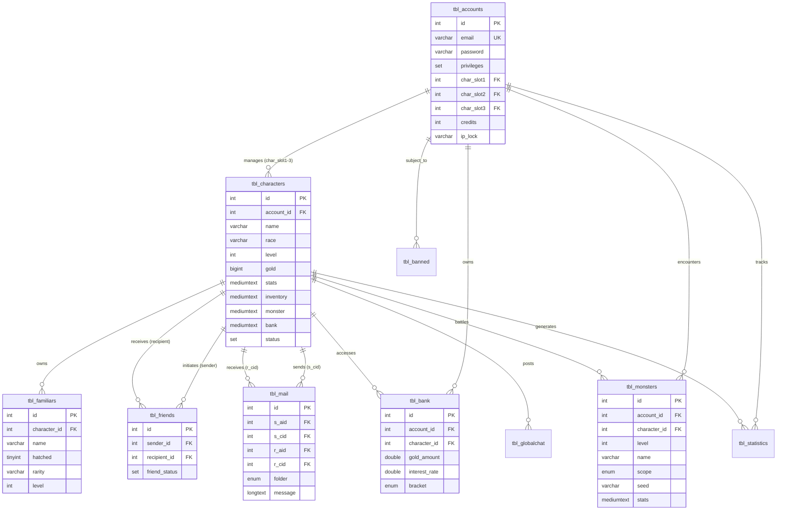
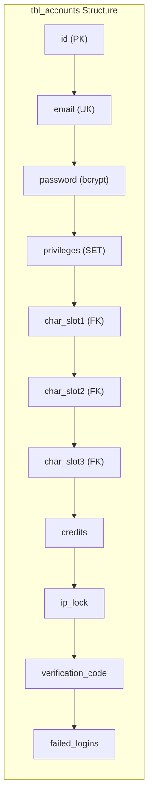
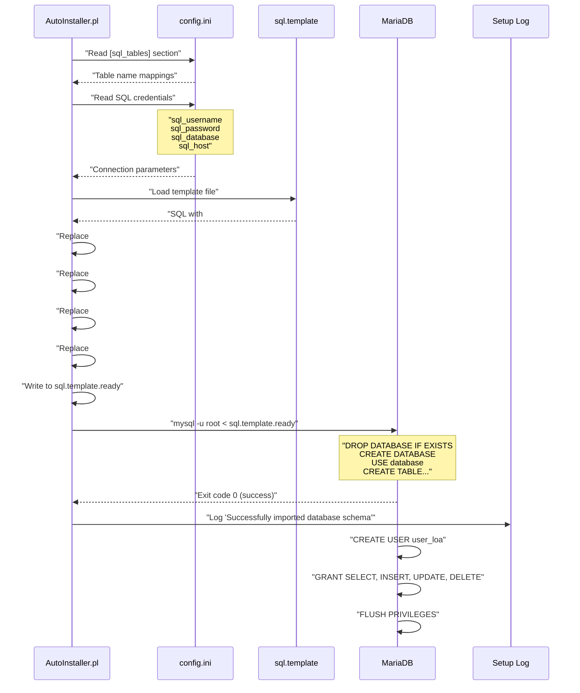

# Database Schema

<details>
<summary>Relevant source files</summary>

The following files were used as context for generating this wiki page:

- [INSTALL.md](INSTALL.md)
- [composer.json](composer.json)
- [composer.lock](composer.lock)
- [install/AutoInstaller.pl](install/AutoInstaller.pl)
- [install/config.ini.default](install/config.ini.default)
- [install/scripts/bootstrap.sh](install/scripts/bootstrap.sh)
- [install/templates/sql.template](install/templates/sql.template)

</details>


This document provides a comprehensive reference for the Legend of Aetheria database schema, including all table structures, relationships, data types, and constraints. The schema is designed to support the game's account system, character management, combat encounters, social features, and economy.

For information about the ORM layer that interacts with this schema, see [PropSuite ORM](#6.2). For details about the PHP entity classes that map to these tables, see [Entity Classes](#6.3).

## Schema Overview

Legend of Aetheria uses MariaDB/MySQL as its database engine. The schema consists of 12 primary tables that store game state, user data, and system information. All tables use the `InnoDB` storage engine with `utf8mb4` character encoding to support international characters and emoji.

The database name is configurable via the AutoInstaller and defaults to `db_loa`. Table names are also configurable through `config.ini` using the `[sql_tables]` section, allowing administrators to customize naming conventions while maintaining code compatibility.

**Sources:** [install/templates/sql.template:1-312](), [install/config.ini.default:73-86]()

### Table Inventory

The following tables comprise the complete database schema:

| Table Name | Purpose | Primary Entity |
|------------|---------|----------------|
| `tbl_accounts` | User authentication and account management | Account |
| `tbl_characters` | Player characters and stats | Character |
| `tbl_monsters` | Monster encounters and combat data | Monster |
| `tbl_familiars` | Pet companions and egg system | Familiar |
| `tbl_friends` | Friend relationships and requests | Friend |
| `tbl_mail` | In-game messaging system | Mail |
| `tbl_bank` | Banking and financial transactions | BankManager |
| `tbl_statistics` | Player statistics tracking | Statistics |
| `tbl_globalchat` | Global chat messages | GlobalChat |
| `tbl_banned` | Ban records and expiration | BanRecord |
| `tbl_logs` | System logging and auditing | Log |
| `tbl_globals` | Global configuration variables | GlobalVar |

**Sources:** [install/templates/sql.template:23-295](), [install/config.ini.default:73-86]()

## Entity Relationship Diagram



**Sources:** [install/templates/sql.template:23-295]()

## Core Tables

### Accounts Table (`tbl_accounts`)

The `tbl_accounts` table stores user authentication credentials, privilege levels, and character slot associations. Each account can manage up to three character slots.



**Table Structure:**

| Column | Type | Constraints | Description |
|--------|------|-------------|-------------|
| `id` | `INT(9) UNSIGNED` | PRIMARY KEY, AUTO_INCREMENT | Unique account identifier |
| `email` | `VARCHAR(255)` | NOT NULL | User email address (login) |
| `password` | `VARCHAR(255)` | DEFAULT NULL | Bcrypt hashed password |
| `date_registered` | `DATETIME` | DEFAULT CURDATE() | Account creation timestamp |
| `verified` | `TINYINT(1)` | DEFAULT 0 | Email verification status |
| `verification_code` | `VARCHAR(255)` | DEFAULT NULL | Email verification token |
| `banned` | `TINYINT(1)` | DEFAULT 0 | Ban status flag |
| `muted` | `TINYINT(1)` | DEFAULT 0 | Mute status flag |
| `privileges` | `SET(...)` | DEFAULT 'UNREGISTERED' | User privilege level |
| `last_login` | `TIMESTAMP` | ON UPDATE CURRENT_TIMESTAMP | Last login time |
| `logged_in` | `TINYINT(1)` | DEFAULT 0 | Current login state |
| `failed_logins` | `INT(10) UNSIGNED` | DEFAULT 0 | Failed login counter |
| `ip_address` | `TINYTEXT` | DEFAULT NULL | Last known IP address |
| `credits` | `INT(9) UNSIGNED` | DEFAULT 10 | Premium currency balance |
| `session_id` | `VARCHAR(255)` | DEFAULT NULL | PHP session identifier |
| `ip_lock` | `VARCHAR(64)` | DEFAULT NULL | IP lock configuration |
| `ip_lock_addr` | `VARCHAR(64)` | DEFAULT 'off' | Locked IP address |
| `char_slot1` | `INT(9) UNSIGNED` | DEFAULT NULL | Character ID in slot 1 |
| `char_slot2` | `INT(9) UNSIGNED` | DEFAULT NULL | Character ID in slot 2 |
| `char_slot3` | `INT(9) UNSIGNED` | DEFAULT NULL | Character ID in slot 3 |
| `settings` | `MEDIUMTEXT` | DEFAULT NULL | JSON-encoded user settings |

**Privilege Values:**
- `BANNED`, `MUTED`, `UNREGISTERED`, `UNVERIFIED`, `USER`, `MODERATOR`, `SUPER_MODERATOR`, `GLOBAL_ADMINISTRATOR`, `ADMINISTRATOR`, `OWNER`, `ROOTED`

**Unique Constraint:**
- `slots` unique key on (`char_slot1`, `char_slot2`, `char_slot3`)

**Sources:** [install/templates/sql.template:30-54]()

### Characters Table (`tbl_characters`)

The `tbl_characters` table stores all character data including statistics, inventory, and current state. Complex data structures are serialized as JSON in `MEDIUMTEXT` columns.

**Table Structure:**

| Column | Type | Constraints | Description |
|--------|------|-------------|-------------|
| `id` | `INT(9) UNSIGNED` | PRIMARY KEY, AUTO_INCREMENT | Unique character identifier |
| `account_id` | `INT(9) UNSIGNED` | NOT NULL | Foreign key to `tbl_accounts` |
| `level` | `INT(9) UNSIGNED` | DEFAULT 1 | Character level |
| `name` | `VARCHAR(50)` | DEFAULT NULL | Character display name |
| `race` | `VARCHAR(50)` | DEFAULT NULL | Character race (e.g., Human, Elf) |
| `avatar` | `VARCHAR(50)` | DEFAULT 'avatar-unknown.jpg' | Avatar image filename |
| `x` | `INT(9)` | DEFAULT 0 | X coordinate position |
| `y` | `INT(9)` | DEFAULT 0 | Y coordinate position |
| `location` | `VARCHAR(127)` | DEFAULT 'The Shrine' | Current location name |
| `alignment` | `INT(9)` | DEFAULT 5 | Moral alignment value |
| `gold` | `BIGINT(20) UNSIGNED` | DEFAULT 1000 | Gold currency amount |
| `floor` | `INT(9) UNSIGNED` | DEFAULT 1 | Dungeon floor level |
| `description` | `TEXT` | DEFAULT 'None Provided' | Character description |
| `stats` | `MEDIUMTEXT` | DEFAULT NULL | Serialized Stats object |
| `inventory` | `MEDIUMTEXT` | DEFAULT NULL | Serialized Inventory data |
| `monster` | `MEDIUMTEXT` | DEFAULT NULL | Serialized current Monster |
| `bank` | `MEDIUMTEXT` | DEFAULT NULL | Serialized BankManager data |
| `date_created` | `DATETIME` | DEFAULT CURRENT_TIMESTAMP | Creation timestamp |
| `last_action` | `TIMESTAMP` | ON UPDATE CURRENT_TIMESTAMP | Last activity timestamp |
| `status` | `SET(...)` | DEFAULT 'HEALTHY' | Character status effects |

**Status Values:**
- `HEALTHY`, `POISONED`, `BLINDED`, `SCARED`, `OVERENCUMBERED`, `OVERHEATED`, `STUNNED`, `FROZEN`, `BURNING`, `CONFUSED`, `CHARMED`, `SLEEPING`, `DEAD`, `BLEEDING`

**Sources:** [install/templates/sql.template:103-125]()

### Monsters Table (`tbl_monsters`)

The `tbl_monsters` table stores monster encounter data with support for different scope levels (personal, zone, global).

**Table Structure:**

| Column | Type | Constraints | Description |
|--------|------|-------------|-------------|
| `id` | `INT(9) UNSIGNED` | PRIMARY KEY, AUTO_INCREMENT | Unique monster identifier |
| `account_id` | `INT(9) UNSIGNED` | NOT NULL | Owner account ID |
| `character_id` | `INT(9) UNSIGNED` | DEFAULT NULL | Associated character ID |
| `level` | `INT(9) UNSIGNED` | DEFAULT 1 | Monster level |
| `name` | `VARCHAR(255)` | DEFAULT NULL | Monster name |
| `scope` | `ENUM(...)` | DEFAULT 'NONE' | Monster visibility scope |
| `seed` | `VARCHAR(255)` | NOT NULL | Random seed for generation |
| `drop_level` | `TINYINT(4)` | DEFAULT 1 | Loot drop tier |
| `exp_awarded` | `BIGINT(20)` | DEFAULT NULL | Experience reward |
| `gold_awarded` | `BIGINT(20)` | DEFAULT NULL | Gold reward |
| `monster_class` | `VARCHAR(255)` | DEFAULT NULL | Monster class/type |
| `stats` | `MEDIUMTEXT` | DEFAULT NULL | Serialized MonsterStats |

**Scope Values:**
- `NONE`: No encounter active
- `PERSONAL`: Player-specific monster
- `ZONE`: Location-specific monster
- `GLOBAL`: World boss visible to all

**Sources:** [install/templates/sql.template:252-266]()

### Familiars Table (`tbl_familiars`)

The `tbl_familiars` table manages pet companions, including eggs that can be hatched into familiars with varying rarity levels.

**Table Structure:**

| Column | Type | Constraints | Description |
|--------|------|-------------|-------------|
| `id` | `INT(9) UNSIGNED` | PRIMARY KEY, AUTO_INCREMENT | Unique familiar identifier |
| `character_id` | `INT(9) UNSIGNED` | NOT NULL | Owner character ID |
| `name` | `VARCHAR(128)` | DEFAULT '!Unset!' | Familiar display name |
| `hatched` | `TINYINT(1)` | DEFAULT 0 | Hatch status flag |
| `rarity` | `VARCHAR(56)` | DEFAULT 'NONE' | Rarity tier |
| `date_acquired` | `DATETIME` | DEFAULT NULL | Acquisition timestamp |
| `hatch_time` | `DATETIME` | DEFAULT NULL | Hatch timestamp |
| `rarity_color` | `VARCHAR(56)` | DEFAULT '#000' | UI color code |
| `level` | `INT(9) UNSIGNED` | DEFAULT 1 | Familiar level |
| `eggs_owned` | `INT(9) UNSIGNED` | DEFAULT 0 | Egg collection count |
| `eggs_seen` | `INT(9) UNSIGNED` | DEFAULT 0 | Eggs encountered count |
| `last_roll` | `FLOAT UNSIGNED` | DEFAULT 0 | Last rarity roll value |
| `avatar` | `VARCHAR(255)` | DEFAULT 'img/generated/eggs/egg-unhatched.jpeg' | Avatar path |
| `slot` | `INT(9) UNSIGNED` | DEFAULT 0 | Equipment slot number |

**Sources:** [install/templates/sql.template:135-151]()

### Friends Table (`tbl_friends`)

The `tbl_friends` table manages bidirectional friend relationships with request/acceptance workflow.

**Table Structure:**

| Column | Type | Constraints | Description |
|--------|------|-------------|-------------|
| `id` | `INT(9) UNSIGNED` | PRIMARY KEY, AUTO_INCREMENT | Unique relationship identifier |
| `sender_id` | `INT(9) UNSIGNED` | NOT NULL | Requesting character ID |
| `recipient_id` | `INT(9) UNSIGNED` | NOT NULL | Target character ID |
| `friend_status` | `SET(...)` | DEFAULT 'NONE' | Relationship status |
| `timestamp` | `DATETIME` | ON UPDATE CURRENT_TIMESTAMP | Status change timestamp |

**Status Values:**
- `NONE`: No relationship
- `REQUEST_SENT`: Sender has requested friendship
- `REQUEST_RECV`: Recipient has received request
- `MUTUAL`: Both have accepted, friendship established

**Sources:** [install/templates/sql.template:161-168]()

### Mail Table (`tbl_mail`)

The `tbl_mail` table implements an in-game messaging system with folder organization.

**Table Structure:**

| Column | Type | Constraints | Description |
|--------|------|-------------|-------------|
| `id` | `INT(9) UNSIGNED` | PRIMARY KEY, AUTO_INCREMENT | Unique message identifier |
| `s_aid` | `INT(9) UNSIGNED` | NOT NULL | Sender account ID |
| `s_cid` | `INT(9) UNSIGNED` | NOT NULL | Sender character ID |
| `r_aid` | `INT(9) UNSIGNED` | NOT NULL | Recipient account ID |
| `r_cid` | `INT(9) UNSIGNED` | NOT NULL | Recipient character ID |
| `folder` | `ENUM(...)` | NOT NULL | Mail folder location |
| `to` | `VARCHAR(50)` | NOT NULL | Recipient display name |
| `from` | `VARCHAR(50)` | NOT NULL | Sender display name |
| `subject` | `VARCHAR(50)` | NOT NULL | Message subject |
| `message` | `LONGTEXT` | NOT NULL | Message body |
| `date` | `DATETIME` | DEFAULT CURRENT_TIMESTAMP | Send timestamp |
| `status` | `SET(...)` | DEFAULT NULL | Message flags |

**Folder Values:**
- `INBOX`: Received messages
- `DRAFTS`: Unsent messages
- `OUTBOX`: Sent messages
- `DELETED`: Trash folder

**Status Values:**
- `NONE`, `READ`, `REPLIED`, `FAVORITE`, `IMPORTANT`

**Sources:** [install/templates/sql.template:228-242]()

### Bank Table (`tbl_bank`)

The `tbl_bank` table manages character banking accounts with interest accrual and tier-based benefits.

**Table Structure:**

| Column | Type | Constraints | Description |
|--------|------|-------------|-------------|
| `id` | `INT(9) UNSIGNED` | PRIMARY KEY, AUTO_INCREMENT | Unique bank account identifier |
| `account_id` | `INT(9) UNSIGNED` | NOT NULL | Owner account ID |
| `character_id` | `INT(9) UNSIGNED` | NOT NULL | Owner character ID |
| `gold_amount` | `DOUBLE` | DEFAULT NULL | Deposited gold balance |
| `interest_rate` | `DOUBLE UNSIGNED` | DEFAULT 0.5 | Interest rate percentage |
| `spindels` | `INT(9) UNSIGNED` | DEFAULT 0 | Premium currency stored |
| `loan` | `DOUBLE UNSIGNED` | DEFAULT 0 | Outstanding loan amount |
| `dpr` | `DOUBLE UNSIGNED` | DEFAULT 25 | Daily percentage rate |
| `bracket` | `ENUM(...)` | DEFAULT 'STANDARD' | Account tier |
| `transfer_limit` | `DOUBLE UNSIGNED` | DEFAULT 5000 | Max transfer per transaction |

**Bracket Values:**
- `STANDARD`: Basic account
- `ELITE`: Enhanced benefits
- `PLATINUM`: Premium tier
- `DIAMOND`: Maximum benefits

**Sources:** [install/templates/sql.template:64-76]()

## Supporting Tables

### Statistics Table (`tbl_statistics`)

Tracks cumulative player achievements and metrics.

**Key Columns:** `critical_hits`, `deaths`, `player_kills`, `monster_kill`, `biggest_hit`, `total_exp`, `total_goldeggs_found`, `eggs_hatched`, `highest_famlvl`, `logins`, `failed_logins`

**Sources:** [install/templates/sql.template:276-295]()

### Global Chat Table (`tbl_globalchat`)

Stores chat messages with room support.

**Key Columns:** `character_id`, `message`, `when`, `nickname`, `room`

**Sources:** [install/templates/sql.template:178-186]()

### Banned Table (`tbl_banned`)

Records ban history with expiration support.

**Key Columns:** `account_id`, `date`, `expires`, `reason`

**Sources:** [install/templates/sql.template:86-93]()

### Logs Table (`tbl_logs`)

System event logging for auditing and debugging.

**Key Columns:** `date`, `type`, `message`, `ip`

**Sources:** [install/templates/sql.template:211-218]()

### Globals Table (`tbl_globals`)

Stores global configuration key-value pairs.

**Key Columns:** `name`, `value`

**Sources:** [install/templates/sql.template:196-201]()

## Schema Installation Flow



The AutoInstaller creates the database schema during the `SQL` step (step 5). The process performs these operations:

1. **Template Loading**: Reads `install/templates/sql.template` containing placeholder variables
2. **Variable Substitution**: Replaces `###REPL_*###` tokens with values from `config.ini`
3. **SQL Execution**: Executes the processed template using `mysql` command-line client
4. **User Creation**: Creates database user with restricted privileges (SELECT, INSERT, UPDATE, DELETE)
5. **Privilege Grant**: Applies permissions to the game database only

**Template Variables:**
- `###REPL_SQL_DB###` → Database name (default: `db_loa`)
- `###REPL_SQL_USER###` → Database username (default: `user_loa`)
- `###REPL_SQL_PASS###` → Generated random password
- `###REPL_SQL_TBL_*###` → Individual table names from config

**Sources:** [install/AutoInstaller.pl:509-534](), [install/AutoInstaller.pl:896-949](), [install/templates/sql.template:1-311]()

## Table Name Configuration

Table names are configurable via the `[sql_tables]` section in `config.ini`. This allows customization while maintaining code compatibility through constant references.

**Configuration Mapping:**

```ini
[sql_tables]
tbl_characters=tbl_characters
tbl_familiars=tbl_familiars
tbl_accounts=tbl_accounts
tbl_friends=tbl_friends
tbl_globals=tbl_globals
tbl_mail=tbl_mail
tbl_chats=tbl_chats
tbl_monsters=tbl_monsters
tbl_logs=tbl_logs
tbl_banned=tbl_banned
tbl_globalchat=tbl_globalchat
tbl_statistics=tbl_statistics
tbl_bank=tbl_bank
```

The AutoInstaller reads these mappings and replaces all occurrences in the SQL template file. PHP code accesses table names through the constants defined in `system/constants.php`, which is also generated from templates during installation.

**Sources:** [install/config.ini.default:73-86](), [install/AutoInstaller.pl:110-113]()

## Data Serialization

Several tables use `MEDIUMTEXT` columns to store complex data structures serialized as JSON. This hybrid approach provides flexibility while maintaining compatibility with the PropSuite ORM layer.

**Serialized Columns:**

| Table | Column | Stores |
|-------|--------|--------|
| `tbl_accounts` | `settings` | User preferences and UI state |
| `tbl_characters` | `stats` | Stats object (HP, MP, STR, DEF, etc.) |
| `tbl_characters` | `inventory` | Inventory items array |
| `tbl_characters` | `monster` | Current Monster encounter data |
| `tbl_characters` | `bank` | BankManager instance data |
| `tbl_monsters` | `stats` | MonsterStats object |

These serialized fields are automatically handled by the PropSuite trait's `propSync()` method, which performs JSON encoding/decoding during database persistence operations.

**Sources:** [install/templates/sql.template:103-125](), [install/templates/sql.template:252-266]()