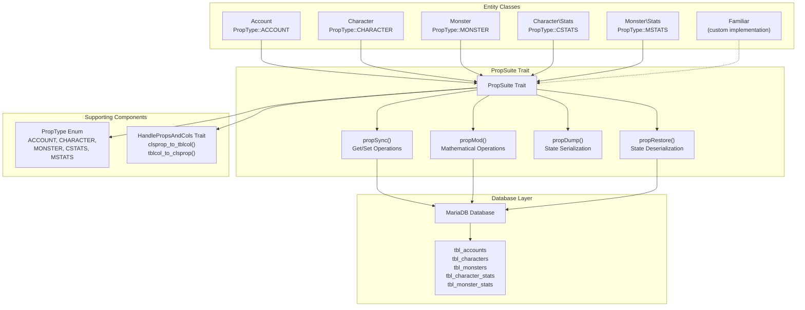
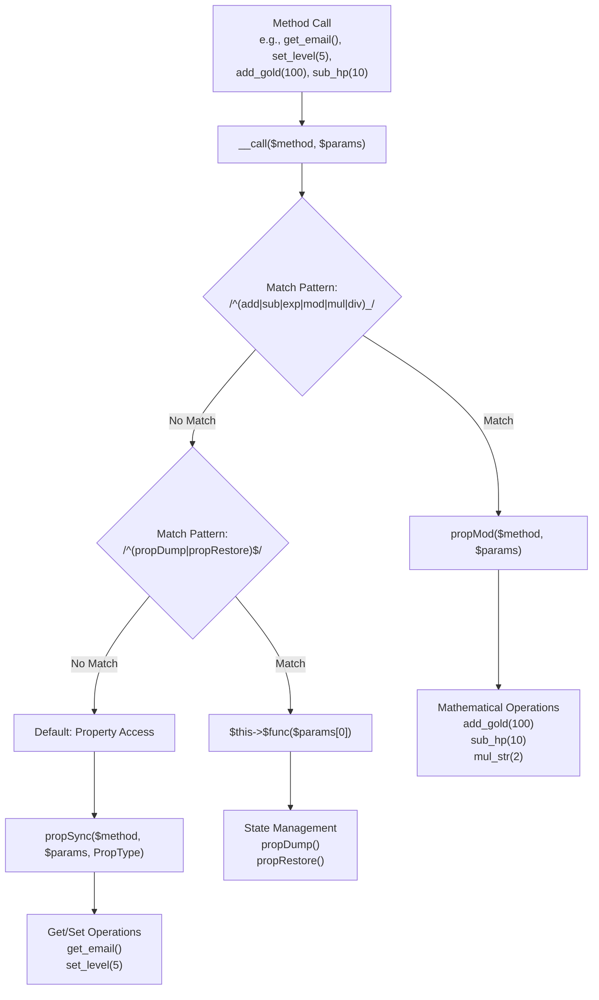
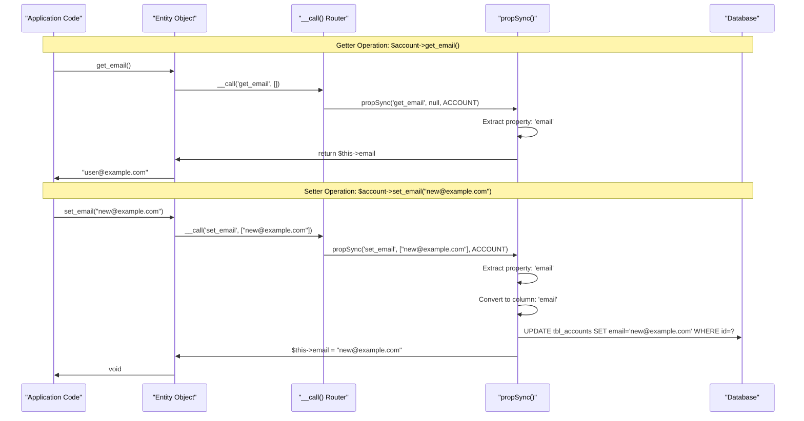
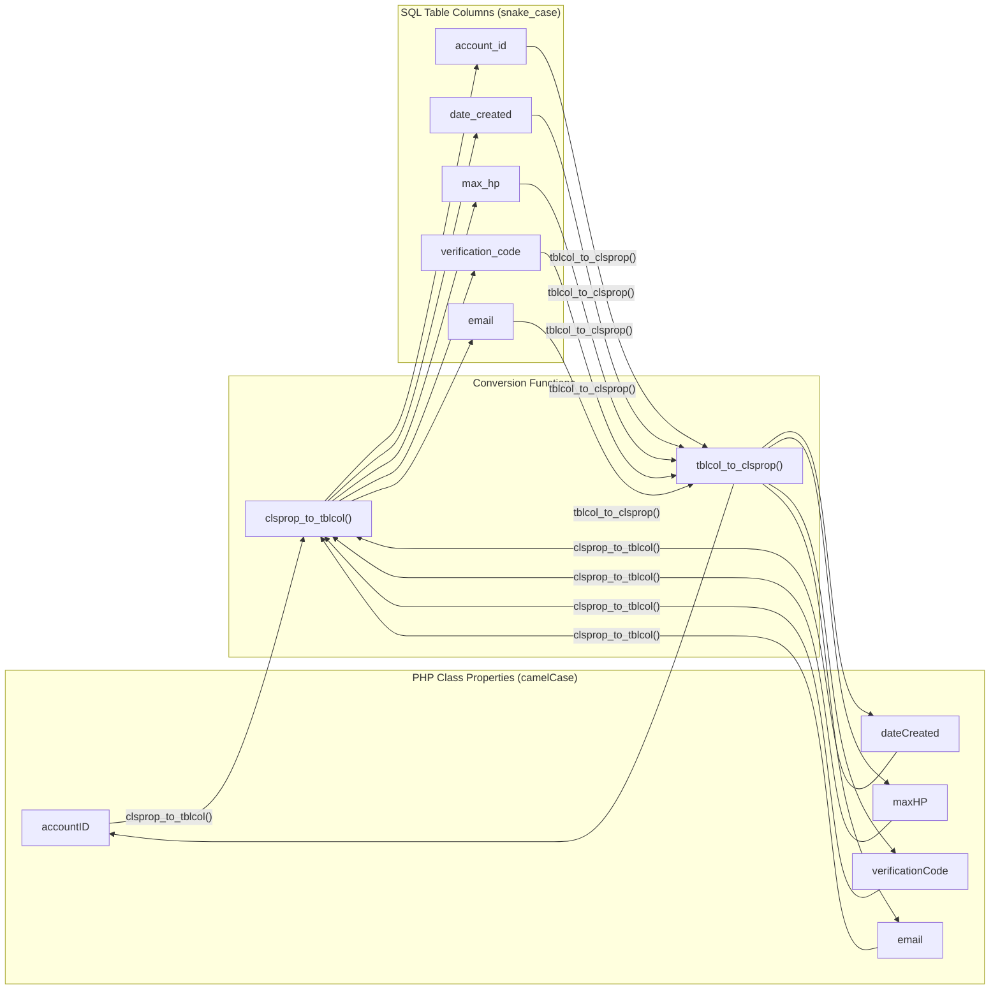
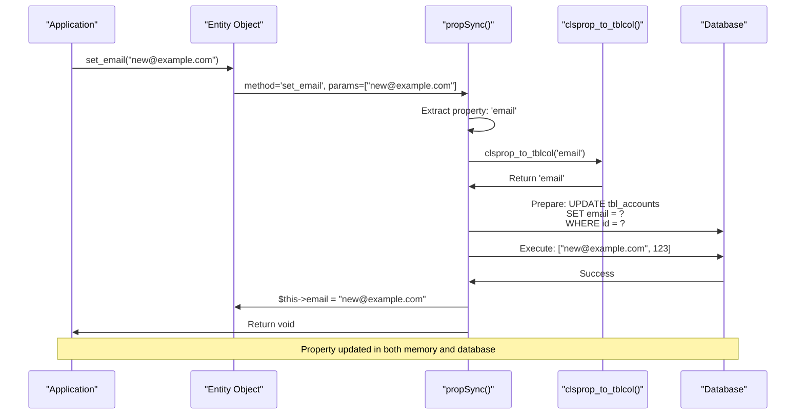
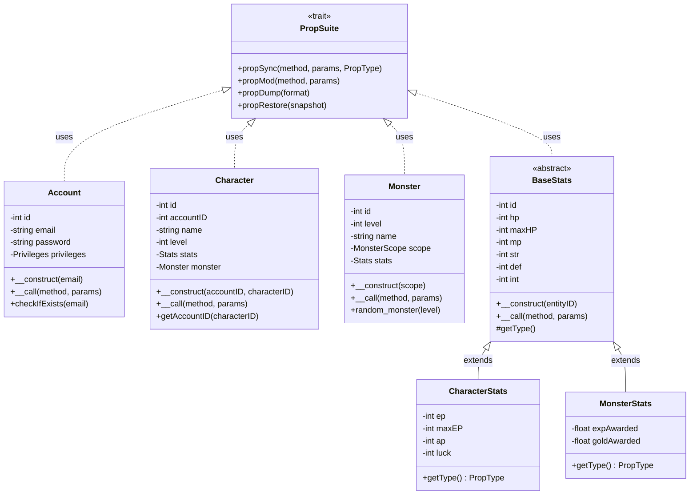

# PropSuite ORM

<details>
<summary>Relevant source files</summary>

The following files were used as context for generating this wiki page:

- [admini/strator/system/functions.php](admini/strator/system/functions.php)
- [battle.php](battle.php)
- [js/battle.js](js/battle.js)
- [navs/sidemenus/nav-quicknav.php](navs/sidemenus/nav-quicknav.php)
- [src/Account/Account.php](src/Account/Account.php)
- [src/Character/Character.php](src/Character/Character.php)
- [src/Character/Stats.php](src/Character/Stats.php)
- [src/Familiar/Familiar.php](src/Familiar/Familiar.php)
- [src/Monster/Monster.php](src/Monster/Monster.php)
- [src/Monster/Stats.php](src/Monster/Stats.php)

</details>


## Purpose and Scope

PropSuite is a trait-based Object-Relational Mapping (ORM) layer that provides dynamic property access, automatic database synchronization, and mathematical operations for entity classes in Legend of Aetheria. It eliminates boilerplate getter/setter code by using PHP's magic `__call()` method to intercept property access and route it to appropriate database operations.

This document covers the PropSuite trait implementation, PropType enum, property naming conventions, and usage patterns across entity classes. For information about the database schema that PropSuite interacts with, see [Database Schema](#6.1). For details about specific entity classes that use PropSuite, see [Entity Classes](#6.3).

**Sources:** [src/Traits/PropSuite/PropSuite.php](), [src/Traits/PropSuite/Enums/PropType.php]()

---

## Architecture Overview

PropSuite operates as a reusable trait that entity classes include to gain ORM functionality. The trait intercepts method calls via `__call()` and routes them to specialized handlers based on the method name pattern.



**Sources:** [src/Account/Account.php:4-5,74-75](), [src/Character/Character.php:3-4,80-81](), [src/Monster/Monster.php:4-5,37-38](), [src/Character/Stats.php:3-4,82](), [src/Monster/Stats.php:3-4,49]()

---

## PropType Enum

The `PropType` enum distinguishes between different entity types when synchronizing with the database. Each enum value maps to a specific database table and entity context.

| PropType Value | Entity Class | Database Table | Purpose |
|----------------|--------------|----------------|---------|
| `ACCOUNT` | `Account` | `tbl_accounts` | User account data |
| `CHARACTER` | `Character` | `tbl_characters` | Player character data |
| `MONSTER` | `Monster` | `tbl_monsters` | Enemy monster data |
| `CSTATS` | `Character\Stats` | `tbl_character_stats` | Character combat stats |
| `MSTATS` | `Monster\Stats` | `tbl_monster_stats` | Monster combat stats |

### Usage Pattern

Entity classes pass their `PropType` to `propSync()` when handling method calls:

```php
// Account.__call() routes to propSync with ACCOUNT type
return $this->propSync($method, $params, PropType::ACCOUNT);

// Character.__call() routes to propSync with CHARACTER type
return $this->propSync($method, $params, PropType::CHARACTER);

// Monster.__call() routes to propSync with MONSTER type
return $this->propSync($method, $params, PropType::MONSTER);
```

Stats classes override a `getType()` method instead:

```php
// Character\Stats returns CSTATS
protected function getType(): PropType {
    return PropType::CSTATS;
}

// Monster\Stats returns MSTATS
protected function getType(): PropType {
    return PropType::MSTATS;
}
```

**Sources:** [src/Traits/PropSuite/Enums/PropType.php](), [src/Account/Account.php:200](), [src/Character/Character.php:193](), [src/Monster/Monster.php:109](), [src/Character/Stats.php:125-127](), [src/Monster/Stats.php:65-67]()

---

## Magic Method Routing

PropSuite leverages PHP's `__call()` magic method to intercept calls to undefined methods. Each entity class implements `__call()` with a consistent pattern that routes method calls based on regular expression matching.

### Routing Logic Flow



### Implementation Pattern

All entity classes follow this routing structure in their `__call()` implementations:

```php
public function __call($method, $params) {
    global $db, $log;

    if (!count($params)) {
        $params = null;
    }

    // Route 1: Mathematical operations
    if (preg_match('/^(add|sub|exp|mod|mul|div)_/', $method)) {
        return $this->propMod($method, $params);
    }
    
    // Route 2: State dump/restore
    if (preg_match('/^(propDump|propRestore)$/', $method, $matches)) {
        $func = $matches[1];
        return $this->$func($params[0] ?? null);
    }
    
    // Route 3: Default get/set operations
    return $this->propSync($method, $params, PropType::ACCOUNT);
}
```

**Sources:** [src/Account/Account.php:184-201](), [src/Character/Character.php:179-195](), [src/Monster/Monster.php:95-111]()

---

## Property Access: propSync()

The `propSync()` method handles getter and setter operations, automatically synchronizing property changes with the database. It distinguishes between getters (starting with `get_`) and setters (starting with `set_`) by examining the method name.

### Operation Flow



### Method Name Parsing

PropSuite extracts the property name from the method by removing the `get_` or `set_` prefix:

| Method Call | Extracted Property | Database Column |
|-------------|-------------------|-----------------|
| `get_email()` | `email` | `email` |
| `set_level(5)` | `level` | `level` |
| `get_accountID()` | `accountID` | `account_id` |
| `set_dateCreated($date)` | `dateCreated` | `date_created` |

**Sources:** [src/Account/Account.php:200](), [src/Character/Character.php:193](), [src/Monster/Monster.php:109]()

---

## Mathematical Operations: propMod()

The `propMod()` method provides mathematical operations on numeric properties with automatic database persistence. It supports six operation types that modify property values atomically.

### Supported Operations

| Method Prefix | Operation | Example | Result |
|---------------|-----------|---------|--------|
| `add_` | Addition | `add_gold(100)` | `gold += 100` |
| `sub_` | Subtraction | `sub_hp(10)` | `hp -= 10` |
| `mul_` | Multiplication | `mul_str(2)` | `str *= 2` |
| `div_` | Division | `div_exp(2)` | `exp /= 2` |
| `exp_` | Exponentiation | `exp_level(2)` | `level = level^2` |
| `mod_` | Modulo | `mod_gold(100)` | `gold %= 100` |

### Automatic Capping

Mathematical operations on health/mana/energy stats automatically cap values at their maximum:

```php
// If maxHP = 100 and hp = 80:
$character->stats->add_hp(50);  // hp becomes 100 (capped at maxHP)

// If maxMP = 50 and mp = 30:
$character->stats->add_mp(30);  // mp becomes 50 (capped at maxMP)

// If maxEP = 100 and ep = 90:
$character->stats->sub_ep(20);  // ep becomes 70 (no negative values)
```

### Usage in Combat System

The battle system extensively uses mathematical operations for damage calculation and stat modification:

```php
// Deduct energy for attacking
$character->stats->sub_ep(1);

// Apply damage to target
$target->stats->sub_hp($damage);

// Reward experience and gold after victory
$character->add_experience($exp_gained);
$character->add_gold($gold_gained);
```

**Sources:** [src/Account/Account.php:191-192](), [src/Character/Character.php:187-188](), [src/Monster/Monster.php:103-104](), [battle.php:86,242,273-274]()

---

## Property Naming Conventions

PropSuite automatically converts between PHP camelCase property names and SQL snake_case column names using helper functions from the `HandlePropsAndCols` trait.

### Conversion Rules



### Conversion Algorithm

The `clsprop_to_tblcol()` function splits camelCase strings at capital letters and joins them with underscores:

| PHP Property | Split Pattern | SQL Column |
|--------------|---------------|------------|
| `accountID` | `['account', 'ID']` | `account_id` |
| `dateCreated` | `['date', 'Created']` | `date_created` |
| `maxHP` | `['max', 'HP']` | `max_hp` |
| `verificationCode` | `['verification', 'Code']` | `verification_code` |
| `email` | `['email']` | `email` |

The `tblcol_to_clsprop()` function reverses this process:

```php
function clsprop_to_tblcol($property) {
    $splits = preg_split('/(?=[A-Z]{1,2})/', $property);
    if (count($splits) === 1) {
        return $property;
    }
    $table_column = $splits[0] . '_' . strtolower($splits[1]);
    if (isset($splits[2])) {
        $table_column .= strtolower($splits[2]);
    }
    return $table_column;
}
```

**Sources:** [admini/strator/system/functions.php:67-107](), [src/Familiar/Familiar.php:115-117,296]()

---

## Database Synchronization

PropSuite synchronizes property changes to the database immediately upon setter invocation. This ensures that the object state and database state remain consistent throughout the application lifecycle.

### Synchronization Pattern



### Transaction Safety

Each PropSuite operation executes as an individual database query. For multi-property updates that require atomicity, use explicit database transactions:

```php
// Not atomic - three separate queries
$character->set_level(5);
$character->set_exp(0);
$character->stats->set_maxHP(150);

// Atomic - all or nothing
$db->begin_transaction();
try {
    $character->set_level(5);
    $character->set_exp(0);
    $character->stats->set_maxHP(150);
    $db->commit();
} catch (Exception $e) {
    $db->rollback();
    throw $e;
}
```

**Sources:** [src/Account/Account.php:200](), [src/Character/Character.php:193](), [src/Familiar/Familiar.php:294-309]()

---

## State Management: propDump() and propRestore()

PropSuite provides state serialization methods for saving and restoring entity snapshots. These methods are useful for implementing undo/redo functionality, state caching, or temporary modifications.

### propDump()

Serializes all entity properties into an associative array or JSON string:

```php
// Dump to array
$snapshot = $character->propDump('array');
// Result: ['id' => 1, 'name' => 'Hero', 'level' => 5, ...]

// Dump to JSON
$json = $character->propDump('json');
// Result: '{"id":1,"name":"Hero","level":5,...}'
```

### propRestore()

Restores entity state from a previously dumped snapshot:

```php
// Save current state
$backup = $character->propDump('array');

// Make changes
$character->set_level(10);
$character->set_hp(1);

// Restore from backup
$character->propRestore($backup);
// Character is back to original level and HP
```

### Usage Pattern

State management is particularly useful for implementing preview functionality or rollback on errors:

```php
// Preview stat changes before committing
$before = $character->stats->propDump('array');

$character->stats->add_str(10);
$character->stats->add_def(5);
$new_power = calculate_power_level($character);

if ($new_power > MAX_POWER) {
    // Rollback changes
    $character->stats->propRestore($before);
    throw new Exception("Changes would exceed power limit");
}
```

**Sources:** [src/Account/Account.php:195-197](), [src/Character/Character.php:189-191](), [src/Monster/Monster.php:105-107]()

---

## Entity Implementation Patterns

All entity classes follow a consistent pattern when implementing PropSuite. The pattern includes trait inclusion, property declarations, constructor initialization, and `__call()` routing.

### Standard Implementation



### Constructor Pattern

Entities initialize their ID and load data if an identifier is provided:

```php
// Account constructor
public function __construct($email = null) {
    if ($email) {
        $this->email = $email;
        $id = self::checkIfExists($email);
        
        if ($id > 0) {
            $this->id = $id;
            $this->load($id);
        }
    }
}

// Character constructor
public function __construct($accountID, $characterID = null) {
    $this->accountID = $accountID;
    $this->stats = new Stats($characterID ?? 0);

    if ($characterID) {
        $this->id = $characterID;
        $this->inventory = new Inventory($this->id);
        $this->load($this->id);
        $this->stats->set_id($this->id);
    }
}
```

**Sources:** [src/Account/Account.php:162-172](), [src/Character/Character.php:157-167](), [src/Monster/Monster.php:78-81](), [src/Character/Stats.php:109-111]()

---

## Usage Examples

### Basic Property Access

```php
// Getter operations
$account = new Account('user@example.com');
$email = $account->get_email();
$privileges = $account->get_privileges();
$credits = $account->get_credits();

// Setter operations
$account->set_verified(true);
$account->set_lastLogin(date('Y-m-d H:i:s'));
$account->set_privileges(Privileges::MODERATOR);
```

### Mathematical Operations

```php
// Combat damage
$character = new Character($accountID, $characterID);
$character->stats->sub_hp(25);  // Take 25 damage
$character->stats->sub_ep(1);   // Use 1 energy

// Economic transactions
$character->add_gold(150.50);
$character->sub_spindels(5);
$account->add_credits(100);

// Experience and leveling
$character->add_exp(500);
$character->add_level(1);
```

### Combat System Integration

The battle system demonstrates extensive PropSuite usage for stat management:

```php
// Validate battle state
if ($character->stats->get_ep() <= 0) {
    exit("No EP Left");
}

// Process damage
$attack = calculate_attack($attacker, $roll);
$defense = calculate_defense($attackee);
$damage = max(0, $attack - $defense);

// Apply damage using PropSuite
$attackee->stats->sub_hp($damage);

// Check if target is alive
if ($target->stats->get_hp() <= 0) {
    // Reward player
    $character->add_experience($monster->get_expAwarded());
    $character->add_gold($monster->get_goldAwarded());
    $character->set_monster(null);
}
```

**Sources:** [battle.php:14-18,58,86,242,273-275](), [src/Character/Character.php:157-167](), [src/Account/Account.php:162-172]()

---

## Familiar Custom Implementation

The `Familiar` class uses a simplified custom implementation of property access rather than the full PropSuite trait. This implementation directly handles get/set operations without the mathematical operations or state management features.

### Custom __call() Implementation

```php
function __call($method, $params) {
    global $log, $db, $t;
    $var = lcfirst(substr($method, 4));

    if (strncasecmp($method, "get_", 4) === 0) {
        return $this->$var;
    }

    if (strncasecmp($method, "set_", 4) === 0) {
        $sqlQuery = "UPDATE {$t['familiars']} ";
        $table_col = $this->clsprop_to_tblcol($var);

        if (is_int($params[0])) {
            $sqlQuery .= "SET `$table_col` = " . $params[0] . " ";
        } else {
            $sqlQuery .= "SET `$table_col` = '" . $params[0] . "' ";
        }

        $sqlQuery .= 'WHERE `id` = ' . $this->id;
        $db->query($sqlQuery);
        $this->$var = $params[0];
    }
}
```

This simpler implementation:
- ✅ Supports `get_` and `set_` operations
- ❌ Does not support mathematical operations (`add_`, `sub_`, etc.)
- ❌ Does not support state management (`propDump`, `propRestore`)
- ❌ Uses string concatenation instead of prepared statements (security risk)

**Sources:** [src/Familiar/Familiar.php:284-310]()

---

## Best Practices

### 1. Always Use Prepared Statements

PropSuite's core implementation should use prepared statements to prevent SQL injection. The Familiar class example shows an anti-pattern:

```php
// ❌ AVOID: String concatenation (vulnerable)
$sqlQuery .= 'WHERE `id` = ' . $this->id;
$db->query($sqlQuery);

// ✅ PREFER: Prepared statements
$sqlQuery .= 'WHERE `id` = ?';
$db->execute_query($sqlQuery, [$this->id]);
```

### 2. Leverage Mathematical Operations

Use built-in mathematical operations instead of get-modify-set patterns:

```php
// ❌ AVOID: Three database queries
$current = $character->get_gold();
$new = $current + 100;
$character->set_gold($new);

// ✅ PREFER: Single database query
$character->add_gold(100);
```

### 3. Understand Capping Behavior

HP/MP/EP operations automatically cap at maximum values:

```php
// Character has: hp=50, maxHP=100
$character->stats->add_hp(100);  // hp becomes 100, not 150

// Monster has: hp=30, maxHP=50
$monster->stats->sub_hp(40);     // hp becomes 0, not -10
```

### 4. Use PropDump for Rollback

Implement rollback functionality using state dumps:

```php
$backup = $character->propDump('array');

try {
    perform_risky_operation($character);
    $db->commit();
} catch (Exception $e) {
    $character->propRestore($backup);
    $db->rollback();
    throw $e;
}
```

### 5. Consistent Property Naming

Follow camelCase conventions for PHP properties that will auto-convert to snake_case:

```php
// ✅ Correct: Will map to 'max_hp'
private int $maxHP;

// ❌ Incorrect: Will map to 'max_h_p' (wrong)
private int $maxHP;

// ✅ Correct: Will map to 'account_id'
private int $accountID;
```

**Sources:** [src/Familiar/Familiar.php:294-309](), [battle.php:86,242,273-274](), [admini/strator/system/functions.php:74-84]()

---

## Limitations and Considerations

### Performance Implications

Every setter operation triggers an immediate database UPDATE:

```php
// ❌ Poor Performance: 5 separate UPDATE queries
$character->set_name('Hero');
$character->set_level(5);
$character->set_exp(0);
$character->set_gold(1000);
$character->set_location('Town');

// ✅ Better: Use bulk updates or transactions when possible
// (Note: Requires manual SQL for true bulk operations)
```

### No Lazy Loading

PropSuite immediately persists all changes. There is no concept of "dirty" tracking or batched writes:

- Changes are committed immediately
- No rollback capability without manual state management
- No automatic transaction handling

### Type Safety

PropSuite relies on dynamic method calls, which bypass PHP's static type checking:

```php
// These will compile but may cause runtime errors
$character->set_level("invalid");  // String passed to int property
$character->add_gold("100");       // String arithmetic
```

### Complex Object Properties

PropSuite works best with scalar types. Complex objects (like `Stats`, `Monster`) require manual handling:

```php
// Simple types work automatically
$character->set_level(5);         // ✅ Automatic

// Complex types need explicit handling
$monster = new Monster(MonsterScope::PERSONAL);
$character->set_monster($monster);  // May need custom logic
```

**Sources:** [src/Character/Character.php:138-147](), [src/Monster/Monster.php:37-70](), [src/Account/Account.php:74-153]()

---

## Related Pages

- [Database Schema](#6.1) - Tables and column definitions that PropSuite interacts with
- [Entity Classes](#6.3) - Detailed documentation of Account, Character, Monster, Stats classes
- [Combat System](#5.2) - How PropSuite mathematical operations are used in battle mechanics
- [Character Management](#5.1) - Character creation and progression using PropSuite