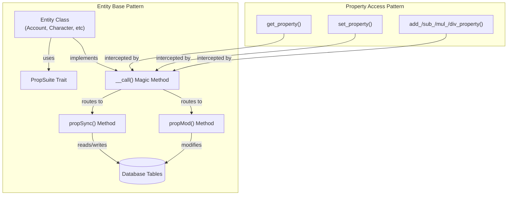
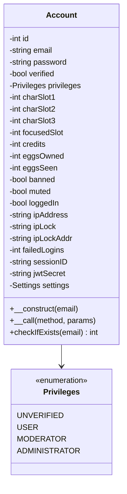
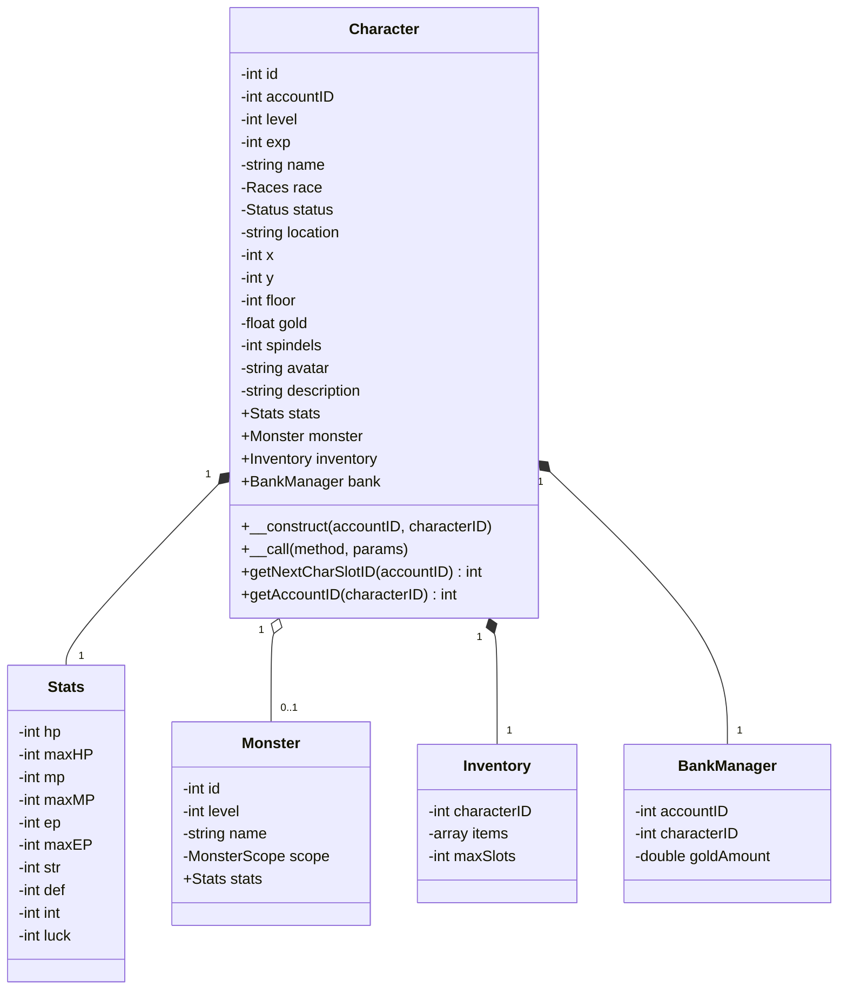
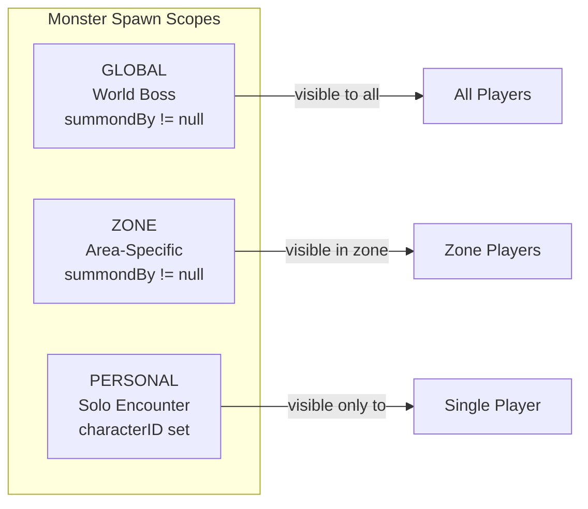
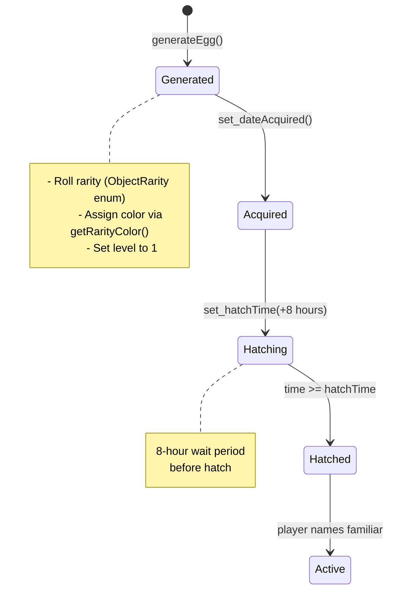
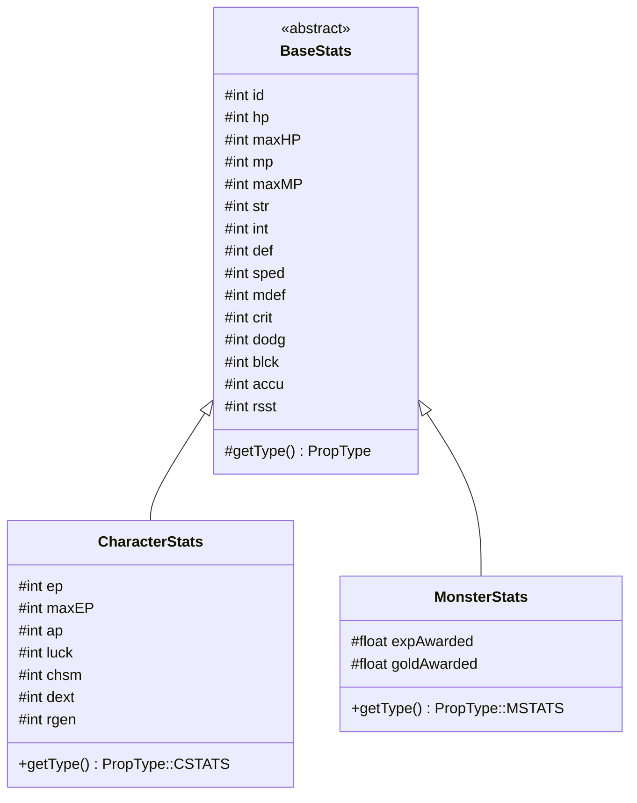
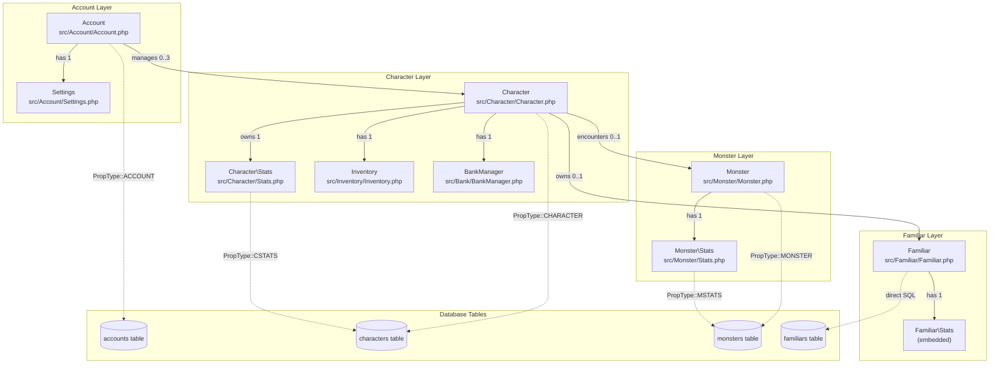
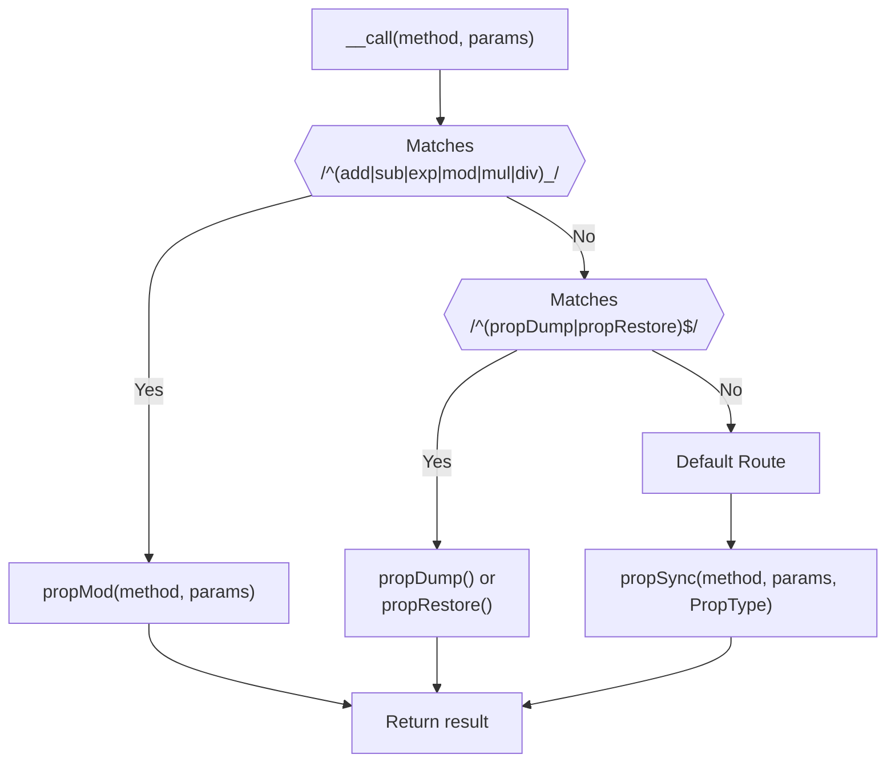

# Entity Classes

<details>
<summary>Relevant source files</summary>

The following files were used as context for generating this wiki page:

- [battle.php](battle.php)
- [js/battle.js](js/battle.js)
- [src/Account/Account.php](src/Account/Account.php)
- [src/Character/Character.php](src/Character/Character.php)
- [src/Character/Stats.php](src/Character/Stats.php)
- [src/Familiar/Familiar.php](src/Familiar/Familiar.php)
- [src/Monster/Monster.php](src/Monster/Monster.php)
- [src/Monster/Stats.php](src/Monster/Stats.php)

</details>


## Purpose and Scope

This document describes the core entity classes that represent domain objects in Legend of Aetheria. Entity classes encapsulate game state (accounts, characters, monsters, familiars, stats) and provide database persistence through the `PropSuite` trait. Each entity class maps to one or more database tables and implements dynamic property access via PHP's `__call()` magic method.

For database schema details, see [Database Schema](#6.1). For PropSuite ORM implementation, see [PropSuite ORM](#6.2).

**Sources:** [src/Account/Account.php:1-220](), [src/Character/Character.php:1-228](), [src/Monster/Monster.php:1-182](), [src/Familiar/Familiar.php:1-372]()

---

## Entity Class Architecture

All entity classes follow a common architectural pattern: private properties, PropSuite trait usage, and magic method-based property access.



**Sources:** [src/Account/Account.php:184-201](), [src/Character/Character.php:179-195](), [src/Monster/Monster.php:95-111]()

---

## PropType Enum Mapping

Each entity class specifies its `PropType` to determine which database table PropSuite synchronizes with.

| Entity Class | PropType | Database Table | File Path |
|-------------|----------|----------------|-----------|
| `Account` | `PropType::ACCOUNT` | `accounts` | [src/Account/Account.php:200]() |
| `Character` | `PropType::CHARACTER` | `characters` | [src/Character/Character.php:193]() |
| `Monster` | `PropType::MONSTER` | `monsters` | [src/Monster/Monster.php:109]() |
| `Character\Stats` | `PropType::CSTATS` | `characters` | [src/Character/Stats.php:125-127]() |
| `Monster\Stats` | `PropType::MSTATS` | `monsters` | [src/Monster/Stats.php:65-67]() |

**Sources:** [src/Traits/PropSuite/Enums/PropType.php](), [src/Account/Account.php:200](), [src/Character/Character.php:193]()

---

## Account Class

The `Account` class represents user accounts with authentication credentials, character slots, and privilege levels.

### Properties and Structure



### Key Methods

The `Account` class implements three primary methods:

**Constructor** [src/Account/Account.php:162-172]()
- Accepts optional `$email` parameter
- Calls `checkIfExists()` to verify account existence
- Loads account data if found via `load()`

**Magic Method `__call()`** [src/Account/Account.php:184-201]()
- Routes `get_*` and `set_*` calls to `propSync()`
- Routes `add_*`, `sub_*`, `mul_*`, `div_*`, `exp_*`, `mod_*` to `propMod()`
- Handles `propDump()` and `propRestore()` operations

**Static `checkIfExists()`** [src/Account/Account.php:209-219]()
- Queries database for account by email
- Returns account ID if found, -1 otherwise
- Used during login and registration

### Usage Example from Codebase

```php
// From battle.php:14
$account = new Account($_SESSION['email']);
```

**Sources:** [src/Account/Account.php:1-220](), [src/Account/Enums/Privileges.php]()

---

## Character Class

The `Character` class represents player characters with stats, inventory, location, and combat state.

### Properties and Aggregated Objects



### Constructor Pattern

[src/Character/Character.php:157-167]()
```php
public function __construct($accountID, $characterID = null) {
    $this->accountID = $accountID;
    $this->stats = new Stats($characterID ?? 0);
    
    if ($characterID) {
        $this->id = $characterID;
        $this->inventory = new Inventory($this->id);
        $this->load($this->id);
        $this->stats->set_id($this->id);
    }
}
```

### Character Slot Management

**`getNextCharSlotID()`** [src/Character/Character.php:205-209]()
- Queries `accounts` table for available character slots
- Returns slot number (1-3) or -1 if all slots full
- Uses nested IF statements in SQL query

**`getAccountID()`** [src/Character/Character.php:217-227]()
- Static method to retrieve account ID for a character
- Returns -1 if character not found

### Usage in Combat System

```php
// From battle.php:14-16
$account = new Account($_SESSION['email']);
$character = new Character($account->get_id(), $_SESSION['character-id']);
$monster = $character->get_monster();
```

**Sources:** [src/Character/Character.php:1-228](), [src/Character/Enums/Races.php](), [src/Character/Enums/Status.php]()

---

## Monster Class

The `Monster` class represents enemy encounters with dynamic stat scaling based on player level.

### Monster Scope System

Monsters spawn in three scopes defined by the `MonsterScope` enum:



### Stat Scaling Algorithm

[src/Monster/Monster.php:121-153]()

The `scale_monster()` method applies level-based scaling:

```php
$stats         = ["level", "hp", "mp", "str", "def", "int", "expAwarded", "goldAwarded"];
$bases         = [1.0, 10.0, 10.0, 2.0, 2.0, 2.0, 5.0, 5.0];
$multipliers   = [0.1, 0.5, 0.5, 0.3, 0.3, 0.3, 0.7, 0.7];
$std_deviation = random_float(-0.5, 0.5, 2);

for ($i=0; $i<count($stats); $i++) {
    $additional_stat = $bases[$i] * (1 + ($player_level - 1) * $multipliers[$i]) 
                     + $std_deviation * ($player_level - 1);
    // Add to existing stat...
}
```

**Formula:** `stat = base * (1 + (level - 1) * multiplier) + deviation * (level - 1)`

### Random Monster Generation

[src/Monster/Monster.php:155-180]()

The `random_monster()` method:
1. Selects random monster from `$system->monsters` array
2. Parses CSV-formatted monster data
3. Creates `Stats` object
4. Applies stat scaling via `scale_monster()`

**CSV Format:** `name,hp,maxHP,mp,maxMP,str,int,def,dropLevel,expAwarded,goldAwarded,monsterClass`

**Sources:** [src/Monster/Monster.php:1-182](), [src/Monster/Enums/MonsterScope.php]()

---

## Familiar Class

The `Familiar` class represents companion pets acquired through the egg system with rarity-based attributes.

### Egg Generation and Hatching



### Rarity System

[src/Familiar/Familiar.php:210-253]()

The `getRarityColor()` method maps `ObjectRarity` enum values to hex colors:

| Rarity | Hex Color | Roll Range |
|--------|-----------|------------|
| `WORTHLESS` | `#FACEF0` | Lowest |
| `TARNISHED` | `#779988` | - |
| `COMMON` | `#ADD8D7` | - |
| `ENCHANTED` | `#A6D9F8` | - |
| `MAGICAL` | `#08E71C` | - |
| `LEGENDARY` | `#F8C81C` | - |
| `EPIC` | `#CAB51F` | - |
| `MYSTIC` | `#01CBF6` | - |
| `HEROIC` | `#1C4F2C` | - |
| `INFAMOUS` | `#CB20EE` | - |
| `GODLY` | `#FF2501` | Highest |

### Database Operations

**`registerFamiliar()`** [src/Familiar/Familiar.php:82-100]()
- Inserts new record into `familiars` table
- Retrieves auto-generated ID
- Sets default values (unhatched egg)

**`loadFamiliar()`** [src/Familiar/Familiar.php:177-201]()
- Queries by `character_id`
- Calls `registerFamiliar()` if not found
- Converts snake_case columns to camelCase properties

**`saveFamiliar()`** [src/Familiar/Familiar.php:108-137]()
- Updates all properties to database
- Uses `clsprop_to_tblcol()` for name conversion
- Builds dynamic UPDATE query

**Sources:** [src/Familiar/Familiar.php:1-372](), [src/Inventory/Enums/ObjectRarity.php]()

---

## Stats Classes

Two `Stats` classes implement combat attributes: `Character\Stats` for players and `Monster\Stats` for enemies. Both extend `BaseStats` and use different `PropType` values.

### Character Stats



### Character-Specific Properties

[src/Character/Stats.php:83-102]()

- `ep` / `maxEP`: Energy points for combat actions
- `ap`: Ability points for attribute allocation
- `luck`: Affects loot drops and critical hits
- `chsm`: Charisma for NPC interactions
- `dext`: Dexterity for crafting
- `rgen`: HP/MP regeneration rate

### Monster-Specific Properties

[src/Monster/Stats.php:50-54]()

- `expAwarded`: Experience points given on defeat
- `goldAwarded`: Gold currency given on defeat

### Auto-Capped Operations

Both stats classes automatically cap `add_*` operations on HP, MP, and EP to their maximum values through PropSuite's `propMod()` method.

**Sources:** [src/Character/Stats.php:1-129](), [src/Monster/Stats.php:1-68](), [src/Abstract/BaseStats.php]()

---

## Entity Relationships

Complete relationship diagram showing how entity classes interact:



**Sources:** [battle.php:1-282](), [src/Account/Account.php:140-153](), [src/Character/Character.php:137-147]()

---

## Magic Method Patterns

All entity classes implement `__call()` with consistent routing logic:



### Example from Account Class

[src/Account/Account.php:184-201]()
```php
public function __call($method, $params) {
    global $db, $log;
    
    if (!count($params)) {
        $params = null;
    }
    
    if (preg_match('/^(add|sub|exp|mod|mul|div)_/', $method)) {
        return $this->propMod($method, $params);
    }
    
    if (preg_match('/^(propDump|propRestore)$/', $method, $matches)) {
        $func = $matches[1];
        return $this->$func($params[0] ?? null);
    }
    
    return $this->propSync($method, $params, PropType::ACCOUNT);
}
```

**Pattern Used By:**
- [src/Account/Account.php:184-201]()
- [src/Character/Character.php:179-195]()
- [src/Monster/Monster.php:95-111]()
- [src/Familiar/Familiar.php:284-310]()

**Sources:** [src/Traits/PropSuite/PropSuite.php](), [src/Account/Account.php:184-201]()

---

## Property Naming Conventions

Entity classes use camelCase for PHP properties and snake_case for database columns. PropSuite automatically converts between them via `clsprop_to_tblcol()`.

| PHP Property | Database Column | Example Class |
|-------------|-----------------|---------------|
| `$characterID` | `character_id` | Character |
| `$accountID` | `account_id` | Account |
| `$maxHP` | `max_hp` | Stats |
| `$expAwarded` | `exp_awarded` | Monster\Stats |
| `$dateCreated` | `date_created` | Character |
| `$failedLogins` | `failed_logins` | Account |

The conversion handles both directions:
- **PHP → DB:** `characterID` → `character_id` (for SET operations)
- **DB → PHP:** `character_id` → `characterID` (for GET operations)

**Sources:** [src/Traits/PropSuite/PropSuite.php](), [src/Familiar/Familiar.php:296]()