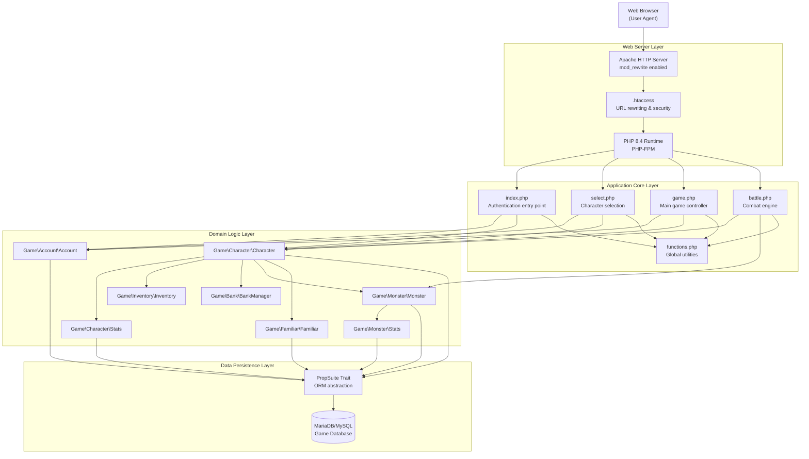
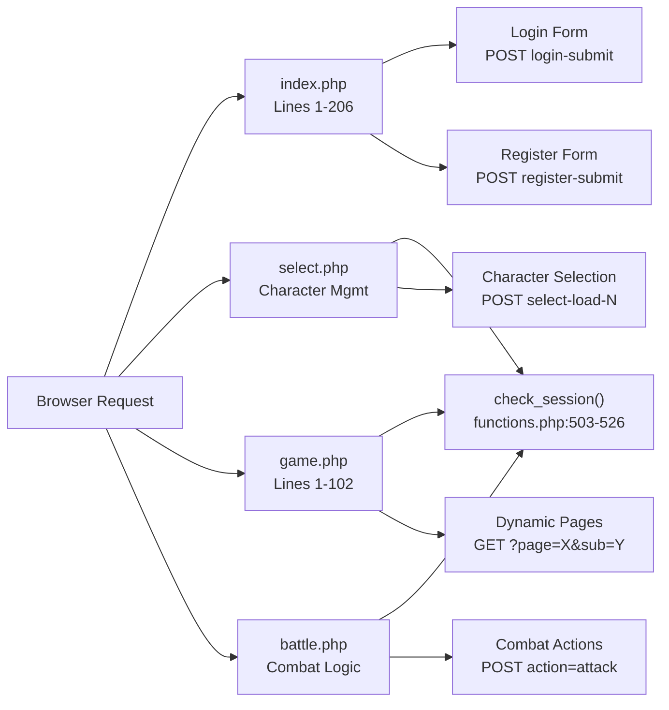
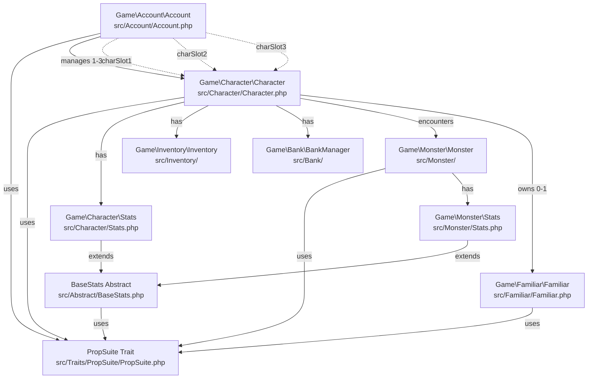
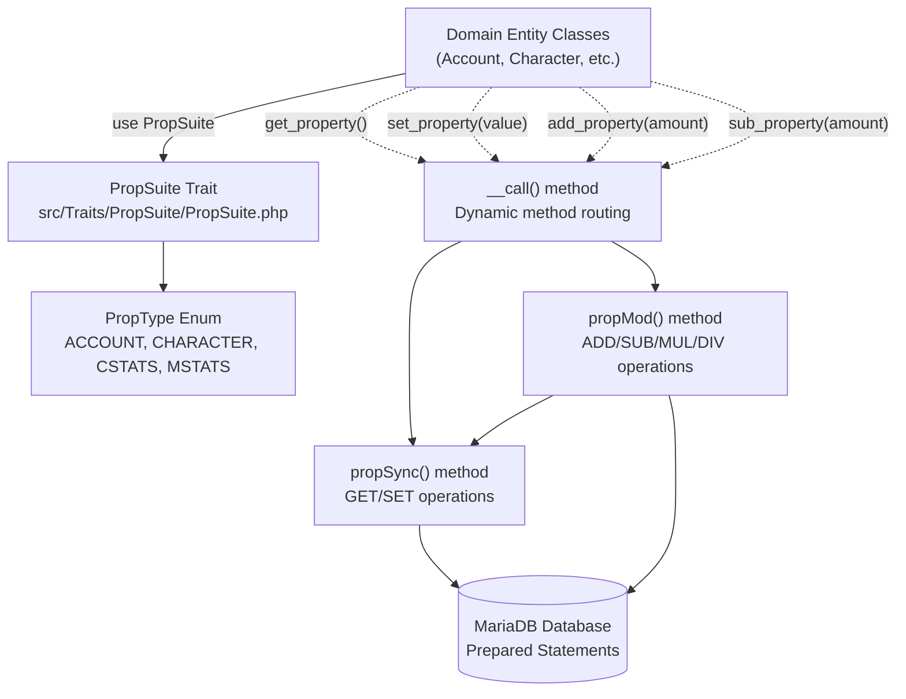
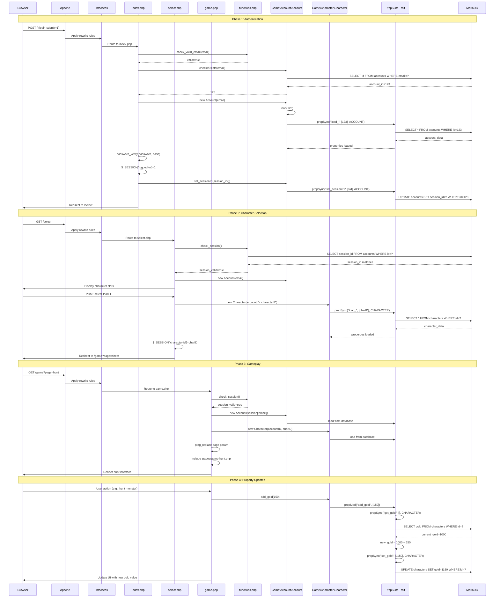

# System Architecture

<details>
<summary>Relevant source files</summary>

The following files were used as context for generating this wiki page:

- [.htaccess](.htaccess)
- [functions.php](functions.php)
- [game.php](game.php)
- [index.php](index.php)
- [src/Account/Account.php](src/Account/Account.php)
- [src/Character/Character.php](src/Character/Character.php)
- [src/Character/Stats.php](src/Character/Stats.php)
- [src/Familiar/Familiar.php](src/Familiar/Familiar.php)
- [src/Monster/Stats.php](src/Monster/Stats.php)

</details>


## Purpose and Scope

This document describes the overall system architecture of Legend of Aetheria, detailing how the application is structured into distinct layers, how these layers interact, and the key architectural patterns used throughout the codebase. It covers the web server configuration, application entry points, domain logic organization, and data persistence mechanisms.

For information about specific technologies and versions used, see [Technology Stack](#1.2). For detailed database schema and ORM implementation, see [Database & Data Layer](#6).

## Architectural Overview

Legend of Aetheria follows a traditional multi-tier web application architecture with clear separation of concerns across four primary layers:

**High-Level Architecture**



Sources: [game.php:1-102](), [index.php:1-206](), [.htaccess:1-22](), [src/Character/Character.php:1-228](), [src/Account/Account.php:1-220]()

## Web Server Layer

The web server layer handles HTTP requests, URL rewriting, and security policies before routing to PHP controllers.

### Apache Configuration

Apache serves as the HTTP server with `mod_rewrite` enabled for clean URL routing. The virtual host configuration is generated during installation by the AutoInstaller and points the document root to the application directory.

### URL Rewriting and Security

The [.htaccess:1-22]() file implements several critical functions:

**URL Rewriting Rules**
- Rewrites requests to `.php` files transparently ([.htaccess:6-10]())
- Returns 404 for direct `.php` file access to hide implementation details ([.htaccess:12-14]())
- Forces HTTPS redirection for all requests ([.htaccess:20-21]())

**File Access Protection**
- Blocks access to sensitive files: `.env`, `.ready`, `.template`, `.pl`, `.ini`, `.log`, `.sh` ([.htaccess:2-4]())
- Prevents direct access to `.txt` files ([.htaccess:16-18]())

**Error Handling**
- Custom 404 error page routing ([.htaccess:1]())

This configuration ensures that URLs like `/game` are internally routed to `/game.php` while preventing direct access to `/game.php`, maintaining clean URLs and hiding the underlying PHP implementation.

Sources: [.htaccess:1-22]()

## Application Core Layer

The application core consists of four primary entry points that handle different phases of user interaction.

### Entry Point Controllers



Sources: [index.php:1-206](), [game.php:1-102](), [functions.php:503-526]()

#### index.php - Authentication Entry Point

Handles user authentication and registration ([index.php:1-206]()):

- **Login Processing** ([index.php:12-81]()): 
  - Rate limiting (max 5 attempts per 15 minutes) ([index.php:17-32]())
  - Email validation via `check_valid_email()` ([index.php:34-38]())
  - Password verification using `password_verify()` ([index.php:46]())
  - Session initialization and redirect to `/select` ([index.php:50-61]())

- **Registration Processing** ([index.php:82-175]()): 
  - Character creation with avatar and race selection ([index.php:96-99]())
  - Attribute point allocation validation ([index.php:113]())
  - Abuse detection via `check_abuse()` for multi-account creation ([index.php:122-125]())
  - Bcrypt password hashing ([index.php:116]())
  - Email verification code generation ([index.php:89-93]())

#### select.php - Character Management

Controls character slot selection and management. Allows users to choose from up to three character slots per account (`charSlot1`, `charSlot2`, `charSlot3`).

#### game.php - Main Game Controller

The primary game interface controller ([game.php:1-102]()):

- Loads account and character data ([game.php:22-23]())
- Initializes game systems (System, LoAllama AI) ([game.php:18-20]())
- Checks privilege level and blocks unverified accounts ([game.php:54-59]())
- Implements dynamic page routing via `$_GET['page']` parameter ([game.php:61-83]())
- Sanitizes page names with regex pattern `/[^a-z-]+/` ([game.php:66]())
- Includes page-specific PHP files from `pages/` directory ([game.php:67-81]())
- Supports nested routing via `$_GET['sub']` parameter ([game.php:69-74]())

#### battle.php - Combat Engine

Processes turn-based combat encounters between characters and monsters. Handles attack actions, damage calculations, and battle state updates.

### Global Utility Functions

The [functions.php:1-615]() file provides system-wide utility functions:

**Session Management**
- `check_session()` - Validates session integrity ([functions.php:503-526]())
- `gen_csrf_token()` - Generates CSRF protection tokens ([functions.php:535-540]())
- `check_csrf()` - Validates CSRF tokens ([functions.php:550-559]())

**Security Utilities**
- `check_valid_email()` - Email format validation ([functions.php:251-259]())
- `check_abuse()` - Multi-signup and tampering detection ([functions.php:272-298]())
- `ban_user()` - Account banning mechanism ([functions.php:408-421]())

**Data Helpers**
- `get_mysql_datetime()` - MySQL timestamp generation ([functions.php:16-24]())
- `get_globals()` / `set_globals()` - Global configuration access ([functions.php:51-75]())
- `getNextTableID()` - Auto-increment ID retrieval ([functions.php:365-379]())

**Validation Helpers**
- `validate_race()` - Race selection validation ([functions.php:431-444]())
- `validate_avatar()` - Avatar image validation ([functions.php:454-473]())

Sources: [functions.php:1-615]()

## Domain Logic Layer

The domain logic layer contains entity classes that model the game's business logic. All domain entities utilize the `PropSuite` trait for database persistence.

### Core Domain Entities



Sources: [src/Account/Account.php:1-220](), [src/Character/Character.php:1-228](), [src/Character/Stats.php:1-129](), [src/Monster/Stats.php:1-68](), [src/Familiar/Familiar.php:1-372]()

### Account Entity

The `Game\Account\Account` class ([src/Account/Account.php:1-220]()) represents a user account with authentication and privilege management:

**Key Properties**
- `$id`, `$email`, `$password` - Authentication credentials ([src/Account/Account.php:78-84]())
- `$privileges` - Enum-based privilege level (UNVERIFIED, USER, MODERATOR, ADMINISTRATOR) ([src/Account/Account.php:96]())
- `$charSlot1`, `$charSlot2`, `$charSlot3` - Character slot references ([src/Account/Account.php:144-150]())
- `$sessionID` - Current session identifier for session validation ([src/Account/Account.php:114]())
- `$banned`, `$muted` - Moderation flags ([src/Account/Account.php:123-126]())

**Key Methods**
- `checkIfExists($email)` - Static method to verify account existence ([src/Account/Account.php:209-219]())
- `__call($method, $params)` - Magic method routing to PropSuite ([src/Account/Account.php:184-201]())

### Character Entity

The `Game\Character\Character` class ([src/Character/Character.php:1-228]()) represents a player character with all game progression data:

**Key Properties**
- `$id`, `$accountID` - Identity and ownership ([src/Character/Character.php:84-87]())
- `$level`, `$exp`, `$gold`, `$spindels` - Progression and currency ([src/Character/Character.php:90-102]())
- `$location`, `$x`, `$y`, `$floor` - Position data ([src/Character/Character.php:92-96-111]())
- `$name`, `$avatar`, `$race` - Display attributes ([src/Character/Character.php:123-135]())
- `$stats` - Character\Stats instance ([src/Character/Character.php:141]())
- `$inventory`, `$bank` - Associated systems ([src/Character/Character.php:144-147]())
- `$monster` - Current combat encounter ([src/Character/Character.php:138]())

**Key Methods**
- `__construct($accountID, $characterID)` - Constructor loads existing character if ID provided ([src/Character/Character.php:157-167]())
- `getAccountID($characterID)` - Static method to lookup account ownership ([src/Character/Character.php:217-227]())
- `__call($method, $params)` - Routes get/set/add/sub operations to PropSuite ([src/Character/Character.php:179-195]())

### Stats Subsystems

**Character\Stats** ([src/Character/Stats.php:1-129]())
Extends `BaseStats` abstract class and manages character combat attributes:
- Core stats: `$hp`, `$mp`, `$ep` with max values ([src/Character/Stats.php:84-90]())
- Combat attributes: `$str`, `$def`, `$int` (inherited from BaseStats)
- Extended attributes: `$luck`, `$chsm`, `$dext`, `$rgen` ([src/Character/Stats.php:93-102]())
- Uses `PropType::CSTATS` for database synchronization ([src/Character/Stats.php:125-127]())

**Monster\Stats** ([src/Monster/Stats.php:1-68]())
Also extends `BaseStats` but includes reward properties:
- `$expAwarded`, `$goldAwarded` - Combat rewards ([src/Monster/Stats.php:51-54]())
- Uses `PropType::MSTATS` for database synchronization ([src/Monster/Stats.php:65-67]())

### Familiar Entity

The `Game\Familiar\Familiar` class ([src/Familiar/Familiar.php:1-372]()) implements the pet companion system:

**Key Properties**
- `$characterID` - Owner reference ([src/Familiar/Familiar.php:46]())
- `$level`, `$experience`, `$nextLevel` - Progression ([src/Familiar/Familiar.php:49-55]())
- `$name`, `$avatar` - Display attributes ([src/Familiar/Familiar.php:58-61]())
- `$stats` - Familiar combat stats ([src/Familiar/Familiar.php:64]())

**Key Methods**
- `registerFamiliar()` - Creates new database record ([src/Familiar/Familiar.php:82-100]())
- `generateEgg($familiar, $rarity_roll)` - Egg generation with rarity system ([src/Familiar/Familiar.php:263-282]())
- `getRarityColor($rarity)` - Maps ObjectRarity enum to hex colors ([src/Familiar/Familiar.php:210-253]())

Sources: [src/Account/Account.php:1-220](), [src/Character/Character.php:1-228](), [src/Character/Stats.php:1-129](), [src/Monster/Stats.php:1-68](), [src/Familiar/Familiar.php:1-372]()

## Data Persistence Layer

The data persistence layer uses the `PropSuite` trait to provide ORM-like functionality for all domain entities.

### PropSuite Architecture



Sources: [src/Character/Character.php:179-195](), [src/Account/Account.php:184-201]()

### Dynamic Property Access Pattern

All domain entities implement a `__call()` magic method that intercepts method calls and routes them based on naming conventions:

**Account Example** ([src/Account/Account.php:184-201]()):
```php
public function __call($method, $params) {
    if (preg_match('/^(add|sub|exp|mod|mul|div)_/', $method)) {
        return $this->propMod($method, $params);
    }
    if (preg_match('/^(propDump|propRestore)$/', $method, $matches)) {
        $func = $matches[1];
        return $this->$func($params[0] ?? null);
    }
    return $this->propSync($method, $params, PropType::ACCOUNT);
}
```

**Character Example** ([src/Character/Character.php:179-195]()):
```php
public function __call($method, $params) {
    if (preg_match('/^(add|sub|exp|mod|mul|div)_/', $method)) {
        return $this->propMod($method, $params);
    } elseif (preg_match('/^(propDump|propRestore)$/', $method, $matches)) {
        $func = $matches[1];
        return $this->$func($params[0] ?? null);
    } else {
        return $this->propSync($method, $params, PropType::CHARACTER);
    }
}
```

This pattern enables:
- **Getters**: `$account->get_email()` returns `$this->email`
- **Setters**: `$character->set_level(5)` updates `$this->level` and persists to database
- **Mathematical Operations**: `$character->add_gold(100)` increments gold and persists
- **Type Safety**: Each entity specifies its `PropType` enum value for correct table routing

### PropType Enumeration

The `PropType` enum defines the database table mapping for each entity type:
- `PropType::ACCOUNT` - Routes to accounts table
- `PropType::CHARACTER` - Routes to characters table  
- `PropType::CSTATS` - Routes to character stats (embedded in characters table)
- `PropType::MSTATS` - Routes to monster stats table

Each Stats class overrides `getType()` to return its specific PropType ([src/Character/Stats.php:125-127](), [src/Monster/Stats.php:65-67]()).

Sources: [src/Account/Account.php:184-201](), [src/Character/Character.php:179-195](), [src/Character/Stats.php:125-127](), [src/Monster/Stats.php:65-67]()

## Request Flow Architecture

The following sequence diagram illustrates a complete user request flow from authentication through gameplay:

**Complete Request Flow - Authentication to Gameplay**



Sources: [index.php:12-81](), [game.php:1-102](), [functions.php:503-526](), [src/Account/Account.php:184-201](), [src/Character/Character.php:179-195]()

### Request Flow Phases

**Phase 1: Authentication** ([index.php:12-81]())
1. Browser submits login form with credentials
2. Apache routes through `.htaccess` to `index.php`
3. Email validation via `check_valid_email()` ([functions.php:251-259]())
4. Account existence check via `Account::checkIfExists()` ([src/Account/Account.php:209-219]())
5. Password verification using `password_verify()` ([index.php:46]())
6. Session variables initialized ([index.php:50-55]())
7. Session ID persisted to database ([index.php:57]())

**Phase 2: Character Selection**
1. User redirected to `/select` which routes to `select.php`
2. Session validation via `check_session()` ([functions.php:503-526]())
3. Character data loaded via PropSuite ([src/Character/Character.php:157-167]())
4. Character ID stored in session
5. Redirect to main game interface

**Phase 3: Gameplay** ([game.php:1-102]())
1. Request to `/game` with page parameter
2. Session validation confirms logged-in state
3. Account and Character objects instantiated ([game.php:22-23]())
4. Page parameter sanitized with regex ([game.php:66]())
5. Dynamic page inclusion from `pages/` directory ([game.php:77-80]())

**Phase 4: Property Updates**
1. User actions trigger property modifications
2. `add_*()` or `sub_*()` methods called on entities
3. PropSuite's `propMod()` reads current value from database
4. Performs arithmetic operation
5. Calls `propSync()` with `set_*()` to persist new value
6. Database updated with prepared statement

Sources: [index.php:1-206](), [game.php:1-102](), [functions.php:503-526](), [src/Account/Account.php:184-201](), [src/Character/Character.php:179-195]()

## Key Architectural Patterns

### Session-Based State Management

Session state is managed through PHP's native `$_SESSION` superglobal with custom validation:

**Session Variables**
- `$_SESSION['logged-in']` - Authentication flag ([index.php:50]())
- `$_SESSION['email']` - User email ([index.php:51]())
- `$_SESSION['account-id']` - Account identifier ([index.php:52]())
- `$_SESSION['character-id']` - Active character ([game.php:23]())
- `$_SESSION['csrf-token']` - CSRF protection token

**Session Validation** ([functions.php:503-526]())

The `check_session()` function validates:
1. Presence of `$_SESSION['logged-in']` flag ([functions.php:506-508]())
2. Database lookup of stored session ID ([functions.php:510-516]())
3. Comparison of database session ID with current `session_id()` ([functions.php:520-523]())

This dual-verification prevents session hijacking by ensuring the session ID matches both the browser cookie and the database record.

### Dynamic Page Routing Pattern

The game controller implements a page routing system that dynamically includes PHP files based on sanitized GET parameters:

**Routing Logic** ([game.php:61-83]())
```php
if (isset($_GET['page'])) {
    $requested_page = preg_replace('/[^a-z-]+/', '', $_GET['page']);
    $page_string = "pages/";
    
    if (isset($_GET['sub'])) {
        $requested_sub = preg_replace('/[^a-z-]+/', '', $_GET['sub']);
        $page_string .= "$requested_sub/$requested_page.php";
    } else {
        $page_string .= "pages/character/sheet.php";
    }
    
    if (file_exists($page_string)) {
        include "$page_string";
    } else {
        include 'pages/character/sheet.php';
    }
}
```

This pattern:
- Sanitizes input with regex allowing only lowercase letters and hyphens
- Supports nested routing via `sub` parameter
- Falls back to character sheet if file not found
- Verifies file existence before inclusion to prevent path traversal

**URL Examples**
- `/game?page=hunt` → `pages/hunt.php`
- `/game?page=sheet&sub=character` → `pages/character/sheet.php`
- `/game?page=invalid` → `pages/character/sheet.php` (fallback)

### PropSuite ORM Pattern

The PropSuite trait implements a simplified ORM pattern through method interception:

**Method Naming Conventions**
- `get_propertyName()` - Reads `$this->propertyName` ([src/Account/Account.php:19-45]())
- `set_propertyName($value)` - Writes to `$this->propertyName` and syncs to database ([src/Account/Account.php:46-66]())
- `add_propertyName($amount)` - Increments numeric property and persists ([src/Account/Account.php:68-73]())
- `sub_propertyName($amount)` - Decrements numeric property and persists

**Database Synchronization**
- Property names in camelCase map to snake_case database columns
- All SET operations automatically execute UPDATE queries with prepared statements
- Mathematical operations (add/sub) perform atomic read-modify-write sequences
- Each entity specifies its PropType enum for correct table routing

**Example Usage**
```php
$character = new Character($accountID, $characterID);
$currentGold = $character->get_gold();        // SELECT gold FROM characters
$character->set_level(5);                      // UPDATE characters SET level=5
$character->add_gold(100);                     // Read, calculate, UPDATE gold
```

This pattern eliminates the need for explicit repository classes while maintaining type safety and automatic persistence.

Sources: [src/Account/Account.php:184-201](), [src/Character/Character.php:179-195](), [game.php:61-83](), [functions.php:503-526]()