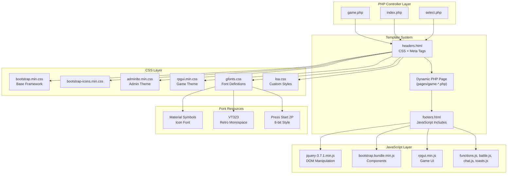
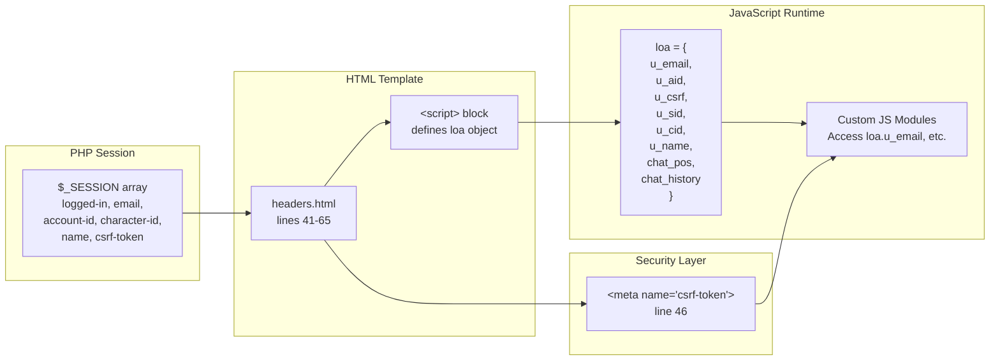
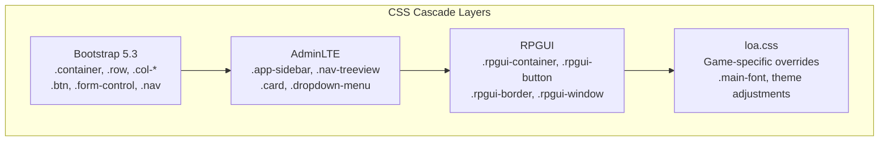
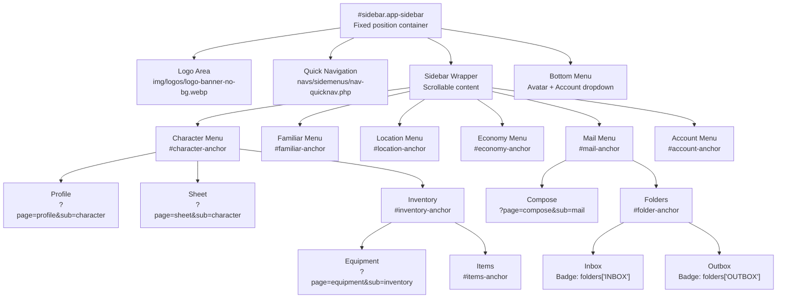
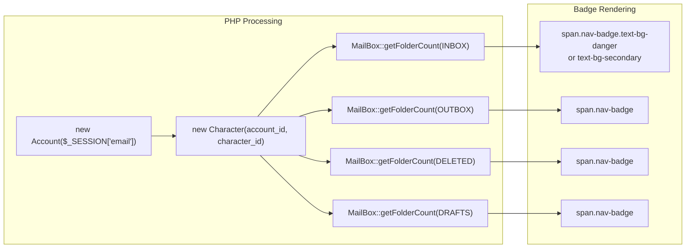
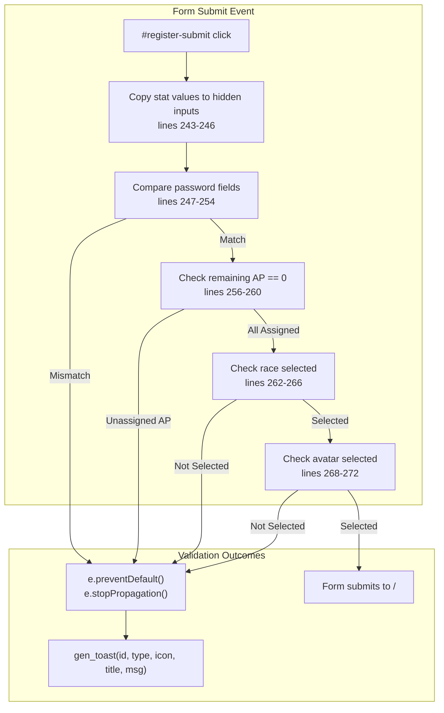
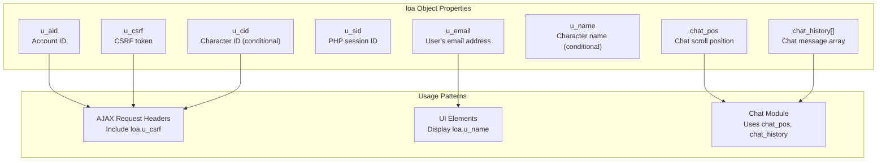
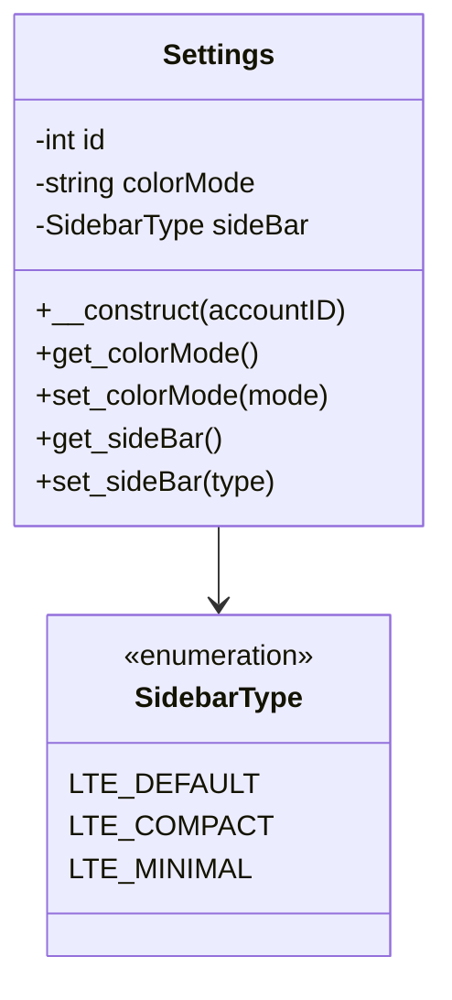
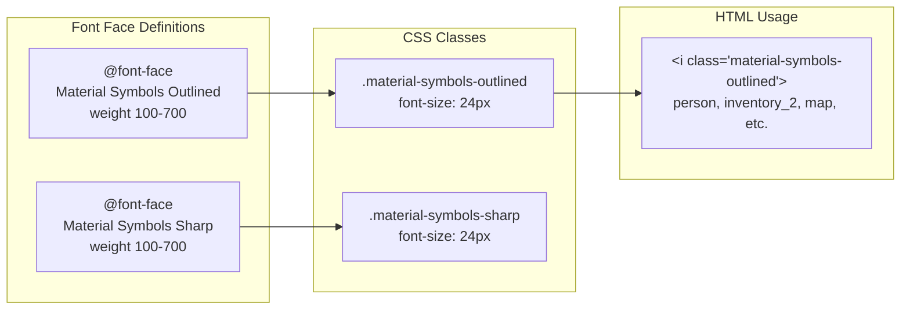

# Frontend & User Interface

<details>
<summary>Relevant source files</summary>

The following files were used as context for generating this wiki page:

- [css/gfonts.css](css/gfonts.css)
- [html/headers.html](html/headers.html)
- [js/functions.js](js/functions.js)
- [navs/nav-login.php](navs/nav-login.php)
- [navs/sidemenus/nav-side-default.php](navs/sidemenus/nav-side-default.php)
- [src/Account/Settings.php](src/Account/Settings.php)

</details>


This document describes the frontend architecture of Legend of Aetheria, including the asset loading pipeline, UI frameworks, navigation structure, client-side JavaScript functionality, and integration patterns between the browser and PHP backend. 

The frontend uses Bootstrap 5.3 as the base CSS framework, enhanced with AdminLTE for admin-style layouts, RPGUI for retro game aesthetics, and Material Symbols for iconography. jQuery 3.7.1 provides DOM manipulation, while custom JavaScript modules handle game-specific interactions. All assets are loaded through a centralized header/footer template system that ensures consistent resource inclusion across pages.

For details on individual frameworks, see [UI Frameworks](#7.1). For navigation implementation, see [Navigation System](#7.2). For JavaScript modules, see [Client-Side JavaScript](#7.3).

---

## Architecture Overview

The frontend architecture follows a layered template system where PHP controllers include standardized header and footer templates that inject CSS and JavaScript resources. Dynamic content is rendered server-side by PHP, then enhanced with client-side JavaScript for interactivity. Session state is bridged from PHP to JavaScript through a global `loa` object, enabling seamless client-server communication.

### Asset Loading Pipeline

All pages include [html/headers.html:1-65]() at the top and a corresponding footers template at the bottom. The headers file loads CSS frameworks in dependency order: Bootstrap first (base framework), then AdminLTE (admin theme), then RPGUI (game theme), then custom styles in `loa.css`. JavaScript libraries follow a similar pattern: Bootstrap and jQuery first, then custom modules.



**Sources:** [html/headers.html:1-65](), Diagram 6 from high-level architecture

The CSS loading order is critical: Bootstrap provides base utilities, AdminLTE adds admin panel styling, RPGUI overlays retro game aesthetics, and `loa.css` provides final overrides. This layering allows game-themed components to coexist with modern form controls.

| Resource | Purpose | Load Order |
|----------|---------|------------|
| `bootstrap.min.css` | Base CSS framework, grid system, utilities | 1 |
| `bootstrap-icons.min.css` | Icon library for UI elements | 2 |
| `gfonts.css` | Font-face definitions for VT323, Press Start 2P, Material Symbols | 3 |
| `loa.css` | Custom game-specific styles and overrides | 4 |
| `adminlte.min.css` | Admin panel theme for authenticated pages | 5 |
| `rpgui.min.css` | Retro RPG UI styling (borders, buttons, containers) | 6 |
| `overlayscrollbars.min.css` | Custom scrollbar styling | 7 |

**Sources:** [html/headers.html:21-30]()

### Session State Bridge

PHP session data is exposed to JavaScript through a global `loa` object defined in [html/headers.html:41-65](). This object contains user email, account ID, character ID, CSRF token, and session ID. Client-side scripts reference these values for AJAX requests and dynamic UI updates.



**Sources:** [html/headers.html:41-65]()

The CSRF token is included both as a meta tag for DOM access and in the `loa` object for JavaScript access. This dual inclusion supports both jQuery AJAX patterns and direct fetch() API calls.

---

## UI Framework Integration

Legend of Aetheria combines three distinct UI frameworks, each serving a specific purpose:

1. **Bootstrap 5.3** - Provides the foundational grid system, form controls, navigation components, and utility classes
2. **AdminLTE** - Supplies sidebar navigation structure, card components, and admin panel aesthetics for authenticated pages
3. **RPGUI** - Adds retro RPG styling with medieval borders, textured buttons, and game-themed containers

### Framework Layering Strategy

The frameworks are layered such that RPGUI styles override AdminLTE, which overrides Bootstrap base styles. Custom `loa.css` provides the final layer of overrides for game-specific requirements.



**Sources:** [html/headers.html:21-30](), [css/gfonts.css:1-225]()

### Component Mapping

Different page sections use different framework combinations:

| Page Section | Primary Framework | Secondary Framework | Purpose |
|--------------|------------------|---------------------|---------|
| Login/Registration | Bootstrap + RPGUI | None | Clean forms with retro styling |
| Sidebar Navigation | AdminLTE | Bootstrap | Collapsible tree menu structure |
| Game Content Area | Bootstrap + RPGUI | None | Responsive grid with game aesthetics |
| Combat Interface | RPGUI | Bootstrap | Full retro game experience |
| Admin Panel | AdminLTE | Bootstrap | Professional admin interface |

**Sources:** [navs/nav-login.php:1-427](), [navs/sidemenus/nav-side-default.php:1-650]()

---

## Navigation System Architecture

The navigation system uses AdminLTE's tree-view sidebar with Bootstrap's collapse functionality. Menu items are organized hierarchically with dynamic active state management and badge notifications.

### Sidebar Structure

The sidebar navigation is defined in [navs/sidemenus/nav-side-default.php:32-601]() and consists of a fixed-position sidebar with scrollable content area. The structure uses nested `<ul>` and `<li>` elements with specific classes for tree-view behavior:

- `nav-item` - Individual menu items
- `menu-open` - Expanded parent items
- `nav-link` - Clickable link elements
- `nav-treeview` - Nested submenu containers
- `active` - Currently selected page



**Sources:** [navs/sidemenus/nav-side-default.php:32-601]()

### Active State Management

Active menu items are determined by comparing URL parameters `$_GET['page']` and `$_GET['sub']` against each link's target. The active class is applied server-side during PHP rendering:

```php
// Example from nav-side-default.php line 57
<?php echo ($currentPage === 'profile' && $currentSub === 'character') ? 'active' : ''; ?>
```

Client-side JavaScript in [navs/sidemenus/nav-side-default.php:604-640]() scrolls the active item into view on page load and manages the sidebar collapse state using a `MutationObserver` to show/hide a sidebar sliver when collapsed.

**Sources:** [navs/sidemenus/nav-side-default.php:27-30](), [navs/sidemenus/nav-side-default.php:604-640]()

### Badge Notifications

Badge counters display unread counts for mail folders and friend requests. These are calculated server-side using `MailBox::getFolderCount()` and stored in the `$folders` array:



**Sources:** [navs/sidemenus/nav-side-default.php:12-23](), [navs/sidemenus/nav-side-default.php:386-427]()

Badges use `text-bg-danger` for non-zero counts and `text-bg-secondary` for zero counts, providing visual distinction between active and empty folders.

---

## Form Handling and Validation

Forms use a combination of HTML5 validation attributes (`required`), Bootstrap form classes (`.form-control`, `.form-floating`), and custom JavaScript validation functions. The registration form demonstrates all validation patterns.

### Registration Form Validation

The registration form in [navs/nav-login.php:69-276]() implements multi-stage validation:

1. **HTML5 Validation** - `required` attributes on inputs
2. **Password Confirmation** - JavaScript comparison before submit
3. **Attribute Point Allocation** - Custom `stat_adjust()` function
4. **Race/Avatar Selection** - Ensures dropdowns are not at default index
5. **Toast Notifications** - Visual feedback using `gen_toast()`



**Sources:** [navs/nav-login.php:242-274]()

### Attribute Point Allocation

The `stat_adjust()` function in [js/functions.js:14-43]() manages the allocation of attribute points during character creation. It maintains a pool of 10 available points that can be distributed among Strength, Defense, and Intelligence stats:

**Sources:** [js/functions.js:14-43](), [navs/nav-login.php:209-230]()

### Password Toggle Functionality

Password fields include a "Show/Hide" toggle button that switches the input type between `password` and `text`. This is implemented with a data attribute selector `[data-loa=pw_toggle]` and event listener:

```javascript
// From nav-login.php lines 413-426
document.querySelectorAll("[data-loa=pw_toggle]").forEach((e) => {
    e.addEventListener("click", (ev) => {
        var cur_ele_textbox = ev.target.previousElementSibling;
        if (cur_ele_textbox.type == 'password') {
            ev.target.textContent = 'Hide';
            cur_ele_textbox.type = 'text';
        } else {
            ev.target.textContent = 'Show';
            cur_ele_textbox.type = 'password';
        }
    });
});
```

**Sources:** [navs/nav-login.php:413-426]()

---

## Client-Side State Management

Client-side state is managed through a combination of the global `loa` object, browser sessionStorage/localStorage, and DOM manipulation. The `loa` object serves as the primary bridge between PHP session state and JavaScript runtime.

### Global `loa` Object Structure



**Sources:** [html/headers.html:49-64]()

The `loa` object is conditionally populated: `u_cid` and `u_name` are only included when `$_SESSION['character-id']` is set, allowing the same header template to work for both logged-in and logged-out states.

### Menu Collapse State

Sidebar menu expansion state is managed through CSS classes and JavaScript helper functions in [js/functions.js:63-78]():

| Function | Purpose | Implementation |
|----------|---------|----------------|
| `collapse_all()` | Closes all menu sections | Removes `.menu-open` class, sets `display: none` |
| `expand_all()` | Opens all menu sections | Adds `.menu-open` class, clears display style |

**Sources:** [js/functions.js:63-78]()

The sidebar collapse state is also tracked at the body level with `.sidebar-collapse` and `.sidebar-open` classes. A `MutationObserver` in [navs/sidemenus/nav-side-default.php:620-638]() watches for changes to the body class and shows/hides a sidebar sliver element accordingly.

---

## Theme and Appearance Settings

User appearance preferences are stored in the `Settings` class and synchronized with the database. The `Settings` class in [src/Account/Settings.php:27-76]() uses the PropSuite trait for automatic persistence.

### Theme Properties



**Sources:** [src/Account/Settings.php:27-76]()

The `colorMode` property accepts values like `'dark'` or `'light'`, which are applied to the page through `data-bs-theme` attributes. The `sideBar` property uses the `SidebarType` enum to control sidebar layout variations.

Theme switching is handled client-side by the `set_theme()` function in [js/functions.js:58-61]():

```javascript
function set_theme(theme) {
    var hidden_el = document.getElementById("profile-theme");
    hidden_el.value = theme;
}
```

This function updates a hidden form field that gets submitted to persist the theme preference.

**Sources:** [js/functions.js:58-61](), [src/Account/Settings.php:34-47]()

---

## Asset and Icon Systems

### Material Symbols Integration

Material Symbols provide iconography throughout the application. The font is loaded through [css/gfonts.css:141-178]() with two variants: Outlined and Sharp.



**Sources:** [css/gfonts.css:141-178](), [navs/sidemenus/nav-side-default.php:49-59]()

Icons are inserted using semantic HTML `<i>` elements with text content matching the Material Symbol name (e.g., `<i class="material-symbols-outlined">person</i>`). This approach provides accessibility and allows dynamic icon changes.

### Retro Gaming Fonts

The application uses two primary gaming fonts for aesthetic consistency:

1. **VT323** - A monospace font mimicking vintage terminal displays, used for general game text
2. **Press Start 2P** - An 8-bit arcade-style font for headers and emphasis

These fonts are defined in [css/gfonts.css:30-83]() with multiple unicode range subsets for broad language support. The `.main-font` class applies VT323 with 32px size:

```css
.main-font {
    font-family: "VT323", monospace;
    font-weight: 400;
    font-style: normal;
    font-size: 32px;
}
```

**Sources:** [css/gfonts.css:219-224](), [css/gfonts.css:30-83]()

---

## Summary

The frontend architecture of Legend of Aetheria combines multiple CSS frameworks in a layered cascade, with Bootstrap providing the foundation, AdminLTE adding admin panel structure, and RPGUI contributing retro game aesthetics. Asset loading follows a strict order through centralized header/footer templates, ensuring consistent resource availability across all pages.

Navigation uses AdminLTE's tree-view sidebar with server-side active state detection and client-side scroll management. Forms implement multi-stage validation with HTML5 attributes, JavaScript checks, and toast notifications for user feedback. Client-side state is bridged from PHP sessions through the global `loa` object, enabling seamless AJAX communication and dynamic UI updates.

Theme preferences are persisted through the `Settings` class, while Material Symbols and retro gaming fonts (VT323, Press Start 2P) provide consistent iconography and typography. The entire frontend is designed to support both authenticated and unauthenticated states with conditional rendering based on session data.

**Sources:** All files referenced throughout document, particularly [html/headers.html:1-65](), [navs/sidemenus/nav-side-default.php:1-650](), [navs/nav-login.php:1-427](), [js/functions.js:1-78](), [css/gfonts.css:1-225](), [src/Account/Settings.php:1-76]()