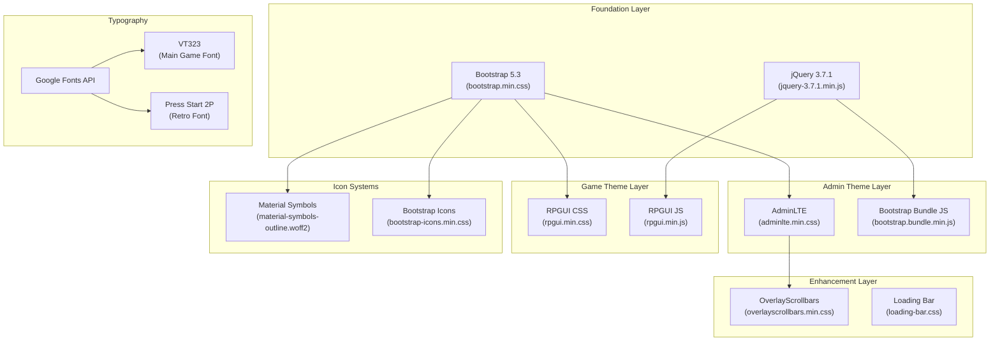
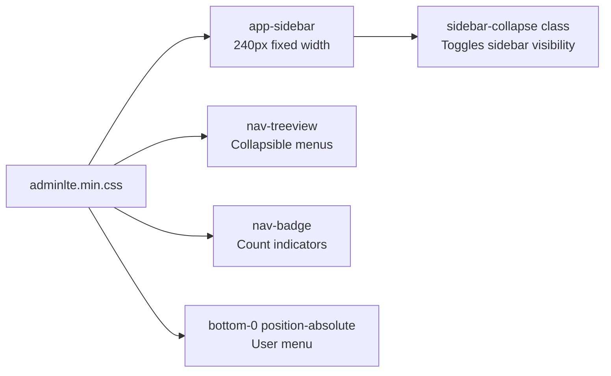
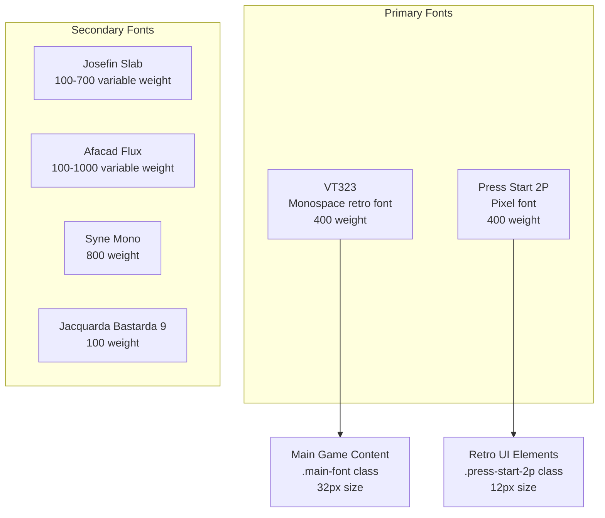
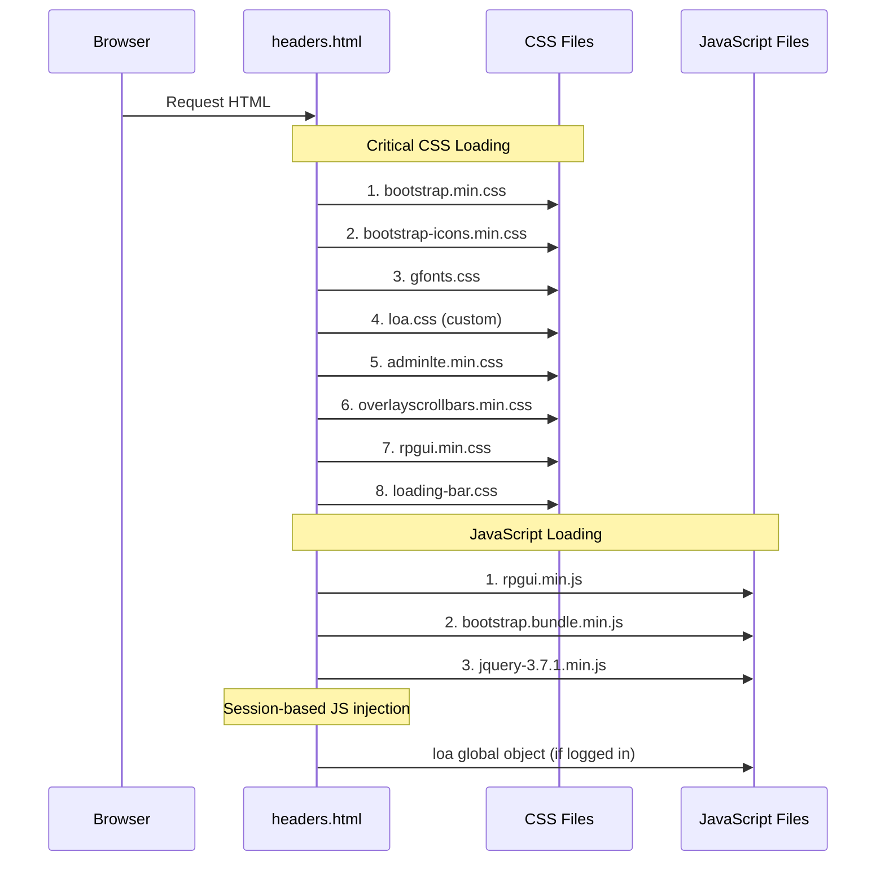
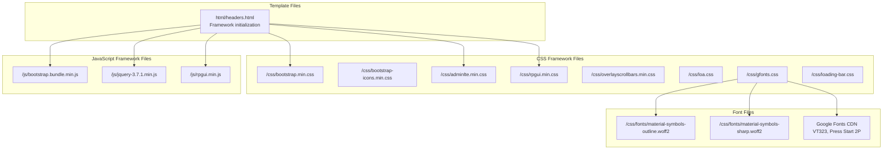

# UI Frameworks

<details>
<summary>Relevant source files</summary>

The following files were used as context for generating this wiki page:

- [css/gfonts.css](css/gfonts.css)
- [html/headers.html](html/headers.html)
- [navs/sidemenus/nav-side-default.php](navs/sidemenus/nav-side-default.php)
- [src/Account/Settings.php](src/Account/Settings.php)

</details>


## Purpose and Scope

This document describes the UI frameworks and libraries used in Legend of Aetheria's frontend layer. It covers CSS frameworks (Bootstrap, AdminLTE, RPGUI), JavaScript libraries (jQuery), icon systems (Material Symbols, Bootstrap Icons), and typography (Google Fonts). For information about client-side JavaScript functionality, see [Client-Side JavaScript](#7.3). For navigation system implementation, see [Navigation System](#7.2).

---

## Framework Stack Overview

Legend of Aetheria uses a layered approach to UI frameworks, combining multiple specialized libraries to achieve both functional admin interfaces and game-themed visual elements.

### Framework Hierarchy Diagram



**Sources:** [html/headers.html:1-65]()

---

## Core CSS Frameworks

### Bootstrap 5.3

Bootstrap serves as the foundational CSS framework, providing the grid system, utility classes, and component base.

| Feature | File | Purpose |
|---------|------|---------|
| Core CSS | `bootstrap.min.css` | Grid system, utilities, base components |
| JavaScript Bundle | `bootstrap.bundle.min.js` | Interactive components (modals, dropdowns, tooltips) |
| Icons | `bootstrap-icons.min.css` | Icon font for UI elements |

**Loading Order:**
```
1. bootstrap.min.css (line 21)
2. bootstrap-icons.min.css (line 22)
3. bootstrap.bundle.min.js (line 32)
```

Bootstrap classes are used extensively throughout the application for:
- Grid layout (`container`, `row`, `col-*`)
- Utility classes (`d-flex`, `align-items-center`, `text-center`)
- Component styling (`nav`, `nav-item`, `dropdown-menu`, `badge`)

**Sources:** [html/headers.html:21-22](), [html/headers.html:32](), [navs/sidemenus/nav-side-default.php:39-596]()

### AdminLTE

AdminLTE provides the admin dashboard theme, built on top of Bootstrap 5.3. It supplies the sidebar navigation system, layout structure, and professional admin panel aesthetics.

**Key Components:**
- **Sidebar System**: `app-sidebar` class with collapsible navigation
- **Brand Area**: Logo and branding display
- **Navigation Trees**: `nav-treeview` for hierarchical menus
- **Badges**: Message count indicators with `nav-badge` class



The sidebar uses AdminLTE's `data-lte-toggle="treeview"` attribute for automatic tree navigation behavior.

**Sources:** [html/headers.html:25](), [navs/sidemenus/nav-side-default.php:32-601]()

### RPGUI

RPGUI provides game-themed UI components with a retro RPG aesthetic, overlaying Bootstrap's functionality with fantasy-styled elements.

**Integration Pattern:**
```
1. rpgui.min.js loads first (line 29)
2. rpgui.min.css loads second (line 30)
3. Components auto-initialize via RPGUI.create()
```

RPGUI components coexist with Bootstrap components, allowing the application to mix professional admin interfaces with game-themed player-facing screens.

**Sources:** [html/headers.html:28-30]()

---

## JavaScript Libraries

### jQuery 3.7.1

jQuery serves as the core DOM manipulation library, required by both Bootstrap and RPGUI.

**Key Responsibilities:**
- DOM traversal and manipulation
- AJAX request handling
- Event delegation
- Animation support for custom game interactions

jQuery is loaded at [html/headers.html:33]() and made globally available before Bootstrap's JavaScript bundle.

**Sources:** [html/headers.html:33]()

### OverlayScrollbars

OverlayScrollbars provides custom scrollbar styling that overlays content instead of taking layout space.

**Configuration:**
- CSS: `overlayscrollbars.min.css` (line 26)
- Applied to sidebar navigation area for consistent scrolling behavior
- Height calculation: `calc(100vh - 180px)` for sidebar wrapper

**Sources:** [html/headers.html:26](), [navs/sidemenus/nav-side-default.php:43]()

---

## Icon Systems

### Material Symbols

Material Symbols is the primary icon system, providing two font variants:

| Variant | Font File | CSS Class | Weight Range |
|---------|-----------|-----------|--------------|
| Outlined | `material-symbols-outline.woff2` | `.material-symbols-outlined` | 100-700 |
| Sharp | `material-symbols-sharp.woff2` | `.material-symbols-sharp` | 100-700 |

**Font Configuration:**
```css
.material-symbols-outlined {
  font-family: 'Material Symbols Outlined';
  font-weight: 100 700 !important;
  font-size: 24px;
  line-height: 1;
  display: inline-block;
}
```

**Usage Pattern in Navigation:**
```html
<i class="nav-icon material-symbols-outlined">person</i>
<i class="nav-icon material-symbols-outlined">inventory_2</i>
<i class="nav-icon material-symbols-outlined">alternate_email</i>
```

Common icon names used throughout the application include: `person`, `inventory_2`, `raven`, `public`, `monitoring`, `alternate_email`, `skull`, `sentiment_satisfied`.

**Sources:** [css/gfonts.css:134-178](), [navs/sidemenus/nav-side-default.php:48-503]()

### Bootstrap Icons

Bootstrap Icons supplement Material Symbols for specific UI elements:
- Chevrons: `bi-chevron-right` for expandable menu indicators
- Status indicators: `bi-exclamation-square-fill` for warnings
- Additional utility icons not in Material Symbols set

**Sources:** [html/headers.html:22](), [navs/sidemenus/nav-side-default.php:51-627]()

---

## Typography System

### Google Fonts Integration

The application uses Google Fonts for retro gaming aesthetics. Font files are self-hosted and defined in `gfonts.css`.



### Font Loading Configuration

**VT323 (Main Font):**
```css
.main-font {
  font-family: "VT323", monospace;
  font-weight: 400;
  font-style: normal;
  font-size: 32px;
}
```

**Press Start 2P:**
```css
.press-start-2p {
  font-family: "Press Start 2P", serif;
  font-weight: 600;
  font-size: 12px;
  font-style: normal;
}
```

**Font Loading Strategy:**
- Self-hosted WOFF2 files for performance
- Multiple unicode ranges for subset loading (latin, latin-ext, cyrillic, greek)
- `font-display: swap` for improved perceived performance

**Sources:** [css/gfonts.css:1-225]()

---

## Framework Loading Order and Dependencies

### Asset Loading Sequence



### Dependency Chain

| Library | Dependencies | Load Order |
|---------|-------------|------------|
| Bootstrap CSS | None | First (line 21) |
| Bootstrap Icons | None | Second (line 22) |
| Google Fonts | None | Third (line 23) |
| Custom CSS (loa.css) | Bootstrap | Fourth (line 24) |
| AdminLTE | Bootstrap | Fifth (line 25) |
| OverlayScrollbars | None | Sixth (line 26) |
| RPGUI CSS | Bootstrap recommended | After AdminLTE (line 30) |
| RPGUI JS | jQuery | Before jQuery load (line 29) |
| Bootstrap JS Bundle | None (includes Popper.js) | After RPGUI (line 32) |
| jQuery | None | Last core library (line 33) |

**Note:** RPGUI JS loads before jQuery despite depending on it. This suggests RPGUI may use a lazy initialization pattern or jQuery is globally available through another mechanism.

**Sources:** [html/headers.html:21-36]()

---

## Session-Based Framework Configuration

### Dynamic JavaScript Injection

When a user is logged in, the framework injects a global `loa` JavaScript object containing session data:

```javascript
var loa = {
   u_email: "user@example.com",
     u_aid: "123",             // account ID
    u_csrf: "token123",         // CSRF token
     u_sid: "sess_id",          // session ID
     chat_pos: 0,
     chat_history: [],
};
```

If a character is selected, additional properties are injected:

```javascript
loa.u_cid = "456";              // character ID
loa.u_name = "CharacterName";   // character name
```

This pattern allows client-side JavaScript to access session context without additional API calls.

**Sources:** [html/headers.html:41-65]()

---

## Settings Integration

### Account-Level Framework Preferences

The `Settings` class manages user preferences for UI frameworks through the PropSuite trait:

**Settings Properties:**
- `colorMode` (string): Theme preference - `"light"` or `"dark"`
- `sideBar` (SidebarType enum): Sidebar layout preference

**SidebarType Enum Values:**
- `SidebarType::LTE_DEFAULT`: AdminLTE default sidebar

The color mode is applied via a `data-bs-theme` attribute on the sidebar element:

```html
<aside data-bs-theme="<?php echo $color_mode; ?>">
```

**Sources:** [src/Account/Settings.php:1-76](), [navs/sidemenus/nav-side-default.php:32]()

---

## Framework Integration Patterns

### Bootstrap + AdminLTE Pattern

AdminLTE extends Bootstrap classes with additional modifiers:

```html
<ul class="nav sidebar-menu flex-column flex-grow-1" 
    data-lte-toggle="treeview" 
    role="menu">
```

- `nav`: Bootstrap base class
- `sidebar-menu`: AdminLTE-specific class
- `flex-column`, `flex-grow-1`: Bootstrap utility classes
- `data-lte-toggle="treeview"`: AdminLTE behavior attribute

### Material Symbols + Bootstrap Icons Pattern

Icons are combined based on context:

```html
<!-- Material Symbols for main icons -->
<i class="nav-icon material-symbols-outlined">person</i>

<!-- Bootstrap Icons for UI indicators -->
<i class="ms-auto bi bi-chevron-right"></i>
```

This pattern uses Material Symbols for semantic icons (person, mail, inventory) and Bootstrap Icons for UI chrome (chevrons, carets, status indicators).

**Sources:** [navs/sidemenus/nav-side-default.php:48-503]()

---

## Content Security Policy

The framework loading is constrained by CSP headers defined in [html/headers.html:8-18]():

```html
<meta http-equiv="Content-Security-Policy"
      content="script-src 'self' 'unsafe-inline' 
               https://accounts.google.com/gsi/client 
               https://apis.google.com/js/platform.js;
               style-src 'self' 'unsafe-inline' 
               https://accounts.google.com 
               https://cdn.jsdelivr.net/npm/*;
               font-src 'self' 
               https://fonts.gstatic.com 
               https://fonts.gstatic.com/*;">
```

**Key Restrictions:**
- Scripts: Self-hosted + Google OAuth URLs
- Styles: Self-hosted + Google Accounts + jsDelivr CDN
- Fonts: Self-hosted + Google Fonts CDN
- `'unsafe-inline'` permitted for both scripts and styles (necessary for dynamic content generation)

**Sources:** [html/headers.html:8-18]()

---

## Framework File Locations



**Sources:** [html/headers.html:21-36](), [css/gfonts.css:134-146]()

---

## Summary Table

| Framework | Version | Type | Primary Purpose | Load Order |
|-----------|---------|------|-----------------|------------|
| Bootstrap | 5.3 | CSS + JS | Base UI framework, grid system | 1 (CSS), 7 (JS) |
| AdminLTE | Latest | CSS | Admin dashboard theme | 5 |
| RPGUI | Latest | CSS + JS | Game-themed UI components | 6 (JS), 7 (CSS) |
| jQuery | 3.7.1 | JS | DOM manipulation library | 8 |
| Bootstrap Icons | Latest | CSS + Font | Icon set for UI elements | 2 |
| Material Symbols | Latest | Font | Primary icon system | Via gfonts.css |
| VT323 | 400 | Font | Main game content font | Via gfonts.css |
| Press Start 2P | 400 | Font | Retro pixel font | Via gfonts.css |
| OverlayScrollbars | Latest | CSS + JS | Custom scrollbar styling | 6 |
| Loading.io Bar | Latest | CSS | Progress bar components | 8 |

**Sources:** [html/headers.html:1-65](), [css/gfonts.css:1-225]()