# Navigation System

<details>
<summary>Relevant source files</summary>

The following files were used as context for generating this wiki page:

- [css/gfonts.css](css/gfonts.css)
- [js/functions.js](js/functions.js)
- [navs/nav-login.php](navs/nav-login.php)
- [navs/sidemenus/nav-side-default.php](navs/sidemenus/nav-side-default.php)
- [src/Account/Settings.php](src/Account/Settings.php)

</details>


## Purpose and Scope

This document describes the navigation system that allows users to traverse the game interface. It covers the tab-based navigation on the login page, the hierarchical sidebar menu structure used during gameplay, active state management, menu expansion/collapse mechanics, and integration with URL routing. For information about the underlying UI frameworks, see [UI Frameworks](#7.1). For client-side JavaScript interactions, see [Client-Side JavaScript](#7.3).

---

## Overview of Navigation Components

Legend of Aetheria implements two distinct navigation systems depending on the application state:

| Navigation Type | File Location | Context | Features |
|----------------|---------------|---------|----------|
| Login Navigation | `navs/nav-login.php` | Pre-authentication | Tab-based interface with Login, Register, Contact, Status, Admin tabs |
| Sidebar Navigation | `navs/sidemenus/nav-side-default.php` | Post-authentication gameplay | Hierarchical collapsible menu with nested submenus |
| Quick Navigation | `navs/sidemenus/nav-quicknav.php` | During gameplay | Fast-access toolbar (referenced but not provided in files) |

The navigation state persists via the `Settings` class, which stores user preferences such as `colorMode` and `sideBar` type.

**Sources:** [navs/nav-login.php:1-427](), [navs/sidemenus/nav-side-default.php:1-650](), [src/Account/Settings.php:1-76]()

---

## Navigation Architecture

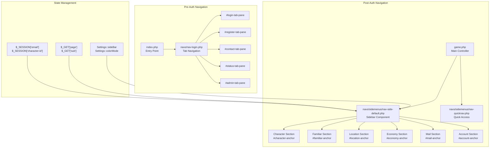

**Sources:** [navs/nav-login.php:1-31](), [navs/sidemenus/nav-side-default.php:12-13,27-29](), [src/Account/Settings.php:27-48]()

---

## Login Page Navigation

The login page uses Bootstrap 5.3 tabs to organize pre-authentication interfaces into five distinct sections.

### Tab Structure

The navigation is implemented using Bootstrap's `nav-tabs` component with `data-bs-toggle="tab"` attributes for tab switching:

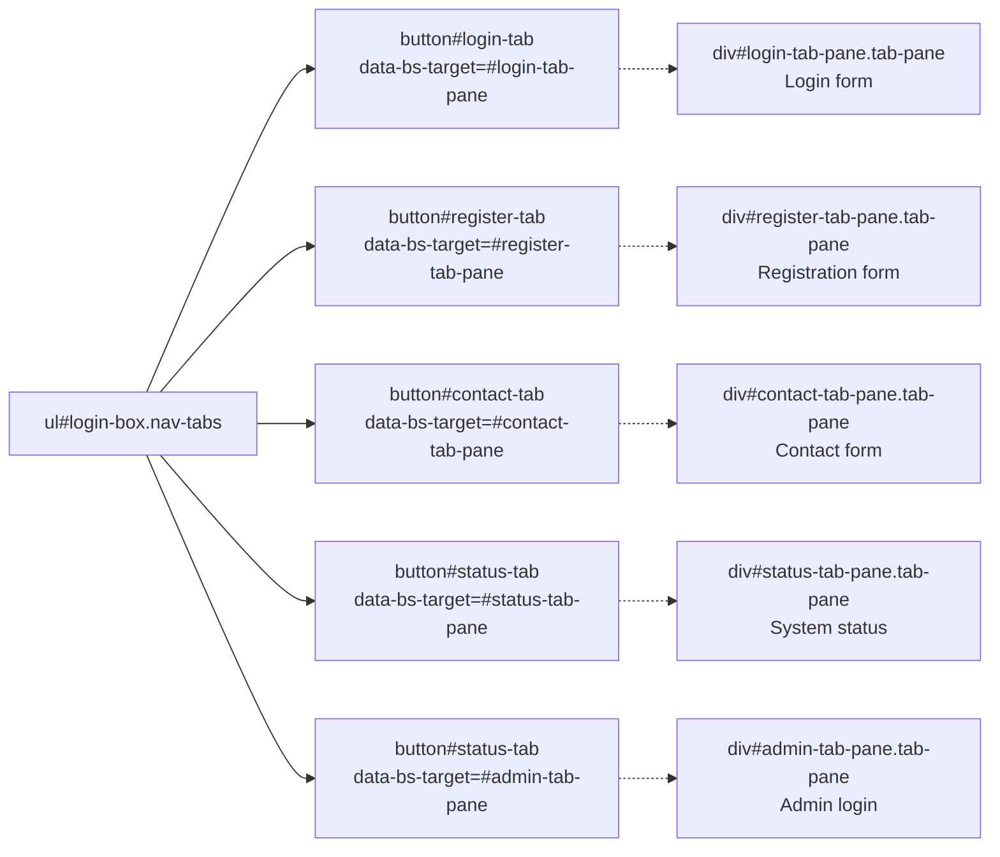

Each tab button includes:
- An icon from Bootstrap Icons (`bi bi-diamond-fill`, `bi bi-diamond`)
- An `onclick=tgl_active_signup(this)` handler for visual feedback
- ARIA attributes for accessibility (`role="tab"`, `aria-controls`, `aria-selected`)

The active tab has the class `nav-link active`, while inactive tabs have class `nav-link`. Content panes use `tab-pane fade show active` for the active pane and `tab-pane fade` for hidden panes.

**Sources:** [navs/nav-login.php:1-31,35-369]()

---

## Sidebar Navigation Structure

The main game navigation is a hierarchical sidebar implemented in `nav-side-default.php` with nested collapsible menus up to four levels deep.

### Top-Level Menu Structure

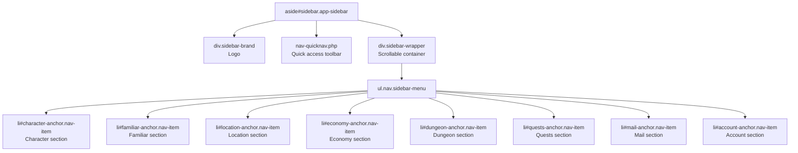

Each top-level menu item follows this pattern:
1. An anchor `<li>` with ID format `{section}-anchor` (e.g., `character-anchor`)
2. A clickable `<a class="nav-link">` that toggles expansion
3. An icon from Material Symbols Outlined font
4. A text label
5. A chevron indicator (`bi bi-chevron-right`)
6. A nested `<ul class="nav nav-treeview">` containing submenu items

**Sources:** [navs/sidemenus/nav-side-default.php:32-43,45-132]()

### Character Section Hierarchy

The Character section demonstrates the deepest nesting level (4 levels):

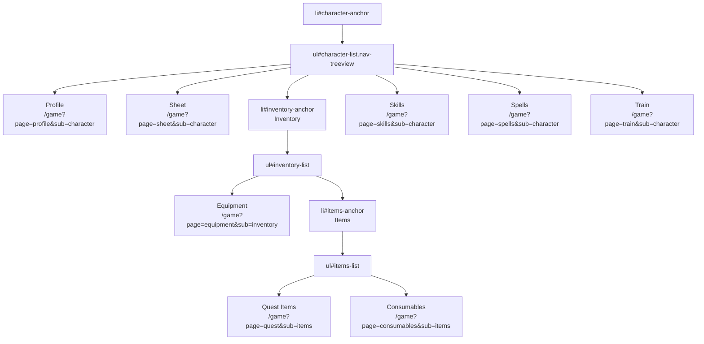

**Sources:** [navs/sidemenus/nav-side-default.php:46-131]()

### Mail Section with Dynamic Badges

The Mail section displays unread message counts using the `MailBox::getFolderCount()` method:

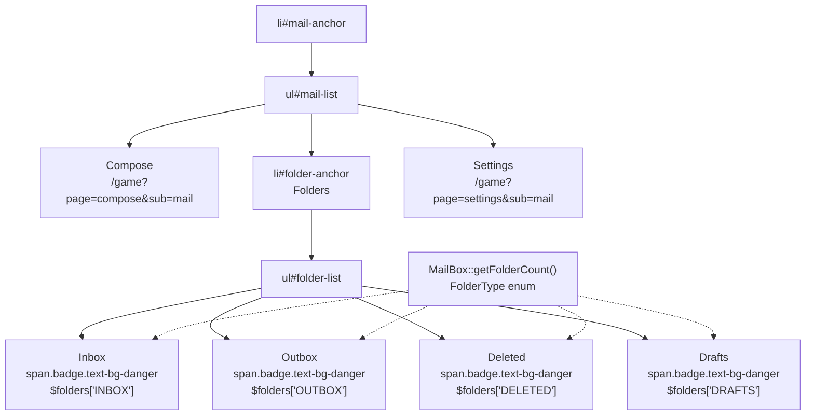

The folder counts are computed server-side at page load:

| Folder Type | Enum Value | Badge Class | Display Condition |
|------------|-----------|-------------|-------------------|
| INBOX | `FolderType::INBOX` | `text-bg-danger` | Count > 0 |
| OUTBOX | `FolderType::OUTBOX` | `text-bg-danger` | Count > 0 |
| DELETED | `FolderType::DELETED` | `text-bg-danger` | Count > 0 |
| DRAFTS | `FolderType::DRAFTS` | `text-bg-danger` | Count > 0 |
| (empty) | N/A | `text-bg-secondary` | Count = 0 |

**Sources:** [navs/sidemenus/nav-side-default.php:14-23,358-439]()

---

## Active State Management

The sidebar uses URL parameters `$_GET['page']` and `$_GET['sub']` to determine which menu items should be highlighted and expanded.

### Active State Detection

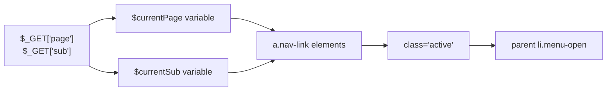

Each navigation link includes a PHP conditional that adds the `active` class when both `page` and `sub` parameters match:

```php
class="nav-link ... <?php echo ($currentPage === 'profile' && $currentSub === 'character') ? 'active' : ''; ?>"
```

The active link styling is defined in CSS:
- Bold font weight
- Color: `rgba(200, 255, 200, .7)`

**Sources:** [navs/sidemenus/nav-side-default.php:27-29,57-60,643-646]()

### Automatic Menu Expansion

A JavaScript `DOMContentLoaded` event handler automatically expands parent menus when a page loads:

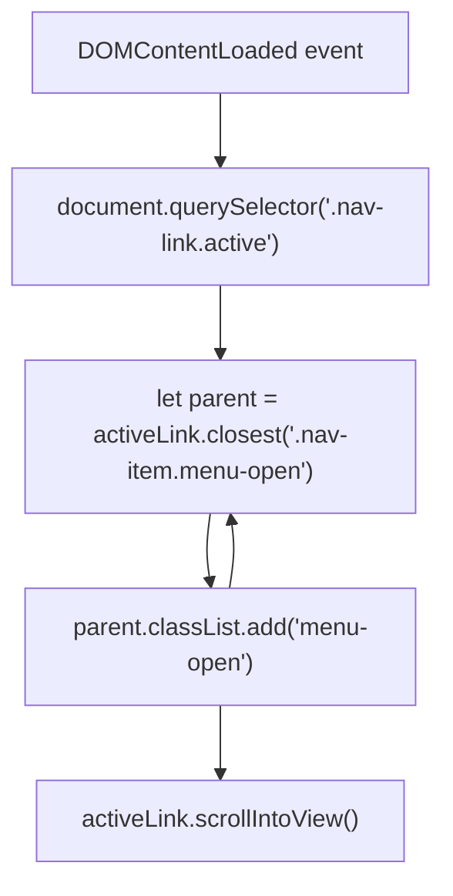

This algorithm:
1. Finds the active link (`.nav-link.active`)
2. Traverses up the DOM to find parent `.nav-item` elements
3. Adds `menu-open` class to each parent
4. Scrolls the active link into view with smooth behavior

**Sources:** [navs/sidemenus/nav-side-default.php:605-618]()

---

## Menu Expansion and Collapse

The navigation system supports both manual toggling and bulk operations for menu expansion.

### CSS-Based Toggle Mechanism

Menu expansion is controlled purely through CSS classes:

| Class | Effect | Applied To |
|-------|--------|-----------|
| `menu-open` | Displays child menu | Parent `<li class="nav-item">` |
| (no class) | Hides child menu | Parent `<li class="nav-item">` |

The CSS rule enforces visibility:

```css
.menu-open > .nav-treeview {
    display: block !important;
}
```

**Sources:** [navs/sidemenus/nav-side-default.php:647-649]()

### Bulk Menu Operations

The `functions.js` file provides two utility functions for expanding/collapsing all menus:

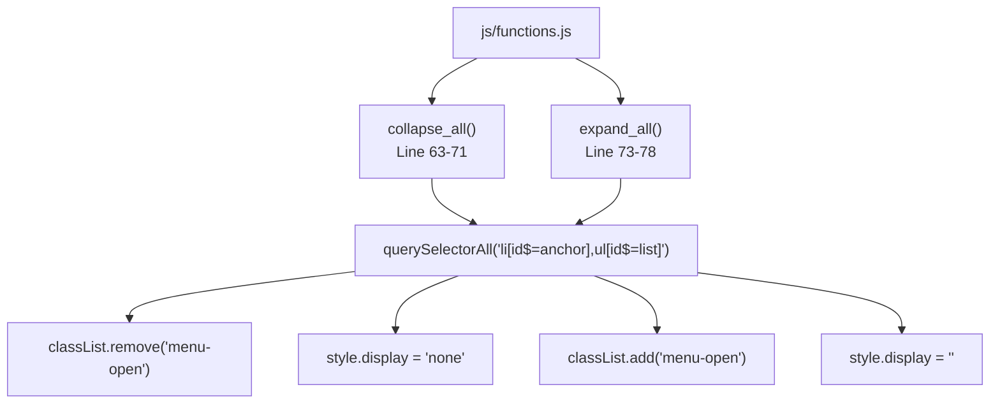

Both functions target elements with ID patterns:
- `li[id$="anchor"]` - Parent menu items (e.g., `character-anchor`, `mail-anchor`)
- `ul[id$="list"]` - Child menu containers (e.g., `character-list`, `folder-list`)

**Sources:** [js/functions.js:63-78]()

---

## Sidebar Collapse Behavior

The sidebar implements a collapsible feature with a visual indicator when collapsed.

### Collapse Detection and Indicator

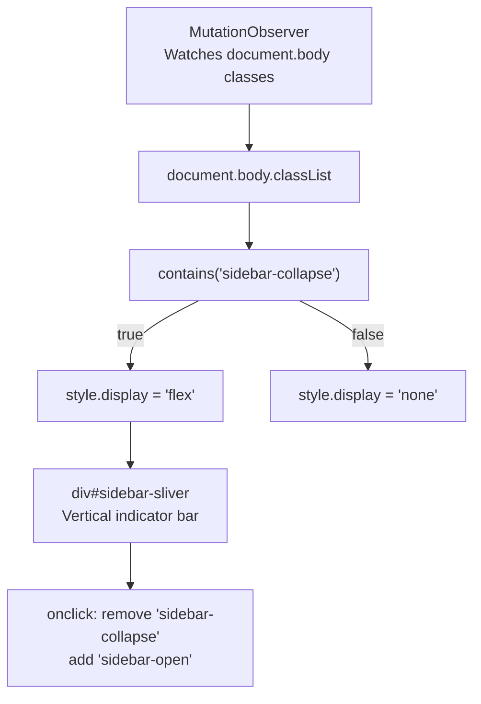

The sliver is a 10px-wide clickable bar positioned at the left edge of the viewport:
- Position: `fixed; left: 0; top: 0`
- Dimensions: `width: 10px; height: 100vh`
- Background: `rgba(5, 57, 28, 0.21)`
- Icon: `<i class="bi bi-chevron-right"></i>`
- Z-index: `999`

When clicked, it removes the `sidebar-collapse` class from `document.body`, restoring the sidebar.

**Sources:** [navs/sidemenus/nav-side-default.php:602,604-639]()

---

## URL-Based Routing Integration

Navigation links use a consistent URL pattern to maintain state and trigger page-specific content loading.

### URL Parameter Structure

All navigation links follow this format:

```
/game?page={page_name}&sub={submenu_name}
```

| Component | Purpose | Example Values |
|-----------|---------|---------------|
| `page` | Primary content identifier | `profile`, `sheet`, `hunt`, `compose` |
| `sub` | Submenu/context identifier | `character`, `location`, `mail`, `friends` |

Example navigation links:

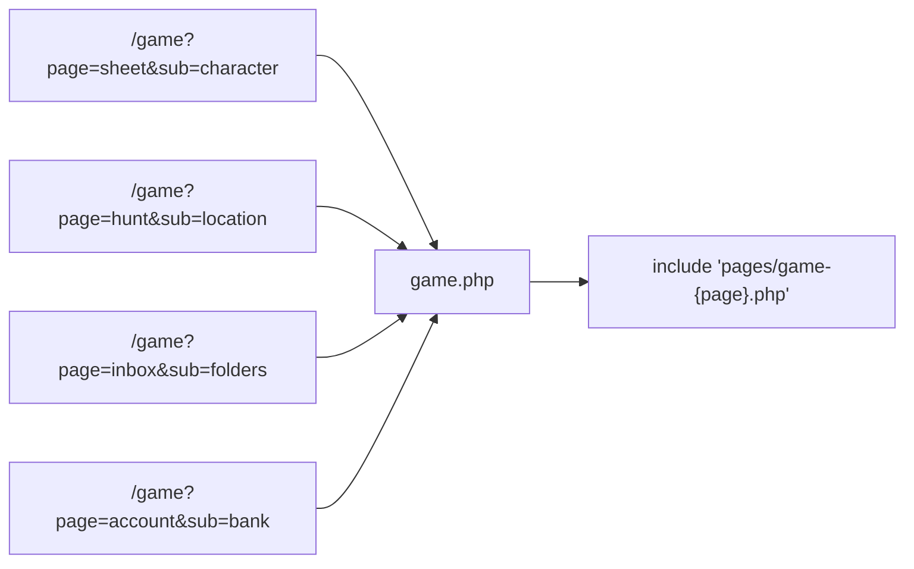

The `game.php` controller extracts these parameters and dynamically includes the corresponding page file from the `pages/` directory.

**Sources:** [navs/sidemenus/nav-side-default.php:57,64,79,94,101,111,118,125]()

### Character Select Link

The sidebar includes a special link to the character selection page that exits the current game session:

```
<a href="/select" class="nav-link">
    <i class="material-symbols-outlined">group</i>
    <p>Character Select</p>
</a>
```

This navigates to `select.php` rather than `game.php`, allowing users to switch between their three character slots.

**Sources:** [navs/sidemenus/nav-side-default.php:511-515]()

---

## Bottom Menu and User Avatar

The sidebar footer displays the current character's avatar and provides access to account-level actions.

### Bottom Menu Structure

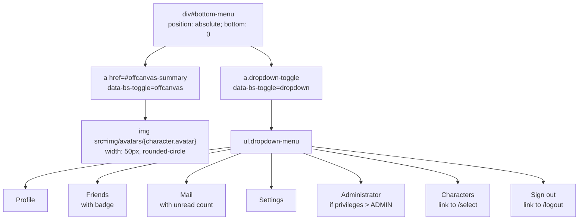

The avatar image is loaded from the character's `avatar` property:

```php
get_avatar(); ?>" 
     alt="avatar" width="50" height="50" class="rounded-circle" />
```

The dropdown menu items include:
- **Friends**: Displays a badge with `get_friend_counts(FriendStatus::REQUEST_RECV)`
- **Mail**: Shows unread count via `check_mail('unread')`
- **Administrator**: Only visible if `$account->get_privileges() > Privileges::ADMINISTRATOR->value`

**Sources:** [navs/sidemenus/nav-side-default.php:525-596]()

---

## Settings Persistence

User navigation preferences are stored in the `Settings` class and persisted to the database.

### Settings Properties

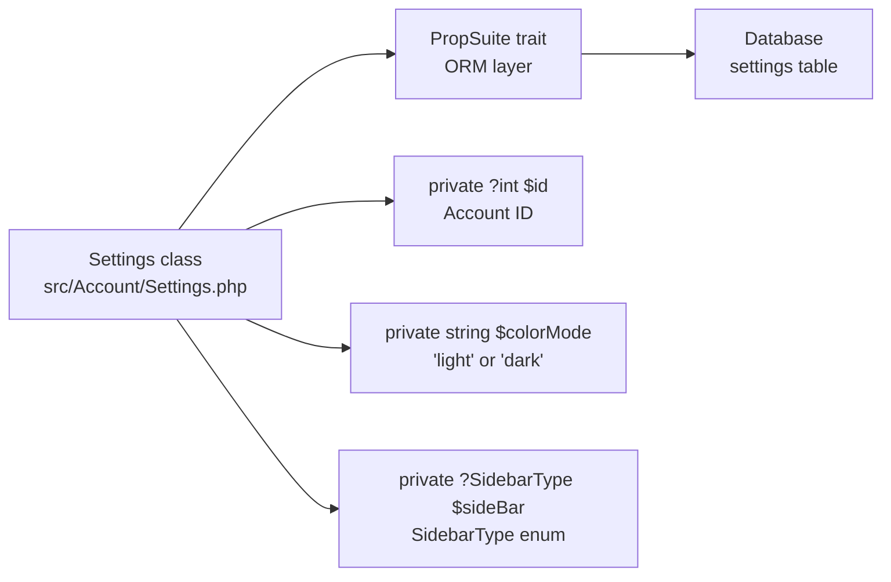

The `Settings` constructor initializes defaults:

| Property | Default Value | Type |
|----------|---------------|------|
| `id` | `$accountID` parameter | `int` |
| `colorMode` | `'dark'` | `string` |
| `sideBar` | `SidebarType::LTE_DEFAULT` | `SidebarType` enum |

Property access uses the PropSuite trait's magic `__call()` method, which handles:
- `get_{property}()` - Retrieve property value
- `set_{property}($value)` - Update property value and sync to database
- `add_{property}($amount)` - Mathematical operations
- `propDump()` - Export all properties
- `propRestore()` - Import properties

**Sources:** [src/Account/Settings.php:27-76]()

---

## Material Symbols Icons

The sidebar navigation uses Material Symbols Outlined font for icons rather than Bootstrap Icons.

### Icon Font Configuration

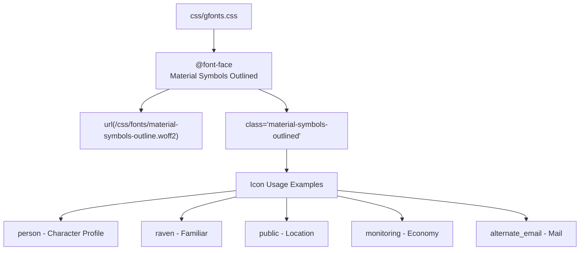

The Material Symbols class definition:

```css
.material-symbols-outlined {
  font-family: 'Material Symbols Outlined';
  font-weight: 100 700 !important;
  font-style: normal;
  font-size: 24px;
  line-height: 1;
  ...
}
```

Each navigation item uses a semantic icon name:
- `sentiment_satisfied` / `skull` - Character health indicator
- `inventory_2` - Inventory
- `egg` - Hatchery
- `cruelty_free` - Hunt
- `account_balance` - Bank

**Sources:** [css/gfonts.css:141-162](), [navs/sidemenus/nav-side-default.php:25,49,58,72,136,151,174,212,265,290,322,360]()