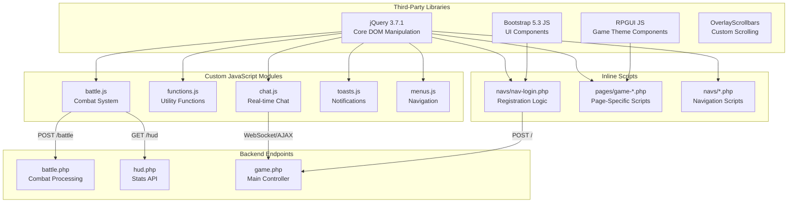
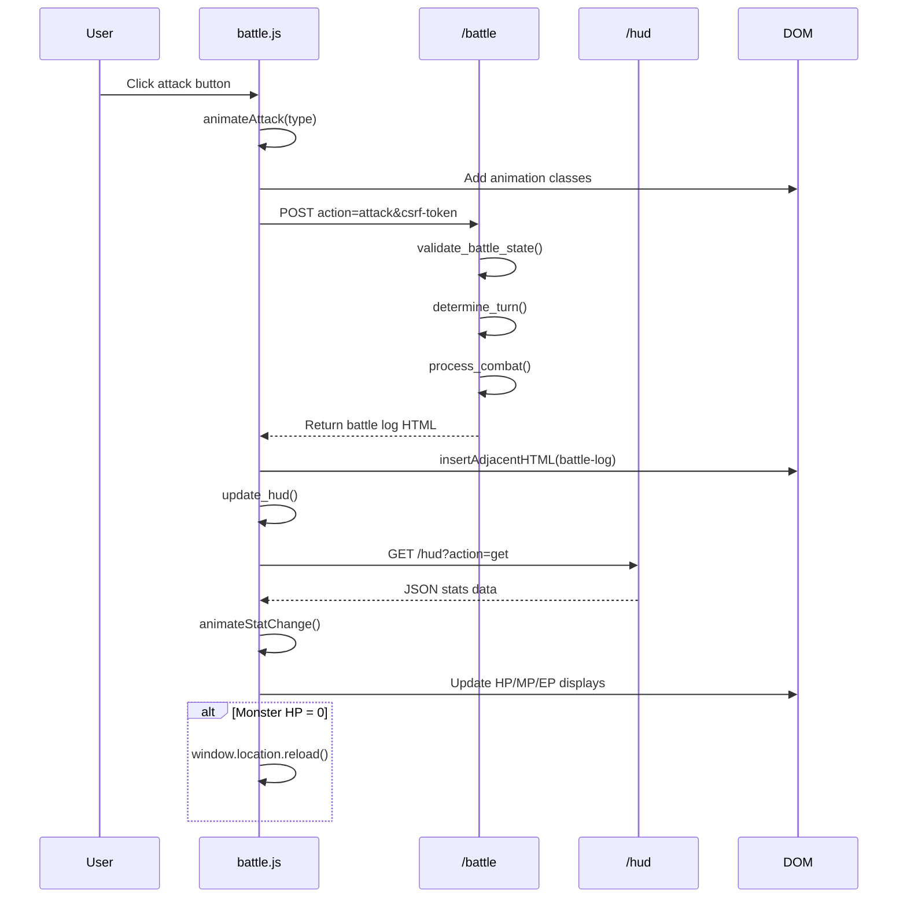
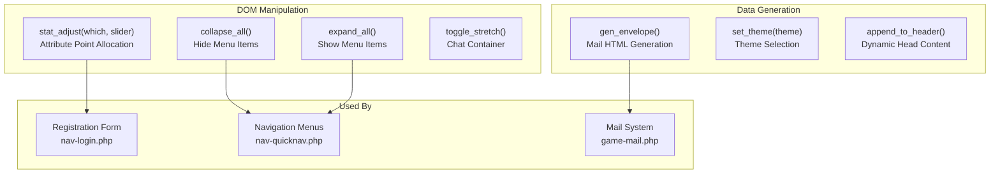
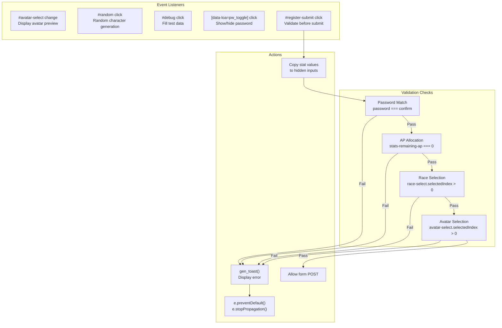
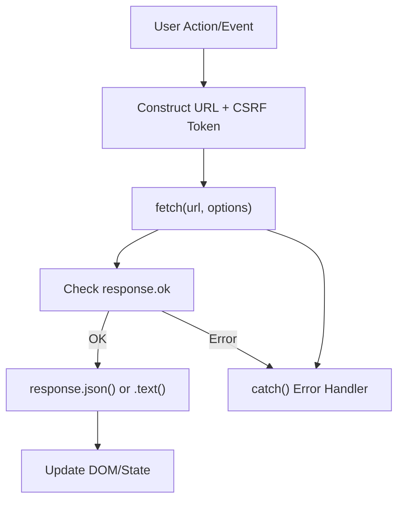
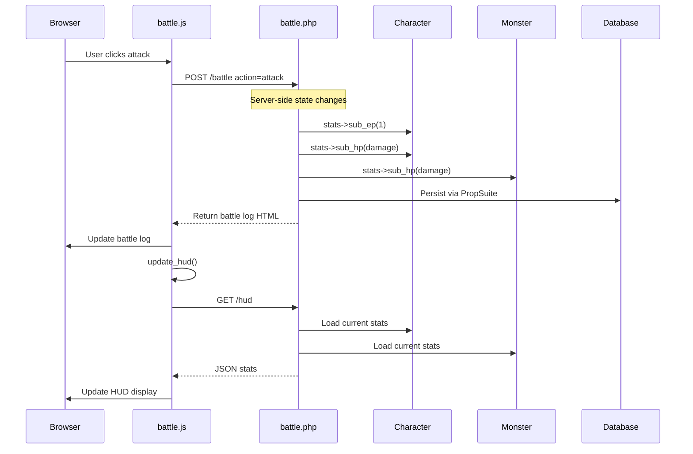

# Client-Side JavaScript

<details>
<summary>Relevant source files</summary>

The following files were used as context for generating this wiki page:

- [admini/strator/system/functions.php](admini/strator/system/functions.php)
- [battle.php](battle.php)
- [js/battle.js](js/battle.js)
- [js/functions.js](js/functions.js)
- [navs/nav-login.php](navs/nav-login.php)
- [navs/sidemenus/nav-quicknav.php](navs/sidemenus/nav-quicknav.php)
- [src/Monster/Monster.php](src/Monster/Monster.php)

</details>


## Purpose and Scope

This document covers the custom JavaScript modules and inline scripts that provide client-side interactivity in Legend of Aetheria. The application uses a combination of third-party libraries (jQuery, Bootstrap JS, RPGUI) and custom modules to handle combat animations, form validation, AJAX requests, and UI state management.

For information about UI frameworks and styling, see [UI Frameworks](#7.1). For server-side request handling, see [Entry Points](#3.1). For form validation logic, see [Form Validation](#7.5).

---

## JavaScript Module Architecture

The client-side JavaScript is organized into specialized modules, each responsible for a specific domain of functionality. All custom modules depend on jQuery for DOM manipulation and event handling.

### Module Overview



**Sources:** [js/battle.js:1-144](), [js/functions.js:1-78](), [navs/nav-login.php:184-427]()

---

## Battle System Module (battle.js)

The `battle.js` module handles all client-side combat interactions, including attack animations, AJAX requests to the combat endpoint, and HUD updates.

### Combat Flow Architecture



**Sources:** [js/battle.js:52-87](), [js/battle.js:107-144](), [battle.php:36-45]()

### Attack Animations

The module implements several animation types triggered by combat actions:

| Animation Type | CSS Classes Applied | Trigger Condition |
|---------------|-------------------|------------------|
| Physical Attack | `bounce-anim` (player), `shake-anim`, `damage-anim` (monster) | `type.includes('attack')` |
| Burn Spell | `spellcast-anim` (player), `spell-burn`, `damage-anim` (monster) | `type === 'burn'` |
| Frost Spell | `spellcast-anim` (player), `spell-frost`, `damage-anim` (monster) | `type === 'frost'` |
| Heal Spell | `spellcast-anim`, `spell-heal` (player) | `type === 'heal'` |

**Animation Implementation:**

[js/battle.js:15-40]() implements the `animateAttack(type)` function:
- Removes existing animation classes to ensure clean state
- Applies player animation immediately
- Delays monster animation by 250-400ms for visual sequence
- Each animation type has specific timing and class combinations

**Stat Change Animations:**

[js/battle.js:42-50]() implements `animateStatChange(element, isIncrease)`:
- Temporarily colors element green (increase) or red (decrease)
- Adds `flash-anim` class for visual feedback
- Removes animation after 1000ms

**Sources:** [js/battle.js:15-50]()

### HUD Update System

The `update_hud()` function [js/battle.js:107-144]() provides real-time stat synchronization:

```mermaid
graph LR
    UpdateHUD["update_hud()"]
    FetchAPI["fetch('/hud')"]
    ParseJSON["Parse JSON Response"]
    CompareStats["Compare Current vs New"]
    AnimateChange["animateStatChange()"]
    UpdateDOM["Update Text Content"]
    CheckDeath["Check Monster HP = 0"]
    Reload["window.location.reload()"]
    
    UpdateHUD --> FetchAPI
    FetchAPI --> ParseJSON
    ParseJSON --> CompareStats
    CompareStats --> AnimateChange
    AnimateChange --> UpdateDOM
    UpdateDOM --> CheckDeath
    CheckDeath -->|HP is 0| Reload
```



**Key Features:**
- Fetches JSON data from `/hud` endpoint with CSRF token
- Compares previous stat values to detect changes
- Triggers animations only when values change
- Updates `player-hp`, `player-mp`, `player-ep`, `monster-hp`, `monster-mp` elements
- Automatically reloads page when monster is defeated

**Sources:** [js/battle.js:107-144]()

### Combat Action Handlers

[js/battle.js:52-87]() sets up event listeners for all combat buttons:

```javascript
document.querySelectorAll("button[id^='hunt']")
```

This selector targets buttons with IDs starting with `hunt-`, such as:
- `hunt-attack-btn` - Physical attacks
- `hunt-spell-btn` - Magic abilities

**Request Flow:**
1. Extract action type from button ID (`hunt-{which}-btn`)
2. Check battle log line count and clear if exceeds `max_lines`
3. Trigger animation via `animateAttack(atk_type)`
4. Send POST request to `/battle` with parameters:
   - `action` - The combat action (attack, spell, etc.)
   - `type` - Specific attack/spell type
   - `csrf-token` - CSRF protection token
5. Insert returned HTML into battle log
6. Call `update_hud()` to refresh stats

**Sources:** [js/battle.js:52-87]()

### Button State Management

[js/battle.js:89-105]() implements dynamic button enabling/disabling based on monster presence:

- Buttons with `data-loa-monld="1"` require an active monster
- Buttons with `data-loa-monld="0"` require no active monster
- Uses global `mon_loaded` variable to track state

**Sources:** [js/battle.js:1-144]()

---

## Utility Functions Module (functions.js)

The `functions.js` module provides reusable utility functions for common UI operations.

### Core Utilities



**Sources:** [js/functions.js:1-78](), [navs/nav-login.php:211-229](), [navs/sidemenus/nav-quicknav.php:12-35]()

### Stat Adjustment System

The `stat_adjust(which, slider)` function [js/functions.js:14-43]() handles attribute point allocation during character creation:

**Parameters:**
- `which` - Format: `{stat}-{direction}` (e.g., `str-plus`, `def-minus`)
- `slider` - (Unused parameter, legacy from previous implementation)

**Logic Flow:**
1. Parse `which` parameter: `[stat, direction] = which.split('-')`
2. Select elements: `#stats-{stat}-cur` (current value), `#stats-remaining-ap` (remaining points)
3. **Adding Points (`direction == 'plus'`):**
   - Check if remaining AP > 0
   - If yes: increment stat, decrement AP
   - If no: add `text-danger` class to AP display
4. **Removing Points (`direction == 'minus'`):**
   - Check if stat > 10 (minimum value)
   - If yes: decrement stat, increment AP
   - If no: add `text-danger` class to stat display

**Visual Feedback:**
- Red text (`text-danger`) indicates invalid operations
- Constraints: Stats cannot go below 10, AP cannot go below 0

**Sources:** [js/functions.js:14-43]()

### Navigation Utilities

**Menu Collapse/Expand:**

[js/functions.js:63-77]() provides functions for sidebar menu state management:

- `collapse_all()` - Removes `menu-open` class and hides all `ul[id$="list"]` elements
- `expand_all()` - Adds `menu-open` class and displays all menu lists

These are called from [navs/sidemenus/nav-quicknav.php:12-35]() via onclick handlers.

**Theme Management:**

[js/functions.js:58-61]() provides `set_theme(theme)`:
- Sets hidden input `#profile-theme` value
- Used for user preference persistence

**Sources:** [js/functions.js:58-77](), [navs/sidemenus/nav-quicknav.php:12-35]()

### Mail Envelope Generator

The `gen_envelope(subject, sender, message_fragment, date)` function [js/functions.js:1-12]() generates HTML for mail list items:

**Returns:** HTML string with Bootstrap list-group structure:
```html
<div class="list-group">
  <a href="#" class="list-group-item list-group-item-action active">
    <div class="d-flex w-100 justify-content-between">
      <h5 class="mb-1">{sender} - {subject}</h5>
      <small>{date}</small>
    </div>
    <small>{message_fragment}</small>
  </a>
</div>
```

**Usage:** Called dynamically when rendering mail inbox/outbox lists.

**Sources:** [js/functions.js:1-12]()

---

## Inline JavaScript in Templates

Several PHP templates contain embedded JavaScript for page-specific functionality. This pattern is used when the logic is tightly coupled to server-rendered content.

### Registration Form JavaScript

[navs/nav-login.php:184-427]() contains extensive inline JavaScript for the registration form:



**Sources:** [navs/nav-login.php:242-274]()

### Avatar Preview System

[navs/nav-login.php:184-188]() and [navs/nav-login.php:373-380]() implement dynamic avatar preview:

**On Change Event:**
1. Get selected value from `#avatar-select`
2. Construct image path: `img/avatars/avatar-{chosen_pic}.webp`
3. Build HTML string with `` tag
4. Insert into `#avatar-image-cont`
5. Remove `invisible` class from `#avatar-img` container

**Sources:** [navs/nav-login.php:184-188](), [navs/nav-login.php:373-380]()

### Password Toggle Implementation

[navs/nav-login.php:413-426]() implements show/hide password functionality:

**Selector:** `[data-loa=pw_toggle]` - Targets span elements adjacent to password inputs

**Logic:**
1. Find previous sibling (the password input)
2. Check current `type` attribute
3. If `password`: Change to `text`, update button to "Hide"
4. If `text`: Change to `password`, update button to "Show"

This pattern is used in:
- Login form [navs/nav-login.php:58]()
- Registration form [navs/nav-login.php:100](), [navs/nav-login.php:109]()
- Admin form [navs/nav-login.php:360]()

**Sources:** [navs/nav-login.php:413-426]()

### Debug/Test Data Generator

[navs/nav-login.php:390-411]() provides a debug button to auto-fill registration form:

**Generated Data:**
- Email: `test{random5}@example.com`
- Password: Random 10-character string
- Character name: `TestChar{random5}`
- Race: Random selection
- Avatar: Random selection
- Stats: Randomly allocates 10 AP across str/def/int

**Random String Generation:**
[navs/nav-login.php:382-384]() defines `genString(length)`:
```javascript
return Math.random().toString(26).substring(2, length + 2)
```

**Sources:** [navs/nav-login.php:382-411]()

### Form Validation on Submit

[navs/nav-login.php:242-274]() implements comprehensive validation before form submission:

**Validation Sequence:**

| Check | Condition | Error Toast | Prevents Submit |
|-------|-----------|-------------|-----------------|
| Stat Copy | Always | - | No |
| Password Match | `password !== confirm` | `error-pw-mismatch` | Yes |
| AP Allocation | `remaining-ap > 0` | `error-ap-toast` | Yes |
| Race Selection | `selectedIndex == 0` | `error-race-toast` | Yes |
| Avatar Selection | `selectedIndex == 0` | `error-avatar-toast` | Yes |

**Hidden Input Population:**
Before validation, [navs/nav-login.php:244-246]() copies visible stat values to hidden form inputs:
- `#stats-str-cur` → `#str-ap`
- `#stats-def-cur` → `#def-ap`
- `#stats-int-cur` → `#int-ap`

**Sources:** [navs/nav-login.php:242-274]()

---

## AJAX Communication Patterns

All AJAX requests follow consistent patterns for error handling, CSRF protection, and response processing.

### Standard Request Pattern



**Sources:** [js/battle.js:73-86](), [js/battle.js:108-143]()

### Battle AJAX Request

[js/battle.js:73-86]() demonstrates the battle request pattern:

**Request Configuration:**
```javascript
fetch('/battle', {
    headers: {
        'Content-Type': 'application/x-www-form-urlencoded',
        'Accept': 'text/plain'
    },
    method: 'POST',
    body: `action=${which}&type=${atk_type}&csrf-token=${csrf_token}`
})
```

**Response Handling:**
- `.then((response) => response.text())` - Parse as plain text (HTML)
- `battle_log.insertAdjacentHTML('afterbegin', data)` - Prepend to log
- `await update_hud()` - Asynchronously update stats
- `.catch((error) => {...})` - Display error in battle log

**Sources:** [js/battle.js:73-86]()

### HUD API Request

[js/battle.js:108-114]() demonstrates the stats API pattern:

**Request Configuration:**
```javascript
fetch(`/hud?action=get&csrf-token=${loa.u_csrf}`, {
    headers: {
        'Content-Type': 'application/x-www-form-urlencoded',
        'Accept': 'application/json'
    },
    method: 'GET',
})
```

**Expected Response Structure:**
```json
{
    "monster": {
        "hp": int,
        "maxHP": int,
        "mp": int,
        "maxMP": int
    },
    "player": {
        "hp": int,
        "maxHP": int,
        "mp": int,
        "maxMP": int,
        "ep": int,
        "maxEP": int
    }
}
```

**Sources:** [js/battle.js:108-143]()

---

## Global JavaScript Variables and Initialization

Several global variables are initialized by PHP templates and used by JavaScript modules:

### CSRF Token Management

**Declaration:**
```javascript
const csrf_token = "<?php echo $_SESSION['csrf_token']; ?>";
```

**Usage:**
- Included in all POST requests as `csrf-token` parameter
- Referenced as `csrf_token` or `loa.u_csrf` depending on context
- Validated server-side by `check_csrf_token()` [admini/strator/system/functions.php:170-179]()

**Sources:** [js/battle.js:79](), [js/battle.js:108]()

### Monster State Tracking

**Variable:** `mon_loaded` - Boolean flag indicating if a monster is currently active

**Usage:**
- Controls button state in [js/battle.js:89-105]()
- Buttons with `data-loa-monld="1"` enabled when `mon_loaded == 1`
- Buttons with `data-loa-monld="0"` enabled when `mon_loaded == 0`

**Set By:** Server-rendered PHP determining if `$character->get_monster()` is not null

**Sources:** [js/battle.js:92-103]()

---

## jQuery Event Delegation Patterns

The codebase uses jQuery event handlers extensively for dynamic content interaction.

### Dropdown Menu Handler

[js/battle.js:3-13]() implements attack/spell type selection:

```javascript
document.querySelectorAll("ul[id$='drop-menu']").forEach((menu) => {
    let which = menu.id.split("-")[0]; // "attack" or "spell"
    let short = which == 'attack' ? 'atk' : 'spl';
    
    menu.querySelectorAll("li").forEach((li) => {
        li.addEventListener("click", (e) => {
            // Update button text and value
            document.getElementById(`hunt-${which}-btn`).textContent = e.target.textContent;
            document.getElementById(`hunt-${which}-btn`).value = 
                e.target.attributes.getNamedItem(`data-loa-${short}`);
        });
    });
});
```

**Pattern Details:**
- Targets all `<ul>` elements with IDs ending in `-drop-menu`
- Extracts type from ID prefix (`attack-drop-menu` → `attack`)
- Attaches click handlers to all `<li>` children
- Updates corresponding button's text and value on selection

**Sources:** [js/battle.js:3-13]()

### Form Input Event Handlers

[navs/nav-login.php:184-188]() uses jQuery `.change()` for avatar selection:

```javascript
$("#avatar-select").change(function(event) {
    document.getElementById("avatar-img").classList.remove("invisible");
});
```

[navs/nav-login.php:373-380]() uses jQuery `.on("change")` for the same functionality:

```javascript
$("#avatar-select").on("change", function(e) {
    let chosen_pic = document.querySelector('#avatar-select').value;
    // ... build and insert image HTML
});
```

**Pattern:** Mix of jQuery and vanilla JavaScript for element selection and manipulation.

**Sources:** [navs/nav-login.php:184-188](), [navs/nav-login.php:373-380]()

---

## Animation Class Management

CSS animations are triggered by adding/removing classes to DOM elements. The JavaScript code manages this state carefully to ensure animations trigger correctly.

### Animation Reset Pattern

[js/battle.js:19-21]() demonstrates the standard reset pattern:

```javascript
monsterImg.classList.remove('shake-anim', 'damage-anim', 
                           'spellcast-anim', 'spell-burn', 
                           'spell-frost', 'spell-heal');
playerImg.classList.remove('bounce-anim', 'spellcast-anim');
```

**Purpose:** Remove all animation classes before applying new ones to ensure the browser re-triggers the animation.

**Timing:** Always executed at the start of `animateAttack(type)` before any new classes are added.

**Sources:** [js/battle.js:19-21]()

### Delayed Animation Application

[js/battle.js:24-39]() uses `setTimeout()` for sequential animations:

```javascript
if (type.toLowerCase().includes('attack')) {
    playerImg.classList.add('bounce-anim');
    setTimeout(() => monsterImg.classList.add('shake-anim'), 250);
    setTimeout(() => monsterImg.classList.add('damage-anim'), 300);
}
```

**Timing Strategy:**
- Player animation: Immediate (0ms)
- Monster shake: 250ms delay (impact timing)
- Monster damage: 300ms delay (visual feedback)
- Spell effects: 400ms delay (casting time)

**Sources:** [js/battle.js:23-39]()

### Temporary Animation Classes

[js/battle.js:42-50]() implements self-removing animations:

```javascript
function animateStatChange(element, isIncrease) {
    element.classList.remove('flash-anim');
    element.style.color = isIncrease ? '#28a745' : '#dc3545';
    element.classList.add('flash-anim');
    setTimeout(() => {
        element.style.color = '';
        element.classList.remove('flash-anim');
    }, 1000);
}
```

**Pattern:**
1. Remove existing animation (reset)
2. Set inline color style
3. Add animation class
4. After 1000ms, remove class and clear style

**Sources:** [js/battle.js:42-50]()

---

## Error Handling and User Feedback

JavaScript modules implement multiple levels of error handling to ensure graceful degradation.

### Battle System Error Handling

[js/battle.js:83-85]() handles fetch errors:

```javascript
.catch((error) => {
    battle_log.insertAdjacentHTML = battle_log.innerHTML + `${error.message}`;
});
```

**Behavior:** Appends error message to battle log, allowing users to see what went wrong without disrupting the page.

**Sources:** [js/battle.js:83-85]()

### Form Validation Feedback

[navs/nav-login.php:253-272]() uses `gen_toast()` function for validation errors:

```javascript
gen_toast('error-pw-mismatch', 'warning', 'bi-key', 
         'Password Mis-match', 'Ensure passwords match');
```

**Toast Parameters:**
1. `id` - Unique identifier for the toast
2. `type` - Bootstrap color class (`warning`, `danger`, etc.)
3. `icon` - Bootstrap icon class
4. `title` - Toast heading
5. `message` - Toast body text

**Effect:** Prevents form submission (`e.preventDefault()`, `e.stopPropagation()`) and displays user-friendly error message.

**Sources:** [navs/nav-login.php:253-272]()

---

## DOM Manipulation Strategies

The codebase uses a mix of jQuery and vanilla JavaScript for DOM manipulation, depending on the context and complexity of the operation.

### jQuery Selectors

Used for:
- Event binding: `$("#element").on("click", ...)`
- Simple selection: `$("#avatar-select").change(...)`
- Multi-element operations: `$("button").each(...)`

**Example:** [navs/nav-login.php:185]()
```javascript
$("#avatar-select").change(function(event) { ... })
```

### Vanilla JavaScript

Used for:
- Complex selection: `document.querySelectorAll("ul[id$='drop-menu']")`
- Direct manipulation: `element.classList.add()`, `element.textContent = ...`
- Performance-critical operations

**Example:** [js/battle.js:3-4]()
```javascript
document.querySelectorAll("ul[id$='drop-menu']").forEach((menu) => { ... })
```

### Mixed Approach

[navs/nav-login.php:373-380]() demonstrates using jQuery for events but vanilla JS for manipulation:

```javascript
$("#avatar-select").on("change", function(e) {
    let chosen_pic = document.querySelector('#avatar-select').value;
    let target_div = document.querySelector('#avatar-image-cont');
    target_div.innerHTML = html_string;
});
```

**Sources:** [js/battle.js:3-13](), [navs/nav-login.php:185](), [navs/nav-login.php:373-380]()

---

## Integration with Server-Side State

JavaScript modules must maintain synchronization with server-side game state, particularly for combat and character stats.

### State Synchronization Flow



**Sources:** [js/battle.js:73-86](), [js/battle.js:107-144](), [battle.php:86-114]()

### Critical State Points

**EP (Energy Points) Validation:**
[battle.php:58-63]() checks if player has EP before allowing combat:
```php
if ($character->stats->get_ep() <= 0) {
    http_response_code(401);
    echo "No EP Left";
    return false;
}
```

**Client Response:** [js/battle.js:138-140]() reloads page when monster HP reaches 0:
```javascript
if (monster_hp.textContent.match(/^0/)) {
    window.location.reload('/game?page=hunt&sub=location');
}
```

**Sources:** [battle.php:55-88](), [js/battle.js:138-140]()

---

## Module Dependencies and Load Order

JavaScript modules must be loaded in specific order due to dependencies.

### Required Load Sequence

1. **jQuery** - Must load first, provides `$` and jQuery functions
2. **Bootstrap JS** - Depends on jQuery for components
3. **RPGUI JS** - Depends on jQuery for game UI components
4. **Custom Modules** - battle.js, functions.js, etc.
5. **Inline Scripts** - Page-specific code in PHP templates

**Enforcement:** [headers.html]() and [footers.html]() define load order through script tag sequence.

### Function Availability

Functions in `functions.js` must be available globally for inline script usage:

- `stat_adjust()` - Called from [navs/nav-login.php:211-229]()
- `collapse_all()` / `expand_all()` - Called from [navs/sidemenus/nav-quicknav.php:12-35]()
- `gen_toast()` - Called from registration validation [navs/nav-login.php:253-272]()

**Pattern:** Utility functions defined without module pattern to ensure global scope.

**Sources:** [js/functions.js:1-78](), [navs/nav-login.php:211-229](), [navs/sidemenus/nav-quicknav.php:12-35]()