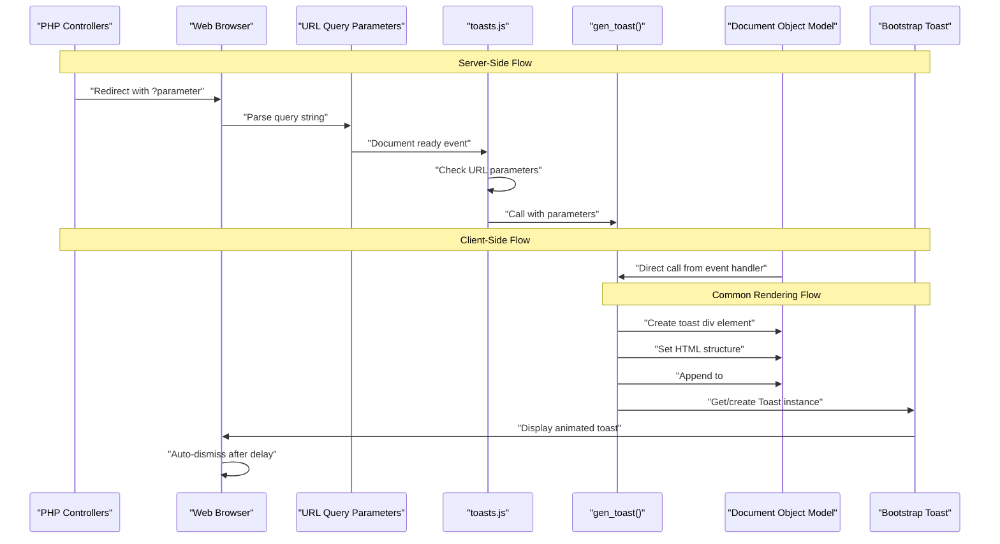
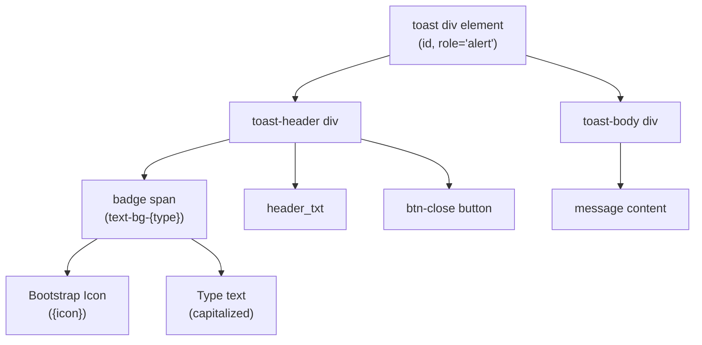
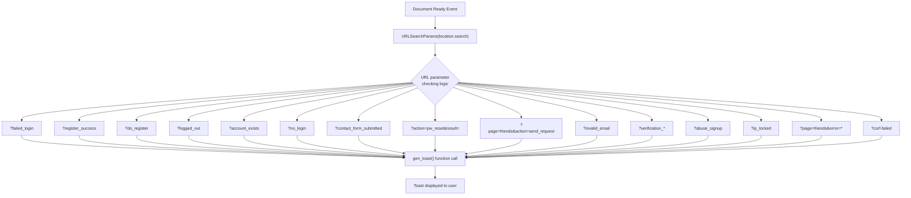
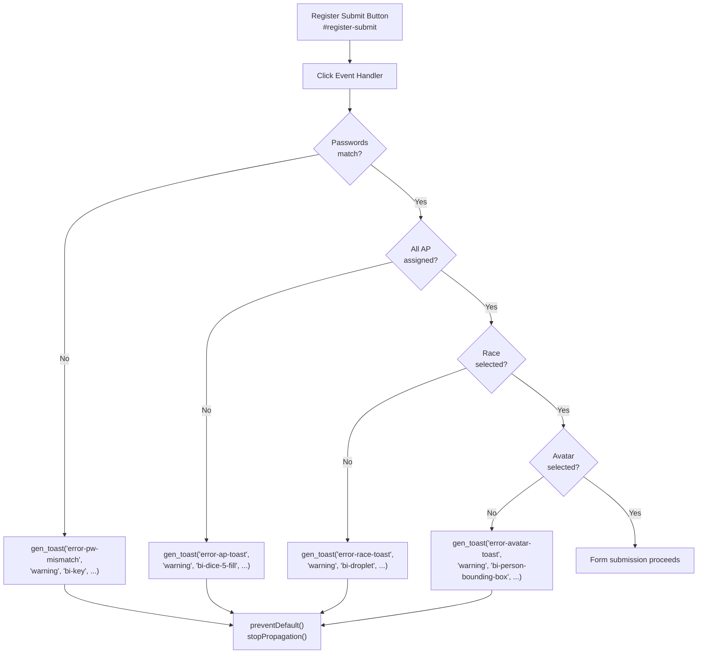

# Toast Notifications

<details>
<summary>Relevant source files</summary>

The following files were used as context for generating this wiki page:

- [js/functions.js](js/functions.js)
- [js/toasts.js](js/toasts.js)
- [navs/nav-login.php](navs/nav-login.php)

</details>


## Purpose and Scope

The Toast Notification system provides user feedback through non-intrusive, temporary pop-up messages that appear in the top-right corner of the application. This system handles both client-side validation messages and server-side feedback communicated via URL query parameters. Toast notifications are used throughout Legend of Aetheria to inform users of successful actions, validation errors, authentication status, and system messages.

For information about form validation logic, see [Form Validation](#7.5). For general client-side JavaScript functionality, see [Client-Side JavaScript](#7.3).

---

## System Architecture

The toast notification system consists of three primary components: a JavaScript toast generation function, a URL parameter detection system, and Bootstrap 5.3's Toast component for rendering.

### Toast Notification Flow



Sources: [js/toasts.js:1-90](), [navs/nav-login.php:243-273]()

---

## Toast Generation Function

The core of the notification system is the `gen_toast()` function defined in `toasts.js`. This function dynamically creates toast notification elements and displays them using Bootstrap's Toast API.

### Function Signature

```javascript
gen_toast(id, type, icon, header_txt, message)
```

### Parameters

| Parameter | Type | Description | Examples |
|-----------|------|-------------|----------|
| `id` | string | Unique identifier for the toast element | `'error-login-toast'`, `'success-register-toast'` |
| `type` | string | Bootstrap color class determining appearance | `'success'`, `'danger'`, `'warning'`, `'info'` |
| `icon` | string | Bootstrap Icon class name (without `bi-` prefix) | `'bi-check'`, `'bi-dash-circle'`, `'bi-key'` |
| `header_txt` | string | Main heading text displayed in toast header | `'Error'`, `'Success'`, `'Warning'` |
| `message` | string | Detailed message content in toast body | `'Invalid login credentials!'`, `'Account created successfully'` |

### Toast Structure



Sources: [js/toasts.js:1-29]()

### Implementation Details

The `gen_toast()` function performs the following operations:

1. **Element Creation**: Creates a new `div` element with accessibility attributes (`ariaLive='assertive'`, `ariaAtomic='true'`, `role='alert'`)

2. **Type Badge Transformation**: Converts the `type` parameter to display text (capitalizes and replaces `'Danger'` with `'Error'`)

3. **HTML Structure Generation**: Builds a complete toast structure with header, badge, icon, close button, and message body

4. **DOM Injection**: Appends the toast element to the `#toast-container` element

5. **Bootstrap Initialization**: Uses `bootstrap.Toast.getOrCreateInstance()` to create or retrieve a Bootstrap Toast instance

6. **Display**: Calls `.show()` to display the toast with animation

Sources: [js/toasts.js:1-29]()

---

## URL Parameter-Based Notification System

The toast system includes an extensive URL parameter detection mechanism that automatically displays notifications based on query string parameters. This allows PHP controllers to trigger notifications by redirecting users with specific URL parameters.

### URL Parameter Detection Flow



Sources: [js/toasts.js:31-90]()

### Supported URL Parameters

The system supports the following URL parameter patterns for automated toast notifications:

| URL Pattern | Type | Icon | Header | Message | Additional Actions |
|-------------|------|------|--------|---------|-------------------|
| `?failed_login` | danger | bi-dash-circle | Error | Invalid login credentials! | - |
| `?register_success` | success | bi-check | Success | Account and Character successfully created | Switches to login tab and focuses it |
| `?do_register` | success | bi-check | Success | No account associated with this email | Switches to register tab, pre-fills email |
| `?logged_out` | success | bi-check | Logged Out | Successfully logged out! | - |
| `?account_exists` | danger | bi-dash-circle | Account Exists | An account already exists with that email | - |
| `?no_login` | danger | bi-dash-circle | Not Logged In | Please login first | - |
| `?contact_form_submitted=1` | success | bi-chat-heart-fill | Contact Form Sent | Thank you for contacting us... | - |
| `?action=pw_reset&result=fail` | danger | bi-key | Password Mis-match | Passwords do not match | - |
| `?action=pw_reset&result=pass` | success | bi-key | Password Changed | Password successfully updated | - |
| `?page=friends&action=send_request` | success | bi-person-plus-fill | Friend Request Sent | Request sent to user | - |
| `?invalid_email` | danger | bi-envelope-slash-fill | Invalid Email | Invalid email address supplied | - |
| `?already_verified` | warning | bi-person-check | Already Verified | Account already verified | Pre-fills login email and focuses password |
| `?resent_verification` | success | bi-envelope-exclamation-fill | Verification Resent | Verification email resent | - |
| `?verification_successful` | success | bi-envelope-check-fill | Verification Successful | Account verification successful | - |
| `?verification_failed` | danger | bi-envelope-slash | Verification Failed | Check email/code combination | - |
| `?abuse_signup` | danger | bi-slash-circle | Sign-Up Abuse | Too many account creations | - |
| `?ip_locked` | danger | bi-exclamation-octagon-fill | IP Locked | Non-matching IP address | - |
| `?page=friends&error=self_add` | danger | bi-slash-circle | Adding Self | Cannot add yourself | - |
| `?page=friends&error=invalid_email` | danger | bi-slash-circle | Invalid Email | Email doesn't exist or blocked | - |
| `?page=friends&error=already_friend` | danger | bi-slash-circle | Already Friended | User already added | - |
| `?csrf-failed` | danger | bi-highlighter | CSRF Failed | CSRF token invalid | - |

Sources: [js/toasts.js:34-88]()

---

## Client-Side Validation Toasts

In addition to URL parameter-based toasts, the system supports direct invocation from client-side event handlers for real-time validation feedback during form submission.

### Registration Form Validation

The registration form in `nav-login.php` uses `gen_toast()` to provide immediate feedback on validation errors before form submission.



Sources: [navs/nav-login.php:243-273]()

### Validation Toast Examples

**Password Mismatch**:
```javascript
gen_toast('error-pw-mismatch', 'warning', 'bi-key', 'Password Mis-match', 'Ensure passwords match');
```

**Unassigned Attribute Points**:
```javascript
gen_toast('error-ap-toast', 'warning', 'bi-dice-5-fill', 'Unassigned Attribute Points', 'Ensure all remaining attribute points are applied');
```

**Race Not Selected**:
```javascript
gen_toast('error-race-toast', 'warning', 'bi-droplet', 'Select Race', 'You must choose a race first');
```

**Avatar Not Selected**:
```javascript
gen_toast('error-avatar-toast', 'warning', 'bi-person-bounding-box', 'Select Avatar', 'You must choose an avatar first');
```

Sources: [navs/nav-login.php:253-271]()

---

## Toast Types and Styling

The toast system leverages Bootstrap 5.3's contextual color classes to provide visual differentiation between notification types.

### Type Mappings

| Type Parameter | Bootstrap Class | Visual Appearance | Common Use Cases |
|----------------|-----------------|-------------------|------------------|
| `success` | `text-bg-success` | Green badge/background | Successful operations, confirmations |
| `danger` | `text-bg-danger` | Red badge/background | Errors, failed operations, security issues |
| `warning` | `text-bg-warning` | Yellow badge/background | Validation errors, non-critical issues |
| `info` | `text-bg-info` | Blue badge/background | Informational messages |

### Badge Text Transformation

The `gen_toast()` function automatically transforms the type parameter into human-readable badge text:

- Capitalizes the first letter: `'success'` → `'Success'`
- Replaces `'Danger'` with `'Error'`: `'Danger'` → `'Error'`

This ensures consistent terminology across the application where "danger" toasts display as "Error" to end users.

Sources: [js/toasts.js:3-4]()

---

## DOM Structure and Container

All toast notifications require a container element with the ID `toast-container` to exist in the DOM. This container should be positioned to display toasts in the desired location (typically top-right corner).

### Toast Container Placement

The toast container is typically included in the main layout template:

```html
<div id="toast-container" class="position-fixed top-0 end-0 p-3" style="z-index: 11"></div>
```

This positioning ensures toasts:
- Appear in the top-right corner (`top-0 end-0`)
- Have appropriate padding from edges (`p-3`)
- Display above other content (`z-index: 11`)
- Use fixed positioning to remain visible during scrolling

Sources: [js/toasts.js:24]()

---

## Bootstrap Toast Integration

The notification system integrates with Bootstrap 5.3's Toast component, which provides the animation, auto-dismiss, and accessibility features.

### Bootstrap Toast Lifecycle

```mermaid
graph LR
    Create["gen_toast() creates<br/>toast element"]
    Append["Append to<br/>#toast-container"]
    GetInstance["bootstrap.Toast<br/>.getOrCreateInstance()"]
    Show["toast_bubble.show()"]
    Animate["Slide-in animation"]
    Display["Visible state"]
    AutoDismiss["Auto-dismiss timer"]
    FadeOut["Fade-out animation"]
    Remove["Element removed<br/>from DOM"]
    
    Create --> Append
    Append --> GetInstance
    GetInstance --> Show
    Show --> Animate
    Animate --> Display
    Display --> AutoDismiss
    AutoDismiss --> FadeOut
    FadeOut --> Remove
```



Sources: [js/toasts.js:26-28]()

### Bootstrap Toast API Usage

The system uses the following Bootstrap Toast API methods:

- **`bootstrap.Toast.getOrCreateInstance(element)`**: Retrieves an existing Toast instance or creates a new one if it doesn't exist
- **`.show()`**: Displays the toast with animation

Bootstrap's default configuration provides:
- Auto-dismiss after 5000ms (5 seconds)
- Slide-in animation from right
- ARIA attributes for screen reader accessibility
- Close button functionality

Sources: [js/toasts.js:26-28]()

---

## Accessibility Features

The toast notification system implements several accessibility features to ensure notifications are perceivable by all users:

### ARIA Attributes

Each toast element includes the following ARIA attributes:

| Attribute | Value | Purpose |
|-----------|-------|---------|
| `role` | `alert` | Identifies the element as an alert region |
| `aria-live` | `assertive` | Announces content immediately to screen readers |
| `aria-atomic` | `true` | Reads entire content when updated |

These attributes ensure that screen readers announce toast notifications as soon as they appear, without requiring user interaction.

### Close Button

Every toast includes a close button with:
- Bootstrap's `btn-close` class for styling
- `data-bs-dismiss="toast"` attribute for dismissal
- `aria-label="Close"` for screen reader text

Sources: [js/toasts.js:8-10,17]()

---

## Integration Points

The toast notification system integrates with multiple parts of the application:

### PHP Controllers

PHP controllers trigger toasts by redirecting with URL parameters:

```php
// Example: Login failure
header("Location: /?failed_login");

// Example: Registration success
header("Location: /?register_success");

// Example: CSRF validation failure
header("Location: /game?page=profile&csrf-failed");
```

### JavaScript Event Handlers

Client-side code calls `gen_toast()` directly for immediate feedback:

```javascript
$("#register-submit").on("click", function(e) {
    if (password !== password_confirm) {
        e.preventDefault();
        gen_toast('error-pw-mismatch', 'warning', 'bi-key', 
                  'Password Mis-match', 'Ensure passwords match');
    }
});
```

### Session Management

Session validation failures trigger toasts via URL parameters, as documented in [Session Management](#3.2).

### Form Validation

Client-side validation uses toasts extensively, as detailed in [Form Validation](#7.5).

Sources: [js/toasts.js:31-90](), [navs/nav-login.php:243-273]()

---

## Common Usage Patterns

### Pattern 1: Server-Side Redirect with Toast

```php
// Controller logic
if ($authentication_failed) {
    header("Location: /?failed_login");
    exit();
}
```

### Pattern 2: Client-Side Validation Toast

```javascript
if (!isValid(input)) {
    gen_toast('validation-error', 'warning', 'bi-exclamation-triangle',
              'Validation Error', 'Please correct the highlighted fields');
}
```

### Pattern 3: Multi-Parameter URL Toast

```php
// Controller logic
if ($verification_successful) {
    header("Location: /?verification_successful&email=" . urlencode($email));
    exit();
}
```

Sources: [js/toasts.js:1-90](), [navs/nav-login.php:243-273]()