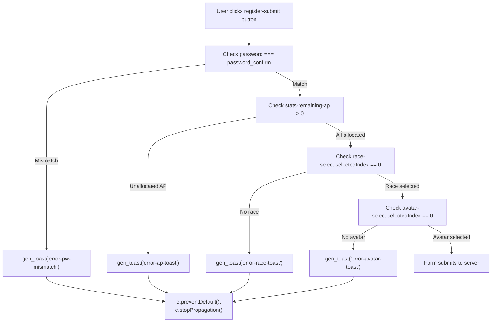
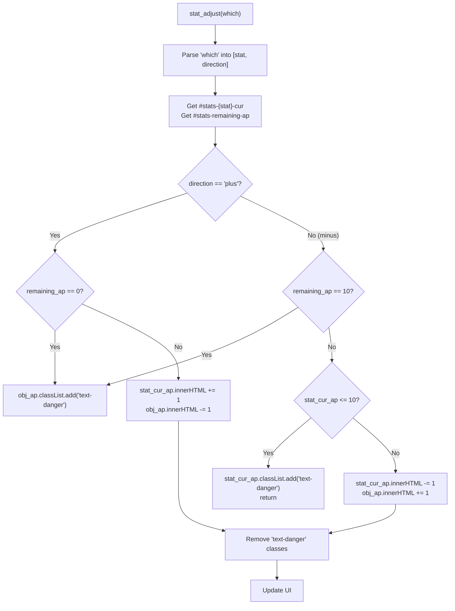
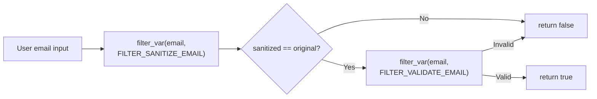
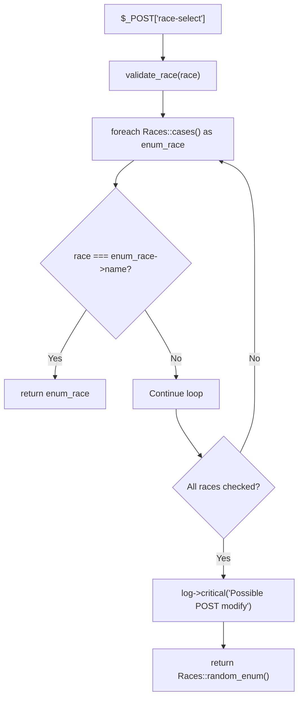
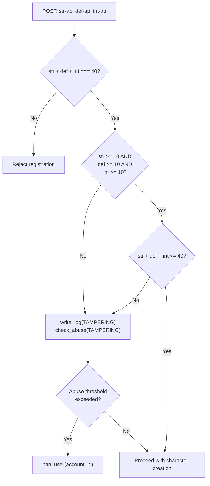
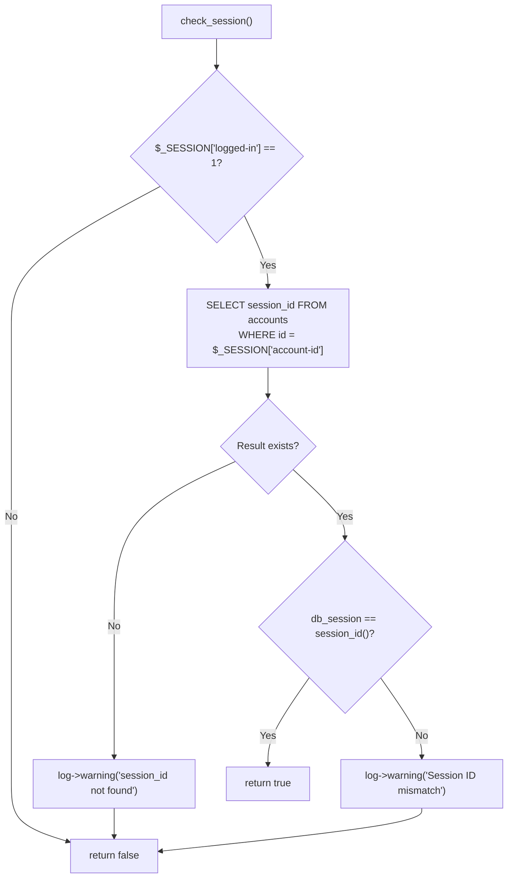
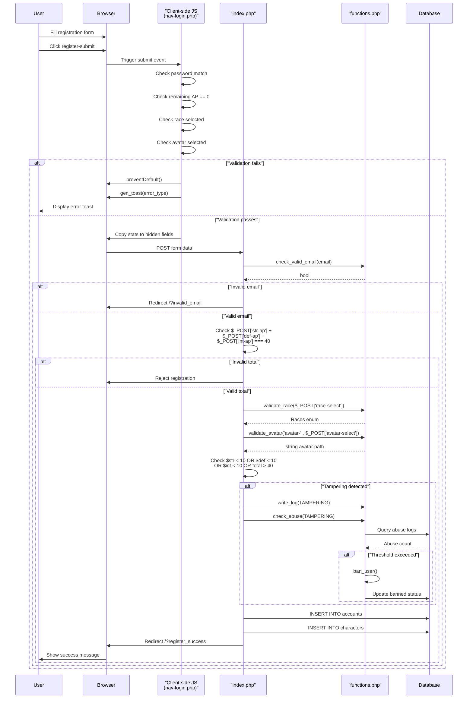

# Form Validation

<details>
<summary>Relevant source files</summary>

The following files were used as context for generating this wiki page:

- [functions.php](functions.php)
- [game.php](game.php)
- [index.php](index.php)
- [js/functions.js](js/functions.js)
- [navs/nav-login.php](navs/nav-login.php)

</details>


Form validation in Legend of Aetheria implements a multi-layered approach combining client-side validation for user experience, server-side validation for security, and input sanitization to prevent injection attacks. The system validates user registration, login attempts, character creation, and attribute point allocation.

For information about authentication workflows, see [Login System](#4.2). For session security mechanisms, see [Session Management](#3.2).

---

## Overview

The validation system operates at three distinct layers:

| Layer | Purpose | Primary Location |
|-------|---------|------------------|
| **Client-Side** | Immediate user feedback, prevent unnecessary server requests | [navs/nav-login.php:242-273](), [js/functions.js:14-43]() |
| **Server-Side** | Security enforcement, abuse detection, business logic | [index.php:82-175](), [functions.php:251-444]() |
| **Input Sanitization** | SQL injection prevention, path traversal protection | [index.php:96](), [game.php:66]() |

All forms use HTML5 validation attributes (`required`, `type="email"`) combined with JavaScript event handlers and server-side validation functions.

---

## Client-Side Validation

### Registration Form Validation

The registration form implements comprehensive client-side validation using jQuery event handlers attached to the submit button. Validation occurs before form submission using `preventDefault()` to block invalid submissions.

**Validation Flow Diagram**



**Password Matching Validation**

```javascript
// navs/nav-login.php:247-254
let password_field = document.getElementById('register-password').value;
let password_confirm = document.getElementById('register-password-confirm').value;

if (password_field !== password_confirm) {
    e.preventDefault();
    e.stopPropagation();
    gen_toast('error-pw-mismatch', 'warning', 'bi-key', 
              'Password Mis-match', 'Ensure passwords match');
}
```

**Attribute Point Validation**

```javascript
// navs/nav-login.php:256-260
if (parseInt(document.querySelector("#stats-remaining-ap").innerHTML) > 0) {
    e.preventDefault();
    e.stopPropagation();
    gen_toast('error-ap-toast', 'warning', 'bi-dice-5-fill', 
              'Unassigned Attribute Points', 
              'Ensure all remaining attribute points are applied');
}
```

**Sources:** [navs/nav-login.php:242-273]()

---

### Stat Adjustment System

The `stat_adjust()` function manages attribute point allocation during character creation. It enforces business rules for minimum stat values and total available points.

**Stat Adjustment Logic Diagram**



**Implementation Details**

| Rule | Enforcement | Code Reference |
|------|-------------|----------------|
| Minimum stat value | 10 per attribute (str, def, int) | [js/functions.js:32-34]() |
| Total allocatable AP | 10 points (30 base + 10 to distribute) | [js/functions.js:21]() |
| Visual feedback | Red text for invalid operations | [js/functions.js:22, 33]() |
| Bidirectional adjustment | Plus/minus buttons | [js/functions.js:20-42]() |

**Hidden Form Fields**

Before form submission, visible stat values are copied to hidden input fields for POST transmission:

```javascript
// navs/nav-login.php:243-246
document.querySelector("#str-ap").value = 
    document.querySelector("#stats-str-cur").innerHTML;
document.querySelector("#def-ap").value = 
    document.querySelector("#stats-def-cur").innerHTML;
document.querySelector("#int-ap").value = 
    document.querySelector("#stats-int-cur").innerHTML;
```

**Sources:** [js/functions.js:14-43](), [navs/nav-login.php:232-234](), [navs/nav-login.php:243-246]()

---

### Input Field Requirements

All form inputs use HTML5 validation attributes to enforce basic constraints before client-side JavaScript validation executes.

| Field | Type | Attributes | Location |
|-------|------|------------|----------|
| `login-email` | email | required | [navs/nav-login.php:48]() |
| `login-password` | password | required | [navs/nav-login.php:57]() |
| `register-email` | email | required | [navs/nav-login.php:90]() |
| `register-password` | password | required | [navs/nav-login.php:99]() |
| `register-password-confirm` | password | required | [navs/nav-login.php:108]() |
| `register-character-name` | text | required | [navs/nav-login.php:127]() |
| `race-select` | select | required | [navs/nav-login.php:136]() |
| `avatar-select` | select | required | [navs/nav-login.php:157]() |

**Sources:** [navs/nav-login.php:36-67](), [navs/nav-login.php:70-276]()

---

## Server-Side Validation

### Email Validation

The `check_valid_email()` function provides two-stage validation: sanitization followed by format validation.

**Email Validation Workflow**



**Implementation**

```php
// functions.php:251-259
function check_valid_email($email): bool {
    $sanitized_email = filter_var($email, FILTER_SANITIZE_EMAIL);
    if ($sanitized_email == $email) {
        if (filter_var($email, FILTER_VALIDATE_EMAIL)) {
            return true;
        }
    }
    return false;
}
```

This function is called during both login and registration:
- Login: [index.php:34-38]()
- Registration: [index.php:105-108]()

**Sources:** [functions.php:251-259](), [index.php:34-38](), [index.php:105-108]()

---

### Race and Avatar Validation

Both race and avatar validation prevent POST data tampering by validating against authoritative sources.

**Race Validation**



**Avatar Validation**

The `validate_avatar()` function checks against the filesystem to ensure the selected avatar exists:

```php
// functions.php:454-473
function validate_avatar($avatar): string {
    global $log;
    $arr_images = scandir('img/avatars');
    
    if (!array_search($avatar, $arr_images)) {
        $avatar_now = 'avatar-unknown.webp';
        $log->critical(
            'Avatar wasn\'t found in our accepted list of avatar choices!',
            ['Avatar' => $avatar, 'Avatar_now' => $avatar_now]
        );
        $avatar = $avatar_now;
    }
    return $avatar;
}
```

**Security Features**

| Validation Type | Invalid Input Action | Logging | Reference |
|----------------|---------------------|---------|-----------|
| Race | Assign random valid race | `log->critical()` with account ID | [functions.php:431-444]() |
| Avatar | Assign default avatar | `log->critical()` with avatar details | [functions.php:454-473]() |

**Sources:** [functions.php:431-444](), [functions.php:454-473](), [index.php:98-99]()

---

### Attribute Point Validation

Server-side attribute validation enforces mathematical constraints and detects tampering attempts.

**Validation Rules**



**Implementation**

```php
// index.php:113-132
if ($str + $def + $int === STARTING_ASSIGNABLE_AP) {
    // Valid total
    if ($password === $password_confirm) {
        // Create account and character...
        
        // Server-side tampering detection
        if ($str < 10 || $def < 10 || $int < 10 || 
            ($str + $int + $def) > 40) {
            $ip = $_SERVER['REMOTE_ADDR'];
            write_log(AbuseType::TAMPERING->name, 
                     "Sign-up attributes modified", $ip);
            check_abuse(AbuseType::TAMPERING, $account->get_id(), $ip, 2);
        }
    }
}
```

**Constants**

- `STARTING_ASSIGNABLE_AP`: Defined in `system/constants.php`, typically set to 40 (10 base per stat + 10 to allocate)

**Sources:** [index.php:113-132]()

---

### Session and CSRF Validation

**Session Validation**

The `check_session()` function validates that a user is properly authenticated and their session ID matches the database record:



**CSRF Validation**

```php
// functions.php:550-559
function check_csrf($req_csrf): bool {
    if ($req_csrf != $_SESSION['csrf-token']) {
        $_SESSION = [];
        session_destroy();
        header('Location: /?csrf_fail');
        exit();
    }
    return true;
}
```

**CSRF Token Generation**

```php
// functions.php:535-540
function gen_csrf_token(): string {
    global $log;
    $csrf = bin2hex(random_bytes(14)) . 'L04D' . bin2hex(random_bytes(14));
    $log->warning("csrf: $csrf");
    return $csrf;
}
```

**Sources:** [functions.php:503-526](), [functions.php:535-559]()

---

### Rate Limiting

Login attempts are rate-limited per IP address to prevent brute-force attacks.

**Rate Limiting Query**

```php
// index.php:17-32
$sql_query = <<<SQL
    SELECT COUNT(*) as attempt_count 
    FROM {$t['logs']} 
    WHERE `ip` = ? 
    AND `type` = 'LOGIN_ATTEMPT'
    AND `date` > DATE_SUB(NOW(), INTERVAL 15 MINUTE)
SQL;

$attempts = $db->execute_query($sql_query, [$ip])->fetch_assoc()['attempt_count'];

if ($attempts >= 5) {
    $log->warning('Rate limit exceeded for IP', ['ip' => $ip]);
    header('Location: /?rate_limited');
    exit();
}
```

**Rate Limit Configuration**

| Parameter | Value | Purpose |
|-----------|-------|---------|
| Window | 15 minutes | Time period for counting attempts |
| Threshold | 5 attempts | Maximum allowed login attempts |
| Action | Redirect with error | User receives `rate_limited` error message |

**Failed Login Tracking**

```php
// index.php:64-73
$failed_attempts = $account->get_failedLogins() + 1;
$account->set_failedLogins($failed_attempts);
write_log('LOGIN_ATTEMPT', 'Failed login attempt', $ip);

if ($failed_attempts >= 10) {
    $account->set_banned(true);
    $log->alert('Account locked due to excessive failed attempts',
        ['email' => $email, 'ip' => $ip]);
}
```

**Sources:** [index.php:17-32](), [index.php:64-73]()

---

## Input Sanitization

### Character Name Sanitization

Character names are sanitized using `preg_replace()` to allow only alphanumeric characters, underscores, and hyphens:

```php
// index.php:96
$char_name = preg_replace('/[^a-zA-Z0-9_-]+/', '', 
                         $_POST['register-character-name']);
```

**Allowed Characters:** `a-z`, `A-Z`, `0-9`, `_`, `-`

**Sources:** [index.php:96]()

---

### Page Parameter Sanitization

URL page parameters are sanitized to prevent directory traversal attacks:

```php
// game.php:66
$requested_page = preg_replace('/[^a-z-]+/', '', $_GET['page']);
```

```php
// game.php:70
$requested_sub = preg_replace('/[^a-z-]+/', '', $_GET['sub']);
```

**Path Construction Safety**

```php
// game.php:67-74
$page_string = "pages/";

if (isset($_GET['sub'])) {
    $requested_sub = preg_replace('/[^a-z-]+/', '', $_GET['sub']);
    $page_string .= "$requested_sub/$requested_page.php";
} else {
    $page_string .= "pages/character/sheet.php";
}

if (file_exists($page_string)) {
    include "$page_string";
}
```

**Allowed Characters:** `a-z`, `-` (lowercase only, no uppercase, no digits, no slashes)

**Sources:** [game.php:61-82]()

---

## Validation Flow Architecture

**Complete Registration Validation Flow**



**Sources:** [navs/nav-login.php:242-273](), [index.php:82-175](), [functions.php:251-444]()

---

## Validation Summary Table

| Validation Type | Layer | Function/Code | Purpose | Failure Action |
|----------------|-------|---------------|---------|----------------|
| Password Match | Client | [navs/nav-login.php:250-254]() | Ensure password confirmation matches | Toast notification, prevent submit |
| AP Allocation | Client | [navs/nav-login.php:256-260]() | All 10 AP must be allocated | Toast notification, prevent submit |
| Race Selection | Client | [navs/nav-login.php:262-266]() | Race must be selected | Toast notification, prevent submit |
| Avatar Selection | Client | [navs/nav-login.php:268-272]() | Avatar must be selected | Toast notification, prevent submit |
| Stat Adjustment | Client | [js/functions.js:14-43]() | Enforce min/max stat values | Visual feedback (red text) |
| Email Format | Server | [functions.php:251-259]() | Valid email syntax | Redirect with error |
| Race Validation | Server | [functions.php:431-444]() | Race from valid enum | Assign random, log critical |
| Avatar Validation | Server | [functions.php:454-473]() | Avatar exists in filesystem | Assign default, log critical |
| AP Total | Server | [index.php:113]() | Total equals 40 | Reject registration |
| AP Tampering | Server | [index.php:128-132]() | Detect manipulated values | Log abuse, possible ban |
| Rate Limiting | Server | [index.php:17-32]() | Max 5 login attempts per 15 min | Redirect with error |
| Session Validation | Server | [functions.php:503-526]() | Valid session and ID match | Return false, deny access |
| CSRF Token | Server | [functions.php:550-559]() | Token matches session | Destroy session, redirect |

**Sources:** [navs/nav-login.php:242-273](), [js/functions.js:14-43](), [functions.php:251-559](), [index.php:17-175]()