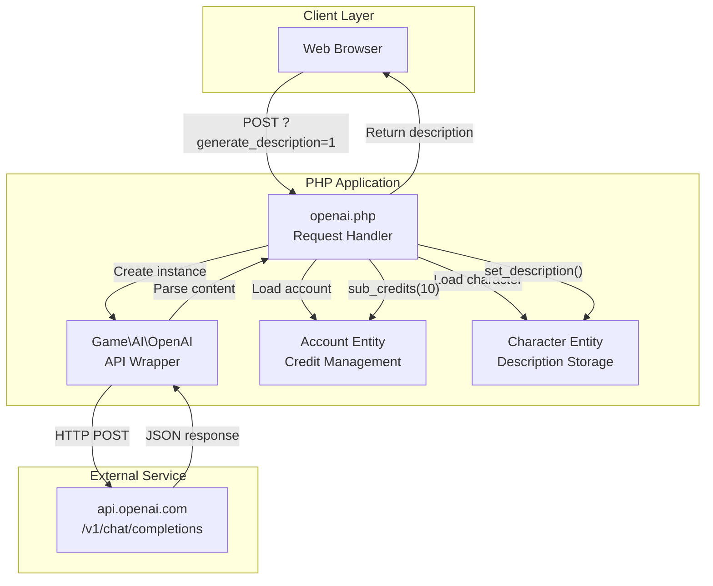
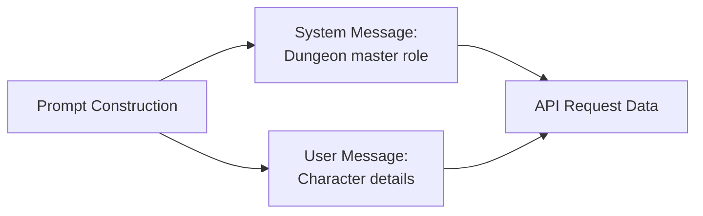
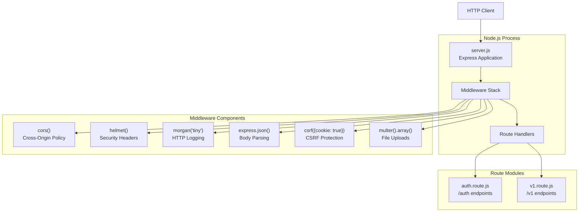
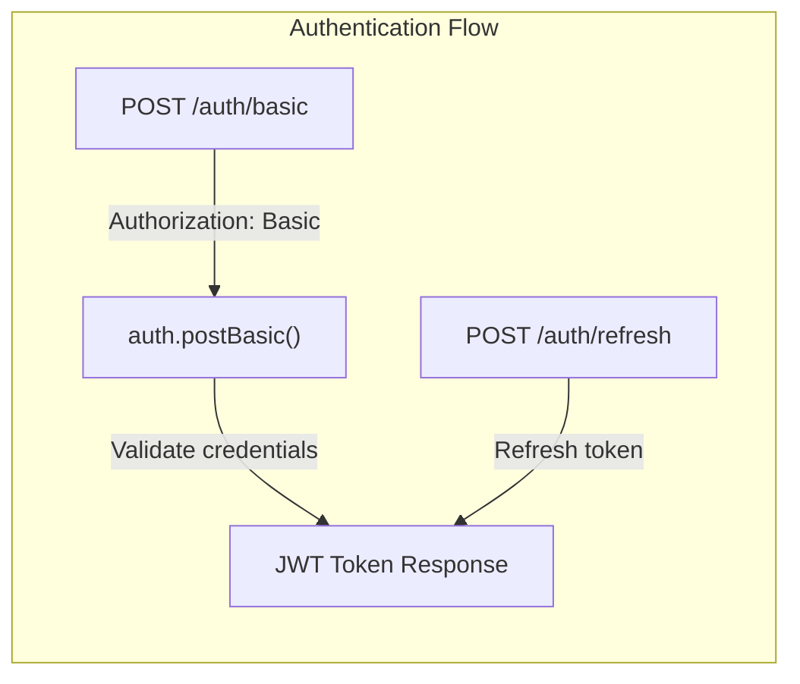
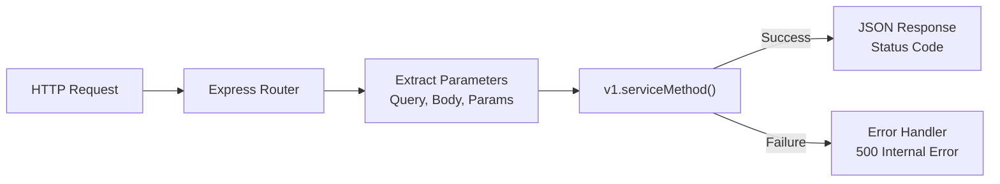
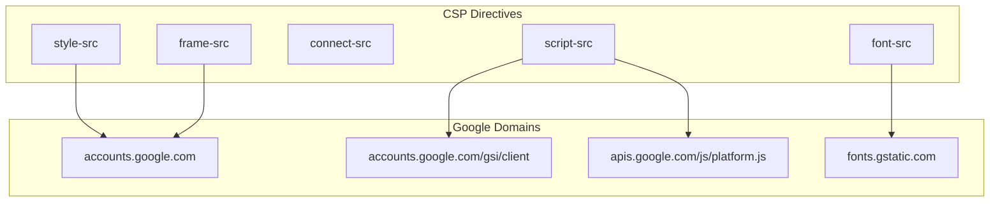
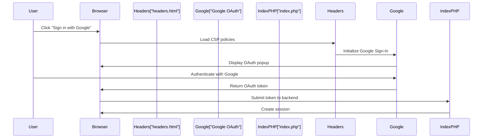

# External Integrations

<details>
<summary>Relevant source files</summary>

The following files were used as context for generating this wiki page:

- [api/package-lock.json](api/package-lock.json)
- [api/package.json](api/package.json)
- [api/routes/auth.route.js](api/routes/auth.route.js)
- [api/routes/v1.route.js](api/routes/v1.route.js)
- [api/server.js](api/server.js)
- [html/headers.html](html/headers.html)
- [openai.php](openai.php)

</details>


This document covers the third-party services and external APIs integrated into Legend of Aetheria. The system integrates three primary external services: OpenAI for AI-generated content, a Node.js REST API for alternative client access, and Google OAuth for social authentication. For information about internal data persistence and ORM, see [Database & Data Layer](#6). For security and authentication within the PHP application, see [Authentication & Authorization](#4).

---

## Overview

Legend of Aetheria integrates with external services across three primary domains:

| Integration | Technology | Purpose | Configuration |
|-------------|-----------|---------|---------------|
| OpenAI API | HTTP/REST | AI character descriptions | API key in `.env` |
| REST API | Node.js/Express | Alternative API access | Port 3000, JWT tokens |
| Google OAuth | OAuth 2.0 | Social authentication | Client ID in headers |

**Sources:** [html/headers.html:6](), [openai.php:47-52](), [api/server.js:1-13]()

---

## OpenAI Integration

### Purpose

The OpenAI integration provides AI-generated character descriptions through the GPT-3.5-turbo model. Users can generate unique, contextual descriptions for their characters based on race and name, consuming account credits for each generation.

**Sources:** [openai.php:1-97]()

### Architecture



**Diagram: OpenAI Request Flow**

**Sources:** [openai.php:17-93]()

### API Configuration

The OpenAI wrapper class `Game\AI\OpenAI` is instantiated with environment-based credentials:

| Configuration | Value | Source |
|--------------|-------|--------|
| API Key | `$_ENV['OPENAI_APIKEY']` | `.env` file |
| Endpoint | `https://api.openai.com/v1/chat/completions` | Hard-coded |
| Model | `gpt-3.5-turbo-1106` | Hard-coded |
| Max Tokens | 200 | Hard-coded |

**Sources:** [openai.php:47-55]()

### Request Structure

The system constructs OpenAI requests with a system message defining the AI's role and a user message containing the prompt:



**Diagram: OpenAI Prompt Structure**

**Sources:** [openai.php:57-72]()

### Credit System

Each character description generation consumes 10 credits from the user's account:

- Credits are checked before generation: `$account->get_credits()`
- Credits are deducted after successful generation: `$account->sub_credits(10)`
- The commented code at lines 25-31 shows an alternative minimum credit check implementation

**Sources:** [openai.php:22-31](), [openai.php:91]()

### Response Processing

The OpenAI response is processed to format the description:

1. JSON response is decoded: `json_decode($chatbot->doRequest(HttpMethod::POST, $data))`
2. Content extracted from: `$response->choices[0]->message->content`
3. Text split by periods and reformatted with double newlines
4. Description saved to character: `$character->set_description($description)`

**Sources:** [openai.php:74-90]()

---

## REST API

### Purpose

The Node.js Express-based REST API provides an alternative interface for accessing game functionality through HTTP endpoints with JWT authentication. This enables third-party clients, mobile applications, or external tools to interact with the game backend.

**Sources:** [api/server.js:1-64](), [api/package.json:1-26]()

### Server Architecture



**Diagram: Express Server Architecture**

**Sources:** [api/server.js:1-40]()

### Dependencies

The API uses the following Node.js packages:

| Package | Version | Purpose |
|---------|---------|---------|
| `express` | ^4.21.2 | Web framework |
| `express-jwt` | ^8.5.1 | JWT middleware |
| `jsonwebtoken` | ^9.0.2 | Token generation/verification |
| `bcrypt` | ^5.1.1 | Password hashing |
| `mysql` | ^2.18.1 | Database connectivity |
| `cors` | 2.8.5 | Cross-origin resource sharing |
| `helmet` | 8.1.0 | Security headers |
| `morgan` | 1.10.1 | HTTP request logging |
| `cookie-parser` | ^1.4.7 | Cookie parsing |
| `csurf` | ^1.11.0 | CSRF protection |
| `dotenv` | ^16.5.0 | Environment configuration |

**Sources:** [api/package.json:10-24]()

### Authentication Endpoints

The `/auth` route provides authentication functionality:



**Diagram: Authentication Endpoints**

The `/auth/basic` endpoint:
- Accepts Basic authentication header
- Decodes base64 credentials: `atob(req.headers.authorization.split(' ')[1])`
- Splits email and password by colon separator
- Delegates to `auth.postBasic()` service

**Sources:** [api/routes/auth.route.js:5-22]()

### API v1 Endpoints

The `/v1` route provides comprehensive RESTful endpoints:

| Endpoint Pattern | Methods | Purpose |
|-----------------|---------|---------|
| `/v1/account/:accountID` | GET | Retrieve account data |
| `/v1/characters` | GET, POST | List/create characters |
| `/v1/characters/:characterId` | GET | Get character details |
| `/v1/characters/:characterId/bank` | GET, POST | Bank operations |
| `/v1/characters/:characterId/battle` | POST | Combat actions |
| `/v1/characters/:characterId/familiar` | GET | Familiar data |
| `/v1/characters/:characterId/friends` | GET, POST | Friend management |
| `/v1/characters/:characterId/inventory` | GET | Inventory listing |
| `/v1/characters/:characterId/quests` | GET | Quest data |
| `/v1/mail` | GET, POST | Mail operations |
| `/v1/mail/:mailId` | GET, DELETE | Specific mail message |
| `/v1/market/listings` | GET, POST | Marketplace listings |
| `/v1/locations` | GET | Location data |
| `/v1/locations/:locationId/travel` | POST | Travel action |

**Sources:** [api/routes/v1.route.js:5-389]()

### Endpoint Pattern Structure

All v1 endpoints follow a consistent pattern:



**Diagram: Generic Endpoint Flow**

Each endpoint:
1. Extracts parameters from `req.params`, `req.query`, or `req.body`
2. Packages parameters into `options` object
3. Calls corresponding service method (e.g., `v1.getCharactersCharacterId()`)
4. Returns result with status code or 500 error

**Sources:** [api/routes/v1.route.js:72-87]()

### Server Configuration

The Express server is configured with:

```javascript
PORT = process.env.PORT || 3000
NODE_ENV = process.env.NODE_ENV || 'development'
```

Middleware stack order:
1. CORS (cross-origin requests)
2. Morgan (request logging)
3. Helmet (security headers)
4. JSON body parser
5. Text body parser
6. URL-encoded body parser
7. CSRF protection (duplicate declarations at lines 31 and 38)
8. Multer (multipart/form-data)
9. Static file serving from `public/`

**Sources:** [api/server.js:12-38]()

### Error Handling

The API implements two error handlers:

**404 Handler** - Catches undefined routes:
```javascript
res.status(404).send({ status: 404, error: 'Not found' });
```

**Global Error Handler** - Catches application errors:
```javascript
const status = err.status || 500;
const msg = err.error || err.message;
res.status(status).json({ status, error: msg });
```

**Sources:** [api/server.js:43-54]()

---

## Google OAuth Integration

### Purpose

Google OAuth 2.0 provides social authentication, allowing users to sign in with their Google accounts without creating separate credentials. This integration is configured through Content Security Policy headers and Google Sign-In meta tags.

**Sources:** [html/headers.html:6-18]()

### Client Configuration

The Google Sign-In client ID is declared in a meta tag:

```html
<meta name="google-signin-client_id" 
      content="905625455039-22nlqmke7jn849t3h7125i5tjtea89fb.apps.googleusercontent.com">
```

**Sources:** [html/headers.html:6]()

### Content Security Policy

The CSP headers whitelist Google domains for OAuth functionality:



**Diagram: Google OAuth CSP Configuration**

**Sources:** [html/headers.html:8-18]()

### CSP Policy Details

| Directive | Allowed Sources | Purpose |
|-----------|----------------|---------|
| `script-src` | `https://accounts.google.com/gsi/client`<br/>`https://apis.google.com/js/platform.js` | Google Sign-In JavaScript |
| `style-src` | `https://accounts.google.com`<br/>`https://cdn.jsdelivr.net/npm/*` | Google OAuth UI styles |
| `font-src` | `https://fonts.gstatic.com`<br/>`https://fonts.gstatic.com/*` | Google Fonts for UI |
| `frame-src` | `https://accounts.google.com` | OAuth popup/iframe |
| `connect-src` | `*` | API requests (unrestricted) |

**Sources:** [html/headers.html:9-18]()

### Cross-Origin Policy

The system sets a specific Cross-Origin-Opener-Policy to enable OAuth popups:

```html
<meta http-equiv="Cross-Origin-Opener-Policy" content="same-origin-allow-popups">
```

This policy allows Google's authentication popup windows to communicate with the parent window while maintaining security isolation.

**Sources:** [html/headers.html:7]()

### Integration Points



**Diagram: Google OAuth Authentication Flow**

The OAuth flow integrates with the main authentication system documented in [Login System](#4.2). The `headers.html` file provides the necessary CSP configuration and meta tags, while the actual OAuth token validation occurs in the backend authentication logic.

**Sources:** [html/headers.html:6-18]()