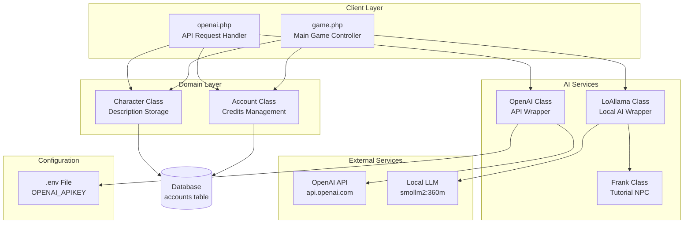
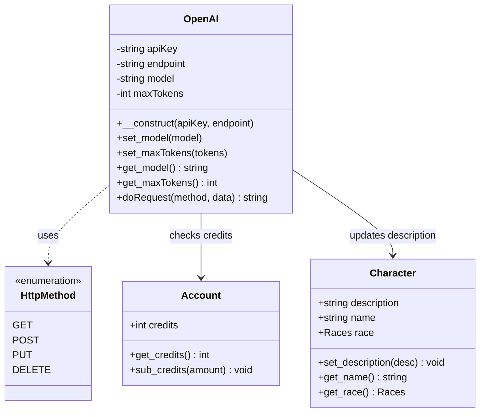
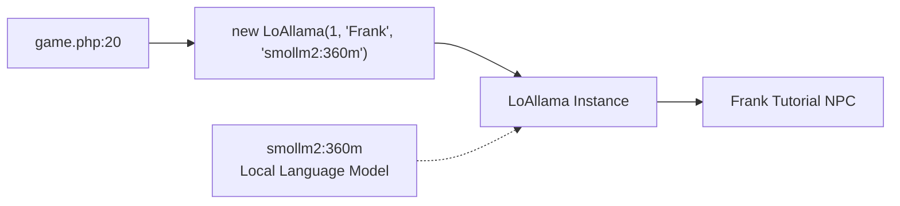
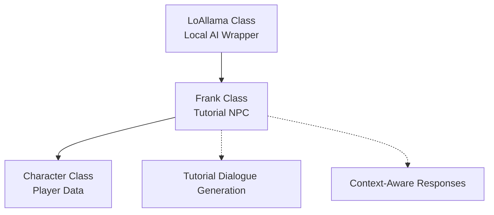
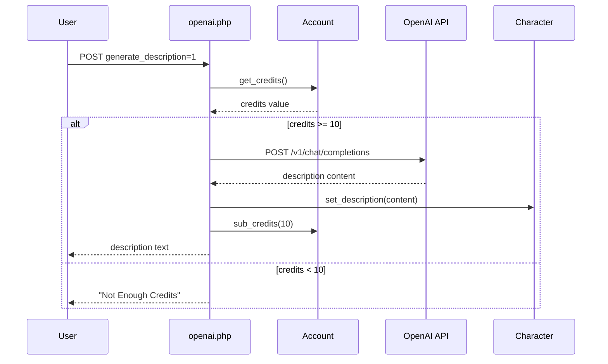
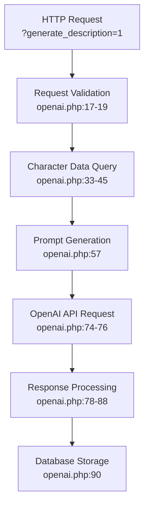
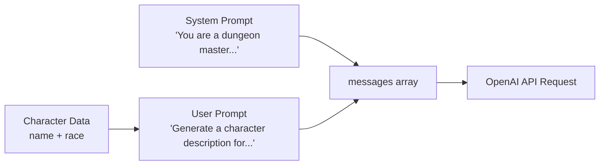
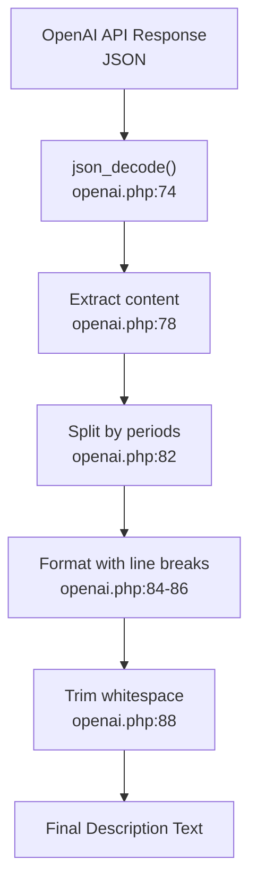
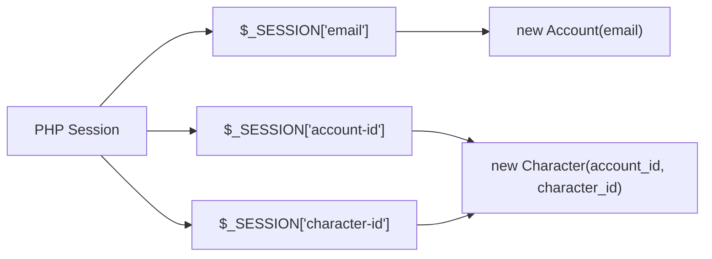
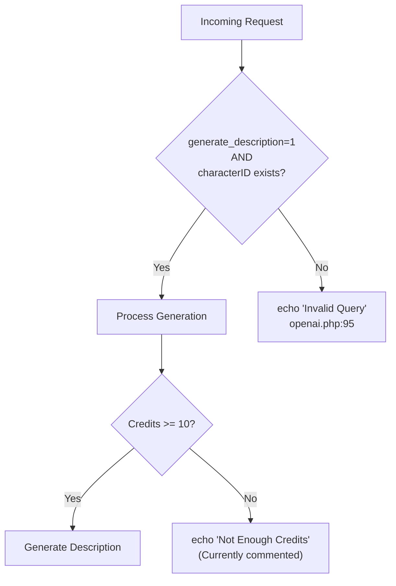

# OpenAI Integration

<details>
<summary>Relevant source files</summary>

The following files were used as context for generating this wiki page:

- [functions.php](functions.php)
- [game.php](game.php)
- [index.php](index.php)
- [openai.php](openai.php)

</details>


## Purpose and Scope

The OpenAI Integration system provides AI-powered content generation capabilities within Legend of Aetheria. This document covers the integration with OpenAI's API for generating character descriptions, the local LoAllama AI wrapper for NPC interactions, and the credit-based usage system that gates access to these features.

For information about the REST API system that provides authenticated access to game data, see [REST API](#8.2). For Google OAuth social authentication, see [Google OAuth](#8.3).

**Sources:** [openai.php:1-97](), [game.php:13-20]()

---

## System Architecture

The AI integration system consists of two primary components: an external OpenAI API integration for content generation and a local LoAllama wrapper for NPC interactions. The system uses a credit-based economy to manage API usage costs.

### AI Integration Components



**Sources:** [openai.php:1-97](), [game.php:13-20]()

---

## OpenAI API Integration

The `OpenAI` class provides a wrapper around OpenAI's chat completion API, specifically targeting the GPT-3.5-turbo model for character description generation.

### OpenAI Class Structure



**Sources:** [openai.php:7-8,49-76]()

### API Configuration

The OpenAI integration is configured through environment variables and runtime settings:

| Configuration | Value | Source |
|--------------|-------|--------|
| API Endpoint | `https://api.openai.com/v1/chat/completions` | [openai.php:47]() |
| Model | `gpt-3.5-turbo-1106` | [openai.php:54]() |
| Max Tokens | `200` | [openai.php:55]() |
| API Key | `$_ENV['OPENAI_APIKEY']` | [openai.php:50]() |

The API key is loaded from the `.env` file using the Dotenv library at [openai.php:9-10]().

**Sources:** [openai.php:9-10,47-55]()

---

## LoAllama Local AI

LoAllama is a local AI wrapper that provides NPC conversational capabilities without external API dependencies. It utilizes small language models that can run locally.

### LoAllama Instantiation



The LoAllama instance is created in `game.php` with the following parameters:
- **ID**: `1` - Instance identifier
- **Name**: `'Frank'` - NPC name reference
- **Model**: `'smollm2:360m'` - Small local language model (360M parameters)

**Sources:** [game.php:20]()

### Integration with NPC System



The `Frank` class from `Game\AI\NPC\Tutorial\Frank` namespace represents a tutorial NPC that uses the LoAllama AI for dynamic dialogue generation.

**Sources:** [game.php:15,20]()

---

## Credit System

The credit system acts as a rate-limiting and cost-management mechanism for AI-powered features. Accounts maintain a credit balance that is deducted when generating AI content.

### Credit Flow



**Sources:** [openai.php:22-31,90-91]()

### Credit Deduction Logic

The credit check and deduction logic is implemented at [openai.php:22-31]() and [openai.php:90-91](). Currently, the credit check is commented out (lines 25-31), but the deduction still occurs at line 91 with `$account->sub_credits(10)`.

| Operation | Cost | Implementation |
|-----------|------|----------------|
| Generate Character Description | 10 credits | [openai.php:91]() |
| Credit Balance Check | N/A | [openai.php:22]() |
| Credit Deduction | Variable | `Account::sub_credits(amount)` |

**Sources:** [openai.php:22-31,90-92]()

---

## Character Description Generation

Character description generation is the primary use case for the OpenAI integration. It generates lore-appropriate descriptions based on character race and name.

### Request Flow



**Sources:** [openai.php:17-93]()

### Request Parameters

The description generation endpoint expects the following parameters:

| Parameter | Type | Required | Description |
|-----------|------|----------|-------------|
| `generate_description` | int | Yes | Must be `1` to trigger generation |
| `characterID` | int | Yes | ID of the character to generate description for |

Validation occurs at [openai.php:17-19]().

**Sources:** [openai.php:17-19]()

### Prompt Engineering



The system uses a two-message conversation structure:

**System Message** [openai.php:64]():
```
"You are a dungeon master who generates highly-detailed character descriptions. Only the description."
```

**User Message** [openai.php:57,68]():
```
"Generate a character description for a(n) {race} named {name}"
```

This prompt engineering approach ensures:
- Context-appropriate tone (dungeon master perspective)
- Concise output (description only)
- Character-specific content (race and name integration)

**Sources:** [openai.php:57-72]()

### API Request Structure

The complete API request payload is constructed at [openai.php:59-72]():

```json
{
  "model": "gpt-3.5-turbo-1106",
  "messages": [
    {
      "role": "system",
      "content": "You are a dungeon master who generates highly-detailed character descriptions. Only the description."
    },
    {
      "role": "user",
      "content": "Generate a character description for a(n) {race} named {name}"
    }
  ],
  "max_tokens": 200
}
```

**Sources:** [openai.php:59-72]()

### Response Processing



The response processing pipeline:

1. **JSON Decoding** [openai.php:74-76](): Parse the API response JSON
2. **Content Extraction** [openai.php:78](): Extract `response->choices[0]->message->content`
3. **Sentence Splitting** [openai.php:82](): Split content by period delimiters
4. **Formatting** [openai.php:84-86](): Add double line breaks between sentences
5. **Trimming** [openai.php:88](): Remove excess whitespace

**Sources:** [openai.php:74-88]()

---

## Configuration and Setup

### Environment Variables

The OpenAI integration requires configuration through environment variables stored in `.env`:

| Variable | Purpose | Usage |
|----------|---------|-------|
| `OPENAI_APIKEY` | OpenAI API authentication key | [openai.php:50]() |

The `.env` file is loaded using `Dotenv\Dotenv::createImmutable(__DIR__)` at [openai.php:9-10]().

**Sources:** [openai.php:9-10,50]()

### Database Schema Requirements

The system requires the following database tables for credit and description management:

**Accounts Table** [openai.php:33-45]():
- `id` - Account identifier
- `credits` - Credit balance for AI operations

**Characters Table** [openai.php:33-45]():
- `name` - Character name for prompt generation
- `race` - Character race for prompt generation
- `account_id` - Foreign key to accounts table
- `description` - Generated description storage (implied)

**Sources:** [openai.php:33-45]()

---

## Session and Authentication

The OpenAI endpoint relies on session-based authentication to verify user identity and access permissions.

### Session Requirements



Required session variables:
- `$_SESSION['email']` - Used to instantiate Account object [openai.php:12]()
- `$_SESSION['account-id']` - Account ID for queries [openai.php:13,45]()
- `$_SESSION['character-id']` - Character ID for description assignment [openai.php:13]()

**Sources:** [openai.php:12-14]()

---

## Error Handling

The system implements basic error handling for invalid requests:



Error responses:
- **Invalid Query** [openai.php:95](): Returned when required parameters are missing
- **Not Enough Credits** [openai.php:26](): Returned when account has insufficient credits (currently commented out)

**Sources:** [openai.php:17-19,25-27,94-96]()

---

## Integration Points

### Game Controller Integration

The `game.php` controller initializes both AI systems at runtime:

```
$llama = new LoAllama(1, 'Frank', 'smollm2:360m');
```

This creates a LoAllama instance that is available for tutorial NPC interactions throughout the game session.

**Sources:** [game.php:20]()

### Character Sheet Integration

Character descriptions generated through the OpenAI API are stored using the `Character` class:

```
$character->set_description($description);
```

This persists the AI-generated content to the database for display on character sheets and profiles.

**Sources:** [openai.php:90]()

---

## Usage Example

A complete character description generation flow:

1. **Session Established**: User logged in with valid session
2. **AJAX Request**: Client sends `POST` to `openai.php` with `generate_description=1` and `characterID`
3. **Account Lookup**: System loads account via `new Account($_SESSION['email'])`
4. **Character Lookup**: System loads character via `new Character($account_id, $character_id)`
5. **Credit Check**: System verifies `$account->get_credits() >= 10` (currently bypassed)
6. **Prompt Construction**: System builds prompt using character name and race
7. **API Call**: System sends request to OpenAI with GPT-3.5-turbo model
8. **Response Processing**: System formats response with double line breaks
9. **Persistence**: System saves description via `$character->set_description()`
10. **Credit Deduction**: System deducts 10 credits via `$account->sub_credits(10)`
11. **Client Response**: System echoes formatted description text

**Sources:** [openai.php:1-97]()