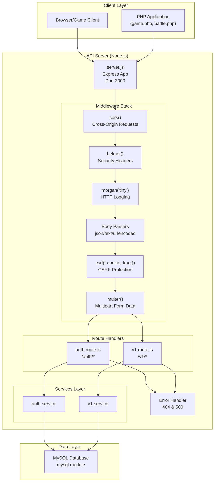
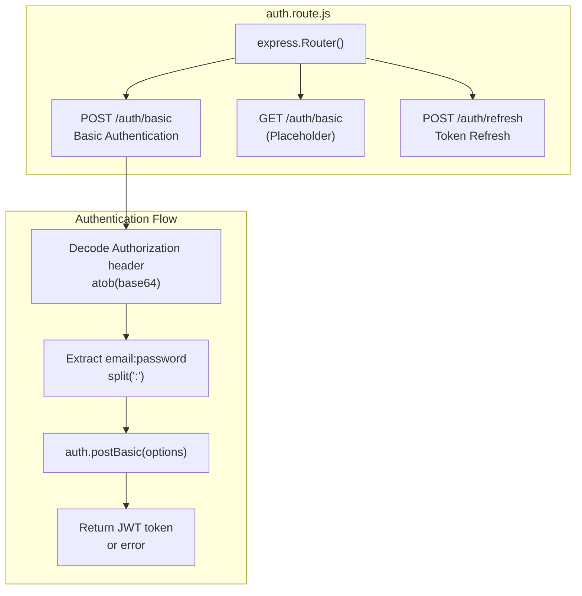
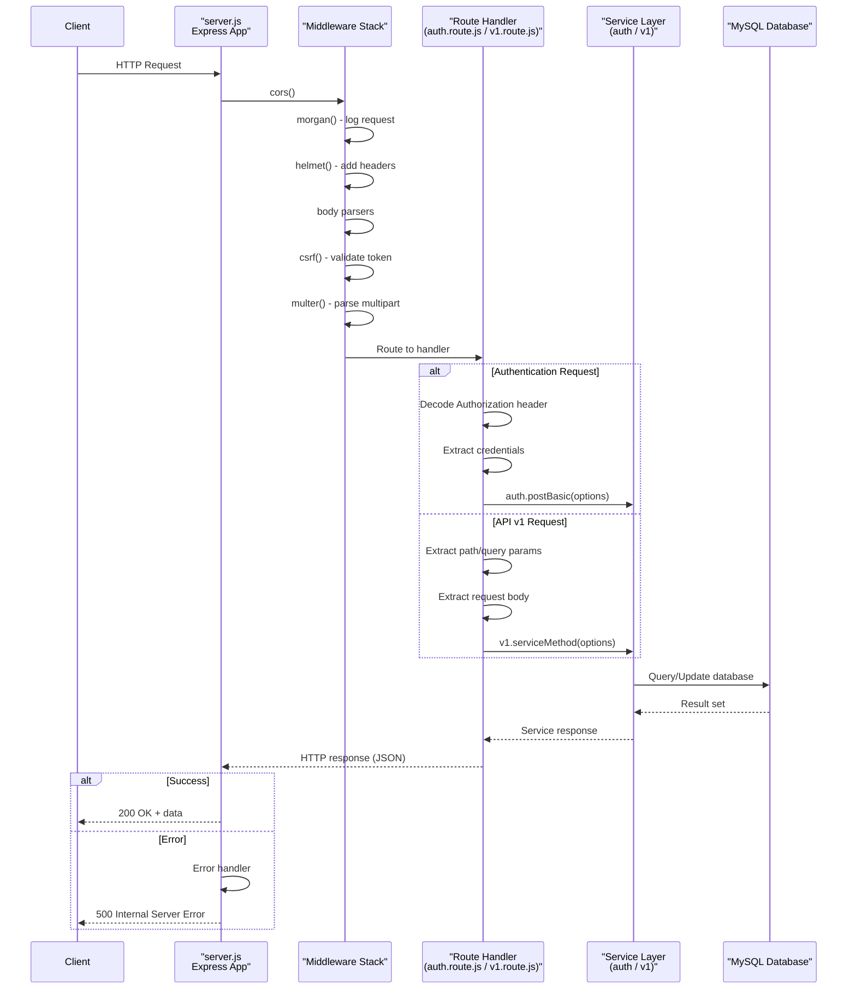
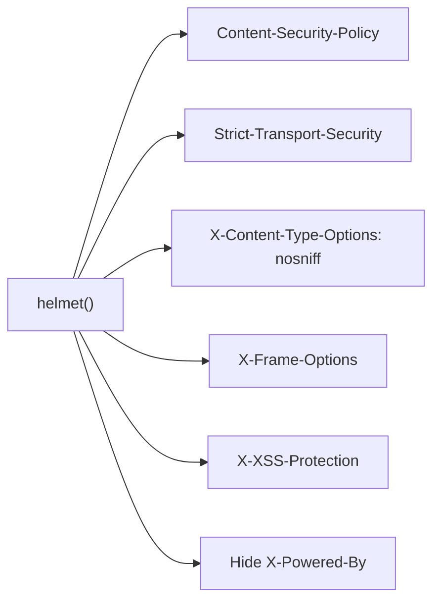

# REST API

<details>
<summary>Relevant source files</summary>

The following files were used as context for generating this wiki page:

- [api/package-lock.json](api/package-lock.json)
- [api/package.json](api/package.json)
- [api/routes/auth.route.js](api/routes/auth.route.js)
- [api/routes/v1.route.js](api/routes/v1.route.js)
- [api/server.js](api/server.js)

</details>


## Purpose and Scope

This document describes the Express-based Node.js REST API that serves as a backend service layer for Legend of Aetheria. The API provides RESTful endpoints for authentication, character management, combat, inventory, social features, and marketplace operations. It implements JWT-based authentication, CSRF protection, and integrates with the game's MySQL database.

For information about the main PHP application entry points, see [Entry Points](#3.1). For database schema details, see [Database Schema](#6.1).

---

## Architecture Overview

The REST API is built as a standalone Node.js service using Express 4.21.2, running independently from the main PHP application. It exposes two primary route namespaces: `/auth` for authentication operations and `/v1` for versioned game API endpoints.

### API System Architecture



**Sources:** [api/server.js:1-64](), [api/routes/auth.route.js:1-32](), [api/routes/v1.route.js:1-389]()

---

## Server Configuration

The Express server is configured in `server.js` with a comprehensive middleware stack and environment-based settings.

### Server Initialization

| Configuration | Value | Source |
|--------------|-------|--------|
| Port | `process.env.PORT \|\| 3000` | [api/server.js:12]() |
| Environment | `process.env.NODE_ENV \|\| 'development'` | [api/server.js:13]() |
| Entry Point | `server.js` | [api/package.json:5]() |
| Start Command | `node server.js` | [api/package.json:8]() |

### Core Dependencies

| Package | Version | Purpose |
|---------|---------|---------|
| `express` | ^4.21.2 | Web framework |
| `express-jwt` | ^8.5.1 | JWT authentication middleware |
| `jsonwebtoken` | ^9.0.2 | JWT token generation/verification |
| `bcrypt` | ^5.1.1 | Password hashing |
| `mysql` | ^2.18.1 | Database connectivity |
| `cors` | 2.8.5 | Cross-origin resource sharing |
| `helmet` | 8.1.0 | Security headers |
| `morgan` | 1.10.1 | HTTP request logging |
| `multer` | 2.0.2 | Multipart form data parsing |
| `csurf` | ^1.11.0 | CSRF token validation |
| `cookie-parser` | ^1.4.7 | Cookie parsing |
| `dotenv` | ^16.5.0 | Environment variable loading |

**Sources:** [api/package.json:10-24](), [api/server.js:1-13]()

### Middleware Pipeline


The middleware stack processes requests in the following order:

1. **CORS** - Enables cross-origin requests from browser clients
2. **Morgan** - Logs HTTP requests in 'tiny' format
3. **Helmet** - Adds security-related HTTP headers
4. **Body Parsers** - Parse JSON, text, and URL-encoded request bodies
5. **CSRF Protection** - Validates CSRF tokens (configured twice at lines 31 and 38)
6. **Multer** - Handles multipart/form-data file uploads
7. **Static Files** - Serves files from `public/` directory

**Sources:** [api/server.js:19-38]()

---

## Authentication System

The authentication system supports basic authentication with base64-encoded credentials and JWT token-based authentication for subsequent requests.

### Authentication Routes



### Basic Authentication Endpoint

**Route:** `POST /auth/basic`

The basic authentication endpoint extracts credentials from the `Authorization` header:

```
Authorization: Basic <base64(email:password)>
```

**Implementation Details:**
- Decodes base64 credentials: [api/routes/auth.route.js:8-9]()
- Splits on `:` to extract email and password
- Delegates to `auth.postBasic()` service
- Returns JSON response with JWT token or error
- Error handling returns HTTP 500 on exceptions

**Routes:**
- `POST /auth/basic` - Authenticate user [api/routes/auth.route.js:5-22]()
- `GET /auth/basic` - Placeholder (not implemented) [api/routes/auth.route.js:24-26]()
- `POST /auth/refresh` - Token refresh (not implemented) [api/routes/auth.route.js:28-30]()

**Sources:** [api/routes/auth.route.js:1-32]()

---

## API v1 Endpoints

The `/v1` namespace provides versioned RESTful endpoints for all game operations. All routes delegate to service layer functions for business logic implementation.

### Endpoint Categories

```mermaid
graph TB
    V1Router["v1.route.js<br/>express.Router()"]
    
    subgraph "Account Management"
        GetAccount["GET /v1/account/:accountID"]
    end
    
    subgraph "Character Operations"
        GetCharacters["GET /v1/characters"]
        PostCharacters["POST /v1/characters"]
        GetCharacter["GET /v1/characters/:characterId"]
        GetInventory["GET /v1/characters/:characterId/inventory"]
        GetQuests["GET /v1/characters/:characterId/quests"]
    end
    
    subgraph "Combat & Progression"
        PostBattle["POST /v1/characters/:characterId/battle"]
        GetFamiliar["GET /v1/characters/:characterId/familiar"]
    end
    
    subgraph "Economy"
        GetBank["GET /v1/characters/:characterId/bank"]
        PostBank["POST /v1/characters/:characterId/bank"]
        GetMarketListings["GET /v1/market/listings"]
        PostMarketListings["POST /v1/market/listings"]
        PostPurchase["POST /v1/market/listings/:listingId/purchase"]
    end
    
    subgraph "Social Features"
        GetFriends["GET /v1/characters/:characterId/friends"]
        PostFriends["POST /v1/characters/:characterId/friends"]
        GetMail["GET /v1/mail"]
        PostMail["POST /v1/mail"]
        GetMailById["GET /v1/mail/:mailId"]
        DeleteMail["DELETE /v1/mail/:mailId"]
    end
    
    subgraph "World Navigation"
        GetLocations["GET /v1/locations"]
        PostTravel["POST /v1/locations/:locationId/travel"]
    end
    
    V1Router --> GetAccount
    V1Router --> GetCharacters
    V1Router --> PostCharacters
    V1Router --> GetCharacter
    V1Router --> GetInventory
    V1Router --> GetQuests
    V1Router --> PostBattle
    V1Router --> GetFamiliar
    V1Router --> GetBank
    V1Router --> PostBank
    V1Router --> GetMarketListings
    V1Router --> PostMarketListings
    V1Router --> PostPurchase
    V1Router --> GetFriends
    V1Router --> PostFriends
    V1Router --> GetMail
    V1Router --> PostMail
    V1Router --> GetMailById
    V1Router --> DeleteMail
    V1Router --> GetLocations
    V1Router --> PostTravel
```



### Account Endpoints

| Method | Path | Parameters | Description |
|--------|------|------------|-------------|
| GET | `/v1/account/:accountID` | `accountID` (path) | Retrieve account details |

**Implementation:** [api/routes/v1.route.js:5-21]()

### Character Endpoints

| Method | Path | Parameters | Description |
|--------|------|------------|-------------|
| GET | `/v1/characters` | None | List all characters |
| POST | `/v1/characters` | Body: character data | Create new character |
| GET | `/v1/characters/:characterId` | `characterId` (path) | Get character details |
| GET | `/v1/characters/:characterId/inventory` | `characterId` (path) | Get character inventory |
| GET | `/v1/characters/:characterId/quests` | `characterId` (path), `status` (query) | Get character quests filtered by status |

**Implementation:**
- List characters: [api/routes/v1.route.js:39-53]()
- Create character: [api/routes/v1.route.js:55-70]()
- Get character: [api/routes/v1.route.js:72-87]()
- Get inventory: [api/routes/v1.route.js:195-210]()
- Get quests: [api/routes/v1.route.js:212-228]()

### Combat & Familiar Endpoints

| Method | Path | Parameters | Description |
|--------|------|------------|-------------|
| POST | `/v1/characters/:characterId/battle` | `characterId` (path), Body: battle action | Execute battle action |
| GET | `/v1/characters/:characterId/familiar` | `characterId` (path) | Get character's familiar |

**Implementation:**
- Battle: [api/routes/v1.route.js:124-140]()
- Familiar: [api/routes/v1.route.js:142-157]()

### Economy Endpoints

| Method | Path | Parameters | Description |
|--------|------|------------|-------------|
| GET | `/v1/characters/:characterId/bank` | `characterId` (path) | Get bank account details |
| POST | `/v1/characters/:characterId/bank` | `characterId` (path), Body: transaction | Execute bank transaction |
| GET | `/v1/market/listings` | `maxPrice`, `minLevel`, `rarity`, `type` (query) | Search marketplace listings |
| POST | `/v1/market/listings` | Body: listing data | Create marketplace listing |
| POST | `/v1/market/listings/:listingId/purchase` | `listingId` (path) | Purchase marketplace item |

**Implementation:**
- Get bank: [api/routes/v1.route.js:89-104]()
- Bank transaction: [api/routes/v1.route.js:106-122]()
- Get listings: [api/routes/v1.route.js:335-353]()
- Create listing: [api/routes/v1.route.js:355-370]()
- Purchase item: [api/routes/v1.route.js:372-387]()

### Social Feature Endpoints

| Method | Path | Parameters | Description |
|--------|------|------------|-------------|
| GET | `/v1/characters/:characterId/friends` | `characterId` (path), `status` (query) | Get friends list filtered by status |
| POST | `/v1/characters/:characterId/friends` | `characterId` (path), Body: friend data | Send friend request or update status |
| GET | `/v1/mail` | `folder`, `limit`, `page` (query) | Get mail messages with pagination |
| POST | `/v1/mail` | Body: mail data | Send mail message |
| GET | `/v1/mail/:mailId` | `mailId` (path) | Get specific mail message |
| DELETE | `/v1/mail/:mailId` | `mailId` (path) | Delete mail message |

**Implementation:**
- Get friends: [api/routes/v1.route.js:159-175]()
- Manage friends: [api/routes/v1.route.js:177-193]()
- List mail: [api/routes/v1.route.js:265-282]()
- Send mail: [api/routes/v1.route.js:284-299]()
- Get mail: [api/routes/v1.route.js:301-316]()
- Delete mail: [api/routes/v1.route.js:318-333]()

### World Navigation Endpoints

| Method | Path | Parameters | Description |
|--------|------|------------|-------------|
| GET | `/v1/locations` | `floor` (query) | Get locations filtered by floor |
| POST | `/v1/locations/:locationId/travel` | `locationId` (path), Body: travel data | Travel to location |

**Implementation:**
- Get locations: [api/routes/v1.route.js:230-245]()
- Travel: [api/routes/v1.route.js:247-263]()

**Sources:** [api/routes/v1.route.js:1-389]()

---

## Request/Response Flow

The following diagram illustrates the complete request lifecycle from client to database and back:



### Error Handling

The API implements two error handlers:

**404 Not Found Handler** [api/server.js:43-46]()
```
Returns: { status: 404, error: 'Not found' }
```

**500 Internal Server Error Handler** [api/server.js:49-54]()
```
Captures: err.status, err.error, err.message
Returns: { status: <code>, error: <message> }
```

**Sources:** [api/server.js:1-64](), [api/routes/auth.route.js:1-32](), [api/routes/v1.route.js:1-389]()

---

## Security Middleware

The API implements multiple security layers through middleware:

### Security Components

| Middleware | Purpose | Configuration |
|-----------|---------|---------------|
| `helmet()` | Sets security-related HTTP headers | Default configuration |
| `cors()` | Enables CORS for cross-origin requests | Unrestricted access |
| `csrf({ cookie: true })` | Validates CSRF tokens stored in cookies | Cookie-based tokens |
| `express.json()` | Parses JSON bodies, prevents prototype pollution | Default limits |
| `express.urlencoded()` | Parses URL-encoded forms | `{ extended: true }` |

### Security Headers Applied by Helmet



**Note:** The CSRF middleware is initialized twice in the codebase ([api/server.js:31]() and [api/server.js:38]()), which may be redundant.

**Sources:** [api/server.js:19-38](), [api/package.json:10-24]()

---

## Module Exports and Integration

The server exports the Express application instance for testing and external integration:

```javascript
module.exports = app;
```

**Export Location:** [api/server.js:56]()

The server starts listening on the configured port:

```javascript
app.listen(PORT, () => {
    console.log(
        `Express Server started on Port ${app.get('port')} | Environment : ${app.get('env')}`
    );
});
```

**Startup:** [api/server.js:58-64]()

**Sources:** [api/server.js:56-64]()