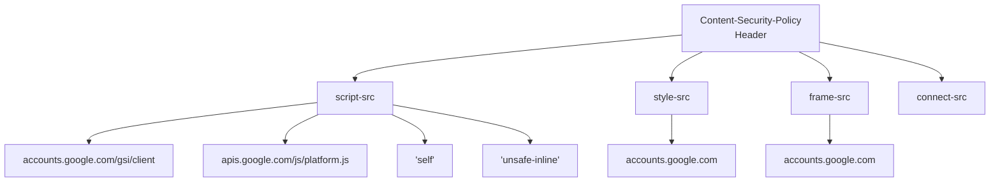
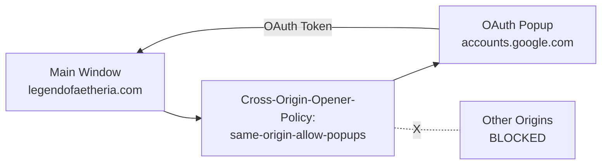
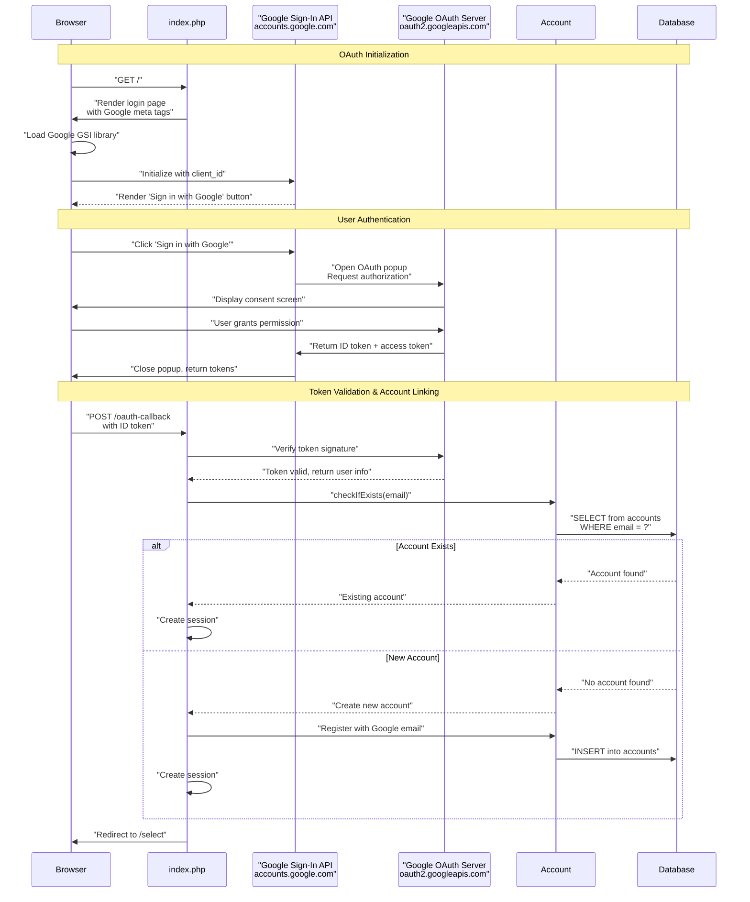
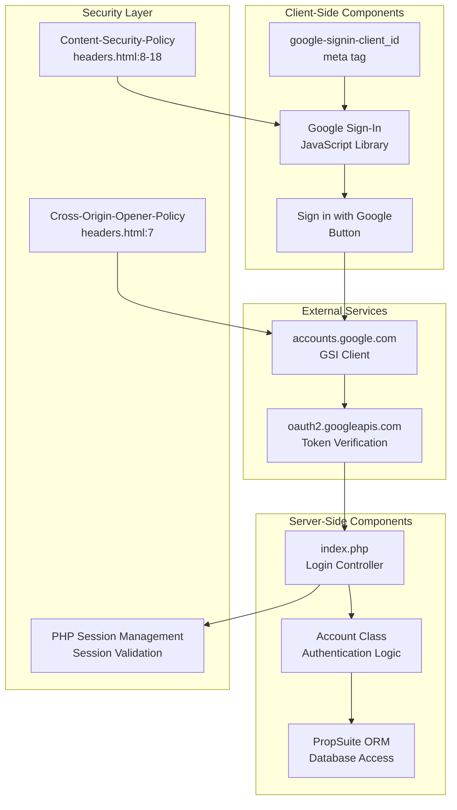
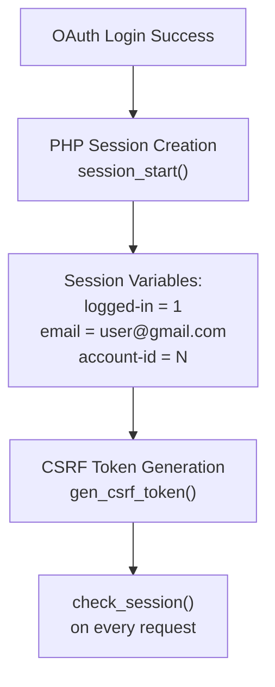
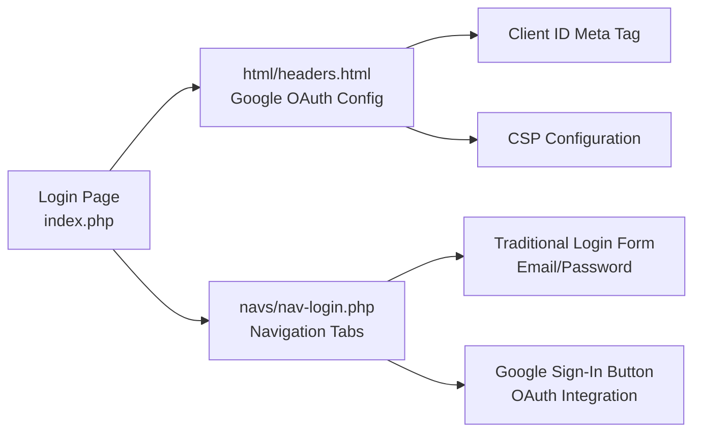

# Google OAuth

<details>
<summary>Relevant source files</summary>

The following files were used as context for generating this wiki page:

- [html/headers.html](html/headers.html)
- [js/functions.js](js/functions.js)
- [navs/nav-login.php](navs/nav-login.php)

</details>


This document describes the Google OAuth 2.0 integration in Legend of Aetheria, which provides social login functionality as an alternative to traditional email/password authentication. For information about the traditional authentication flow, see [Login System](#4.2). For details about the overall authentication and authorization architecture, see [Authentication & Authorization](#4).

## Purpose and Scope

The Google OAuth integration allows users to authenticate using their Google accounts through the Google Sign-In API. This implementation leverages Google's Identity Services to streamline the registration and login process while maintaining security through proper Content Security Policy (CSP) configuration and Cross-Origin Resource Sharing (CORS) controls.

---

## Configuration

### Client ID Registration

The Google OAuth client ID is configured as a meta tag in the HTML headers, making it available to the Google Sign-In JavaScript library.

**Client ID Configuration**

| Configuration Element | Value | Location |
|----------------------|-------|----------|
| Client ID | `905625455039-22nlqmke7jn849t3h7125i5tjtea89fb.apps.googleusercontent.com` | [html/headers.html:6]() |
| Meta Tag Name | `google-signin-client_id` | [html/headers.html:6]() |
| Cross-Origin Policy | `same-origin-allow-popups` | [html/headers.html:7]() |

The client ID is embedded directly in the page metadata to enable client-side OAuth initialization:

```html
<meta name="google-signin-client_id" content="905625455039-22nlqmke7jn849t3h7125i5tjtea89fb.apps.googleusercontent.com">
```

Sources: [html/headers.html:6]()

### Content Security Policy

The CSP configuration explicitly allows Google OAuth resources while maintaining strict security boundaries for other content sources.

**CSP Directives for Google OAuth**



**CSP Directive Breakdown**

| Directive | Allowed Sources | Purpose |
|-----------|----------------|---------|
| `script-src` | `'self'`, `'unsafe-inline'`, `https://accounts.google.com/gsi/client`, `https://apis.google.com/js/platform.js` | Permits Google Sign-In JavaScript libraries |
| `style-src` | `'self'`, `'unsafe-inline'`, `https://accounts.google.com` | Allows Google OAuth modal styling |
| `frame-src` | `'self'`, `https://accounts.google.com` | Enables OAuth popup windows and iframes |
| `connect-src` | `*` | Permits AJAX requests to Google OAuth endpoints |

Sources: [html/headers.html:8-18]()

### Cross-Origin Configuration

The `Cross-Origin-Opener-Policy` is set to `same-origin-allow-popups` to enable Google OAuth popup windows while maintaining isolation from other origins.



This policy allows:
- OAuth popup windows from `accounts.google.com`
- Token exchange between popup and main window
- Isolation from other cross-origin contexts

Sources: [html/headers.html:7]()

---

## OAuth Flow Architecture

The Google OAuth integration follows the OAuth 2.0 authorization code flow with client-side token handling.

### Authentication Sequence



Sources: [html/headers.html:6-18]()

### OAuth Component Mapping



Sources: [html/headers.html:6-18]()

---

## Security Implementation

### CSP-Based Protection

The Content Security Policy provides defense-in-depth for the OAuth integration by restricting which resources can load and execute.

**Security Boundaries**

| Threat Vector | CSP Mitigation | Implementation |
|---------------|----------------|----------------|
| Malicious Script Injection | Whitelist `accounts.google.com` and `apis.google.com` only | [html/headers.html:9]() |
| Cross-Site Framing | Restrict `frame-src` to `accounts.google.com` | [html/headers.html:15]() |
| Style Injection | Limit `style-src` to Google domains | [html/headers.html:10]() |
| Data Exfiltration | Control `connect-src` destinations | [html/headers.html:13]() |

Sources: [html/headers.html:8-18]()

### Token Validation

While the complete token validation code is not visible in the provided files, the OAuth flow requires:

1. **ID Token Verification**: Server-side validation of JWT signatures using Google's public keys
2. **Audience Check**: Ensuring the token's `aud` claim matches the registered client ID
3. **Expiration Validation**: Verifying the token hasn't expired
4. **Issuer Validation**: Confirming the token was issued by `accounts.google.com`

### Session Security Integration

OAuth-authenticated users follow the same session security model as traditional login users:



After OAuth authentication, the session management follows the same patterns documented in [Session Management](#3.2), including:
- CSRF token generation and validation
- Session ID regeneration
- Session variable storage for user context

Sources: [html/headers.html:41-58]()

---

## Integration Points

### Login Page Integration

The Google OAuth integration is embedded in the login interface alongside traditional authentication methods. While the specific button implementation is not visible in [navs/nav-login.php](), the infrastructure is configured in [html/headers.html]().

**Login Page Component Structure**



Sources: [html/headers.html:6](), [navs/nav-login.php:36-66]()

### Account Class Integration

OAuth-authenticated users are processed through the same `Account` class used for traditional authentication:

**Account Lookup Flow**

| Method | Purpose | Usage in OAuth |
|--------|---------|----------------|
| `Account::checkIfExists(email)` | Check if email exists in database | Verify if Google email has existing account |
| `Account::get_id()` | Retrieve account ID | Link OAuth session to account |
| `Account::get_privileges()` | Get account privilege level | Apply same authorization rules |

OAuth users receive the same privilege system treatment as traditional users, requiring email verification and following the same privilege escalation path (UNVERIFIED → USER → MODERATOR → ADMINISTRATOR).

Sources: [html/headers.html:6-18]()

### Session Context Binding

Once OAuth authentication succeeds, the same session variables used for traditional login are populated:

```javascript
var loa = {
   u_email: "<?php echo $_SESSION['email']; ?>",
     u_aid: "<?php echo $_SESSION['account-id']; ?>",
    u_csrf: "<?php echo $_SESSION['csrf-token']; ?>",
     u_sid: "<?php echo session_id(); ?>",
     chat_pos: 0,
     chat_history: [],
};
```

These JavaScript globals are populated from PHP session state regardless of authentication method, ensuring OAuth and traditional logins have identical post-authentication experiences.

Sources: [html/headers.html:49-56]()

---

## Configuration Summary

### Required Meta Tags

```html
<meta name="google-signin-client_id" content="[CLIENT_ID]">
<meta http-equiv="Cross-Origin-Opener-Policy" content="same-origin-allow-popups">
```

### Required CSP Directives

- `script-src`: Must include `https://accounts.google.com/gsi/client` and `https://apis.google.com/js/platform.js`
- `style-src`: Must include `https://accounts.google.com`
- `frame-src`: Must include `https://accounts.google.com`
- `connect-src`: Must allow requests to Google OAuth endpoints

### Configuration Files

| File | Purpose | Key Elements |
|------|---------|--------------|
| [html/headers.html]() | OAuth initialization | Client ID, CSP, COOP |
| [navs/nav-login.php]() | Login interface | Traditional + OAuth forms |
| [index.php]() (inferred) | OAuth callback handler | Token validation, account linking |

Sources: [html/headers.html:1-65](), [navs/nav-login.php:1-427]()