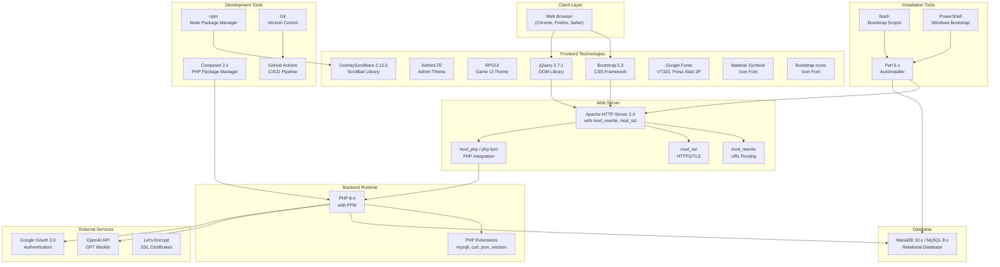
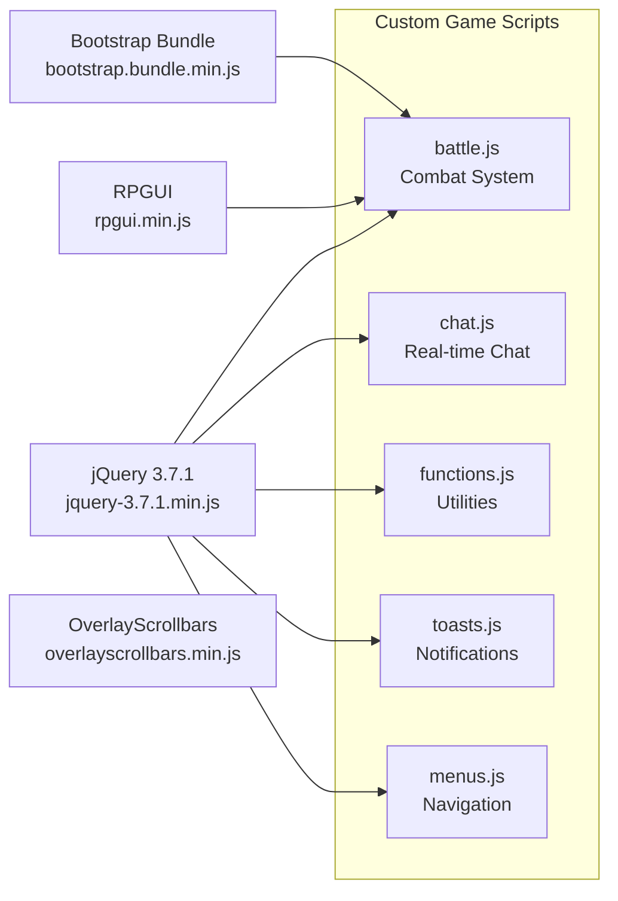

# Technology Stack

<details>
<summary>Relevant source files</summary>

The following files were used as context for generating this wiki page:

- [CONTRIBUTING.md](CONTRIBUTING.md)
- [README.md](README.md)
- [html/headers.html](html/headers.html)
- [package-lock.json](package-lock.json)
- [package.json](package.json)

</details>


## Purpose and Scope

This document provides a comprehensive reference of all technologies, frameworks, libraries, and external services used in Legend of Aetheria. It covers backend runtime environments, web server infrastructure, frontend frameworks, JavaScript libraries, external API integrations, and development tooling. 

For information about the overall system architecture and how these components interact, see [System Architecture](#1.1). For installation and configuration of these technologies, see [Installation & Setup](#2).

---

## Stack Overview

Legend of Aetheria is built as a traditional server-rendered web application with progressive enhancement. The stack follows a LAMP-like architecture (Linux, Apache, MariaDB, PHP) with modern frontend frameworks and external service integrations.

### Technology Stack Layers



**Sources:** [README.md:1-320](), [html/headers.html:1-65](), [package.json:1-5]()

---

## Backend Technologies

### PHP 8.4 Runtime

Legend of Aetheria requires **PHP 8.4** specifically, installed via the Sury repository on Debian/Ubuntu systems. PHP 8.4 provides modern language features including property hooks, asymmetric visibility, and improved performance.

#### Required PHP Extensions

| Extension | Purpose |
|-----------|---------|
| `php8.4-cli` | Command-line interface for cron jobs and scripts |
| `php8.4-common` | Core PHP functionality |
| `php8.4-curl` | HTTP client for external API requests (OpenAI, Google) |
| `php8.4-dev` | Development headers for building extensions |
| `php8.4-fpm` | FastCGI Process Manager for high-performance PHP execution |
| `php8.4-mysql` | MySQLi extension for database connectivity |

#### PHP Configuration

The application requires specific `php.ini` settings for security and session management:

```ini
expose_php = off                      # Hide PHP version from headers
error_reporting = E_NONE              # Disable error reporting in production
allow_url_fopen = Off                 # Prevent remote file inclusion
session.gc_maxlifetime = 600          # 10-minute session timeout
session.cookie_secure = 1             # HTTPS-only cookies
session.use_strict_mode = 1           # Strict session ID validation
session.cookie_httponly = 1           # Prevent JavaScript cookie access
session.cookie_samesite = Strict      # CSRF protection
```

**Sources:** [README.md:71-77](), [README.md:238-258]()

### Web Server (Apache)

The application uses **Apache HTTP Server 2.4** with several critical modules:

| Module | Purpose |
|--------|---------|
| `mod_rewrite` | URL rewriting for clean URLs and routing |
| `mod_ssl` | HTTPS/TLS encryption |
| `mod_php` or `php-fpm` | PHP integration |
| `mod_headers` | HTTP header manipulation |
| `mod_http2` | HTTP/2 protocol support (optional) |

#### Apache Module Configuration

```bash
# For PHP-FPM (recommended):
a2dismod mpm_prefork php*
a2enmod headers http2 ssl setenvif mpm_event proxy_fcgi
a2enconf php8.4-fpm

# For mod_php (alternative):
a2enmod php8.4 headers http2 ssl
```

**Sources:** [README.md:193-203]()

### Database (MariaDB/MySQL)

The application supports both **MariaDB 10.x** and **MySQL 8.x** as the relational database backend. The database stores all game state, including:

- Account credentials and privileges
- Character data, stats, and inventory
- Monster definitions and encounter states
- Mail messages and friend relationships
- Familiar (pet) data and progression

Database access is abstracted through the `PropSuite` trait, which provides an ORM-like interface with prepared statements for security. See [PropSuite ORM](#6.2) for details.

**Sources:** [README.md:76](), Diagram 1 from high-level architecture

---

## Frontend Frameworks

### Bootstrap 5.3

**Bootstrap 5.3** serves as the foundational CSS framework, providing:

- Responsive grid system
- Pre-built UI components (buttons, cards, modals, forms)
- Utility classes for spacing, typography, and layout
- JavaScript components (dropdowns, tooltips, modals)

The framework is loaded via:
- CSS: `/css/bootstrap.min.css`
- JavaScript: `/js/bootstrap.bundle.min.js` (includes Popper.js)

**Sources:** [html/headers.html:21](), [html/headers.html:32](), [README.md:3]()

### AdminLTE

**AdminLTE** is a heavily modified admin dashboard theme layered on top of Bootstrap. The modifications adapt it to work with PHP and MySQL in a more modular fashion. AdminLTE provides:

- Admin panel layout and navigation
- Dashboard widgets and cards
- Sidebar navigation components
- Data table styling

The CSS is loaded at: `/css/adminlte.min.css`

**Sources:** [html/headers.html:25](), [README.md:3]()

### RPGUI

**RPGUI** (from [RonenNess/RPGUI](https://github.com/RonenNess/RPGUI)) provides game-themed UI components with a retro RPG aesthetic:

- Styled buttons, containers, and frames
- Health/mana bars
- Dialog boxes and menus
- Inventory and equipment slots

```javascript
// RPGUI must be initialized after DOM load
RPGUI.create();
```

Files:
- CSS: `/css/rpgui.min.css`
- JavaScript: `/js/rpgui.min.js`

**Sources:** [html/headers.html:28-30]()

### Typography and Icons

#### Google Fonts

The application uses Google Fonts for retro gaming aesthetics:

| Font | Usage |
|------|-------|
| **VT323** | Monospace font for code/terminal-like text |
| **Press Start 2P** | Pixel-art font for headings and game text |

Fonts are loaded via: `/css/gfonts.css`

#### Icon Systems

Two icon systems are available:

1. **Material Symbols** - Google's icon font for modern UI elements
2. **Bootstrap Icons** - Icon set from Bootstrap framework at `/css/bootstrap-icons.min.css`

**Sources:** [html/headers.html:22-23](), [html/headers.html:38-39]()

---

## JavaScript Libraries

### Core Libraries



**Sources:** [html/headers.html:29-33](), Diagram 6 from high-level architecture

### jQuery 3.7.1

**jQuery 3.7.1** provides DOM manipulation, AJAX, and event handling. The application uses jQuery extensively for:

- AJAX requests to `game.php`, `battle.php`, and other endpoints
- DOM updates without page reloads
- Event binding for user interactions
- Form submission and validation

Loaded at: `/js/jquery-3.7.1.min.js`

**Sources:** [html/headers.html:33]()

### OverlayScrollbars 2.12.0

**OverlayScrollbars 2.12.0** provides custom scrollbar styling for game panels and chat windows. This is the only Node.js dependency managed via npm.

```json
{
  "dependencies": {
    "overlayscrollbars": "^2.12.0"
  }
}
```

Files:
- CSS: `/css/overlayscrollbars.min.css`
- JavaScript: Bundled with Bootstrap or loaded separately

**Sources:** [package.json:1-5](), [package-lock.json:11-16](), [html/headers.html:26]()

### Custom JavaScript Modules

The application includes several custom JavaScript modules for game-specific functionality:

| Module | File | Purpose |
|--------|------|---------|
| Battle System | `battle.js` | Combat mechanics, turn processing, damage calculation |
| Chat System | `chat.js` | Real-time chat interface, message polling |
| Utilities | `functions.js` | Helper functions, AJAX wrappers, utilities |
| Notifications | `toasts.js` | Toast notification system |
| Navigation | `menus.js` | Menu state management, active page highlighting |

These modules are loaded in `footers.html` after the core libraries.

**Sources:** Diagram 6 from high-level architecture, [html/headers.html:49-57]()

---

## External Service Integrations

### OpenAI API

The application integrates with **OpenAI's API** (GPT models) for AI-generated content:

- Character description generation
- Dynamic narrative text
- Content personalization

The integration uses the `php8.4-curl` extension for HTTP requests. API keys are configured during installation and stored securely.

**Sources:** Diagram 1 from high-level architecture, [README.md:66]()

### Google OAuth 2.0

**Google OAuth 2.0** provides social authentication as an alternative to traditional email/password login. The integration uses:

- Client ID: `905625455039-22nlqmke7jn849t3h7125i5tjtea89fb.apps.googleusercontent.com`
- Google Sign-In JavaScript library
- OAuth flow for secure token exchange

Configuration in headers:

```html
<meta name="google-signin-client_id" content="905625455039-...">
<script src="https://accounts.google.com/gsi/client"></script>
```

**Sources:** [html/headers.html:6](), [html/headers.html:9-10]()

### Let's Encrypt

**Let's Encrypt** provides free SSL/TLS certificates for HTTPS encryption. The installation process uses:

- `certbot` - ACME client for certificate issuance
- `python3-certbot-apache` - Apache integration plugin

Certificates are automatically configured in Apache virtual hosts with HSTS headers:

```apacheconf
Header always set Strict-Transport-Security "max-age=63072000"
```

**Sources:** [README.md:77](), [README.md:137](), [README.md:213-218]()

---

## Package Management

### Composer (PHP Dependencies)

**Composer 2.x** manages PHP dependencies defined in `composer.json`. Installation command:

```bash
sudo -u www-data composer --working-dir <GAME_WEB_ROOT> install
```

Composer is used to install and update PHP libraries, though the specific dependencies are not visible in the provided files. The `composer.lock` file ensures reproducible builds.

**Sources:** [README.md:263-270]()

### npm (Node Dependencies)

**npm** manages JavaScript dependencies defined in `package.json`. Currently, the only managed dependency is:

```json
{
  "dependencies": {
    "overlayscrollbars": "^2.12.0"
  }
}
```

The `package-lock.json` file locks the exact version (2.12.0) for reproducible installations.

**Sources:** [package.json:1-5](), [package-lock.json:1-18]()

---

## Development and Build Tools

### Version Control (Git)

The codebase is hosted on **GitHub** and uses **Git** for version control. Standard installation begins with:

```bash
git clone https://github.com/Ziddykins/LegendOfAetheria
```

**Sources:** [README.md:17]()

### CI/CD (GitHub Actions)

**GitHub Actions** provides automated continuous integration and deployment pipelines:

- **CodeQL** - Static security analysis scanning
- **Codacy** - Code quality analysis
- **Dependabot** - Automated dependency updates for npm and Composer

**Sources:** Diagram 5 from high-level architecture

---

## Installation Automation

### Perl AutoInstaller

The **AutoInstaller.pl** script is written in **Perl 5.x** and orchestrates the entire installation process. It handles:

- Software package installation
- PHP and Apache configuration
- Database schema creation
- SSL certificate generation
- File permission management
- Composer dependency installation

Perl dependencies are installed via CPAN during the bootstrap process.

**Sources:** [README.md:24-49](), [README.md:39-43]()

### Bootstrap Scripts

Two platform-specific bootstrap scripts prepare the system before running the AutoInstaller:

| Script | Platform | Purpose |
|--------|----------|---------|
| `bootstrap.sh` | Linux | Install PHP 8.4 (Sury repo), build tools, Perl modules |
| `bootstrap.ps1` | Windows | Install prerequisites and configure environment |

**Sources:** [README.md:40-43](), Diagram 2 from high-level architecture

---

## Security Technologies

### Content Security Policy (CSP)

The application implements strict **Content Security Policy** headers to prevent XSS attacks:

```html
<meta http-equiv="Content-Security-Policy"
     content="script-src 'self' 'unsafe-inline' https://accounts.google.com/gsi/client;
              style-src 'self' 'unsafe-inline' https://accounts.google.com;
              object-src 'none';
              base-uri 'self';
              connect-src *;
              font-src 'self' https://fonts.gstatic.com;
              frame-src 'self' https://accounts.google.com;
              worker-src 'none';">
```

**Sources:** [html/headers.html:8-18]()

### Cross-Origin Policy

**Cross-Origin-Opener-Policy** is set to `same-origin-allow-popups` to allow Google OAuth popups while maintaining security:

```html
<meta http-equiv="Cross-Origin-Opener-Policy" content="same-origin-allow-popups">
```

**Sources:** [html/headers.html:7]()

### CSRF Protection

**CSRF tokens** are generated per-session and embedded in forms and AJAX requests:

```php
$_SESSION['csrf-token'] = gen_csrf_token();
```

```javascript
var loa = {
    u_csrf: "<?php echo $_SESSION['csrf-token']; ?>"
};
```

**Sources:** [html/headers.html:42-46](), [html/headers.html:52]()

---

## Technology Version Matrix

The following table summarizes all technology versions used in the stack:

| Technology | Version | Source |
|-----------|---------|--------|
| PHP | 8.4 | Sury repository |
| MariaDB/MySQL | 10.x / 8.x | Distribution package |
| Apache HTTP Server | 2.4 | Distribution package |
| Bootstrap CSS | 5.3 | CDN / local |
| jQuery | 3.7.1 | Local vendor file |
| OverlayScrollbars | 2.12.0 | npm package |
| Composer | 2.x | Distribution package |
| Node.js/npm | Latest LTS | Distribution package |
| Perl | 5.x | Distribution package |
| RPGUI | Latest (via GitHub) | Local vendor |
| AdminLTE | Modified fork | Local vendor |

**Sources:** [README.md:76-77](), [html/headers.html:33](), [package-lock.json:13]()

---

## Additional UI Libraries

### Loading Bar

A progress bar library from [loading.io](https://loading.io) provides visual feedback during long-running operations:

```html
<link rel="stylesheet" type="text/css" href="/css/loading-bar.css"/>
```

**Sources:** [html/headers.html:36]()

### Tabulator

**Tabulator** is mentioned in the README credits as a data table library, likely used for admin interfaces and data display:

**Sources:** [README.md:308]()

---

## Browser Compatibility

The application targets modern web browsers with the following assumed capabilities:

- ES6+ JavaScript support
- CSS3 and Flexbox/Grid layout
- Fetch API and XMLHttpRequest
- WebStorage (SessionStorage, LocalStorage)
- HTML5 form validation

The responsive design adapts to:
- Desktop browsers (Chrome, Firefox, Safari, Edge)
- Tablet devices
- Mobile browsers

The viewport meta tag ensures proper mobile rendering:

```html
<meta name="viewport" content="width=device-width, initial-scale=1">
```

**Sources:** [html/headers.html:4]()