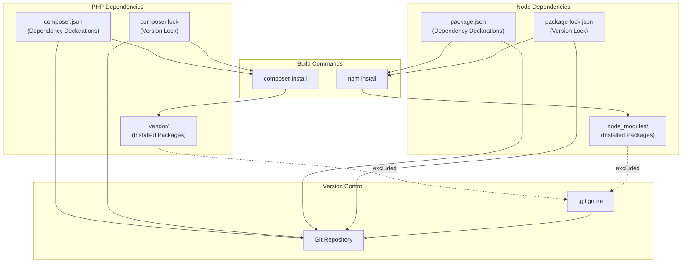
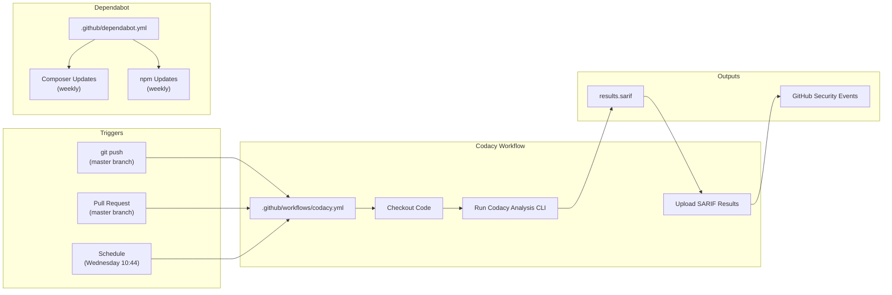
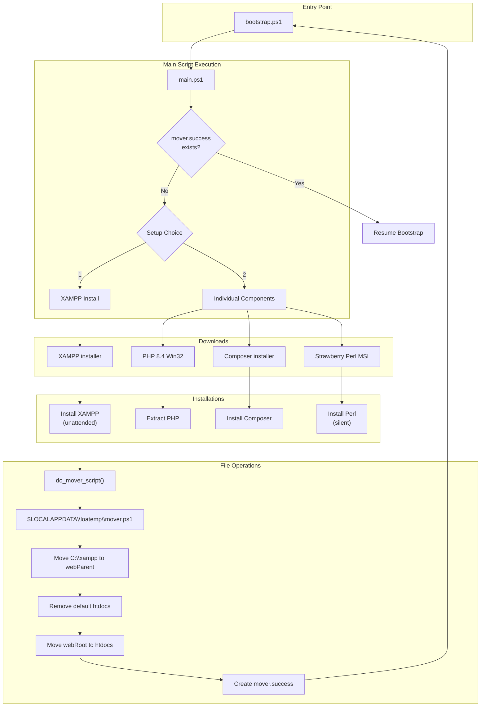
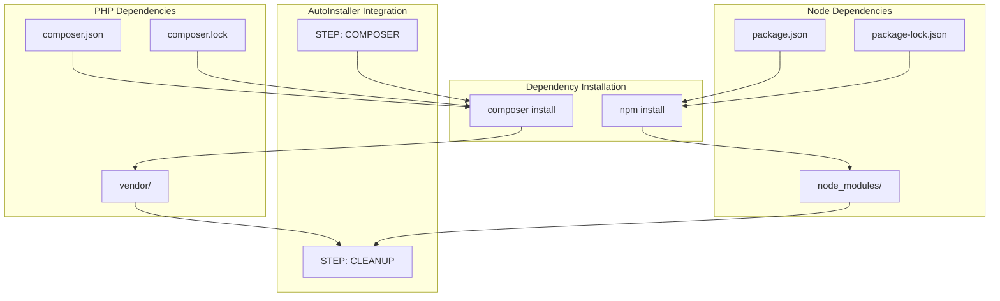

# Development & Deployment

<details>
<summary>Relevant source files</summary>

The following files were used as context for generating this wiki page:

- [.github/dependabot.yml](.github/dependabot.yml)
- [.github/workflows/codacy.yml](.github/workflows/codacy.yml)
- [.gitignore](.gitignore)
- [install/scripts/windows/bootstrap.ps1](install/scripts/windows/bootstrap.ps1)
- [install/scripts/windows/main.ps1](install/scripts/windows/main.ps1)
- [package-lock.json](package-lock.json)
- [package.json](package.json)
- [tbl_explore/table_explore.pl](tbl_explore/table_explore.pl)

</details>


This document covers the development workflow, build processes, continuous integration/continuous deployment (CI/CD) pipelines, and deployment practices for Legend of Aetheria. It describes the tools and automation that support development activities, from package management to automated security scanning.

For information about the automated installation process for end users, see [Installation & Setup](#2). For details on package manager configuration files, see [Package Management](#9.1). For CI/CD workflow specifications, see [CI/CD Pipelines](#9.2). For local development environment setup, see [Development Environment](#9.3).

---

## Version Control Strategy

The project uses Git for version control with a comprehensive `.gitignore` file that excludes build artifacts, temporary files, dependencies, configuration files, and IDE-specific directories from source control.

### Excluded Artifacts

| Category | Patterns | Purpose |
|----------|----------|---------|
| **Dependencies** | `vendor/`, `node_modules/`, `composer.phar` | External packages managed by Composer and npm |
| **Configuration** | `config.ini`, `.env` | Environment-specific settings with sensitive data |
| **Build Artifacts** | `*.log`, `*.ready`, `.phpunit.result.cache` | Generated files from builds and tests |
| **Temporary Files** | `*.swp`, `*ctags*`, `.*_tmp_egg`, `.vstags` | Editor swap files and temporary data |
| **IDE Directories** | `.vscode/`, `.idea/`, `.history/` | Editor/IDE-specific configuration |
| **Web Server Files** | `.htaccess`, `.well-known/` | Server configuration (generated by installer) |
| **Test Artifacts** | `/tests/`, `**/Tests/**`, `**/test**` | Test files and outputs |
| **Custom Exclusions** | `/esp32/`, `/sheets/`, `system/constants.php` | Project-specific generated or temporary content |

The `.gitignore` file [.gitignore:1-50]() ensures that only source code and configuration templates are tracked, while generated artifacts and environment-specific files remain local to each deployment.

**Sources:** [.gitignore:1-50]()

---

## Package Management Architecture

Legend of Aetheria uses two parallel package management systems: Composer for PHP server-side dependencies and npm for JavaScript client-side dependencies. Both systems use lock files to ensure reproducible builds across development and production environments.

### Dependency Management Flow



**Diagram: Package Management Structure**

### Current Dependencies

The project maintains minimal external dependencies to reduce complexity and attack surface:

**Node.js Dependencies:**
- `overlayscrollbars@^2.12.0` - Custom scrollbar implementation for improved UI aesthetics

The `package.json` [package.json:1-5]() declares a single dependency, with the exact resolved version locked in `package-lock.json` [package-lock.json:11-16](). The lock file specifies version `2.12.0` with integrity checksum `sha512-mWJ5MOkcZ/ljHwfLw8+bN0V9ziGCoNoqULcp994j5DTGNQvnkWKWkA7rnO29Kyew5AoHxUnJ4Ndqfcl0HSQjXg==`.

**PHP Dependencies:**
PHP dependencies are managed through Composer, though the `composer.json` file is not included in the provided sources. These are installed into the `vendor/` directory, which is excluded from version control [.gitignore:15,20]().

**Sources:** [package.json:1-5](), [package-lock.json:1-18](), [.gitignore:13-15,18-20]()

---

## CI/CD Pipeline

The project implements automated continuous integration through GitHub Actions, with two primary workflows for code quality and security analysis.

### GitHub Actions Workflows



**Diagram: CI/CD Workflow Structure**

### Codacy Security Scanning

The Codacy workflow [.github/workflows/codacy.yml:1-51]() performs static security analysis on PHP code:

**Trigger Conditions:**
- Push events to `master` branch [.github/workflows/codacy.yml:4-5]()
- Pull requests targeting `master` branch [.github/workflows/codacy.yml:6-7]()
- Scheduled execution every Wednesday at 10:44 UTC [.github/workflows/codacy.yml:11-12]()

**Path Exclusions:**
- CSS files (`**/*.css`) [.github/workflows/codacy.yml:9]()
- JavaScript files (`**/*.js`) [.github/workflows/codacy.yml:10]()

**Workflow Steps:**
1. **Checkout Code** [.github/workflows/codacy.yml:26-27]() - Uses `actions/checkout@v3` to fetch repository contents
2. **Run Codacy Analysis** [.github/workflows/codacy.yml:29-46]() - Executes `codacy/codacy-analysis-cli-action@d840f886c4bd4edc059706d09c6a1586111c540b` with:
   - Project token from secrets [.github/workflows/codacy.yml:32]()
   - SARIF output format [.github/workflows/codacy.yml:35]()
   - GitHub Code Scanning compatibility [.github/workflows/codacy.yml:36]()
   - ESLint engine enabled [.github/workflows/codacy.yml:40-44]()
   - CSS Lint engine disabled [.github/workflows/codacy.yml:45-46]()
3. **Upload SARIF Results** [.github/workflows/codacy.yml:47-50]() - Uses `github/codeql-action/upload-sarif@v2` to publish findings to GitHub Security tab

**Permissions:**
- `contents: read` - Read repository files [.github/workflows/codacy.yml:15,20]()
- `security-events: write` - Publish security findings [.github/workflows/codacy.yml:21]()
- `actions: read` - Access workflow metadata [.github/workflows/codacy.yml:22]()

**Sources:** [.github/workflows/codacy.yml:1-51]()

### Automated Dependency Updates

Dependabot configuration [.github/dependabot.yml:1-11]() automates security and version updates for both package ecosystems:

**Composer Updates:**
- Package ecosystem: `composer` [.github/dependabot.yml:3]()
- Directory: `/` (root) [.github/dependabot.yml:4]()
- Schedule: Weekly [.github/dependabot.yml:6]()

**npm Updates:**
- Package ecosystem: `npm` [.github/dependabot.yml:8]()
- Directory: `/` (root) [.github/dependabot.yml:9]()
- Schedule: Weekly [.github/dependabot.yml:10]()

Dependabot automatically creates pull requests when new versions of dependencies are available, allowing developers to review and merge updates while maintaining lock file integrity.

**Sources:** [.github/dependabot.yml:1-11]()

---

## Deployment Process

The deployment process centers around the AutoInstaller system, which provides platform-specific bootstrap scripts that prepare the environment before executing the main Perl-based installer.

### Windows Deployment Pipeline



**Diagram: Windows Bootstrap and Deployment Flow**

### Windows Bootstrap Script

The Windows deployment uses a two-stage bootstrap process with a file relocation mechanism.

**bootstrap.ps1** [install/scripts/windows/bootstrap.ps1:1-8]() orchestrates the multi-pass installation:
1. Executes `main.ps1` (first pass) [install/scripts/windows/bootstrap.ps1:4]()
2. Waits 3 seconds [install/scripts/windows/bootstrap.ps1:5]()
3. Executes `mover.ps1` from temporary directory [install/scripts/windows/bootstrap.ps1:6]()
4. Re-executes `main.ps1` (second pass) [install/scripts/windows/bootstrap.ps1:7]()

This multi-pass approach is necessary because XAMPP must be installed to `C:\xampp\` before being relocated to the web root directory.

**main.ps1** [install/scripts/windows/main.ps1:1-133]() performs the core installation logic:

**Helper Functions:**
- `file_exists($filePath)` [install/scripts/windows/main.ps1:4-9]() - Checks file existence using `Test-Path`
- `continue_script()` [install/scripts/windows/main.ps1:11-13]() - Prompts user to continue
- `do_mover_script()` [install/scripts/windows/main.ps1:15-54]() - Generates PowerShell script for file relocation

**Setup Options:**
1. **XAMPP Installation** (Option 1) [install/scripts/windows/main.ps1:86-101]():
   - Downloads XAMPP 8.2.12 installer [install/scripts/windows/main.ps1:91]()
   - Installs unattended without Mercury, Tomcat, or Webalizer [install/scripts/windows/main.ps1:99]()
   - Checks registry key `HKLM:Software\Microsoft\Windows\CurrentVersion\Uninstall\xampp` [install/scripts/windows/main.ps1:96]()

2. **Individual Components** (Option 2) [install/scripts/windows/main.ps1:102-124]():
   - Downloads PHP 8.4 Win32 build [install/scripts/windows/main.ps1:75]()
   - Downloads Composer installer [install/scripts/windows/main.ps1:76]()
   - Downloads Strawberry Perl 5.40.2.1 [install/scripts/windows/main.ps1:77]()
   - Extracts PHP to temporary directory [install/scripts/windows/main.ps1:113-115]()
   - Installs Composer into PHP directory [install/scripts/windows/main.ps1:117-119]()
   - Silently installs Perl via MSI [install/scripts/windows/main.ps1:121-123]()

**File Relocation Process:**

The `do_mover_script()` function [install/scripts/windows/main.ps1:15-54]() generates a PowerShell script that:
1. Moves XAMPP from `C:\xampp\` to `$webParent\xampp\` [install/scripts/windows/main.ps1:27-28]()
2. Removes default `htdocs/` directory [install/scripts/windows/main.ps1:34-35]()
3. Moves Legend of Aetheria files to new `htdocs/` [install/scripts/windows/main.ps1:41-42]()
4. Creates `mover.success` marker file [install/scripts/windows/main.ps1:48-49]()

All operations are logged to `$env:LOCALAPPDATA\loatemp\mover.log` [install/scripts/windows/main.ps1:20]() with timestamps [install/scripts/windows/main.ps1:22-23]().

**Sources:** [install/scripts/windows/bootstrap.ps1:1-8](), [install/scripts/windows/main.ps1:1-133]()

### Temporary Directory Structure

Both bootstrap scripts use the `$env:LOCALAPPDATA\loatemp` directory [install/scripts/windows/main.ps1:1]() for temporary files:

| File | Purpose |
|------|---------|
| `mover.ps1` | Generated relocation script |
| `mover.log` | File operation log with timestamps |
| `mover.success` | Marker file indicating relocation completed |

The temporary directory is created with `New-Item -Path $tempDir -ItemType Directory -Force` [install/scripts/windows/main.ps1:2](), suppressing output with `$null =` assignment.

**Sources:** [install/scripts/windows/main.ps1:1-2,16-24,48,58]()

---

## Build Process

The build process involves installing dependencies through package managers and preparing the application for execution.

### Build Steps



**Diagram: Build Process Integration**

### Lock File Management

Lock files ensure deterministic builds across environments:

**package-lock.json Structure:**
- `lockfileVersion: 3` [package-lock.json:3]() - Uses npm lock file format version 3
- `requires: true` [package-lock.json:4]() - Includes transitive dependencies
- Package resolution with integrity checksums [package-lock.json:11-16]()

The lock file pins `overlayscrollbars` to version `2.12.0` with SHA-512 integrity hash, ensuring the exact same version is installed across all environments.

**Sources:** [package-lock.json:1-18](), [package.json:1-5]()

---

## Development Tooling

The project includes utility scripts for development and maintenance tasks.

### Database Schema Explorer

The `tbl_explore/table_explore.pl` [tbl_explore/table_explore.pl:1-19]() Perl script generates HTML documentation of database tables:

**Functionality:**
1. Queries MySQL for all tables in `db_loa` database [tbl_explore/table_explore.pl:7]()
2. Filters out column header [tbl_explore/table_explore.pl:7]()
3. Generates HTML file for each table with `DESCRIBE` output [tbl_explore/table_explore.pl:12-14]()
4. Creates index of table links [tbl_explore/table_explore.pl:12,18]()

**Example Execution:**
```bash
mysql -e "use db_loa; show tables;"  # List tables
mysql -t -e 'use db_loa; DESCRIBE tablename;'  # Show structure
```

The script outputs HTML with `<pre>` tags containing formatted table descriptions [tbl_explore/table_explore.pl:13-14](), linked through an index page.

**Sources:** [tbl_explore/table_explore.pl:1-19]()

---

## Deployment Best Practices

### Pre-Deployment Checklist

1. **Verify Lock Files:** Ensure `composer.lock` and `package-lock.json` are committed
2. **Update Dependencies:** Run `composer update` and `npm update` to get latest compatible versions
3. **Test Locally:** Execute full installation via bootstrap scripts before deploying
4. **Review CI/CD Results:** Check GitHub Actions status for security findings
5. **Update Configuration:** Ensure `config.ini` template reflects current requirements

### Production Deployment

The AutoInstaller handles production deployment through the `STEP: COMPOSER` phase, which executes `composer install --no-dev --optimize-autoloader` to:
- Skip development dependencies (`--no-dev`)
- Generate optimized class autoloader (`--optimize-autoloader`)
- Install only production-required packages

### Rollback Strategy

If deployment fails:
1. The AutoInstaller creates step marker files (`.loa.step*`) to track progress
2. Re-running the installer resumes from the last successful step
3. The mover script logs all file operations to `mover.log` for troubleshooting
4. Lock files ensure dependency versions can be restored exactly

**Sources:** [install/scripts/windows/main.ps1:16-24,48](), [.gitignore:5]()

---

## Summary

Legend of Aetheria's development and deployment pipeline emphasizes automation, security, and reproducibility:

- **Version Control:** Comprehensive `.gitignore` excludes 50+ patterns of build artifacts, dependencies, and environment-specific files
- **Package Management:** Dual-track system with Composer for PHP and npm for Node.js, using lock files for deterministic builds
- **CI/CD:** GitHub Actions workflows automate security scanning (Codacy) and dependency updates (Dependabot) on weekly schedules
- **Deployment:** Platform-specific bootstrap scripts (PowerShell for Windows) automate installation and configuration
- **Build Process:** Dependency installation integrated into AutoInstaller's `STEP: COMPOSER` phase
- **Development Tools:** Perl utilities for database schema exploration and documentation generation

The architecture supports both development and production deployments through the same automation, reducing configuration drift and deployment errors.