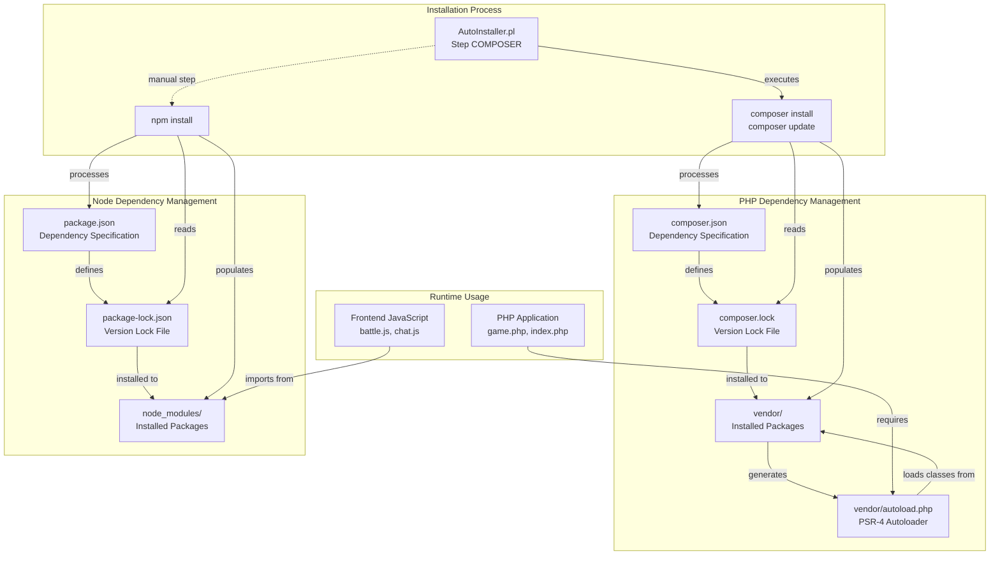
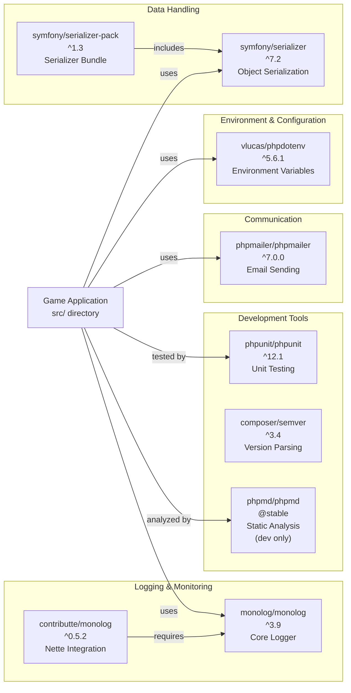
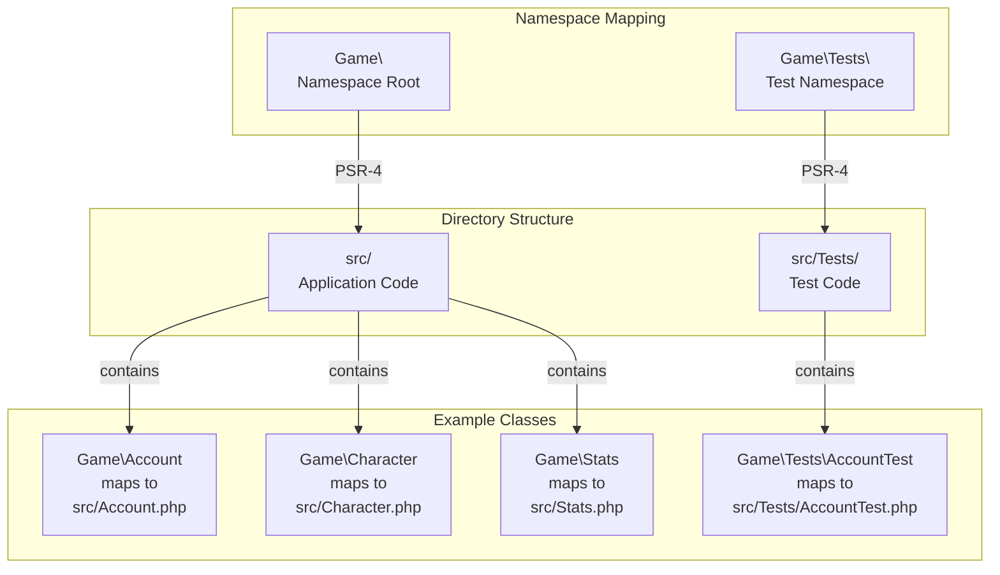
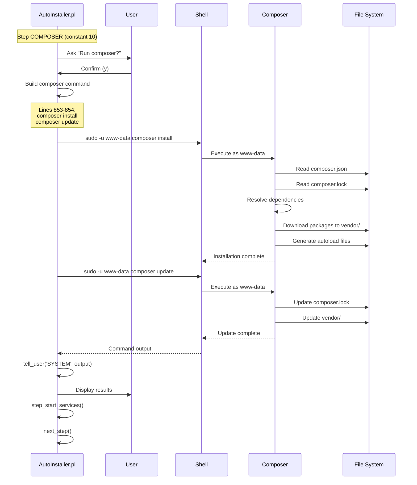
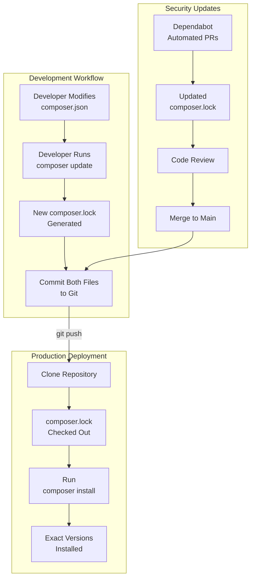

# Package Management

<details>
<summary>Relevant source files</summary>

The following files were used as context for generating this wiki page:

- [composer.json](composer.json)
- [composer.lock](composer.lock)
- [install/AutoInstaller.pl](install/AutoInstaller.pl)
- [install/templates/sql.template](install/templates/sql.template)
- [package-lock.json](package-lock.json)
- [package.json](package.json)

</details>


This document covers the dependency management systems used in Legend of Aetheria. The project uses two package managers: **Composer** for PHP dependencies and **npm** for Node.js dependencies. These systems handle library installation, version locking, and autoloading configuration.

For information about the automated installation process that executes these package managers, see [AutoInstaller](#2.2). For details on CI/CD processes that maintain dependency security, see [CI/CD Pipelines](#9.2).

## Overview

Legend of Aetheria employs a dual package management strategy to separate server-side PHP libraries from client-side JavaScript libraries. Composer manages backend dependencies including logging, environment configuration, email functionality, and testing frameworks. npm manages frontend dependencies, currently limited to the OverlayScrollbars UI component library.

## Package Management Architecture



**Sources:** [composer.json:1-30](), [composer.lock:1-84](), [package.json:1-5](), [package-lock.json:1-18](), [install/AutoInstaller.pl:280-286]()

## Composer Configuration

### composer.json Structure

The [composer.json:1-30]() file defines the PHP dependency requirements and autoloading configuration:

| Section | Purpose | Configuration |
|---------|---------|---------------|
| `require` | Production dependencies | 10 packages including phpdotenv, monolog, phpmailer |
| `require-dev` | Development-only dependencies | phpmd for static analysis |
| `autoload` | PSR-4 autoloading for application code | `Game\` namespace maps to `src/` |
| `autoload-dev` | PSR-4 autoloading for tests | `Game\Tests\` namespace maps to `src/Tests/` |
| `config` | Composer configuration | Allows `endroid/installer` plugin |

### Core Dependencies



**Sources:** [composer.json:2-13]()

### Transitive Dependencies

The [composer.lock:1-2000]() file reveals the complete dependency tree including indirect dependencies:

**Nette Framework Components** (required by `contributte/monolog`):
- `nette/di` - Dependency injection container
- `nette/neon` - NEON configuration format parser
- `nette/php-generator` - PHP code generation
- `nette/robot-loader` - Class autoloader
- `nette/schema` - Configuration validation
- `nette/utils` - Utility functions

**Supporting Libraries**:
- `doctrine/deprecations` - Deprecation management
- `graham-campbell/result-type` - Result type implementation
- `myclabs/deep-copy` - Deep object cloning
- `psr/log` - PSR-3 logging interface

**Sources:** [composer.lock:87-795]()

### PSR-4 Autoloading

The autoloading configuration maps PHP namespaces to directory structures:



When the application requires a class like `Game\Account`, the Composer autoloader automatically includes `src/Account.php`. This eliminates the need for manual `require` statements throughout the codebase.

**Sources:** [composer.json:15-24]()

## npm Configuration

### package.json Structure

The [package.json:1-5]() file is minimal, containing only a single production dependency:

```json
{
  "dependencies": {
    "overlayscrollbars": "^2.12.0"
  }
}
```

The **OverlayScrollbars** library provides custom scrollbar implementations for the game interface, maintaining aesthetic consistency with the RPGUI theme while offering smooth scrolling behavior.

**Sources:** [package.json:2-4]()

### Version Locking

The [package-lock.json:1-18]() file locks the exact version and integrity hash:

| Property | Value | Purpose |
|----------|-------|---------|
| `name` | `relock-npm-lock-v2-7Ejzg3` | Lock file identifier |
| `lockfileVersion` | `3` | npm lock format version |
| `overlayscrollbars.version` | `2.12.0` | Exact installed version |
| `overlayscrollbars.integrity` | `sha512-mWJ5MOkc...` | SHA-512 integrity hash |
| `overlayscrollbars.license` | `MIT` | License identifier |

This lock file ensures that all environments install the identical version of OverlayScrollbars, preventing "works on my machine" issues caused by dependency version drift.

**Sources:** [package-lock.json:1-18]()

## Installation During Setup

### AutoInstaller Composer Integration

The AutoInstaller Perl script orchestrates Composer execution during the `COMPOSER` step:



The installation process runs under the `www-data` user to ensure proper file ownership for Apache access.

**Sources:** [install/AutoInstaller.pl:280-286](), [install/AutoInstaller.pl:851-859]()

### Command Construction

The actual commands executed at [install/AutoInstaller.pl:853-854]():

```perl
my $cmd = "sudo -u $cfg{composer_runas} composer --working-dir \"$cfg{web_root}\" install 2>/dev/null;";
$cmd .= "sudo -u $cfg{composer_runas} composer --working-dir \"$cfg{web_root}\" update 2>/dev/null";
```

| Component | Value | Purpose |
|-----------|-------|---------|
| `sudo -u` | `www-data` | Execute as web server user |
| `--working-dir` | `$cfg{web_root}` | Set Composer working directory |
| `install` | - | Install dependencies from lock file |
| `update` | - | Update dependencies and regenerate lock |
| `2>/dev/null` | - | Suppress stderr output |

Both commands execute in sequence, first installing locked versions, then updating to the latest versions matching constraints in `composer.json`.

**Sources:** [install/AutoInstaller.pl:851-859]()

### User Confirmation

Before executing Composer, AutoInstaller prompts the user at [install/AutoInstaller.pl:852]():

```perl
if (ask_user("Composer is going to download/install these as $cfg{composer_runas} - continue?", 'y', 'yesno')) {
```

This confirmation step allows administrators to skip dependency installation if packages are already present or if network connectivity is unavailable.

**Sources:** [install/AutoInstaller.pl:280-286]()

## Dependency Version Management

### Semantic Versioning Constraints

The project uses semantic versioning constraints in `composer.json`:

| Constraint | Example | Behavior |
|------------|---------|----------|
| `^` caret | `^5.6.1` | Allow patch and minor updates (5.6.1 → 5.9.9) |
| `^` caret | `^3.9` | Allow minor and patch updates (3.9 → 3.99.99) |
| `@stable` | `@stable` | Require stable releases only |

The **caret operator** (`^`) provides a balance between stability and security updates. For example, `^5.6.1` allows updates to `5.6.2`, `5.7.0`, or `5.9.9`, but blocks `6.0.0` which may contain breaking changes.

**Sources:** [composer.json:3-10]()

### Lock File Strategy



The lock file ensures deterministic builds: every environment that runs `composer install` receives identical package versions, preventing subtle bugs caused by version differences.

**Sources:** [composer.lock:1-10]()

## Runtime Integration

### PHP Autoloading

The application entry points require the Composer autoloader before any other code:

```php
// Typical pattern in game.php, index.php, battle.php
require_once 'vendor/autoload.php';

use Game\Account;
use Game\Character;
use Game\Stats;

// Classes are automatically loaded when instantiated
$account = new Account($email);
$character = new Character($accountId, $characterId);
```

The autoloader provides:
- **Immediate class availability** - No manual includes required
- **Lazy loading** - Classes load only when first used
- **Namespace resolution** - Automatic path translation
- **Vendor library access** - All Composer packages available

**Sources:** [composer.json:15-19]()

### Frontend Integration

The OverlayScrollbars library integrates into the frontend through direct file inclusion:

```html
<!-- Typical pattern in headers.html -->
<link rel="stylesheet" href="node_modules/overlayscrollbars/styles/overlayscrollbars.css">
<script src="node_modules/overlayscrollbars/browser/overlayscrollbars.browser.es6.js"></script>
```

JavaScript code then initializes custom scrollbars on specific elements:

```javascript
// Typical usage in custom JS files
OverlayScrollbars(document.querySelector('.scrollable-content'), {
    scrollbars: { autoHide: 'leave' }
});
```

**Sources:** [package.json:2-4]()

## Maintenance and Updates

### Manual Update Process

To update dependencies manually:

```bash
# Update PHP dependencies
cd /path/to/web/root
sudo -u www-data composer update

# Update Node dependencies
npm update
npm audit fix  # Address security vulnerabilities

# Commit lock files
git add composer.lock package-lock.json
git commit -m "Update dependencies"
```

### Adding New Dependencies

```bash
# Add PHP package
sudo -u www-data composer require vendor/package:^1.0

# Add Node package
npm install --save package-name

# Add development-only PHP package
sudo -u www-data composer require --dev vendor/tool:^2.0
```

These commands automatically update both the specification files (`composer.json`, `package.json`) and the lock files.

**Sources:** [install/AutoInstaller.pl:851-859]()

## File Permissions

The AutoInstaller sets appropriate permissions for package directories during the `PERMS` step. The `vendor/` and `node_modules/` directories receive:

- **Owner:** `www-data` (Apache user)
- **Group:** `www-data` (Apache group)
- **Directory permissions:** `755` (rwxr-xr-x)
- **File permissions:** `644` (rw-r--r--)

This configuration allows the web server to read libraries while preventing unauthorized modifications.

**Sources:** [install/AutoInstaller.pl:605-657]()

## Dependency Summary

### PHP Packages

| Package | Version | Purpose | Category |
|---------|---------|---------|----------|
| vlucas/phpdotenv | ^5.6.1 | Load environment variables from `.env` | Configuration |
| monolog/monolog | ^3.9 | Structured logging framework | Logging |
| contributte/monolog | ^0.5.2 | Nette framework integration for Monolog | Logging |
| phpmailer/phpmailer | ^7.0.0 | Send emails with SMTP | Communication |
| composer/semver | ^3.4 | Parse and compare semantic versions | Utilities |
| symfony/serializer | ^7.2 | Object serialization/deserialization | Data Handling |
| symfony/serializer-pack | ^1.3 | Serializer component bundle | Data Handling |
| phpunit/phpunit | ^12.1 | Unit testing framework | Testing |
| phpmd/phpmd | @stable | Mess detection and code analysis | Development |

**Sources:** [composer.json:2-13]()

### Node Packages

| Package | Version | Purpose | Category |
|---------|---------|---------|----------|
| overlayscrollbars | ^2.12.0 | Custom scrollbar implementation | UI Components |

**Sources:** [package.json:2-4]()