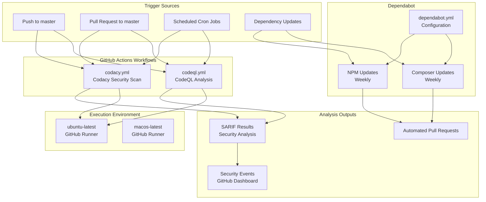
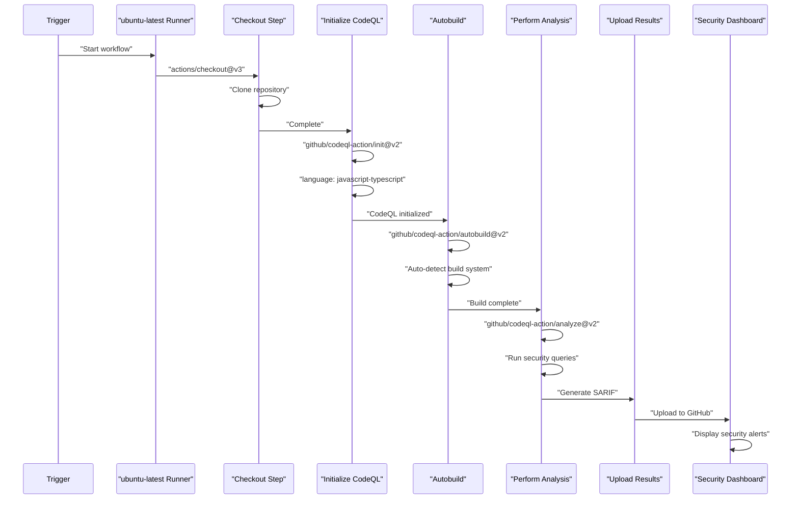
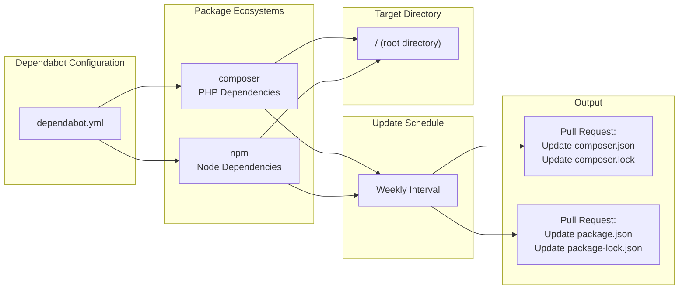
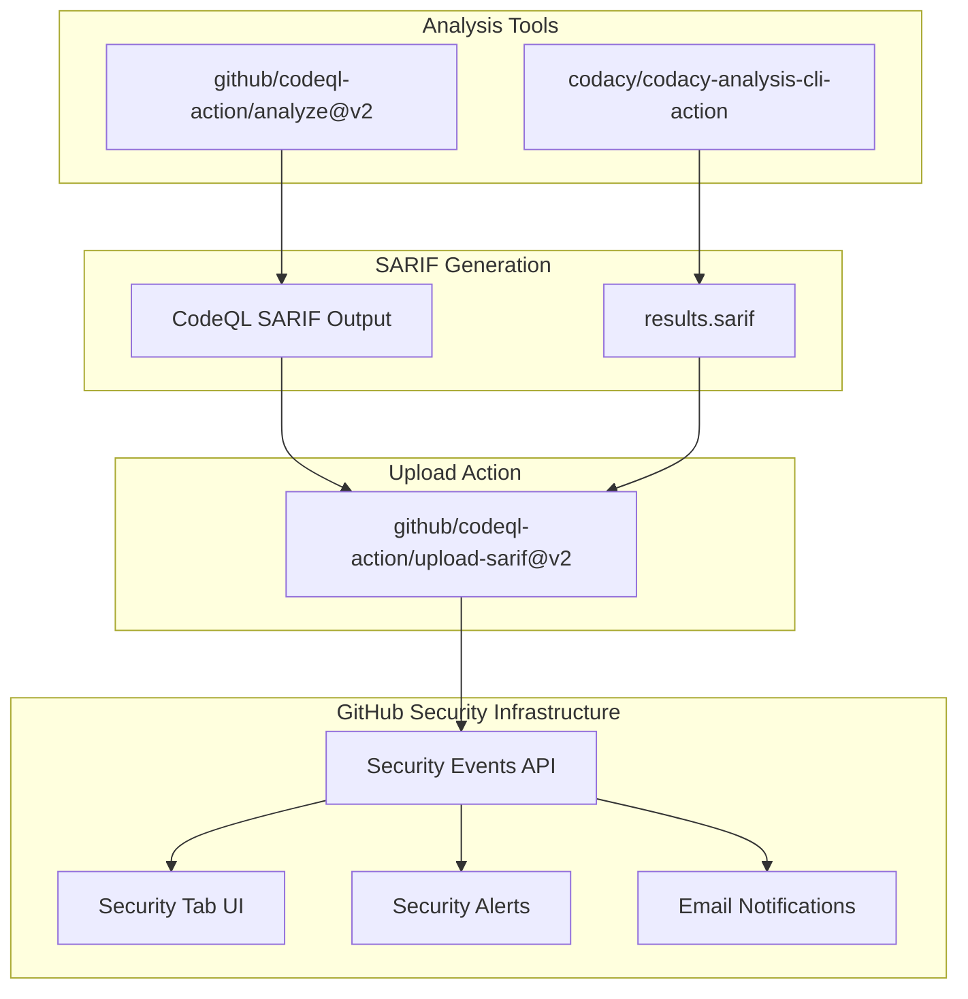

# CI/CD Pipelines

<details>
<summary>Relevant source files</summary>

The following files were used as context for generating this wiki page:

- [.github/dependabot.yml](.github/dependabot.yml)
- [.github/workflows/codacy.yml](.github/workflows/codacy.yml)
- [.github/workflows/codeql.yml](.github/workflows/codeql.yml)

</details>


## Purpose and Scope

This document describes the Continuous Integration and Continuous Deployment (CI/CD) infrastructure for Legend of Aetheria. The system utilizes GitHub Actions for automated testing and security analysis, and Dependabot for dependency management. This page covers the specific workflows, their triggers, configurations, and the security scanning processes that run automatically on code changes.

For information about package management and dependencies, see [Package Management](#9.1). For deployment and environment setup, see [Development Environment](#9.3).

---

## CI/CD Architecture Overview

Legend of Aetheria employs a security-focused CI/CD strategy with three primary automated systems:

1. **CodeQL Analysis** - GitHub's semantic code analysis engine for JavaScript/TypeScript
2. **Codacy Security Scan** - Third-party code quality and security analysis
3. **Dependabot** - Automated dependency update pull requests

All workflows are defined in [.github/workflows/]() and execute on GitHub-hosted runners. The pipelines do not perform deployment; they focus exclusively on code quality, security vulnerability detection, and dependency freshness.



**CI/CD Architecture Diagram**

Sources: [.github/workflows/codeql.yml](), [.github/workflows/codacy.yml](), [.github/dependabot.yml]()

---

## Workflow Triggers

The CI/CD pipelines execute based on multiple trigger conditions to balance immediate feedback with scheduled comprehensive scans.

| Workflow | Push to master | Pull Request | Scheduled | Manual |
|----------|---------------|--------------|-----------|--------|
| CodeQL | ✓ | ✓ | Thursday 16:31 UTC | ✗ |
| Codacy | ✓ | ✓ | Wednesday 10:44 UTC | ✗ |
| Dependabot | N/A | N/A | Weekly | ✗ |

### Trigger Configuration Details

**CodeQL Triggers** [.github/workflows/codeql.yml:14-21]():
- Push events on `master` branch
- Pull requests targeting `master` branch
- Scheduled execution via cron: `31 16 * * 4` (Thursday at 4:31 PM UTC)

**Codacy Triggers** [.github/workflows/codacy.yml:3-12]():
- Push events on `master` branch
- Pull requests targeting `master` branch (excludes CSS and JS file changes)
- Scheduled execution via cron: `44 10 * * 3` (Wednesday at 10:44 AM UTC)
- Path exclusions: `**/*.css`, `**/*.js` for pull request events

**Dependabot Schedule** [.github/dependabot.yml:5-10]():
- Weekly checks for Composer dependencies
- Weekly checks for NPM dependencies

Sources: [.github/workflows/codeql.yml:14-21](), [.github/workflows/codacy.yml:3-12](), [.github/dependabot.yml:5-10]()

---

## CodeQL Workflow

CodeQL is GitHub's semantic code analysis engine that analyzes source code to detect security vulnerabilities and coding errors. The workflow is defined in [.github/workflows/codeql.yml]().

### Language Configuration

The CodeQL workflow analyzes only JavaScript/TypeScript code [.github/workflows/codeql.yml:41]():

```
matrix:
  language: [ 'javascript-typescript' ]
```

This configuration targets the frontend JavaScript files including:
- `assets/js/battle.js`
- `assets/js/chat.js`
- `assets/js/functions.js`
- `assets/js/menus.js`
- `assets/js/toasts.js`

PHP code is not currently analyzed by CodeQL, as PHP is not included in the language matrix.

### Execution Steps



**CodeQL Execution Flow**

### Permissions

The CodeQL job requires specific permissions [.github/workflows/codeql.yml:33-36]():

| Permission | Level | Purpose |
|------------|-------|---------|
| `actions` | read | Access workflow run data |
| `contents` | read | Read repository source code |
| `security-events` | write | Upload security scan results |

### Timeout and Resource Allocation

- Default timeout: 360 minutes (6 hours) [.github/workflows/codeql.yml:32]()
- Runner: `ubuntu-latest` for JavaScript/TypeScript
- Runner: `macos-latest` for Swift (not used in this project)

Sources: [.github/workflows/codeql.yml]()

---

## Codacy Workflow

Codacy provides automated code review and security analysis. The workflow is defined in [.github/workflows/codacy.yml]() and integrates with GitHub's security dashboard.

### Analysis Configuration

**Engine Configuration** [.github/workflows/codacy.yml:39-46]():

```
engines:
  eslint:
    enabled: true
    exclude_paths:
      - "**/*.css"
      - "**/*.js"
  csslint:
    enabled: false
```

The workflow explicitly disables CSS linting and excludes JavaScript files from ESLint analysis during pull requests to reduce noise from frontend code.

### Execution Steps

The Codacy workflow consists of three primary steps:

1. **Checkout code** [.github/workflows/codacy.yml:26-27]()
   - Uses: `actions/checkout@v3`
   - Clones repository to runner workspace

2. **Run Codacy Analysis CLI** [.github/workflows/codacy.yml:29-46]()
   - Uses: `codacy/codacy-analysis-cli-action@d840f886c4bd4edc059706d09c6a1586111c540b`
   - Authentication: `secrets.CODACY_PROJECT_TOKEN`
   - Output format: SARIF (Static Analysis Results Interchange Format)
   - Configuration file: `.github/workflows/codacy-exclude.yml`
   - Maximum allowed issues: 2,147,483,647 (effectively unlimited)

3. **Upload SARIF results** [.github/workflows/codacy.yml:47-50]()
   - Uses: `github/codeql-action/upload-sarif@v2`
   - Integrates results into GitHub Security tab

### Permissions

The Codacy job requires elevated permissions [.github/workflows/codacy.yml:19-22]():

| Permission | Level | Purpose |
|------------|-------|---------|
| `contents` | read | Read repository source code |
| `security-events` | write | Upload security scan results |
| `actions` | read | Access workflow run data |

### SARIF Output Integration

Both CodeQL and Codacy generate SARIF files that are uploaded to GitHub's security events system. This provides a unified view of all security findings in the GitHub Security dashboard, regardless of the analysis tool that detected them.

Sources: [.github/workflows/codacy.yml]()

---

## Dependabot Configuration

Dependabot automatically creates pull requests to update dependencies when newer versions are available. The configuration is defined in [.github/dependabot.yml]().



**Dependabot Update Flow**

### Composer Dependency Updates

Configuration [.github/dependabot.yml:3-6]():

```
- package-ecosystem: "composer"
  directory: "/"
  schedule:
    interval: "weekly"
```

This monitors:
- `composer.json` - PHP package specifications
- `composer.lock` - Locked dependency versions

Updated packages include Bootstrap CSS, AdminLTE, and other PHP libraries defined in the Composer manifest.

### NPM Dependency Updates

Configuration [.github/dependabot.yml:7-10]():

```
- package-ecosystem: "npm"
  directory: "/"
  schedule:
    interval: "weekly"
```

This monitors:
- `package.json` - Node package specifications
- `package-lock.json` - Locked dependency tree

Updated packages include jQuery, OverlayScrollbars, and other JavaScript libraries defined in the NPM manifest.

### Automated Pull Request Workflow

When Dependabot detects an outdated dependency:

1. Creates a new branch with naming pattern: `dependabot/<ecosystem>/<package-name>`
2. Updates the lock file with new version constraints
3. Opens a pull request with:
   - Changelog information
   - Release notes from the dependency maintainer
   - Compatibility score
   - Recommended merge action

4. Triggers CI/CD workflows (CodeQL, Codacy) on the pull request
5. Awaits human review and merge approval

Sources: [.github/dependabot.yml]()

---

## Security Scanning Integration

The CI/CD pipelines integrate multiple security scanning tools to provide comprehensive vulnerability detection across different code layers.

### Analysis Coverage Matrix

| Tool | JavaScript | TypeScript | PHP | CSS | Configuration Files |
|------|-----------|-----------|-----|-----|-------------------|
| CodeQL | ✓ | ✓ | ✗ | ✗ | ✗ |
| Codacy | ✓ | ✗ | ✓ | ✓ | ✓ |
| Dependabot | ✓ | ✓ | ✓ | ✓ | ✗ |

### SARIF Upload Process

Both security scanners generate SARIF (Static Analysis Results Interchange Format) files that integrate with GitHub's native security infrastructure.



**Security Scanning Data Flow**

### Vulnerability Categories Detected

The combined scanning infrastructure detects:

- **Injection Vulnerabilities**: SQL injection, XSS, command injection
- **Authentication Issues**: Weak credentials, session management flaws
- **Cryptographic Failures**: Weak hashing, insecure random generation
- **Security Misconfigurations**: Exposed secrets, dangerous permissions
- **Known Vulnerable Dependencies**: CVEs in third-party packages
- **Code Quality Issues**: Dead code, complexity violations, antipatterns

### False Positive Management

The Codacy workflow uses a configuration file to exclude paths and tune analysis [.github/workflows/codacy.yml:38]():

```
config-file: ./.github/workflows/codacy-exclude.yml
```

This allows fine-grained control over which files are analyzed and which warnings are suppressed to reduce false positives without disabling entire security checks.

Sources: [.github/workflows/codeql.yml:48-50](), [.github/workflows/codacy.yml:29-50]()

---

## Workflow Execution Environment

All workflows execute on GitHub-hosted runners with standard configurations.

### Runner Specifications

**ubuntu-latest** (used by both workflows):
- Operating System: Ubuntu 22.04 LTS
- CPU: 2-core x86_64
- RAM: 7 GB
- Storage: 14 GB SSD
- Pre-installed software: Git, Node.js, Python, Docker, build tools

**Conditional macOS runner** [.github/workflows/codeql.yml:31]():
- Only used if analyzing Swift code (not applicable to this project)
- Operating System: macOS 12 (Monterey)

### Environment Isolation

Each workflow run executes in a fresh, isolated environment:
- No state persists between runs
- No artifacts shared between workflows
- Clean checkout of repository on each execution
- Ephemeral runner destroyed after completion

### Secrets Management

Workflows access protected secrets through GitHub's encrypted secrets store:

- `CODACY_PROJECT_TOKEN` [.github/workflows/codacy.yml:32]() - Authenticates with Codacy API
- Secrets are never exposed in logs or artifacts
- Only accessible during workflow execution within the defined job scope

Sources: [.github/workflows/codeql.yml:31-32](), [.github/workflows/codacy.yml:32]()

---

## Monitoring and Maintenance

### Viewing Workflow Results

Workflow execution history and results are accessible through:

1. **Actions Tab**: `https://github.com/Ziddykins/LegendOfAetheria/actions`
   - Shows all workflow runs with status indicators
   - Provides detailed logs for each execution step
   - Displays duration and resource usage

2. **Security Tab**: `https://github.com/Ziddykins/LegendOfAetheria/security`
   - Aggregates findings from CodeQL and Codacy
   - Shows Dependabot security advisories
   - Provides vulnerability severity ratings

3. **Pull Requests**: 
   - Check status indicators on PR pages
   - View inline security annotations on changed code
   - Review Dependabot automated PRs

### Workflow Status Indicators

| Status | Icon | Meaning |
|--------|------|---------|
| Success | ✓ | All checks passed, no issues found |
| Failure | ✗ | Analysis completed but found security issues |
| Cancelled | ⊘ | Workflow manually cancelled |
| In Progress | ⟳ | Currently executing |
| Skipped | − | Not executed due to path exclusions |

### Maintenance Requirements

The CI/CD infrastructure requires minimal maintenance:

- **Action Version Updates**: GitHub Actions versions (`@v2`, `@v3`) should be periodically updated to latest stable versions
- **Runner Updates**: GitHub automatically updates hosted runners
- **Secret Rotation**: `CODACY_PROJECT_TOKEN` should be rotated annually
- **Configuration Review**: Review exclusion patterns quarterly to ensure they remain relevant

Sources: [.github/workflows/codeql.yml](), [.github/workflows/codacy.yml]()

---

## Limitations and Future Improvements

### Current Limitations

1. **No PHP Analysis in CodeQL**: PHP source code is not analyzed despite being the primary backend language
2. **No Automated Deployment**: Workflows only perform analysis; deployment is manual
3. **No Unit Test Execution**: No automated test suite execution in CI pipeline
4. **No Performance Testing**: No automated performance regression detection
5. **No Docker Image Building**: No containerization in CI process

### Potential Enhancements

- Add PHP CodeQL analysis by including `'php'` in language matrix
- Implement PHPUnit test execution workflow
- Add automated deployment workflow to staging environment
- Integrate PHPStan or Psalm for static analysis of PHP code
- Add performance benchmarking with historical trend tracking
- Implement automated code coverage reporting

Sources: [.github/workflows/codeql.yml:41](), [.github/workflows/codacy.yml](), [.github/dependabot.yml]()