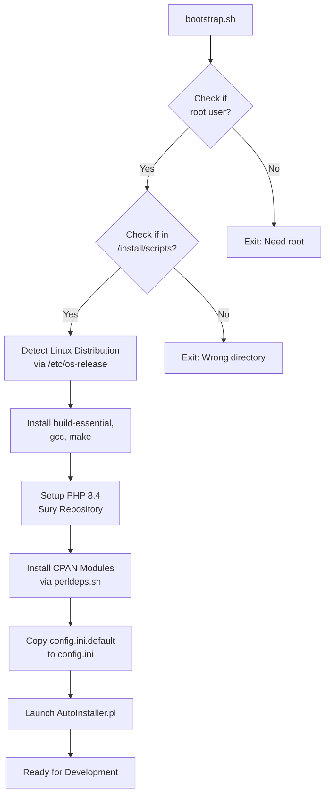
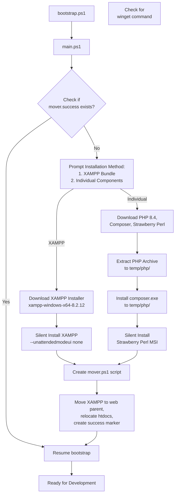
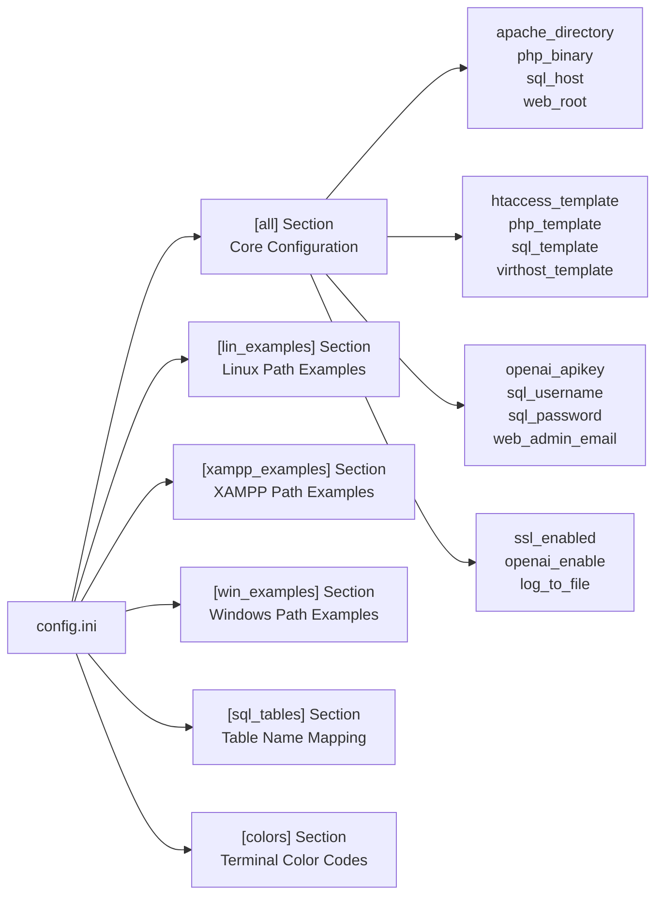
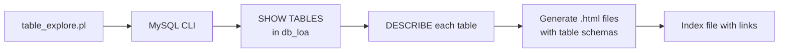
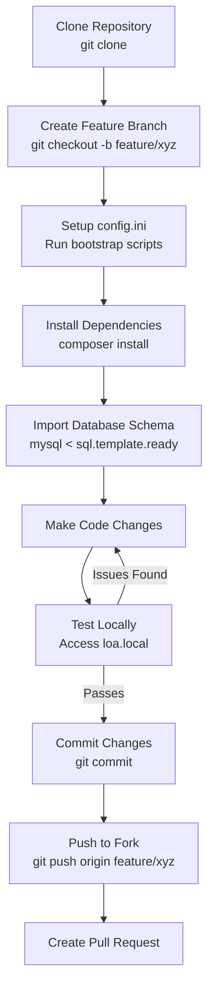

# Development Environment

<details>
<summary>Relevant source files</summary>

The following files were used as context for generating this wiki page:

- [.gitignore](.gitignore)
- [CONTRIBUTING.md](CONTRIBUTING.md)
- [INSTALL.md](INSTALL.md)
- [README.md](README.md)
- [install/config.ini.default](install/config.ini.default)
- [install/scripts/bootstrap.sh](install/scripts/bootstrap.sh)
- [install/scripts/windows/bootstrap.ps1](install/scripts/windows/bootstrap.ps1)
- [install/scripts/windows/main.ps1](install/scripts/windows/main.ps1)
- [tbl_explore/table_explore.pl](tbl_explore/table_explore.pl)

</details>


This document provides guidance for developers setting up a local development environment for Legend of Aetheria. It covers repository setup, dependency installation, configuration for development purposes, and useful development tools. For production deployment instructions, see [Installation & Setup](#2). For package management details, see [Package Management](#9.1). For CI/CD processes, see [CI/CD Pipelines](#9.2).

## Prerequisites

Before setting up the development environment, ensure the following software is installed on your system:

| Software | Minimum Version | Purpose |
|----------|----------------|---------|
| PHP | 8.4 | Core application runtime |
| MariaDB/MySQL | 5.7+ / 8.0+ | Database server |
| Apache | 2.4+ | Web server with mod_rewrite |
| Composer | 2.0+ | PHP dependency management |
| Node.js | 18.0+ | Frontend build tools |
| npm | 9.0+ | Node package management |
| Git | 2.0+ | Version control |
| Perl | 5.30+ | AutoInstaller and utility scripts |

**Additional Requirements:**

- Write access to web server directories (`/var/www/html` or equivalent)
- MySQL/MariaDB root or administrative credentials
- Port 80/443 availability for web server
- CPAN modules for Perl scripts (installed via bootstrap scripts)

Sources: [README.md:70-77](), [INSTALL.md:50-68]()

## Repository Setup

### Cloning the Repository

Clone the repository to your local development directory. For Linux/macOS systems, use the web server's document root:

```bash
cd /var/www/html
git clone https://github.com/Ziddykins/LegendOfAetheria
cd LegendOfAetheria
```

### Initial File Permissions

Set appropriate ownership and permissions for development. The web server user (`www-data` on Debian/Ubuntu, `apache` on RHEL/CentOS) must have read/write access:

```bash
sudo chown -R www-data:www-data .
find . -type f -exec chmod 0644 {} \+
find . -type d -exec chmod 0755 {} \+
```

### Git Configuration for Development

The repository includes a `.gitignore` file that excludes development-specific files:

**Excluded Files:**
- `*.log` - Log files generated during development
- `.env` - Environment configuration files
- `config.ini` - Instance-specific configuration
- `.htaccess` - Server-specific URL rewriting rules
- `vendor/` - Composer dependencies
- `node_modules/` - npm dependencies
- `.vscode/`, `.idea/` - IDE configuration directories
- `*.swp`, `*ctags*` - Editor temporary files

Sources: [README.md:13-22](), [.gitignore:1-50]()

## Development Environment Configuration

### Bootstrap Scripts

The repository provides platform-specific bootstrap scripts that automate environment setup:

#### Linux/Unix Bootstrap Process



**Bootstrap Script Workflow:**

The `bootstrap.sh` script performs the following steps:

1. **Environment Validation** - Verifies script is run as root from `/install/scripts`
2. **Distribution Detection** - Parses `/etc/os-release` to identify Debian or Ubuntu
3. **Build Tools Installation** - Installs `gcc`, `make`, and `build-essential` packages
4. **PHP Repository Setup** - Configures Sury repository for PHP 8.4 packages
5. **Perl Dependencies** - Installs CPAN modules required by AutoInstaller
6. **Configuration Initialization** - Copies `config.ini.default` to `config.ini`
7. **Optional AutoInstaller Launch** - Prompts to start full installation

Sources: [install/scripts/bootstrap.sh:1-117](), [README.md:39-49]()

#### Windows Bootstrap Process

Windows development uses PowerShell scripts that can configure either XAMPP or individual components:



**Windows-Specific Considerations:**

- Uses `$env:LOCALAPPDATA\loatemp` for temporary files and logs
- XAMPP installation is non-interactive with Mercury, Tomcat, and Webalizer disabled
- Mover script relocates XAMPP to web parent directory structure
- Creates success markers to track bootstrap progress across script restarts

Sources: [install/scripts/windows/bootstrap.ps1:1-8](), [install/scripts/windows/main.ps1:1-133]()

### Configuration Files

#### config.ini Structure

The `config.ini` file controls AutoInstaller behavior and system paths. For development, customize these sections:



**Key Configuration Parameters:**

| Parameter | Purpose | Example Value |
|-----------|---------|---------------|
| `web_root` | Document root path | `/var/www/html` |
| `php_binary` | PHP executable path | `/usr/bin/php` |
| `sql_host` | Database server | `localhost` |
| `sql_database` | Database name | `db_loa` |
| `apache_directory` | Apache config path | `/etc/apache2` |
| `composer_runas` | User for Composer | `www-data` |
| `openai_enable` | Enable AI features | `1` or `0` |
| `ssl_enabled` | Use HTTPS | `1` or `0` |

Sources: [install/config.ini.default:1-95]()

#### Development vs Production Configuration

For development environments, consider these configuration adjustments:

**Development Settings:**
- Set `log_to_file=1` for debugging
- Use `ssl_enabled=0` for local testing without certificates
- Set `openai_enable=0` to avoid API costs during development
- Use self-signed SSL certificates for HTTPS testing

**File Locations:**
- Generated configuration: `config.ini` (git-ignored)
- Template source: `install/config.ini.default` (version controlled)
- Environment variables: `.env` (git-ignored, for sensitive credentials)

Sources: [README.md:79-86](), [.gitignore:7-8,29]()

## Installing Dependencies

### PHP Dependencies via Composer

Install PHP packages defined in `composer.json`:

```bash
sudo -u www-data composer --working-dir=/path/to/LegendOfAetheria install
```

For development with additional dev dependencies:

```bash
sudo -u www-data composer --working-dir=/path/to/LegendOfAetheria install --dev
```

**Key Composer Dependencies:**
- Bootstrap 5.3 framework
- AdminLTE theme components
- PHP utility libraries
- Testing frameworks (dev only)

### Node.js Dependencies via npm

While the codebase uses Composer for most frontend assets, some tooling may require npm:

```bash
cd /path/to/LegendOfAetheria
npm install
```

**Git-Ignored Directories:**
- `vendor/` - Composer packages
- `node_modules/` - npm packages (if used)

Sources: [README.md:263-270](), [.gitignore:13,18-21]()

## Local Development Server

### Apache Virtual Host for Development

Create a non-SSL virtual host for local development:

**File: `/etc/apache2/sites-available/loa-dev.conf`**

```apacheconf
<VirtualHost 127.0.0.1:80>
    ServerName loa.local
    DocumentRoot /var/www/html/LegendOfAetheria
    
    <Directory /var/www/html/LegendOfAetheria>
        AllowOverride All
        Require all granted
    </Directory>
    
    LogLevel debug
    ErrorLog ${APACHE_LOG_DIR}/loa-dev-error.log
    CustomLog ${APACHE_LOG_DIR}/loa-dev-access.log combined
</VirtualHost>
```

**Enable the site and required modules:**

```bash
a2ensite loa-dev
a2enmod rewrite headers
systemctl reload apache2
```

**Add to `/etc/hosts`:**

```
127.0.0.1    loa.local
```

### PHP-FPM Configuration for Development

Enable PHP-FPM for better performance during development:

```bash
a2dismod mpm_prefork php8.4
a2enmod mpm_event proxy_fcgi
a2enconf php8.4-fpm
systemctl restart apache2 php8.4-fpm
```

Sources: [README.md:89-203](), [INSTALL.md:50-68]()

## Development Tools and Utilities

### Database Exploration Tool

The repository includes a Perl utility for generating HTML documentation of database tables:



**Usage:**

```bash
cd tbl_explore
./table_explore.pl > index.html
```

This generates:
- `index.html` - Links to all table documentation
- `[tablename].html` - Schema for each table (e.g., `tbl_characters.html`)

**Script Functionality:**
- Queries `db_loa` database for table list
- Executes `DESCRIBE` on each table
- Formats output as HTML with `<pre>` tags
- Creates navigable index of all tables

Sources: [tbl_explore/table_explore.pl:1-19]()

### Debug Logging

The application can log to files when `log_to_file=1` in `config.ini`. Log files are automatically excluded from version control:

**Log File Patterns (git-ignored):**
- `**/*.log` - All `.log` files
- `gamelog.txt` - Game event logging
- `install/templates/*.ready` - Generated templates

**Viewing Logs:**

```bash
# Watch Apache error log
tail -f /var/log/apache2/loa-dev-error.log

# Watch PHP-FPM log
tail -f /var/log/php8.4-fpm.log

# Watch game-specific logs
tail -f /var/www/html/LegendOfAetheria/gamelog.txt
```

Sources: [.gitignore:1,25](), [install/config.ini.default:14]()

### Template Processing for Development

During development, you may need to regenerate configuration templates without running the full AutoInstaller:

```bash
sudo perl install/AutoInstaller.pl --step TEMPLATES --fqdn loa.local --only
```

This generates:
- `sql.template.ready` - Complete database schema
- `.htaccess` - URL rewriting rules
- Virtual host configuration files
- `constants.php` - System constants

**Generated Files (git-ignored):**
- `*.ready` files in `install/templates/`
- `.htaccess` in webroot
- `system/constants.php`

Sources: [README.md:273-286](), [.gitignore:2,49]()

### IDE and Editor Configuration

The repository excludes common IDE configuration directories to prevent conflicts:

**Git-Ignored IDE Files:**

| Pattern | IDE/Editor |
|---------|------------|
| `.vscode/` | Visual Studio Code |
| `.idea/` | PHPStorm, IntelliJ IDEA |
| `*.swp` | Vim swap files |
| `*ctags*`, `.vstags` | Ctags index files |
| `.history/` | Local File History extension |

**Recommended Extensions:**
- PHP IntelliSense for code completion
- PHP Debug (Xdebug) for breakpoints
- MySQL/MariaDB integration
- GitLens for version control visualization

Sources: [.gitignore:3-5,9-10,26-28,38-47]()

## Development Workflow

### Making Code Changes



### Version Control Best Practices

**Files to Commit:**
- PHP source files in `system/`, `pages/`, `navs/`, `admin/`
- JavaScript files in `js/`
- Template files in `install/templates/` (`.template` suffix)
- Documentation in `*.md` files

**Files to Never Commit:**
- `config.ini` - Contains instance-specific configuration
- `.env` - Contains sensitive credentials
- `.htaccess` - Generated from template
- `*.log` - Runtime logs
- `vendor/`, `node_modules/` - Managed by package managers
- `*.ready` - Generated from templates

Sources: [.gitignore:1-50](), [CONTRIBUTING.md:36-42]()

### Testing Changes Locally

**Basic Testing Checklist:**

1. **Database Connectivity**
   ```bash
   mysql -u [sql_username] -p [sql_database] -e "SELECT COUNT(*) FROM tbl_accounts;"
   ```

2. **Web Server Access**
   ```bash
   curl -I http://loa.local/
   ```

3. **PHP Error Checking**
   ```bash
   php -l system/Account.php
   ```

4. **Session Functionality**
   - Access `http://loa.local/`
   - Attempt login/registration
   - Verify session persistence

5. **URL Rewriting**
   - Test clean URLs like `/game?page=sheet`
   - Verify `.htaccess` rules work

Sources: [README.md:273-286]()

## Debugging PHP Applications

### PHP Configuration for Development

For development, modify `php.ini` with debugging-friendly settings:

```ini
; Development Settings (Do NOT use in production)
display_errors = On
display_startup_errors = On
error_reporting = E_ALL
log_errors = On
error_log = /var/log/php/error.log

; Keep these from production
expose_php = Off
allow_url_fopen = Off
allow_url_include = Off
```

**Production PHP Settings:**
The installer configures these security settings for production:
- `expose_php = off` - Hide PHP version
- `error_reporting = E_NONE` - Suppress error output
- `display_errors = Off` - Never show errors to users
- `disable_functions` - Restricts dangerous functions like `exec`, `shell_exec`, `system`

Sources: [README.md:237-258]()

### Xdebug Setup

Install and configure Xdebug for step debugging:

```bash
sudo apt install php8.4-xdebug
```

Add to `php.ini` or `/etc/php/8.4/mods-available/xdebug.ini`:

```ini
[xdebug]
xdebug.mode=debug
xdebug.start_with_request=trigger
xdebug.client_host=127.0.0.1
xdebug.client_port=9003
```

**VSCode Launch Configuration:**

```json
{
    "version": "0.2.0",
    "configurations": [
        {
            "name": "Listen for Xdebug",
            "type": "php",
            "request": "launch",
            "port": 9003,
            "pathMappings": {
                "/var/www/html/LegendOfAetheria": "${workspaceFolder}"
            }
        }
    ]
}
```

Sources: [README.md:237-258]()

## Common Development Issues

### Permission Errors

If you encounter permission errors when accessing the application:

```bash
# Reset ownership
sudo chown -R www-data:www-data /var/www/html/LegendOfAetheria

# Reset file permissions
find /var/www/html/LegendOfAetheria -type f -exec chmod 0644 {} \+
find /var/www/html/LegendOfAetheria -type d -exec chmod 0755 {} \+

# Make AutoInstaller executable
chmod +x /var/www/html/LegendOfAetheria/install/AutoInstaller.pl
```

Sources: [README.md:13-22,47-49]()

### Database Connection Issues

If the application cannot connect to the database:

1. **Verify MySQL/MariaDB is running:**
   ```bash
   systemctl status mariadb
   ```

2. **Check credentials in `.env` or `config.ini`:**
   - Ensure `sql_username`, `sql_password`, `sql_database` are correct
   - Verify user has appropriate privileges

3. **Test connection manually:**
   ```bash
   mysql -u [username] -p -h [host] [database]
   ```

4. **Verify PropSuite database connection:**
   - Check `system/PropSuite.php` for connection initialization
   - Look for database error logs in Apache error log

Sources: [install/config.ini.default:21-27]()

### URL Rewriting Not Working

If clean URLs fail (404 errors for `/game`, `/select`, etc.):

1. **Verify mod_rewrite is enabled:**
   ```bash
   a2enmod rewrite
   systemctl reload apache2
   ```

2. **Check `.htaccess` exists in webroot:**
   ```bash
   ls -la /var/www/html/LegendOfAetheria/.htaccess
   ```

3. **Verify Apache AllowOverride:**
   Ensure virtual host has `AllowOverride All`

4. **Regenerate `.htaccess` from template:**
   ```bash
   sudo perl install/AutoInstaller.pl --step TEMPLATES --only --fqdn loa.local
   ```

Sources: [README.md:89-112](), [.gitignore:8]()

## Contributing to Development

For information about contributing code, reporting bugs, and suggesting enhancements, see the [CONTRIBUTING.md](https://github.com/Ziddykins/LegendOfAetheria/blob/master/CONTRIBUTING.md) file in the repository root.

**Key Contribution Guidelines:**

- Fork the repository and create feature branches
- Follow existing code style and conventions
- Test changes thoroughly before submitting pull requests
- Document new features in wiki pages
- Report security issues privately, not via public issues

Sources: [CONTRIBUTING.md:1-105](), [README.md:317-319]()