# Installation & Setup

<details>
<summary>Relevant source files</summary>

The following files were used as context for generating this wiki page:

- [.gitignore](.gitignore)
- [CONTRIBUTING.md](CONTRIBUTING.md)
- [README.md](README.md)
- [composer.json](composer.json)
- [composer.lock](composer.lock)
- [install/AutoInstaller.pl](install/AutoInstaller.pl)
- [install/scripts/windows/bootstrap.ps1](install/scripts/windows/bootstrap.ps1)
- [install/scripts/windows/main.ps1](install/scripts/windows/main.ps1)
- [install/templates/sql.template](install/templates/sql.template)
- [tbl_explore/table_explore.pl](tbl_explore/table_explore.pl)

</details>


This page provides comprehensive documentation for installing and configuring Legend of Aetheria on Linux and Windows platforms. The installation process is primarily automated through `AutoInstaller.pl`, which orchestrates software installation, database setup, web server configuration, and security hardening.

For information about configuring the application after installation, see [Configuration](#2.3). For web server-specific setup details, see [Web Server Setup](#2.4).

## Overview

Legend of Aetheria provides two installation methods:

| Method | Description | Use Case |
|--------|-------------|----------|
| **Automated** | Bootstrap scripts + `AutoInstaller.pl` | Recommended for fresh installations and development environments |
| **Manual** | Step-by-step configuration | Production servers with existing services, custom configurations |

The automated installation handles all aspects from repository clone to SSL-enabled web application, including database schema creation, dependency installation, and permission management.

Sources: [install/AutoInstaller.pl:1-303](), [README.md:5-67]()

## Installation Architecture

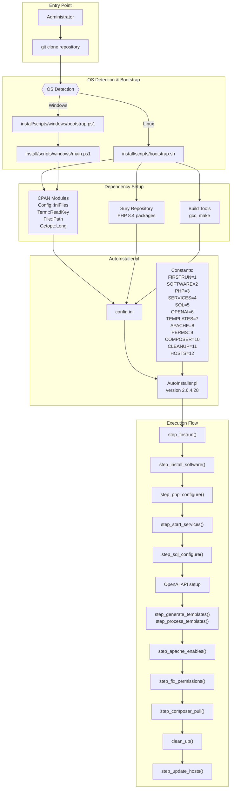

**Installation Execution Flow**: The installation process begins with OS-specific bootstrap scripts that prepare the environment, then hands control to `AutoInstaller.pl` which executes 12 sequential steps defined as Perl constants. Each step is resumable if interrupted, with state tracked in `config.ini`.

Sources: [install/AutoInstaller.pl:45-58](), [install/AutoInstaller.pl:115-303](), [install/scripts/windows/bootstrap.ps1:1-8]()

## Prerequisites

### System Requirements

| Component | Requirement | Notes |
|-----------|-------------|-------|
| **Operating System** | Linux (Debian/Ubuntu/Alpine) or Windows 10+ | Tested on Debian 12, Ubuntu 24.04 |
| **Root/Admin Access** | Required | Installation modifies system packages and services |
| **Web Server** | Apache 2.4+ | Configured automatically by installer |
| **Database** | MariaDB 10.3+ or MySQL 8.0+ | MariaDB recommended |
| **PHP** | 8.4 | Installed via Sury repository on Linux |
| **Perl** | 5.10+ | Required for AutoInstaller.pl |
| **Disk Space** | 2GB minimum | Includes dependencies and database |
| **Network** | Internet connection | For package downloads and Composer |

### Required Perl Modules

The bootstrap scripts install these CPAN modules automatically:

- `Config::IniFiles` - Configuration file parsing
- `Term::ReadKey` - Secure password input
- `File::Path` - Directory operations
- `Getopt::Long` - Command-line argument parsing
- `Data::Dumper` - Debugging output
- `File::Find` - File tree traversal
- `File::Copy` - File operations

Sources: [install/AutoInstaller.pl:9-18](), [README.md:69-77]()

### PHP Extensions

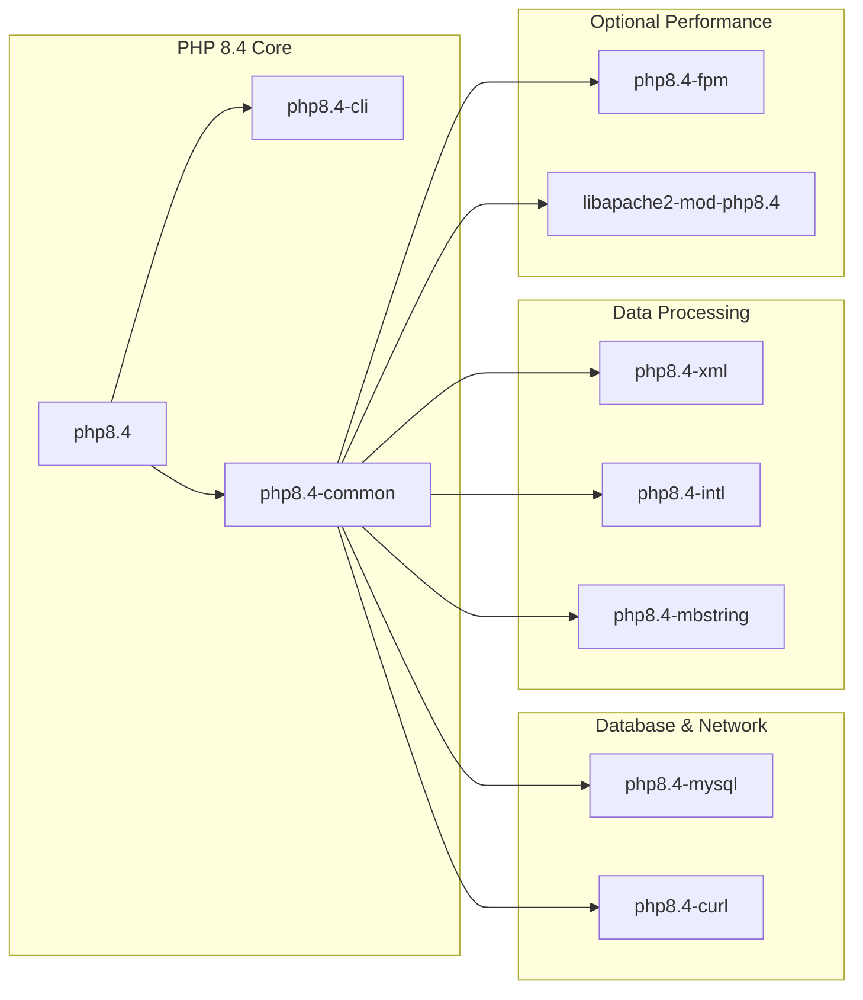

**PHP Extension Dependencies**: The installer configures either PHP-FPM (with `mpm_event`) or mod_php (with `mpm_prefork`) based on user selection.

Sources: [install/AutoInstaller.pl:435-470](), [README.md:74-77]()

## Bootstrap Process

### Linux Bootstrap

The `bootstrap.sh` script prepares the system for AutoInstaller execution:

```bash
cd install/scripts
sudo bash bootstrap.sh
```

**Operations performed:**
1. Detects Linux distribution (Debian/Ubuntu/Alpine)
2. Adds Sury PHP repository for PHP 8.4
3. Installs build tools (`gcc`, `make`, `g++`)
4. Installs CPAN and required Perl modules
5. Creates `config.ini` from `config.ini.default` if not present

Sources: [README.md:39-43](), [install/AutoInstaller.pl:375-391]()

### Windows Bootstrap

Windows installation uses PowerShell scripts:

```powershell
cd install\scripts\windows
.\bootstrap.ps1
```

The Windows bootstrap provides two installation methods:

| Method | Script Flow | Components |
|--------|-------------|------------|
| **XAMPP** | `bootstrap.ps1` → `main.ps1` → installs XAMPP bundle | Apache, PHP, MySQL, Perl in single package |
| **Individual** | `bootstrap.ps1` → `main.ps1` → downloads separate installers | PHP 8.4, Composer, Strawberry Perl MSI |

**Mover Script**: After XAMPP installation, `mover.ps1` relocates files to the correct web root structure:
1. Moves `C:\xampp\` to target web parent directory
2. Removes default `htdocs\`
3. Moves LoA files into new `htdocs\`
4. Creates `mover.success` marker file

Sources: [install/scripts/windows/bootstrap.ps1:1-8](), [install/scripts/windows/main.ps1:1-133]()

## AutoInstaller Execution

### Command-Line Interface

```bash
cd install
sudo ./AutoInstaller.pl [OPTIONS]
```

**Command-line Options:**

| Option | Description | Example |
|--------|-------------|---------|
| `-f, --fqdn` | Specify fully qualified domain name | `--fqdn loa.example.com` |
| `-s, --step` | Resume from specific step (name or number) | `--step SQL` or `--step 5` |
| `-o, --only` | Execute only specified step, skip others | `--only --step TEMPLATES` |
| `-c, --config` | Use alternate config file | `--config myconfig.ini` |
| `-l, --list-steps` | Display all step names and numbers | |
| `-h, --help` | Show help message | |
| `-v, --version` | Show version (currently 2.6.4.28) | |

Sources: [install/AutoInstaller.pl:20-28](), [README.md:46-49]()

### Configuration File Structure

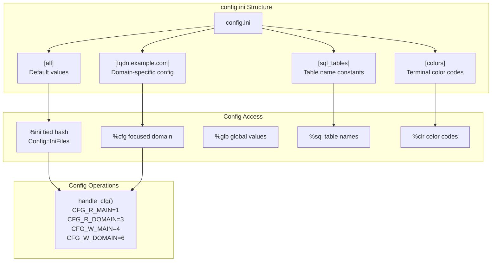

**Configuration Management**: The `config.ini` file uses INI format with domain-specific sections. The `Config::IniFiles` module provides tied hash access, while `handle_cfg()` manages read/write operations with mode constants.

Sources: [install/AutoInstaller.pl:60-113](), [install/AutoInstaller.pl:89-109]()

### Step Constants and State Management

The installer defines 12 steps as Perl constants:

```perl
use constant {
    FIRSTRUN  => 1,
    SOFTWARE  => 2,
    PHP       => 3,
    SERVICES  => 4,
    SQL       => 5,
    OPENAI    => 6,
    TEMPLATES => 7,
    APACHE    => 8,
    PERMS     => 9,
    COMPOSER  => 10,
    CLEANUP   => 11,
    HOSTS     => 12,
};
```

**State Tracking**: Current step stored in `$cfg{step}`, persisted to `config.ini` after each successful step completion. This enables resumption from interruption points.

Sources: [install/AutoInstaller.pl:45-58]()

## Installation Steps

### Step 1: FIRSTRUN - Initial Configuration

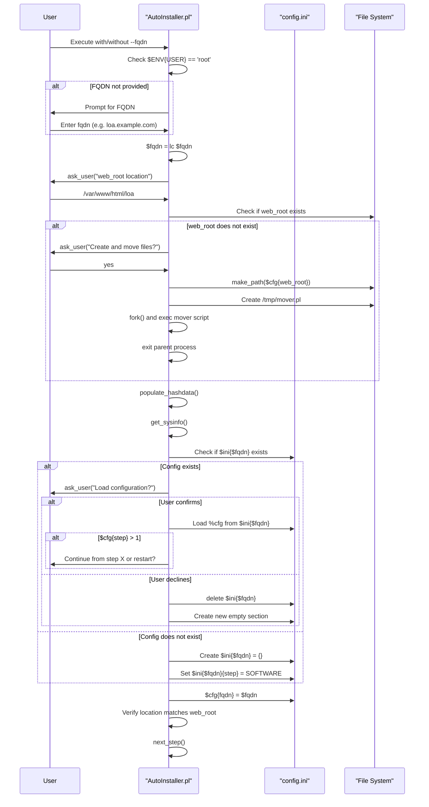

**First Run Logic**: The `step_firstrun()` function handles initial configuration including FQDN setup, web root validation, and configuration persistence. If files are in wrong location, creates a mover script that forks to relocate files and relaunch installer.

Sources: [install/AutoInstaller.pl:116-182](), [install/AutoInstaller.pl:306-372]()

### Step 2: SOFTWARE - Package Installation

**Function**: `step_install_software()` and `step_webserver_configure()`

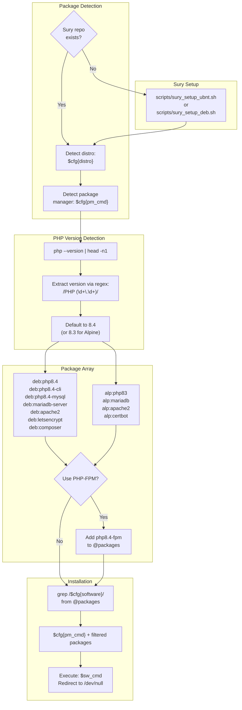

**Software Installation Process**: Detects distribution, adds Sury repository if needed, determines PHP version, builds package array with distribution prefixes (`deb:` or `alp:`), filters by current OS, and executes installation command.

**Web Server Configuration** (`step_webserver_configure()`):
- Prompts for Apache directory (default: `/etc/apache2`)
- Sets virtual host file paths: `$cfg{virthost_conf_file}` and `$cfg{virthost_conf_file_ssl}`
- Configures Apache user (`www-data` on Linux)
- Sets HTTPS port (default: 443) and HTTP port (default: 80)
- Prompts for admin email (default: `webmaster@$fqdn`)

Sources: [install/AutoInstaller.pl:374-487](), [install/AutoInstaller.pl:489-507]()

### Step 3: PHP - Runtime Configuration

**Function**: `step_php_configure()`

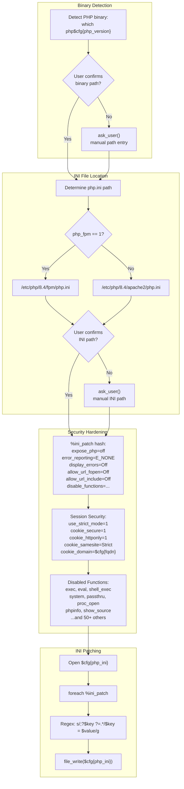

**PHP Security Hardening**: The installer patches `php.ini` with 12 security-focused directives. The `%ini_patch` hash contains key-value pairs that are applied via regex substitution, uncommenting disabled lines and adding missing directives.

**Disabled Functions** (50+ total): `apache_child_terminate`, `apache_setenv`, `chdir`, `chmod`, `eval`, `exec`, `passthru`, `phpinfo`, `popen`, `proc_open`, `shell_exec`, `system`, and many others to prevent shell access and information disclosure.

Sources: [install/AutoInstaller.pl:709-849](), [README.md:237-258]()

### Step 4: SERVICES - Daemon Management

**Function**: `step_start_services()`

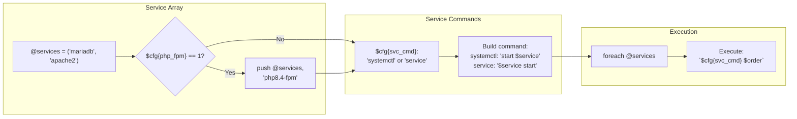

**Service Startup**: Starts core services in order: MariaDB, Apache2, and optionally PHP-FPM. The service command syntax is adapted based on init system (`systemctl` vs `service`).

Sources: [install/AutoInstaller.pl:952-970]()

### Step 5: SQL - Database Initialization

**Function**: `step_sql_configure()`

**Configuration Variables:**

| Variable | Default Value | Purpose |
|----------|---------------|---------|
| `$cfg{sql_username}` | `user_loa` | Database user account |
| `$cfg{sql_password}` | `gen_random(15)` | 15-character random password |
| `$cfg{sql_database}` | `db_loa` | Database name |
| `$cfg{sql_host}` | `127.0.0.1` | Database server address |
| `$cfg{sql_port}` | `3306` | MySQL/MariaDB port |
| `$cfg{sql_config_file}` | `/etc/mysql/mariadb/mariadb.conf.d/50-server.cnf` | Server configuration file |

**Schema Import** (executed in `step_process_templates()`):
1. Prompts for root MySQL password
2. Constructs command: `mysql -u root -p$password < sql.template.ready`
3. Executes schema import
4. Creates user with `GRANT SELECT, INSERT, UPDATE, DELETE` privileges

Sources: [install/AutoInstaller.pl:509-534](), [install/AutoInstaller.pl:896-926]()

### Step 6: OPENAI - API Configuration

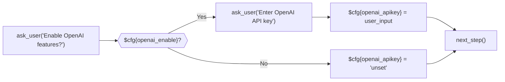

**OpenAI Integration**: Prompts user to enable OpenAI features and provide API key. If disabled, sets key to `'unset'`. The key is later written to `.env` template.

Sources: [install/AutoInstaller.pl:224-234]()

### Step 7: TEMPLATES - File Generation

**Functions**: `step_vhost_ssl()`, `parse_replacements()`, `step_generate_templates()`, `step_process_templates()`

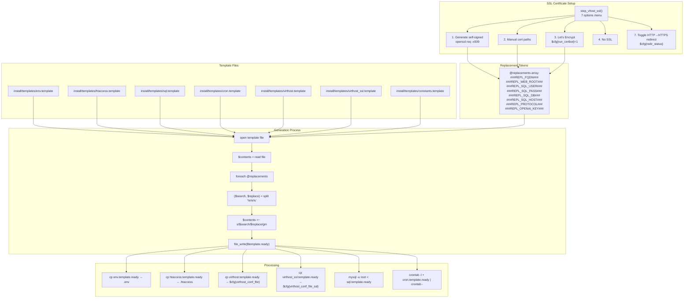

**Template System**: Uses search-and-replace tokens (format: `###REPL_VARIABLE###%%%(value)`) to generate configuration files. The `parse_replacements()` function builds the replacement array from `%cfg` variables, then `step_generate_templates()` performs regex substitution on all template files, creating `.ready` versions.

**Self-Signed Certificate Generation**:
```bash
openssl req -x509 -nodes -days 365 -newkey rsa:2048 \
  -keyout /etc/ssl/private/$fqdn.key \
  -out /etc/ssl/certs/$fqdn.crt \
  -subj '/CN=$fqdn/O=$fqdn/C=ZA' -batch
```

Sources: [install/AutoInstaller.pl:236-263](), [install/AutoInstaller.pl:536-603](), [install/AutoInstaller.pl:861-894](), [install/AutoInstaller.pl:896-950]()

### Step 8: APACHE - Module and Site Activation

**Function**: `step_apache_enables()`

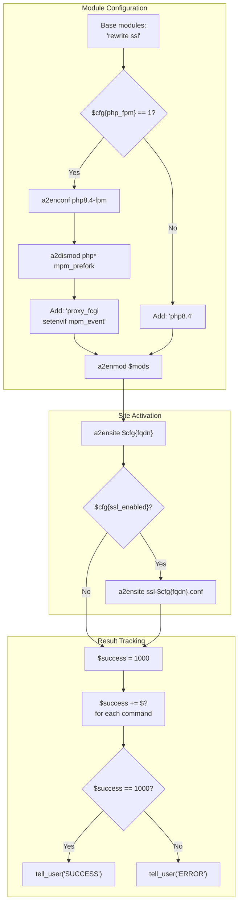

**Apache Configuration**: Enables required modules and sites. For PHP-FPM, disables `mpm_prefork` and mod_php, enables `mpm_event` and FastCGI proxy. For standard mod_php, enables `php8.4` module. Always enables `rewrite` and `ssl` modules.

Sources: [install/AutoInstaller.pl:659-707](), [README.md:188-211]()

### Step 9: PERMS - Permission Management

**Function**: `step_fix_permissions()`

**Permission Strategy:**

| Target | Operation | Permissions | Owner:Group |
|--------|-----------|-------------|-------------|
| All files | `find -type f -exec chmod 644` | `rw-r--r--` | `www-data:www-data` |
| All directories | `find -type d -exec chmod 755` | `rwxr-xr-x` | `www-data:www-data` |
| `.env` | `chmod 0600` | `rw-------` | `www-data:www-data` |
| `config.ini` | `chmod 0600` | `rw-------` | `www-data:www-data` |
| `AutoInstaller.pl` | `chmod 0600` | `rw-------` | `www-data:www-data` |
| Scripts | `chmod 0600` | `rw-------` | `www-data:www-data` |
| Log files | `chmod 0640` | `rw-r-----` | `www-data:www-data` |
| Apache configs | `chmod 0644` | `rw-r--r--` | `www-data:www-data` |
| Templates | `chmod 0600` | `rw-------` | `www-data:www-data` |

**Execution Order:**
1. Baseline: `find $web_root -type f -exec chmod 644 {} +`
2. Directories: `find $web_root -type d -exec chmod 755 {} +`
3. Individual file hardening (config, scripts, logs)
4. Ownership: `chown -R www-data:www-data $web_root`

Sources: [install/AutoInstaller.pl:605-657](), [README.md:20-22]()

### Step 10: COMPOSER - Dependency Installation

**Function**: `step_composer_pull()`

```bash
sudo -u www-data composer --working-dir "$cfg{web_root}" install
sudo -u www-data composer --working-dir "$cfg{web_root}" update
```

**PHP Dependencies** (from `composer.json`):

| Package | Version | Purpose |
|---------|---------|---------|
| `vlucas/phpdotenv` | ^5.6.1 | Environment variable management |
| `monolog/monolog` | ^3.9 | Logging framework |
| `phpmailer/phpmailer` | ^7.0.0 | Email sending |
| `composer/semver` | ^3.4 | Semantic versioning |
| `phpunit/phpunit` | ^12.1 | Unit testing framework |
| `symfony/serializer` | ^7.2 | Object serialization |
| `contributte/monolog` | ^0.5.2 | Nette integration for Monolog |

**Installation Process**: Executes as `www-data` user to ensure correct file ownership. Runs both `install` (for initial setup) and `update` (for package updates).

Sources: [install/AutoInstaller.pl:851-859](), [composer.json:1-30](), [README.md:263-270]()

### Step 11: CLEANUP - Temporary File Removal

**Function**: `clean_up()`

**Cleanup Targets** (identified by `find_temp()`):

```perl
my @files_to_remove = (
    '\.env$',
    '^\.loa-step',
    '\.ready$',
    "ssl-$cfg{fqdn}.conf\$",
    "$cfg{fqdn}.conf\$",
    'php.list$'
);
```

**Cleanup Operations:**
- Removes `.ready` template files
- Removes `.loa-step` progress markers
- Optionally reverts installation (via `--revert` mode):
  - Disables Apache sites
  - Drops database and user
  - Removes Sury repository entries
  - Removes crontab entries

Sources: [install/AutoInstaller.pl:1007-1041](), [install/AutoInstaller.pl:1043-1060]()

### Step 12: HOSTS - Hosts File Update

**Function**: `step_update_hosts()`

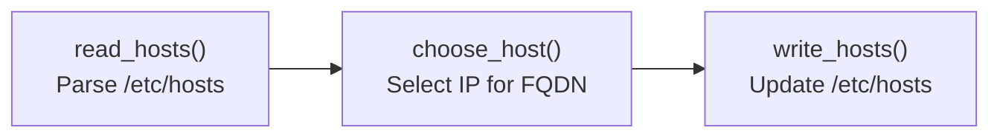

**Hosts File Management**: Updates `/etc/hosts` to include FQDN mapping for local testing. Useful for development environments where DNS is not configured.

Sources: [install/AutoInstaller.pl:972-979]()

## Template System Details

### Template File Locations

All templates reside in `install/templates/` directory:

| Template File | Output Location | Purpose |
|---------------|-----------------|---------|
| `env.template` | `$web_root/.env` | Database credentials, OpenAI key |
| `htaccess.template` | `$web_root/.htaccess` | URL rewriting, security headers |
| `sql.template` | Imported to database | Database schema (20+ tables) |
| `cron.template` | User crontab | Scheduled task configuration |
| `virthost.template` | `/etc/apache2/sites-available/$fqdn.conf` | HTTP virtual host |
| `virthost_ssl.template` | `/etc/apache2/sites-available/ssl-$fqdn.conf` | HTTPS virtual host |
| `constants.template` | `$web_root/system/constants.php` | PHP constants for paths/settings |

Sources: [install/AutoInstaller.pl:872-878]()

### Replacement Token Format

Tokens use the format `###REPL_VARIABLE###` and are defined in `parse_replacements()`:

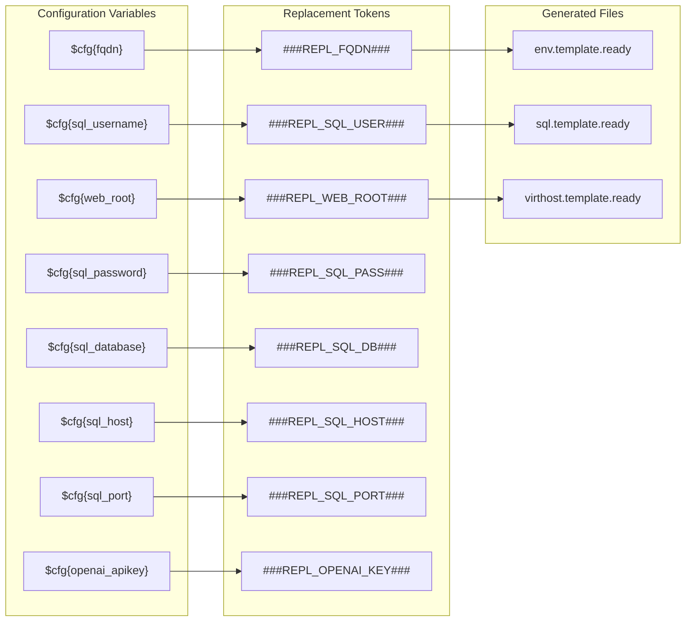

**Token Processing**: The `step_generate_templates()` function iterates through `@replacements`, splits each entry on `%%%` delimiter to extract search/replace pairs, then applies regex `s/$search/$replace/gm` to template contents.

Sources: [install/AutoInstaller.pl:886-891]()

### Database Schema Template

The `sql.template` creates 12 tables:

| Table Name | Purpose | Key Columns |
|------------|---------|-------------|
| `###REPL_SQL_TBL_ACCOUNTS###` | User accounts | `id`, `email`, `password`, `privileges`, `char_slot1-3` |
| `###REPL_SQL_TBL_CHARACTERS###` | Character data | `id`, `account_id`, `name`, `race`, `stats`, `inventory` |
| `###REPL_SQL_TBL_MONSTERS###` | Monster instances | `id`, `character_id`, `level`, `stats`, `scope` |
| `###REPL_SQL_TBL_FAMILIARS###` | Pet companions | `id`, `character_id`, `name`, `rarity`, `hatched` |
| `###REPL_SQL_TBL_FRIENDS###` | Friend relationships | `sender_id`, `recipient_id`, `friend_status` |
| `###REPL_SQL_TBL_MAIL###` | In-game mail | `s_cid`, `r_cid`, `subject`, `message`, `folder` |
| `###REPL_SQL_TBL_BANK###` | Banking system | `account_id`, `character_id`, `gold_amount`, `interest_rate` |
| `###REPL_SQL_TBL_BANNED###` | Ban tracking | `account_id`, `date`, `expires`, `reason` |
| `###REPL_SQL_TBL_GLOBALCHAT###` | Chat messages | `character_id`, `message`, `room`, `when` |
| `###REPL_SQL_TBL_GLOBALS###` | Global variables | `name`, `value` |
| `###REPL_SQL_TBL_LOGS###` | System logs | `date`, `type`, `message`, `ip` |
| `###REPL_SQL_TBL_STATISTICS###` | Player stats | `character_id`, `critical_hits`, `deaths`, `monster_kills` |

**User Creation**: After table creation, the template creates the database user:
```sql
DROP USER IF EXISTS ###REPL_SQL_USER###;
CREATE USER ###REPL_SQL_USER###;
GRANT SELECT, INSERT, UPDATE, DELETE ON ###REPL_SQL_DB###.* 
  TO ###REPL_SQL_USER### IDENTIFIED BY '###REPL_SQL_PASS###';
FLUSH PRIVILEGES;
```

Sources: [install/templates/sql.template:1-312]()

## Manual Installation

For production environments or custom configurations, manual installation provides granular control.

### Manual Prerequisites

1. **Clone Repository**:
```bash
cd /var/www/html
git clone https://github.com/Ziddykins/LegendOfAetheria
cd LegendOfAetheria
```

2. **Set Base Permissions**:
```bash
sudo chown -R www-data:www-data .
find . -type f -exec chmod 0644 {} +
find . -type d -exec chmod 0755 {} +
```

Sources: [README.md:11-22]()

### Manual Software Installation

```bash
# Debian/Ubuntu
sudo apt update && sudo apt upgrade -y
sudo apt install -y \
  php8.4 php8.4-cli php8.4-common php8.4-curl php8.4-dev \
  php8.4-mysql php8.4-xml php8.4-intl php8.4-mbstring \
  mariadb-server apache2 libapache2-mod-php8.4 \
  composer letsencrypt python-is-python3 python3-certbot-apache
```

For PHP-FPM setup:
```bash
sudo apt install -y php8.4-fpm
sudo a2dismod mpm_prefork php*
sudo a2enmod headers http2 ssl setenvif mpm_event proxy_fcgi
sudo a2enconf php8.4-fpm
```

Sources: [README.md:69-203]()

### Manual Template Processing

```bash
cd install
sudo perl AutoInstaller.pl --step TEMPLATES --fqdn your.domain.com --only
```

This generates all `.ready` template files without executing full installation. Import SQL schema:

```bash
mysql -u root -p < install/templates/sql.template.ready
```

Sources: [README.md:78-87](), [README.md:272-286]()

### Manual Apache Virtual Host

**Non-SSL Configuration** (`/etc/apache2/sites-available/loa.example.com.conf`):
```apache
<VirtualHost loa.example.com:80>
    ServerName loa.example.com
    ServerAdmin admin@example.com
    DocumentRoot /var/www/html/LegendOfAetheria

    LogLevel info ssl:warn
    ErrorLog ${APACHE_LOG_DIR}/loa.example.com-error.log
    CustomLog ${APACHE_LOG_DIR}/loa.example.com-access.log combined
</VirtualHost>
```

**SSL Configuration** (`/etc/apache2/sites-available/ssl-loa.example.com.conf`):
```apache
<IfModule mod_ssl.c>
    <VirtualHost loa.example.com:443>
        ServerName loa.example.com
        DocumentRoot /var/www/html/LegendOfAetheria
        
        SSLCertificateFile /etc/letsencrypt/live/example.com/fullchain.pem
        SSLCertificateKeyFile /etc/letsencrypt/live/example.com/privkey.pem
        Include /etc/letsencrypt/options-ssl-apache.conf
        
        Header always set Strict-Transport-Security "max-age=63072000"
    </VirtualHost>
</IfModule>
```

Enable sites:
```bash
sudo a2ensite loa.example.com ssl-loa.example.com
sudo systemctl reload apache2
```

Sources: [README.md:89-191]()

### Manual SSL Certificate

**Let's Encrypt**:
```bash
sudo certbot -d loa.example.com --apache
```

**Self-Signed**:
```bash
sudo openssl req -x509 -nodes -days 365 -newkey rsa:2048 \
  -keyout /etc/ssl/private/loa.key \
  -out /etc/ssl/certs/loa.crt \
  -subj '/CN=loa.local/O=LoA/C=US' -batch
```

Update `/etc/hosts` for local testing:
```
127.0.1.1    loa.local
```

Sources: [README.md:213-235]()

### Manual Cron Jobs

```bash
(sudo -u www-data crontab -l; \
 cat install/templates/cron.template.ready; \
 echo;) | sudo -u www-data crontab -
```

**Cron Job Functions**:
- Daily interest calculation for bank accounts
- Periodic stat regeneration for monsters
- Session cleanup
- Log rotation

Sources: [README.md:288-300]()

## Troubleshooting

### Common Installation Issues

| Issue | Symptom | Solution |
|-------|---------|----------|
| **Permission Denied** | `AutoInstaller.pl` won't execute | Ensure running as root: `sudo ./AutoInstaller.pl` |
| **Missing Perl Modules** | `Can't locate Config/IniFiles.pm` | Run bootstrap script first |
| **PHP Version Not Found** | `php8.4` not available | Install Sury repository before installation |
| **MySQL Connection Failed** | Can't import schema | Verify MariaDB is running: `systemctl status mariadb` |
| **Apache Won't Start** | Port 80/443 already in use | Check for conflicting services: `netstat -tulpn | grep :80` |
| **Composer Fails** | Permission errors during `composer install` | Ensure executed as `www-data` user |
| **Template Not Found** | Missing `.ready` files | Run TEMPLATES step: `--step TEMPLATES` |
| **Web Root Mismatch** | Files not in correct location | Use mover script or manual relocation |

### Log File Locations

| Log File | Purpose |
|----------|---------|
| `system/logs/setup.log` | Installation script output |
| `system/logs/gamelog.txt` | Application runtime logs |
| `/var/log/apache2/$fqdn-error.log` | Apache errors |
| `/var/log/apache2/$fqdn-access.log` | HTTP requests |
| `/var/log/mysql/error.log` | Database errors |

### Resuming Interrupted Installation

The installer automatically resumes from the last completed step:

```bash
sudo ./AutoInstaller.pl --fqdn loa.example.com
```

To force restart from specific step:
```bash
sudo ./AutoInstaller.pl --fqdn loa.example.com --step PHP
```

To re-run only one step without continuing:
```bash
sudo ./AutoInstaller.pl --fqdn loa.example.com --step SQL --only
```

Sources: [install/AutoInstaller.pl:187-193](), [install/AutoInstaller.pl:315-337]()

### Verification Steps

After installation completes:

1. **Check Services**:
```bash
systemctl status apache2 mariadb
```

2. **Verify Database**:
```bash
mysql -u user_loa -p
> SHOW DATABASES;
> USE db_loa;
> SHOW TABLES;
```

3. **Test Web Access**:
```bash
curl -I http://loa.example.com
curl -I https://loa.example.com
```

4. **Check Logs**:
```bash
tail -f /var/log/apache2/loa.example.com-error.log
```

5. **Verify Permissions**:
```bash
ls -la /var/www/html/LegendOfAetheria/.env
# Should show: -rw------- 1 www-data www-data
```

Sources: [install/AutoInstaller.pl:605-657]()