# AutoInstaller

<details>
<summary>Relevant source files</summary>

The following files were used as context for generating this wiki page:

- [.gitignore](.gitignore)
- [composer.json](composer.json)
- [composer.lock](composer.lock)
- [install/AutoInstaller.pl](install/AutoInstaller.pl)
- [install/scripts/windows/bootstrap.ps1](install/scripts/windows/bootstrap.ps1)
- [install/scripts/windows/main.ps1](install/scripts/windows/main.ps1)
- [install/templates/sql.template](install/templates/sql.template)
- [tbl_explore/table_explore.pl](tbl_explore/table_explore.pl)

</details>


The AutoInstaller is a Perl-based installation orchestrator that automates the complete deployment of Legend of Aetheria on Linux and Windows systems. It manages software installation, web server configuration, database schema creation, SSL certificate setup, and file permissions through a sequential, resumable step-based process.

For prerequisite information before running the AutoInstaller, see [Prerequisites](#2.1). For details on the configuration file format and available settings, see [Configuration](#2.3). For Apache-specific setup details, see [Web Server Setup](#2.4).

## Script Overview

The AutoInstaller is implemented as a single Perl script located at [install/AutoInstaller.pl:1-2175](). It orchestrates 12 distinct installation steps, each responsible for a specific aspect of system setup. The script version is 2.6.4.28 and requires root privileges to execute.

**Sources:** [install/AutoInstaller.pl:1-119]()

## Installation Step Pipeline

The AutoInstaller executes steps sequentially, tracking progress in the configuration file to enable resumption after interruptions.

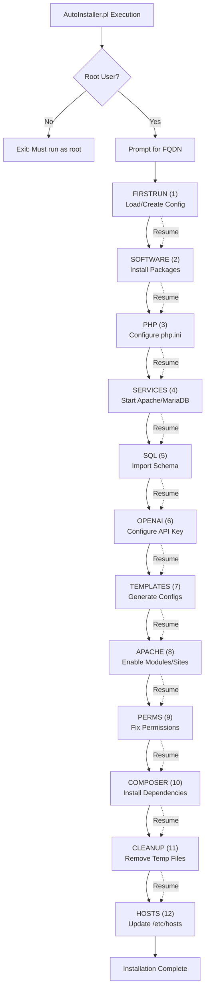

**Step Constants and Flow**

| Step Number | Constant Name | Function | Description |
|-------------|---------------|----------|-------------|
| 1 | `FIRSTRUN` | `step_firstrun()` | Load existing config or create new |
| 2 | `SOFTWARE` | `step_install_software()` | Install Apache, MariaDB, PHP packages |
| 3 | `PHP` | `step_php_configure()` | Modify php.ini with security settings |
| 4 | `SERVICES` | `step_start_services()` | Start web server and database |
| 5 | `SQL` | `step_sql_configure()` | Prompt for DB credentials |
| 6 | `OPENAI` | N/A (inline) | Configure OpenAI API integration |
| 7 | `TEMPLATES` | `step_generate_templates()` | Process template files |
| 8 | `APACHE` | `step_apache_enables()` | Enable Apache modules and sites |
| 9 | `PERMS` | `step_fix_permissions()` | Set file/directory permissions |
| 10 | `COMPOSER` | `step_composer_pull()` | Run composer install/update |
| 11 | `CLEANUP` | `clean_up()` | Remove temporary files |
| 12 | `HOSTS` | `step_update_hosts()` | Update /etc/hosts entries |

**Sources:** [install/AutoInstaller.pl:45-58](), [install/AutoInstaller.pl:187-299]()

## Command Line Interface

The AutoInstaller supports command-line arguments for automated or partial installations:

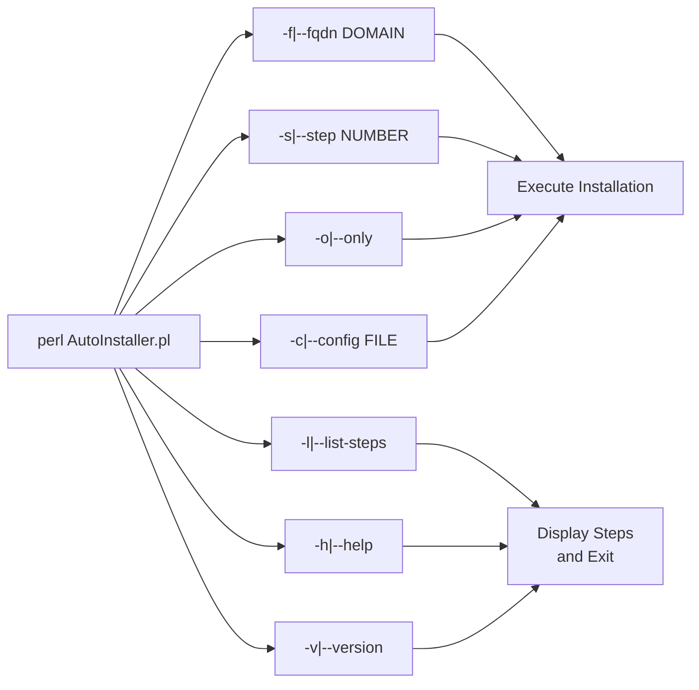

**Option Details**

| Option | Description | Example |
|--------|-------------|---------|
| `-f`, `--fqdn` | Specify fully qualified domain name | `--fqdn loa.example.com` |
| `-s`, `--step` | Start from specific step (name or number) | `--step SOFTWARE` or `--step 2` |
| `-o`, `--only` | Execute only specified step, don't continue | `--only --step APACHE` |
| `-c`, `--config` | Use alternate config file | `--config custom.ini` |
| `-l`, `--list-steps` | Display all step names and numbers | N/A |
| `-h`, `--help` | Show help message | N/A |
| `-v`, `--version` | Display version (2.6.4.28) | N/A |

**Sources:** [install/AutoInstaller.pl:20-39]()

## Configuration Management System

The AutoInstaller uses `Config::IniFiles` to manage persistent configuration across installation steps. Configuration is stored in `config.ini` with per-FQDN sections.

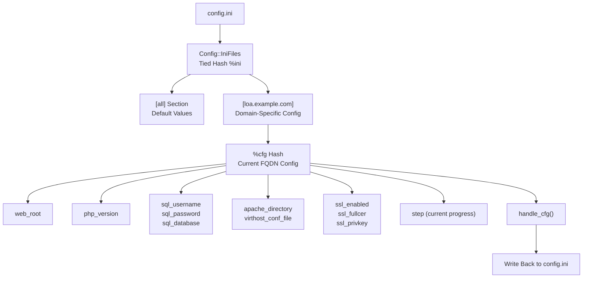

**Configuration Hash Structure**

The `%cfg` hash contains the current FQDN's configuration:

| Key | Type | Description | Example |
|-----|------|-------------|---------|
| `fqdn` | string | Fully qualified domain name | `loa.example.com` |
| `step` | integer | Current installation step | `5` |
| `web_root` | path | Web server document root | `/var/www/loa` |
| `php_version` | string | PHP major.minor version | `8.4` |
| `php_ini` | path | PHP configuration file | `/etc/php/8.4/apache2/php.ini` |
| `php_binary` | path | PHP executable | `/usr/bin/php8.4` |
| `php_fpm` | boolean | Use PHP-FPM instead of mod_php | `1` |
| `sql_username` | string | Database user | `user_loa` |
| `sql_password` | string | Database password | (generated) |
| `sql_database` | string | Database name | `db_loa` |
| `sql_host` | string | Database host | `127.0.0.1` |
| `sql_port` | integer | Database port | `3306` |
| `apache_directory` | path | Apache config directory | `/etc/apache2` |
| `apache_http_port` | integer | HTTP port | `80` |
| `apache_https_port` | integer | HTTPS port | `443` |
| `apache_runas` | string | Apache user | `www-data` |
| `ssl_enabled` | boolean | Enable SSL | `1` |
| `ssl_fullcer` | path | SSL certificate path | `/etc/ssl/certs/loa.example.com.crt` |
| `ssl_privkey` | path | SSL private key path | `/etc/ssl/private/loa.example.com.key` |
| `openai_enable` | boolean | Enable OpenAI features | `0` |
| `openai_apikey` | string | OpenAI API key | (user provided) |

**Sources:** [install/AutoInstaller.pl:75-112](), [install/AutoInstaller.pl:184-193]()

## Template Processing System

The AutoInstaller uses a template-based system to generate configuration files with environment-specific values. Templates contain placeholders that are replaced with actual configuration data.

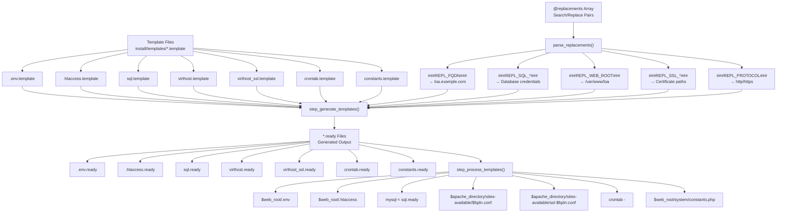

**Template Replacement Syntax**

Template files use `###REPL_*###` placeholders that are replaced during `step_generate_templates()`:

| Placeholder | Replacement Source | Example Value |
|-------------|-------------------|---------------|
| `###REPL_FQDN###` | `$cfg{fqdn}` | `loa.example.com` |
| `###REPL_WEB_ROOT###` | `$cfg{web_root}` | `/var/www/loa` |
| `###REPL_SQL_DB###` | `$cfg{sql_database}` | `db_loa` |
| `###REPL_SQL_USER###` | `$cfg{sql_username}` | `user_loa` |
| `###REPL_SQL_PASS###` | `$cfg{sql_password}` | (generated password) |
| `###REPL_SQL_HOST###` | `$cfg{sql_host}` | `127.0.0.1` |
| `###REPL_SQL_PORT###` | `$cfg{sql_port}` | `3306` |
| `###REPL_SSL_CERT###` | `$cfg{ssl_fullcer}` | `/etc/ssl/certs/loa.example.com.crt` |
| `###REPL_SSL_KEY###` | `$cfg{ssl_privkey}` | `/etc/ssl/private/loa.example.com.key` |
| `###REPL_PROTOCOL###` | `http` or `https` | `https` |
| `###REPL_SQL_TBL_*###` | `%sql` hash | `loa_accounts` |

**Sources:** [install/AutoInstaller.pl:236-263](), [install/AutoInstaller.pl:861-950]()

## Software Installation Step

The `SOFTWARE` step installs all required packages using the system's package manager. It detects the operating system and uses either `apt` (Debian/Ubuntu) or `apk` (Alpine).

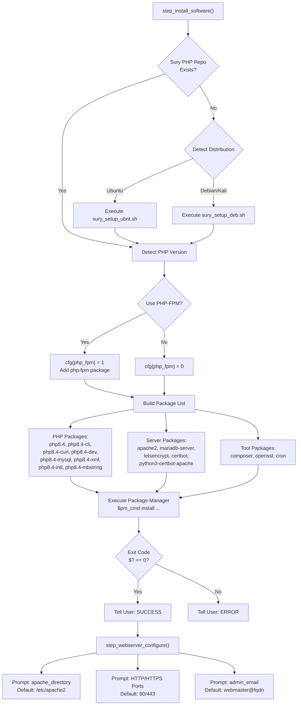

**Package List by Distribution**

The script installs distribution-specific packages prefixed with `deb:` or `alp:`:

| Package | Debian/Ubuntu | Alpine | Purpose |
|---------|---------------|--------|---------|
| PHP | `php8.4` | `php84` | PHP runtime |
| PHP CLI | `php8.4-cli` | `php84-cli` | Command-line interface |
| PHP MySQL | `php8.4-mysql` | N/A | MySQL extension |
| PHP Extensions | `php8.4-{curl,xml,intl,mbstring}` | `php84-{curl,xml,intl,mbstring}` | Required extensions |
| Apache | `apache2` | `apache2` | Web server |
| MariaDB | `mariadb-server` | `mariadb` | Database server |
| Certbot | `python3-certbot-apache` | `certbot-apache` | SSL automation |
| PHP-FPM | `php8.4-fpm` | `php84-fpm` | FastCGI Process Manager (optional) |

**Sources:** [install/AutoInstaller.pl:374-507](), [install/AutoInstaller.pl:435-463]()

## PHP Configuration Step

The `PHP` step modifies the `php.ini` file to apply security hardening and session management settings.

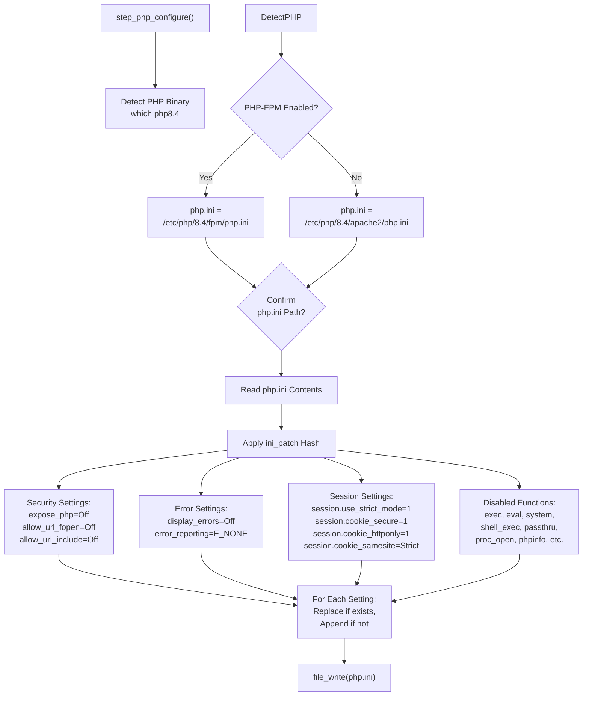

**Key PHP Configuration Changes**

| Setting | Value | Purpose |
|---------|-------|---------|
| `expose_php` | `Off` | Hide PHP version from headers |
| `error_reporting` | `E_NONE` | Disable error reporting |
| `display_errors` | `Off` | Don't display errors to users |
| `allow_url_fopen` | `Off` | Prevent remote file inclusion |
| `allow_url_include` | `Off` | Prevent remote code inclusion |
| `session.use_strict_mode` | `1` | Reject uninitialized session IDs |
| `session.cookie_domain` | `$fqdn` | Restrict cookies to domain |
| `session.cookie_secure` | `1` | HTTPS-only cookies |
| `session.cookie_httponly` | `1` | Prevent JavaScript cookie access |
| `session.cookie_samesite` | `Strict` | CSRF protection |
| `session.gc_maxlifetime` | `600` | Session timeout (10 minutes) |
| `disable_functions` | (extensive list) | Disable dangerous functions |

**Disabled PHP Functions**

The AutoInstaller disables 80+ dangerous PHP functions including: `exec`, `eval`, `system`, `shell_exec`, `passthru`, `proc_open`, `proc_close`, `popen`, `phpinfo`, `chmod`, `chdir`, `mkdir`, `rmdir`, `rename`, `move_uploaded_file`, and many others.

**Sources:** [install/AutoInstaller.pl:709-849](), [install/AutoInstaller.pl:721-782]()

## Database Setup Step

The `SQL` step creates the database schema, user account, and grants privileges.

```mermaid
graph TB
    StepSQL["step_sql_configure()"] --> GenCreds["Generate Credentials:<br/>sql_username='user_loa'<br/>sql_password=gen_random(15)<br/>sql_database='db_loa'"]
    
    GenCreds --> PromptConfig["Prompt for:<br/>sql_config_file<br/>sql_username<br/>sql_password<br/>sql_database<br/>sql_host (127.0.0.1)<br/>sql_port (3306)"]
    
    PromptConfig --> Templates["TEMPLATES Step"]
    
    Templates --> GenSQL["step_generate_templates():<br/>Process sql.template"]
    
    GenSQL --> ReplacePlaceholders["Replace in sql.template:<br/>###REPL_SQL_DB### → db_loa<br/>###REPL_SQL_USER### → user_loa<br/>###REPL_SQL_PASS### → (password)<br/>###REPL_SQL_TBL_*### → table names"]
    
    ReplacePlaceholders --> WriteReady["Write sql.ready"]
    
    WriteReady --> ProcessTemplates["step_process_templates()"]
    
    ProcessTemplates --> PromptRootPW["Prompt for MySQL<br/>root password"]
    
    PromptRootPW --> ImportSchema["Execute:<br/>mysql -u root -p$rootpw<br/>< sql.ready"]
    
    ImportSchema --> CreateDB["CREATE DATABASE db_loa"]
    CreateDB --> CreateUser["CREATE USER user_loa"]
    CreateUser --> GrantPrivs["GRANT SELECT, INSERT,<br/>UPDATE, DELETE"]
    GrantPrivs --> FlushPrivs["FLUSH PRIVILEGES"]
    
    FlushPrivs --> CreateTables["Create Tables:<br/>accounts, characters,<br/>monsters, familiars,<br/>friends, mail, bank,<br/>statistics, logs, etc."]
```

**Database Schema Overview**

The SQL template creates the following tables:

| Table | Purpose | Key Columns |
|-------|---------|-------------|
| `loa_accounts` | User accounts | `id`, `email`, `password`, `privileges`, `char_slot1-3` |
| `loa_characters` | Player characters | `id`, `account_id`, `name`, `race`, `level`, `stats`, `inventory` |
| `loa_monsters` | Monster encounters | `id`, `character_id`, `level`, `scope`, `stats` |
| `loa_familiars` | Pet companions | `id`, `character_id`, `name`, `rarity`, `hatched` |
| `loa_friends` | Friend relationships | `id`, `sender_id`, `recipient_id`, `friend_status` |
| `loa_mail` | In-game mail | `id`, `s_cid`, `r_cid`, `subject`, `message`, `folder` |
| `loa_bank` | Bank accounts | `id`, `character_id`, `gold_amount`, `interest_rate` |
| `loa_statistics` | Player statistics | `id`, `character_id`, `critical_hits`, `deaths`, etc. |
| `loa_globalchat` | Chat messages | `id`, `character_id`, `message`, `room` |
| `loa_logs` | System logs | `id`, `date`, `type`, `message` |
| `loa_banned` | Ban records | `id`, `account_id`, `expires`, `reason` |
| `loa_globals` | Global settings | `id`, `name`, `value` |

**Sources:** [install/AutoInstaller.pl:509-534](), [install/templates/sql.template:1-312]()

## SSL Certificate Configuration

The AutoInstaller supports three SSL certificate options configured during the `TEMPLATES` step.

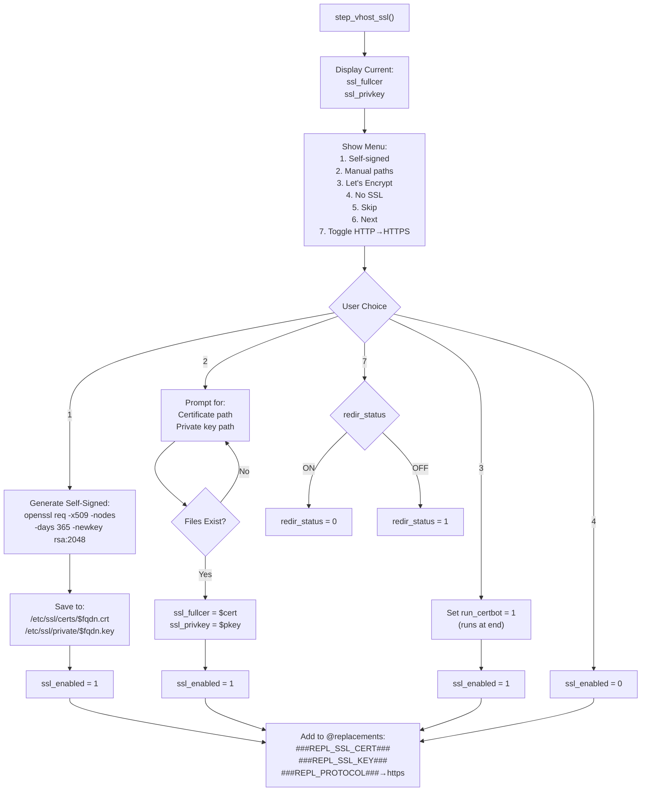

**SSL Configuration Variables**

| Variable | Description | Example |
|----------|-------------|---------|
| `ssl_enabled` | Whether SSL is enabled | `1` or `0` |
| `ssl_fullcer` | Full certificate chain path | `/etc/ssl/certs/loa.example.com.crt` |
| `ssl_privkey` | Private key path | `/etc/ssl/private/loa.example.com.key` |
| `redir_status` | HTTP to HTTPS redirect | `1` (enabled) or `0` (disabled) |
| `run_certbot` | Run certbot at end of install | `1` or `0` |

**Self-Signed Certificate Command**

```bash
openssl req -x509 -nodes -days 365 -newkey rsa:2048 \
  -keyout /etc/ssl/private/$fqdn.key \
  -out /etc/ssl/certs/$fqdn.crt \
  -subj "/CN=$fqdn/O=$fqdn/C=ZA" -batch
```

**Sources:** [install/AutoInstaller.pl:536-603]()

## Apache Module and Site Enablement

The `APACHE` step enables required Apache modules and virtual host configurations.

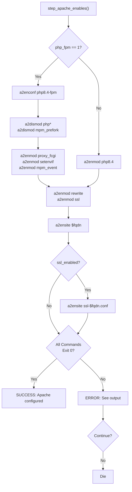

**Apache Modules Enabled**

| Module | Purpose | Condition |
|--------|---------|-----------|
| `rewrite` | URL rewriting for clean URLs | Always |
| `ssl` | HTTPS support | Always |
| `php8.4` | PHP as Apache module | When `php_fpm=0` |
| `proxy_fcgi` | FastCGI proxy | When `php_fpm=1` |
| `setenvif` | Set environment variables | When `php_fpm=1` |
| `mpm_event` | Event-driven worker MPM | When `php_fpm=1` |

**Virtual Host Files**

- Non-SSL: `$apache_directory/sites-available/$fqdn.conf`
- SSL: `$apache_directory/sites-available/ssl-$fqdn.conf`

Both are generated from templates and enabled via `a2ensite`.

**Sources:** [install/AutoInstaller.pl:659-707]()

## File Permission Management

The `PERMS` step sets appropriate Unix permissions on all files and directories.

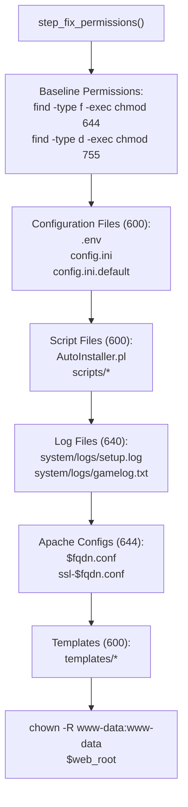

**Permission Scheme**

| File Type | Owner | Permissions | Octal | Description |
|-----------|-------|-------------|-------|-------------|
| Regular files | `www-data:www-data` | `rw-r--r--` | `644` | Web-readable files |
| Directories | `www-data:www-data` | `rwxr-xr-x` | `755` | Executable directories |
| Config files | `www-data:www-data` | `rw-------` | `600` | Sensitive configurations |
| Script files | `www-data:www-data` | `rw-------` | `600` | Installation scripts |
| Log files | `www-data:www-data` | `rw-r-----` | `640` | Log files |
| Apache configs | `root:root` | `rw-r--r--` | `644` | Server configurations |
| Templates | `www-data:www-data` | `rw-------` | `600` | Template files |

**Sources:** [install/AutoInstaller.pl:605-657]()

## Composer Dependency Installation

The `COMPOSER` step installs PHP dependencies defined in `composer.json`.

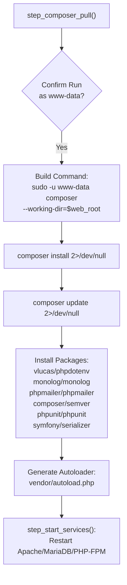

**Installed Composer Packages**

From [composer.json:1-30]():

| Package | Version | Purpose |
|---------|---------|---------|
| `vlucas/phpdotenv` | ^5.6.1 | Environment variable loading |
| `monolog/monolog` | ^3.9 | Logging framework |
| `phpmailer/phpmailer` | ^7.0.0 | Email sending |
| `composer/semver` | ^3.4 | Semantic versioning |
| `phpunit/phpunit` | ^12.1 | Unit testing framework |
| `symfony/serializer` | ^7.2 | Object serialization |
| `contributte/monolog` | ^0.5.2 | Monolog integration |

**Sources:** [install/AutoInstaller.pl:851-859](), [composer.json:1-30]()

## Cleanup and Finalization

The `CLEANUP` step removes temporary files generated during installation.

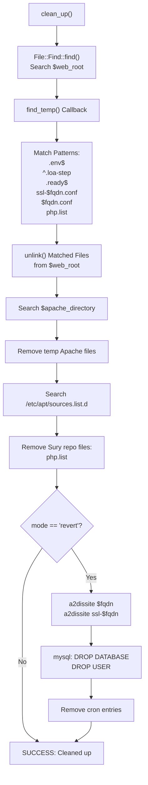

**Files Removed by Cleanup**

| Pattern | Description | Location |
|---------|-------------|----------|
| `*.ready` | Generated template output files | `install/templates/` |
| `.env` | Environment file (moved to web root) | `install/` |
| `.loa-step*` | Step tracking files | `$web_root/` |
| `php.list` | Sury repository source file | `/etc/apt/sources.list.d/` |
| `ssl-$fqdn.conf` | Duplicate SSL config | `install/` |
| `$fqdn.conf` | Duplicate vhost config | `install/` |

**Sources:** [install/AutoInstaller.pl:1007-1041](), [install/AutoInstaller.pl:1043-1060]()

## Platform-Specific Bootstrap Scripts

For initial dependency installation, platform-specific bootstrap scripts prepare the system before running AutoInstaller.pl.

### Linux Bootstrap

The Linux bootstrap script detects the distribution and installs Perl dependencies:

```bash
#!/bin/bash
# bootstrap.sh

# Detect OS
if [ -f /etc/os-release ]; then
    . /etc/os-release
    OS=$ID
fi

# Install Perl and CPAN modules
case $OS in
    debian|ubuntu|kali)
        apt-get update
        apt-get install -y perl cpanminus
        cpanm Config::IniFiles Term::ReadKey File::Path Getopt::Long
        ;;
    alpine)
        apk add perl perl-dev
        cpan Config::IniFiles Term::ReadKey
        ;;
esac

# Create config.ini if needed
if [ ! -f config.ini ] && [ -f config.ini.default ]; then
    cp config.ini.default config.ini
fi

# Run AutoInstaller
perl AutoInstaller.pl
```

### Windows Bootstrap

The Windows PowerShell bootstrap handles XAMPP or individual component installation:

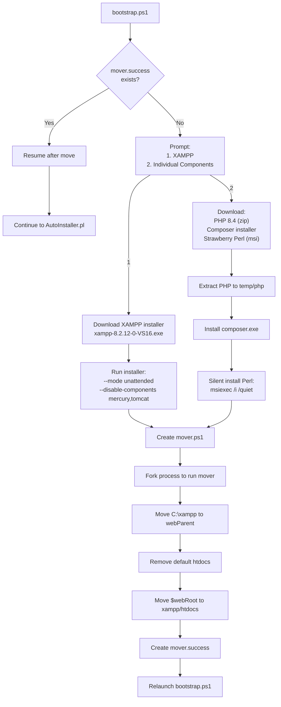

**Sources:** [install/scripts/windows/bootstrap.ps1:1-8](), [install/scripts/windows/main.ps1:1-133]()

## Error Handling and Resumption

The AutoInstaller implements robust error handling and step resumption:

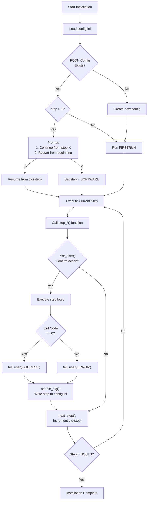

**Resumption Mechanism**

1. **Step Tracking**: Current step stored in `cfg{step}` and persisted to config.ini via `handle_cfg()`
2. **Config Preservation**: All user choices saved between steps
3. **Idempotent Operations**: Most steps check for existing configuration before modifying
4. **Manual Resume**: Use `--step` flag to jump to specific step: `perl AutoInstaller.pl --step APACHE`
5. **Partial Execution**: Use `--only` flag to run single step without continuing

**User Interaction Functions**

| Function | Purpose | Return Type |
|----------|---------|-------------|
| `ask_user($question, $default, $type)` | Prompt user for input | string or boolean |
| `tell_user($level, $message)` | Display colored status message | void |
| `handle_cfg(\%cfg, $mode, $fqdn)` | Save/load configuration | void |
| `next_step()` | Increment step counter and save | void |
| `const_to_name($step)` | Convert step number to name | string |
| `name_to_const($name)` | Convert step name to number | integer |

**Sources:** [install/AutoInstaller.pl:306-372](), [install/AutoInstaller.pl:1355-1395]()

## Post-Installation State

Upon successful completion, the AutoInstaller has configured a fully operational web application environment:

**Generated Files**

| File | Location | Purpose |
|------|----------|---------|
| `.env` | `$web_root/.env` | Environment variables for PHP |
| `.htaccess` | `$web_root/.htaccess` | URL rewriting rules |
| `constants.php` | `$web_root/system/constants.php` | PHP constants |
| `$fqdn.conf` | `$apache_directory/sites-available/` | HTTP virtual host |
| `ssl-$fqdn.conf` | `$apache_directory/sites-available/` | HTTPS virtual host |

**System State**

- Apache2 running with enabled modules: `rewrite`, `ssl`, `php8.4` or `proxy_fcgi`
- MariaDB running with database `db_loa` and user `user_loa`
- PHP-FPM running (if enabled)
- Cron jobs installed for `www-data` user
- SSL certificates configured
- File permissions set correctly
- Composer dependencies installed in `vendor/`
- Database schema populated with 12+ tables
- Application accessible at `http(s)://fqdn/`

**Next Steps**

After installation completion:

1. Test application access: `curl https://$fqdn/`
2. Verify database: `mysql -u user_loa -p db_loa`
3. Check Apache status: `systemctl status apache2`
4. Review logs: `tail -f /var/log/apache2/error.log`
5. Create first account at `https://$fqdn/register`

**Sources:** [install/AutoInstaller.pl:301-302]()