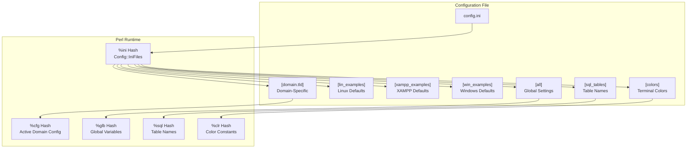
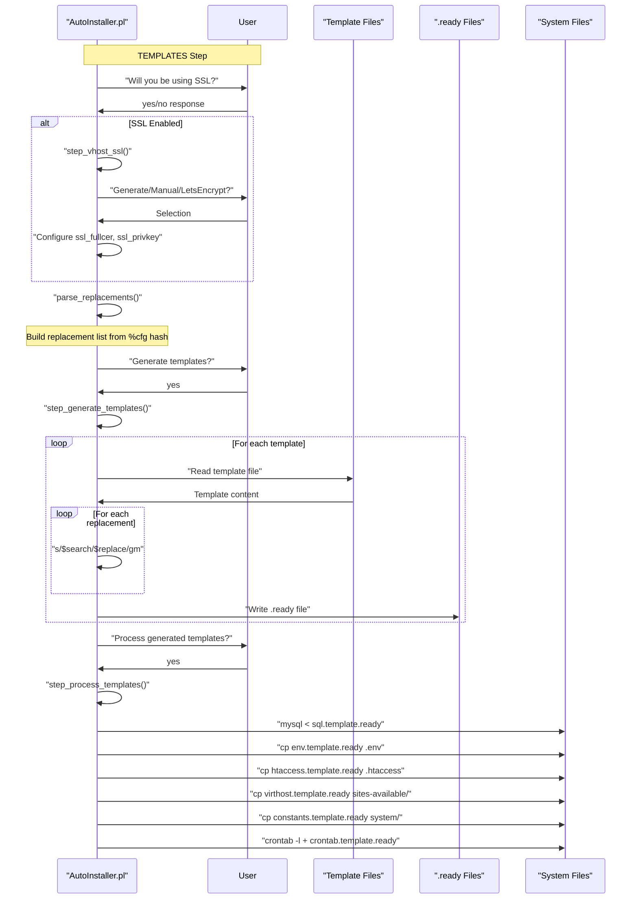
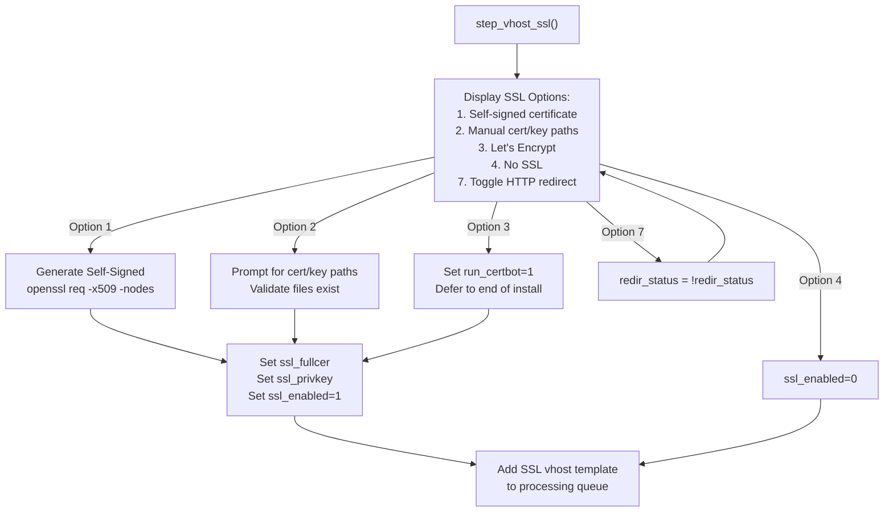
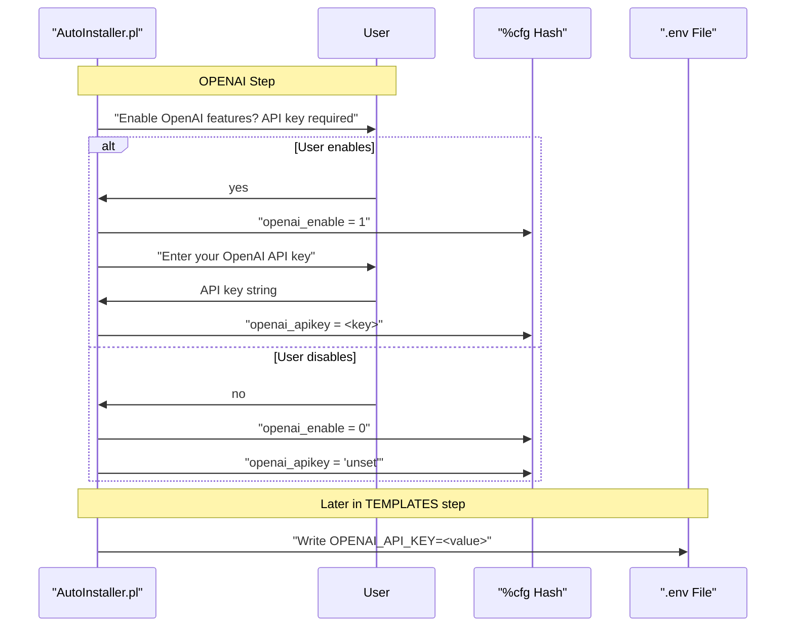
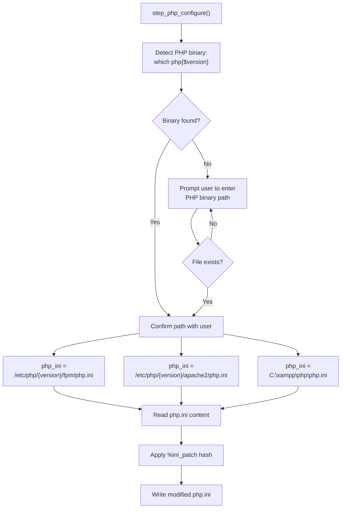
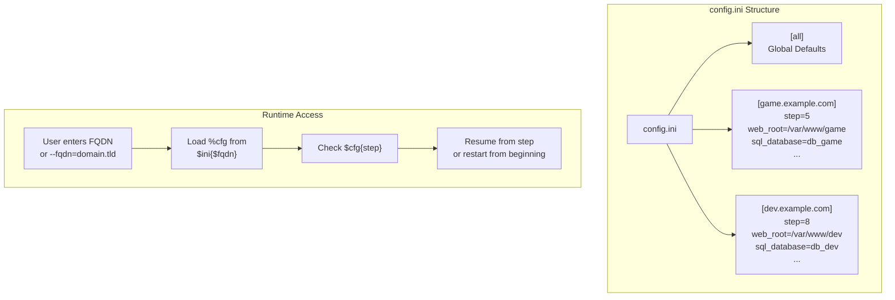
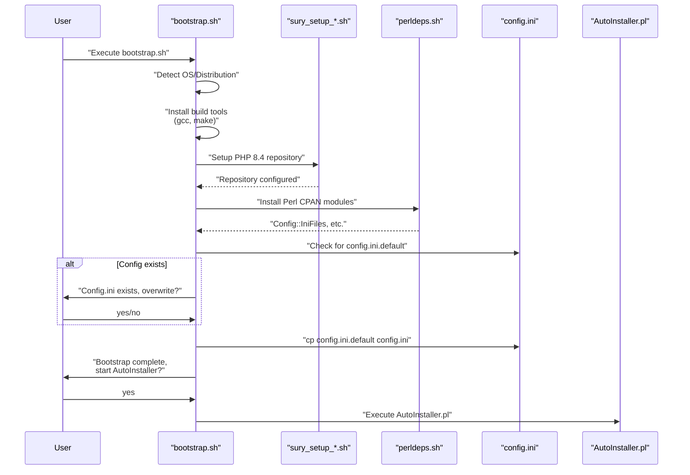

# Configuration

<details>
<summary>Relevant source files</summary>

The following files were used as context for generating this wiki page:

- [INSTALL.md](INSTALL.md)
- [composer.json](composer.json)
- [composer.lock](composer.lock)
- [install/AutoInstaller.pl](install/AutoInstaller.pl)
- [install/config.ini.default](install/config.ini.default)
- [install/scripts/bootstrap.sh](install/scripts/bootstrap.sh)
- [install/templates/sql.template](install/templates/sql.template)

</details>


This document explains the configuration system used by Legend of Aetheria, including the `config.ini` structure, template-based configuration generation, and how to configure database connections, Apache virtual hosts, SSL certificates, and OpenAI integration. For information about the automated installation process that uses these configurations, see [AutoInstaller](#2.2). For web server-specific setup details, see [Web Server Setup](#2.4).

---

## Configuration File Structure

Legend of Aetheria uses an INI-based configuration system managed through `config.ini`, which stores settings for installation, deployment, and runtime operation. The configuration is read by the AutoInstaller using the `Config::IniFiles` Perl module.

### Config.ini Format

The configuration file follows the INI format with multiple sections for organizing settings by purpose and platform. The file is tied to a hash structure for programmatic access:

[install/AutoInstaller.pl:104-112]()



**Configuration Hash Loading**

Sources: [install/AutoInstaller.pl:104-113]()

---

### Configuration Sections

The configuration is organized into several sections, each serving a distinct purpose:

| Section | Purpose | Typical Keys |
|---------|---------|--------------|
| `[all]` | Global defaults for all installations | Empty keys to be filled per-domain |
| `[lin_examples]` | Linux platform defaults | `/var/www/html`, `/usr/bin/php`, `/etc/apache2` |
| `[xampp_examples]` | XAMPP stack defaults | `C:\xampp\htdocs`, `C:\xampp\php\php.exe` |
| `[win_examples]` | Windows native defaults | `C:\Program Files\Apache...` |
| `[sql_tables]` | Database table name mappings | `tbl_accounts`, `tbl_characters`, etc. |
| `[colors]` | Terminal color codes for output | `red=[31m`, `green=[32m`, etc. |
| `[<fqdn>]` | Domain-specific configuration | All settings for a specific installation |

Sources: [install/config.ini.default:1-95]()

---

### Platform-Specific Examples

The configuration file provides platform-specific default values that are automatically selected based on the operating system detected during installation:

**Linux Defaults:**

```ini
[lin_examples]
web_root=/var/www/html
php_binary=/usr/bin/php
sql_config_file=/etc/mysql/mariadb.conf.d/50-server.cnf
apache_directory=/etc/apache2
apache_runas=www-data
composer_runas=www-data
hosts_file=/etc/hosts
ssl_fullcer=/etc/ssl/certs/ssl-cert-snakeoil.pem
ssl_privkey=/etc/ssl/private/ssl-cert-snakeoil.key
```

**XAMPP Defaults:**

```ini
[xampp_examples]
web_root=C:\xampp\htdocs
php_binary=C:\xampp\php\php.exe
sql_config_file=C:\xampp\mysql\bin\my.ini
apache_directory=C:\xampp\apache
ssl_fullcer=C:\xampp\apache\conf\ssl.crt\server.crt
ssl_privkey=C:\xampp\apache\conf\ssl.key\server.key
hosts_file=C:\windows\system32\drivers\etc\hosts
```

Sources: [install/config.ini.default:37-72]()

---

## Template System

The AutoInstaller uses a template-based system to generate configuration files with domain-specific and environment-specific values. Templates contain placeholder tokens that are replaced during the `TEMPLATES` installation step.

### Template Files

Seven template files are processed during installation:

| Template File | Output Destination | Purpose |
|---------------|-------------------|---------|
| `env.template` | `<web_root>/.env` | Environment variables for PHP application |
| `htaccess.template` | `<web_root>/.htaccess` | Apache URL rewriting and security rules |
| `sql.template` | Executed via `mysql` command | Database schema and user creation |
| `crontab.template` | User crontab for `apache_runas` | Scheduled maintenance tasks |
| `virthost.template` | `<apache_directory>/sites-available/<fqdn>.conf` | HTTP virtual host configuration |
| `virthost_ssl.template` | `<apache_directory>/sites-available/ssl-<fqdn>.conf` | HTTPS virtual host configuration |
| `constants.template` | `<web_root>/system/constants.php` | PHP runtime constants |

Sources: [install/AutoInstaller.pl:872-878]()

---

### Placeholder Syntax

Templates use the placeholder format `###REPL_<NAME>###` which are replaced with actual values during processing. The replacement system supports both simple token replacement and conditional removal of lines:

**Standard Placeholders:**

```
###REPL_SQL_DB###      → Database name
###REPL_SQL_USER###    → SQL username
###REPL_SQL_PASS###    → SQL password
###REPL_PROTOCOL###    → http or https
###REPL_FQDN###        → Fully qualified domain name
###REPL_WEB_ROOT###    → Web server document root
```

**Conditional Placeholders:**

```
# SSLREM %%%           → Line removal marker for SSL-specific lines
```

Sources: [install/templates/sql.template:1-311](), [install/AutoInstaller.pl:237-252]()

---

### Template Processing Workflow



**Template Generation and Processing**

Sources: [install/AutoInstaller.pl:236-263](), [install/AutoInstaller.pl:861-950]()

---

## Database Configuration

Database connection settings are configured during the `SQL` step of the AutoInstaller and stored in both `config.ini` and the generated `.env` file.

### Database Settings

The following configuration keys control database connectivity:

| Configuration Key | Default Value | Description |
|------------------|---------------|-------------|
| `sql_username` | `user_loa` | MySQL/MariaDB username |
| `sql_password` | 15-char random | Randomly generated secure password |
| `sql_database` | `db_loa` | Database name |
| `sql_host` | `127.0.0.1` | Database server hostname/IP |
| `sql_port` | `3306` | Database server port |
| `sql_config_file` | Platform-specific | Path to MySQL configuration file |

Sources: [install/AutoInstaller.pl:509-533]()

### SQL Configuration Flow

```mermaid
graph LR
    subgraph "SQL Step"
        Start["step_sql_configure()"]
        
        GenDefaults["Generate Defaults<br/>user_loa, db_loa<br/>gen_random(15)"]
        
        PromptUser["Prompt User for:<br/>- SQL config file path<br/>- Username<br/>- Password<br/>- Database name<br/>- Host<br/>- Port"]
        
        UpdateCfg["Update %cfg hash<br/>with user choices"]
    end
    
    subgraph "Template Processing"
        SQLTemplate["sql.template"]
        ReplaceTokens["Replace ###REPL_SQL_*###"]
        ReadyFile["sql.template.ready"]
        ExecuteSQL["mysql -u root < .ready"]
    end
    
    subgraph "Database Server"
        CreateDB["CREATE DATABASE"]
        CreateUser["CREATE USER"]
        GrantPrivs["GRANT SELECT, INSERT,<br/>UPDATE, DELETE"]
        FlushPrivs["FLUSH PRIVILEGES"]
    end
    
    Start --> GenDefaults
    GenDefaults --> PromptUser
    PromptUser --> UpdateCfg
    
    UpdateCfg --> SQLTemplate
    SQLTemplate --> ReplaceTokens
    ReplaceTokens --> ReadyFile
    ReadyFile --> ExecuteSQL
    
    ExecuteSQL --> CreateDB
    CreateDB --> CreateUser
    CreateUser --> GrantPrivs
    GrantPrivs --> FlushPrivs
```



**SQL Configuration and Schema Creation**

The `sql.template` file creates the database, user, and grants appropriate privileges:

[install/templates/sql.template:1-3]()
[install/templates/sql.template:308-311]()

Sources: [install/AutoInstaller.pl:509-534](), [install/templates/sql.template:1-312]()

---

### Database Table Configuration

Table names are stored in the `[sql_tables]` section and can be customized:

```ini
[sql_tables]
tbl_characters=tbl_characters
tbl_familiars=tbl_familiars
tbl_accounts=tbl_accounts
tbl_friends=tbl_friends
tbl_globals=tbl_globals
tbl_mail=tbl_mail
tbl_monsters=tbl_monsters
tbl_logs=tbl_logs
tbl_banned=tbl_banned
tbl_globalchat=tbl_globalchat
tbl_statistics=tbl_statistics
tbl_bank=tbl_bank
```

These names are accessible in the AutoInstaller via the `%sql` hash: [install/AutoInstaller.pl:112]()

Sources: [install/config.ini.default:73-86](), [install/AutoInstaller.pl:112]()

---

## Apache Configuration

Apache web server settings control virtual host configuration, module selection, and port bindings.

### Apache Settings

| Configuration Key | Prompted/Default | Description |
|------------------|------------------|-------------|
| `apache_directory` | `/etc/apache2` | Apache configuration root directory |
| `virthost_conf_file` | `sites-available/<fqdn>.conf` | HTTP virtual host configuration file path |
| `virthost_conf_file_ssl` | `sites-available/ssl-<fqdn>.conf` | HTTPS virtual host configuration file path |
| `apache_runas` | `www-data` (Linux) | User account Apache runs as |
| `composer_runas` | `www-data` (Linux) | User account for Composer execution |
| `apache_http_port` | `80` | HTTP port binding |
| `apache_https_port` | `443` | HTTPS port binding |
| `admin_email` | `webmaster@<fqdn>` | ServerAdmin email address |
| `php_fpm` | Prompted (yes/no) | Whether to use PHP-FPM instead of mod_php |

Sources: [install/AutoInstaller.pl:489-507]()

### Virtual Host Configuration

The AutoInstaller generates two virtual host configurations (HTTP and HTTPS) from templates, with the actual file paths constructed dynamically:

[install/AutoInstaller.pl:493-494]()

Virtual hosts are enabled during the `APACHE` step: [install/AutoInstaller.pl:659-707]()

### PHP-FPM vs mod_php Selection

During the `SOFTWARE` step, users can choose between PHP-FPM and traditional mod_php:

[install/AutoInstaller.pl:465-470]()

If PHP-FPM is selected (`php_fpm=1`), the installer:
1. Installs `php<version>-fpm` package
2. Disables `mpm_prefork` and `php*` modules
3. Enables `proxy_fcgi`, `setenvif`, and `mpm_event` modules
4. Enables the PHP-FPM configuration

Sources: [install/AutoInstaller.pl:465-470](), [install/AutoInstaller.pl:666-676]()

---

## SSL/TLS Configuration

SSL certificate configuration is handled during the `TEMPLATES` step and offers multiple acquisition methods.

### SSL Settings

| Configuration Key | Description |
|------------------|-------------|
| `ssl_enabled` | Boolean flag indicating SSL is configured |
| `ssl_fullcer` | Full path to SSL certificate file |
| `ssl_privkey` | Full path to SSL private key file |
| `redir_status` | Boolean controlling HTTP→HTTPS redirection |
| `run_certbot` | Boolean flag to run Let's Encrypt Certbot |

Sources: [install/AutoInstaller.pl:536-603]()

### SSL Certificate Options



**SSL Configuration Decision Tree**

Sources: [install/AutoInstaller.pl:536-603]()

### Self-Signed Certificate Generation

When option 1 is selected, the AutoInstaller generates a self-signed certificate using OpenSSL:

[install/AutoInstaller.pl:569-583]()

The command generates:
- Certificate: `/etc/ssl/certs/<fqdn>.crt`
- Private Key: `/etc/ssl/private/<fqdn>.key`
- Valid for: 365 days
- Key Size: RSA 2048-bit

Sources: [install/AutoInstaller.pl:569-583]()

---

## OpenAI Integration Configuration

OpenAI API integration is optional and configured during the `OPENAI` step for AI-generated character descriptions and content.

### OpenAI Settings

| Configuration Key | Prompted | Description |
|------------------|----------|-------------|
| `openai_enable` | yes/no | Enable OpenAI features |
| `openai_apikey` | string | OpenAI API key (if enabled) |

If OpenAI is disabled, the API key is set to `'unset'`.

Sources: [install/AutoInstaller.pl:224-233]()

### OpenAI Configuration Flow



**OpenAI Configuration Sequence**

The API key is ultimately stored in the `.env` file generated from `env.template` during the `TEMPLATES` step, where it's accessible to the PHP application through environment variables.

Sources: [install/AutoInstaller.pl:224-233]()

---

## PHP Configuration

PHP runtime settings are configured during the `PHP` step, modifying `php.ini` with security-hardened defaults.

### PHP Settings

| Configuration Key | Value/Type | Description |
|------------------|------------|-------------|
| `php_version` | `8.4` | PHP version to install and configure |
| `php_binary` | Platform-specific | Full path to PHP executable |
| `php_ini` | Platform-specific | Path to php.ini file |

The PHP configuration locations differ based on whether PHP-FPM is used:

- **With PHP-FPM**: `/etc/php/<version>/fpm/php.ini`
- **Without PHP-FPM**: `/etc/php/<version>/apache2/php.ini`

Sources: [install/AutoInstaller.pl:794-804]()

### PHP.ini Security Hardening

The AutoInstaller applies a comprehensive security patch to `php.ini` with the following settings:

| Directive | Value | Security Purpose |
|-----------|-------|------------------|
| `expose_php` | `Off` | Hide PHP version from headers |
| `error_reporting` | `E_NONE` | Disable error output |
| `display_errors` | `Off` | Hide errors from users |
| `allow_url_fopen` | `Off` | Prevent remote file inclusion |
| `allow_url_include` | `Off` | Prevent remote code execution |
| `session.use_strict_mode` | `1` | Reject uninitialized session IDs |
| `session.cookie_secure` | `1` | Require HTTPS for cookies |
| `session.cookie_httponly` | `1` | Prevent JavaScript cookie access |
| `session.cookie_samesite` | `Strict` | CSRF protection |
| `session.gc_maxlifetime` | `600` | 10-minute session timeout |
| `disable_functions` | 80+ functions | Disable dangerous functions |

The disabled functions include system execution functions (`exec`, `system`, `shell_exec`, `passthru`), file manipulation functions (`chmod`, `chdir`, `mkdir`), and process control functions (`proc_open`, `popen`, `posix_kill`).

Sources: [install/AutoInstaller.pl:709-792]()

### PHP Binary and INI Detection



**PHP Configuration Detection and Modification**

Sources: [install/AutoInstaller.pl:709-849]()

---

## Configuration Persistence

Configuration data is persisted across installation runs through the `config.ini` file and step tracking.

### Domain-Specific Configuration Storage

Each FQDN (fully qualified domain name) gets its own section in `config.ini`:



**Multi-Domain Configuration Storage**

Sources: [install/AutoInstaller.pl:104-112](), [install/AutoInstaller.pl:306-372]()

### Step Tracking and Resume Capability

The installer tracks progress through the `step` configuration key, allowing interrupted installations to resume:

[install/AutoInstaller.pl:45-58]()

The `step_firstrun()` function checks for existing configuration and prompts the user to continue from the last step or restart:

[install/AutoInstaller.pl:306-372]()

### Configuration Write Operations

Configuration updates are performed through the `handle_cfg()` function with different modes:

| Mode Constant | Value | Description |
|---------------|-------|-------------|
| `CFG_R_MAIN` | 1 | Read main configuration |
| `CFG_R_DOMAIN` | 3 | Read domain-specific configuration |
| `CFG_W_MAIN` | 4 | Write main configuration |
| `CFG_W_DOMAIN` | 6 | Write domain-specific configuration |

Sources: [install/AutoInstaller.pl:60-65]()

---

## Bootstrap Process

The bootstrap scripts initialize the configuration system before the main AutoInstaller runs.

### Bootstrap Script Flow



**Bootstrap Initialization Sequence**

Sources: [install/scripts/bootstrap.sh:1-117]()

### Configuration Initialization

The bootstrap process ensures `config.ini` exists by copying from the default template:

[install/scripts/bootstrap.sh:64-95]()

Sources: [install/scripts/bootstrap.sh:64-96]()

---

## Configuration Reference Tables

### Complete Configuration Key Reference

| Key | Type | Default | Set During Step | Description |
|-----|------|---------|-----------------|-------------|
| `fqdn` | string | User prompt | FIRSTRUN | Fully qualified domain name |
| `web_root` | path | Platform-specific | FIRSTRUN | Web server document root |
| `apache_directory` | path | `/etc/apache2` | SOFTWARE | Apache config directory |
| `apache_runas` | user | `www-data` | SOFTWARE | Apache process user |
| `composer_runas` | user | `www-data` | SOFTWARE | Composer execution user |
| `php_version` | version | `8.4` | SOFTWARE | PHP version to use |
| `php_fpm` | boolean | Prompted | SOFTWARE | Use PHP-FPM |
| `php_binary` | path | Auto-detected | PHP | PHP executable path |
| `php_ini` | path | Auto-detected | PHP | php.ini file path |
| `sql_username` | string | `user_loa` | SQL | Database username |
| `sql_password` | string | Random 15-char | SQL | Database password |
| `sql_database` | string | `db_loa` | SQL | Database name |
| `sql_host` | string | `127.0.0.1` | SQL | Database host |
| `sql_port` | integer | `3306` | SQL | Database port |
| `sql_config_file` | path | Platform-specific | SQL | MySQL config file |
| `openai_enable` | boolean | Prompted | OPENAI | Enable OpenAI features |
| `openai_apikey` | string | `'unset'` or key | OPENAI | OpenAI API key |
| `ssl_enabled` | boolean | Prompted | TEMPLATES | SSL is configured |
| `ssl_fullcer` | path | Generated or manual | TEMPLATES | SSL certificate file |
| `ssl_privkey` | path | Generated or manual | TEMPLATES | SSL private key file |
| `redir_status` | boolean | `1` | TEMPLATES | HTTP→HTTPS redirect |
| `admin_email` | email | `webmaster@<fqdn>` | SOFTWARE | ServerAdmin email |
| `apache_http_port` | integer | `80` | SOFTWARE | HTTP port |
| `apache_https_port` | integer | `443` | SOFTWARE | HTTPS port |
| `step` | integer | Current step | All | Installation progress tracker |

Sources: [install/AutoInstaller.pl:45-58](), [install/config.ini.default:1-95]()