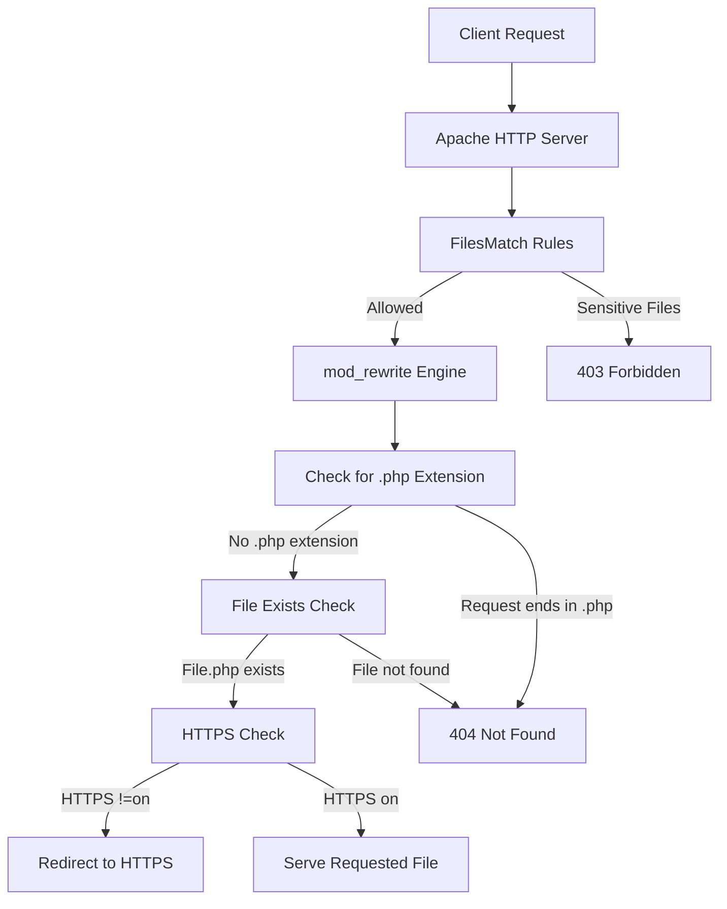
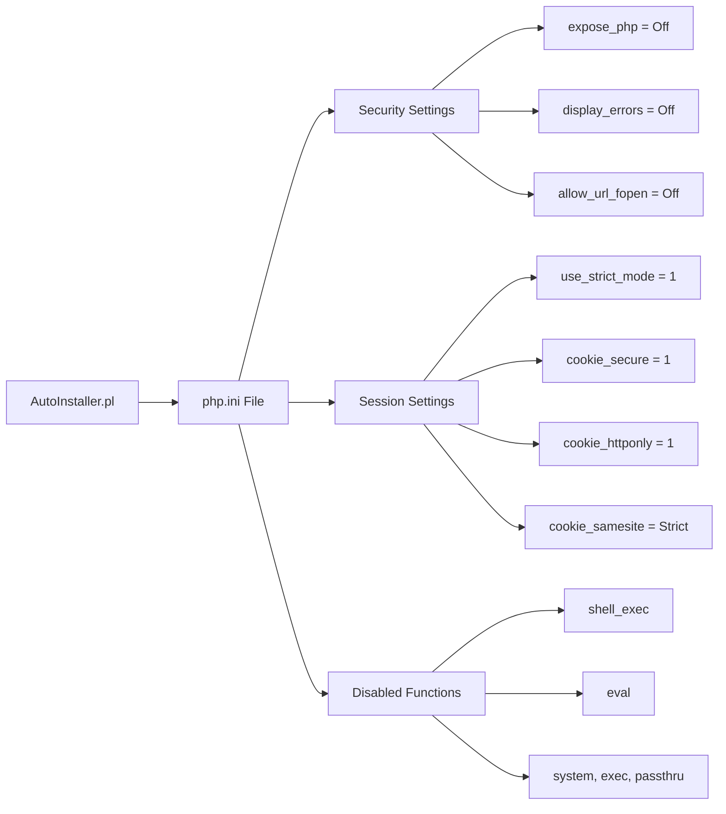
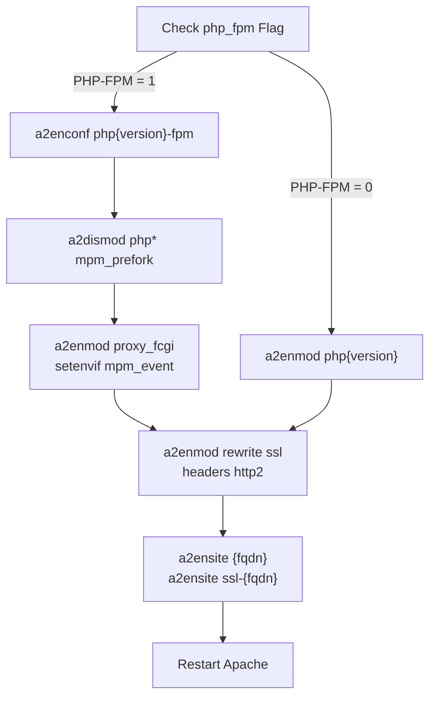
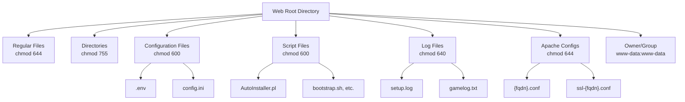
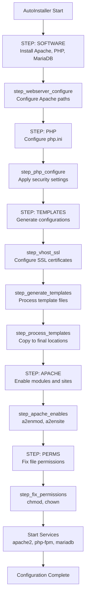

# Web Server Setup

<details>
<summary>Relevant source files</summary>

The following files were used as context for generating this wiki page:

- [.htaccess](.htaccess)
- [CONTRIBUTING.md](CONTRIBUTING.md)
- [README.md](README.md)
- [composer.json](composer.json)
- [composer.lock](composer.lock)
- [install/AutoInstaller.pl](install/AutoInstaller.pl)
- [install/templates/sql.template](install/templates/sql.template)

</details>


## Purpose and Scope

This document covers the web server configuration for Legend of Aetheria, including Apache HTTP Server setup, SSL certificate installation, URL rewriting rules, and PHP runtime configuration. This page focuses on the web server layer that receives and processes HTTP requests.

For information about the automated installation process that configures these components, see [AutoInstaller](#2.2). For database and application configuration, see [Configuration](#2.3).

---

## Apache Virtual Host Configuration

Legend of Aetheria requires two Apache virtual host configurations: a non-SSL configuration on port 80 (which redirects to HTTPS) and an SSL-enabled configuration on port 443.

### Virtual Host File Locations

The AutoInstaller generates virtual host configuration files in the Apache sites-available directory:

- **Non-SSL**: `/etc/apache2/sites-available/{fqdn}.conf`
- **SSL**: `/etc/apache2/sites-available/ssl-{fqdn}.conf`

These paths are configured in [install/AutoInstaller.pl:493-494]().

### Non-SSL Virtual Host Structure

```apacheconf
<VirtualHost {fqdn}:80>
    ServerName {fqdn}
    ServerAlias {fqdn}
    ServerAdmin {admin_email}
    DocumentRoot {web_root}

    LogLevel info ssl:warn
    ErrorLog ${APACHE_LOG_DIR}/{fqdn}-error.log
    CustomLog ${APACHE_LOG_DIR}/{fqdn}-access.log combined

    # HTTP to HTTPS redirection (added after SSL is configured)
    RewriteEngine on
    RewriteCond %{SERVER_NAME} ={fqdn}
    RewriteRule ^ https://%{SERVER_NAME}%{REQUEST_URI} [END,NE,R=permanent]
</VirtualHost>
```

The HTTP-to-HTTPS redirection is conditionally added based on SSL enablement and the `redir_status` configuration flag [install/AutoInstaller.pl:546-555]().

### SSL Virtual Host Structure

```apacheconf
<IfModule mod_ssl.c>
    <VirtualHost {fqdn}:443>
        ServerName {fqdn}
        ServerAlias {fqdn}
        ServerAdmin {admin_email}
        DocumentRoot {web_root}
        
        # Optional HTTP/2 support
        Protocols h2 http/1.1

        LogLevel info ssl:warn
        ErrorLog ${APACHE_LOG_DIR}/{fqdn}-error.log
        CustomLog ${APACHE_LOG_DIR}/{fqdn}-access.log combined

        SSLCertificateFile {ssl_fullcer}
        SSLCertificateKeyFile {ssl_privkey}
        
        # HSTS header for security
        Header always set Strict-Transport-Security "max-age=63072000"
    </VirtualHost>
</IfModule>
```

The SSL virtual host includes HSTS (HTTP Strict Transport Security) headers with a max-age of 63072000 seconds (2 years), forcing browsers to always use HTTPS for the domain.

**Sources:** [install/AutoInstaller.pl:489-507](), [README.md:89-183]()

---

## SSL Certificate Setup

Legend of Aetheria supports three methods for SSL certificate installation: self-signed certificates, Let's Encrypt certificates, and manually provided certificates.

### Self-Signed Certificates

The AutoInstaller can generate self-signed certificates using OpenSSL:

```bash
openssl req -x509 -nodes -days 365 -newkey rsa:2048 \
  -keyout /etc/ssl/private/{fqdn}.key \
  -out /etc/ssl/certs/{fqdn}.crt \
  -subj '/CN={fqdn}/O={fqdn}/C=ZA' \
  -batch
```

This command is executed in [install/AutoInstaller.pl:569]() and generates:
- Certificate: `/etc/ssl/certs/{fqdn}.crt`
- Private key: `/etc/ssl/private/{fqdn}.key`

Self-signed certificates are suitable for development and testing environments but will trigger browser warnings in production.

### Let's Encrypt Certificates

For production deployments, Let's Encrypt provides free, trusted SSL certificates via Certbot:

```bash
certbot -d {fqdn} --apache
```

The AutoInstaller sets the `run_certbot` flag when this option is selected [install/AutoInstaller.pl:597-599](). Certbot automatically:
- Obtains the certificate from Let's Encrypt
- Configures Apache virtual hosts
- Sets up automatic renewal

Certificate files are stored in `/etc/letsencrypt/live/{domain}/`:
- `fullchain.pem` - Certificate chain
- `privkey.pem` - Private key

### Manual Certificate Installation

For manually provided certificates, the installer prompts for certificate and private key paths [install/AutoInstaller.pl:584-595]() and validates that both files exist before proceeding.

### SSL Configuration Variables

The SSL configuration is stored in the following variables:
- `ssl_enabled` - Boolean flag indicating SSL is configured
- `ssl_fullcer` - Path to certificate file
- `ssl_privkey` - Path to private key file
- `redir_status` - Whether HTTP-to-HTTPS redirection is enabled

**Sources:** [install/AutoInstaller.pl:536-603](), [README.md:213-236]()

---

## URL Rewriting and .htaccess Configuration

The `.htaccess` file in the web root controls URL rewriting, file access security, and HTTPS enforcement.

### Request Flow Diagram



### File Access Control

The `.htaccess` file blocks access to sensitive files using `FilesMatch`:

```apacheconf
<FilesMatch "\.env$|.*\.ready|.*\.template$|.*\.pl$|.*\.ini$|.*\.log$|.*\.sh$">
    Require all denied
</FilesMatch>
```

This regular expression blocks access to:
- `.env` - Environment configuration
- `.ready` files - Processed templates
- `.template` files - Template sources
- `.pl` files - Perl scripts
- `.ini` files - Configuration files
- `.log` files - Log files
- `.sh` files - Shell scripts

**Source:** [.htaccess:2-4]()

### Clean URL Rewriting

The rewrite engine enables clean URLs by hiding the `.php` extension:

```apacheconf
RewriteEngine on
RewriteCond %{REQUEST_FILENAME} !-d
RewriteCond %{REQUEST_FILENAME}.php -f
RewriteRule ^(.*)$ $1.php
```

This configuration:
1. Checks if the requested path is NOT a directory (`!-d`)
2. Checks if a corresponding `.php` file exists (`-f`)
3. Internally rewrites the request to add `.php`

For example, `/game` is internally rewritten to `/game.php`.

### PHP Extension Blocking

Direct requests to `.php` files return 404:

```apacheconf
RewriteCond %{THE_REQUEST} "^[^ ]* .*?\.php[? ].*$"
RewriteRule .* - [L,R=404]
```

This prevents direct access like `https://example.com/game.php`, forcing users to use clean URLs.

**Source:** [.htaccess:6-18]()

### HTTPS Enforcement

All HTTP requests are redirected to HTTPS:

```apacheconf
RewriteCond %{HTTPS} !=on [NC]
RewriteRule ^.*$ https://%{SERVER_NAME}%{REQUEST_URI} [R,L]
```

This rule checks if `HTTPS` is not equal to "on" and performs a 302 redirect to the HTTPS version of the URL.

**Source:** [.htaccess:20-21]()

---

## PHP Configuration

PHP security and session settings are configured in `php.ini` to harden the application against common vulnerabilities.

### PHP Configuration File Locations

The AutoInstaller determines the correct `php.ini` path based on the PHP mode:

- **PHP-FPM**: `/etc/php/{version}/fpm/php.ini`
- **Apache Module**: `/etc/php/{version}/apache2/php.ini`

This logic is implemented in [install/AutoInstaller.pl:794-803]().

### PHP Configuration Diagram



### Security Settings

The following security settings are applied to `php.ini`:

| Setting | Value | Purpose |
|---------|-------|---------|
| `expose_php` | `Off` | Hide PHP version in headers |
| `error_reporting` | `E_NONE` | Disable error reporting to users |
| `display_errors` | `Off` | Don't display errors in browser |
| `display_startup_errors` | `Off` | Don't display startup errors |
| `allow_url_fopen` | `Off` | Prevent remote file inclusion |
| `allow_url_include` | `Off` | Prevent remote code execution |

**Source:** [install/AutoInstaller.pl:713-718]()

### Session Configuration

Session security is critical for authentication. The following settings are configured:

| Setting | Value | Purpose |
|---------|-------|---------|
| `session.gc_maxlifetime` | `600` | Session timeout (10 minutes) |
| `session.auto_start` | `1` | Automatically start sessions |
| `session.cookie_domain` | `{fqdn}` | Restrict cookies to domain |
| `session.use_strict_mode` | `1` | Reject uninitialized session IDs |
| `session.use_cookies` | `1` | Store session ID in cookies |
| `session.cookie_lifetime` | `14400` | Cookie lifetime (4 hours) |
| `session.cookie_secure` | `1` | Only send cookies over HTTPS |
| `session.cookie_httponly` | `1` | Prevent JavaScript access |
| `session.cookie_samesite` | `Strict` | CSRF protection |
| `session.cache_expire` | `30` | Cache expiration (30 minutes) |

**Source:** [install/AutoInstaller.pl:719-792]()

### Disabled Functions

The AutoInstaller disables dangerous PHP functions that could be exploited for remote code execution or system compromise:

```ini
disable_functions = apache_child_terminate, apache_setenv, chdir, chmod, 
  eval, exec, passthru, phpinfo, popen, proc_open, shell_exec, system, 
  posix_kill, posix_setuid, ftp_exec, mysql_pconnect, ...
```

Notable disabled functions include:
- **Code Execution**: `eval`, `exec`, `passthru`, `shell_exec`, `system`
- **Process Control**: `proc_open`, `proc_close`, `proc_terminate`
- **System Information**: `phpinfo`, `php_uname`
- **File Operations**: `chmod`, `mkdir`, `rmdir`
- **Network Operations**: `ftp_connect`, `ftp_exec`, `ftp_get`, `ftp_put`

**Source:** [install/AutoInstaller.pl:721-782](), [README.md:249]()

---

## Apache Modules

Legend of Aetheria requires specific Apache modules for URL rewriting, SSL, and PHP processing.

### Required Modules Table

| Module | Purpose | Required |
|--------|---------|----------|
| `mod_rewrite` | URL rewriting for clean URLs | Yes |
| `mod_ssl` | HTTPS/SSL support | Yes |
| `mod_headers` | HTTP header manipulation (HSTS) | Yes |
| `mod_php{version}` | PHP processing (Apache module mode) | Conditional |
| `mod_proxy_fcgi` | PHP-FPM communication | Conditional |
| `mod_setenvif` | Environment variable setting | Conditional |
| `mpm_event` | Event-driven MPM for PHP-FPM | Conditional |
| `mpm_prefork` | Process-based MPM for mod_php | Conditional |

### PHP-FPM vs mod_php Configuration

The AutoInstaller supports two PHP processing modes:

#### PHP-FPM Mode (Recommended)

When PHP-FPM is enabled [install/AutoInstaller.pl:465-470]():

```bash
# Enable PHP-FPM configuration
a2enconf php8.4-fpm

# Disable conflicting modules
a2dismod php* mpm_prefork

# Enable required modules
a2enmod proxy_fcgi setenvif mpm_event headers http2 ssl rewrite
```

PHP-FPM uses the event-driven `mpm_event` module for better performance and scalability.

**Source:** [install/AutoInstaller.pl:666-676]()

#### Apache Module Mode

When using mod_php:

```bash
# Enable PHP module
a2enmod php8.4 headers http2 ssl rewrite
```

This mode uses the process-based `mpm_prefork` module and loads PHP directly into Apache.

**Source:** [install/AutoInstaller.pl:674-676]()

### Module Enabling Process

The AutoInstaller enables modules in the `step_apache_enables` function:



The module enabling commands are executed in [install/AutoInstaller.pl:659-707]().

**Sources:** [install/AutoInstaller.pl:659-707](), [README.md:193-203]()

---

## File Permissions

Proper file permissions are critical for security and functionality. The AutoInstaller sets permissions in the `step_fix_permissions` function.

### Permission Structure



### Permission Settings by File Type

#### General Baseline
All files and directories receive baseline permissions:
```bash
find {web_root} -type f -exec chmod 644 {} +
find {web_root} -type d -exec chmod 755 {} +
```

**Source:** [install/AutoInstaller.pl:610-613]()

#### Configuration Files (600)
Restricted to owner-only access:
- `{web_root}/.env`
- `{web_root}/install/config.ini`
- `{web_root}/install/config.ini.default`

**Source:** [install/AutoInstaller.pl:616-619]()

#### Script Files (600)
Executable scripts restricted to owner:
- `{web_root}/install/AutoInstaller.pl`
- All files in `{web_root}/scripts/`

**Source:** [install/AutoInstaller.pl:622-630]()

#### Log Files (640)
Readable by owner and group:
- `{web_root}/system/logs/setup.log`
- `{web_root}/system/logs/gamelog.txt`

**Source:** [install/AutoInstaller.pl:633-635]()

#### Apache Configuration Files (644)
Readable by all, writable by owner:
- `{apache_directory}/sites-available/{fqdn}.conf`
- `{apache_directory}/sites-available/ssl-{fqdn}.conf`

**Source:** [install/AutoInstaller.pl:638-642]()

#### Template Files (600)
Template files are restricted during processing:
- All files in `{web_root}/install/templates/`

**Source:** [install/AutoInstaller.pl:645-651]()

### Ownership

All web-accessible files are owned by the Apache user (typically `www-data`):

```bash
chown -R www-data:www-data {web_root}
```

This user is configured in [install/AutoInstaller.pl:497]() and applied in [install/AutoInstaller.pl:655]().

**Sources:** [install/AutoInstaller.pl:605-657]()

---

## Configuration Workflow

The following diagram shows how the AutoInstaller orchestrates web server configuration:



The workflow is implemented across multiple functions in the AutoInstaller:
- `step_install_software` [install/AutoInstaller.pl:374-487]()
- `step_webserver_configure` [install/AutoInstaller.pl:489-507]()
- `step_php_configure` [install/AutoInstaller.pl:709-849]()
- `step_vhost_ssl` [install/AutoInstaller.pl:536-603]()
- `step_generate_templates` [install/AutoInstaller.pl:861-894]()
- `step_process_templates` [install/AutoInstaller.pl:896-950]()
- `step_apache_enables` [install/AutoInstaller.pl:659-707]()
- `step_fix_permissions` [install/AutoInstaller.pl:605-657]()
- `step_start_services` [install/AutoInstaller.pl:952-970]()

**Sources:** [install/AutoInstaller.pl:195-299]()