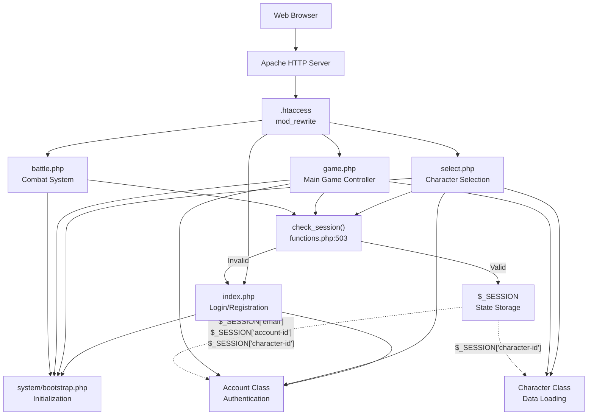
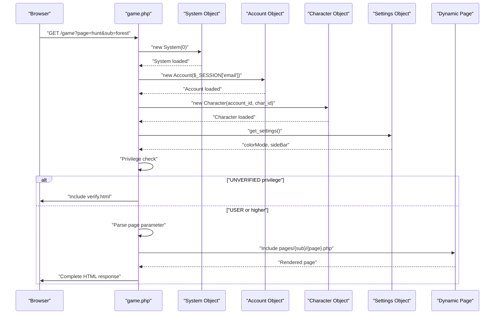
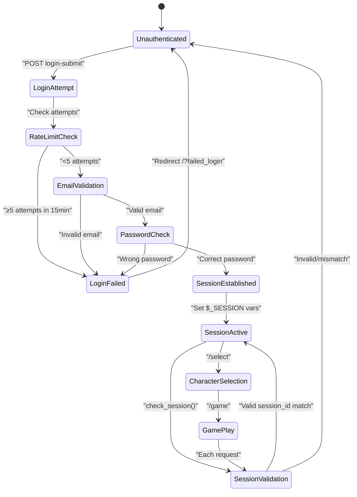
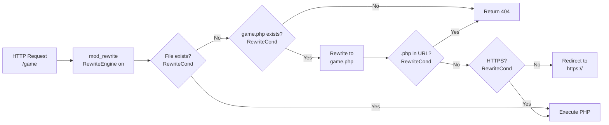
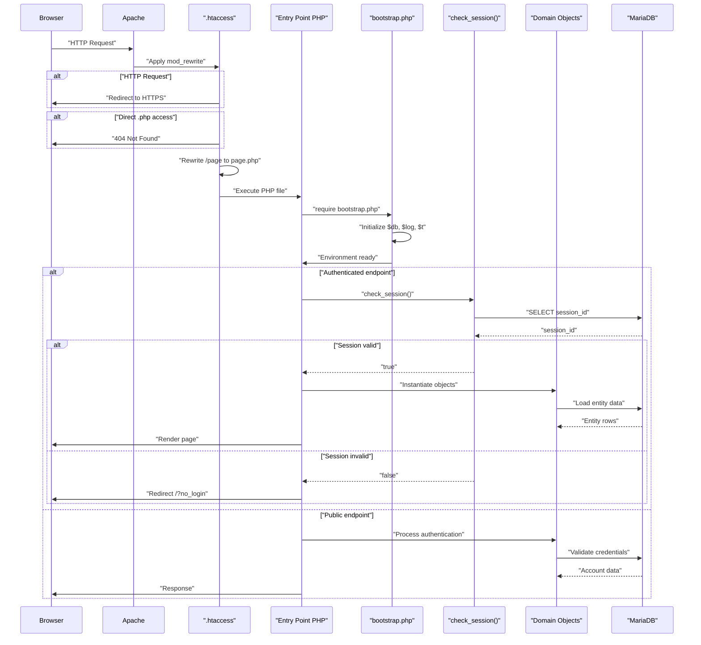

# Core Application

<details>
<summary>Relevant source files</summary>

The following files were used as context for generating this wiki page:

- [.htaccess](.htaccess)
- [functions.php](functions.php)
- [game.php](game.php)
- [html/footers.html](html/footers.html)
- [index.php](index.php)
- [js/menus.js](js/menus.js)
- [select.php](select.php)

</details>


The Core Application layer consists of the primary PHP entry points that handle all user interactions with Legend of Aetheria. This layer orchestrates request processing, session validation, authentication flows, and dynamic page rendering. It sits between the web server layer (Apache + `.htaccess`) and the domain logic layer (Account, Character, Monster classes).

For information about installation and web server configuration, see [Installation & Setup](#2). For domain logic and game mechanics, see [Game Systems](#5). For database persistence, see [Database & Data Layer](#6).

## Overview

The Core Application layer is implemented through four primary PHP controllers:

| Controller | Path | Purpose | Session Required |
|------------|------|---------|------------------|
| `index.php` | `/` | Authentication (login/registration) | No |
| `select.php` | `/select` | Character slot management | Yes |
| `game.php` | `/game` | Main game interface and page routing | Yes |
| `battle.php` | `/battle` | Combat encounter processing | Yes |

All authenticated controllers validate sessions via `check_session()` [functions.php:503-526]() before executing business logic. Failed session validation redirects users to `index.php` with error parameters.

## Entry Point Architecture

**Diagram: Core Application Entry Points and Flow**



**Sources:** [game.php:1-39](), [index.php:1-11](), [select.php:1-16](), [functions.php:503-526]()

### index.php - Authentication Controller

`index.php` handles user authentication and initial account/character creation. It processes two primary POST actions: `login-submit` and `register-submit`.

**Login Flow:**
1. Rate limiting check: Maximum 5 attempts per IP per 15 minutes [index.php:18-32]()
2. Email validation via `check_valid_email()` [index.php:34-38]()
3. Account existence check via `Account::checkIfExists($email)` [index.php:40]()
4. Password verification using `password_verify()` [index.php:46]()
5. Session establishment with account and IP data [index.php:50-55]()
6. Session ID storage in database [index.php:57]()
7. Redirect to `/select` for character selection [index.php:60]()

**Registration Flow:**
1. Email validation [index.php:105-108]()
2. Password matching check [index.php:115]()
3. Abuse detection for multi-signup [index.php:122-125]()
4. Attribute point validation (must equal `STARTING_ASSIGNABLE_AP`) [index.php:113]()
5. Tampering detection for stat manipulation [index.php:128-132]()
6. Account creation with `Account->new()` [index.php:118-145]()
7. First character creation with `Character->new()` [index.php:146-165]()
8. Race-based stat adjustment [index.php:162]()

**Sources:** [index.php:12-175]()

### select.php - Character Slot Manager

`select.php` manages the three character slots available per account. It supports three operations: `load`, `new`, and `delete`, determined by parsing POST parameter patterns.

**Operation Detection Pattern:**
```
select-(load|delete|new)-(\d+)
```
This regex extracts the action type and slot number (1-3) from POST keys [select.php:32]().

**Load Operation:**
- Queries `char_slot{N}` column from accounts table [select.php:43-44]()
- Sets session variables: `focused-slot`, `character-id`, `name` [select.php:48-50]()
- Redirects to `/game?page=sheet&sub=character` [select.php:51]()

**New Operation:**
- Validates attribute point allocation [select.php:63]()
- Detects stat tampering (values < 10) [select.php:65-72]()
- Gets next available character ID via `getNextTableID()` [select.php:61]()
- Updates account's `char_slot{N}` with new character ID [select.php:75-76]()
- Creates character with `Character->new($slot)` [select.php:78-87]()

**Delete Operation:**
- Retrieves character ID from account's slot [select.php:93-94]()
- Clears slot by setting to NULL [select.php:97-98]()
- Deletes character row from database [select.php:101-102]()
- Logs deletion with account ID, character ID, and slot [select.php:104-111]()

**Sources:** [select.php:17-116]()

### game.php - Main Game Controller

`game.php` is the primary authenticated interface, handling all gameplay screens through dynamic page inclusion. It establishes the game environment by instantiating core objects and loading user preferences.

**Initialization Sequence:**



**Sources:** [game.php:18-39](), [game.php:54-84]()

**Object Instantiation:**
- `System` object loads global sheet data [game.php:18-19]()
- `LoAllama` AI wrapper initialized with model `smollm2:360m` [game.php:20]()
- `Account` loaded from session email [game.php:22]()
- `Character` loaded from account ID and session character ID [game.php:23]()
- Settings retrieved for color mode and sidebar type [game.php:25-28]()

**Privilege Gating:**
If `account->get_privileges()` returns `Privileges::UNVERIFIED`, execution halts and displays verification page [game.php:56-59]().

**Dynamic Page Routing:**
Page selection uses sanitized GET parameters:
```php
$requested_page = preg_replace('/[^a-z-]+/', '', $_GET['page']);
```
[game.php:66]()

Path construction supports sub-directories:
- With `sub` parameter: `pages/{sub}/{page}.php` [game.php:71]()
- Without `sub` parameter: Defaults to `pages/character/sheet.php` [game.php:73]()

File existence validation prevents directory traversal [game.php:77-81]().

**Sources:** [game.php:18-39](), [game.php:54-84]()

### battle.php - Combat Processor

While not included in the provided files, `battle.php` handles asynchronous combat operations. It processes attack/defend actions and returns battle log HTML fragments for AJAX updates.

## Session Management

**Diagram: Session Lifecycle and Validation**



**Sources:** [index.php:12-81](), [functions.php:503-526]()

### Session Variables

Upon successful authentication, `index.php` establishes these session variables:

| Variable | Type | Purpose | Set At |
|----------|------|---------|--------|
| `$_SESSION['logged-in']` | int | Authentication flag (1 = authenticated) | [index.php:50]() |
| `$_SESSION['email']` | string | Account email identifier | [index.php:51]() |
| `$_SESSION['account-id']` | int | Account primary key | [index.php:52]() |
| `$_SESSION['selected-slot']` | int | Active character slot (1-3) | [index.php:53]() |
| `$_SESSION['character-id']` | int | Active character primary key | [select.php:49]() |
| `$_SESSION['name']` | string | Character display name | [select.php:50]() |
| `$_SESSION['focused-slot']` | int | Currently focused slot | [select.php:48]() |
| `$_SESSION['ip']` | string | Client IP address | [index.php:54]() |
| `$_SESSION['last_activity']` | int | Unix timestamp of last action | [index.php:55]() |
| `$_SESSION['csrf-token']` | string | CSRF protection token | Generated via [functions.php:535-539]() |

**Sources:** [index.php:50-55](), [select.php:48-50](), [functions.php:535-539]()

### check_session() Implementation

The `check_session()` function validates session integrity through a three-step process:

**Step 1: Presence Check**
```php
if (!isset($_SESSION['logged-in']) || $_SESSION['logged-in'] != 1) {
    return false;
}
```
[functions.php:506-508]()

**Step 2: Database Session ID Retrieval**
```php
$sql_query = "SELECT `session_id` FROM {$t['accounts']} WHERE `id` = ?";
$result = $db->execute_query($sql_query, [ $_SESSION['account-id'] ]);
```
[functions.php:510-511]()

**Step 3: Session ID Comparison**
```php
if ($session != session_id()) {
    $log->warning("Session ID in db doesn't match browser session id", 
        [ 'SessionDB' => $session, 'SessionBrowser' => session_id() ]);
    return false;
}
```
[functions.php:520-523]()

This prevents session hijacking by verifying that the browser's session ID matches the database-stored session ID from login.

**Sources:** [functions.php:503-526]()

### CSRF Protection

CSRF tokens are generated using cryptographically secure random bytes with a signature marker:

```php
$csrf = bin2hex(random_bytes(14)) . 'L04D' . bin2hex(random_bytes(14));
```
[functions.php:537]()

Token structure: `[28 hex chars]L04D[28 hex chars]` = 60 character token with embedded signature.

**Token Validation:**
The `check_csrf()` function compares the submitted token against `$_SESSION['csrf-token']`. On mismatch, it destroys the session and redirects to the login page [functions.php:550-559]().

**Sources:** [functions.php:535-559]()

## URL Routing System

**Diagram: Apache mod_rewrite Flow**



**Sources:** [.htaccess:6-22]()

### .htaccess Rules

The `.htaccess` file implements four primary security and routing functions:

**1. File Access Protection**
```apache
<FilesMatch "\.env$|.*\.ready|.*\.template$|.*\.pl$|.*\.ini$|.*\.log$|.*\.sh$">
    Require all denied
</FilesMatch>
```
[.htaccess:2-4]()

Blocks direct access to configuration files, scripts, templates, and logs.

**2. Extension Hiding**
```apache
RewriteCond %{REQUEST_FILENAME} !-d
RewriteCond %{REQUEST_FILENAME}.php -f
RewriteRule ^(.*)$ $1.php
```
[.htaccess:8-10]()

Allows clean URLs: `/game` → `game.php`, `/select` → `select.php`

**3. PHP Extension Blocking**
```apache
RewriteCond %{THE_REQUEST} "^[^ ]* .*?\.php[? ].*$"
RewriteRule .* - [L,R=404]
```
[.htaccess:13-14]()

Returns 404 for direct `.php` access, preventing extension enumeration.

**4. HTTPS Enforcement**
```apache
RewriteCond %{HTTPS} !=on [NC]
RewriteRule ^.*$ https://%{SERVER_NAME}%{REQUEST_URI} [R,L]
```
[.htaccess:20-21]()

Redirects all HTTP requests to HTTPS.

**Sources:** [.htaccess:2-22]()

### game.php Page Parameter System

`game.php` implements a two-level routing system using `page` and `sub` GET parameters:

**Parameter Sanitization:**
```php
$requested_page = preg_replace('/[^a-z-]+/', '', $_GET['page']);
$requested_sub = preg_replace('/[^a-z-]+/', '', $_GET['sub']);
```
[game.php:66,70]()

Only lowercase letters and hyphens are permitted, preventing path traversal attacks.

**Path Construction Logic:**

| Parameters | Path | Example |
|------------|------|---------|
| `page` only | `pages/character/sheet.php` | Default fallback |
| `page` + `sub` | `pages/{sub}/{page}.php` | `/game?page=hunt&sub=forest` → `pages/forest/hunt.php` |

**File Existence Check:**
```php
if (file_exists($page_string)) {
    include "$page_string";
} else {
    include 'pages/character/sheet.php';
}
```
[game.php:77-81]()

Defaults to character sheet if requested page doesn't exist, preventing fatal errors.

**Sources:** [game.php:61-84]()

## Bootstrap and Initialization

Every entry point includes a common bootstrap sequence:

```php
require_once "vendor/autoload.php";
require_once "system/constants.php";
require_once SYSTEM_DIRECTORY . "/bootstrap.php";
```

This pattern appears in:
- [game.php:3-5]()
- [index.php:2-4]()
- [select.php:3-4]()

**Bootstrap Responsibilities:**
1. Composer autoloader registration (`vendor/autoload.php`)
2. Global constants definition (`system/constants.php`)
3. Database connection initialization (`system/bootstrap.php`)
4. Session configuration and startup
5. Global objects (`$db`, `$log`, `$t` table names)

The bootstrap establishes the execution environment before any business logic executes.

**Sources:** [game.php:3-5](), [index.php:2-4](), [select.php:3-4]()

## Request Flow Summary

**Diagram: Complete Request Processing Pipeline**



**Sources:** [.htaccess:6-22](), [game.php:1-39](), [index.php:1-81](), [select.php:1-16](), [functions.php:503-526]()

## Error Handling and Redirects

The Core Application uses URL parameter-based error signaling for user feedback:

| Parameter | Trigger | Source |
|-----------|---------|--------|
| `?rate_limited` | ≥5 login attempts in 15 minutes | [index.php:30]() |
| `?invalid_email` | Failed email validation | [index.php:36]() |
| `?failed_login` | Incorrect password | [index.php:75]() |
| `?do_register` | Login attempt with non-existent account | [index.php:79]() |
| `?account_exists` | Registration with existing email | [index.php:172]() |
| `?register_success` | Successful account creation | [index.php:167]() |
| `?no_login` | Invalid session on protected endpoint | [select.php:119]() |
| `?csrf_fail` | CSRF token mismatch | [functions.php:554]() |

These parameters are parsed by the frontend to display toast notifications via `toasts.js`.

**Sources:** [index.php:30-172](), [select.php:119](), [functions.php:554]()

## Security Considerations

The Core Application implements multiple security layers:

**Input Sanitization:**
- Email validation via `check_valid_email()` [functions.php:251-259]()
- Regex-based parameter filtering for `page` and `sub` [game.php:66,70]()
- Race validation via `validate_race()` [functions.php:431-444]()
- Avatar validation via `validate_avatar()` [functions.php:454-473]()

**Rate Limiting:**
- Login attempts: 5 per IP per 15 minutes [index.php:18-32]()
- Failed login tracking per account [index.php:64-73]()
- Account locking after 10 failed attempts [index.php:69-73]()

**Abuse Detection:**
- Multi-signup detection via `check_abuse(AbuseType::MULTISIGNUP)` [index.php:122-125]()
- Stat tampering detection via `check_abuse(AbuseType::TAMPERING)` [index.php:128-132](), [select.php:65-72]()
- Automatic banning on threshold violations [index.php:123](), [select.php:70]()

**Session Security:**
- Database-backed session ID validation [functions.php:510-523]()
- CSRF token generation and verification [functions.php:535-559]()
- IP address logging [index.php:54]()

**Sources:** [index.php:18-132](), [select.php:65-72](), [functions.php:251-559](), [game.php:66-70]()