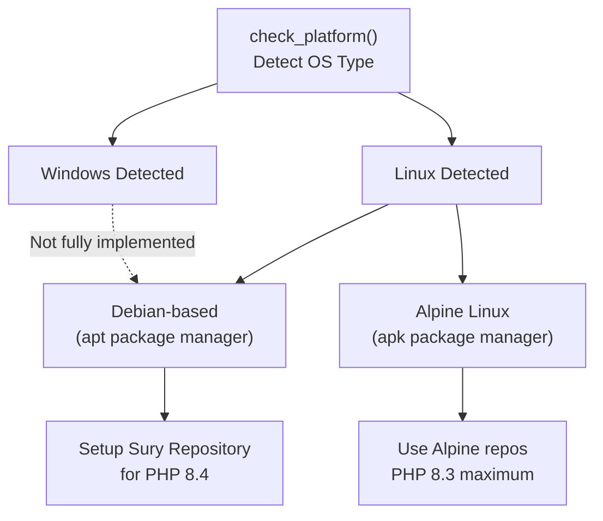
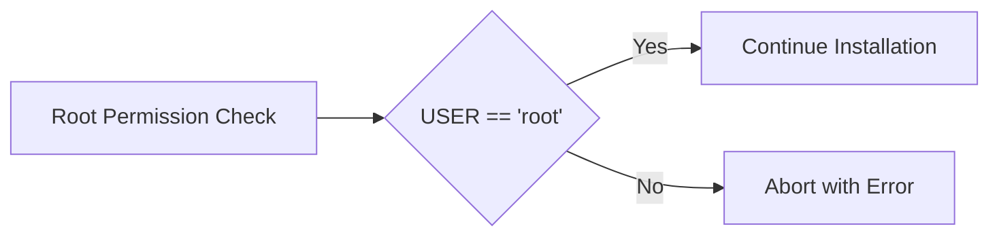
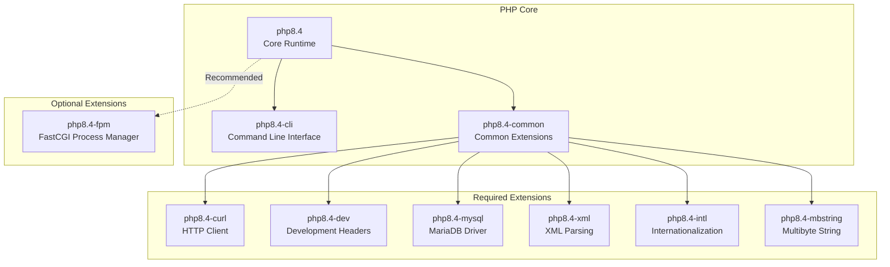
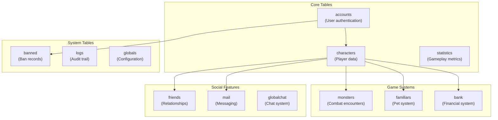
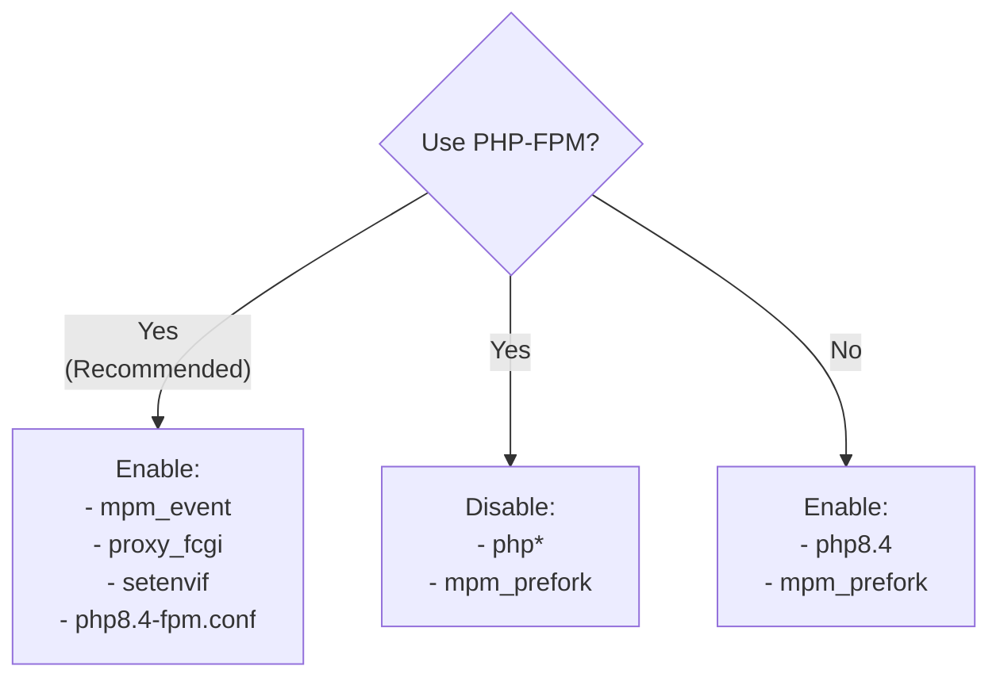
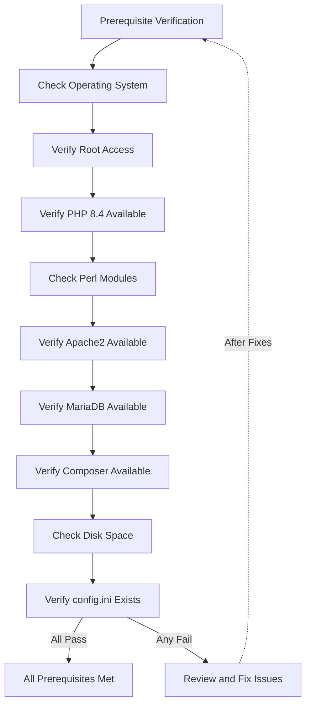

# Prerequisites

<details>
<summary>Relevant source files</summary>

The following files were used as context for generating this wiki page:

- [CONTRIBUTING.md](CONTRIBUTING.md)
- [README.md](README.md)
- [composer.json](composer.json)
- [composer.lock](composer.lock)
- [install/AutoInstaller.pl](install/AutoInstaller.pl)
- [install/templates/sql.template](install/templates/sql.template)

</details>


This page documents the system requirements, software dependencies, and preparation steps required before installing Legend of Aetheria. All prerequisites must be satisfied before proceeding with the AutoInstaller or manual installation process.

For information about the actual installation process, see [AutoInstaller](#2.2). For post-installation configuration details, see [Configuration](#2.3) and [Web Server Setup](#2.4).

---

## Purpose and Scope

This document covers:
- Operating system compatibility and requirements
- Required software packages and their minimum versions
- System resource recommendations
- Pre-installation preparation steps
- Package manager setup (Sury repository for PHP 8.4)

This page does **not** cover the installation process itself, which is documented in [AutoInstaller](#2.2).

---

## Operating System Requirements

Legend of Aetheria supports the following operating systems:

| Operating System | Distributions Tested | Architecture | Status |
|-----------------|---------------------|--------------|---------|
| **Linux** | Debian 11+, Ubuntu 20.04+, Kali Linux | x86_64, ARM64 | Fully Supported |
| **Linux** | Alpine Linux | x86_64 | Supported (PHP 8.3 only) |
| **Windows** | Windows 10+ with WSL2 | x86_64 | Experimental |

**Recommended**: Debian 12 (Bookworm) or Ubuntu 24.04 LTS (Noble) on x86_64 architecture.

### Distribution Detection



**Sources**: [install/AutoInstaller.pl:375-433]()

---

## System Resource Requirements

### Minimum Requirements

| Resource | Minimum | Recommended | Purpose |
|----------|---------|-------------|---------|
| **CPU** | 2 cores | 4+ cores | Apache, PHP-FPM, MariaDB concurrent processing |
| **RAM** | 2 GB | 4+ GB | PHP processes, database caching, Apache workers |
| **Disk Space** | 5 GB | 10+ GB | Application files, logs, database, composer dependencies |
| **Network** | 100 Mbps | 1 Gbps | User connections, external API calls (OpenAI) |

### User Permissions

The AutoInstaller **requires root access** to:
- Install system packages via `apt`, `apk`, or similar package managers
- Configure Apache virtual hosts and modules
- Modify PHP configuration files (`php.ini`)
- Set up MariaDB users and databases
- Configure SSL certificates
- Set file permissions and ownership



**Sources**: [install/AutoInstaller.pl:116-119](), [README.md:36-48]()

---

## Core Software Requirements

### PHP Version and Extensions

Legend of Aetheria requires **PHP 8.4** with the following extensions:



**PHP Version Detection and Installation**:

The AutoInstaller automatically detects the installed PHP version or installs PHP 8.4 if not found. Alpine Linux users will receive PHP 8.3 as the maximum available version.

**Sources**: [install/AutoInstaller.pl:395-433](), [install/AutoInstaller.pl:435-463](), [README.md:69-77]()

### Sury Repository Setup

For Debian and Ubuntu systems, the Sury repository provides PHP 8.4 packages:

| Distribution | Setup Script | Repository File |
|-------------|-------------|-----------------|
| Ubuntu | `sury_setup_ubnt.sh` | `/etc/apt/sources.list.d/ondrej-ubuntu-php-noble.sources` |
| Debian/Kali | `sury_setup_deb.sh` | `/etc/apt/sources.list.d/php.list` |

**Sources**: [install/AutoInstaller.pl:375-391](), [README.md:40-43]()

---

## Perl Requirements (AutoInstaller Only)

The AutoInstaller script requires Perl 5 with the following CPAN modules:

### Required Perl Modules

| Module | Version | Purpose |
|--------|---------|---------|
| `Config::IniFiles` | Latest | Parse and write `config.ini` configuration files |
| `Term::ReadKey` | Latest | Secure password input without echo |
| `File::Path` | Core | Create and remove directory trees |
| `Getopt::Long` | Core | Command-line argument parsing |
| `Data::Dumper` | Core | Debug configuration data structures |
| `File::Find` | Core | Traverse directory trees |
| `File::Copy` | Core | Copy files between locations |
| `Cwd` | Core | Get current working directory |
| `File::Basename` | Core | Parse file paths |

### Bootstrap Script

The `bootstrap.sh` script automatically installs Perl CPAN dependencies and sets up Sury repositories:

```bash
cd install/scripts
sudo bash bootstrap.sh
```

**Sources**: [install/AutoInstaller.pl:9-18](), [README.md:40-43]()

---

## Database Requirements

### MariaDB/MySQL Version

| Database | Minimum Version | Recommended Version | Status |
|----------|----------------|---------------------|---------|
| **MariaDB** | 10.5+ | 11.8+ | Primary Support |
| **MySQL** | 8.0+ | 8.4+ | Compatible |

### Database Configuration

The AutoInstaller creates:
- Database name: `db_loa` (configurable via `config.ini`)
- Database user: `user_loa` (configurable)
- Database password: 15-character random string (auto-generated)
- Database host: `127.0.0.1` (default)
- Database port: `3306` (default)

### Required Database Features

- **Storage Engine**: InnoDB (used for all tables)
- **Character Set**: utf8mb4
- **Collation**: utf8mb4_general_ci
- **Privileges**: `SELECT`, `INSERT`, `UPDATE`, `DELETE` on all game tables

### Database Tables Created

The SQL schema template creates 12 tables:



**Sources**: [install/templates/sql.template:1-312](), [install/AutoInstaller.pl:509-534]()

---

## Web Server Requirements

### Apache HTTP Server

Legend of Aetheria requires **Apache 2.4+** with the following modules:

| Module | Purpose | Required |
|--------|---------|----------|
| `mod_rewrite` | URL routing and clean URLs | Yes |
| `mod_ssl` | HTTPS support | Yes |
| `mod_headers` | Security headers (HSTS, CSP) | Yes |
| `mod_http2` | HTTP/2 protocol support | Recommended |
| `mod_php8.4` | PHP interpreter (if not using FPM) | Conditional |
| `mod_proxy_fcgi` | PHP-FPM proxy (if using FPM) | Conditional |
| `mod_setenvif` | Environment variable manipulation | Conditional |
| `mod_mpm_event` | Multi-processing module (for FPM) | Conditional |
| `mod_mpm_prefork` | Multi-processing module (without FPM) | Conditional |

### Apache MPM Selection



**Sources**: [install/AutoInstaller.pl:465-470](), [install/AutoInstaller.pl:659-707](), [README.md:188-203]()

---

## SSL/TLS Requirements

### Certificate Options

Legend of Aetheria supports three SSL certificate configurations:

| Method | Use Case | Implementation |
|--------|----------|----------------|
| **Let's Encrypt** | Production deployment with public domain | `certbot --apache -d fqdn` |
| **Self-Signed** | Development, testing, local deployment | `openssl req -x509 -nodes -days 365` |
| **Manual Certificate** | Custom CA or existing certificate | Provide paths to `.crt` and `.key` files |

### Self-Signed Certificate Generation

The AutoInstaller can generate a self-signed certificate automatically:

```bash
openssl req -x509 -nodes -days 365 \
  -newkey rsa:2048 \
  -keyout /etc/ssl/private/fqdn.key \
  -out /etc/ssl/certs/fqdn.crt \
  -subj '/CN=fqdn/O=fqdn/C=US' \
  -batch
```

### SSL Configuration Files

| File Type | Default Location | Purpose |
|-----------|-----------------|---------|
| Certificate | `/etc/ssl/certs/fqdn.crt` | Public certificate |
| Private Key | `/etc/ssl/private/fqdn.key` | Private key |
| CA Chain | `/etc/letsencrypt/live/fqdn/fullchain.pem` | Let's Encrypt full chain |

**Sources**: [install/AutoInstaller.pl:536-603](), [README.md:213-236]()

---

## Package Manager Requirements

### Composer (PHP)

**Version**: 2.x or later

**Purpose**: Manages PHP dependencies defined in `composer.json`:

| Dependency | Version | Purpose |
|-----------|---------|---------|
| `vlucas/phpdotenv` | ^5.6.1 | `.env` file parsing |
| `monolog/monolog` | ^3.9 | Logging framework |
| `phpmailer/phpmailer` | ^7.0.0 | Email functionality |
| `composer/semver` | ^3.4 | Semantic versioning |
| `phpunit/phpunit` | ^12.1 | Unit testing |
| `symfony/serializer-pack` | ^1.3 | Object serialization |
| `symfony/serializer` | ^7.2 | Serialization components |
| `contributte/monolog` | ^0.5.2 | Monolog integration |

**Installation Location**: System-wide via `apt install composer` or downloaded during setup.

**Execution User**: The AutoInstaller runs Composer as `www-data` to ensure correct file ownership:

```bash
sudo -u www-data composer --working-dir /path/to/webroot install
```

**Sources**: [composer.json:1-31](), [install/AutoInstaller.pl:851-859]()

### NPM (Node.js)

**Version**: Node.js 16.x+ with npm 8.x+

**Purpose**: Manages frontend JavaScript dependencies (Bootstrap, jQuery, etc.)

**Note**: While not explicitly installed by the AutoInstaller, npm is required for frontend asset management as indicated by the system architecture diagrams.

---

## Additional Software

### Required Tools

| Tool | Purpose | Minimum Version |
|------|---------|----------------|
| `git` | Clone repository | 2.x |
| `openssl` | SSL certificate generation | 1.1.1+ |
| `cron` | Scheduled task execution | System cron |
| `curl` | HTTP requests, testing | 7.x |
| `certbot` | Let's Encrypt automation | 1.x |
| `python3` | Certbot dependency | 3.8+ |
| `python3-certbot-apache` | Apache Certbot plugin | Latest |
| `lsb_release` | Distribution detection (Alpine) | Latest |

**Sources**: [install/AutoInstaller.pl:435-463](), [README.md:69-77]()

---

## Pre-Installation Checklist

Before proceeding to the AutoInstaller, verify the following:

### System Preparation

- [ ] **Operating System**: Debian/Ubuntu/Alpine Linux installed and updated
- [ ] **Root Access**: Ability to execute commands as root via `sudo` or direct login
- [ ] **Internet Connection**: Active connection for downloading packages and dependencies
- [ ] **Disk Space**: At least 5 GB free space in web root directory
- [ ] **Domain Name**: FQDN configured with A/CNAME DNS records (for production)

### Pre-Installation Commands

```bash
# Update system packages
sudo apt update && sudo apt upgrade -y

# Install bootstrap dependencies
cd /path/to/LegendOfAetheria/install/scripts
sudo bash bootstrap.sh

# Verify web root directory
sudo mkdir -p /var/www/html/game
sudo chown -R www-data:www-data /var/www/html/game
```

### Configuration Files Required

Before running the AutoInstaller, ensure these files exist:

| File | Location | Purpose |
|------|----------|---------|
| `config.ini` | `install/config.ini` | Main installation configuration |
| `config.ini.default` | `install/config.ini.default` | Template configuration file |

If `config.ini` does not exist, the AutoInstaller will abort with an error.

**Sources**: [install/AutoInstaller.pl:89-102]()

### Network Prerequisites

#### DNS Configuration

For production deployments, configure DNS records before installation:

- **A Record**: Point FQDN to server's public IPv4 address
- **AAAA Record**: (Optional) Point FQDN to server's IPv6 address
- **CNAME Record**: (Alternative) Alias FQDN to another domain

#### Firewall Rules

Ensure the following ports are accessible:

| Port | Protocol | Purpose | Required |
|------|----------|---------|----------|
| 80 | TCP | HTTP (redirects to HTTPS) | Yes |
| 443 | TCP | HTTPS (main application) | Yes |
| 3306 | TCP | MariaDB (localhost only) | Internal |
| 22 | TCP | SSH (server administration) | Recommended |

**Note**: Port 3306 should **not** be exposed to the internet. MariaDB binds to `127.0.0.1` by default.

**Sources**: [install/AutoInstaller.pl:501-502](), [install/AutoInstaller.pl:513-533]()

---

## Prerequisite Verification Script



**Sources**: [install/AutoInstaller.pl:115-183]()

---

## Next Steps

Once all prerequisites are satisfied:

1. **Configure Installation**: Edit `install/config.ini` with your domain and preferences (see [Configuration](#2.3))
2. **Run AutoInstaller**: Execute `sudo perl install/AutoInstaller.pl` (see [AutoInstaller](#2.2))
3. **Post-Installation**: Configure web server, SSL, and application settings (see [Web Server Setup](#2.4))

---

## Summary

Legend of Aetheria requires:
- **Linux OS**: Debian/Ubuntu/Alpine (x86_64 or ARM64)
- **PHP 8.4**: With curl, mysql, xml, intl, mbstring extensions
- **MariaDB 10.5+**: For database storage
- **Apache 2.4+**: With mod_rewrite, mod_ssl, mod_headers
- **Perl 5**: With Config::IniFiles, Term::ReadKey for AutoInstaller
- **Composer 2.x**: For PHP dependency management
- **Root Access**: For system package installation and configuration
- **5+ GB Disk**: For application files and database
- **2+ GB RAM**: For PHP processes and MariaDB

The bootstrap script (`install/scripts/bootstrap.sh`) automates Perl module installation and Sury repository setup for Debian/Ubuntu systems.

**Sources**: [install/AutoInstaller.pl:1-2837](), [README.md:1-320](), [composer.json:1-31](), [install/templates/sql.template:1-312]()